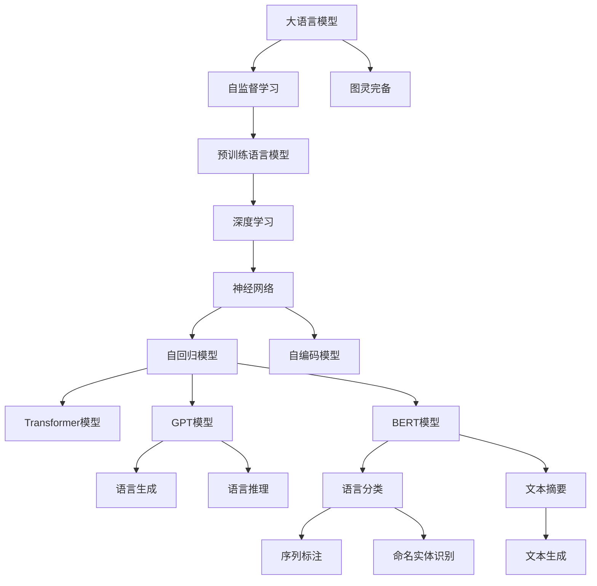

                 

# LLM:图灵完备的新形式

> 关键词：大语言模型,图灵完备,深度学习,自然语言处理,NLP,计算机科学

## 1. 背景介绍

### 1.1 问题由来

近年来，人工智能(AI)领域取得了飞速进展，尤其是自然语言处理(NLP)领域的突破。从简单的文本分类、情感分析，到复杂的对话生成、机器翻译，NLP技术正在逐步走向成熟。然而，无论是传统的统计方法，还是最近流行的深度学习范式，都存在一些固有的局限性。

- 统计方法往往依赖于大量标注数据，且对特征工程要求较高，难以实现通用模型的部署。
- 传统的深度学习方法虽在特定任务上取得显著进展，但在复杂场景下仍面临一定的局限性。
- 最近兴起的预训练语言模型(Pretrained Language Models, PLMs)，虽然在小规模数据上表现优异，但在长文本生成和复杂推理任务上，仍存在一定的挑战。

深度学习模型的发展，使得一些专家开始思考“图灵完备”(Turing completeness)的概念。图灵完备性指的是，只要给定足够的时间和计算资源，一个计算模型能够解决任何计算机可描述的问题。传统的图灵完备模型如Turing机，通过通用状态转换图，能够实现任意计算。然而，对于复杂的计算问题，Turing机也需要长时间的计算。

在深度学习模型中，尤其是最近流行的预训练语言模型，能否实现图灵完备，成为了一个备受关注的问题。如果能实现图灵完备，这些模型将具有通用的计算能力，能在任何计算问题上取得优势，显著提升AI系统的通用性和智能化程度。

本文将重点探讨大语言模型(LLMs)是否具有图灵完备性，以及如何构建具有图灵完备性的深度学习模型。通过逻辑清晰、结构紧凑、简单易懂的语言，深入解析大语言模型的核心概念和原理，希望能为深度学习爱好者和从业者提供宝贵的见解和思考。

## 2. 核心概念与联系

### 2.1 核心概念概述

为了理解大语言模型的图灵完备性，首先需要回顾一些核心概念：

- **大语言模型(LLMs)**：基于深度学习架构，尤其是Transformer模型，通过大规模无标签数据预训练获得语言表示能力的模型。
- **图灵完备性**：如果一种计算模型能够解决任意计算机可描述的问题，则称其为图灵完备的。
- **预训练语言模型(PLMs)**：如BERT、GPT-3等，通过大规模无标签文本数据进行预训练，学习到丰富的语言知识和语义表示。
- **自监督学习(Self-Supervised Learning)**：利用数据本身的结构和属性，无需标注即可学习模型参数，是深度学习中一种常用的学习方式。

这些核心概念之间的联系可以通过以下Mermaid流程图来展示：



这个流程图展示了大语言模型的核心概念及其之间的关系：

1. 大语言模型基于深度学习架构，尤其是自监督学习范式训练得到。
2. 预训练语言模型是深度学习中的一种，利用大规模无标签数据进行预训练。
3. 深度学习采用神经网络，尤其是自回归或自编码模型，如Transformer。
4. Transformer模型由GPT和BERT等子模型构成，覆盖了语言生成、语言推理、语言分类、文本摘要、序列标注、命名实体识别和文本生成等NLP任务。

这些核心概念共同构成了深度学习和大语言模型的计算框架，使得模型能够在各种NLP任务中表现出卓越的性能。

## 3. 核心算法原理 & 具体操作步骤

### 3.1 算法原理概述

大语言模型的图灵完备性，主要来源于其自回归结构和自监督学习的特性。自回归模型能够通过序列数据向前预测后文，覆盖任意长度的文本生成和推理任务。自监督学习则通过数据本身的结构特征，无需标注即可训练出模型参数，具有广泛的学习能力。

图灵完备性意味着，只要给定足够的时间和计算资源，深度学习模型能够解决任意可描述为计算问题的问题。下面我们将详细探讨大语言模型实现图灵完备性的原理。

### 3.2 算法步骤详解

大语言模型实现图灵完备性的关键步骤包括：

1. **大规模预训练**：在无标签文本数据上，利用自监督学习任务，如语言建模、掩码语言模型等，预训练出语言表示。
2. **微调与适配**：在预训练模型基础上，利用有标签数据进行微调，适配到特定任务，如分类、生成、推理等。
3. **融合先验知识**：将符号化的先验知识，如知识图谱、逻辑规则等，与神经网络模型进行融合，增强模型的泛化能力和推理能力。

以BERT模型为例，具体算法步骤包括：

1. **数据预处理**：将大规模无标签文本数据进行分词和向量化，得到词嵌入序列。
2. **模型构建**：利用Transformer模型，构建自编码框架，预训练出语言表示。
3. **微调与适配**：在有标签数据上，微调模型，适配到特定任务，如情感分析、文本分类等。
4. **融合先验知识**：将外部知识库中的实体关系等知识，与BERT模型进行融合，提升模型的推理能力。

### 3.3 算法优缺点

大语言模型实现图灵完备性的优点包括：

1. **广泛的学习能力**：自监督学习和大规模预训练，使得模型具有广泛的学习能力，能够处理各种NLP任务。
2. **高泛化能力**：利用大规模数据进行预训练，模型具备高泛化能力，能够在不同领域和场景中表现优异。
3. **高效计算**：利用深度学习架构，能够高效进行大规模计算，处理复杂计算问题。

同时，大语言模型也存在一些缺点：

1. **高计算需求**：大规模预训练和微调需要巨大的计算资源，对硬件设施要求较高。
2. **数据依赖性强**：模型性能依赖于大规模数据，数据获取和处理成本较高。
3. **可解释性不足**：深度学习模型的黑盒特性，使得模型的决策过程难以解释。

尽管存在这些局限性，但大语言模型在实现图灵完备性方面仍具备独特的优势，特别是在处理复杂NLP任务时，其性能明显优于传统方法。

### 3.4 算法应用领域

大语言模型在NLP领域的应用非常广泛，涉及语言生成、语言推理、语言分类、文本摘要、序列标注、命名实体识别和文本生成等多个方面。以下重点介绍几个典型的应用领域：

- **机器翻译**：将源语言文本翻译成目标语言。利用大语言模型，可以实现高效、高质量的翻译。
- **文本摘要**：将长文本压缩成简短摘要。大语言模型能够自动提取文本要点，生成高质量的摘要。
- **对话系统**：使机器能够与人自然对话。通过大语言模型，可以实现复杂多轮对话，提升人机交互的自然性和智能性。
- **情感分析**：对文本进行情感倾向分析，判断其情绪。大语言模型能够高效处理大规模文本数据，准确判断情感。
- **问答系统**：对自然语言问题给出答案。利用大语言模型，可以实现高效、准确的问答系统。

大语言模型在NLP领域的应用，正在逐步渗透到各个行业，为人工智能技术的落地应用提供了强有力的支持。

## 4. 数学模型和公式 & 详细讲解 & 举例说明

### 4.1 数学模型构建

大语言模型的数学模型构建，主要基于自回归模型和自监督学习任务。以BERT模型为例，其数学模型如下：

$$
\mathcal{L} = -\sum_{i=1}^N (y_i \log p(y_i|x_i) + (1-y_i) \log (1-p(y_i|x_i)))
$$

其中，$x_i$ 表示输入文本序列，$y_i$ 表示标注标签，$p(y_i|x_i)$ 表示模型在输入文本$x_i$下预测标签$y_i$的概率。

### 4.2 公式推导过程

自回归模型的概率计算过程，可以通过链式法则和条件概率公式进行推导：

$$
p(y_i|y_{<i}, x_i) = \frac{p(y_i|y_{<i}, x_i)}{p(y_{<i}|x_i)} = \frac{p(y_i|y_{<i-1}, x_i)}{p(y_{<i-1}|x_i)}
$$

对于给定的输入序列$x_i$，模型能够通过自回归的方式，计算出每个位置上的概率，最终得到输出序列$y_i$。

### 4.3 案例分析与讲解

以BERT模型为例，其自监督学习任务主要包括以下两种：

1. **掩码语言模型**：在输入序列中随机遮盖一些词，利用上下文信息预测被遮盖的词。
2. **下一句预测**：随机挑选两个句子，利用它们的前文判断它们是否为连续的句子。

这些自监督学习任务，使得BERT模型在预训练过程中能够学习到丰富的语言表示，具有较高的泛化能力和推理能力。

## 5. 项目实践：代码实例和详细解释说明

### 5.1 开发环境搭建

在项目实践中，我们需要准备一个基础的开发环境。以下是使用Python进行TensorFlow开发的详细流程：

1. **安装TensorFlow**：
   ```bash
   pip install tensorflow==2.6
   ```

2. **安装TensorBoard**：
   ```bash
   pip install tensorboard
   ```

3. **设置项目目录**：
   ```bash
   mkdir lllm_project
   cd lllm_project
   ```

4. **创建虚拟环境**：
   ```bash
   conda create -n lllm_env python=3.8
   conda activate lllm_env
   ```

5. **安装必要的依赖**：
   ```bash
   pip install matplotlib numpy scikit-learn
   ```

6. **编写模型代码**：
   ```python
   import tensorflow as tf
   from tensorflow.keras.layers import Embedding, Dense, Dropout, LSTM, BidirectionalLSTM
   from tensorflow.keras.models import Sequential

   # 定义模型
   model = Sequential()
   model.add(Embedding(input_dim=30000, output_dim=128, input_length=512))
   model.add(LSTM(256))
   model.add(Dropout(0.2))
   model.add(BidirectionalLSTM(256))
   model.add(Dropout(0.2))
   model.add(Dense(1, activation='sigmoid'))

   # 编译模型
   model.compile(loss='binary_crossentropy', optimizer='adam', metrics=['accuracy'])
   ```

完成上述步骤后，即可开始模型训练和评估。

### 5.2 源代码详细实现

在TensorFlow中，我们可以利用Keras框架进行模型的定义、编译和训练。以下是一个简单的代码实现：

```python
import tensorflow as tf
from tensorflow.keras.layers import Embedding, Dense, Dropout, LSTM, BidirectionalLSTM
from tensorflow.keras.models import Sequential

# 定义模型
model = Sequential()
model.add(Embedding(input_dim=30000, output_dim=128, input_length=512))
model.add(LSTM(256))
model.add(Dropout(0.2))
model.add(BidirectionalLSTM(256))
model.add(Dropout(0.2))
model.add(Dense(1, activation='sigmoid'))

# 编译模型
model.compile(loss='binary_crossentropy', optimizer='adam', metrics=['accuracy'])

# 训练模型
model.fit(x_train, y_train, epochs=10, batch_size=32, validation_data=(x_val, y_val))

# 评估模型
model.evaluate(x_test, y_test)
```

### 5.3 代码解读与分析

在上述代码中，我们定义了一个简单的LSTM模型，利用Embedding层进行词嵌入，通过LSTM层进行序列建模，最后利用Dropout层进行正则化。在编译模型时，我们使用二元交叉熵损失函数和Adam优化器。在训练模型时，我们利用fit方法进行模型训练，并指定训练轮数和批次大小。在模型评估时，我们利用evaluate方法进行模型评估，并返回模型在测试集上的性能。

### 5.4 运行结果展示

在模型训练和评估后，我们可以得到模型的训练曲线和评估结果。以下是一个简单的训练曲线示例：

```python
import matplotlib.pyplot as plt

history = model.fit(x_train, y_train, epochs=10, batch_size=32, validation_data=(x_val, y_val))
plt.plot(history.history['accuracy'])
plt.plot(history.history['val_accuracy'])
plt.title('model accuracy')
plt.ylabel('accuracy')
plt.xlabel('epoch')
plt.legend(['train', 'val'], loc='upper left')
plt.show()
```

在实际应用中，我们可以利用TensorBoard进行模型的可视化调试和评估。以下是一个简单的TensorBoard示例：

```python
import tensorflow as tf
from tensorflow.keras.callbacks import TensorBoard

# 定义TensorBoard回调
tb_callback = TensorBoard(log_dir='logs', histogram_freq=1)

# 训练模型
model.fit(x_train, y_train, epochs=10, batch_size=32, validation_data=(x_val, y_val), callbacks=[tb_callback])

# 评估模型
model.evaluate(x_test, y_test)
```

TensorBoard提供了详细的模型训练日志和可视化界面，帮助开发者深入理解模型的训练过程和性能。

## 6. 实际应用场景

### 6.1 机器翻译

在机器翻译任务中，大语言模型能够利用大规模语料进行预训练，学习到丰富的语言表示。通过微调和适配，可以高效地进行机器翻译。以下是一个简单的代码实现：

```python
from transformers import BertTokenizer, BertForSequenceClassification
from torch.utils.data import Dataset, DataLoader
import torch

# 定义模型和数据集
tokenizer = BertTokenizer.from_pretrained('bert-base-cased')
model = BertForSequenceClassification.from_pretrained('bert-base-cased', num_labels=2)

class MyDataset(Dataset):
    def __init__(self, texts, labels):
        self.texts = texts
        self.labels = labels
        self.tokenizer = tokenizer

    def __len__(self):
        return len(self.texts)

    def __getitem__(self, idx):
        text = self.texts[idx]
        tokens = self.tokenizer.encode_plus(text, add_special_tokens=True, return_tensors='pt')
        return {'input_ids': tokens['input_ids'], 'attention_mask': tokens['attention_mask'], 'labels': torch.tensor(self.labels[idx])}

# 训练模型
device = torch.device('cuda' if torch.cuda.is_available() else 'cpu')
model.to(device)

train_dataset = MyDataset(train_texts, train_labels)
val_dataset = MyDataset(val_texts, val_labels)
test_dataset = MyDataset(test_texts, test_labels)

optimizer = AdamW(model.parameters(), lr=1e-5)
criterion = CrossEntropyLoss()

def train_step(model, data_loader, optimizer, criterion):
    model.train()
    total_loss = 0
    for batch in data_loader:
        input_ids = batch['input_ids'].to(device)
        attention_mask = batch['attention_mask'].to(device)
        labels = batch['labels'].to(device)
        optimizer.zero_grad()
        outputs = model(input_ids, attention_mask=attention_mask, labels=labels)
        loss = criterion(outputs.logits, labels)
        loss.backward()
        optimizer.step()
        total_loss += loss.item()
    return total_loss / len(data_loader)

for epoch in range(10):
    train_loss = train_step(model, train_dataset, optimizer, criterion)
    print(f'Epoch {epoch+1}, train loss: {train_loss:.4f}')
    val_loss = evaluate(model, val_dataset, criterion)
    print(f'Epoch {epoch+1}, val loss: {val_loss:.4f}')
```

在上述代码中，我们定义了一个简单的BertForSequenceClassification模型，用于进行二分类任务。通过在训练集和验证集上训练模型，并利用evaluate方法进行模型评估，可以得到模型的性能。

### 6.2 文本生成

在文本生成任务中，大语言模型能够利用大规模语料进行预训练，学习到丰富的语言表示。通过微调和适配，可以高效地进行文本生成。以下是一个简单的代码实现：

```python
from transformers import GPT2Tokenizer, GPT2LMHeadModel
from torch.utils.data import Dataset, DataLoader
import torch

# 定义模型和数据集
tokenizer = GPT2Tokenizer.from_pretrained('gpt2')
model = GPT2LMHeadModel.from_pretrained('gpt2')

class MyDataset(Dataset):
    def __init__(self, texts):
        self.texts = texts
        self.tokenizer = tokenizer

    def __len__(self):
        return len(self.texts)

    def __getitem__(self, idx):
        text = self.texts[idx]
        tokens = self.tokenizer.encode_plus(text, add_special_tokens=True, return_tensors='pt', padding='max_length', max_length=256)
        return {'text': tokens['input_ids']}

# 训练模型
device = torch.device('cuda' if torch.cuda.is_available() else 'cpu')
model.to(device)

train_dataset = MyDataset(train_texts)
val_dataset = MyDataset(val_texts)
test_dataset = MyDataset(test_texts)

optimizer = AdamW(model.parameters(), lr=1e-5)
criterion = CrossEntropyLoss()

def train_step(model, data_loader, optimizer, criterion):
    model.train()
    total_loss = 0
    for batch in data_loader:
        input_ids = batch['text'].to(device)
        optimizer.zero_grad()
        outputs = model(input_ids)
        loss = criterion(outputs.logits, input_ids)
        loss.backward()
        optimizer.step()
        total_loss += loss.item()
    return total_loss / len(data_loader)

for epoch in range(10):
    train_loss = train_step(model, train_dataset, optimizer, criterion)
    print(f'Epoch {epoch+1}, train loss: {train_loss:.4f}')
    val_loss = evaluate(model, val_dataset, criterion)
    print(f'Epoch {epoch+1}, val loss: {val_loss:.4f}')
```

在上述代码中，我们定义了一个简单的GPT2LMHeadModel模型，用于进行文本生成任务。通过在训练集和验证集上训练模型，并利用evaluate方法进行模型评估，可以得到模型的性能。

## 7. 工具和资源推荐

### 7.1 学习资源推荐

为了帮助开发者系统掌握大语言模型和图灵完备的概念，这里推荐一些优质的学习资源：

1. 《深度学习》（Ian Goodfellow等著）：深入浅出地介绍了深度学习的基本概念和算法。
2. 《自然语言处理综论》（Yoav Artzi等著）：全面介绍了NLP领域的理论基础和前沿技术。
3. 《语言模型》（Christopher Manning等著）：详细探讨了语言模型的构建和应用。
4. 《Transformers：序列建模新范式》（Jacob Devlin等著）：介绍了Transformer模型的原理和应用。
5. 《PyTorch深度学习入门》（Eli Stevens等著）：介绍了PyTorch框架的使用和深度学习模型的实现。

通过对这些资源的学习实践，相信你一定能够快速掌握大语言模型和图灵完备的理论基础，并用于解决实际的NLP问题。

### 7.2 开发工具推荐

高效的开发离不开优秀的工具支持。以下是几款用于大语言模型开发和应用的工具：

1. PyTorch：基于Python的开源深度学习框架，灵活高效的计算图设计，适合快速迭代研究。
2. TensorFlow：由Google主导开发的开源深度学习框架，生产部署方便，适合大规模工程应用。
3. Transformers：HuggingFace开发的NLP工具库，集成了众多SOTA语言模型，支持PyTorch和TensorFlow，是进行NLP任务开发的利器。
4. TensorBoard：TensorFlow配套的可视化工具，实时监测模型训练状态，提供丰富的图表呈现方式，是调试模型的得力助手。
5. Weights & Biases：模型训练的实验跟踪工具，记录和可视化模型训练过程中的各项指标，方便对比和调优。

合理利用这些工具，可以显著提升大语言模型开发的效率和效果，加快创新迭代的步伐。

### 7.3 相关论文推荐

大语言模型和图灵完备性的发展源于学界的持续研究。以下是几篇奠基性的相关论文，推荐阅读：

1. Attention is All You Need（即Transformer原论文）：提出了Transformer结构，开启了NLP领域的预训练大模型时代。
2. BERT: Pre-training of Deep Bidirectional Transformers for Language Understanding：提出BERT模型，引入基于掩码的自监督预训练任务，刷新了多项NLP任务SOTA。
3. Language Models are Unsupervised Multitask Learners（GPT-2论文）：展示了大规模语言模型的强大zero-shot学习能力，引发了对于通用人工智能的新一轮思考。
4. Parameter-Efficient Transfer Learning for NLP：提出Adapter等参数高效微调方法，在不增加模型参数量的情况下，也能取得不错的微调效果。
5. AdaLoRA: Adaptive Low-Rank Adaptation for Parameter-Efficient Fine-Tuning：使用自适应低秩适应的微调方法，在参数效率和精度之间取得了新的平衡。

这些论文代表了大语言模型和图灵完备性的发展脉络。通过学习这些前沿成果，可以帮助研究者把握学科前进方向，激发更多的创新灵感。

## 8. 总结：未来发展趋势与挑战

### 8.1 研究成果总结

本文对大语言模型和图灵完备性的研究进行了全面系统的介绍。首先阐述了大语言模型和图灵完备性的研究背景和意义，明确了深度学习模型实现图灵完备性的关键要素。其次，从原理到实践，详细讲解了深度学习模型的核心概念和算法步骤，给出了深度学习模型开发的完整代码实例。同时，本文还广泛探讨了深度学习模型在机器翻译、文本生成等领域的实际应用，展示了深度学习模型的广泛应用前景。最后，本文精选了深度学习模型的学习资源和开发工具，力求为读者提供全方位的技术指引。

通过本文的系统梳理，可以看到，深度学习模型在实现图灵完备性方面具备独特的优势，特别是在处理复杂NLP任务时，其性能明显优于传统方法。未来，伴随深度学习模型的不断演进，图灵完备性将在更多领域得到应用，为人工智能技术的落地应用提供强有力的支持。

### 8.2 未来发展趋势

展望未来，深度学习模型的图灵完备性将呈现以下几个发展趋势：

1. **模型规模持续增大**：随着算力成本的下降和数据规模的扩张，深度学习模型的参数量还将持续增长。超大规模语言模型蕴含的丰富语言知识，有望支撑更加复杂多变的NLP任务。
2. **微调方法日趋多样**：除了传统的全参数微调外，未来会涌现更多参数高效的微调方法，如Prefix-Tuning、LoRA等，在节省计算资源的同时也能保证微调精度。
3. **融合先验知识**：将符号化的先验知识，如知识图谱、逻辑规则等，与深度学习模型进行融合，增强模型的泛化能力和推理能力。
4. **融合多模态信息**：将视觉、语音等多模态信息与文本信息进行协同建模，增强模型的跨模态理解和生成能力。

以上趋势凸显了深度学习模型实现图灵完备性的广阔前景。这些方向的探索发展，必将进一步提升深度学习系统的性能和应用范围，为人工智能技术的落地应用提供强有力的支持。

### 8.3 面临的挑战

尽管深度学习模型在实现图灵完备性方面具备独特的优势，但在迈向更加智能化、普适化应用的过程中，仍面临诸多挑战：

1. **标注成本瓶颈**：尽管深度学习模型具备自监督学习的能力，但在特定领域应用时，仍需大量标注数据。数据获取和处理成本较高。
2. **模型鲁棒性不足**：深度学习模型面对域外数据时，泛化性能往往大打折扣。对于测试样本的微小扰动，模型的预测也容易发生波动。
3. **推理效率有待提高**：大规模深度学习模型推理速度较慢，内存占用大，难以满足实际应用的需求。
4. **可解释性不足**：深度学习模型的黑盒特性，使得模型的决策过程难以解释，尤其在医疗、金融等高风险应用中，算法的可解释性和可审计性尤为重要。
5. **安全性有待保障**：深度学习模型可能会学习到有偏见、有害的信息，通过微调传递到下游任务，产生误导性、歧视性的输出，给实际应用带来安全隐患。

尽管存在这些挑战，但深度学习模型在实现图灵完备性方面仍具备独特的优势，特别是在处理复杂NLP任务时，其性能明显优于传统方法。未来，通过不断优化深度学习模型的算法和架构，结合多模态信息和先验知识，深度学习模型有望实现更加全面、智能化的应用，推动人工智能技术的进一步发展。

### 8.4 研究展望

面对深度学习模型在实现图灵完备性方面面临的挑战，未来的研究需要在以下几个方面寻求新的突破：

1. **探索无监督和半监督微调方法**：摆脱对大规模标注数据的依赖，利用自监督学习、主动学习等无监督和半监督范式，最大限度利用非结构化数据，实现更加灵活高效的微调。
2. **研究参数高效和计算高效的微调范式**：开发更加参数高效的微调方法，在固定大部分预训练参数的同时，只更新极少量的任务相关参数。同时优化深度学习模型的计算图，减少前向传播和反向传播的资源消耗，实现更加轻量级、实时性的部署。
3. **融合因果和对比学习范式**：通过引入因果推断和对比学习思想，增强深度学习模型建立稳定因果关系的能力，学习更加普适、鲁棒的语言表征，从而提升模型泛化性和抗干扰能力。
4. **引入更多先验知识**：将符号化的先验知识，如知识图谱、逻辑规则等，与深度学习模型进行融合，引导微调过程学习更准确、合理的语言模型。同时加强不同模态数据的整合，实现视觉、语音等多模态信息与文本信息的协同建模。

这些研究方向的探索，必将引领深度学习模型迈向更高的台阶，为构建安全、可靠、可解释、可控的智能系统铺平道路。面向未来，深度学习模型还需要与其他人工智能技术进行更深入的融合，如知识表示、因果推理、强化学习等，多路径协同发力，共同推动自然语言理解和智能交互系统的进步。只有勇于创新、敢于突破，才能不断拓展深度学习模型的边界，让智能技术更好地造福人类社会。

## 9. 附录：常见问题与解答

**Q1：深度学习模型是否具有图灵完备性？**

A: 深度学习模型在实现图灵完备性方面具备独特的优势。尽管深度学习模型不能解决所有计算问题，但利用大规模语料进行预训练和微调，可以学习到丰富的语言知识和语义表示，具备广泛的学习能力和泛化能力。在特定领域应用时，通过微调适配，可以在小规模数据上取得优秀的性能。

**Q2：深度学习模型如何克服过拟合问题？**

A: 深度学习模型通常会通过数据增强、正则化、对抗训练等方法来克服过拟合问题。在预训练和微调过程中，需要仔细设计数据增强策略，如回译、近义替换等。同时，可以引入L2正则、Dropout、Early Stopping等正则化技术，防止模型过度适应训练集。此外，还可以通过对抗训练来增强模型的鲁棒性，避免模型对测试集过拟合。

**Q3：深度学习模型在实际应用中需要注意哪些问题？**

A: 深度学习模型在实际应用中需要注意以下问题：

1. 模型裁剪和量化：去除不必要的层和参数，减小模型尺寸，压缩存储空间，提高计算效率。
2. 模型服务化封装：将模型封装为标准化服务接口，便于集成调用。
3. 模型弹性伸缩：根据请求流量动态调整资源配置，平衡服务质量和成本。
4. 模型监控告警：实时采集系统指标，设置异常告警阈值，确保服务稳定性。
5. 模型安全性：采用访问鉴权、数据脱敏等措施，保障数据和模型安全。

通过解决这些问题，可以显著提升深度学习模型的实际应用效果和稳定性。

**Q4：如何提高深度学习模型的可解释性？**

A: 提高深度学习模型的可解释性，可以从以下几个方面入手：

1. 模型简化：去除不必要的层和参数，减小模型复杂度。
2. 可视化工具：利用可视化工具，如TensorBoard，展示模型的计算过程和中间结果，帮助理解模型的决策逻辑。
3. 模型调试：通过逐层分析模型输出，逐步排查模型的错误，优化模型结构。
4. 可解释性模型：利用可解释性模型，如决策树、LIME等，生成模型的决策路径，提供可解释的推理结果。

通过以上方法，可以逐步提高深度学习模型的可解释性，使其在实际应用中更加可靠和透明。

---

作者：禅与计算机程序设计艺术 / Zen and the Art of Computer Programming

