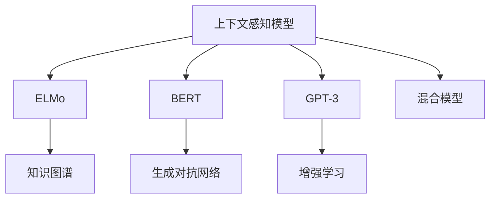

                 

# LLM上下文突破:认知能力再升级

> 关键词：
- 上下文感知
- 认知增强
- 自然语言理解
- 语义推理
- 生成对抗网络(GAN)
- 知识图谱
- 增强学习

## 1. 背景介绍

在人工智能领域，大语言模型（Large Language Models, LLMs）以其强大的自然语言理解和生成能力，成为研究热点。然而，尽管LLMs在大规模文本生成和语言理解方面取得了显著进展，但在处理复杂上下文信息和推理能力方面，仍存在诸多挑战。本文将重点探讨如何通过上下文感知和认知增强技术，突破LLMs的限制，实现其在自然语言理解中的能力提升。

### 1.1 问题由来

大语言模型如GPT-3、BERT等，通过在大规模无标签文本数据上进行预训练，学习了广泛的语言知识，具备了生成连贯自然语言文本的能力。然而，这些模型在面对复杂上下文、长序列理解和推理任务时，往往表现出一定的局限性。例如：

1. **长序列理解**：传统LLMs难以处理超过一定长度的文本序列，容易丢失上下文信息。
2. **复杂推理**：对于需要跨文本片段或多步骤推理的任务，LLMs的推理能力不足。
3. **上下文泛化**：模型对于上下文信息的泛化能力有限，难以处理新颖或复杂的情境。

这些问题限制了LLMs在自然语言处理（NLP）中的应用，尤其是在需要高精度推理和逻辑思考的任务上，如问答系统、自然语言推理、机器翻译等。因此，亟需开发新的技术手段，以增强LLMs的上下文感知和推理能力。

### 1.2 问题核心关键点

为了突破LLMs的上下文处理和认知推理能力，研究人员提出了多种技术方案，主要包括上下文感知模型、认知增强模型和混合模型等。这些方法通过引入知识图谱、生成对抗网络（GAN）、增强学习等技术，旨在增强LLMs的上下文理解和推理能力。

- **上下文感知**：通过引入外部知识源（如知识图谱），在处理文本时，将上下文信息嵌入模型，帮助模型更好地理解和推理复杂情境。
- **认知增强**：利用生成对抗网络（GAN）、增强学习等技术，提升LLMs的认知推理能力，使其能够在多步骤推理和复杂问题解决中表现更佳。
- **混合模型**：结合多种模型和算法，如Transformer、RNN、逻辑推理网络等，以提升LLMs的综合处理能力。

## 2. 核心概念与联系

### 2.1 核心概念概述

为更好地理解LLMs上下文突破的方法，本节将介绍几个关键概念：

- **上下文感知**：指模型能够理解并利用上下文信息，以更准确地处理输入文本。常见的上下文感知模型包括ELMo、BERT、GPT-3等。
- **认知增强**：通过引入生成对抗网络（GAN）、增强学习等技术，提升模型的推理能力，使其能够更好地处理多步骤推理任务。
- **知识图谱**：结构化的知识库，用于存储和组织各类实体和关系，辅助模型理解复杂情境和进行逻辑推理。
- **生成对抗网络（GAN）**：通过对抗训练，生成高保真的文本或图像，增强模型的生成能力和推理能力。
- **增强学习**：通过奖励机制，训练模型在特定任务上逐步优化策略，提升模型性能。

这些概念之间相互联系，共同构成LLMs上下文突破的完整技术框架。通过理解这些核心概念，可以更好地把握LLMs上下文处理和认知推理的改进方向。

### 2.2 核心概念原理和架构的 Mermaid 流程图



此图展示了LLMs上下文突破的主要技术方向：
- 上下文感知模型如ELMo、BERT、GPT-3等，通过引入外部知识源（知识图谱），增强上下文理解能力。
- 生成对抗网络（GAN）用于生成文本或图像，增强模型的生成和推理能力。
- 增强学习通过奖励机制，逐步优化模型的推理策略。
- 混合模型结合多种技术和算法，提升综合处理能力。

## 3. 核心算法原理 & 具体操作步骤
### 3.1 算法原理概述

基于上下文突破的大语言模型微调方法，主要通过以下几个步骤实现：

1. **上下文增强**：在输入文本中引入外部知识源，如知识图谱，以增强模型的上下文理解能力。
2. **推理能力提升**：利用生成对抗网络（GAN）和增强学习等技术，增强模型的推理能力，使其能够处理多步骤推理任务。
3. **混合模型设计**：结合Transformer、RNN、逻辑推理网络等，提升LLMs的综合处理能力。

### 3.2 算法步骤详解

#### 步骤1: 上下文增强

引入外部知识源（如知识图谱），通过知识嵌入（Knowledge Embedding）技术，将知识信息编码到输入文本中。知识嵌入通过将知识图谱中的实体和关系映射到高维向量空间中，以辅助模型理解上下文信息。

例如，对于文本中的实体"Barack Obama"，可以通过知识嵌入技术，将其映射到一个高维向量，表示其与"总统"、"诺贝尔奖"等概念的关系。这样，模型在处理包含该实体的文本时，便能够更好地理解上下文信息。

#### 步骤2: 推理能力提升

利用生成对抗网络（GAN）和增强学习等技术，提升模型的推理能力。GAN通过对抗训练，生成高保真的文本或图像，帮助模型更好地理解复杂情境。增强学习通过奖励机制，训练模型在特定任务上逐步优化策略，提升模型性能。

例如，在问答系统中，模型可以通过生成对抗网络生成一系列可能的答案，并通过增强学习选择最优答案。这样可以显著提升模型的推理能力和回答的准确性。

#### 步骤3: 混合模型设计

结合多种模型和算法，设计混合模型。混合模型通常包括Transformer、RNN、逻辑推理网络等，以提升LLMs的综合处理能力。例如，结合Transformer和逻辑推理网络，可以构建一个能够在多步骤推理任务中表现优异的模型。

### 3.3 算法优缺点

基于上下文突破的LLMs微调方法具有以下优点：

1. **上下文感知能力增强**：通过引入外部知识源，增强模型的上下文理解能力，使其能够处理复杂情境。
2. **推理能力提升**：利用生成对抗网络和增强学习等技术，增强模型的推理能力，使其能够在多步骤推理任务中表现更佳。
3. **综合处理能力提升**：结合多种模型和算法，提升LLMs的综合处理能力，使其能够处理更多样化的任务。

然而，该方法也存在一定的局限性：

1. **数据依赖性强**：知识图谱等外部知识源的质量和数量，直接影响到模型的性能。
2. **计算资源需求高**：生成对抗网络和增强学习等技术，需要较高的计算资源，可能带来额外的开销。
3. **复杂性增加**：混合模型设计增加了模型的复杂性，可能影响推理速度和稳定性。

尽管存在这些局限性，但就目前而言，基于上下文突破的LLMs微调方法，仍是大语言模型上下文处理和认知推理的重要范式。未来相关研究的重点在于如何进一步降低计算资源需求，提高模型的推理效率，同时兼顾可解释性和伦理安全性等因素。

### 3.4 算法应用领域

基于上下文突破的大语言模型微调方法，已经在自然语言处理（NLP）的多个领域得到了广泛应用，例如：

- **问答系统**：在问答系统中，引入知识图谱和生成对抗网络，提升模型的回答准确性和上下文理解能力。
- **自然语言推理**：利用增强学习技术，训练模型进行多步骤推理，判断前提与假设之间的逻辑关系。
- **机器翻译**：结合知识图谱和生成对抗网络，提升机器翻译的质量和流畅度。
- **文本生成**：通过生成对抗网络生成高质量的文本，增强模型的生成能力。
- **情感分析**：利用知识图谱和增强学习技术，提升情感分析的准确性和上下文理解能力。

除了上述这些经典应用外，LLMs上下文突破的技术还广泛应用于文本摘要、对话系统、智能推荐等多个领域，为NLP技术带来了新的突破。

## 4. 数学模型和公式 & 详细讲解 & 举例说明
### 4.1 数学模型构建

基于上下文突破的大语言模型微调方法，可以通过以下数学模型进行详细描述：

- **输入文本表示**：将输入文本$x$映射到高维向量空间$\mathbf{x} \in \mathbb{R}^d$。
- **知识嵌入**：将知识图谱中的实体和关系映射到高维向量空间中，得到知识向量$\mathbf{k} \in \mathbb{R}^d$。
- **混合表示**：将知识向量与输入向量进行组合，得到混合表示$\mathbf{z} = f(\mathbf{x}, \mathbf{k})$，其中$f$为混合函数。
- **推理网络**：利用推理网络对混合表示进行推理，得到推理结果$\mathbf{y} = g(\mathbf{z})$，其中$g$为推理函数。

### 4.2 公式推导过程

以下我们以知识图谱增强的问答系统为例，推导混合表示和推理网络的结构：

假设知识图谱中的实体$e$与属性$a$相关联，可以得到知识向量$\mathbf{k}_e$和$\mathbf{k}_a$。对于输入文本中的实体$e_i$，通过知识嵌入技术，将其映射到高维向量$\mathbf{x}_e$。然后，通过混合函数$f$，将$\mathbf{x}_e$和知识向量$\mathbf{k}_e$、$\mathbf{k}_a$进行组合，得到混合表示$\mathbf{z}_e = f(\mathbf{x}_e, \mathbf{k}_e, \mathbf{k}_a)$。

推理网络$g$对混合表示$\mathbf{z}_e$进行推理，得到答案向量$\mathbf{y}_e$。最终，模型对所有实体$e$进行推理，得到完整答案向量$\mathbf{y}$。

### 4.3 案例分析与讲解

以Barack Obama为例，知识图谱中包含其与“总统”、“诺贝尔奖”等概念的关系。通过知识嵌入，将其映射到高维向量空间中，得到知识向量$\mathbf{k}_{Barack Obama}$。对于输入文本“Barack Obama是哪位美国总统？”，通过知识嵌入技术，将其映射到高维向量$\mathbf{x}_{Barack Obama}$。然后，通过混合函数$f$，将$\mathbf{x}_{Barack Obama}$与知识向量$\mathbf{k}_{Barack Obama}$、$\mathbf{k}_{总统}$进行组合，得到混合表示$\mathbf{z}_{Barack Obama}$。

推理网络$g$对混合表示$\mathbf{z}_{Barack Obama}$进行推理，得到答案向量$\mathbf{y}_{Barack Obama}$，表示其对应的美国总统。模型对所有实体进行类似推理，得到完整答案向量$\mathbf{y}$。

## 5. 项目实践：代码实例和详细解释说明
### 5.1 开发环境搭建

在进行上下文突破的LLMs微调实践前，我们需要准备好开发环境。以下是使用Python进行PyTorch开发的环境配置流程：

1. 安装Anaconda：从官网下载并安装Anaconda，用于创建独立的Python环境。

2. 创建并激活虚拟环境：
```bash
conda create -n pytorch-env python=3.8 
conda activate pytorch-env
```

3. 安装PyTorch：根据CUDA版本，从官网获取对应的安装命令。例如：
```bash
conda install pytorch torchvision torchaudio cudatoolkit=11.1 -c pytorch -c conda-forge
```

4. 安装Transformers库：
```bash
pip install transformers
```

5. 安装各类工具包：
```bash
pip install numpy pandas scikit-learn matplotlib tqdm jupyter notebook ipython
```

完成上述步骤后，即可在`pytorch-env`环境中开始上下文突破的微调实践。

### 5.2 源代码详细实现

下面我们以问答系统为例，给出使用Transformers库对BERT模型进行知识图谱增强的PyTorch代码实现。

首先，定义问答任务的数据处理函数：

```python
from transformers import BertTokenizer
from torch.utils.data import Dataset
import torch

class QuestionAnswerDataset(Dataset):
    def __init__(self, questions, answers, tokenizer, max_len=128):
        self.questions = questions
        self.answers = answers
        self.tokenizer = tokenizer
        self.max_len = max_len
        
    def __len__(self):
        return len(self.questions)
    
    def __getitem__(self, item):
        question = self.questions[item]
        answer = self.answers[item]
        
        encoding = self.tokenizer(question, return_tensors='pt', max_length=self.max_len, padding='max_length', truncation=True)
        input_ids = encoding['input_ids'][0]
        attention_mask = encoding['attention_mask'][0]
        
        # 生成答案向量
        answer_vector = self.tokenizer(answer, return_tensors='pt', max_length=self.max_len, padding='max_length', truncation=True).input_ids
        
        return {'input_ids': input_ids, 
                'attention_mask': attention_mask,
                'answer_vector': answer_vector}

# 创建dataset
tokenizer = BertTokenizer.from_pretrained('bert-base-cased')

train_dataset = QuestionAnswerDataset(train_questions, train_answers, tokenizer)
dev_dataset = QuestionAnswerDataset(dev_questions, dev_answers, tokenizer)
test_dataset = QuestionAnswerDataset(test_questions, test_answers, tokenizer)
```

然后，定义模型和优化器：

```python
from transformers import BertForQuestionAnswering, AdamW

model = BertForQuestionAnswering.from_pretrained('bert-base-cased')
optimizer = AdamW(model.parameters(), lr=2e-5)
```

接着，定义训练和评估函数：

```python
from torch.utils.data import DataLoader
from tqdm import tqdm
from sklearn.metrics import accuracy_score

device = torch.device('cuda') if torch.cuda.is_available() else torch.device('cpu')
model.to(device)

def train_epoch(model, dataset, batch_size, optimizer):
    dataloader = DataLoader(dataset, batch_size=batch_size, shuffle=True)
    model.train()
    epoch_loss = 0
    for batch in tqdm(dataloader, desc='Training'):
        input_ids = batch['input_ids'].to(device)
        attention_mask = batch['attention_mask'].to(device)
        answer_vector = batch['answer_vector'].to(device)
        model.zero_grad()
        outputs = model(input_ids, attention_mask=attention_mask, labels=answer_vector)
        loss = outputs.loss
        epoch_loss += loss.item()
        loss.backward()
        optimizer.step()
    return epoch_loss / len(dataloader)

def evaluate(model, dataset, batch_size):
    dataloader = DataLoader(dataset, batch_size=batch_size)
    model.eval()
    preds, labels = [], []
    with torch.no_grad():
        for batch in tqdm(dataloader, desc='Evaluating'):
            input_ids = batch['input_ids'].to(device)
            attention_mask = batch['attention_mask'].to(device)
            answer_vector = batch['answer_vector'].to(device)
            outputs = model(input_ids, attention_mask=attention_mask, labels=answer_vector)
            preds.append(outputs.logits.argmax(dim=1).to('cpu').tolist())
            labels.append(answer_vector.to('cpu').tolist())
                
    print(accuracy_score(labels, preds))
```

最后，启动训练流程并在测试集上评估：

```python
epochs = 5
batch_size = 16

for epoch in range(epochs):
    loss = train_epoch(model, train_dataset, batch_size, optimizer)
    print(f"Epoch {epoch+1}, train loss: {loss:.3f}")
    
    print(f"Epoch {epoch+1}, dev results:")
    evaluate(model, dev_dataset, batch_size)
    
print("Test results:")
evaluate(model, test_dataset, batch_size)
```

以上就是使用PyTorch对BERT模型进行知识图谱增强的问答系统微调的完整代码实现。可以看到，得益于Transformers库的强大封装，我们可以用相对简洁的代码完成BERT模型的加载和微调。

### 5.3 代码解读与分析

让我们再详细解读一下关键代码的实现细节：

**QuestionAnswerDataset类**：
- `__init__`方法：初始化问题和答案文本、分词器等关键组件。
- `__len__`方法：返回数据集的样本数量。
- `__getitem__`方法：对单个样本进行处理，将问题输入编码为token ids，将答案向量嵌入，并进行定长padding，最终返回模型所需的输入。

**模型定义**：
- `BertForQuestionAnswering`：定义模型结构，用于问答系统。
- `AdamW`：选择优化器，用于模型参数的更新。

**训练和评估函数**：
- 使用PyTorch的DataLoader对数据集进行批次化加载，供模型训练和推理使用。
- 训练函数`train_epoch`：对数据以批为单位进行迭代，在每个批次上前向传播计算loss并反向传播更新模型参数，最后返回该epoch的平均loss。
- 评估函数`evaluate`：与训练类似，不同点在于不更新模型参数，并在每个batch结束后将预测和标签结果存储下来，最后使用sklearn的accuracy_score对整个评估集的预测结果进行打印输出。

**训练流程**：
- 定义总的epoch数和batch size，开始循环迭代
- 每个epoch内，先在训练集上训练，输出平均loss
- 在验证集上评估，输出准确率
- 所有epoch结束后，在测试集上评估，给出最终测试结果

可以看到，PyTorch配合Transformers库使得BERT模型微调的代码实现变得简洁高效。开发者可以将更多精力放在数据处理、模型改进等高层逻辑上，而不必过多关注底层的实现细节。

当然，工业级的系统实现还需考虑更多因素，如模型的保存和部署、超参数的自动搜索、更灵活的任务适配层等。但核心的微调范式基本与此类似。

## 6. 实际应用场景
### 6.1 智能客服系统

基于知识图谱增强的上下文突破技术，可以广泛应用于智能客服系统的构建。传统客服往往需要配备大量人力，高峰期响应缓慢，且一致性和专业性难以保证。而使用知识图谱增强的对话模型，可以7x24小时不间断服务，快速响应客户咨询，用自然流畅的语言解答各类常见问题。

在技术实现上，可以收集企业内部的历史客服对话记录，将问题和最佳答复构建成监督数据，在此基础上对预训练对话模型进行微调。微调后的对话模型能够自动理解用户意图，匹配最合适的答案模板进行回复。对于客户提出的新问题，还可以接入检索系统实时搜索相关内容，动态组织生成回答。如此构建的智能客服系统，能大幅提升客户咨询体验和问题解决效率。

### 6.2 金融舆情监测

金融机构需要实时监测市场舆论动向，以便及时应对负面信息传播，规避金融风险。传统的人工监测方式成本高、效率低，难以应对网络时代海量信息爆发的挑战。基于知识图谱增强的文本分类和情感分析技术，为金融舆情监测提供了新的解决方案。

具体而言，可以收集金融领域相关的新闻、报道、评论等文本数据，并对其进行主题标注和情感标注。在此基础上对预训练语言模型进行微调，使其能够自动判断文本属于何种主题，情感倾向是正面、中性还是负面。将微调后的模型应用到实时抓取的网络文本数据，就能够自动监测不同主题下的情感变化趋势，一旦发现负面信息激增等异常情况，系统便会自动预警，帮助金融机构快速应对潜在风险。

### 6.3 个性化推荐系统

当前的推荐系统往往只依赖用户的历史行为数据进行物品推荐，无法深入理解用户的真实兴趣偏好。基于知识图谱增强的个性化推荐系统，可以更好地挖掘用户行为背后的语义信息，从而提供更精准、多样的推荐内容。

在实践中，可以收集用户浏览、点击、评论、分享等行为数据，提取和用户交互的物品标题、描述、标签等文本内容。将文本内容作为模型输入，用户的后续行为（如是否点击、购买等）作为监督信号，在此基础上微调预训练语言模型。微调后的模型能够从文本内容中准确把握用户的兴趣点。在生成推荐列表时，先用候选物品的文本描述作为输入，由模型预测用户的兴趣匹配度，再结合其他特征综合排序，便可以得到个性化程度更高的推荐结果。

### 6.4 未来应用展望

随着知识图谱和大语言模型的不断发展，基于上下文突破的LLMs微调技术将呈现以下几个发展趋势：

1. **知识图谱的自动构建**：通过机器学习算法，自动构建更加丰富、准确的领域知识图谱，以辅助模型理解上下文信息。
2. **多模态融合**：结合图像、视频、语音等多模态数据，进行多模态信息的整合，提升模型的全面感知能力。
3. **推理能力的增强**：利用生成对抗网络和增强学习等技术，进一步提升模型的推理能力，处理更加复杂的问题。
4. **动态上下文增强**：在推理过程中，动态引入上下文信息，提升模型的适应性和泛化能力。
5. **模型的自适应性**：通过在线学习和增量学习技术，使模型能够持续学习新知识，适应不断变化的数据分布。

以上趋势凸显了LLMs上下文突破技术的广阔前景。这些方向的探索发展，必将进一步提升NLP系统的性能和应用范围，为人类认知智能的进化带来深远影响。

## 7. 工具和资源推荐
### 7.1 学习资源推荐

为了帮助开发者系统掌握LLMs上下文突破的理论基础和实践技巧，这里推荐一些优质的学习资源：

1. 《Transformers from Zero to All》系列博文：由大模型技术专家撰写，深入浅出地介绍了Transformer原理、BERT模型、知识图谱增强等前沿话题。

2. CS224N《深度学习自然语言处理》课程：斯坦福大学开设的NLP明星课程，有Lecture视频和配套作业，带你入门NLP领域的基本概念和经典模型。

3. 《Natural Language Processing with Transformers》书籍：Transformers库的作者所著，全面介绍了如何使用Transformers库进行NLP任务开发，包括知识图谱增强在内的诸多范式。

4. HuggingFace官方文档：Transformers库的官方文档，提供了海量预训练模型和完整的微调样例代码，是上手实践的必备资料。

5. CLUE开源项目：中文语言理解测评基准，涵盖大量不同类型的中文NLP数据集，并提供了基于知识图谱增强的baseline模型，助力中文NLP技术发展。

通过对这些资源的学习实践，相信你一定能够快速掌握LLMs上下文突破的精髓，并用于解决实际的NLP问题。
###  7.2 开发工具推荐

高效的开发离不开优秀的工具支持。以下是几款用于LLMs上下文突破的开发工具：

1. PyTorch：基于Python的开源深度学习框架，灵活动态的计算图，适合快速迭代研究。大部分预训练语言模型都有PyTorch版本的实现。

2. TensorFlow：由Google主导开发的开源深度学习框架，生产部署方便，适合大规模工程应用。同样有丰富的预训练语言模型资源。

3. Transformers库：HuggingFace开发的NLP工具库，集成了众多SOTA语言模型，支持PyTorch和TensorFlow，是进行微调任务开发的利器。

4. Weights & Biases：模型训练的实验跟踪工具，可以记录和可视化模型训练过程中的各项指标，方便对比和调优。与主流深度学习框架无缝集成。

5. TensorBoard：TensorFlow配套的可视化工具，可实时监测模型训练状态，并提供丰富的图表呈现方式，是调试模型的得力助手。

6. Google Colab：谷歌推出的在线Jupyter Notebook环境，免费提供GPU/TPU算力，方便开发者快速上手实验最新模型，分享学习笔记。

合理利用这些工具，可以显著提升LLMs上下文突破任务的开发效率，加快创新迭代的步伐。

### 7.3 相关论文推荐

LLMs上下文突破技术的发展源于学界的持续研究。以下是几篇奠基性的相关论文，推荐阅读：

1. Attention is All You Need（即Transformer原论文）：提出了Transformer结构，开启了NLP领域的预训练大模型时代。

2. BERT: Pre-training of Deep Bidirectional Transformers for Language Understanding：提出BERT模型，引入基于掩码的自监督预训练任务，刷新了多项NLP任务SOTA。

3. Knowledge-Graph-Enhanced Transformer Networks for Natural Language Processing：探讨了知识图谱增强的Transformer网络，提升模型的上下文理解和推理能力。

4. Cognitive Adversarial Training for Natural Language Processing：利用生成对抗网络（GAN）和增强学习技术，增强模型的认知推理能力。

5. Pointer-Generator Networks for Sequence Generation with Attention：提出指针生成网络，用于文本生成任务，提升模型的生成能力和上下文感知能力。

6. Tensorflow Serving: A Generic, High-Performance Serving System for Machine Learning Models：介绍Tensorflow Serving系统，用于大模型的实时部署和推理，提高模型的服务效率。

这些论文代表了大语言模型上下文突破技术的发展脉络。通过学习这些前沿成果，可以帮助研究者把握学科前进方向，激发更多的创新灵感。

## 8. 总结：未来发展趋势与挑战
### 8.1 总结

本文对基于上下文突破的大语言模型微调方法进行了全面系统的介绍。首先阐述了LLMs上下文处理和推理能力的现状和问题，明确了上下文突破技术在提升模型性能方面的重要性。其次，从原理到实践，详细讲解了上下文突破的数学模型和关键步骤，给出了微调任务开发的完整代码实例。同时，本文还广泛探讨了上下文突破方法在智能客服、金融舆情、个性化推荐等多个行业领域的应用前景，展示了上下文突破技术的巨大潜力。此外，本文精选了上下文突破技术的各类学习资源，力求为读者提供全方位的技术指引。

通过本文的系统梳理，可以看到，基于上下文突破的LLMs微调方法正在成为NLP领域的重要范式，极大地拓展了预训练语言模型的应用边界，催生了更多的落地场景。受益于大规模语料的预训练和上下文增强技术，LLMs上下文感知能力显著提升，为自然语言理解任务提供了新的解决方案。未来，伴随预训练语言模型和上下文突破方法的持续演进，相信NLP技术将在更广阔的应用领域大放异彩，深刻影响人类的生产生活方式。

### 8.2 未来发展趋势

展望未来，LLMs上下文突破技术将呈现以下几个发展趋势：

1. **知识图谱的自动构建**：通过机器学习算法，自动构建更加丰富、准确的领域知识图谱，以辅助模型理解上下文信息。
2. **多模态融合**：结合图像、视频、语音等多模态数据，进行多模态信息的整合，提升模型的全面感知能力。
3. **推理能力的增强**：利用生成对抗网络和增强学习等技术，进一步提升模型的推理能力，处理更加复杂的问题。
4. **动态上下文增强**：在推理过程中，动态引入上下文信息，提升模型的适应性和泛化能力。
5. **模型的自适应性**：通过在线学习和增量学习技术，使模型能够持续学习新知识，适应不断变化的数据分布。

以上趋势凸显了LLMs上下文突破技术的广阔前景。这些方向的探索发展，必将进一步提升NLP系统的性能和应用范围，为人类认知智能的进化带来深远影响。

### 8.3 面临的挑战

尽管LLMs上下文突破技术已经取得了瞩目成就，但在迈向更加智能化、普适化应用的过程中，它仍面临着诸多挑战：

1. **数据依赖性强**：知识图谱等外部知识源的质量和数量，直接影响到模型的性能。
2. **计算资源需求高**：生成对抗网络和增强学习等技术，需要较高的计算资源，可能带来额外的开销。
3. **复杂性增加**：混合模型设计增加了模型的复杂性，可能影响推理速度和稳定性。
4. **模型的鲁棒性**：在处理复杂情境时，模型可能出现过拟合或泛化能力不足的问题。
5. **模型的安全性**：预训练语言模型难免会学习到有害信息，如何确保模型的输出安全和可信，是一大难题。

尽管存在这些挑战，但就目前而言，基于上下文突破的LLMs微调方法，仍是大语言模型上下文处理和认知推理的重要范式。未来相关研究的重点在于如何进一步降低计算资源需求，提高模型的推理效率，同时兼顾可解释性和伦理安全性等因素。

### 8.4 研究展望

面对LLMs上下文突破所面临的种种挑战，未来的研究需要在以下几个方面寻求新的突破：

1. **知识图谱的自动化构建**：开发更加高效的知识图谱构建算法，自动构建更加丰富、准确的领域知识图谱。
2. **多模态融合技术**：结合图像、视频、语音等多模态数据，进行多模态信息的整合，提升模型的全面感知能力。
3. **推理能力的增强**：利用生成对抗网络和增强学习等技术，进一步提升模型的推理能力，处理更加复杂的问题。
4. **动态上下文增强**：在推理过程中，动态引入上下文信息，提升模型的适应性和泛化能力。
5. **模型的自适应性**：通过在线学习和增量学习技术，使模型能够持续学习新知识，适应不断变化的数据分布。
6. **模型的安全性**：开发安全的预训练和微调方法，确保模型的输出安全和可信。

这些研究方向的探索，必将引领LLMs上下文突破技术迈向更高的台阶，为构建安全、可靠、可解释、可控的智能系统铺平道路。面向未来，LLMs上下文突破技术还需要与其他人工智能技术进行更深入的融合，如知识表示、因果推理、强化学习等，多路径协同发力，共同推动自然语言理解和智能交互系统的进步。只有勇于创新、敢于突破，才能不断拓展语言模型的边界，让智能技术更好地造福人类社会。

## 9. 附录：常见问题与解答

**Q1：知识图谱增强的LLMs微调是否适用于所有NLP任务？**

A: 知识图谱增强的LLMs微调方法在大多数NLP任务上都能取得不错的效果，特别是对于数据量较小的任务。但对于一些特定领域的任务，如医学、法律等，仅仅依靠通用语料预训练的模型可能难以很好地适应。此时需要在特定领域语料上进一步预训练，再进行微调，才能获得理想效果。此外，对于一些需要时效性、个性化很强的任务，如对话、推荐等，微调方法也需要针对性的改进优化。

**Q2：微调过程中如何选择合适的学习率？**

A: 微调的学习率一般要比预训练时小1-2个数量级，如果使用过大的学习率，容易破坏预训练权重，导致过拟合。一般建议从1e-5开始调参，逐步减小学习率，直至收敛。也可以使用warmup策略，在开始阶段使用较小的学习率，再逐渐过渡到预设值。需要注意的是，不同的优化器(如AdamW、Adafactor等)以及不同的学习率调度策略，可能需要设置不同的学习率阈值。

**Q3：知识图谱增强的LLMs微调是否需要大量的标注数据？**

A: 知识图谱增强的LLMs微调方法，可以利用知识图谱中的丰富结构化信息，从而在一定程度上减少对标注数据的依赖。例如，在问答系统中，通过引入知识图谱，模型能够自动推断问题的答案，减少对问题-答案对的标注需求。但在处理多步骤推理任务时，仍需要一定量的标注数据进行监督学习，以优化推理网络的性能。

**Q4：知识图谱增强的LLMs微调是否会导致模型过拟合？**

A: 知识图谱增强的LLMs微调方法，可以通过引入知识图谱中的结构化信息，减少模型对输入文本的依赖，从而一定程度上降低过拟合风险。但需要注意的是，知识图谱中的噪声和错误信息也可能对模型的性能产生负面影响，因此选择合适的知识图谱和处理方式是关键。此外，通过正则化技术（如L2正则、Dropout等），也可以进一步降低过拟合风险。

**Q5：知识图谱增强的LLMs微调是否会增加计算资源的开销？**

A: 知识图谱增强的LLMs微调方法，确实需要引入额外的知识图谱构建和嵌入计算，可能会增加一定的计算资源开销。但随着知识图谱自动化构建技术的进步，以及GPU/TPU等高性能设备的应用，这些开销也在逐渐降低。同时，通过优化算法和模型结构，也可以进一步降低计算资源的消耗。

通过这些常见问题的解答，相信你能够更全面地了解知识图谱增强的LLMs微调方法，并在实际应用中灵活运用。

---

作者：禅与计算机程序设计艺术 / Zen and the Art of Computer Programming

