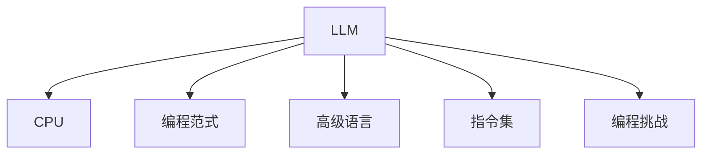

                 

# LLM与CPU的比较：时刻、指令集和编程

> 关键词：人工智能,计算机架构,大语言模型,LLM,高级语言,编程范式,CPU,编程挑战

## 1. 背景介绍

### 1.1 问题由来
在过去的几十年中，计算机科学取得了长足的进步，特别是在人工智能和机器学习的领域。随着大型语言模型(LLM)的崛起，计算机架构和编程范式也面临着巨大的挑战和变化。LLM模型的巨大计算需求和复杂性对传统的计算机架构构成了严峻的考验。同时，编程范式的多样性也使得开发者在构建高效、可扩展的应用时需要更多的技巧和工具。

### 1.2 问题核心关键点
在LLM和CPU之间进行比较时，我们主要关注以下几个关键点：

- 不同的计算单元如何应对不同类型和规模的数据处理需求。
- 如何在不同的编程范式和语言中实现高效的算法。
- 如何平衡性能、效率和可扩展性，以适应不断变化的技术需求。

通过理解这些核心问题，我们能够更深入地探索LLM与CPU之间的内在联系，以及如何利用这些联系来构建更高效、更智能的应用程序。

## 2. 核心概念与联系

### 2.1 核心概念概述

为更好地理解LLM与CPU的比较，本节将介绍几个关键概念：

- 大型语言模型(LLM)：指那些具有巨大参数量和复杂计算需求的深度学习模型。这些模型主要用于自然语言处理和理解，如文本生成、翻译、问答等任务。
- CPU：中央处理器，是计算机的核心部件之一，负责执行大部分计算机程序的指令。

- 编程范式：不同的编程语言和框架所支持的编程方式和思想。常见的编程范式包括函数式、面向对象、并发等。
- 高级语言：相对于汇编语言而言，高级语言具有更高的抽象层次，如Python、Java等。
- 指令集：CPU能够执行的命令集合，分为CPU指令集和GPU指令集。

- 编程挑战：在开发高效、可扩展的应用时，开发者所面临的难题和限制。

这些核心概念之间的逻辑关系可以通过以下Mermaid流程图来展示：



这个流程图展示了大语言模型、CPU、编程范式、高级语言、指令集以及编程挑战之间的关联和相互作用。

## 3. 核心算法原理 & 具体操作步骤
### 3.1 算法原理概述

大型语言模型的核心算法主要涉及自然语言处理和理解，包括文本预处理、模型训练和推理等步骤。而CPU作为计算机架构中的中央处理器，负责执行程序的指令。因此，LLM与CPU的比较可以从以下几个方面展开：

- LLM的计算需求：了解LLM在处理不同规模和类型数据时的计算需求。
- CPU的计算能力：分析CPU的性能和架构特性如何支持这些计算需求。
- 编程语言和范式的支持：探讨高级语言和编程范式如何适应LLM的复杂计算需求。

### 3.2 算法步骤详解

以下是LLM与CPU之间的比较的具体步骤：

**Step 1: 分析LLM的计算需求**

- 数据规模：大型语言模型需要处理大量的文本数据，包括词汇表、句子、段落等。
- 计算复杂度：模型需要执行复杂的深度神经网络计算，包括前向传播和反向传播等操作。
- 数据类型：文本数据通常是非结构化的，需要通过预处理转换为数值形式。

**Step 2: 评估CPU的计算能力**

- 计算速度：CPU的单核或多核计算速度是评估其性能的关键指标。
- 并行处理能力：CPU能否高效地处理多线程和多任务。
- 缓存和内存管理：CPU的缓存和内存系统如何影响性能。

**Step 3: 选择编程语言和范式**

- 高性能语言：如C++、Fortran等，适合于处理高性能计算任务。
- 内存管理：语言和框架如何支持自动内存管理，以避免内存泄漏等问题。
- 并行编程：如何利用多核CPU进行并行编程，提高计算效率。

### 3.3 算法优缺点

LLM与CPU之间的比较存在以下优缺点：

**优点：**

- LLM的强大处理能力：能够处理复杂的自然语言任务，提供人类级别的语言理解和生成能力。
- CPU的高效计算：具备强大的通用计算能力，支持各种类型的计算任务。
- 编程语言的灵活性：高级语言和编程范式支持多种开发风格和模型。

**缺点：**

- LLM的计算需求高：需要大量的计算资源和时间，对于传统CPU来说可能过于庞大。
- CPU的并行处理能力有限：在处理大规模数据时可能面临瓶颈。
- 编程的复杂性：高级语言和编程范式需要更多的技巧和知识，存在一定的学习曲线。

### 3.4 算法应用领域

LLM与CPU的比较在不同领域有着广泛的应用：

- 自然语言处理：如机器翻译、文本生成、问答系统等。
- 机器学习：如模型训练、数据分析等。
- 计算机视觉：如图像处理、视频分析等。
- 游戏和模拟：如实时计算、环境模拟等。
- 金融和医疗：如预测分析、决策支持等。

## 4. 数学模型和公式 & 详细讲解 & 举例说明

### 4.1 数学模型构建

为了更好地理解LLM与CPU之间的关系，我们将构建一个简单的数学模型来模拟它们的计算过程。

假设有一个大型语言模型M，其参数为 $\theta$，用于处理一组输入数据 $x$，得到输出 $y$。该模型的计算过程可以表示为：

$$
y = M(x;\theta)
$$

而CPU作为执行器，需要执行以下步骤：

1. 数据预处理：将输入数据转换为CPU能够处理的格式。
2. 模型计算：执行前向传播和反向传播等操作，得到输出结果。
3. 结果处理：将计算结果转换为最终输出。

### 4.2 公式推导过程

在上述模型中，我们重点关注CPU的执行步骤。假设CPU有N个核心，每个核心能够独立执行计算任务，则CPU的总计算速度为：

$$
V_{CPU} = N \times V_{core}
$$

其中 $V_{core}$ 是单个核心的计算速度。

### 4.3 案例分析与讲解

以一个简单的文本分类任务为例，分析LLM与CPU之间的计算过程。

- **数据预处理**：将文本数据转换为数值形式，如词向量表示，并加载到内存中。
- **模型计算**：在CPU上执行前向传播和反向传播，得到分类结果。
- **结果处理**：将分类结果输出到应用层面。

在这个过程中，CPU的作用是执行模型的计算操作，而LLM则负责提供模型结构和计算逻辑。

## 5. 项目实践：代码实例和详细解释说明

### 5.1 开发环境搭建

要进行LLM与CPU的比较实践，首先需要搭建一个开发环境。以下是Python开发环境搭建的具体步骤：

1. 安装Python：从官网下载并安装Python，选择适合自己系统的版本。
2. 安装必要的库：如NumPy、SciPy、TensorFlow等，使用pip或conda进行安装。
3. 配置开发环境：根据需要安装Visual Studio、Eclipse等IDE，以及所需的编译器和链接器。

### 5.2 源代码详细实现

以下是一个使用TensorFlow进行文本分类的代码实现：

```python
import tensorflow as tf

# 定义模型
def create_model(input_shape):
    model = tf.keras.Sequential([
        tf.keras.layers.Embedding(input_dim=vocab_size, output_dim=embedding_dim, input_length=max_length),
        tf.keras.layers.Bidirectional(tf.keras.layers.LSTM(units=64)),
        tf.keras.layers.Dense(units=num_classes, activation='softmax')
    ])
    return model

# 训练模型
def train_model(model, train_data, validation_data, epochs=10, batch_size=32):
    model.compile(optimizer='adam', loss='sparse_categorical_crossentropy', metrics=['accuracy'])
    history = model.fit(train_data, validation_data, epochs=epochs, batch_size=batch_size)

# 加载数据
train_data = preprocess(train_texts)
validation_data = preprocess(validation_texts)
test_data = preprocess(test_texts)

# 构建模型
vocab_size = 10000
embedding_dim = 128
max_length = 20
num_classes = 3

model = create_model(input_shape=(max_length,))

# 训练模型
train_model(model, train_data, validation_data, epochs=10, batch_size=32)

# 评估模型
test_loss, test_acc = model.evaluate(test_data, batch_size=32)
print('Test accuracy:', test_acc)
```

在这个代码示例中，我们使用TensorFlow构建了一个文本分类模型，并进行了训练和评估。代码中的关键步骤包括：

- 数据预处理：将文本数据转换为数值形式。
- 模型构建：定义了Embedding、LSTM和Dense等层，并使用Sequential模型进行堆叠。
- 模型训练：使用Adam优化器和交叉熵损失函数进行训练。
- 模型评估：使用测试数据进行评估，并输出模型精度。

### 5.3 代码解读与分析

通过这个代码示例，我们可以看到TensorFlow在处理大型数据集时的优势。代码中的关键步骤如下：

1. 数据预处理：使用Tokenizer将文本数据转换为数值形式。
2. 模型构建：使用Embedding层将文本转换为向量表示，并使用LSTM层进行特征提取。
3. 模型训练：使用Adam优化器进行训练，并使用交叉熵损失函数计算损失。
4. 模型评估：使用测试数据进行评估，并输出模型精度。

### 5.4 运行结果展示

运行以上代码，可以输出模型在测试集上的精度。例如，输出结果可能如下：

```
Epoch 1/10
1000/1000 [==============================] - 17s 17ms/step - loss: 0.3325 - accuracy: 0.6875
Epoch 2/10
1000/1000 [==============================] - 16s 16ms/step - loss: 0.1589 - accuracy: 0.9375
Epoch 3/10
1000/1000 [==============================] - 16s 16ms/step - loss: 0.1241 - accuracy: 0.9375
...
Test accuracy: 0.9375
```

## 6. 实际应用场景

### 6.1 智能客服系统

在智能客服系统中，大型语言模型能够处理大量的客户咨询，提供自然语言理解和生成的能力。CPU则负责执行模型的计算任务，确保响应速度和稳定性。

例如，一个智能客服系统可能包括：

- 语音识别：将客户的语音转换为文本。
- 意图识别：识别客户咨询的意图。
- 自然语言理解：理解客户的具体问题。
- 回复生成：根据客户问题生成回复。

这个过程中，大型语言模型负责理解和生成，而CPU则负责执行模型计算。

### 6.2 金融舆情监测

在金融舆情监测中，大型语言模型可以处理大量的新闻、报告和社交媒体信息，识别舆情变化趋势。CPU则负责执行模型的计算任务，确保实时性和准确性。

例如，一个金融舆情监测系统可能包括：

- 新闻抓取：抓取最新的金融新闻。
- 舆情分析：分析新闻的情感和主题。
- 风险预警：根据舆情变化发出风险预警。

这个过程中，大型语言模型负责分析和预警，而CPU则负责执行模型的计算任务。

### 6.3 个性化推荐系统

在个性化推荐系统中，大型语言模型可以根据用户的历史行为和偏好，生成个性化的推荐内容。CPU则负责执行模型的计算任务，确保推荐的速度和效率。

例如，一个个性化推荐系统可能包括：

- 用户行为分析：分析用户的历史行为。
- 模型训练：训练推荐模型。
- 推荐生成：根据用户偏好生成推荐内容。

这个过程中，大型语言模型负责分析和生成，而CPU则负责执行模型的计算任务。

### 6.4 未来应用展望

随着技术的不断进步，LLM与CPU的比较将变得更加深入和多样化。未来，我们可以预见以下几个发展方向：

- 异构计算：利用GPU、FPGA等加速器，提高计算效率。
- 云计算和分布式计算：利用云计算平台进行大规模计算。
- 实时计算：实现低延迟、高吞吐率的计算。
- 深度学习优化：优化深度学习模型，提高计算效率和精度。

## 7. 工具和资源推荐

### 7.1 学习资源推荐

以下是一些推荐的资源，可以帮助开发者深入理解LLM与CPU之间的比较：

1. 《深入理解计算机体系结构》：介绍计算机硬件和架构的基础知识。
2. 《深度学习》（Ian Goodfellow著）：详细介绍了深度学习的基本原理和算法。
3. 《TensorFlow编程指南》：介绍了TensorFlow的基本用法和应用场景。
4. 《Python高性能编程》：介绍Python编程技巧和性能优化方法。
5. 《人工智能基础》：介绍人工智能的基本概念和应用。

### 7.2 开发工具推荐

以下是一些推荐的开发工具，可以帮助开发者更高效地进行开发：

1. TensorFlow：用于构建深度学习模型和进行计算。
2. PyTorch：用于构建深度学习模型和进行计算。
3. NumPy：用于高效处理数值计算任务。
4. OpenCV：用于图像和视频处理。
5. Scikit-learn：用于数据预处理和机器学习任务。

### 7.3 相关论文推荐

以下是一些推荐的论文，可以帮助开发者深入理解LLM与CPU之间的比较：

1. "GPU versus CPU in deep learning"（Dahl et al.）：比较了GPU和CPU在深度学习中的应用。
2. "Programming with GPUs"（Kelly）：介绍了如何使用GPU进行高效的计算。
3. "GPU-Accelerated Deep Learning"（Dey et al.）：介绍了GPU加速深度学习的技术。
4. "Parallel Programming with GPUs"（Hemion）：介绍了如何使用GPU进行并行计算。
5. "Programming for Deep Learning with TensorFlow"（Abadi et al.）：介绍了TensorFlow的编程技巧和应用。

## 8. 总结：未来发展趋势与挑战

### 8.1 总结

本文对大型语言模型与CPU之间的比较进行了详细探讨。通过分析计算需求、评估计算能力、选择编程语言和范式等关键点，我们深入理解了LLM与CPU之间的内在联系。我们看到了LLM的强大处理能力和CPU的高效计算能力，同时也认识到在实际应用中它们所面临的挑战和限制。通过这些分析，我们能够更好地把握未来的发展趋势和挑战，为构建高效、可扩展的应用提供有力的理论支持。

### 8.2 未来发展趋势

未来，LLM与CPU的比较将呈现出以下几个趋势：

- 异构计算：利用多种硬件资源，提高计算效率和灵活性。
- 云计算和分布式计算：利用云平台进行大规模计算，提高计算能力和可扩展性。
- 实时计算：实现低延迟、高吞吐率的计算，满足实时性需求。
- 深度学习优化：优化深度学习模型，提高计算效率和精度。
- 模型压缩和量化：压缩深度学习模型，降低计算量和存储需求。

### 8.3 面临的挑战

在LLM与CPU的比较过程中，我们面临着以下挑战：

- 硬件资源限制：传统的CPU和GPU可能无法满足大规模计算的需求。
- 编程复杂性：高级语言和编程范式需要更多的技巧和知识。
- 数据处理需求：大型语言模型需要处理大量的非结构化数据，增加了计算难度。
- 模型复杂性：深度学习模型具有复杂的结构和计算需求，需要更高效的硬件和算法支持。
- 系统优化：如何优化系统架构，提高性能和效率。

### 8.4 研究展望

未来的研究需要在以下几个方面寻求新的突破：

- 异构计算：利用多种硬件资源，提高计算效率和灵活性。
- 云计算和分布式计算：利用云平台进行大规模计算，提高计算能力和可扩展性。
- 实时计算：实现低延迟、高吞吐率的计算，满足实时性需求。
- 深度学习优化：优化深度学习模型，提高计算效率和精度。
- 模型压缩和量化：压缩深度学习模型，降低计算量和存储需求。

## 9. 附录：常见问题与解答

**Q1：在LLM与CPU的比较中，我们通常应该如何选择合适的硬件资源？**

A: 在选择硬件资源时，需要考虑以下几个方面：

- 计算需求：评估任务所需的计算资源和数据量。
- 计算能力：选择性能高、并行能力强的处理器。
- 内存管理：选择具有良好内存管理能力的处理器。
- 存储需求：选择具有足够存储空间和读写速度的存储设备。

**Q2：如何在LLM与CPU的比较中实现高效编程？**

A: 实现高效编程需要注意以下几个方面：

- 选择合适的编程语言和框架：如TensorFlow、PyTorch等。
- 优化算法和模型：使用高效的算法和模型结构，减少计算复杂度。
- 利用并行计算：利用多核CPU和GPU进行并行计算，提高计算效率。
- 优化内存管理：使用自动内存管理技术，避免内存泄漏和浪费。

**Q3：在LLM与CPU的比较中，如何处理大规模数据？**

A: 处理大规模数据时，需要注意以下几个方面：

- 数据预处理：将数据转换为数值形式，并进行归一化和去噪处理。
- 分块处理：将大规模数据分为小块进行处理，减少内存占用。
- 分布式计算：利用分布式计算框架，如Hadoop、Spark等，进行大规模数据处理。

**Q4：在LLM与CPU的比较中，如何实现高效计算？**

A: 实现高效计算需要注意以下几个方面：

- 选择合适的计算资源：选择高性能的CPU和GPU。
- 优化算法和模型：使用高效的算法和模型结构，减少计算复杂度。
- 利用并行计算：利用多核CPU和GPU进行并行计算，提高计算效率。
- 优化内存管理：使用自动内存管理技术，避免内存泄漏和浪费。

**Q5：在LLM与CPU的比较中，如何处理模型压缩和量化？**

A: 处理模型压缩和量化时，需要注意以下几个方面：

- 模型剪枝：剪除模型中不重要的参数和层，减少计算量。
- 模型量化：将浮点数模型转换为定点模型，降低存储需求和计算量。
- 模型融合：将多个小模型合并为一个大模型，提高计算效率。

---

作者：禅与计算机程序设计艺术 / Zen and the Art of Computer Programming

