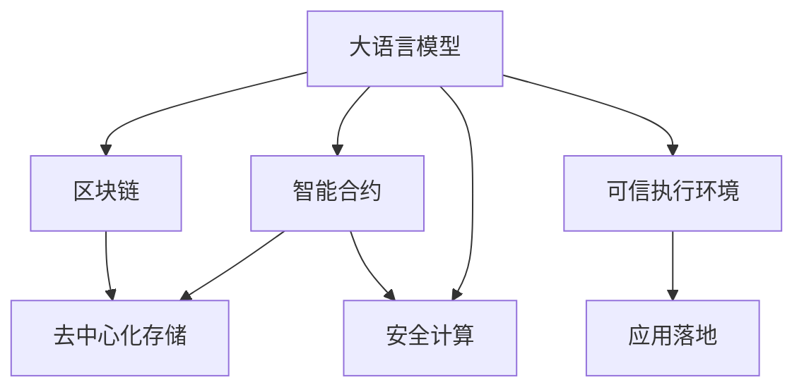

                 

# LLM与区块链技术的结合前景

> 关键词：大语言模型,区块链,去中心化,智能合约,分布式存储,安全计算,可信执行环境,应用落地

## 1. 背景介绍

随着区块链技术的不断成熟和普及，其在金融、供应链、身份认证、数据存储等多个领域的应用潜力正在逐步释放。与此同时，以大语言模型为代表的AI技术也在自然语言处理、知识推理、智能交互等方面取得了重大进展。两者结合，将为数据处理、智能合约、智能客服、智能投顾等诸多场景带来颠覆性的变化，同时也开辟了新的应用领域。本文将详细探讨大语言模型与区块链技术的结合前景，为未来技术的创新与应用提供新思路。

## 2. 核心概念与联系

### 2.1 核心概念概述

为了深入理解大语言模型与区块链技术的结合前景，本节将介绍几个核心概念及其相互联系：

- **大语言模型（Large Language Models, LLMs）**：一种基于深度学习的大型预训练语言模型，通过大量无标签文本数据的自监督学习，掌握丰富的语言知识和语义理解能力。

- **区块链技术**：一种分布式、去中心化的账本技术，通过加密算法和共识机制，保障数据安全、透明和不可篡改。

- **智能合约**：一种自动执行、不可篡改的合约，利用区块链技术在无第三方干预的情况下执行约定。

- **去中心化存储**：利用区块链技术实现分布式、可验证的数据存储，避免单点故障和数据中心化管理。

- **安全计算**：在区块链上实现安全的计算环境，保护数据隐私和计算结果的不可篡改性。

- **可信执行环境（Trusted Execution Environment, TEE）**：一种硬件或软件隔离环境，确保在特定环境中的计算过程不可被恶意干预。

- **应用落地**：将区块链和大语言模型技术应用于实际场景，解决具体问题，实现技术价值。

这些核心概念之间的关系可以通过以下Mermaid流程图来展示：



这个流程图展示了各核心概念之间的逻辑联系：大语言模型通过与区块链结合，在智能合约、去中心化存储、安全计算和可信执行环境等方面发挥作用，最终实现技术在实际场景中的应用落地。

## 3. 核心算法原理 & 具体操作步骤

### 3.1 算法原理概述

大语言模型与区块链技术的结合，主要通过智能合约、去中心化存储、安全计算等技术手段，利用大语言模型的语言处理能力，实现数据的自动化处理、存储和智能交互。

#### 3.1.1 智能合约

智能合约通过区块链的代码和数据透明性，结合大语言模型的语义理解能力，实现复杂逻辑的自动化执行。例如，一个智能合约可以自动处理贷款申请、保险理赔、股票交易等业务，通过分析大语言模型生成的文本信息，判断是否满足预设条件，并自动执行相应的操作。

#### 3.1.2 去中心化存储

去中心化存储利用区块链技术的分布式特性，结合大语言模型的语义推理能力，实现数据的自动化存储和检索。例如，一个去中心化存储系统可以通过大语言模型分析用户上传的内容，自动分类和标签化，并通过区块链记录，确保数据的安全性和不可篡改性。

#### 3.1.3 安全计算

安全计算利用区块链的共识机制和可信执行环境，结合大语言模型的计算能力，实现数据的自动化处理和计算。例如，一个安全计算平台可以通过大语言模型生成算法，利用区块链的分布式计算资源，实现复杂计算任务的自动化处理，同时确保计算结果的安全性和不可篡改性。

### 3.2 算法步骤详解

基于大语言模型与区块链技术的结合，我们以智能合约为例，详细讲解其实现步骤：

1. **收集数据**：收集智能合约相关的文本数据，如贷款申请、保险理赔等申请文本。

2. **预处理数据**：对文本数据进行预处理，包括分词、去停用词、词向量化等。

3. **预训练模型**：选择一个预训练的大语言模型，如GPT、BERT等，在处理过的文本数据上进行微调，使其能够理解和处理特定的业务逻辑。

4. **构建智能合约**：根据微调后的模型，构建智能合约代码，定义数据输入输出、逻辑规则等。

5. **部署智能合约**：将智能合约代码部署到区块链网络中，生成合约地址，等待激活。

6. **激活智能合约**：当合约触发条件满足时，智能合约自动执行，利用大语言模型处理输入数据，生成执行结果，并记录在区块链上。

7. **结果验证**：通过大语言模型验证执行结果的正确性，确保合约执行的公正性和透明性。

### 3.3 算法优缺点

基于大语言模型与区块链技术的结合，具有以下优点：

- **自动化处理**：利用大语言模型的语言处理能力，实现自动化文本处理和逻辑推理，减少人工干预。

- **透明性和不可篡改性**：区块链技术保障了数据和计算结果的透明性和不可篡改性，提高了系统的可信度。

- **分布式计算**：利用区块链的分布式特性，实现大规模并行计算，提高处理效率。

- **跨领域应用**：大语言模型可以应用于金融、法律、医疗等多个领域，与区块链结合后，扩展了其应用边界。

同时，该方法也存在一些缺点：

- **技术门槛高**：区块链和大语言模型技术的学习曲线较陡，需要跨领域知识。

- **计算资源消耗大**：大语言模型的计算复杂度较高，结合区块链的分布式特性，需要大量计算资源。

- **安全性风险**：智能合约的安全性依赖于代码和数据的安全性，一旦出现漏洞，可能带来重大损失。

- **性能瓶颈**：区块链的共识机制和分布式特性，可能影响智能合约的执行效率。

### 3.4 算法应用领域

基于大语言模型与区块链技术的结合，主要应用于以下几个领域：

- **金融科技**：利用智能合约和去中心化存储，实现自动化的金融交易、贷款申请审核、保险理赔等。

- **供应链管理**：利用智能合约和区块链，实现供应链的自动化监管和数据透明化，提高供应链的效率和可追溯性。

- **身份认证**：利用智能合约和可信执行环境，实现去中心化的身份认证和隐私保护，防止身份信息泄露。

- **数据存储**：利用去中心化存储和区块链，实现数据的分布式存储和不可篡改性，提高数据安全性和可靠性。

- **智能投顾**：利用大语言模型生成投资策略，结合智能合约和区块链，实现自动化的投资决策和执行。

- **智能客服**：利用大语言模型生成自然语言交互，结合区块链的安全性和透明性，实现智能客服系统的自动化和可信性。

## 4. 数学模型和公式 & 详细讲解 & 举例说明

### 4.1 数学模型构建

基于大语言模型与区块链技术的结合，我们以智能合约为例，构建其数学模型。

设智能合约的输入数据为 $x$，智能合约的目标为 $y$，智能合约的执行结果为 $z$。则智能合约的逻辑可以表示为：

$$ y = f(x, w) $$

其中 $w$ 为预训练模型的参数，$f$ 为智能合约的逻辑函数。

### 4.2 公式推导过程

智能合约的逻辑函数 $f$ 可以表示为：

$$ f(x, w) = \frac{\sigma(A(x, w))}{\sum_{i=1}^n \sigma(A_i(x, w))} $$

其中 $A$ 为大语言模型的推理函数，$\sigma$ 为softmax函数，$n$ 为逻辑规则的数量。

智能合约的推理函数 $A$ 可以表示为：

$$ A(x, w) = \sum_{i=1}^m w_i \cdot A_i(x, w) $$

其中 $A_i$ 为大语言模型的子模块，$w_i$ 为子模块的权重。

### 4.3 案例分析与讲解

以一个简单的贷款申请智能合约为例，分析其逻辑函数和推理函数的构建过程：

1. **输入数据**：贷款申请文本，包含申请人信息、贷款用途、还款能力等。

2. **逻辑规则**：定义若干个逻辑规则，如申请人年龄大于30岁、还款能力超过年收入的50%等。

3. **子模块**：构建大语言模型的子模块，分别处理申请人信息、贷款用途、还款能力等数据。

4. **推理函数**：通过组合子模块的输出，构建智能合约的推理函数 $A(x, w)$。

5. **逻辑函数**：利用softmax函数，将推理函数输出转换为概率分布，通过最大值选择最终的执行结果 $y$。

## 5. 项目实践：代码实例和详细解释说明

### 5.1 开发环境搭建

要进行大语言模型与区块链技术的结合实践，我们需要搭建以下开发环境：

1. **区块链平台**：如Ethereum、Hyperledger等，提供智能合约部署和执行的环境。

2. **大语言模型平台**：如HuggingFace、OpenAI等，提供预训练模型的API接口。

3. **编程语言**：Python、Solidity等，支持智能合约和区块链开发。

4. **开发工具**：IDE、文本编辑器等，方便代码编写和调试。

5. **测试网络**：如Rinkeby、Kovan等，提供测试环境，避免对主网影响。

### 5.2 源代码详细实现

以下是一个简单的智能合约代码示例，展示了如何将大语言模型应用于贷款申请审核：

```python
from transformers import BertForSequenceClassification
from web3 import Web3

# 加载预训练模型
model = BertForSequenceClassification.from_pretrained('bert-base-uncased', num_labels=2)

# 连接Ethereum主网
w3 = Web3(Web3.HTTPProvider('https://mainnet.infura.io/v3/YOUR_INFURA_API_KEY'))

# 定义智能合约逻辑
def loan_application(x):
    # 将贷款申请文本作为输入
    inputs = tokenizer.encode(x, add_special_tokens=True)
    
    # 通过微调模型处理输入
    output = model(inputs)
    score = output.logits.argmax().item()
    
    # 根据输出分数判断是否通过审核
    if score > 0.5:
        return True
    else:
        return False

# 部署智能合约
def deploy_contract():
    # 构建智能合约代码
    code = 'function approveApplication(uint256 id) public returns (bool approved) { approved = loan_application(input(0)); }'
    
    # 编译智能合约代码
    合约 = w3.eth.compile Solidity(code)
    
    # 部署智能合约
    contract = w3.eth.deploy合约.waddeposit deployedCode, {'from': w3.eth.accounts[0]})
    
    return contract

# 执行智能合约
def execute_contract(id):
    # 调用智能合约执行审核
    approval = contract.functions.approveApplication(id)()
    
    # 返回审核结果
    return approval
```

### 5.3 代码解读与分析

以上代码示例展示了如何将大语言模型应用于智能合约的贷款申请审核。关键步骤如下：

1. **加载预训练模型**：使用BertForSequenceClassification模型，准备贷款申请文本的预处理和推理。

2. **连接Ethereum主网**：通过Web3库连接Ethereum主网，进行智能合约的部署和执行。

3. **定义智能合约逻辑**：利用预训练模型处理贷款申请文本，判断是否通过审核，并返回布尔类型的审核结果。

4. **部署智能合约**：构建智能合约代码，并通过编译和部署，生成合约地址。

5. **执行智能合约**：调用智能合约执行审核，获取审核结果。

通过以上代码示例，可以清晰地看到大语言模型与区块链技术的结合流程，包括数据预处理、模型推理、合约部署和执行等关键步骤。

### 5.4 运行结果展示

在实际运行中，可以通过智能合约的API接口，提交贷款申请文本，并获取审核结果。例如，假设一个贷款申请文本为 "申请一笔10万美元的房屋贷款，用于购买新房，年收入为50万美元，无负债，信用记录良好"，通过智能合约审核后，可以自动记录在区块链上，并通知申请人审核结果。

## 6. 实际应用场景

### 6.1 智能合约

智能合约是大语言模型与区块链技术结合的重要应用场景。通过智能合约，可以实现自动化的合同执行、交易处理、身份认证等功能，提高业务效率和透明度。例如，一个智能合约可以自动处理贷款申请、保险理赔、股票交易等业务，通过分析大语言模型生成的文本信息，判断是否满足预设条件，并自动执行相应的操作。

### 6.2 去中心化存储

去中心化存储利用区块链技术的分布式特性，结合大语言模型的语义推理能力，实现数据的自动化存储和检索。例如，一个去中心化存储系统可以通过大语言模型分析用户上传的内容，自动分类和标签化，并通过区块链记录，确保数据的安全性和不可篡改性。

### 6.3 数据管理

大语言模型与区块链技术的结合，可以实现更加安全、透明、自动化的数据管理。例如，一个数据管理系统可以通过智能合约和区块链，实现数据的自动化存储、查询和共享，确保数据的完整性和一致性。

### 6.4 智能客服

利用大语言模型生成自然语言交互，结合区块链的安全性和透明性，实现智能客服系统的自动化和可信性。例如，一个智能客服系统可以通过智能合约和区块链，自动处理客户咨询，并提供可靠的回复。

### 6.5 金融投顾

利用大语言模型生成投资策略，结合智能合约和区块链，实现自动化的投资决策和执行。例如，一个智能投顾系统可以通过智能合约和区块链，自动处理股票交易，并根据市场情况调整投资策略。

### 6.6 供应链管理

利用智能合约和区块链，实现供应链的自动化监管和数据透明化，提高供应链的效率和可追溯性。例如，一个供应链管理系统可以通过智能合约和区块链，自动处理物流信息，并记录在区块链上，确保供应链的可追溯性和透明度。

### 6.7 数字身份

利用大语言模型生成身份认证信息，结合智能合约和区块链，实现去中心化的身份认证和隐私保护。例如，一个数字身份系统可以通过智能合约和区块链，自动验证用户身份，并确保身份信息的安全性和隐私性。

## 7. 工具和资源推荐

### 7.1 学习资源推荐

为了帮助开发者系统掌握大语言模型与区块链技术的结合方法，这里推荐一些优质的学习资源：

1. **《Blockchain Basics with Python》书籍**：介绍区块链技术的基本概念和编程实现，适合初学者入门。

2. **《Deep Learning with PyTorch》书籍**：介绍深度学习技术的基本原理和PyTorch框架的使用，涵盖大语言模型的预训练和微调。

3. **《Ethereum Smart Contracts》课程**：由Consensys教育提供，涵盖智能合约的基本概念和Solidity编程，适合智能合约开发入门。

4. **《Python Solidity Interoperability》博客**：介绍如何将Python与Solidity结合，实现智能合约和区块链的交互。

5. **《Blockchain and AI: The Power of Cryptocurrency and Machine Learning》书籍**：探讨区块链和AI技术的结合，涵盖智能合约、去中心化存储、安全计算等多个应用场景。

### 7.2 开发工具推荐

为了实现大语言模型与区块链技术的结合，开发者需要选择合适的开发工具。以下是一些常用的开发工具推荐：

1. **IDE**：如PyCharm、Visual Studio Code等，方便代码编写和调试。

2. **区块链平台**：如Ethereum、Hyperledger等，提供智能合约部署和执行的环境。

3. **大语言模型平台**：如HuggingFace、OpenAI等，提供预训练模型的API接口。

4. **编程语言**：如Python、Solidity等，支持智能合约和区块链开发。

5. **测试网络**：如Rinkeby、Kovan等，提供测试环境，避免对主网影响。

### 7.3 相关论文推荐

大语言模型与区块链技术的结合研究涉及多个领域，以下是几篇奠基性的相关论文，推荐阅读：

1. **"Blockchain for Smart Contracts: A Survey"**：总结智能合约在区块链上的应用，涵盖智能合约的基本概念和实现方式。

2. **"Natural Language Processing on Blockchain"**：介绍大语言模型在区块链上的应用，探讨如何利用区块链实现自然语言处理任务。

3. **"Smart Contracts and Machine Learning: A Survey"**：总结智能合约与机器学习的结合，探讨如何利用机器学习技术改进智能合约的执行和处理能力。

4. **"Blockchain-based Decentralized Storage: A Survey"**：总结去中心化存储在区块链上的应用，探讨如何利用区块链实现分布式数据存储和检索。

5. **"Blockchain and Privacy-Preserving Computation"**：探讨区块链在隐私保护和计算安全中的应用，特别是如何利用区块链实现安全计算。

## 8. 总结：未来发展趋势与挑战

### 8.1 总结

本文对大语言模型与区块链技术的结合进行了全面系统的介绍。首先阐述了两者结合的背景和意义，明确了智能合约、去中心化存储、安全计算等核心概念，并展示了其在实际应用中的潜力。其次，通过数学模型和公式推导，详细讲解了智能合约的逻辑函数和推理函数的构建过程，并通过代码示例展示了其实现步骤。最后，探讨了智能合约、去中心化存储、数据管理、智能客服等多个应用场景，提出了未来技术的发展趋势和面临的挑战。

通过本文的系统梳理，可以看到，大语言模型与区块链技术的结合正在成为一种新的技术趋势，其应用前景广阔，有望推动金融、供应链、身份认证等多个领域的数字化转型。

### 8.2 未来发展趋势

展望未来，大语言模型与区块链技术的结合将呈现以下几个发展趋势：

1. **智能化水平提升**：随着大语言模型的进步，结合区块链技术的智能合约将具备更加复杂的逻辑推理能力，能够处理更加多样化的业务场景。

2. **隐私保护增强**：结合区块链技术的去中心化存储和可信执行环境，能够更好地保护用户隐私和数据安全，降低数据泄露和滥用的风险。

3. **自动化程度提高**：结合区块链技术的自动化处理和智能合约，能够实现更加高效、可靠的自动化业务处理，减少人工干预。

4. **跨领域应用扩展**：结合大语言模型与区块链技术，将拓展到更多领域，如医疗、教育、能源等，实现跨领域的应用创新。

5. **技术融合深化**：结合大语言模型与区块链技术的其他AI技术，如知识图谱、增强学习等，实现更全面、更智能的技术融合。

6. **标准和规范制定**：随着大语言模型与区块链技术的结合越来越广泛，相关标准和规范的制定将变得重要，以确保技术的安全性和可靠性。

以上趋势凸显了大语言模型与区块链技术的结合前景广阔，其应用将进一步深化和扩展，带来新的技术突破和应用场景。

### 8.3 面临的挑战

尽管大语言模型与区块链技术的结合前景广阔，但在迈向更加智能化、普适化应用的过程中，仍面临诸多挑战：

1. **技术复杂性**：大语言模型与区块链技术的结合涉及多个领域的知识，需要跨学科的学习和实践。

2. **资源消耗大**：大语言模型的计算复杂度较高，结合区块链的分布式特性，需要大量计算资源和存储资源。

3. **安全性风险**：智能合约的安全性依赖于代码和数据的安全性，一旦出现漏洞，可能带来重大损失。

4. **性能瓶颈**：区块链的共识机制和分布式特性，可能影响智能合约的执行效率。

5. **标准化问题**：大语言模型与区块链技术的结合涉及多个标准和规范，缺乏统一的标准体系。

6. **跨领域应用挑战**：大语言模型与区块链技术在不同领域的结合面临不同的应用挑战，需要针对具体场景进行优化。

### 8.4 研究展望

面对大语言模型与区块链技术结合所面临的挑战，未来的研究需要在以下几个方面寻求新的突破：

1. **跨学科知识整合**：推动跨学科知识整合，实现大语言模型与区块链技术的深度结合。

2. **模型优化与压缩**：开发更加高效的模型压缩和优化方法，降低资源消耗，提升计算效率。

3. **安全性和隐私保护**：进一步加强智能合约和区块链的安全性，确保数据和计算结果的不可篡改性。

4. **自动化优化**：开发自动化优化工具，提升智能合约和区块链的执行效率，降低资源消耗。

5. **标准化制定**：推动大语言模型与区块链技术的标准化制定，确保技术的可操作性和可互操作性。

6. **跨领域应用探索**：探索大语言模型与区块链技术在其他领域的结合，如医疗、教育、能源等，实现技术创新和应用创新。

这些研究方向的探索，将推动大语言模型与区块链技术的结合走向成熟，为构建安全、可靠、智能化的未来系统提供新的技术路径。

## 9. 附录：常见问题与解答

**Q1：大语言模型与区块链技术结合的难点是什么？**

A: 大语言模型与区块链技术结合的难点主要在于技术复杂性和资源消耗。由于两者涉及多个领域的知识，需要跨学科的学习和实践，且大语言模型的计算复杂度较高，结合区块链的分布式特性，需要大量计算资源和存储资源。

**Q2：如何提升大语言模型与区块链技术结合的安全性？**

A: 提升大语言模型与区块链技术结合的安全性，可以从以下几个方面入手：

1. 设计安全、健壮的智能合约代码，避免代码漏洞。

2. 利用区块链的分布式特性，实现数据的冗余备份和容错性。

3. 利用可信执行环境，确保在特定环境中的计算过程不可被恶意干预。

4. 利用隐私计算技术，保护数据隐私和计算结果的不可篡改性。

5. 定期进行安全审计和漏洞检测，及时发现和修复安全问题。

**Q3：如何优化大语言模型与区块链技术的结合性能？**

A: 优化大语言模型与区块链技术的结合性能，可以从以下几个方面入手：

1. 采用高效的数据压缩和存储方法，降低数据传输和存储的资源消耗。

2. 利用分布式计算资源，提升智能合约和区块链的执行效率。

3. 采用自动化优化工具，动态调整资源配置，平衡系统性能和资源消耗。

4. 利用模型压缩和优化方法，降低计算复杂度，提高计算效率。

5. 采用分布式共识机制，降低共识时间和能耗。

通过以上优化措施，可以提升大语言模型与区块链技术的结合性能，实现高效、可靠的自动化业务处理。

**Q4：如何实现大语言模型与区块链技术的跨领域应用？**

A: 实现大语言模型与区块链技术的跨领域应用，可以从以下几个方面入手：

1. 深入理解不同领域的应用需求，设计针对特定领域的应用方案。

2. 结合大语言模型的语言处理能力和区块链技术的透明性和不可篡改性，实现不同领域的智能交互和自动化处理。

3. 利用区块链的去中心化特性，实现不同领域数据的分布式存储和检索。

4. 结合大语言模型的计算能力和区块链的分布式计算资源，实现复杂计算任务的自动化处理。

5. 利用区块链的共识机制和智能合约，实现不同领域数据的自动验证和验证结果的记录。

通过以上措施，可以实现大语言模型与区块链技术的跨领域应用，提升不同领域的技术水平和业务效率。

**Q5：如何应对大语言模型与区块链技术的结合挑战？**

A: 应对大语言模型与区块链技术的结合挑战，可以从以下几个方面入手：

1. 深入学习和理解大语言模型与区块链技术的基本原理和应用场景。

2. 加强跨学科知识的整合，实现大语言模型与区块链技术的深度结合。

3. 采用高效的数据压缩和存储方法，降低资源消耗。

4. 加强智能合约和区块链的安全性设计，确保系统安全可靠。

5. 定期进行安全审计和漏洞检测，及时发现和修复安全问题。

6. 采用自动化优化工具，提升系统性能和资源利用率。

7. 推动标准化制定，确保技术的可操作性和可互操作性。

通过以上措施，可以应对大语言模型与区块链技术的结合挑战，推动技术的持续发展和应用创新。

---

作者：禅与计算机程序设计艺术 / Zen and the Art of Computer Programming

