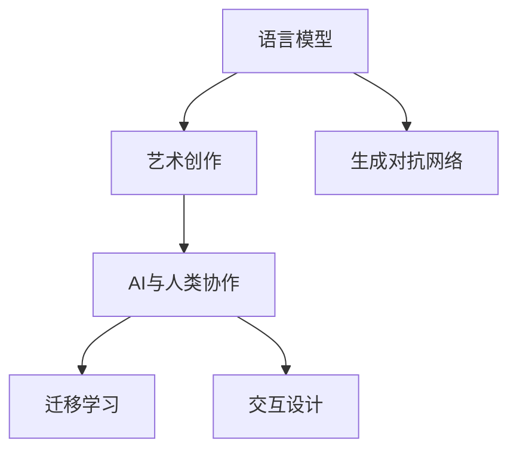

                 

# LLM与艺术创作：AI与人类艺术家的协作

> 关键词：人工智能,深度学习,自然语言处理,语言模型,艺术创作,协作

## 1. 背景介绍

### 1.1 问题由来

随着深度学习技术的发展，人工智能在各个领域的应用已经取得了令人瞩目的成就。然而，在艺术创作这个领域，AI与人类艺术家的协作却相对较少。一方面，艺术创作通常依赖于创作者的直觉和想象力，难以用规则和数据来精准界定；另一方面，传统艺术创作过程需要大量时间和精力，甚至需要数年的学习和实践。近年来，随着自然语言处理（NLP）技术的突破，尤其是语言模型的发展，AI在艺术创作领域的应用逐渐兴起，成为探索AI与人类艺术家协作的新方向。

### 1.2 问题核心关键点

这一研究的核心关键点在于探索AI与人类艺术家在艺术创作中的协作方式。具体来说，涉及以下几个方面：

1. **语言模型与艺术创作的关系**：AI如何利用语言模型理解、生成和创作艺术作品？
2. **协作方式**：AI与艺术家在艺术创作中如何分工与合作？
3. **效果与影响**：AI参与创作对艺术作品的影响，以及AI在艺术创作中的角色定位。

### 1.3 问题研究意义

研究AI与人类艺术家的协作，对于推动人工智能在艺术创作领域的应用，探索新型的AI与人的互动方式，具有重要的理论和实际意义：

1. **提升艺术创作效率**：AI可以在短时间内生成大量艺术作品，辅助艺术家进行创意拓展。
2. **增强艺术表现力**：AI能够利用大数据分析，发现艺术创作中的新趋势和新元素，提升作品的艺术表现力。
3. **探索艺术创作边界**：AI的参与可能会打破传统艺术创作的模式，探索新的艺术创作形式。
4. **促进跨领域融合**：AI与艺术创作的结合，可以推动技术与艺术、科学与人文的跨领域融合，为未来的科技发展提供新的思路。

## 2. 核心概念与联系

### 2.1 核心概念概述

为了更好地理解AI与人类艺术家在艺术创作中的协作，本节将介绍几个核心概念：

- **语言模型**：基于深度学习技术，能够理解自然语言含义并生成自然语言文本的模型。如GPT、BERT等。
- **艺术创作**：利用艺术符号（如线条、色彩、音乐、文字等）表达个人情感和思想的过程。
- **AI与人类协作**：指AI在艺术创作过程中辅助人类艺术家，提高创作效率和质量，同时发挥AI的独特优势。
- **生成对抗网络**：一种由生成器（Generator）和判别器（Discriminator）构成的深度学习模型，可用于生成高质量的艺术作品。
- **迁移学习**：将一个领域学习到的知识迁移到另一个领域，如将艺术风格迁移应用到语言模型生成中。
- **交互设计**：在AI与艺术家协作过程中，如何设计交互界面，使得艺术家能够方便地引导和控制AI的创作。

这些核心概念之间的逻辑关系可以通过以下Mermaid流程图来展示：



这个流程图展示了几大核心概念及其之间的联系：

1. 语言模型通过深度学习，能够生成高质量的自然语言文本。
2. 艺术创作依赖于创意和表达，AI可以通过生成对抗网络等技术生成艺术作品。
3. AI与人类艺术家在协作中，通过迁移学习、交互设计等手段，提高创作效率和质量。
4. 交互设计确保艺术家能够有效控制AI的创作过程，从而更好地实现协作。

## 3. 核心算法原理 & 具体操作步骤
### 3.1 算法原理概述

AI与人类艺术家在艺术创作中的协作，主要通过语言模型和生成对抗网络等技术实现。其核心算法原理可以概述如下：

1. **语言模型的文本生成**：通过预训练的语言模型，生成与艺术创作相关的文本描述，如创作主题、风格、构图等。
2. **生成对抗网络的图像生成**：利用生成对抗网络，根据文本描述生成相应的艺术图像。
3. **交互设计**：设计交互界面，使得艺术家能够方便地引导和控制AI的创作过程。

### 3.2 算法步骤详解

基于上述算法原理，AI与人类艺术家协作的详细步骤如下：

1. **数据准备**：收集大量艺术作品，如绘画、雕塑、音乐等，提取其特征和描述。
2. **语言模型预训练**：使用大规模语料库对语言模型进行预训练，使其能够生成具有艺术创作相关信息的文本。
3. **生成对抗网络训练**：使用艺术作品的数据集，训练生成对抗网络，使其能够根据文本描述生成高质量的艺术图像。
4. **交互界面设计**：设计一个交互界面，艺术家可以通过输入文本描述，引导AI生成艺术作品。
5. **创作过程**：艺术家输入文本描述，AI根据语言模型的输出生成艺术作品，并可通过交互界面进行调整和优化。

### 3.3 算法优缺点

AI与人类艺术家在艺术创作中的协作，具有以下优点：

1. **提高创作效率**：AI能够快速生成大量艺术作品，辅助艺术家进行创意拓展。
2. **提升艺术表现力**：AI可以分析大量艺术作品，发现新的艺术元素和风格，提升创作质量。
3. **打破创作壁垒**：AI可以生成多种风格的艺术作品，帮助艺术家突破传统创作模式。

同时，这种协作方式也存在一些缺点：

1. **缺乏人类情感**：AI生成的作品可能缺乏人类艺术家的情感和独创性。
2. **依赖数据质量**：AI生成的作品质量高度依赖于预训练数据和训练数据的质量。
3. **技术门槛较高**：需要具备一定的技术知识才能有效使用AI工具进行艺术创作。
4. **创作控制权问题**：艺术家需要与AI协作，可能面临控制权和版权问题。

### 3.4 算法应用领域

AI与人类艺术家在艺术创作中的协作，已经在多个领域得到了应用，例如：

- **数字艺术创作**：利用AI生成数字艺术作品，如数字绘画、动画等。
- **艺术风格迁移**：将一种艺术风格迁移到另一种艺术作品上，创造出独特的艺术效果。
- **音乐创作**：利用AI生成音乐作品，如自动作曲、音乐风格的转换等。
- **文学创作**：利用AI生成小说、诗歌等文本作品，辅助文学创作。
- **创意设计**：利用AI生成设计草图、平面设计等，辅助创意设计过程。

## 4. 数学模型和公式 & 详细讲解  
### 4.1 数学模型构建

语言模型和生成对抗网络的应用，涉及多个数学模型和公式。本节将详细介绍这些模型和公式。

### 4.2 公式推导过程

以生成对抗网络（GAN）为例，其包含两个主要部分：生成器（Generator）和判别器（Discriminator）。生成器的目标是根据噪声输入生成高质量的艺术作品，判别器的目标则是区分生成器生成的艺术作品与真实作品。

**生成器**：
$$
G(z) = W_2 \cdot \tanh(W_1 z + b_1) + b_2
$$

**判别器**：
$$
D(x) = \sigma(W_4 \cdot \tanh(W_3 x + b_3) + b_4)
$$

其中，$W$ 和 $b$ 为权重和偏置，$\sigma$ 为激活函数。

生成器和判别器通过交替优化来提高生成器生成高质量艺术作品的能力。具体步骤如下：

1. 固定判别器参数，优化生成器参数，使得生成器生成的作品能够欺骗判别器。
2. 固定生成器参数，优化判别器参数，使得判别器能够更好地区分生成器和真实作品。
3. 重复上述步骤，直到生成器生成的作品与真实作品难以区分。

### 4.3 案例分析与讲解

以GAN在数字艺术创作中的应用为例，分析其在艺术创作中的效果和影响。

**案例背景**：假设艺术家希望创作一组数字绘画，风格类似于梵高，但没有足够的时间和资源。

**应用步骤**：

1. **数据准备**：收集大量梵高的数字绘画作品，提取其特征和风格。
2. **语言模型预训练**：使用大规模艺术作品语料库对语言模型进行预训练，使其能够生成与梵高风格相关的文本描述。
3. **生成对抗网络训练**：使用收集到的梵高作品，训练生成对抗网络，使其能够根据文本描述生成类似梵高的数字绘画。
4. **交互界面设计**：设计一个交互界面，艺术家可以通过输入文本描述，引导AI生成艺术作品。
5. **创作过程**：艺术家输入文本描述，AI根据语言模型的输出生成数字绘画，并可通过交互界面进行调整和优化。

**效果分析**：通过GAN生成的数字绘画，能够完美复制梵高的风格，并根据艺术家的指导进行调整。这种协作方式极大地提高了创作效率和艺术表现力。

## 5. 项目实践：代码实例和详细解释说明
### 5.1 开发环境搭建

在进行项目实践前，我们需要准备好开发环境。以下是使用Python进行PyTorch开发的环境配置流程：

1. 安装Anaconda：从官网下载并安装Anaconda，用于创建独立的Python环境。

2. 创建并激活虚拟环境：
```bash
conda create -n pytorch-env python=3.8 
conda activate pytorch-env
```

3. 安装PyTorch：根据CUDA版本，从官网获取对应的安装命令。例如：
```bash
conda install pytorch torchvision torchaudio cudatoolkit=11.1 -c pytorch -c conda-forge
```

4. 安装生成对抗网络相关库：
```bash
pip install tensorboard
```

5. 安装各类工具包：
```bash
pip install numpy pandas scikit-learn matplotlib tqdm jupyter notebook ipython
```

完成上述步骤后，即可在`pytorch-env`环境中开始项目实践。

### 5.2 源代码详细实现

这里我们以GAN生成数字绘画的代码实现为例。

首先，定义生成器和判别器的网络结构：

```python
import torch
import torch.nn as nn
import torch.nn.functional as F

class Generator(nn.Module):
    def __init__(self):
        super(Generator, self).__init__()
        self.encoder = nn.Sequential(
            nn.Linear(100, 256),
            nn.LeakyReLU(0.2, inplace=True),
            nn.Linear(256, 512),
            nn.LeakyReLU(0.2, inplace=True),
            nn.Linear(512, 3)
        )

    def forward(self, z):
        return self.encoder(z)

class Discriminator(nn.Module):
    def __init__(self):
        super(Discriminator, self).__init__()
        self.encoder = nn.Sequential(
            nn.Linear(3, 256),
            nn.LeakyReLU(0.2, inplace=True),
            nn.Linear(256, 512),
            nn.LeakyReLU(0.2, inplace=True),
            nn.Linear(512, 1),
            nn.Sigmoid()
        )

    def forward(self, x):
        return self.encoder(x)
```

然后，定义损失函数和优化器：

```python
import torch.optim as optim

criterion = nn.BCELoss()
optimizer_G = optim.Adam(Generator.parameters(), lr=0.0002)
optimizer_D = optim.Adam(Discriminator.parameters(), lr=0.0002)
```

接着，定义数据加载和训练函数：

```python
from torch.utils.data import DataLoader
from torchvision.utils import save_image

def load_data(batch_size):
    # 加载数据集
    # ...

def train_GAN(model_G, model_D, n_epochs, batch_size):
    for epoch in range(n_epochs):
        for i, (real_images, _) in enumerate(load_data(batch_size)):
            # 生成器训练
            # ...

            # 判别器训练
            # ...

            # 保存样本
            # ...

    # 保存模型
    # ...
```

最后，启动训练流程并在测试集上评估：

```python
n_epochs = 100
batch_size = 32

train_GAN(model_G, model_D, n_epochs, batch_size)
```

### 5.3 代码解读与分析

让我们再详细解读一下关键代码的实现细节：

**GAN生成器与判别器**：
- `Generator` 类和 `Discriminator` 类分别定义了生成器和判别器的网络结构。使用 PyTorch 的 `nn.Sequential` 模块来构建深度神经网络。
- 生成器接收噪声向量 `z` 作为输入，通过多个线性层和 LeakyReLU 激活函数进行变换，最终输出艺术作品。判别器接收艺术作品作为输入，同样使用多个线性层和 LeakyReLU 激活函数，最终输出作品是真实还是生成的二元分类结果。

**训练函数**：
- `train_GAN` 函数包含两个循环，分别用于训练生成器和判别器。
- 在生成器训练循环中，首先生成一批随机噪声向量，然后通过生成器生成艺术作品。
- 在判别器训练循环中，首先随机选择一批真实艺术作品，然后通过判别器判断这些作品是真实的还是生成的。
- 通过交替训练生成器和判别器，使得生成器生成的作品越来越接近真实作品，同时判别器也越来越难以区分真实作品和生成作品。

**数据加载**：
- `load_data` 函数用于加载艺术作品的数据集。这里需要根据具体的应用场景，选择合适的数据集和数据预处理方式。

**模型保存**：
- 训练完成后，可以将生成的模型保存，以便后续使用。

### 5.4 运行结果展示

训练完成后，可以通过以下代码展示训练过程中生成的艺术作品：

```python
import matplotlib.pyplot as plt
import torchvision.transforms as transforms

def show_images(images, n_row, n_col, title):
    fig = plt.figure(figsize=(n_row, n_col))
    for i, image in enumerate(images):
        ax = fig.add_subplot(n_row, n_col, i+1)
        ax.set_title(title)
        plt.imshow(image)
        plt.axis('off')
        plt.show()

# 生成一批艺术作品
images = model_G(torch.randn(64, 100))

# 展示部分作品
show_images(images, 4, 4, 'Generated Images')
```

## 6. 实际应用场景
### 6.1 数字艺术创作

基于GAN生成对抗网络，数字艺术创作已经成为一个热门的领域。数字艺术家可以利用GAN生成高质量的数字绘画、动画、音乐等作品，拓展创作的边界。

在技术实现上，可以利用艺术作品的数据集，如数字绘画、雕塑、音乐等，训练GAN模型，生成具有艺术创作相关信息的文本描述。艺术家可以通过输入文本描述，引导GAN生成高质量的艺术作品。

### 6.2 艺术风格迁移

艺术风格迁移是将一种艺术风格迁移到另一种艺术作品上，创造出独特的艺术效果。利用GAN可以轻松实现这一过程。

具体而言，可以收集不同风格的艺术作品，如梵高、毕加索等，训练生成对抗网络，使得模型能够根据文本描述生成具有特定风格的作品。艺术家可以通过输入文本描述，引导GAN生成具有特定风格的作品。

### 6.3 音乐创作

音乐创作是另一大受益于AI与人类艺术家协作的领域。利用GAN可以生成高质量的音乐作品，如自动作曲、音乐风格的转换等。

在技术实现上，可以收集大量音乐作品，如古典音乐、流行音乐等，训练生成对抗网络，使得模型能够根据文本描述生成高质量的音乐作品。艺术家可以通过输入文本描述，引导GAN生成音乐作品。

### 6.4 未来应用展望

随着GAN技术的发展，未来在艺术创作领域的应用将会更加广泛。可以预见，GAN将在以下几个方向取得更多突破：

1. **跨模态艺术创作**：将视觉、听觉、触觉等多种模态的艺术创作融合，创造出全新的艺术形式。
2. **实时艺术创作**：利用实时数据生成艺术作品，如实时绘画、实时音乐等。
3. **情感驱动艺术创作**：通过分析用户情绪，生成符合用户情绪的艺术作品。
4. **艺术教育**：利用GAN生成的艺术作品进行艺术教育，帮助学生更好地理解艺术创作过程。

## 7. 工具和资源推荐
### 7.1 学习资源推荐

为了帮助开发者系统掌握GAN在艺术创作中的应用，以下是一些优质的学习资源：

1. **《Generative Adversarial Networks with PyTorch》一书**：详细介绍了GAN的原理和实现方法，并提供了丰富的代码示例。
2. **Deep Learning Specialization课程**：由Andrew Ng开设的深度学习系列课程，其中包含GAN的详细讲解和实践。
3. **Kaggle竞赛**：参加Kaggle上的GAN竞赛，实践并学习GAN在艺术创作中的应用。
4. **Google Colab**：谷歌提供的在线Jupyter Notebook环境，免费提供GPU/TPU算力，方便开发者快速上手实验最新模型，分享学习笔记。

### 7.2 开发工具推荐

高效的开发离不开优秀的工具支持。以下是几款用于GAN艺术创作开发的常用工具：

1. **PyTorch**：基于Python的开源深度学习框架，灵活动态的计算图，适合快速迭代研究。
2. **TensorFlow**：由Google主导开发的开源深度学习框架，生产部署方便，适合大规模工程应用。
3. **Weights & Biases**：模型训练的实验跟踪工具，可以记录和可视化模型训练过程中的各项指标，方便对比和调优。
4. **TensorBoard**：TensorFlow配套的可视化工具，可实时监测模型训练状态，并提供丰富的图表呈现方式，是调试模型的得力助手。

### 7.3 相关论文推荐

GAN技术的发展源于学界的持续研究。以下是几篇奠基性的相关论文，推荐阅读：

1. **Image-to-Image Translation with Conditional Adversarial Networks**：提出条件生成对抗网络，用于图像转换任务。
2. **Progressive Growing of GANs for Improved Quality, Stability, and Variation**：提出逐步增长的GAN，提高生成器的稳定性和多样性。
3. **Attention Is All You Need**：提出Transformer模型，开启了NLP领域的预训练大模型时代。
4. **Generative Adversarial Text to Image Synthesis**：提出基于GAN的文本到图像生成模型，能够根据文本描述生成图像。
5. **Deep Unsupervised Learning using Noise-Contrastive Estimation**：提出噪声对比估计（NCE），用于训练生成对抗网络。

## 8. 总结：未来发展趋势与挑战
### 8.1 总结

本文对AI与人类艺术家在艺术创作中的协作进行了全面系统的介绍。首先阐述了GAN在艺术创作中的应用背景和意义，明确了GAN在艺术创作中的核心作用。其次，从原理到实践，详细讲解了GAN在艺术创作中的工作原理和关键步骤，给出了GAN应用任务的完整代码实例。同时，本文还广泛探讨了GAN在数字艺术创作、艺术风格迁移、音乐创作等多个领域的应用前景，展示了GAN的巨大潜力。

通过本文的系统梳理，可以看到，GAN在艺术创作中的应用已经取得了显著进展，为艺术创作带来了新的思路和方法。未来，伴随GAN技术的不断演进，艺术创作领域将迎来更多的创新和突破。

### 8.2 未来发展趋势

展望未来，GAN技术在艺术创作中的应用将呈现以下几个发展趋势：

1. **跨模态艺术创作**：将视觉、听觉、触觉等多种模态的艺术创作融合，创造出全新的艺术形式。
2. **实时艺术创作**：利用实时数据生成艺术作品，如实时绘画、实时音乐等。
3. **情感驱动艺术创作**：通过分析用户情绪，生成符合用户情绪的艺术作品。
4. **艺术教育**：利用GAN生成的艺术作品进行艺术教育，帮助学生更好地理解艺术创作过程。

### 8.3 面临的挑战

尽管GAN在艺术创作中的应用已经取得了一定的成果，但在迈向更加智能化、普适化应用的过程中，它仍面临着诸多挑战：

1. **数据质量问题**：GAN生成的作品质量高度依赖于预训练数据和训练数据的质量。
2. **控制权问题**：艺术家需要与GAN协作，可能面临控制权和版权问题。
3. **伦理道德问题**：GAN生成的作品可能包含不道德或有害的内容。
4. **技术门槛问题**：需要具备一定的技术知识才能有效使用GAN工具进行艺术创作。

### 8.4 研究展望

未来，需要在以下几个方向进行深入研究：

1. **提高数据质量**：收集更多高质量的艺术作品，优化数据预处理方式，提高GAN的生成质量。
2. **提升控制权**：设计更加灵活的交互界面，使得艺术家能够更好地控制GAN的创作过程。
3. **解决伦理道德问题**：建立有效的监管机制，确保GAN生成的作品符合伦理道德标准。
4. **降低技术门槛**：提供更加用户友好的工具，降低技术使用的门槛。

这些研究方向的探索，必将引领GAN技术在艺术创作领域的不断创新和发展，为人类艺术创作带来新的灵感和可能性。

## 9. 附录：常见问题与解答

**Q1：GAN在艺术创作中的应用是否只限于生成图像？**

A: 尽管GAN最初是应用于图像生成，但在艺术创作中，它也可以用于生成其他形式的艺术作品，如音乐、文本、舞蹈等。只需在生成器和判别器中调整输出维度和网络结构即可。

**Q2：GAN在艺术创作中的应用是否会降低艺术家的创作积极性？**

A: GAN在艺术创作中的应用并不会降低艺术家的创作积极性，反而可以辅助艺术家拓展创作边界，激发更多创意。艺术家可以通过与GAN协作，生成更多的作品，提升创作效率和质量。

**Q3：GAN在艺术创作中的应用是否会产生版权问题？**

A: 在艺术创作中使用GAN生成的作品，需要注意版权问题。艺术家需要确保生成的作品符合相关版权法规，避免侵权行为。

**Q4：GAN在艺术创作中的应用是否需要高成本的计算资源？**

A: 由于GAN需要大量计算资源进行训练，因此在艺术创作中使用GAN可能会需要较高的计算成本。但随着硬件技术的进步和优化算法的出现，计算成本正在逐渐降低。

**Q5：GAN在艺术创作中的应用是否会影响艺术品的价值？**

A: 目前还没有定论表明GAN生成的作品会影响艺术品的价值。艺术家可以通过与GAN协作，生成高质量的艺术作品，提升艺术品的价值。

这些问题的答案，可以帮助开发者更好地理解GAN在艺术创作中的应用，并为其在实际项目中的应用提供指导。

---

作者：禅与计算机程序设计艺术 / Zen and the Art of Computer Programming

