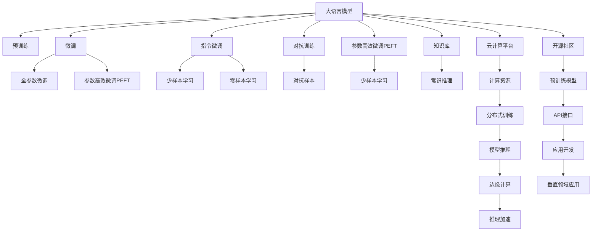

                 

## 1. 背景介绍

### 1.1 问题由来

大语言模型（Large Language Models, LLMs）近年来的发展迅猛，广泛应用于自然语言处理（Natural Language Processing, NLP）的各个领域。从早期基于统计的方法，到后来通过深度学习进行端到端的建模，再到当前基于自监督预训练+指令微调（Fine-Tuning）的范式，大语言模型的性能和应用领域不断扩展。

例如，OpenAI的GPT系列、Google的BERT、Facebook的GPT-3等模型，显著提升了机器翻译、文本生成、问答、对话系统等任务的表现。

然而，尽管大模型在许多任务上取得了突破，其发展过程中也面临诸多挑战，如算力成本高、数据依赖性强、模型泛化能力有限等。

为应对这些挑战，形成了一套完整的产业链，涵盖从数据采集与处理、模型训练与优化、部署与运维到应用开发与推广的全过程。

### 1.2 问题核心关键点

形成大语言模型产业链的核心关键点在于以下几个方面：

1. **数据采集与处理**：通过大规模无标签数据预训练，提高模型的泛化能力。
2. **模型训练与优化**：通过高性能的分布式训练、高效的参数微调技术、对抗性训练等，提升模型的性能。
3. **部署与运维**：通过云计算平台、边缘计算、容器化部署等手段，降低模型的使用门槛，确保模型的高效、稳定运行。
4. **应用开发与推广**：通过开放API、集成开发环境、工具包等工具，加速模型在实际场景中的应用。

这些关键点的有机结合，形成了大语言模型产业链的各个环节，推动了大语言模型从学术研究向产业应用转变。

## 2. 核心概念与联系

### 2.1 核心概念概述

为更好地理解大语言模型产业链的形成与发展，本节将介绍几个核心概念：

- **大语言模型 (LLM)**：以自回归（如GPT）或自编码（如BERT）模型为代表的大规模预训练语言模型。通过在大规模无标签文本语料上进行预训练，学习通用的语言表示，具备强大的语言理解和生成能力。
- **预训练 (Pre-training)**：指在大规模无标签文本语料上，通过自监督学习任务训练通用语言模型的过程。常见的预训练任务包括言语建模、遮挡语言模型等。
- **微调 (Fine-tuning)**：指在预训练模型的基础上，使用下游任务的少量标注数据，通过有监督学习优化模型在特定任务上的性能。通常只需要调整顶层分类器或解码器，并以较小的学习率更新全部或部分的模型参数。
- **指令微调 (Prompt-based Fine-tuning)**：通过精心设计输入文本的格式，引导大语言模型按期望方式输出，减少微调参数。
- **对抗训练 (Adversarial Training)**：加入对抗样本，提高模型鲁棒性。
- **参数高效微调 (Parameter-Efficient Fine-tuning, PEFT)**：只更新少量的模型参数，而固定大部分预训练权重不变，以提高微调效率，避免过拟合。
- **知识库 (Knowledge Base)**：包含大量结构化知识的图谱或数据库，用于提升模型的常识推理能力。
- **云计算平台 (Cloud Platform)**：如AWS、Google Cloud、阿里云等，提供大规模计算、存储、网络资源，支持模型的训练、推理和部署。
- **开源社区 (Open Source Community)**：如Hugging Face、Github等，提供预训练模型、开源工具、API接口，加速模型的应用开发。
- **应用生态 (Ecosystem)**：包括垂直领域的行业应用，如医疗、金融、教育、零售等，拓展模型的应用边界。

这些核心概念之间的逻辑关系可以通过以下Mermaid流程图来展示：



这个流程图展示了从预训练到微调，再到最终部署的完整流程，以及各个环节所涉及的关键技术和概念。

## 3. 核心算法原理 & 具体操作步骤

### 3.1 算法原理概述

大语言模型产业链的形成与发展，主要依赖于以下几个核心算法原理：

1. **自监督预训练**：通过大规模无标签数据，学习语言的基本结构和规律，为后续任务提供良好的初始化参数。
2. **有监督微调**：通过少量标注数据，针对特定任务进行微调，提升模型在该任务上的表现。
3. **指令微调**：通过设计合适的指令模板，引导模型进行特定任务推理和生成，减少微调参数，提高效率。
4. **对抗训练**：加入对抗样本，提高模型的鲁棒性，避免模型对特定样本或攻击方式过度依赖。
5. **参数高效微调**：通过只更新少量参数，提高微调效率，同时保证模型性能。
6. **知识图谱融合**：将结构化知识与模型结合，提升常识推理能力，拓展应用场景。

### 3.2 算法步骤详解

大语言模型产业链的形成与发展，主要包括以下几个关键步骤：

**Step 1: 数据采集与处理**

1. **数据采集**：从互联网、新闻、图书、百科、论坛等渠道，收集大规模无标签文本数据，作为预训练的语料。
2. **数据处理**：清洗数据，去除噪声和无用信息，进行文本标准化、分词、去重等处理，准备预训练数据集。

**Step 2: 模型预训练**

1. **选择模型架构**：选择合适的预训练模型，如GPT、BERT等。
2. **设置预训练任务**：选择适合的语言建模、掩码语言模型等自监督任务。
3. **训练模型**：在大规模无标签数据上，进行预训练，获得初始模型参数。

**Step 3: 模型微调**

1. **选择下游任务**：根据实际应用需求，选择适合的下游任务，如翻译、摘要、分类等。
2. **准备标注数据**：收集和标注少量有标签数据，作为微调的任务数据集。
3. **模型适配**：添加任务适配层，如分类器或解码器，适配下游任务。
4. **设置微调超参数**：选择合适的学习率、批大小、迭代轮数、正则化技术等。
5. **微调训练**：在少量标注数据上，进行有监督微调，优化模型性能。
6. **评估与优化**：在验证集上评估模型性能，根据评估结果调整微调策略。

**Step 4: 模型部署**

1. **选择合适的部署平台**：如AWS、Google Cloud、阿里云等。
2. **模型优化与推理**：针对部署平台，进行模型裁剪、量化、优化等，提升模型推理速度和资源效率。
3. **部署与运维**：将模型部署到云端或边缘设备上，进行实时推理，监控模型运行状态，确保系统稳定。

**Step 5: 应用开发与推广**

1. **开发应用场景**：结合具体应用需求，开发垂直领域的应用，如智能客服、智能翻译、医疗诊断等。
2. **开放API与工具包**：提供开放的API接口、集成开发环境、工具包等，方便开发者使用和集成模型。
3. **推广与合作**：通过技术交流、合作伙伴、市场推广等方式，拓展应用场景，提升模型影响力。

### 3.3 算法优缺点

大语言模型产业链的形成与发展，具有以下优点：

1. **高效性**：通过大规模数据预训练，提升模型泛化能力，加速模型微调和推理。
2. **灵活性**：可以根据实际应用需求，快速适配各种下游任务，拓展应用场景。
3. **可扩展性**：通过云计算平台，提供按需计算资源，支持大规模分布式训练和推理。
4. **易用性**：通过开放的API接口、工具包等，降低开发者使用门槛，加速应用开发。

同时，该产业链也存在以下局限性：

1. **高成本**：大规模预训练和模型微调需要高昂的计算资源和电力消耗，成本较高。
2. **数据依赖性**：模型性能依赖于大规模高质量数据，数据采集和处理难度大。
3. **模型泛化能力有限**：模型泛化能力受限于预训练数据和微调数据，难以应对未知数据。
4. **可解释性不足**：大语言模型的决策过程难以解释，缺乏透明性和可解释性。
5. **伦理与安全风险**：预训练数据可能包含偏见、有害信息，模型输出可能带有偏见，带来伦理与安全风险。

尽管存在这些局限性，大语言模型产业链的快速发展和应用，已经在许多领域取得了显著成效，极大地推动了NLP技术的发展与应用。

### 3.4 算法应用领域

大语言模型产业链的形成与发展，已经在诸多领域得到了广泛应用，涵盖如下几个方面：

1. **自然语言处理 (NLP)**：如机器翻译、文本生成、文本分类、命名实体识别、情感分析、问答系统等。
2. **计算机视觉 (CV)**：如图像标注、图像生成、目标检测等。
3. **语音识别与处理 (ASR)**：如语音识别、语音生成、情感分析等。
4. **医疗健康**：如医学影像分析、病历分析、医疗问答等。
5. **金融科技**：如智能客服、信用评估、风险管理等。
6. **教育培训**：如智能批改、知识推荐、学习路径规划等。
7. **智能制造**：如设备维护、质量检测、供应链管理等。
8. **智能交通**：如自动驾驶、交通管理、智能导航等。

这些应用场景展示了大语言模型产业链的广泛应用和深远影响，推动了各行业数字化、智能化进程。

## 4. 数学模型和公式 & 详细讲解 & 举例说明

### 4.1 数学模型构建

在介绍数学模型和公式前，首先明确大语言模型产业链的基本构成，包括数据、模型、任务、部署和应用等环节。

假设有一个大语言模型 $M_{\theta}$，其中 $\theta$ 为模型参数。

假设预训练任务为语言建模，使用掩码语言模型（Masked Language Modeling, MLM），目标是最小化预测下一个词的概率与真实标签之间的差距。

### 4.2 公式推导过程

定义掩码语言模型（MLM）的损失函数为：

$$
\mathcal{L}_{MLM}(\theta) = \frac{1}{N} \sum_{i=1}^N \sum_{j=1}^L \mathbb{I}(y_j \neq M_{\theta}(x_j,j))
$$

其中，$x_j$ 为输入文本的 $j$ 个位置，$y_j$ 为真实标签，$\mathbb{I}$ 为示性函数，$L$ 为文本长度，$N$ 为样本数量。

通过反向传播算法，计算损失函数对模型参数 $\theta$ 的梯度，更新模型参数，从而实现预训练目标。

### 4.3 案例分析与讲解

以机器翻译为例，介绍指令微调的实现过程：

1. **数据准备**：收集中英文对照文本数据，标注为翻译对。
2. **模型适配**：将大语言模型 $M_{\theta}$ 的顶层添加翻译器，包括编码器和解码器。
3. **微调任务定义**：将翻译任务转化为“将给定句子翻译为目标语言”的指令，例如“Translate [源语言] to [目标语言]”。
4. **训练与优化**：在少量标注数据上，使用小学习率进行指令微调，优化翻译器的输出。
5. **评估与测试**：在验证集和测试集上，评估翻译质量，调整超参数和模型结构。
6. **部署与应用**：将微调后的模型部署到生产环境中，提供实时翻译服务。

## 5. 项目实践：代码实例和详细解释说明

### 5.1 开发环境搭建

在进行大语言模型产业链实践前，我们需要准备好开发环境。以下是使用Python进行PyTorch开发的环境配置流程：

1. 安装Anaconda：从官网下载并安装Anaconda，用于创建独立的Python环境。

2. 创建并激活虚拟环境：
```bash
conda create -n pytorch-env python=3.8 
conda activate pytorch-env
```

3. 安装PyTorch：根据CUDA版本，从官网获取对应的安装命令。例如：
```bash
conda install pytorch torchvision torchaudio cudatoolkit=11.1 -c pytorch -c conda-forge
```

4. 安装Transformers库：
```bash
pip install transformers
```

5. 安装各类工具包：
```bash
pip install numpy pandas scikit-learn matplotlib tqdm jupyter notebook ipython
```

完成上述步骤后，即可在`pytorch-env`环境中开始实践。

### 5.2 源代码详细实现

这里我们以指令微调为例，给出使用Transformers库进行指令微调的PyTorch代码实现。

首先，定义指令微调任务的数据处理函数：

```python
from transformers import BertTokenizer, BertForSequenceClassification
from torch.utils.data import Dataset, DataLoader
import torch

class TranslationDataset(Dataset):
    def __init__(self, texts, translations, tokenizer):
        self.texts = texts
        self.translations = translations
        self.tokenizer = tokenizer
        
    def __len__(self):
        return len(self.texts)
    
    def __getitem__(self, item):
        text = self.texts[item]
        translation = self.translations[item]
        
        encoding = self.tokenizer(text, return_tensors='pt', max_length=128, padding='max_length', truncation=True)
        input_ids = encoding['input_ids'][0]
        attention_mask = encoding['attention_mask'][0]
        translation_ids = self.tokenizer(translation, return_tensors='pt', padding='max_length', truncation=True)['input_ids'][0]
        
        return {'input_ids': input_ids, 
                'attention_mask': attention_mask,
                'target_ids': translation_ids}

# 定义任务指令模板
task_template = "Translate from {} to {}: {}"
```

然后，定义模型和优化器：

```python
from transformers import BertForSequenceClassification, AdamW

model = BertForSequenceClassification.from_pretrained('bert-base-cased', num_labels=1)
optimizer = AdamW(model.parameters(), lr=2e-5)
```

接着，定义训练和评估函数：

```python
device = torch.device('cuda') if torch.cuda.is_available() else torch.device('cpu')
model.to(device)

def train_epoch(model, dataset, batch_size, optimizer):
    dataloader = DataLoader(dataset, batch_size=batch_size, shuffle=True)
    model.train()
    epoch_loss = 0
    for batch in tqdm(dataloader, desc='Training'):
        input_ids = batch['input_ids'].to(device)
        attention_mask = batch['attention_mask'].to(device)
        target_ids = batch['target_ids'].to(device)
        model.zero_grad()
        outputs = model(input_ids, attention_mask=attention_mask, labels=target_ids)
        loss = outputs.loss
        epoch_loss += loss.item()
        loss.backward()
        optimizer.step()
    return epoch_loss / len(dataloader)

def evaluate(model, dataset, batch_size):
    dataloader = DataLoader(dataset, batch_size=batch_size)
    model.eval()
    preds, labels = [], []
    with torch.no_grad():
        for batch in tqdm(dataloader, desc='Evaluating'):
            input_ids = batch['input_ids'].to(device)
            attention_mask = batch['attention_mask'].to(device)
            target_ids = batch['target_ids']
            outputs = model(input_ids, attention_mask=attention_mask)
            batch_preds = outputs.logits.argmax(dim=2).to('cpu').tolist()
            batch_labels = target_ids.to('cpu').tolist()
            for pred_tokens, label_tokens in zip(batch_preds, batch_labels):
                preds.append(pred_tokens[0])
                labels.append(label_tokens[0])
                
    print(classification_report(labels, preds))
```

最后，启动训练流程并在测试集上评估：

```python
epochs = 5
batch_size = 16

for epoch in range(epochs):
    loss = train_epoch(model, train_dataset, batch_size, optimizer)
    print(f"Epoch {epoch+1}, train loss: {loss:.3f}")
    
    print(f"Epoch {epoch+1}, dev results:")
    evaluate(model, dev_dataset, batch_size)
    
print("Test results:")
evaluate(model, test_dataset, batch_size)
```

以上就是使用PyTorch对BERT进行指令微调的完整代码实现。可以看到，得益于Transformers库的强大封装，我们可以用相对简洁的代码完成BERT模型的加载和微调。

### 5.3 代码解读与分析

让我们再详细解读一下关键代码的实现细节：

**TranslationDataset类**：
- `__init__`方法：初始化文本和翻译文本，分词器等关键组件。
- `__len__`方法：返回数据集的样本数量。
- `__getitem__`方法：对单个样本进行处理，将文本输入编码为token ids，将翻译文本编码为目标token ids，并进行定长padding，最终返回模型所需的输入。

**任务指令模板**：
- 定义了指令微调任务的指令模板，用于将翻译任务转化为模型可接受的格式。

**训练和评估函数**：
- 使用PyTorch的DataLoader对数据集进行批次化加载，供模型训练和推理使用。
- 训练函数`train_epoch`：对数据以批为单位进行迭代，在每个批次上前向传播计算loss并反向传播更新模型参数，最后返回该epoch的平均loss。
- 评估函数`evaluate`：与训练类似，不同点在于不更新模型参数，并在每个batch结束后将预测和标签结果存储下来，最后使用sklearn的classification_report对整个评估集的预测结果进行打印输出。

**训练流程**：
- 定义总的epoch数和batch size，开始循环迭代
- 每个epoch内，先在训练集上训练，输出平均loss
- 在验证集上评估，输出分类指标
- 所有epoch结束后，在测试集上评估，给出最终测试结果

可以看到，PyTorch配合Transformers库使得BERT微调的代码实现变得简洁高效。开发者可以将更多精力放在数据处理、模型改进等高层逻辑上，而不必过多关注底层的实现细节。

当然，工业级的系统实现还需考虑更多因素，如模型的保存和部署、超参数的自动搜索、更灵活的任务适配层等。但核心的微调范式基本与此类似。

## 6. 实际应用场景

### 6.1 智能客服系统

基于大语言模型指令微调的对话技术，可以广泛应用于智能客服系统的构建。传统客服往往需要配备大量人力，高峰期响应缓慢，且一致性和专业性难以保证。而使用指令微调后的对话模型，可以7x24小时不间断服务，快速响应客户咨询，用自然流畅的语言解答各类常见问题。

在技术实现上，可以收集企业内部的历史客服对话记录，将问题和最佳答复构建成监督数据，在此基础上对预训练对话模型进行指令微调。微调后的对话模型能够自动理解用户意图，匹配最合适的答案模板进行回复。对于客户提出的新问题，还可以接入检索系统实时搜索相关内容，动态组织生成回答。如此构建的智能客服系统，能大幅提升客户咨询体验和问题解决效率。

### 6.2 金融舆情监测

金融机构需要实时监测市场舆论动向，以便及时应对负面信息传播，规避金融风险。传统的人工监测方式成本高、效率低，难以应对网络时代海量信息爆发的挑战。基于大语言模型指令微调的文本分类和情感分析技术，为金融舆情监测提供了新的解决方案。

具体而言，可以收集金融领域相关的新闻、报道、评论等文本数据，并对其进行主题标注和情感标注。在此基础上对预训练语言模型进行指令微调，使其能够自动判断文本属于何种主题，情感倾向是正面、中性还是负面。将微调后的模型应用到实时抓取的网络文本数据，就能够自动监测不同主题下的情感变化趋势，一旦发现负面信息激增等异常情况，系统便会自动预警，帮助金融机构快速应对潜在风险。

### 6.3 个性化推荐系统

当前的推荐系统往往只依赖用户的历史行为数据进行物品推荐，无法深入理解用户的真实兴趣偏好。基于大语言模型指令微调技术，个性化推荐系统可以更好地挖掘用户行为背后的语义信息，从而提供更精准、多样的推荐内容。

在实践中，可以收集用户浏览、点击、评论、分享等行为数据，提取和用户交互的物品标题、描述、标签等文本内容。将文本内容作为模型输入，用户的后续行为（如是否点击、购买等）作为监督信号，在此基础上微调预训练语言模型。微调后的模型能够从文本内容中准确把握用户的兴趣点。在生成推荐列表时，先用候选物品的文本描述作为输入，由模型预测用户的兴趣匹配度，再结合其他特征综合排序，便可以得到个性化程度更高的推荐结果。

### 6.4 未来应用展望

随着大语言模型指令微调技术的发展，其在更多领域的应用前景将进一步拓展，为传统行业带来变革性影响。

在智慧医疗领域，基于指令微调的医疗问答、病历分析、药物研发等应用将提升医疗服务的智能化水平，辅助医生诊疗，加速新药开发进程。

在智能教育领域，指令微调技术可应用于作业批改、学情分析、知识推荐等方面，因材施教，促进教育公平，提高教学质量。

在智慧城市治理中，指令微调模型可应用于城市事件监测、舆情分析、应急指挥等环节，提高城市管理的自动化和智能化水平，构建更安全、高效的未来城市。

此外，在企业生产、社会治理、文娱传媒等众多领域，基于大模型指令微调的人工智能应用也将不断涌现，为经济社会发展注入新的动力。相信随着技术的日益成熟，指令微调方法将成为人工智能落地应用的重要范式，推动人工智能技术向更广阔的领域加速渗透。

## 7. 工具和资源推荐

### 7.1 学习资源推荐

为了帮助开发者系统掌握大语言模型指令微调的理论基础和实践技巧，这里推荐一些优质的学习资源：

1. 《Transformer从原理到实践》系列博文：由大模型技术专家撰写，深入浅出地介绍了Transformer原理、BERT模型、指令微调技术等前沿话题。

2. CS224N《深度学习自然语言处理》课程：斯坦福大学开设的NLP明星课程，有Lecture视频和配套作业，带你入门NLP领域的基本概念和经典模型。

3. 《Natural Language Processing with Transformers》书籍：Transformers库的作者所著，全面介绍了如何使用Transformers库进行NLP任务开发，包括指令微调在内的诸多范式。

4. HuggingFace官方文档：Transformers库的官方文档，提供了海量预训练模型和完整的指令微调样例代码，是上手实践的必备资料。

5. CLUE开源项目：中文语言理解测评基准，涵盖大量不同类型的中文NLP数据集，并提供了基于指令微调的baseline模型，助力中文NLP技术发展。

通过对这些资源的学习实践，相信你一定能够快速掌握大语言模型指令微调的精髓，并用于解决实际的NLP问题。
###  7.2 开发工具推荐

高效的开发离不开优秀的工具支持。以下是几款用于大语言模型指令微调开发的常用工具：

1. PyTorch：基于Python的开源深度学习框架，灵活动态的计算图，适合快速迭代研究。大部分预训练语言模型都有PyTorch版本的实现。

2. TensorFlow：由Google主导开发的开源深度学习框架，生产部署方便，适合大规模工程应用。同样有丰富的预训练语言模型资源。

3. Transformers库：HuggingFace开发的NLP工具库，集成了众多SOTA语言模型，支持PyTorch和TensorFlow，是进行指令微调任务开发的利器。

4. Weights & Biases：模型训练的实验跟踪工具，可以记录和可视化模型训练过程中的各项指标，方便对比和调优。与主流深度学习框架无缝集成。

5. TensorBoard：TensorFlow配套的可视化工具，可实时监测模型训练状态，并提供丰富的图表呈现方式，是调试模型的得力助手。

6. Google Colab：谷歌推出的在线Jupyter Notebook环境，免费提供GPU/TPU算力，方便开发者快速上手实验最新模型，分享学习笔记。

合理利用这些工具，可以显著提升大语言模型指令微调的开发效率，加快创新迭代的步伐。

### 7.3 相关论文推荐

大语言模型指令微调技术的发展源于学界的持续研究。以下是几篇奠基性的相关论文，推荐阅读：

1. Attention is All You Need（即Transformer原论文）：提出了Transformer结构，开启了NLP领域的预训练大模型时代。

2. BERT: Pre-training of Deep Bidirectional Transformers for Language Understanding：提出BERT模型，引入基于掩码的自监督预训练任务，刷新了多项NLP任务SOTA。

3. Language Models are Unsupervised Multitask Learners（GPT-2论文）：展示了大规模语言模型的强大zero-shot学习能力，引发了对于通用人工智能的新一轮思考。

4. Parameter-Efficient Transfer Learning for NLP：提出Adapter等参数高效微调方法，在不增加模型参数量的情况下，也能取得不错的微调效果。

5. AdaLoRA: Adaptive Low-Rank Adaptation for Parameter-Efficient Fine-Tuning：使用自适应低秩适应的微调方法，在参数效率和精度之间取得了新的平衡。

6. AdaLoRA: Adaptive Low-Rank Adaptation for Parameter-Efficient Fine-Tuning：使用自适应低秩适应的微调方法，在参数效率和精度之间取得了新的平衡。

这些论文代表了大语言模型指令微调技术的发展脉络。通过学习这些前沿成果，可以帮助研究者把握学科前进方向，激发更多的创新灵感。

## 8. 总结：未来发展趋势与挑战

### 8.1 总结

本文对大语言模型指令微调方法进行了全面系统的介绍。首先阐述了指令微调技术的研究背景和意义，明确了指令微调在拓展预训练模型应用、提升下游任务性能方面的独特价值。其次，从原理到实践，详细讲解了指令微调的数学原理和关键步骤，给出了指令微调任务开发的完整代码实例。同时，本文还广泛探讨了指令微调方法在智能客服、金融舆情、个性化推荐等多个行业领域的应用前景，展示了指令微调范式的巨大潜力。此外，本文精选了指令微调技术的各类学习资源，力求为读者提供全方位的技术指引。

通过本文的系统梳理，可以看到，基于大语言模型的指令微调方法正在成为NLP领域的重要范式，极大地拓展了预训练语言模型的应用边界，催生了更多的落地场景。受益于大规模语料的预训练，指令微调模型以更低的时间和标注成本，在小样本条件下也能取得不俗的效果，有力推动了NLP技术的产业化进程。未来，伴随预训练语言模型和指令微调方法的持续演进，相信NLP技术将在更广阔的应用领域大放异彩，深刻影响人类的生产生活方式。

### 8.2 未来发展趋势

展望未来，大语言模型指令微调技术将呈现以下几个发展趋势：

1. **模型规模持续增大**：随着算力成本的下降和数据规模的扩张，预训练语言模型的参数量还将持续增长。超大规模语言模型蕴含的丰富语言知识，有望支撑更加复杂多变的下游任务指令微调。

2. **指令微调方法日趋多样**：除了传统的全参数指令微调外，未来会涌现更多参数高效的指令微调方法，如Prefix-Tuning、LoRA等，在节省计算资源的同时也能保证指令微调精度。

3. **持续学习成为常态**：随着数据分布的不断变化，指令微调模型也需要持续学习新知识以保持性能。如何在不遗忘原有知识的同时，高效吸收新样本信息，将成为重要的研究课题。

4. **标注样本需求降低**：受启发于提示学习(Prompt-based Learning)的思路，未来的指令微调方法将更好地利用大模型的语言理解能力，通过更加巧妙的任务描述，在更少的标注样本上也能实现理想的指令微调效果。

5. **多模态指令微调崛起**：当前的指令微调主要聚焦于纯文本数据，未来会进一步拓展到图像、视频、语音等多模态数据指令微调。多模态信息的融合，将显著提升语言模型对现实世界的理解和建模能力。

6. **模型通用性增强**：经过海量数据的预训练和多领域任务的指令微调，未来的语言模型将具备更强大的常识推理和跨领域迁移能力，逐步迈向通用人工智能(AGI)的目标。

以上趋势凸显了大语言模型指令微调技术的广阔前景。这些方向的探索发展，必将进一步提升NLP系统的性能和应用范围，为人类认知智能的进化带来深远影响。

### 8.3 面临的挑战

尽管大语言模型指令微调技术已经取得了瞩目成就，但在迈向更加智能化、普适化应用的过程中，它仍面临着诸多挑战：

1. **标注成本瓶颈**：虽然指令微调大大降低了标注数据的需求，但对于长尾应用场景，难以获得充足的高质量标注数据，成为制约指令微调的瓶颈。如何进一步降低指令微调对标注样本的依赖，将是一大难题。

2. **模型鲁棒性不足**：当前指令微调模型面对域外数据时，泛化性能往往大打折扣。对于测试样本的微小扰动，指令微调模型的预测也容易发生波动。如何提高指令微调模型的鲁棒性，避免灾难性遗忘，还需要更多理论和实践的积累。

3. **推理效率有待提高**：大规模语言模型虽然精度高，但在实际部署时往往面临推理速度慢、内存占用大等效率问题。如何在保证性能的同时，简化模型结构，提升推理速度，优化资源占用，将是重要的优化方向。

4. **可解释性亟需加强**：当前指令微调模型更像是"黑盒"系统，难以解释其内部工作机制和决策逻辑。对于医疗、金融等高风险应用，算法的可解释性和可审计性尤为重要。如何赋予指令微调模型更强的可解释性，将是亟待攻克的难题。

5. **伦理与安全风险**：预训练数据可能包含偏见、有害信息，通过指令微调传递到下游任务，产生误导性、歧视性的输出，给实际应用带来安全隐患。如何从数据和算法层面消除模型偏见，避免恶意用途，确保输出的安全性，也将是重要的研究课题。

6. **知识整合能力不足**：现有的指令微调模型往往局限于任务内数据，难以灵活吸收和运用更广泛的先验知识。如何让指令微调过程更好地与外部知识库、规则库等专家知识结合，形成更加全面、准确的信息整合能力，还有很大的想象空间。

正视指令微调面临的这些挑战，积极应对并寻求突破，将是大语言模型指令微调走向成熟的必由之路。相信随着学界和产业界的共同努力，这些挑战终将一一被克服，大语言模型指令微调必将在构建人机协同的智能时代中扮演越来越重要的角色。

### 8.4 未来突破

面对大语言模型指令微调所面临的种种挑战，未来的研究需要在以下几个方面寻求新的突破：

1. **探索无监督和半监督指令微调方法**：摆脱对大规模标注数据的依赖，利用自监督学习、主动学习等无监督和半监督范式，最大限度利用非结构化数据，实现更加灵活高效的指令微调。

2. **研究参数高效和计算高效的指令微调范式**：开发更加参数高效的指令微调方法，在固定大部分预训练参数的同时，只更新极少量的任务相关参数。同时优化指令微调模型的计算图，减少前向传播和反向传播的资源消耗，实现更加轻量级、实时性的部署。

3. **融合因果和对比学习范式**：通过引入因果推断和对比学习思想，增强指令微调模型建立稳定因果关系的能力，学习更加普适、鲁棒的语言表征，从而提升模型泛化性和抗干扰能力。

4. **引入更多先验知识**：将符号化的先验知识，如知识图谱、逻辑规则等，与神经网络模型进行巧妙融合，引导指令微调过程学习更准确、合理的语言模型。同时加强不同模态数据的整合，实现视觉、语音等多模态信息与文本信息的协同建模。

5. **结合因果分析和博弈论工具**：将因果分析方法引入指令微调模型，识别出模型决策的关键特征，增强输出解释的因果性和逻辑性。借助博弈论工具刻画人机交互过程，主动探索并规避模型的脆弱点，提高系统稳定性。

6. **纳入伦理道德约束**：在模型训练目标中引入伦理导向的评估指标，过滤和惩罚有偏见、有害的输出倾向。同时加强人工干预和审核，建立模型行为的监管机制，确保输出符合人类价值观和伦理道德。

这些研究方向的探索，必将引领大语言模型指令微调技术迈向更高的台阶，为构建安全、可靠、可解释、可控的智能系统铺平道路。面向未来，大语言模型指令微调技术还需要与其他人工智能技术进行更深入的融合，如知识表示、因果推理、强化学习等，多路径协同发力，共同推动自然语言理解和智能交互系统的进步。只有勇于创新、敢于突破，才能不断拓展语言模型的边界，让智能技术更好地造福人类社会。

## 9. 附录：常见问题与解答

**Q1：大语言模型指令微调是否适用于所有NLP任务？**

A: 大语言模型指令微调在大多数NLP任务上都能取得不错的效果，特别是对于数据量较小的任务。但对于一些特定领域的任务，如医学、法律等，仅仅依靠通用语料预训练的模型可能难以很好地适应。此时需要在特定领域语料上进一步预训练，再进行指令微调，才能获得理想效果。此外，对于一些需要时效性、个性化很强的任务，如对话、推荐等，指令微调方法也需要针对性的改进优化。

**Q2：指令微调过程中如何选择合适的学习率？**

A: 指令微调的学习率一般要比预训练时小1-2个数量级，如果使用过大的学习率，容易破坏预训练权重，导致过拟合。一般建议从1e-5开始调参，逐步减小学习率，直至收敛。也可以使用warmup策略，在开始阶段使用较小的学习率，再逐渐过渡到预设值。需要注意的是，不同的优化器(如AdamW、Adafactor等)以及不同的学习率调度策略，可能需要设置不同的学习率阈值。

**Q3：采用大模型指令微调时会面临哪些资源瓶颈？**

A: 目前主流的预训练大模型动辄以亿计的参数规模，对算力、内存、存储都提出了很高的要求。GPU/TPU等高性能设备是必不可少的，但即便如此，超大批次的训练和推理也可能遇到显存不足的问题。因此需要采用一些资源优化技术，如梯度积累、混合精度训练、模型并行等，来突破硬件瓶颈。同时，模型的存储和读取也可能占用大量时间和空间，需要采用模型压缩、稀疏化存储等方法进行优化。

**Q4：如何缓解指令微调过程中的过拟合问题？**

A: 过拟合是指令微调面临的主要挑战，尤其是在标注数据不足的情况下。常见的缓解策略包括：
1. 数据增强：通过回译、近义替换等方式扩充训练集
2. 正则化：使用L2正则、Dropout、Early Stopping等避免过拟合
3. 对抗训练：加入对抗样本，提高模型鲁棒性
4. 参数高效微调：只调整少量参数(如Adapter、Prefix等)，减小过拟合风险
5. 多模型集成：训练多个指令微调模型，取平均输出，抑制过拟合

这些策略往往需要根据具体任务和数据特点进行灵活组合。只有在数据、模型、训练、推理等各环节进行全面优化，才能最大限度地发挥大模型指令微调的威力。

**Q5：指令微调模型在落地部署时需要注意哪些问题？**

A: 将指令微调模型转化为实际应用，还需要考虑以下因素：
1. 模型裁剪：去除不必要的层和参数，减小模型尺寸，加快推理速度
2. 量化加速：将浮点模型转为定点模型，压缩存储空间，提高计算效率
3. 服务化封装：将模型封装为标准化服务接口，便于集成调用
4. 弹性伸缩：根据请求流量动态调整资源配置，平衡服务质量和成本
5. 监控告警：实时采集系统指标，设置异常告警阈值，确保服务稳定性
6. 安全防护：采用访问鉴权、数据脱敏等措施，保障数据和模型安全

大语言模型指令微调为NLP应用开启了广阔的想象空间，但如何将强大的性能转化为稳定、高效、安全的业务价值，还需要工程实践的不断打磨。唯有从数据、算法、工程、业务等多个维度协同发力，才能真正实现人工智能技术在垂直行业的规模化落地。总之，指令微调需要开发者根据具体任务，不断迭代和优化模型、数据和算法，方能得到理想的效果。

---

作者：禅与计算机程序设计艺术 / Zen and the Art of Computer Programming

