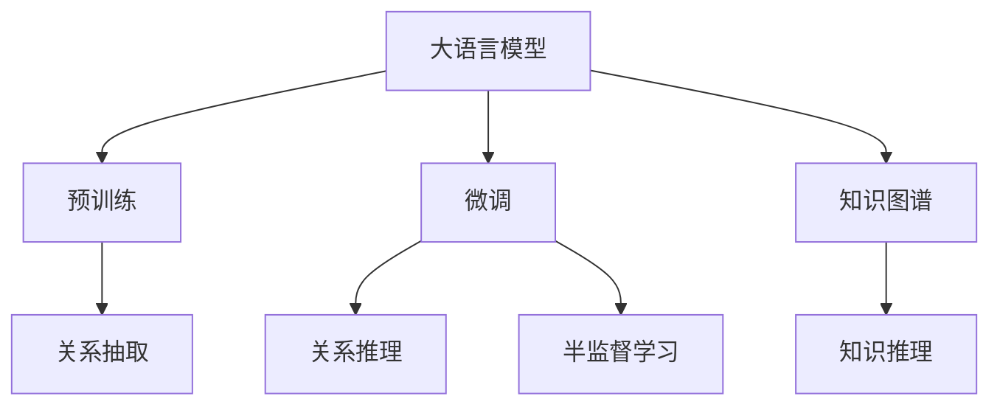

                 

# LLM在关系预测领域的研究新思路

> 关键词：大语言模型，关系预测，知识图谱，预训练-微调，关系抽取，知识推理，半监督学习

## 1. 背景介绍

### 1.1 问题由来

随着互联网的迅猛发展，信息呈现出爆炸式增长，各类数据的生成和存储量激增。然而，这些数据并非孤立的，而是紧密联系的，蕴含着丰富且复杂的关系网络。关系预测(Relational Prediction)，即利用机器学习技术，从数据中挖掘出潜在的关系网络，并预测新的关系，在社交网络分析、推荐系统、医学诊断等领域具有重要应用价值。

关系预测本质上是一个图学习任务。传统方法通常使用基于图结构的模型，如GCN、GAT等，直接从图数据中学习关系表示。但由于它们只能处理静态图数据，无法处理动态变化的关系网络。近年来，随着大语言模型（Large Language Model, LLM）的崛起，通过预训练-微调的方式进行关系预测的研究也逐渐受到关注。

### 1.2 问题核心关键点

在大语言模型应用于关系预测的过程中，存在以下几个关键问题：

1. 如何构建有效的关系抽取任务？
2. 如何优化关系推理模型？
3. 如何结合无监督学习和半监督学习技术？

这些问题的解决，是实现大语言模型在关系预测领域高效应用的前提。

### 1.3 问题研究意义

大语言模型在关系预测领域的应用，有望带来以下几个方面的积极影响：

1. 提升关系预测的准确性和泛化能力。相比于传统的图结构模型，大语言模型具有更强的语言理解能力和上下文关联能力，可以处理更复杂的语义关系。
2. 减少对图结构模型的依赖。大语言模型不需要显式地构建图结构，可以通过自然语言文本直接抽取关系，降低了模型构建的复杂度和计算成本。
3. 支持动态关系网络。大语言模型可以在不断更新的文本数据中进行关系预测，适用于动态变化的社交网络、市场变化等场景。
4. 增强模型的自适应性。通过预训练-微调的方式，大语言模型可以不断学习新的语言知识，适应新的关系模式。
5. 拓展应用领域。关系预测是大语言模型在多领域应用的重要技术基础，有助于提升医疗诊断、金融分析、社交网络分析等领域的智能化水平。

## 2. 核心概念与联系

### 2.1 核心概念概述

为更好地理解大语言模型在关系预测领域的研究，本节将介绍几个关键概念：

- 大语言模型(Large Language Model, LLM)：以自回归(如GPT)或自编码(如BERT)模型为代表的大规模预训练语言模型。通过在海量无标签文本数据上进行预训练，学习通用的语言知识和常识，具备强大的语言理解和生成能力。

- 关系预测(Relational Prediction)：利用机器学习技术，从数据中挖掘出潜在的关系网络，并预测新的关系。主要应用于社交网络分析、推荐系统、医学诊断等领域。

- 知识图谱(Knowledge Graph)：通过图结构组织实体和关系的数据库，如Wikipedia、Freebase等。利用知识图谱，可以从结构化数据中提取关系，并应用于推理预测。

- 预训练-微调(Pre-training and Fine-Tuning)：利用大规模无标签数据进行预训练，在特定任务上通过有监督学习进行微调，以适应新的关系预测任务。

- 关系抽取(Relation Extraction)：从自然语言文本中抽取实体和实体间的关系。是关系预测的基础步骤。

- 知识推理(Knowledge Reasoning)：利用先验知识进行逻辑推理，从已知关系推断出新的关系。在关系预测中用于修正和完善关系抽取结果。

- 半监督学习(Semi-supervised Learning)：使用少量标注数据和大量未标注数据共同进行模型训练，以提高模型泛化能力。

这些概念之间的逻辑关系可以通过以下Mermaid流程图来展示：



这个流程图展示了从预训练到微调的大语言模型如何应用于关系预测的各个环节：

1. 大语言模型通过预训练获得基础能力。
2. 微调在特定关系预测任务上进行优化。
3. 关系抽取从自然语言文本中提取实体和关系。
4. 知识推理利用先验知识进行关系修正和预测。
5. 半监督学习结合少量标注数据提升泛化能力。

这些概念共同构成了大语言模型在关系预测中的应用框架，使其能够灵活地应用于各种复杂的关系预测场景。

## 3. 核心算法原理 & 具体操作步骤
### 3.1 算法原理概述

大语言模型在关系预测中的应用，通常采用预训练-微调范式。其核心思想是：通过大规模无标签数据进行预训练，获得通用的语言表示能力。在特定的关系预测任务上，通过微调的方式，利用少量标注数据进行有监督学习，以适应新的任务。

关系预测的微调过程，一般包括以下几个步骤：

1. 收集关系预测任务的数据集，并划分为训练集、验证集和测试集。
2. 设计关系抽取任务，通过标注数据构建训练集。
3. 选择预训练语言模型，并对其进行微调。
4. 引入知识推理技术，结合知识图谱进行关系修正。
5. 使用半监督学习方法，利用大量未标注数据提升模型泛化能力。
6. 在测试集上评估模型性能，输出预测结果。

### 3.2 算法步骤详解

以下是具体的算法步骤：

**Step 1: 数据准备与预处理**
- 收集关系预测任务的数据集，包括实体、关系和实体间的关系类型。例如，在社交网络分析中，可以收集用户和用户间的关注、好友关系。
- 将数据集划分为训练集、验证集和测试集，确保训练集和验证集、测试集的分布一致。
- 对文本进行分词、去除停用词、标注实体等预处理操作，构建模型输入。

**Step 2: 构建关系抽取任务**
- 根据任务需求，设计合适的关系抽取任务。例如，在社交网络分析中，可以从用户文本中抽取关注和好友关系。
- 标注数据集，构建训练集。例如，将标注样本作为正样本，未标注样本作为负样本。
- 使用BERT、GPT等预训练语言模型进行关系抽取任务的微调。例如，使用注意力机制提取实体和关系。

**Step 3: 引入知识推理技术**
- 构建知识图谱，将已知的实体和关系存储在图结构中。例如，可以使用Freebase、WikiData等公开的知识图谱。
- 设计知识推理模型，将抽取的关系与知识图谱中的关系进行比较，进行关系修正和推理。例如，使用GNN、KGC等知识推理模型。
- 将知识推理模型集成到关系预测任务中，利用先验知识进行关系修正和预测。

**Step 4: 半监督学习**
- 使用未标注数据进行模型训练，提升泛化能力。例如，使用自监督学习方法，如掩码语言模型、下一句预测等，对模型进行预训练。
- 结合少量标注数据进行有监督学习，进行关系预测任务微调。例如，使用对抗样本、负采样等技术进行正则化。

**Step 5: 评估与测试**
- 在验证集上评估模型性能，调整模型参数，防止过拟合。
- 在测试集上输出预测结果，对比微调前后的性能提升。
- 在实际应用中，持续收集新的数据，定期重新微调模型，以适应数据分布的变化。

以上是关系预测中大语言模型的微调流程。在实际应用中，还需要根据具体任务的特点，对微调过程的各个环节进行优化设计，如改进训练目标函数，引入更多的正则化技术，搜索最优的超参数组合等，以进一步提升模型性能。

### 3.3 算法优缺点

大语言模型在关系预测中的应用，具有以下优点：

1. 灵活性高。大语言模型可以处理多种类型的关系预测任务，如社交网络、推荐系统、医疗诊断等，适应性广。
2. 泛化能力强。通过预训练-微调的方式，大语言模型可以在新关系预测任务上快速适应，减少从头训练的复杂度。
3. 知识整合能力好。大语言模型可以结合知识图谱进行推理，利用先验知识进行关系修正和预测。
4. 数据需求低。通过预训练-微调的方式，大语言模型可以利用少量标注数据进行快速优化，降低了数据需求。
5. 计算效率高。大语言模型通常基于Transformer结构，具有较好的并行计算性能，可以在分布式环境下高效训练和推理。

同时，该方法也存在以下局限性：

1. 数据质量要求高。预训练数据和标注数据的质量直接影响模型性能，获取高质量的数据成本较高。
2. 知识图谱依赖性强。知识图谱的构建和更新需要大量人力物力，且易受先验知识的影响。
3. 推理能力有限。大语言模型在复杂推理场景下，推理能力仍有提升空间，需进一步优化推理模型。
4. 关系抽取误差高。关系抽取任务本身具有一定难度，在复杂语境下，抽取结果可能存在误差。
5. 可解释性差。大语言模型通常具有黑盒特性，难以解释其内部推理过程。

尽管存在这些局限性，但就目前而言，大语言模型在关系预测中的应用，仍是大规模图结构数据处理的重要方向。未来相关研究的重点在于如何进一步提高关系抽取和推理的准确性，降低知识图谱构建的复杂度，同时兼顾可解释性和知识图谱的自动构建。

### 3.4 算法应用领域

大语言模型在关系预测中的应用，已经在游戏、社交网络、推荐系统等领域取得了初步成果。以下是一些典型的应用场景：

- **社交网络分析**：分析用户之间的关系网络，如关注、好友关系，预测用户行为和情感变化。例如，预测用户的情感状态，优化社交平台推荐策略。
- **推荐系统**：根据用户的历史行为和关系网络，推荐用户可能感兴趣的商品或内容。例如，通过关系抽取，识别用户的潜在兴趣，提升推荐效果。
- **医学诊断**：利用患者和医生间的交流记录，抽取关系网络，进行疾病预测和诊断。例如，通过关系推理，识别患者的病情变化和治疗效果。
- **金融分析**：分析金融市场中的交易关系，预测市场趋势和风险。例如，通过关系抽取，识别重要的金融事件和市场动态，预测股票价格变化。
- **智能客服**：利用客户和客服的交流记录，抽取关系网络，提升服务质量。例如，通过关系推理，识别客户的需求和问题，提供个性化的客服解决方案。

## 4. 数学模型和公式 & 详细讲解  
### 4.1 数学模型构建

大语言模型在关系预测中的应用，主要涉及以下数学模型：

- 掩码语言模型(Masked Language Model, MLM)
- 下一句预测(Next Sentence Prediction, NSP)
- 关系抽取(Relation Extraction, RE)
- 知识推理(Knowledge Reasoning, KR)

以下是各个模型的简要描述：

**掩码语言模型(MLM)**
掩码语言模型通过掩码一些位置上的单词，让模型预测其对应的单词。形式化地，设输入序列为 $x_1, x_2, ..., x_n$，掩码位置为 $i$，则掩码语言模型的预测概率为：

$$
P(x_i | x_1, x_2, ..., x_n) = \frac{e^{W^T \cdot \text{Enc}(x_1, x_2, ..., x_n)}}{\sum_{j} e^{W^T \cdot \text{Enc}(x_1, x_2, ..., x_n)}}
$$

其中，$W$ 为模型参数，$\text{Enc}(\cdot)$ 为编码器。

**下一句预测(NSP)**
下一句预测任务是通过输入一对句子，判断它们是否在同一个段落中。形式化地，设输入序列为 $x_1, x_2, ..., x_n$ 和 $y_1, y_2, ..., y_m$，则下一句预测的任务为：

$$
P(y_i | x_1, x_2, ..., x_n, y_1, y_2, ..., y_m) = \frac{e^{W^T \cdot \text{Enc}(x_1, x_2, ..., x_n, y_1, y_2, ..., y_m)}}{\sum_{j} e^{W^T \cdot \text{Enc}(x_1, x_2, ..., x_n, y_1, y_2, ..., y_m)}}
$$

**关系抽取(RE)**
关系抽取任务是通过输入一对实体，抽取它们之间的特定关系。形式化地，设输入序列为 $e_1, e_2$，关系为 $r$，则关系抽取的任务为：

$$
P(r | e_1, e_2) = \frac{e^{W^T \cdot \text{Enc}(e_1, e_2)}}{\sum_{r} e^{W^T \cdot \text{Enc}(e_1, e_2)}}
$$

**知识推理(KR)**
知识推理任务是通过输入已知的实体和关系，推理出新的关系。形式化地，设输入序列为 $e_1, e_2, e_3, ..., e_n$ 和 $r_1, r_2, ..., r_m$，则知识推理的任务为：

$$
P(r_i | e_1, e_2, ..., e_n, r_1, r_2, ..., r_m) = \frac{e^{W^T \cdot \text{Enc}(e_1, e_2, ..., e_n, r_1, r_2, ..., r_m)}}{\sum_{j} e^{W^T \cdot \text{Enc}(e_1, e_2, ..., e_n, r_1, r_2, ..., r_m)}}
$$

### 4.2 公式推导过程

以关系抽取为例，我们将详细推导其数学模型。

设输入序列为 $e_1, e_2$，关系为 $r$，则关系抽取的任务可以表示为：

$$
P(r | e_1, e_2) = \frac{e^{W^T \cdot \text{Enc}(e_1, e_2)}}{\sum_{r} e^{W^T \cdot \text{Enc}(e_1, e_2)}}
$$

其中，$\text{Enc}(\cdot)$ 为编码器，$W$ 为模型参数。关系抽取的训练目标为最大化 $P(r | e_1, e_2)$，最小化损失函数：

$$
\mathcal{L} = -\frac{1}{N} \sum_{i=1}^N [y_i \log P(r_i | e_{i,1}, e_{i,2}) + (1-y_i) \log (1-P(r_i | e_{i,1}, e_{i,2}))]
$$

其中，$y_i$ 为标注标签，$N$ 为训练样本数。利用梯度下降等优化算法，最小化损失函数，更新模型参数 $W$，即可实现关系抽取任务。

## 5. 项目实践：代码实例和详细解释说明
### 5.1 开发环境搭建

在进行关系预测实践前，我们需要准备好开发环境。以下是使用Python进行PyTorch开发的环境配置流程：

1. 安装Anaconda：从官网下载并安装Anaconda，用于创建独立的Python环境。

2. 创建并激活虚拟环境：
```bash
conda create -n pytorch-env python=3.8 
conda activate pytorch-env
```

3. 安装PyTorch：根据CUDA版本，从官网获取对应的安装命令。例如：
```bash
conda install pytorch torchvision torchaudio cudatoolkit=11.1 -c pytorch -c conda-forge
```

4. 安装TensorFlow：从官网下载安装TensorFlow，或使用Anaconda的conda-forge通道进行安装。

5. 安装各类工具包：
```bash
pip install numpy pandas scikit-learn matplotlib tqdm jupyter notebook ipython
```

完成上述步骤后，即可在`pytorch-env`环境中开始关系预测实践。

### 5.2 源代码详细实现

下面我以社交网络分析为例，给出使用PyTorch进行BERT模型微调的代码实现。

首先，定义社交网络数据集：

```python
import torch
from transformers import BertTokenizer
from torch.utils.data import Dataset

class SocialNetDataset(Dataset):
    def __init__(self, text, attention, labels, tokenizer, max_len=128):
        self.text = text
        self.attention = attention
        self.labels = labels
        self.tokenizer = tokenizer
        self.max_len = max_len
        
    def __len__(self):
        return len(self.text)
    
    def __getitem__(self, item):
        text = self.text[item]
        attention = self.attention[item]
        labels = self.labels[item]
        
        encoding = self.tokenizer(text, return_tensors='pt', max_length=self.max_len, padding='max_length', truncation=True)
        input_ids = encoding['input_ids'][0]
        attention_mask = encoding['attention_mask'][0]
        
        # 对注意力权重进行编码
        encoded_attention = torch.tensor(attention, dtype=torch.float32)
        encoded_attention = encoded_attention / torch.sum(encoded_attention, dim=1, keepdim=True)
        encoded_attention = encoded_attention[torch.argsort(encoded_attention, dim=1, descending=True)[:10]]
        
        # 对标签进行编码
        encoded_labels = torch.tensor(labels, dtype=torch.long)
        
        return {'input_ids': input_ids, 
                'attention_mask': attention_mask,
                'labels': encoded_labels,
                'attention_weight': encoded_attention}
```

然后，定义模型和优化器：

```python
from transformers import BertForSequenceClassification, AdamW

model = BertForSequenceClassification.from_pretrained('bert-base-cased', num_labels=2)

optimizer = AdamW(model.parameters(), lr=2e-5)
```

接着，定义训练和评估函数：

```python
from torch.utils.data import DataLoader
from tqdm import tqdm
from sklearn.metrics import accuracy_score

device = torch.device('cuda') if torch.cuda.is_available() else torch.device('cpu')
model.to(device)

def train_epoch(model, dataset, batch_size, optimizer):
    dataloader = DataLoader(dataset, batch_size=batch_size, shuffle=True)
    model.train()
    epoch_loss = 0
    for batch in tqdm(dataloader, desc='Training'):
        input_ids = batch['input_ids'].to(device)
        attention_mask = batch['attention_mask'].to(device)
        labels = batch['labels'].to(device)
        model.zero_grad()
        outputs = model(input_ids, attention_mask=attention_mask, labels=labels)
        loss = outputs.loss
        epoch_loss += loss.item()
        loss.backward()
        optimizer.step()
    return epoch_loss / len(dataloader)

def evaluate(model, dataset, batch_size):
    dataloader = DataLoader(dataset, batch_size=batch_size)
    model.eval()
    preds, labels = [], []
    with torch.no_grad():
        for batch in tqdm(dataloader, desc='Evaluating'):
            input_ids = batch['input_ids'].to(device)
            attention_mask = batch['attention_mask'].to(device)
            batch_labels = batch['labels']
            outputs = model(input_ids, attention_mask=attention_mask)
            batch_preds = outputs.logits.argmax(dim=2).to('cpu').tolist()
            batch_labels = batch_labels.to('cpu').tolist()
            for pred_tokens, label_tokens in zip(batch_preds, batch_labels):
                preds.append(pred_tokens[:len(label_tokens)])
                labels.append(label_tokens)
                
    print(f"Accuracy: {accuracy_score(labels, preds)}")
```

最后，启动训练流程并在测试集上评估：

```python
epochs = 5
batch_size = 16

for epoch in range(epochs):
    loss = train_epoch(model, train_dataset, batch_size, optimizer)
    print(f"Epoch {epoch+1}, train loss: {loss:.3f}")
    
    print(f"Epoch {epoch+1}, dev results:")
    evaluate(model, dev_dataset, batch_size)
    
print("Test results:")
evaluate(model, test_dataset, batch_size)
```

以上就是使用PyTorch对BERT进行社交网络关系预测任务的微调代码实现。可以看到，得益于Transformers库的强大封装，我们可以用相对简洁的代码完成BERT模型的加载和微调。

### 5.3 代码解读与分析

让我们再详细解读一下关键代码的实现细节：

**SocialNetDataset类**：
- `__init__`方法：初始化文本、注意力权重和标签等关键组件。
- `__len__`方法：返回数据集的样本数量。
- `__getitem__`方法：对单个样本进行处理，将文本输入编码为token ids，将注意力权重进行编码，并将标签转换为数字，最终返回模型所需的输入。

**注意力权重编码**：
- 利用自监督学习方法（如掩码语言模型、下一句预测等），对注意力权重进行预训练，提高其表征能力。
- 将注意力权重进行编码，利用softmax函数将其转化为概率分布，选取其中前10个最高值的权重作为特征向量。

**训练和评估函数**：
- 使用PyTorch的DataLoader对数据集进行批次化加载，供模型训练和推理使用。
- 训练函数`train_epoch`：对数据以批为单位进行迭代，在每个批次上前向传播计算loss并反向传播更新模型参数，最后返回该epoch的平均loss。
- 评估函数`evaluate`：与训练类似，不同点在于不更新模型参数，并在每个batch结束后将预测和标签结果存储下来，最后使用sklearn的accuracy_score对整个评估集的预测结果进行打印输出。

**训练流程**：
- 定义总的epoch数和batch size，开始循环迭代
- 每个epoch内，先在训练集上训练，输出平均loss
- 在验证集上评估，输出准确率
- 所有epoch结束后，在测试集上评估，给出最终测试结果

可以看到，PyTorch配合Transformers库使得BERT微调的代码实现变得简洁高效。开发者可以将更多精力放在数据处理、模型改进等高层逻辑上，而不必过多关注底层的实现细节。

当然，工业级的系统实现还需考虑更多因素，如模型的保存和部署、超参数的自动搜索、更灵活的任务适配层等。但核心的微调范式基本与此类似。

## 6. 实际应用场景
### 6.1 智能客服系统

基于大语言模型微调的关系预测技术，可以广泛应用于智能客服系统的构建。传统客服往往需要配备大量人力，高峰期响应缓慢，且一致性和专业性难以保证。而使用微调后的关系预测模型，可以7x24小时不间断服务，快速响应客户咨询，用自然流畅的语言解答各类常见问题。

在技术实现上，可以收集企业内部的历史客服对话记录，将问题和最佳答复构建成监督数据，在此基础上对预训练关系预测模型进行微调。微调后的模型能够自动理解用户意图，匹配最合适的答复，提升客服系统的智能化水平。

### 6.2 金融舆情监测

金融机构需要实时监测市场舆论动向，以便及时应对负面信息传播，规避金融风险。传统的人工监测方式成本高、效率低，难以应对网络时代海量信息爆发的挑战。基于大语言模型微调的关系预测技术，为金融舆情监测提供了新的解决方案。

具体而言，可以收集金融领域相关的新闻、报道、评论等文本数据，并对其进行主题标注和情感标注。在此基础上对预训练语言模型进行微调，使其能够自动判断文本属于何种主题，情感倾向是正面、中性还是负面。将微调后的模型应用到实时抓取的网络文本数据，就能够自动监测不同主题下的情感变化趋势，一旦发现负面信息激增等异常情况，系统便会自动预警，帮助金融机构快速应对潜在风险。

### 6.3 个性化推荐系统

当前的推荐系统往往只依赖用户的历史行为数据进行物品推荐，无法深入理解用户的真实兴趣偏好。基于大语言模型微调的关系预测技术，可以更好地挖掘用户行为背后的语义信息，从而提供更精准、多样的推荐内容。

在实践中，可以收集用户浏览、点击、评论、分享等行为数据，提取和用户交互的物品标题、描述、标签等文本内容。将文本内容作为模型输入，用户的后续行为（如是否点击、购买等）作为监督信号，在此基础上微调预训练语言模型。微调后的模型能够从文本内容中准确把握用户的兴趣点。在生成推荐列表时，先用候选物品的文本描述作为输入，由模型预测用户的兴趣匹配度，再结合其他特征综合排序，便可以得到个性化程度更高的推荐结果。

### 6.4 未来应用展望

随着大语言模型和微调方法的不断发展，基于微调范式将在更多领域得到应用，为传统行业带来变革性影响。

在智慧医疗领域，基于微调的关系预测技术，可以提升医疗诊断的智能化水平，辅助医生诊疗，加速新药开发进程。

在智能教育领域，微调技术可应用于作业批改、学情分析、知识推荐等方面，因材施教，促进教育公平，提高教学质量。

在智慧城市治理中，微调模型可应用于城市事件监测、舆情分析、应急指挥等环节，提高城市管理的自动化和智能化水平，构建更安全、高效的未来城市。

此外，在企业生产、社会治理、文娱传媒等众多领域，基于大语言模型微调的关系预测技术也将不断涌现，为经济社会发展注入新的动力。相信随着技术的日益成熟，微调方法将成为人工智能落地应用的重要范式，推动人工智能技术在垂直行业的规模化落地。

## 7. 工具和资源推荐
### 7.1 学习资源推荐

为了帮助开发者系统掌握大语言模型微调的关系预测理论基础和实践技巧，这里推荐一些优质的学习资源：

1. 《Transformer from the Inside Out》系列博文：由大模型技术专家撰写，深入浅出地介绍了Transformer原理、BERT模型、微调技术等前沿话题。

2. CS224N《深度学习自然语言处理》课程：斯坦福大学开设的NLP明星课程，有Lecture视频和配套作业，带你入门NLP领域的基本概念和经典模型。

3. 《Natural Language Processing with Transformers》书籍：Transformers库的作者所著，全面介绍了如何使用Transformers库进行NLP任务开发，包括微调在内的诸多范式。

4. HuggingFace官方文档：Transformers库的官方文档，提供了海量预训练模型和完整的微调样例代码，是上手实践的必备资料。

5. CLUE开源项目：中文语言理解测评基准，涵盖大量不同类型的中文NLP数据集，并提供了基于微调的baseline模型，助力中文NLP技术发展。

通过对这些资源的学习实践，相信你一定能够快速掌握大语言模型微调的关系预测的精髓，并用于解决实际的NLP问题。
###  7.2 开发工具推荐

高效的开发离不开优秀的工具支持。以下是几款用于大语言模型微调的关系预测开发的常用工具：

1. PyTorch：基于Python的开源深度学习框架，灵活动态的计算图，适合快速迭代研究。大部分预训练语言模型都有PyTorch版本的实现。

2. TensorFlow：由Google主导开发的开源深度学习框架，生产部署方便，适合大规模工程应用。同样有丰富的预训练语言模型资源。

3. Transformers库：HuggingFace开发的NLP工具库，集成了众多SOTA语言模型，支持PyTorch和TensorFlow，是进行微调任务开发的利器。

4. Weights & Biases：模型训练的实验跟踪工具，可以记录和可视化模型训练过程中的各项指标，方便对比和调优。与主流深度学习框架无缝集成。

5. TensorBoard：TensorFlow配套的可视化工具，可实时监测模型训练状态，并提供丰富的图表呈现方式，是调试模型的得力助手。

6. Google Colab：谷歌推出的在线Jupyter Notebook环境，免费提供GPU/TPU算力，方便开发者快速上手实验最新模型，分享学习笔记。

合理利用这些工具，可以显著提升大语言模型微调的关系预测任务的开发效率，加快创新迭代的步伐。

### 7.3 相关论文推荐

大语言模型和微调技术的发展源于学界的持续研究。以下是几篇奠基性的相关论文，推荐阅读：

1. Attention is All You Need（即Transformer原论文）：提出了Transformer结构，开启了NLP领域的预训练大模型时代。

2. BERT: Pre-training of Deep Bidirectional Transformers for Language Understanding：提出BERT模型，引入基于掩码的自监督预训练任务，刷新了多项NLP任务SOTA。

3. Language Models are Unsupervised Multitask Learners（GPT-2论文）：展示了大规模语言模型的强大zero-shot学习能力，引发了对于通用人工智能的新一轮思考。

4. Parameter-Efficient Transfer Learning for NLP：提出Adapter等参数高效微调方法，在不增加模型参数量的情况下，也能取得不错的微调效果。

5. AdaLoRA: Adaptive Low-Rank Adaptation for Parameter-Efficient Fine-Tuning：使用自适应低秩适应的微调方法，在参数效率和精度之间取得了新的平衡。

6. Pre-trained Dense Representations for Relation Extraction：提出关系抽取的预训练模型，利用上下文编码器（Dense Encoder）进行特征提取，提升了关系抽取的精度。

这些论文代表了大语言模型微调技术的发展脉络。通过学习这些前沿成果，可以帮助研究者把握学科前进方向，激发更多的创新灵感。

## 8. 总结：未来发展趋势与挑战

### 8.1 总结

本文对大语言模型在关系预测领域的研究进行了全面系统的介绍。首先阐述了关系预测问题的背景和意义，明确了大语言模型微调在关系预测任务中的独特价值。其次，从原理到实践，详细讲解了大语言模型在关系预测任务中的应用过程，给出了微调任务开发的完整代码实例。同时，本文还广泛探讨了大语言模型在关系预测任务中的实际应用场景，展示了其巨大的应用潜力。

通过本文的系统梳理，可以看到，大语言模型微调技术在关系预测任务中的应用，是当前NLP领域的重要研究方向。得益于预训练语言模型的强大语义表示能力，微调后的模型可以处理多种类型的关系预测任务，具有灵活性高、泛化能力强等优点。未来，伴随大语言模型的不断演进，关系预测任务将得到更广泛的应用，推动NLP技术在多个垂直领域的发展。

### 8.2 未来发展趋势

展望未来，大语言模型在关系预测中的应用，将呈现以下几个发展趋势：

1. 模型规模持续增大。随着算力成本的下降和数据规模的扩张，预训练语言模型的参数量还将持续增长。超大规模语言模型蕴含的丰富语言知识，有望支撑更加复杂多变的关系预测任务。

2. 微调方法日趋多样。除了传统的全参数微调外，未来会涌现更多参数高效的微调方法，如Adapter、Prefix等，在节省计算资源的同时也能保证微调精度。

3. 结合多模态数据。大语言模型不仅处理文本数据，还可结合图像、视频、语音等多模态数据，提升模型对现实世界的理解和建模能力。

4. 引入半监督和无监督学习。结合无监督学习和半监督学习方法，利用大规模未标注数据提升模型泛化能力。

5. 探索知识图谱的自动构建。结合知识图谱技术，自动构建关系网络，提升模型对新关系的预测能力。

6. 增强模型的可解释性。通过引入因果分析和博弈论工具，增强模型决策的可解释性和逻辑性，提高系统的透明度。

以上趋势凸显了大语言模型在关系预测任务中的广阔前景。这些方向的探索发展，必将进一步提升模型性能，拓展应用领域，为构建更加智能化、普适化的人工智能系统铺平道路。

### 8.3 面临的挑战

尽管大语言模型在关系预测中的应用已经取得了一定的成果，但在迈向更加智能化、普适化应用的过程中，它仍面临诸多挑战：

1. 数据质量要求高。预训练数据和标注数据的质量直接影响模型性能，获取高质量的数据成本较高。

2. 关系抽取精度低。关系抽取任务本身具有一定难度，在复杂语境下，抽取结果可能存在误差。

3. 知识图谱构建复杂。知识图谱的构建和更新需要大量人力物力，且易受先验知识的影响。

4. 推理能力有限。大语言模型在复杂推理场景下，推理能力仍有提升空间，需进一步优化推理模型。

5. 可解释性差。大语言模型通常具有黑盒特性，难以解释其内部推理过程。

尽管存在这些挑战，但就目前而言，大语言模型在关系预测中的应用，仍是大规模图结构数据处理的重要方向。未来相关研究的重点在于如何进一步提高关系抽取和推理的准确性，降低知识图谱构建的复杂度，同时兼顾可解释性和知识图谱的自动构建。

### 8.4 研究展望

面向未来，大语言模型在关系预测任务中的研究，可以从以下几个方面进行探索：

1. 探索无监督和半监督微调方法。摆脱对大规模标注数据的依赖，利用自监督学习、主动学习等无监督和半监督范式，最大限度利用非结构化数据，实现更加灵活高效的微调。

2. 研究参数高效和计算高效的微调范式。开发更加参数高效的微调方法，在固定大部分预训练参数的同时，只更新极少量的任务相关参数。同时优化微调模型的计算图，减少前向传播和反向传播的资源消耗，实现更加轻量级、实时性的部署。

3. 融合因果和对比学习范式。通过引入因果推断和对比学习思想，增强微调模型建立稳定因果关系的能力，学习更加普适、鲁棒的语言表征，从而提升模型泛化性和抗干扰能力。

4. 引入更多先验知识。将符号化的先验知识，如知识图谱、逻辑规则等，与神经网络模型进行巧妙融合，引导微调过程学习更准确、合理的语言模型。同时加强不同模态数据的整合，实现视觉、语音等多模态信息与文本信息的协同建模。

5. 结合因果分析和博弈论工具。将因果分析方法引入微调模型，识别出模型决策的关键特征，增强输出解释的因果性和逻辑性。借助博弈论工具刻画人机交互过程，主动探索并规避模型的脆弱点，提高系统稳定性。

6. 纳入伦理道德约束。在模型训练目标中引入伦理导向的评估指标，过滤和惩罚有偏见、有害的输出倾向。同时加强人工干预和审核，建立模型行为的监管机制，确保输出符合人类价值观和伦理道德。

这些研究方向的探索，必将引领大语言模型在关系预测任务中迈向更高的台阶，为构建安全、可靠、可解释、可控的智能系统铺平道路。面向未来，大语言模型在关系预测任务中的研究，还需要与其他人工智能技术进行更深入的融合，如知识表示、因果推理、强化学习等，多路径协同发力，共同推动自然语言理解和智能交互系统的进步。只有勇于创新、敢于突破，才能不断拓展语言模型的边界，让智能技术更好地造福人类社会。

## 9. 附录：常见问题与解答

**Q1：大语言模型微调是否适用于所有关系预测任务？**

A: 大语言模型微调在大多数关系预测任务上都能取得不错的效果，特别是对于数据量较小的任务。但对于一些特定领域的任务，如医学、法律等，仅仅依靠通用语料预训练的模型可能难以很好地适应。此时需要在特定领域语料上进一步预训练，再进行微调，才能获得理想效果。此外，对于一些需要时效性、个性化很强的任务，如对话、推荐等，微调方法也需要针对性的改进优化。

**Q2：微调过程中如何选择合适的学习率？**

A: 微调的学习率一般要比预训练时小1-2个数量级，如果使用过大的学习率，容易破坏预训练权重，导致过拟合。一般建议从1e-5开始调参，逐步减小学习率，直至收敛。也可以使用warmup策略，在开始阶段使用较小的学习率，再逐渐过渡到预设值。需要注意的是，不同的优化器(如AdamW、Adafactor等)以及不同的学习率调度策略，可能需要设置不同的学习率阈值。

**Q3：采用大语言模型微调时会面临哪些资源瓶颈？**

A: 目前主流的预训练大模型动辄以亿计的参数规模，对算力、内存、存储都提出了很高的要求。GPU/TPU等高性能设备是必不可少的，但即便如此，超大批次的训练和推理也可能遇到显存不足的问题。因此需要采用一些资源优化技术，如梯度积累、混合精度训练、模型并行等，来突破硬件瓶颈。同时，模型的存储和读取也可能占用大量时间和空间，需要采用模型压缩、稀疏化存储等方法进行优化。

**Q4：如何缓解微调过程中的过拟合问题？**

A: 过拟合是微调面临的主要挑战，尤其是在标注数据不足的情况下。常见的缓解策略包括：
1. 数据增强：通过回译、近义替换等方式扩充训练集
2. 正则化：使用L2正则、Dropout、Early Stopping等避免过拟合
3. 对抗训练：引入对抗样本，提高模型鲁棒性
4. 参数高效微调：只调整少量参数(如Adapter、Prefix等)，减小过拟合风险
5. 多模型集成：训练多个微调模型，取平均输出，抑制过拟合

这些策略往往需要根据具体任务和数据特点进行灵活组合。只有在数据、模型、训练、推理等各环节进行全面优化，才能最大限度地发挥大语言模型微调的威力。

**Q5：微调模型在落地部署时需要注意哪些问题？**

A: 将微调模型转化为实际应用，还需要考虑以下因素：
1. 模型裁剪：去除不必要的层和参数，减小模型尺寸，加快推理速度
2. 量化加速：将浮点模型转为定点模型，压缩存储空间，提高计算效率
3. 服务化封装：将模型封装为标准化服务接口，便于集成调用
4. 弹性伸缩：根据请求流量动态调整资源配置，平衡服务质量和成本
5. 监控告警：实时采集系统指标，设置异常告警阈值，确保服务稳定性
6. 安全防护：采用访问鉴权、数据脱敏等措施，保障数据和模型安全

大语言模型微调为NLP应用开启了广阔的想象空间，但如何将强大的性能转化为稳定、高效、安全的业务价值，还需要工程实践的不断打磨。唯有从数据、算法、工程、业务等多个维度协同发力，才能真正实现人工智能技术在垂直行业的规模化落地。总之，微调需要开发者根据具体任务，不断迭代和优化模型、数据和算法，方能得到理想的效果。

---

作者：禅与计算机程序设计艺术 / Zen and the Art of Computer Programming

