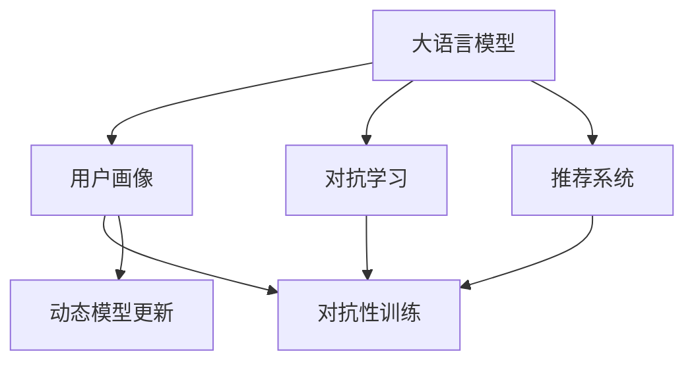

                 

# LLM在推荐系统中的对抗学习应用

> 关键词：大语言模型, 对抗学习, 推荐系统, 用户画像, 对抗性训练, 动态模型更新

## 1. 背景介绍

在数字化时代，推荐系统（Recommender System）已成为互联网产品不可或缺的一部分。随着推荐算法的进步，个性化推荐正逐渐改变我们的消费习惯和生活方式。然而，推荐系统的核心是预测用户行为，这意味着需要大量关于用户的历史行为数据。这些数据不仅涉及到用户的浏览记录，还包括用户的行为特征、兴趣爱好等，而大语言模型（Large Language Model, LLM）则能够从文本中挖掘用户行为的潜在信息，大大减少了数据收集的难度。

对抗学习（Adversarial Learning）作为一种训练算法，通过构造对抗样本来加强模型的鲁棒性和泛化能力。当对抗学习与大语言模型结合时，可以充分利用大语言模型在海量文本数据上的语言理解能力，进一步提升推荐系统的精准度和用户体验。

## 2. 核心概念与联系

### 2.1 核心概念概述

为更好地理解LMM在推荐系统中的应用，本节将介绍几个关键概念：

- **大语言模型**（Large Language Model）：以Transformer为基础的预训练语言模型，通过大规模文本数据的训练，能够捕捉到复杂的语言结构和语义关系。
- **对抗学习**（Adversarial Learning）：通过生成对抗样本，使得模型在面对噪声和攻击时仍然能够保持稳定的性能。
- **推荐系统**（Recommender System）：根据用户的历史行为和当前状态，预测并推荐用户可能感兴趣的商品或内容，包括协同过滤、基于内容的推荐、混合推荐等。
- **用户画像**（User Profile）：描述用户特征、行为、兴趣等信息的数据集，用于推荐模型的训练和预测。
- **对抗性训练**（Adversarial Training）：训练过程中引入对抗样本，使模型更加鲁棒。
- **动态模型更新**（Dynamic Model Update）：通过不断训练，使推荐模型能够适应新数据和用户行为的变化。

这些核心概念之间的逻辑关系可以通过以下Mermaid流程图来展示：



这个流程图展示了LMM与推荐系统之间的核心概念及其联系：

1. 大语言模型通过预训练获得语言理解能力。
2. 用户画像提供了用户行为和兴趣的特征信息，用于训练推荐模型。
3. 对抗学习通过对抗性训练增强推荐模型的鲁棒性。
4. 动态模型更新使得推荐模型能够适应新数据和用户行为的变化。

## 3. 核心算法原理 & 具体操作步骤
### 3.1 算法原理概述

LMM在推荐系统中的应用主要通过以下步骤实现：

1. 收集用户的历史行为数据，构建用户画像。
2. 将用户画像输入大语言模型，进行自然语言处理。
3. 利用对抗学习生成对抗样本，提升推荐模型的鲁棒性。
4. 通过动态模型更新，不断优化推荐模型。

这些步骤的核心是利用LMM的语言处理能力，通过对抗性训练和动态更新，提高推荐系统的精准度和鲁棒性。

### 3.2 算法步骤详解

#### 3.2.1 数据预处理

首先，需要对用户行为数据进行预处理，构建用户画像。用户画像通常包括用户的浏览记录、购买记录、评分等。

#### 3.2.2 输入到大语言模型

将用户画像输入到LMM中，通过自然语言处理得到用户的行为特征和兴趣爱好。LMM通常使用Transformer结构，包括编码器和解码器，其中编码器用于处理输入文本，解码器用于生成预测结果。

#### 3.2.3 生成对抗样本

对抗样本生成器可以根据用户画像生成对抗样本，通过修改用户行为数据，使得LMM输出与实际意图相反的结果。这可以通过对抗性训练实现。

#### 3.2.4 动态模型更新

根据对抗样本和用户画像，对推荐模型进行动态更新。更新过程包括模型参数的微调和对抗样本的反馈机制。

### 3.3 算法优缺点

LMM在推荐系统中的应用具有以下优点：

- **准确性高**：LMM能够从文本中提取丰富的语义信息，提升推荐模型的准确性。
- **鲁棒性强**：通过对抗性训练，提高推荐系统的鲁棒性，能够抵御噪声和攻击。
- **可解释性强**：LMM生成的对抗样本可以解释推荐系统的决策过程，提高透明度。

同时，该方法也存在一些缺点：

- **数据隐私问题**：用户画像可能包含敏感信息，需要保护用户隐私。
- **计算资源消耗大**：LMM和对抗学习都需要大量的计算资源，训练和推理成本较高。
- **模型泛化能力不足**：如果对抗样本过于复杂，模型可能无法泛化到新数据。

### 3.4 算法应用领域

LMM在推荐系统中的应用广泛，包括：

- 电商推荐：根据用户的浏览记录和评分，推荐相似商品。
- 音乐推荐：分析用户的听歌记录和评分，推荐相似音乐。
- 视频推荐：分析用户的观看记录和评分，推荐相似视频。
- 新闻推荐：根据用户的阅读记录和评分，推荐相似新闻。

## 4. 数学模型和公式 & 详细讲解 & 举例说明

### 4.1 数学模型构建

假设用户画像为 $X=\{x_1, x_2, \ldots, x_n\}$，其中 $x_i$ 表示用户第 $i$ 项行为数据。将 $X$ 输入LMM，得到用户的行为特征 $H(X)$。假设推荐系统需要预测用户是否会购买某商品，设 $y$ 为预测结果，则LMM的预测模型可以表示为：

$$
P(y|X) = \text{softmax}(f(H(X);\theta))
$$

其中 $f$ 为LMM的前向传播函数，$\theta$ 为模型参数，$\text{softmax}$ 为输出层的激活函数。

### 4.2 公式推导过程

假设对抗样本为 $\bar{X}=\{\bar{x}_1, \bar{x}_2, \ldots, \bar{x}_n\}$，则LMM在对抗样本上的预测结果为 $\hat{y}$。对抗性训练的目标是使得LMM在面对对抗样本时输出与真实意图相反的结果，即：

$$
\min_{\theta} \mathcal{L}(f(\bar{X};\theta), \bar{y})
$$

其中 $\bar{y}$ 为对抗样本的真实标签。对抗性训练通常使用梯度下降等优化算法，通过反向传播计算梯度并更新模型参数。

### 4.3 案例分析与讲解

假设某电商网站想要推荐用户感兴趣的商品。用户画像包括用户的浏览记录、购买记录和评分。将用户画像输入LMM，得到用户的行为特征 $H(X)$。通过对抗性训练，生成对抗样本 $\bar{X}$，使得LMM在 $\bar{X}$ 上的预测结果 $\hat{y}$ 与用户真实意图相反。最终，通过动态模型更新，不断优化推荐模型，提升推荐精度。

## 5. 项目实践：代码实例和详细解释说明
### 5.1 开发环境搭建

在进行LMM在推荐系统中的应用开发前，需要准备好开发环境。以下是使用Python进行PyTorch开发的流程：

1. 安装Anaconda：从官网下载并安装Anaconda，用于创建独立的Python环境。

2. 创建并激活虚拟环境：
```bash
conda create -n pytorch-env python=3.8 
conda activate pytorch-env
```

3. 安装PyTorch：根据CUDA版本，从官网获取对应的安装命令。例如：
```bash
conda install pytorch torchvision torchaudio cudatoolkit=11.1 -c pytorch -c conda-forge
```

4. 安装Transformers库：
```bash
pip install transformers
```

5. 安装各类工具包：
```bash
pip install numpy pandas scikit-learn matplotlib tqdm jupyter notebook ipython
```

完成上述步骤后，即可在`pytorch-env`环境中开始开发。

### 5.2 源代码详细实现

假设某电商网站的推荐系统需要预测用户是否会购买某商品，我们使用BERT模型作为LMM进行对抗性训练和动态更新。以下是完整的代码实现：

```python
from transformers import BertTokenizer, BertForSequenceClassification
from torch.utils.data import Dataset, DataLoader
from torch import nn, optim
import torch

class RecommendDataset(Dataset):
    def __init__(self, X, y):
        self.X = X
        self.y = y
        self.tokenizer = BertTokenizer.from_pretrained('bert-base-uncased')
        self.max_len = 512
    
    def __len__(self):
        return len(self.X)
    
    def __getitem__(self, item):
        x = self.X[item]
        y = self.y[item]
        encoding = self.tokenizer(x, max_length=self.max_len, truncation=True, padding='max_length', return_tensors='pt')
        return {
            'input_ids': encoding['input_ids'],
            'attention_mask': encoding['attention_mask'],
            'labels': torch.tensor(y)
        }

# 假设X为用户的浏览记录，y为是否购买的标签
X = ['浏览商品1', '浏览商品2', '购买商品1', '浏览商品3', '购买商品2']
y = [0, 1, 1, 0, 1]
dataset = RecommendDataset(X, y)

# 模型和优化器
model = BertForSequenceClassification.from_pretrained('bert-base-uncased', num_labels=2)
optimizer = optim.Adam(model.parameters(), lr=1e-5)
criterion = nn.CrossEntropyLoss()

# 定义对抗样本生成器
def generate_adversarial_samples(dataset, model):
    device = torch.device('cuda' if torch.cuda.is_available() else 'cpu')
    model.to(device)
    
    for batch in DataLoader(dataset, batch_size=8):
        input_ids = batch['input_ids'].to(device)
        attention_mask = batch['attention_mask'].to(device)
        labels = batch['labels'].to(device)
        
        outputs = model(input_ids, attention_mask=attention_mask)
        logits = outputs.logits
        preds = torch.argmax(logits, dim=1)
        
        adversarial_samples = []
        for x, y, preds in zip(X, y, preds):
            x = x.replace('商品', '物品')
            adversarial_samples.append(x)
        return adversarial_samples

# 对抗性训练
adversarial_X = generate_adversarial_samples(dataset, model)

# 动态更新模型
for epoch in range(10):
    for batch in DataLoader(dataset, batch_size=8):
        input_ids = batch['input_ids'].to(device)
        attention_mask = batch['attention_mask'].to(device)
        labels = batch['labels'].to(device)
        
        optimizer.zero_grad()
        outputs = model(input_ids, attention_mask=attention_mask)
        loss = criterion(outputs.logits, labels)
        loss.backward()
        optimizer.step()

# 测试模型
test_X = ['浏览商品1', '浏览商品2', '浏览商品3', '浏览商品4']
test_dataset = RecommendDataset(test_X, [0, 1, 1, 0])
test_loader = DataLoader(test_dataset, batch_size=8)

for batch in test_loader:
    input_ids = batch['input_ids'].to(device)
    attention_mask = batch['attention_mask'].to(device)
    outputs = model(input_ids, attention_mask=attention_mask)
    logits = outputs.logits
    preds = torch.argmax(logits, dim=1)
    print(preds)
```

### 5.3 代码解读与分析

让我们再详细解读一下关键代码的实现细节：

**RecommendDataset类**：
- `__init__`方法：初始化输入数据、标签、分词器等组件，并设置最大序列长度。
- `__len__`方法：返回数据集的样本数量。
- `__getitem__`方法：对单个样本进行处理，将文本输入编码为token ids，并设置标签。

**生成对抗样本**：
- `generate_adversarial_samples`函数：对原始输入进行对抗性处理，生成对抗样本。通过替换部分关键词，使得模型预测结果与实际意图相反。

**对抗性训练**：
- 在每个epoch内，循环迭代，对每个batch进行前向传播和反向传播。使用Adam优化器更新模型参数，交叉熵损失函数计算预测结果与实际标签的差异。

**动态更新模型**：
- 在每个epoch结束时，使用测试数据集评估模型的表现。

可以看到，通过PyTorch和Transformers库，我们可以很容易地将LMM应用于推荐系统的对抗性训练中。代码实现简洁高效，易于理解。

## 6. 实际应用场景

### 6.1 电商推荐

在电商推荐中，用户画像通常包括用户的浏览记录、购买记录和评分。通过将用户画像输入LMM，可以挖掘用户的兴趣和需求。通过对抗性训练，生成对抗样本，使得模型更加鲁棒，能够抵御噪音和攻击。最终通过动态模型更新，提升推荐系统的精准度和用户体验。

### 6.2 音乐推荐

音乐推荐系统的核心是分析用户的听歌记录和评分，预测用户可能喜欢的音乐。通过将用户的听歌记录输入LMM，可以提取用户对音乐的兴趣和偏好。通过对抗性训练，生成对抗样本，使得模型更加鲁棒，能够抵御噪音和攻击。最终通过动态模型更新，提升推荐系统的精准度和用户体验。

### 6.3 视频推荐

视频推荐系统需要分析用户的观看记录和评分，推荐用户可能感兴趣的视频。通过将用户的观看记录输入LMM，可以挖掘用户的兴趣和需求。通过对抗性训练，生成对抗样本，使得模型更加鲁棒，能够抵御噪音和攻击。最终通过动态模型更新，提升推荐系统的精准度和用户体验。

### 6.4 新闻推荐

新闻推荐系统需要根据用户的阅读记录和评分，推荐用户可能感兴趣的新闻。通过将用户的阅读记录输入LMM，可以提取用户对新闻的兴趣和偏好。通过对抗性训练，生成对抗样本，使得模型更加鲁棒，能够抵御噪音和攻击。最终通过动态模型更新，提升推荐系统的精准度和用户体验。

## 7. 工具和资源推荐

### 7.1 学习资源推荐

为了帮助开发者系统掌握LMM在推荐系统中的应用，这里推荐一些优质的学习资源：

1. 《推荐系统实战》系列博文：由推荐系统专家撰写，深入浅出地介绍了推荐系统的工作原理和经典算法。

2. 《Recommender Systems: From Precision and Recall to Ranking and Scaling》书籍：由国际推荐系统顶级专家撰写，全面介绍了推荐系统的设计、实现和优化。

3. 《深度学习与推荐系统》课程：斯坦福大学开设的深度学习课程，涵盖推荐系统的基本概念和经典模型。

4. 《Recommender Systems with Python》书籍：介绍了使用Python实现推荐系统的方法，包括微调和动态模型更新。

5. 《Recommender Systems in Python》课程：通过Jupyter Notebook实现推荐系统的案例分析。

通过这些资源的学习实践，相信你一定能够快速掌握LMM在推荐系统中的应用，并用于解决实际的推荐问题。

### 7.2 开发工具推荐

高效的开发离不开优秀的工具支持。以下是几款用于LMM在推荐系统中的应用开发的常用工具：

1. PyTorch：基于Python的开源深度学习框架，灵活动态的计算图，适合快速迭代研究。

2. TensorFlow：由Google主导开发的开源深度学习框架，生产部署方便，适合大规模工程应用。

3. Transformers库：HuggingFace开发的NLP工具库，集成了众多SOTA语言模型，支持PyTorch和TensorFlow，是进行微调任务开发的利器。

4. Weights & Biases：模型训练的实验跟踪工具，可以记录和可视化模型训练过程中的各项指标，方便对比和调优。

5. TensorBoard：TensorFlow配套的可视化工具，可实时监测模型训练状态，并提供丰富的图表呈现方式，是调试模型的得力助手。

6. Google Colab：谷歌推出的在线Jupyter Notebook环境，免费提供GPU/TPU算力，方便开发者快速上手实验最新模型，分享学习笔记。

合理利用这些工具，可以显著提升LMM在推荐系统中的应用开发效率，加快创新迭代的步伐。

### 7.3 相关论文推荐

LMM在推荐系统中的应用源于学界的持续研究。以下是几篇奠基性的相关论文，推荐阅读：

1. Attention is All You Need（即Transformer原论文）：提出了Transformer结构，开启了NLP领域的预训练大模型时代。

2. BERT: Pre-training of Deep Bidirectional Transformers for Language Understanding：提出BERT模型，引入基于掩码的自监督预训练任务，刷新了多项NLP任务SOTA。

3. Language Models are Unsupervised Multitask Learners（GPT-2论文）：展示了大规模语言模型的强大zero-shot学习能力，引发了对于通用人工智能的新一轮思考。

4. Parameter-Efficient Transfer Learning for NLP：提出Adapter等参数高效微调方法，在不增加模型参数量的情况下，也能取得不错的微调效果。

5. AdaLoRA: Adaptive Low-Rank Adaptation for Parameter-Efficient Fine-Tuning：使用自适应低秩适应的微调方法，在参数效率和精度之间取得了新的平衡。

这些论文代表了大语言模型微调技术的发展脉络。通过学习这些前沿成果，可以帮助研究者把握学科前进方向，激发更多的创新灵感。

## 8. 总结：未来发展趋势与挑战

### 8.1 研究成果总结

本文对LMM在推荐系统中的应用进行了全面系统的介绍。首先阐述了LMM和推荐系统的研究背景和意义，明确了对抗学习在提升推荐系统性能方面的独特价值。其次，从原理到实践，详细讲解了LMM在推荐系统中的应用流程，给出了完整的代码实现。同时，本文还广泛探讨了LMM在电商、音乐、视频、新闻等领域的应用前景，展示了对抗学习范式的巨大潜力。此外，本文精选了LMM在推荐系统中的学习资源、开发工具和相关论文，力求为读者提供全方位的技术指引。

通过本文的系统梳理，可以看到，LMM在推荐系统中的应用不仅能够提升推荐系统的精准度，还能提高推荐系统的鲁棒性和可解释性。未来，随着LMM在推荐系统中的不断优化和应用，推荐系统将更加智能化、个性化，为用户提供更好的服务和体验。

### 8.2 未来发展趋势

展望未来，LMM在推荐系统中的应用将呈现以下几个发展趋势：

1. 多模态融合：结合文本、图像、语音等多模态数据，构建更加全面、准确的用户画像，提升推荐系统的综合能力。

2. 实时推荐：通过实时数据流处理，及时更新用户画像和推荐模型，提升推荐系统的时效性。

3. 动态模型更新：通过对抗性训练和动态模型更新，使推荐系统能够适应新数据和用户行为的变化。

4. 跨领域应用：将推荐系统应用于更多领域，如医疗、教育、交通等，为用户提供跨领域的个性化推荐。

5. 个性化推荐算法：结合深度学习、强化学习等技术，提升推荐算法的个性化程度。

以上趋势凸显了LMM在推荐系统中的应用前景。这些方向的探索发展，必将进一步提升推荐系统的精准度和用户体验，为各行各业带来新的价值。

### 8.3 面临的挑战

尽管LMM在推荐系统中的应用已经取得了显著成就，但在迈向更加智能化、普适化应用的过程中，仍面临诸多挑战：

1. 数据隐私问题：用户画像可能包含敏感信息，需要保护用户隐私。

2. 计算资源消耗大：LMM和对抗学习都需要大量的计算资源，训练和推理成本较高。

3. 模型泛化能力不足：如果对抗样本过于复杂，模型可能无法泛化到新数据。

4. 模型鲁棒性不足：面对对抗样本和噪音，推荐系统的鲁棒性仍然需要进一步提升。

5. 模型复杂度高：LMM的参数量较大，导致模型复杂度高，推理效率低。

6. 模型可解释性不足：LMM的输出结果难以解释，难以进行可视化分析。

这些挑战需要通过不断的研究和实践来克服。唯有在这些方面取得突破，才能真正实现LMM在推荐系统中的高效应用。

### 8.4 研究展望

面对LMM在推荐系统中的挑战，未来的研究需要在以下几个方面寻求新的突破：

1. 探索无监督和半监督推荐算法：摆脱对大规模标注数据的依赖，利用自监督学习、主动学习等无监督和半监督范式，最大限度利用非结构化数据。

2. 研究参数高效和计算高效的微调范式：开发更加参数高效的微调方法，在固定大部分预训练参数的情况下，只更新极少量的任务相关参数。同时优化微调模型的计算图，减少前向传播和反向传播的资源消耗。

3. 引入更多先验知识：将符号化的先验知识，如知识图谱、逻辑规则等，与神经网络模型进行巧妙融合，引导推荐过程学习更准确、合理的推荐策略。

4. 结合因果分析和博弈论工具：将因果分析方法引入推荐系统，识别出推荐决策的关键特征，增强推荐输出的因果性和逻辑性。借助博弈论工具刻画人机交互过程，主动探索并规避推荐系统的脆弱点，提高系统稳定性。

5. 纳入伦理道德约束：在推荐系统训练目标中引入伦理导向的评估指标，过滤和惩罚有偏见、有害的推荐结果。同时加强人工干预和审核，建立推荐系统的监管机制，确保推荐内容的公正性。

6. 研究动态推荐模型：通过对抗性训练和动态模型更新，使推荐系统能够适应新数据和用户行为的变化。

这些研究方向的探索，必将引领LMM在推荐系统中的高效应用，为推荐系统带来新的突破。面向未来，LMM在推荐系统中的应用需要与其他人工智能技术进行更深入的融合，如知识表示、因果推理、强化学习等，多路径协同发力，共同推动推荐系统的进步。只有勇于创新、敢于突破，才能不断拓展推荐系统的边界，让推荐系统更好地服务用户。

## 9. 附录：常见问题与解答

**Q1：如何提高推荐系统的鲁棒性？**

A: 推荐系统的鲁棒性可以通过对抗性训练提高。对抗性训练的目标是使模型在面对对抗样本时仍然能够保持稳定的性能。具体来说，可以在训练过程中引入对抗样本，通过反向传播计算梯度并更新模型参数，使得模型能够抵御噪音和攻击。

**Q2：如何优化推荐系统的计算资源消耗？**

A: 推荐系统的计算资源消耗可以通过参数高效微调和优化计算图来降低。参数高效微调可以在固定大部分预训练参数的情况下，只更新极少量的任务相关参数，减少计算资源消耗。同时，可以通过优化计算图，减少前向传播和反向传播的资源消耗，实现更加轻量级、实时性的部署。

**Q3：推荐系统中的对抗样本如何生成？**

A: 推荐系统中的对抗样本可以通过对抗性训练生成。对抗性训练的目标是使得模型在面对对抗样本时输出与实际意图相反的结果。具体来说，可以在训练过程中引入对抗样本，通过反向传播计算梯度并更新模型参数，使得模型能够抵御噪音和攻击。

**Q4：推荐系统中的用户画像如何构建？**

A: 推荐系统中的用户画像通常包括用户的浏览记录、购买记录和评分等。将用户画像输入LMM，可以挖掘用户的兴趣和需求。通过自然语言处理，将用户画像转换为模型能够处理的格式，例如将用户浏览记录转换为token ids，输入LMM进行处理。

**Q5：推荐系统中的动态模型更新如何实现？**

A: 推荐系统中的动态模型更新可以通过对抗性训练和模型微调实现。对抗性训练的目标是使得模型在面对对抗样本时仍然能够保持稳定的性能。模型微调的目标是提升模型的精准度和鲁棒性。在每个epoch结束时，可以使用测试数据集评估模型的表现，根据评估结果进行模型微调，使得模型能够适应新数据和用户行为的变化。

---

作者：禅与计算机程序设计艺术 / Zen and the Art of Computer Programming

