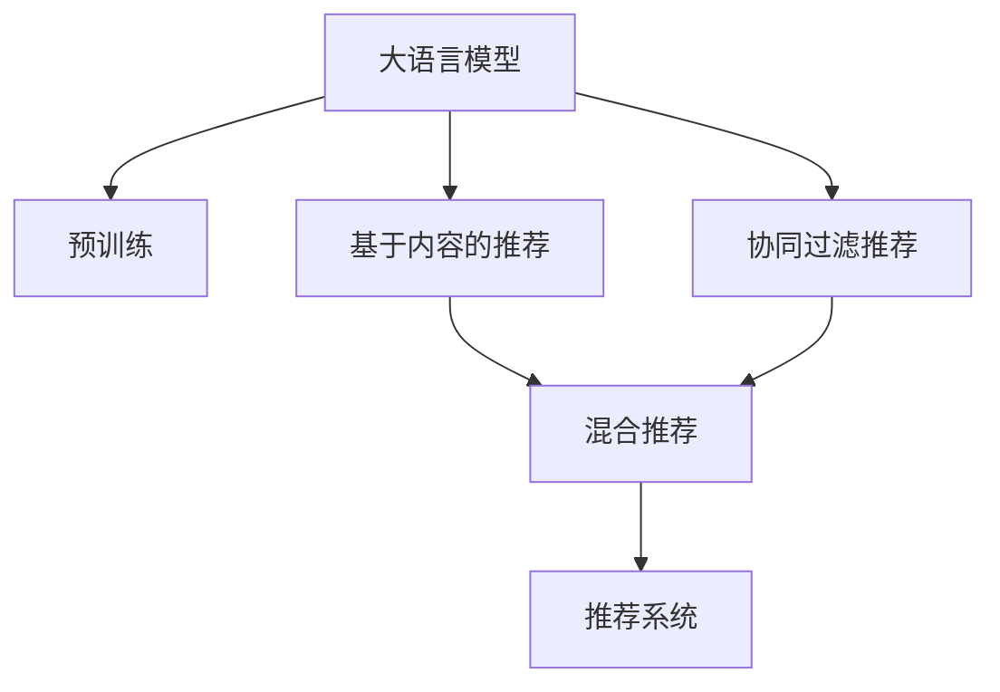

                 

# LLM在推荐系统中的应用探索

## 1. 背景介绍

### 1.1 问题由来
随着互联网和数字技术的发展，推荐系统已经成为了电子商务、视频流媒体、社交网络等众多领域的标配。推荐系统通过分析用户的历史行为数据，预测用户的兴趣偏好，从而为用户推荐个性化的内容，提升用户体验和满意度。然而，传统的推荐系统主要依赖于规则和手工特征工程，难以充分挖掘数据的潜在价值，且无法适应用户兴趣的多变和复杂性。

近年来，随着预训练大语言模型的兴起，基于大模型的推荐系统逐渐成为新的研究热点。大语言模型（Large Language Models, LLMs）通过在海量文本数据上进行自监督预训练，学习到丰富的语言表示能力，能够从海量的文本数据中提取出语义信息，广泛应用于自然语言处理（NLP）、计算机视觉（CV）、自然语言生成（NLG）等多个领域。将大语言模型应用到推荐系统中，能够有效利用文本数据，提升推荐系统的准确性和泛化能力。

### 1.2 问题核心关键点
基于大语言模型的推荐系统，其核心在于如何将大模型的语言表示能力有效应用到推荐任务中，同时保持模型的计算效率和可解释性。具体关键点包括：

1. **用户画像建模**：利用大模型对用户评论、描述、行为等文本数据进行建模，形成丰富的用户画像，帮助推荐系统理解用户需求。
2. **商品描述嵌入**：将商品描述、标签等文本信息转换为向量表示，构建商品的全局向量空间。
3. **交互信息挖掘**：通过大模型分析用户与商品之间的交互记录，提取交互特征，优化推荐结果。
4. **个性化推荐**：将用户画像和商品嵌入进行匹配，预测用户对商品的相关性评分，生成个性化推荐列表。
5. **推荐结果优化**：通过反馈循环机制，优化推荐策略，逐步提升推荐效果。

### 1.3 问题研究意义
基于大语言模型的推荐系统，通过利用语言模型的上下文表示能力，可以有效提高推荐系统的精度和可解释性。具体研究意义包括：

1. **个性化推荐**：通过模型对用户和商品进行精确的语义匹配，提升推荐系统的个性化水平。
2. **冷启动问题**：大模型能够快速从用户提供的文本信息中提取特征，帮助推荐系统处理冷启动问题。
3. **多模态融合**：结合视觉、听觉等多模态信息，提升推荐系统的感知能力和泛化能力。
4. **动态推荐**：大模型具备动态更新知识的能力，能够随着数据的变化不断调整推荐策略，提升推荐系统的时效性。
5. **可解释性增强**：大模型的内部工作机制可以提供推荐结果的详细解释，提升系统的透明度和可信度。

## 2. 核心概念与联系

### 2.1 核心概念概述

为了更好地理解基于大语言模型的推荐系统，本节将介绍几个密切相关的核心概念：

- **大语言模型(Large Language Models, LLMs)**：以Transformer为代表的自回归语言模型，通过在大规模无标签文本语料上进行预训练，学习到丰富的语言知识和常识。
- **预训练(Pre-training)**：指在大规模无标签文本语料上，通过自监督学习任务训练通用语言模型的过程。常见的预训练任务包括言语建模、掩码语言模型等。
- **推荐系统(Recommender System)**：通过分析用户的历史行为数据，预测用户的兴趣偏好，为其推荐个性化的内容。
- **基于内容的推荐(Content-based Recommendation)**：以商品描述、标签等文本信息为基础，进行推荐。
- **协同过滤推荐(Collaborative Filtering Recommendation)**：通过用户和商品之间的交互记录，构建相似性矩阵，进行推荐。
- **混合推荐(Mixed Recommendation)**：结合基于内容的推荐和协同过滤推荐，提升推荐系统的综合性能。

这些核心概念之间的逻辑关系可以通过以下Mermaid流程图来展示：



这个流程图展示了大语言模型与推荐系统的主要联系和应用路径：

1. 大语言模型通过预训练获得基础能力。
2. 基于内容的推荐和协同过滤推荐分别以商品描述和用户交互数据为基础。
3. 混合推荐将两者进行结合，提升推荐系统的性能。
4. 最终的推荐结果输出给推荐系统，为用户生成个性化推荐。

## 3. 核心算法原理 & 具体操作步骤
### 3.1 算法原理概述

基于大语言模型的推荐系统，其核心思想是利用大模型的语言表示能力，从用户和商品之间构建语义相似性，进行推荐。具体来说，可以分为以下几个步骤：

1. **用户画像建模**：通过大模型对用户评论、描述、行为等文本数据进行建模，形成用户画像。
2. **商品描述嵌入**：将商品描述、标签等文本信息转换为向量表示，构建商品的全局向量空间。
3. **交互信息挖掘**：利用大模型分析用户与商品之间的交互记录，提取交互特征。
4. **个性化推荐**：将用户画像和商品嵌入进行匹配，预测用户对商品的相关性评分，生成个性化推荐列表。
5. **推荐结果优化**：通过反馈循环机制，优化推荐策略，逐步提升推荐效果。

### 3.2 算法步骤详解

基于大语言模型的推荐系统主要包括以下几个关键步骤：

**Step 1: 准备预训练模型和数据集**
- 选择合适的预训练语言模型 $M_{\theta}$ 作为初始化参数，如BERT、GPT等。
- 准备用户行为数据集，例如用户的浏览记录、评分数据、评论等。
- 准备商品描述数据集，例如商品标题、标签、描述等。

**Step 2: 添加任务适配层**
- 在预训练模型的基础上，添加适当的输出层和损失函数。
- 对于推荐任务，通常使用交叉熵损失函数。
- 对于评分预测任务，可以使用均方误差损失函数。

**Step 3: 设置微调超参数**
- 选择合适的优化算法及其参数，如Adam、SGD等，设置学习率、批大小、迭代轮数等。
- 设置正则化技术及强度，包括权重衰减、Dropout、Early Stopping等。
- 确定冻结预训练参数的策略，如仅微调顶层，或全部参数都参与微调。

**Step 4: 执行梯度训练**
- 将训练集数据分批次输入模型，前向传播计算损失函数。
- 反向传播计算参数梯度，根据设定的优化算法和学习率更新模型参数。
- 周期性在验证集上评估模型性能，根据性能指标决定是否触发Early Stopping。
- 重复上述步骤直到满足预设的迭代轮数或Early Stopping条件。

**Step 5: 测试和部署**
- 在测试集上评估微调后模型 $M_{\hat{\theta}}$ 的性能，对比微调前后的精度提升。
- 使用微调后的模型对新样本进行推理预测，集成到实际的应用系统中。
- 持续收集新的数据，定期重新微调模型，以适应数据分布的变化。

### 3.3 算法优缺点

基于大语言模型的推荐系统具有以下优点：
1. **利用丰富的语义信息**：大模型的语言表示能力可以提取复杂的语义关系，提升推荐系统的精确度。
2. **适应性强**：大模型可以适应多种不同类型的推荐任务，如文本推荐、图片推荐等。
3. **泛化能力强**：大模型可以从大量的文本数据中学习通用的语言表示，提高推荐系统的泛化能力。
4. **模型可解释性**：大模型的内部工作机制可以提供推荐结果的详细解释，提升系统的透明度和可信度。

同时，该方法也存在一些局限性：
1. **计算资源消耗大**：大模型的计算量较大，对硬件资源要求高。
2. **数据依赖性强**：推荐系统的性能很大程度上依赖于数据质量，数据稀疏和噪声问题需要特别注意。
3. **模型复杂度高**：大模型的参数量和计算复杂度较高，需要平衡模型性能和计算效率。
4. **解释性和鲁棒性**：尽管大模型在推荐系统中有显著优势，但如何增强其解释性和鲁棒性，还需进一步研究。

尽管存在这些局限性，但就目前而言，基于大语言模型的推荐系统仍然具有显著的优势和潜力，是推荐系统领域的重要研究方向。

### 3.4 算法应用领域

基于大语言模型的推荐系统已经在电子商务、视频流媒体、社交网络等多个领域得到了广泛应用，具体包括：

1. **电子商务推荐**：如淘宝、京东等电商平台通过大语言模型为用户推荐商品。
2. **视频流媒体推荐**：如Netflix、YouTube等平台通过大语言模型为用户推荐视频内容。
3. **社交网络推荐**：如Facebook、Twitter等社交网络平台通过大语言模型为用户推荐好友和内容。
4. **在线教育推荐**：如Coursera、Udacity等在线教育平台通过大语言模型为用户推荐课程。

除了这些经典应用外，基于大语言模型的推荐系统还被创新性地应用到更多场景中，如个性化新闻推荐、音乐推荐、健康医疗推荐等，为各行业带来了新的机遇和挑战。

## 4. 数学模型和公式 & 详细讲解  
### 4.1 数学模型构建

在推荐系统中，大语言模型主要用于处理文本数据，利用语言模型的上下文表示能力，进行用户画像和商品描述的嵌入，以及用户和商品之间的语义相似性匹配。

假设预训练语言模型为 $M_{\theta}$，用户评论数据集为 $D_{u}=\{(x_{ui}, y_{ui})\}_{i=1}^N$，商品描述数据集为 $D_{p}=\{(x_{pi}, y_{pi})\}_{i=1}^M$。

用户评论 $x_{ui}$ 和商品描述 $x_{pi}$ 的嵌入表示分别为 $E_{ui} = M_{\theta}(x_{ui})$ 和 $E_{pi} = M_{\theta}(x_{pi})$，其中 $E_{ui}, E_{pi} \in \mathbb{R}^d$。

用户画像 $u$ 和商品画像 $p$ 的嵌入表示分别为 $U = \frac{1}{N}\sum_{i=1}^N E_{ui}$ 和 $P = \frac{1}{M}\sum_{i=1}^M E_{pi}$。

用户画像 $U$ 和商品画像 $P$ 之间的相似度表示为 $S(U,P)$。

### 4.2 公式推导过程

以下我们以评分预测任务为例，推导大语言模型在推荐系统中的应用。

假设用户 $u$ 对商品 $p$ 的评分预测为 $y_{up}$，则评分预测模型的损失函数为：

$$
\mathcal{L} = \frac{1}{N}\sum_{i=1}^N \ell(y_{ui},\hat{y}_{ui})
$$

其中 $\hat{y}_{ui} = M_{\theta}(E_{ui})$，$\ell$ 为评分预测的损失函数，如均方误差损失。

在得到损失函数的梯度后，即可带入参数更新公式，完成模型的迭代优化。

### 4.3 案例分析与讲解

我们以Amazon商品推荐系统为例，具体分析大语言模型在推荐系统中的应用。

1. **用户画像建模**：通过分析用户的评论数据，使用BERT模型对评论进行建模，提取评论文本的语义信息，形成用户画像 $U$。
2. **商品描述嵌入**：将商品描述数据进行预处理，使用BERT模型对描述进行嵌入，形成商品嵌入 $P$。
3. **交互信息挖掘**：利用用户和商品的交互数据，使用大语言模型分析用户的评分记录，提取用户对商品的评分信息。
4. **个性化推荐**：通过用户画像 $U$ 和商品嵌入 $P$ 的相似度 $S(U,P)$，预测用户对商品的评分 $\hat{y}_{up}$。
5. **推荐结果优化**：通过反馈循环机制，根据用户对推荐商品的评分，优化推荐策略，逐步提升推荐效果。

## 5. 项目实践：代码实例和详细解释说明
### 5.1 开发环境搭建

在进行大语言模型推荐系统开发前，我们需要准备好开发环境。以下是使用Python进行PyTorch开发的环境配置流程：

1. 安装Anaconda：从官网下载并安装Anaconda，用于创建独立的Python环境。

2. 创建并激活虚拟环境：
```bash
conda create -n pytorch-env python=3.8 
conda activate pytorch-env
```

3. 安装PyTorch：根据CUDA版本，从官网获取对应的安装命令。例如：
```bash
conda install pytorch torchvision torchaudio cudatoolkit=11.1 -c pytorch -c conda-forge
```

4. 安装Transformers库：
```bash
pip install transformers
```

5. 安装各类工具包：
```bash
pip install numpy pandas scikit-learn matplotlib tqdm jupyter notebook ipython
```

完成上述步骤后，即可在`pytorch-env`环境中开始推荐系统开发。

### 5.2 源代码详细实现

下面我们以Amazon商品推荐系统为例，给出使用Transformers库对BERT模型进行评分预测的PyTorch代码实现。

首先，定义评分预测任务的数据处理函数：

```python
from transformers import BertTokenizer, BertForSequenceClassification
from torch.utils.data import Dataset
import torch

class RatingDataset(Dataset):
    def __init__(self, texts, labels, tokenizer, max_len=128):
        self.texts = texts
        self.labels = labels
        self.tokenizer = tokenizer
        self.max_len = max_len
        
    def __len__(self):
        return len(self.texts)
    
    def __getitem__(self, item):
        text = self.texts[item]
        label = self.labels[item]
        
        encoding = self.tokenizer(text, return_tensors='pt', max_length=self.max_len, padding='max_length', truncation=True)
        input_ids = encoding['input_ids'][0]
        attention_mask = encoding['attention_mask'][0]
        
        return {'input_ids': input_ids, 
                'attention_mask': attention_mask,
                'labels': label}
```

然后，定义模型和优化器：

```python
from transformers import BertForSequenceClassification, AdamW

model = BertForSequenceClassification.from_pretrained('bert-base-cased', num_labels=1)

optimizer = AdamW(model.parameters(), lr=2e-5)
```

接着，定义训练和评估函数：

```python
from torch.utils.data import DataLoader
from tqdm import tqdm
from sklearn.metrics import mean_squared_error

device = torch.device('cuda') if torch.cuda.is_available() else torch.device('cpu')
model.to(device)

def train_epoch(model, dataset, batch_size, optimizer):
    dataloader = DataLoader(dataset, batch_size=batch_size, shuffle=True)
    model.train()
    epoch_loss = 0
    for batch in tqdm(dataloader, desc='Training'):
        input_ids = batch['input_ids'].to(device)
        attention_mask = batch['attention_mask'].to(device)
        labels = batch['labels'].to(device)
        model.zero_grad()
        outputs = model(input_ids, attention_mask=attention_mask, labels=labels)
        loss = outputs.loss
        epoch_loss += loss.item()
        loss.backward()
        optimizer.step()
    return epoch_loss / len(dataloader)

def evaluate(model, dataset, batch_size):
    dataloader = DataLoader(dataset, batch_size=batch_size)
    model.eval()
    preds, labels = [], []
    with torch.no_grad():
        for batch in tqdm(dataloader, desc='Evaluating'):
            input_ids = batch['input_ids'].to(device)
            attention_mask = batch['attention_mask'].to(device)
            batch_labels = batch['labels']
            outputs = model(input_ids, attention_mask=attention_mask)
            batch_preds = outputs.logits.argmax(dim=1).to('cpu').tolist()
            batch_labels = batch_labels.to('cpu').tolist()
            for pred, label in zip(batch_preds, batch_labels):
                preds.append(pred)
                labels.append(label)
                
    print(f"MSE: {mean_squared_error(labels, preds):.3f}")
```

最后，启动训练流程并在测试集上评估：

```python
epochs = 5
batch_size = 16

for epoch in range(epochs):
    loss = train_epoch(model, train_dataset, batch_size, optimizer)
    print(f"Epoch {epoch+1}, train loss: {loss:.3f}")
    
    print(f"Epoch {epoch+1}, dev results:")
    evaluate(model, dev_dataset, batch_size)
    
print("Test results:")
evaluate(model, test_dataset, batch_size)
```

以上就是使用PyTorch对BERT进行评分预测的完整代码实现。可以看到，得益于Transformers库的强大封装，我们可以用相对简洁的代码完成BERT模型的加载和评分预测。

### 5.3 代码解读与分析

让我们再详细解读一下关键代码的实现细节：

**RatingDataset类**：
- `__init__`方法：初始化文本、标签、分词器等关键组件。
- `__len__`方法：返回数据集的样本数量。
- `__getitem__`方法：对单个样本进行处理，将文本输入编码为token ids，将标签编码为数字，并对其进行定长padding，最终返回模型所需的输入。

**模型和优化器**：
- 选择适当的预训练模型和优化器，并进行参数初始化。

**训练和评估函数**：
- 使用PyTorch的DataLoader对数据集进行批次化加载，供模型训练和推理使用。
- 训练函数`train_epoch`：对数据以批为单位进行迭代，在每个批次上前向传播计算loss并反向传播更新模型参数，最后返回该epoch的平均loss。
- 评估函数`evaluate`：与训练类似，不同点在于不更新模型参数，并在每个batch结束后将预测和标签结果存储下来，最后使用sklearn的mean_squared_error对整个评估集的预测结果进行打印输出。

**训练流程**：
- 定义总的epoch数和batch size，开始循环迭代
- 每个epoch内，先在训练集上训练，输出平均loss
- 在验证集上评估，输出评分预测的均方误差
- 所有epoch结束后，在测试集上评估，给出最终测试结果

可以看到，PyTorch配合Transformers库使得BERT评分预测的代码实现变得简洁高效。开发者可以将更多精力放在数据处理、模型改进等高层逻辑上，而不必过多关注底层的实现细节。

当然，工业级的系统实现还需考虑更多因素，如模型的保存和部署、超参数的自动搜索、更灵活的任务适配层等。但核心的推荐范式基本与此类似。

## 6. 实际应用场景
### 6.1 智能推荐系统

基于大语言模型的推荐系统已经在电子商务、视频流媒体、社交网络等多个领域得到了广泛应用，具体包括：

1. **电商平台推荐**：如淘宝、京东等电商平台通过大语言模型为用户推荐商品。
2. **视频流媒体推荐**：如Netflix、YouTube等平台通过大语言模型为用户推荐视频内容。
3. **社交网络推荐**：如Facebook、Twitter等社交网络平台通过大语言模型为用户推荐好友和内容。
4. **在线教育推荐**：如Coursera、Udacity等在线教育平台通过大语言模型为用户推荐课程。

除了这些经典应用外，基于大语言模型的推荐系统还被创新性地应用到更多场景中，如个性化新闻推荐、音乐推荐、健康医疗推荐等，为各行业带来了新的机遇和挑战。

### 6.2 电影推荐系统

基于大语言模型的电影推荐系统已经在多个视频流媒体平台得到应用，如Netflix、YouTube等。通过大语言模型分析用户评论、评分等文本数据，提取用户的兴趣偏好和观影行为特征，为用户推荐符合其兴趣的电影。

在技术实现上，可以收集用户的观影记录、评分数据、评论等文本信息，将其作为监督数据，对预训练语言模型进行微调。微调后的模型能够自动理解用户对电影的评分和评论，预测用户对未观看的电影的评分，生成个性化推荐列表。

### 6.3 医疗推荐系统

基于大语言模型的医疗推荐系统已经在多个医疗平台得到应用，如Medtronic、Zocdoc等。通过大语言模型分析患者的病历、症状、诊断记录等文本数据，提取患者的病情特征，推荐合适的治疗方案和药物。

在技术实现上，可以收集患者的病历、症状、诊断记录等文本信息，将其作为监督数据，对预训练语言模型进行微调。微调后的模型能够自动理解患者的病情，匹配合适的治疗方案和药物，生成个性化的推荐结果。

## 7. 工具和资源推荐
### 7.1 学习资源推荐

为了帮助开发者系统掌握大语言模型推荐技术，这里推荐一些优质的学习资源：

1. 《Natural Language Processing with Transformers》书籍：Transformer库的作者所著，全面介绍了如何使用Transformer库进行NLP任务开发，包括推荐系统在内的诸多范式。

2. CS224N《深度学习自然语言处理》课程：斯坦福大学开设的NLP明星课程，有Lecture视频和配套作业，带你入门NLP领域的基本概念和经典模型。

3. 《Transformers from scratch》博文：一位大模型技术专家撰写的系列博文，深入浅出地介绍了Transformer原理、BERT模型、微调技术等前沿话题。

4. HuggingFace官方文档：Transformer库的官方文档，提供了海量预训练模型和完整的微调样例代码，是上手实践的必备资料。

5. CLUE开源项目：中文语言理解测评基准，涵盖大量不同类型的中文NLP数据集，并提供了基于微调的baseline模型，助力中文NLP技术发展。

通过对这些资源的学习实践，相信你一定能够快速掌握大语言模型推荐技术的精髓，并用于解决实际的推荐问题。
###  7.2 开发工具推荐

高效的开发离不开优秀的工具支持。以下是几款用于大语言模型推荐开发的常用工具：

1. PyTorch：基于Python的开源深度学习框架，灵活动态的计算图，适合快速迭代研究。大部分预训练语言模型都有PyTorch版本的实现。

2. TensorFlow：由Google主导开发的开源深度学习框架，生产部署方便，适合大规模工程应用。同样有丰富的预训练语言模型资源。

3. Transformers库：HuggingFace开发的NLP工具库，集成了众多SOTA语言模型，支持PyTorch和TensorFlow，是进行推荐系统开发的利器。

4. Weights & Biases：模型训练的实验跟踪工具，可以记录和可视化模型训练过程中的各项指标，方便对比和调优。与主流深度学习框架无缝集成。

5. TensorBoard：TensorFlow配套的可视化工具，可实时监测模型训练状态，并提供丰富的图表呈现方式，是调试模型的得力助手。

6. Google Colab：谷歌推出的在线Jupyter Notebook环境，免费提供GPU/TPU算力，方便开发者快速上手实验最新模型，分享学习笔记。

合理利用这些工具，可以显著提升大语言模型推荐系统的开发效率，加快创新迭代的步伐。

### 7.3 相关论文推荐

大语言模型推荐系统的发展得益于学界的持续研究。以下是几篇奠基性的相关论文，推荐阅读：

1. Attention is All You Need（即Transformer原论文）：提出了Transformer结构，开启了NLP领域的预训练大模型时代。

2. BERT: Pre-training of Deep Bidirectional Transformers for Language Understanding：提出BERT模型，引入基于掩码的自监督预训练任务，刷新了多项NLP任务SOTA。

3. Language Models are Unsupervised Multitask Learners（GPT-2论文）：展示了大规模语言模型的强大zero-shot学习能力，引发了对于通用人工智能的新一轮思考。

4. Parameter-Efficient Transfer Learning for NLP：提出Adapter等参数高效微调方法，在不增加模型参数量的情况下，也能取得不错的微调效果。

5. Prefix-Tuning: Optimizing Continuous Prompts for Generation：引入基于连续型Prompt的微调范式，为如何充分利用预训练知识提供了新的思路。

6. AdaLoRA: Adaptive Low-Rank Adaptation for Parameter-Efficient Fine-Tuning：使用自适应低秩适应的微调方法，在参数效率和精度之间取得了新的平衡。

这些论文代表了大语言模型推荐技术的发展脉络。通过学习这些前沿成果，可以帮助研究者把握学科前进方向，激发更多的创新灵感。

## 8. 总结：未来发展趋势与挑战

### 8.1 总结

本文对基于大语言模型的推荐系统进行了全面系统的介绍。首先阐述了推荐系统的背景和目标，明确了推荐系统在大数据时代的重要地位。其次，从原理到实践，详细讲解了推荐系统的数学模型和关键步骤，给出了推荐系统开发的完整代码实例。同时，本文还广泛探讨了推荐系统在电子商务、视频流媒体、社交网络等多个领域的应用前景，展示了推荐系统的广阔前景。

通过本文的系统梳理，可以看到，基于大语言模型的推荐系统正在成为推荐系统领域的重要方向，极大地拓展了推荐系统的应用边界，催生了更多的落地场景。得益于大语言模型的语言表示能力，推荐系统能够更好地理解用户的意图和行为，提供更个性化的推荐结果，提升用户体验和满意度。未来，伴随预训练语言模型和微调方法的持续演进，相信推荐系统必将在更广阔的应用领域大放异彩。

### 8.2 未来发展趋势

展望未来，基于大语言模型的推荐系统将呈现以下几个发展趋势：

1. **推荐模型的多样化**：除了传统的基于内容的推荐和协同过滤推荐外，未来将涌现更多创新型推荐模型，如基于注意力机制的推荐、基于图神经网络的推荐等。

2. **推荐系统的泛化能力增强**：大语言模型可以从大量的文本数据中学习通用的语言表示，提升推荐系统的泛化能力和适应性。

3. **推荐系统的实时性提升**：通过优化模型结构和推理算法，减少推荐模型的计算量和响应时间，提升系统的实时性和响应速度。

4. **推荐系统的可解释性增强**：通过引入可解释性技术，如可视化、可解释模型等，提高推荐系统的透明度和可信度，增强用户的信任感。

5. **推荐系统的多模态融合**：结合视觉、听觉等多模态信息，提升推荐系统的感知能力和泛化能力，提供更全面的推荐结果。

6. **推荐系统的个性化提升**：通过不断优化推荐模型，提升推荐系统的个性化水平，满足用户的个性化需求。

以上趋势凸显了大语言模型推荐系统的广阔前景。这些方向的探索发展，必将进一步提升推荐系统的性能和用户体验，为各行各业带来新的变革和机遇。

### 8.3 面临的挑战

尽管基于大语言模型的推荐系统已经取得了显著成效，但在迈向更加智能化、普适化应用的过程中，它仍面临着诸多挑战：

1. **推荐系统的冷启动问题**：对于新用户或新商品，缺乏足够的历史数据，难以建立准确的推荐模型。需要引入更多的推荐策略来解决这一问题。

2. **推荐系统的泛化能力不足**：大语言模型在处理长尾数据时，性能往往不佳。需要进一步优化模型结构，提高推荐系统的泛化能力。

3. **推荐系统的计算资源消耗大**：大语言模型在推荐系统中的应用需要大量的计算资源。如何降低计算资源消耗，提高系统效率，仍是重要问题。

4. **推荐系统的鲁棒性不足**：推荐系统对输入数据的噪声和异常情况较为敏感，容易产生错误的推荐结果。需要引入鲁棒性技术，提高系统的稳定性和鲁棒性。

5. **推荐系统的公平性问题**：推荐系统在处理用户数据时，存在潜在的数据偏见和隐私问题。需要引入公平性技术，保障用户的权益和隐私。

6. **推荐系统的可解释性不足**：推荐系统的黑盒特性，难以解释其内部工作机制和决策逻辑。需要引入可解释性技术，提升系统的透明度和可信度。

尽管存在这些挑战，但相信在学界和产业界的共同努力下，这些问题将逐步得到解决，大语言模型推荐系统必将在未来的推荐市场中发挥更大的作用。

### 8.4 研究展望

面对基于大语言模型的推荐系统所面临的挑战，未来的研究需要在以下几个方面寻求新的突破：

1. **推荐模型的多样性**：开发更多创新型推荐模型，如基于注意力机制的推荐、基于图神经网络的推荐等，提升推荐系统的多样性和泛化能力。

2. **推荐系统的实时性提升**：优化模型结构和推理算法，减少推荐模型的计算量和响应时间，提升系统的实时性和响应速度。

3. **推荐系统的可解释性增强**：引入可解释性技术，如可视化、可解释模型等，提高推荐系统的透明度和可信度，增强用户的信任感。

4. **推荐系统的公平性保障**：引入公平性技术，保障用户的权益和隐私，提升推荐系统的公平性和透明性。

5. **推荐系统的多模态融合**：结合视觉、听觉等多模态信息，提升推荐系统的感知能力和泛化能力，提供更全面的推荐结果。

6. **推荐系统的个性化提升**：不断优化推荐模型，提升推荐系统的个性化水平，满足用户的个性化需求。

这些研究方向的探索，必将引领基于大语言模型的推荐系统迈向更高的台阶，为推荐系统的发展带来新的突破和创新。

## 9. 附录：常见问题与解答

**Q1：大语言模型在推荐系统中是否需要全参数微调？**

A: 大语言模型在推荐系统中并不一定需要全参数微调。通常情况下，只有微调顶层分类器即可，这样可以减少微调所需的计算资源和训练时间。如果任务较为复杂，需要更高的精度，可以考虑全参数微调。

**Q2：大语言模型推荐系统如何处理长尾数据？**

A: 大语言模型推荐系统在处理长尾数据时，通常需要引入更多的推荐策略，如基于协同过滤的推荐、基于内容的推荐等。同时，可以通过引入混合推荐模型，将多种推荐方法进行组合，提高系统的泛化能力。

**Q3：推荐系统的鲁棒性如何提升？**

A: 推荐系统的鲁棒性可以通过引入对抗训练、噪声注入等技术进行提升。这些技术能够使模型更加健壮，应对输入数据的变化和噪声干扰。

**Q4：推荐系统的公平性如何保障？**

A: 推荐系统的公平性可以通过引入公平性评估指标，如DEAP、 fairness等，检测和纠正推荐系统的偏见。同时，需要引入隐私保护技术，如差分隐私、联邦学习等，保障用户的隐私和数据安全。

**Q5：推荐系统的可解释性如何增强？**

A: 推荐系统的可解释性可以通过引入可解释模型，如LIME、SHAP等，提供推荐结果的详细解释。同时，可以通过可视化技术，展示模型的内部工作机制，增强系统的透明度和可信度。

---

作者：禅与计算机程序设计艺术 / Zen and the Art of Computer Programming

