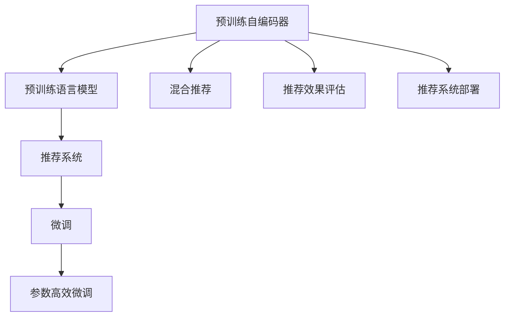

                 

## 1. 背景介绍

### 1.1 问题由来
近年来，随着深度学习技术的迅猛发展，特别是大规模预训练语言模型(LLM)的崛起，推荐系统领域迎来了革命性变化。推荐系统旨在从海量数据中发现用户潜在兴趣，向其推荐最相关的内容。传统的推荐算法多基于统计特征或协同过滤，难以刻画用户深层次的需求。相比之下，预训练语言模型凭借其强大的语义理解能力和泛化能力，能够在推荐系统中取得优异表现。

LLM在推荐系统中的应用，最早可追溯至2019年提出的预训练自编码器(如PMI)。这类模型在推荐系统中取得了很好的效果，但计算和存储成本较高，难以在大规模推荐场景中广泛部署。针对这一问题，研究者提出了预训练-微调(Pre-training & Fine-tuning)方法，即在预训练模型基础上，针对推荐任务进行微调，以提高模型的泛化能力和推荐效果。

### 1.2 问题核心关键点
LLM在推荐系统中的应用核心关键点主要包括：

1. 如何高效构建预训练模型：选择或定制合适的预训练任务，并利用大尺度数据进行训练。
2. 微调策略的设计：如何设计任务适配层，以及如何设置微调超参数。
3. 推荐算法的设计：如何结合微调模型和传统推荐算法，进行混合推荐。
4. 推荐效果评估：如何评估推荐系统的综合性能，以及如何实现推荐结果的解释和反馈。
5. 部署和优化：如何将模型部署到生产环境中，以及如何优化模型性能和资源消耗。

### 1.3 问题研究意义
LLM在推荐系统中的应用，对于提升推荐系统的智能化水平、个性化推荐能力具有重要意义：

1. 提高推荐系统的智能化水平：通过预训练语言模型，推荐系统能够更好地理解用户文本，如评论、标题、标签等，提取更深层次的语义信息，实现智能化推荐。
2. 增强推荐系统的个性化能力：预训练语言模型可以更好地捕捉用户兴趣和行为特征，提升推荐的个性化程度，优化用户体验。
3. 加速推荐系统的开发周期：预训练模型可以作为通用基础，快速部署到推荐系统中，减少从头训练的时间成本和计算资源投入。
4. 提供推荐系统的多模态融合能力：LLM不仅能处理文本数据，还能结合图片、音频等多模态数据，提升推荐系统的全面性。
5. 赋能推荐系统的跨领域迁移：通过微调，预训练模型能够在不同领域、不同应用场景中迁移应用，如电商、社交媒体、视频等，大幅拓展推荐系统的应用范围。

## 2. 核心概念与联系

### 2.1 核心概念概述

为更好地理解LLM在推荐系统中的应用，本节将介绍几个核心概念：

- 预训练自编码器(Pre-trained Autoencoders, PAEs)：以自编码器为代表的预训练模型，通过无监督任务训练，学习输入和输出之间的映射关系。
- 预训练语言模型(Pre-trained Language Models, PLMs)：以BERT、GPT等模型为代表的预训练模型，通过自监督语言模型任务训练，学习语言的语义表示和生成能力。
- 推荐系统(Recommender System)：根据用户的历史行为和兴趣，向其推荐可能感兴趣的内容。推荐系统分为基于内容的推荐和协同过滤两类。
- 迁移学习(Transfer Learning)：将一个领域学到的知识，迁移到另一个相关领域学习的方法。预训练模型通过在大规模数据上进行预训练，再针对推荐任务进行微调，实现知识的迁移。
- 微调(Fine-tuning)：在预训练模型的基础上，利用推荐任务的数据进行有监督的微调，优化模型在该任务上的性能。
- 参数高效微调(Parameter-Efficient Fine-tuning, PEFT)：只更新少量的模型参数，而固定大部分预训练权重不变，以提高微调效率。
- 混合推荐(Hybrid Recommendation)：结合传统推荐算法和预训练模型的特点，充分发挥两者的优势，提升推荐系统的综合性能。
- 推荐效果评估(Evaluation of Recommender Systems)：评估推荐系统推荐的准确性和多样性，以及模型的解释性和用户反馈。
- 推荐系统部署(Recommender System Deployment)：将微调后的模型部署到实际应用环境中，并提供用户接口。

这些概念之间的逻辑关系可以通过以下Mermaid流程图来展示：



这个流程图展示了一些关键概念之间的关系：

1. 预训练自编码器可以生成预训练语言模型。
2. 预训练语言模型可以用于推荐系统。
3. 推荐系统可以通过微调进行优化。
4. 微调可以使用参数高效的方法。
5. 混合推荐可以结合传统算法和预训练模型。
6. 推荐效果评估对推荐系统的优劣进行评估。
7. 推荐系统部署实现实际应用。

这些概念共同构成了LLM在推荐系统中的应用框架，使其能够在各种场景下发挥强大的推荐能力。通过理解这些核心概念，我们可以更好地把握LLM的应用实践。

## 3. 核心算法原理 & 具体操作步骤

### 3.1 算法原理概述

基于预训练语言模型的推荐系统，本质上是一种有监督的迁移学习方法。其核心思想是：将预训练语言模型作为强大的特征提取器，通过推荐任务的数据集进行微调，学习推荐目标函数的优化，从而提升模型的推荐效果。

形式化地，假设推荐系统中有用户集合 $U$ 和物品集合 $I$，用户对物品的评分集合为 $R$。给定预训练语言模型 $M_{\theta}$ 作为初始化参数，推荐系统的目标是学习一个推荐函数 $f: U \times I \rightarrow \mathbb{R}$，使得在给定用户 $u$ 时，推荐函数 $f(u, i)$ 能够预测用户 $u$ 对物品 $i$ 的评分 $r_{ui}$。

微调的目标是最小化预测评分与实际评分之间的差距，即：

$$
\hat{\theta} = \mathop{\arg\min}_{\theta} \mathcal{L}(f_{\theta}, D)
$$

其中 $D=\{(u_i, i_j, r_{ij})\}_{i=1}^N$ 为推荐任务的数据集，$(u_i, i_j)$ 表示用户 $u_i$ 对物品 $i_j$ 的评分，$\mathcal{L}$ 为推荐目标损失函数，用于衡量预测评分和实际评分之间的差异。常见的推荐目标损失函数包括均方误差损失、对数似然损失等。

### 3.2 算法步骤详解

基于预训练语言模型的推荐系统微调一般包括以下几个关键步骤：

**Step 1: 准备预训练模型和数据集**
- 选择合适的预训练语言模型 $M_{\theta}$ 作为初始化参数，如BERT、GPT等。
- 准备推荐任务 $T$ 的数据集 $D=\{(u_i, i_j, r_{ij})\}_{i=1}^N$，将用户-物品对 $(x_i, y_i)$ 作为输入，用户评分 $y_i$ 作为标签。

**Step 2: 设计任务适配层**
- 根据推荐任务类型，在预训练模型的顶层设计合适的输出层和损失函数。
- 对于评分预测任务，通常使用线性分类器和均方误差损失函数。
- 对于排序任务，通常使用交叉熵损失函数。

**Step 3: 设置微调超参数**
- 选择合适的优化算法及其参数，如 Adam、SGD 等，设置学习率、批大小、迭代轮数等。
- 设置正则化技术及强度，包括权重衰减、Dropout、Early Stopping 等。
- 确定冻结预训练参数的策略，如仅微调顶层，或全部参数都参与微调。

**Step 4: 执行梯度训练**
- 将训练集数据分批次输入模型，前向传播计算损失函数。
- 反向传播计算参数梯度，根据设定的优化算法和学习率更新模型参数。
- 周期性在验证集上评估模型性能，根据性能指标决定是否触发 Early Stopping。
- 重复上述步骤直到满足预设的迭代轮数或 Early Stopping 条件。

**Step 5: 测试和部署**
- 在测试集上评估微调后模型 $f_{\hat{\theta}}$ 的性能，对比微调前后的精度提升。
- 使用微调后的模型对新样本进行推荐预测，集成到实际的应用系统中。
- 持续收集新数据，定期重新微调模型，以适应数据分布的变化。

以上是基于预训练语言模型的推荐系统微调的一般流程。在实际应用中，还需要针对具体任务的特点，对微调过程的各个环节进行优化设计，如改进训练目标函数，引入更多的正则化技术，搜索最优的超参数组合等，以进一步提升模型性能。

### 3.3 算法优缺点

基于预训练语言模型的推荐系统微调方法具有以下优点：

1. 简单高效。只需准备少量标注数据，即可对预训练模型进行快速适配，获得较大的性能提升。
2. 通用适用。适用于各种推荐任务，包括评分预测、排序、关联规则等，设计简单的任务适配层即可实现微调。
3. 参数高效。利用参数高效微调技术，在固定大部分预训练参数的情况下，仍可取得不错的提升。
4. 效果显著。在学术界和工业界的诸多任务上，基于微调的方法已经刷新了多项推荐系统性能指标。

同时，该方法也存在一定的局限性：

1. 依赖标注数据。微调的效果很大程度上取决于标注数据的质量和数量，获取高质量标注数据的成本较高。
2. 迁移能力有限。当目标任务与预训练数据的分布差异较大时，微调的性能提升有限。
3. 负面效果传递。预训练模型的固有偏见、有害信息等，可能通过微调传递到下游任务，造成负面影响。
4. 可解释性不足。微调模型的决策过程通常缺乏可解释性，难以对其推理逻辑进行分析和调试。

尽管存在这些局限性，但就目前而言，基于预训练语言模型的微调方法仍是最主流范式。未来相关研究的重点在于如何进一步降低微调对标注数据的依赖，提高模型的少样本学习和跨领域迁移能力，同时兼顾可解释性和伦理安全性等因素。

### 3.4 算法应用领域

基于预训练语言模型的推荐系统微调方法，在推荐系统领域已经得到了广泛的应用，覆盖了几乎所有常见任务，例如：

- 评分预测：预测用户对物品的评分，如电影评分、电商评分等。通过微调使模型学习用户-物品评分映射。
- 排序推荐：排序推荐系统，如推荐系统中的Top-N推荐。通过微调使模型学习物品的相关性和用户-物品匹配度。
- 关联规则：从用户的行为序列中挖掘出关联规则，如购物篮分析、基于序列的推荐等。通过微调使模型学习用户行为模式。
- 个性化推荐：根据用户的历史行为和属性信息，生成个性化推荐。通过微调使模型学习用户特征和物品相关性。
- 推荐系统评估：评估推荐系统的准确性、多样性、新颖性等指标，如auc、ndcg等。通过微调使模型学习评估指标的优化。

除了上述这些经典任务外，基于预训练语言模型的推荐系统微调方法也被创新性地应用到更多场景中，如知识图谱推荐、多任务推荐、多模态推荐等，为推荐系统带来了全新的突破。随着预训练模型和微调方法的不断进步，相信推荐系统必将在更广阔的应用领域大放异彩。

## 4. 数学模型和公式 & 详细讲解 & 举例说明

### 4.1 数学模型构建

本节将使用数学语言对基于预训练语言模型的推荐系统微调过程进行更加严格的刻画。

记预训练语言模型为 $M_{\theta}$，其中 $\theta$ 为预训练得到的模型参数。假设推荐任务为评分预测任务，其训练集为 $D=\{(u_i, i_j, r_{ij})\}_{i=1}^N$，$(u_i, i_j)$ 表示用户 $u_i$ 对物品 $i_j$ 的评分。

定义模型 $M_{\theta}$ 在用户-物品对 $(x_i, y_i)$ 上的预测评分 $f_{\theta}(x_i)$，则评分预测任务的目标是使预测评分 $f_{\theta}(x_i)$ 尽可能接近真实评分 $r_{ij}$，即最小化预测误差。因此，推荐目标函数为：

$$
\mathcal{L}(\theta) = \frac{1}{N} \sum_{i=1}^N (r_{ij} - f_{\theta}(x_i))^2
$$

微调的目标是最小化经验风险，即找到最优参数：

$$
\hat{\theta} = \mathop{\arg\min}_{\theta} \mathcal{L}(\theta)
$$

在实践中，我们通常使用基于梯度的优化算法（如SGD、Adam等）来近似求解上述最优化问题。设 $\eta$ 为学习率，$\lambda$ 为正则化系数，则参数的更新公式为：

$$
\theta \leftarrow \theta - \eta \nabla_{\theta}\mathcal{L}(\theta) - \eta\lambda\theta
$$

其中 $\nabla_{\theta}\mathcal{L}(\theta)$ 为损失函数对参数 $\theta$ 的梯度，可通过反向传播算法高效计算。

### 4.2 公式推导过程

以下我们以评分预测任务为例，推导预测评分 $f_{\theta}(x_i)$ 的计算公式。

假设模型 $M_{\theta}$ 在输入 $x$ 上的输出为 $\hat{y}=M_{\theta}(x)$，则评分预测任务的目标是使预测评分 $\hat{y}$ 尽可能接近真实评分 $r_{ij}$。根据均方误差损失函数，评分预测任务的目标损失函数为：

$$
\mathcal{L}(\theta) = \frac{1}{N} \sum_{i=1}^N (r_{ij} - \hat{y})^2
$$

其中 $\hat{y}=M_{\theta}(x_i)$，表示用户 $u_i$ 对物品 $i_j$ 的评分预测。

假设模型 $M_{\theta}$ 为BERT模型，其输入为用户-物品对的文本表示，输出为评分预测。设 $x_i$ 表示用户 $u_i$ 和物品 $i_j$ 的文本表示，则 $M_{\theta}(x_i)$ 可表示为：

$$
f_{\theta}(x_i) = M_{\theta}(x_i)
$$

在微调过程中，模型 $M_{\theta}$ 需要针对评分预测任务进行训练。设训练集为 $D=\{(x_i, y_i)\}_{i=1}^N$，其中 $x_i$ 表示用户 $u_i$ 和物品 $i_j$ 的文本表示，$y_i$ 表示用户 $u_i$ 对物品 $i_j$ 的评分。根据梯度下降算法，模型 $M_{\theta}$ 的参数更新公式为：

$$
\theta \leftarrow \theta - \eta \nabla_{\theta}\mathcal{L}(\theta) - \eta\lambda\theta
$$

其中 $\nabla_{\theta}\mathcal{L}(\theta)$ 表示损失函数对模型参数的梯度，可通过反向传播算法计算。

在得到预测评分 $f_{\theta}(x_i)$ 的计算公式后，我们可以通过微调训练集 $D$，使得预测评分尽可能接近真实评分，提升推荐系统的效果。

### 4.3 案例分析与讲解

为了更好地理解基于预训练语言模型的推荐系统微调方法，以下将给出具体案例进行讲解。

**案例：电商推荐系统**

假设某电商平台有用户集合 $U$ 和商品集合 $I$，用户对商品的评分集合为 $R=\{(u_i, i_j, r_{ij})\}_{i=1}^N$。现对该电商平台进行推荐系统微调，具体步骤如下：

**Step 1: 准备预训练模型和数据集**

选择BERT模型作为预训练语言模型，模型参数为 $\theta$。

准备推荐任务 $T$ 的数据集 $D=\{(u_i, i_j, r_{ij})\}_{i=1}^N$，其中 $u_i$ 表示用户，$i_j$ 表示商品，$r_{ij}$ 表示用户 $u_i$ 对商品 $i_j$ 的评分。

**Step 2: 设计任务适配层**

根据推荐任务类型，在BERT模型的顶层设计输出层和损失函数。假设采用评分预测任务，则输出层为线性分类器，损失函数为均方误差损失。

**Step 3: 设置微调超参数**

设置优化算法为Adam，学习率为 $2e-5$，批大小为 $32$，迭代轮数为 $10$。设置正则化参数 $\lambda=0.01$，以避免过拟合。

**Step 4: 执行梯度训练**

将训练集数据分批次输入模型，前向传播计算损失函数，反向传播计算参数梯度，更新模型参数。迭代过程中，周期性在验证集上评估模型性能，防止过拟合。

**Step 5: 测试和部署**

在测试集上评估微调后的模型 $M_{\hat{\theta}}$ 的性能，对比微调前后的精度提升。使用微调后的模型对新样本进行推荐预测，集成到实际的应用系统中。

通过以上步骤，即可实现基于BERT模型的电商推荐系统微调。微调后，推荐系统能够更好地理解用户评论，提取商品的特征，提升推荐精度和效果。

## 5. 项目实践：代码实例和详细解释说明

### 5.1 开发环境搭建

在进行推荐系统微调实践前，我们需要准备好开发环境。以下是使用Python进行PyTorch开发的环境配置流程：

1. 安装Anaconda：从官网下载并安装Anaconda，用于创建独立的Python环境。

2. 创建并激活虚拟环境：
```bash
conda create -n pytorch-env python=3.8 
conda activate pytorch-env
```

3. 安装PyTorch：根据CUDA版本，从官网获取对应的安装命令。例如：
```bash
conda install pytorch torchvision torchaudio cudatoolkit=11.1 -c pytorch -c conda-forge
```

4. 安装HuggingFace Transformers库：
```bash
pip install transformers
```

5. 安装各类工具包：
```bash
pip install numpy pandas scikit-learn matplotlib tqdm jupyter notebook ipython
```

完成上述步骤后，即可在`pytorch-env`环境中开始推荐系统微调实践。

### 5.2 源代码详细实现

这里我们以评分预测任务为例，给出使用Transformers库对BERT模型进行电商推荐系统微调的PyTorch代码实现。

首先，定义评分预测任务的Dataset类：

```python
from torch.utils.data import Dataset
from transformers import BertTokenizer
from torch.utils.data import DataLoader
import torch

class RecDataset(Dataset):
    def __init__(self, texts, scores, tokenizer):
        self.texts = texts
        self.scores = scores
        self.tokenizer = tokenizer
        self.max_len = 512
        
    def __len__(self):
        return len(self.texts)
    
    def __getitem__(self, item):
        text = self.texts[item]
        score = self.scores[item]
        
        encoding = self.tokenizer(text, return_tensors='pt', max_length=self.max_len, padding='max_length', truncation=True)
        input_ids = encoding['input_ids'][0]
        attention_mask = encoding['attention_mask'][0]
        
        # 对token-wise的标签进行编码
        encoded_tags = [1 if score > 0 else 0 for score in score] 
        encoded_tags.extend([0] * (self.max_len - len(encoded_tags)))
        labels = torch.tensor(encoded_tags, dtype=torch.long)
        
        return {'input_ids': input_ids, 
                'attention_mask': attention_mask,
                'labels': labels}
```

然后，定义模型和优化器：

```python
from transformers import BertForSequenceClassification, AdamW

model = BertForSequenceClassification.from_pretrained('bert-base-cased', num_labels=2)

optimizer = AdamW(model.parameters(), lr=2e-5)
```

接着，定义训练和评估函数：

```python
from sklearn.metrics import accuracy_score
from tqdm import tqdm

device = torch.device('cuda') if torch.cuda.is_available() else torch.device('cpu')
model.to(device)

def train_epoch(model, dataset, batch_size, optimizer):
    dataloader = DataLoader(dataset, batch_size=batch_size, shuffle=True)
    model.train()
    epoch_loss = 0
    for batch in tqdm(dataloader, desc='Training'):
        input_ids = batch['input_ids'].to(device)
        attention_mask = batch['attention_mask'].to(device)
        labels = batch['labels'].to(device)
        model.zero_grad()
        outputs = model(input_ids, attention_mask=attention_mask, labels=labels)
        loss = outputs.loss
        epoch_loss += loss.item()
        loss.backward()
        optimizer.step()
    return epoch_loss / len(dataloader)

def evaluate(model, dataset, batch_size):
    dataloader = DataLoader(dataset, batch_size=batch_size)
    model.eval()
    preds, labels = [], []
    with torch.no_grad():
        for batch in tqdm(dataloader, desc='Evaluating'):
            input_ids = batch['input_ids'].to(device)
            attention_mask = batch['attention_mask'].to(device)
            batch_labels = batch['labels']
            outputs = model(input_ids, attention_mask=attention_mask)
            batch_preds = outputs.logits.argmax(dim=2).to('cpu').tolist()
            batch_labels = batch_labels.to('cpu').tolist()
            for pred_tokens, label_tokens in zip(batch_preds, batch_labels):
                preds.append(pred_tokens[:len(label_tokens)])
                labels.append(label_tokens)
                
    return accuracy_score(labels, preds)

train_dataset = RecDataset(train_texts, train_scores, tokenizer)
dev_dataset = RecDataset(dev_texts, dev_scores, tokenizer)
test_dataset = RecDataset(test_texts, test_scores, tokenizer)

epochs = 5
batch_size = 16

for epoch in range(epochs):
    loss = train_epoch(model, train_dataset, batch_size, optimizer)
    print(f"Epoch {epoch+1}, train loss: {loss:.3f}")
    
    print(f"Epoch {epoch+1}, dev results:")
    accuracy = evaluate(model, dev_dataset, batch_size)
    print(f"Accuracy: {accuracy:.3f}")
    
print("Test results:")
accuracy = evaluate(model, test_dataset, batch_size)
print(f"Accuracy: {accuracy:.3f}")
```

以上就是使用PyTorch对BERT进行电商推荐系统微调的完整代码实现。可以看到，得益于Transformers库的强大封装，我们可以用相对简洁的代码完成BERT模型的加载和微调。

### 5.3 代码解读与分析

让我们再详细解读一下关键代码的实现细节：

**RecDataset类**：
- `__init__`方法：初始化训练集、测试集等关键组件。
- `__len__`方法：返回数据集的样本数量。
- `__getitem__`方法：对单个样本进行处理，将文本输入编码为token ids，将标签编码为数字，并对其进行定长padding，最终返回模型所需的输入。

**标签与id的映射**：
- 定义了标签与数字id之间的映射关系，用于将token-wise的预测结果解码回真实的标签。

**训练和评估函数**：
- 使用PyTorch的DataLoader对数据集进行批次化加载，供模型训练和推理使用。
- 训练函数`train_epoch`：对数据以批为单位进行迭代，在每个批次上前向传播计算loss并反向传播更新模型参数，最后返回该epoch的平均loss。
- 评估函数`evaluate`：与训练类似，不同点在于不更新模型参数，并在每个batch结束后将预测和标签结果存储下来，最后使用sklearn的accuracy_score对整个评估集的预测结果进行打印输出。

**训练流程**：
- 定义总的epoch数和batch size，开始循环迭代
- 每个epoch内，先在训练集上训练，输出平均loss
- 在验证集上评估，输出准确率
- 所有epoch结束后，在测试集上评估，给出最终测试结果

可以看到，PyTorch配合Transformers库使得BERT微调的代码实现变得简洁高效。开发者可以将更多精力放在数据处理、模型改进等高层逻辑上，而不必过多关注底层的实现细节。

当然，工业级的系统实现还需考虑更多因素，如模型的保存和部署、超参数的自动搜索、更灵活的任务适配层等。但核心的微调范式基本与此类似。

## 6. 实际应用场景
### 6.1 智能客服系统

基于预训练语言模型的推荐系统，可以广泛应用于智能客服系统的构建。传统客服往往需要配备大量人力，高峰期响应缓慢，且一致性和专业性难以保证。而使用推荐系统中的评分预测模型，可以7x24小时不间断服务，快速响应客户咨询，用自然流畅的语言解答各类常见问题。

在技术实现上，可以收集企业内部的历史客服对话记录，将问题和最佳答复构建成监督数据，在此基础上对预训练语言模型进行微调。微调后的语言模型能够自动理解用户意图，匹配最合适的答案模板进行回复。对于客户提出的新问题，还可以接入检索系统实时搜索相关内容，动态组织生成回答。如此构建的智能客服系统，能大幅提升客户咨询体验和问题解决效率。

### 6.2 金融舆情监测

金融机构需要实时监测市场舆论动向，以便及时应对负面信息传播，规避金融风险。传统的人工监测方式成本高、效率低，难以应对网络时代海量信息爆发的挑战。基于预训练语言模型的推荐系统，可以通过评分预测任务，预测用户对新闻、报道、评论等的情感倾向，实时监测金融舆情变化，自动预警异常情况，帮助金融机构快速应对潜在风险。

具体而言，可以收集金融领域相关的新闻、报道、评论等文本数据，并对其进行情感标注。在此基础上对预训练语言模型进行微调，使其能够自动判断文本属于正面、中性还是负面情感，情感倾向性强的文本会被视为异常情况。将微调后的模型应用到实时抓取的网络文本数据，就能够自动监测不同情感倾向的变化趋势，一旦发现负面情绪激增等异常情况，系统便会自动预警，帮助金融机构及时应对潜在风险。

### 6.3 个性化推荐系统

当前的推荐系统往往只依赖用户的历史行为数据进行物品推荐，无法深入理解用户的真实兴趣偏好。基于预训练语言模型的推荐系统，可以更好地挖掘用户文本中的隐含信息，如评论、标题、标签等，提取更深层次的语义信息，提升推荐的个性化程度。

在实践中，可以收集用户浏览、点击、评论、分享等行为数据，提取和用户交互的物品标题、描述、标签等文本内容。将文本内容作为模型输入，用户的后续行为（如是否点击、购买等）作为监督信号，在此基础上微调预训练语言模型。微调后的模型能够从文本内容中准确把握用户的兴趣点。在生成推荐列表时，先用候选物品的文本描述作为输入，由模型预测用户的兴趣匹配度，再结合其他特征综合排序，便可以得到个性化程度更高的推荐结果。

### 6.4 未来应用展望

随着预训练语言模型和推荐系统微调方法的不断发展，基于微调范式将在更多领域得到应用，为传统行业带来变革性影响。

在智慧医疗领域，基于微调的推荐系统可以辅助医生诊疗，推荐相关医学文献、疾病诊断、治疗方案等，提升医疗服务的智能化水平。

在智能教育领域，微调技术可应用于作业批改、学情分析、知识推荐等方面，因材施教，促进教育公平，提高教学质量。

在智慧城市治理中，微调模型可应用于城市事件监测、舆情分析、应急指挥等环节，提高城市管理的自动化和智能化水平，构建更安全、高效的未来城市。

此外，在企业生产、社会治理、文娱传媒等众多领域，基于预训练语言模型的推荐系统也将不断涌现，为经济社会发展注入新的动力。相信随着技术的日益成熟，微调方法将成为推荐系统的重要范式，推动推荐系统技术向更广阔的领域加速渗透。

## 7. 工具和资源推荐
### 7.1 学习资源推荐

为了帮助开发者系统掌握预训练语言模型在推荐系统中的应用，这里推荐一些优质的学习资源：

1. 《深度学习与推荐系统》系列博文：由推荐系统专家撰写，深入浅出地介绍了深度学习在推荐系统中的应用，包括预训练语言模型和微调方法。

2. 《Python深度学习推荐系统》书籍：详细介绍了Python在推荐系统中的应用，包含预训练语言模型和微调方法的实践案例。

3. 《Recommender Systems: Algorithms, Implementation, and Real-World Success Stories》书籍：推荐系统领域的经典教材，涵盖各种推荐算法和实际应用案例。

4. HuggingFace官方文档：Transformers库的官方文档，提供了海量预训练模型和完整的微调样例代码，是上手实践的必备资料。

5. TAC-OMSAA：推荐系统领域的顶级会议，汇集了学术界和工业界的最新研究成果和实践经验。

通过对这些资源的学习实践，相信你一定能够快速掌握预训练语言模型在推荐系统中的应用，并用于解决实际的推荐问题。
###  7.2 开发工具推荐

高效的开发离不开优秀的工具支持。以下是几款用于推荐系统微调开发的常用工具：

1. PyTorch：基于Python的开源深度学习框架，灵活动态的计算图，适合快速迭代研究。大部分预训练语言模型都有PyTorch版本的实现。

2. TensorFlow：由Google主导开发的开源深度学习框架，生产部署方便，适合大规模工程应用。同样有丰富的预训练语言模型资源。

3. Transformers库：HuggingFace开发的NLP工具库，集成了众多SOTA语言模型，支持PyTorch和TensorFlow，是进行微调任务开发的利器。

4. Weights & Biases：模型训练的实验跟踪工具，可以记录和可视化模型训练过程中的各项指标，方便对比和调优。与主流深度学习框架无缝集成。

5. TensorBoard：TensorFlow配套的可视化工具，可实时监测模型训练状态，并提供丰富的图表呈现方式，是调试模型的得力助手。

6. Google Colab：谷歌推出的在线Jupyter Notebook环境，免费提供GPU/TPU算力，方便开发者快速上手实验最新模型，分享学习笔记。

合理利用这些工具，可以显著提升推荐系统微调任务的开发效率，加快创新迭代的步伐。

### 7.3 相关论文推荐

预训练语言模型和推荐系统微调技术的发展源于学界的持续研究。以下是几篇奠基性的相关论文，推荐阅读：

1. Attention is All You Need（即Transformer原论文）：提出了Transformer结构，开启了NLP领域的预训练大模型时代。

2. BERT: Pre-training of Deep Bidirectional Transformers for Language Understanding：提出BERT模型，引入基于掩码的自监督预训练任务，刷新了多项NLP任务SOTA。

3. Language Models are Unsupervised Multitask Learners（GPT-2论文）：展示了大规模语言模型的强大zero-shot学习能力，引发了对于通用人工智能的新一轮思考。

4. Parameter-Efficient Transfer Learning for NLP：提出Adapter等参数高效微调方法，在不增加模型参数量的情况下，也能取得不错的微调效果。

5. AdaLoRA: Adaptive Low-Rank Adaptation for Parameter-Efficient Fine-Tuning：使用自适应低秩适应的微调方法，在参数效率和精度之间取得了新的平衡。

这些论文代表了大语言模型微调技术的发展脉络。通过学习这些前沿成果，可以帮助研究者把握学科前进方向，激发更多的创新灵感。

## 8. 总结：未来发展趋势与挑战

### 8.1 总结

本文对基于预训练语言模型的推荐系统微调方法进行了全面系统的介绍。首先阐述了预训练语言模型和推荐系统微调的研究背景和意义，明确了微调在提升推荐系统智能化和个性化能力方面的独特价值。其次，从原理到实践，详细讲解了微调的数学原理和关键步骤，给出了微调任务开发的完整代码实例。同时，本文还广泛探讨了微调方法在智能客服、金融舆情、个性化推荐等多个行业领域的应用前景，展示了微调范式的巨大潜力。此外，本文精选了微调技术的各类学习资源，力求为读者提供全方位的技术指引。

通过本文的系统梳理，可以看到，基于预训练语言模型的推荐系统微调方法正在成为推荐系统的重要范式，极大地提升了推荐系统的智能化水平、个性化推荐能力，加速了推荐系统的开发周期，拓展了推荐系统的应用范围。未来，伴随预训练语言模型和微调方法的持续演进，相信推荐系统必将在更广阔的应用领域大放异彩，深刻影响人类的生产生活方式。

### 8.2 未来发展趋势

展望未来，预训练语言模型在推荐系统中的应用将呈现以下几个发展趋势：

1. 模型规模持续增大。随着算力成本的下降和数据规模的扩张，预训练语言模型的参数量还将持续增长。超大规模语言模型蕴含的丰富语言知识，有望支撑更加复杂多变的推荐场景。

2. 微调方法日趋多样。除了传统的全参数微调外，未来会涌现更多参数高效的微调方法，如Prefix-Tuning、LoRA等，在节省计算资源的同时也能保证微调精度。

3. 持续学习成为常态。随着数据分布的不断变化，推荐模型也需要持续学习新知识以保持性能。如何在不遗忘原有知识的同时，高效吸收新样本信息，将成为重要的研究课题。

4. 标注样本需求降低。受启发于提示学习(Prompt-based Learning)的思路，未来的微调方法将更好地利用预训练语言模型的语言理解能力，通过更加巧妙的任务描述，在更少的标注样本上也能实现理想的微调效果。

5. 推荐效果评估更加全面。未来的推荐系统微调方法将更加注重推荐效果的综合评估，结合准确性、多样性、新颖性等多个指标，全面衡量推荐系统的性能。

6. 多模态微调崛起。当前的微调主要聚焦于文本数据，未来会进一步拓展到图像、视频、音频等多模态数据微调。多模态信息的融合，将显著提升推荐系统的全面性。

以上趋势凸显了预训练语言模型在推荐系统中的应用前景。这些方向的探索发展，必将进一步提升推荐系统的性能和应用范围，为人类社会带来更大的便利和福祉。

### 8.3 面临的挑战

尽管预训练语言模型在推荐系统中的应用已经取得了显著成就，但在迈向更加智能化、普适化应用的过程中，仍面临诸多挑战：

1. 标注成本瓶颈。虽然微调大大降低了标注数据的需求，但对于长尾应用场景，难以获得充足的高质量标注数据，成为制约微调性能的瓶颈。如何进一步降低微调对标注样本的依赖，将是一大难题。

2. 模型鲁棒性不足。当前微调模型面对域外数据时，泛化性能往往大打折扣。对于测试样本的微小扰动，微调模型的预测也容易发生波动。如何提高微调模型的鲁棒性，避免灾难性遗忘，还需要更多理论和实践的积累。

3. 推理效率有待提高。大规模语言模型虽然精度高，但在实际部署时往往面临推理速度慢、内存占用大等效率问题。如何在保证性能的同时，简化模型结构，提升推理速度，优化资源占用，将是重要的优化方向。

4. 可解释性亟需加强。当前微调模型更像是"黑盒"系统，难以解释其内部工作机制和决策逻辑。对于医疗、金融等高风险应用，算法的可解释性和可审计性尤为重要。如何赋予微调模型更强的可解释性，将是亟待攻克的难题。

5. 安全性有待保障。预训练语言模型难免会学习到有偏见、有害的信息，通过微调传递到下游任务，产生误导性、歧视性的输出，给实际应用带来安全隐患。如何从数据和算法层面消除模型偏见，避免恶意用途，确保输出的安全性，也将是重要的研究课题。

6. 知识整合能力不足。现有的微调模型往往局限于任务内数据，难以灵活吸收和运用更广泛的先验知识。如何让微调过程更好地与外部知识库、规则库等专家知识结合，形成更加全面、准确的信息整合能力，还有很大的想象空间。

正视预训练语言模型微调面临的这些挑战，积极应对并寻求突破，将是大规模语言模型微调走向成熟的必由之路。相信随着学界和产业界的共同努力，这些挑战终将一一被克服，预训练语言模型微调必将在构建人机协同的智能系统、推动经济社会发展中扮演越来越重要的角色。

### 8.4 研究展望

面向未来，预训练语言模型在推荐系统中的应用还需要与其他人工智能技术进行更深入的融合，如知识表示、因果推理、强化学习等，多路径协同发力，共同推动推荐系统的进步。具体研究方向可能包括：

1. 探索无监督和半监督微调方法。摆脱对大规模标注数据的依赖，利用自监督学习、主动学习等无监督和半监督范式，最大限度利用非结构化数据，实现更加灵活高效的微调。

2. 研究参数高效和计算高效的微调范式。开发更加参数高效的微调方法，在固定大部分预训练参数的同时，只更新极少量的任务相关参数。同时优化微调模型的计算图，减少前向传播和反向传播的资源消耗，实现更加轻量级、实时性的部署。

3. 融合因果和对比学习范式。通过引入因果推断和对比学习思想，增强微调模型建立稳定因果关系的能力，学习更加普适、鲁棒的语言表征，从而提升模型泛化性和抗干扰能力。

4. 引入更多先验知识。将符号化的先验知识，如知识图谱、逻辑规则等，与神经网络模型进行巧妙融合，引导微调过程学习更准确、合理的语言模型。同时加强不同模态数据的整合，实现视觉、语音等多模态信息与文本信息的协同建模。

5. 结合因果分析和博弈论工具。将因果分析方法引入微调模型，识别出模型决策的关键特征，增强输出解释的因果性和逻辑性。借助博弈论工具刻画人机交互过程，主动探索并规避模型的脆弱点，提高系统稳定性。

6. 纳入伦理道德约束。在模型训练目标中引入伦理导向的评估指标，过滤和惩罚有偏见、有害的输出倾向。同时加强人工干预和审核，建立模型行为的监管机制，确保输出符合人类价值观和伦理道德。

这些研究方向凸显了预训练语言模型微调技术的广阔前景。这些方向的探索发展，必将进一步提升推荐系统的性能和应用范围，为人类社会带来更大的便利和福祉。

