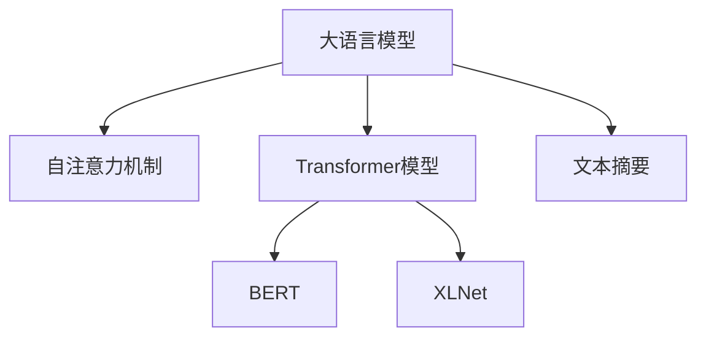

                 

# LLM在文本摘要方面的新进展

> 关键词：大语言模型,文本摘要,深度学习,自然语言处理(NLP),自注意力机制,Transformer,BERT,XLNet,模型压缩,嵌入式数据

## 1. 背景介绍

文本摘要（Text Summarization）是自然语言处理（NLP）领域中的一项重要任务，旨在从长篇文本中自动生成简洁且信息量丰富的摘要。传统上，文本摘要方法通常依赖于规则式方法和基于统计的方法，但这些方法在处理长篇复杂文本时，效果往往不尽如人意。近年来，大语言模型（Large Language Model, LLM）的崛起，为文本摘要带来了全新的突破。利用大语言模型，通过训练可以自动学习到文本中的关键信息，从而生成高质量的摘要。本文将全面介绍LLM在文本摘要方面的新进展，包括模型的构建、核心原理、实际应用和未来趋势。

## 2. 核心概念与联系

### 2.1 核心概念概述

为更好地理解LLM在文本摘要中的应用，本文将介绍几个核心概念：

- **大语言模型（LLM）**：以自回归（如GPT）或自编码（如BERT）模型为代表的大规模预训练语言模型。通过在海量文本数据上进行预训练，学习到语言的丰富表示。
- **文本摘要（Text Summarization）**：从长篇文本中自动提取并生成简洁的摘要，保留关键信息，提升文本的可读性和可理解性。
- **自注意力机制（Self-Attention）**：一种用于捕捉序列中不同位置之间依赖关系的机制，是Transformer模型中的关键技术。
- **Transformer模型**：基于自注意力机制的深度学习模型，在文本生成、机器翻译等任务中表现优异。
- **BERT、XLNet**：两种预训练语言模型，分别通过掩码语言模型和生成式自回归模型进行预训练，学习到文本的语义和语法结构。

这些概念之间的关系可以通过以下Mermaid流程图来展示：



这个流程图展示了大语言模型与自注意力机制、Transformer模型、BERT和XLNet之间的逻辑关系：

1. 大语言模型通过预训练学习到文本的丰富表示。
2. 自注意力机制捕捉序列中不同位置之间的依赖关系。
3. 基于自注意力机制的Transformer模型在文本生成、机器翻译等任务中表现优异。
4. BERT和XLNet通过不同的预训练任务学习到文本的语义和语法结构。
5. 文本摘要任务通过使用预训练模型或自定义的微调模型，自动生成简洁的摘要。

## 3. 核心算法原理 & 具体操作步骤

### 3.1 算法原理概述

基于大语言模型的文本摘要，本质上是一个序列到序列（Seq2Seq）的任务。其核心思想是通过预训练模型来学习文本的语义和语法结构，然后使用微调模型或者零样本学习的方法生成摘要。模型的训练通常包括两个阶段：预训练和微调。

在预训练阶段，LLM模型通过大量无标签的文本数据进行自监督学习，学习到文本的语义和语法表示。在微调阶段，通过标注好的摘要-文本对数据进行有监督学习，进一步优化模型，使其能够生成高质量的摘要。

### 3.2 算法步骤详解

基于大语言模型的文本摘要一般包括以下几个关键步骤：

**Step 1: 数据准备**

- 收集并标注大量的文本-摘要对数据集。
- 对文本进行预处理，如分词、去除停用词等。
- 对摘要进行编码，生成摘要向量。

**Step 2: 模型选择和预训练**

- 选择合适的预训练模型，如BERT、XLNet等。
- 在大量的无标签文本数据上对模型进行预训练，学习文本的语义和语法结构。

**Step 3: 微调和优化**

- 在标注好的文本-摘要对数据集上进行微调，优化模型生成摘要的能力。
- 设置合适的学习率、迭代次数等超参数。
- 引入正则化技术，如Dropout、L2正则等，防止过拟合。

**Step 4: 生成摘要**

- 使用微调后的模型对新的文本进行摘要生成。
- 通过评估指标（如BLEU、ROUGE等）对生成的摘要进行评估。

### 3.3 算法优缺点

基于大语言模型的文本摘要方法具有以下优点：

- 高质量：通过预训练和微调，模型能够学习到文本的丰富语义和语法结构，生成的摘要质量高。
- 高效性：相比于传统的规则式方法和基于统计的方法，基于大语言模型的方法更高效。
- 灵活性：适用于各种类型的文本摘要任务，如新闻摘要、科技摘要等。

同时，该方法也存在一定的局限性：

- 依赖标注数据：微调效果很大程度上依赖于标注数据的质量和数量，获取高质量标注数据的成本较高。
- 可解释性不足：模型生成的摘要过程难以解释，难以调试和优化。
- 计算资源消耗大：大规模语言模型的计算需求较高，需要较强的计算资源支持。

### 3.4 算法应用领域

基于大语言模型的文本摘要技术，已经在多个领域得到了广泛应用，例如：

- **新闻摘要**：对新闻文章进行自动摘要，帮助读者快速了解新闻要点。
- **科技论文摘要**：对科技论文进行摘要，方便研究人员快速获取论文的核心内容。
- **法律文件摘要**：对法律文件进行摘要，帮助律师和法务人员快速浏览法律条款。
- **医学文献摘要**：对医学文献进行摘要，方便医生快速获取医学研究的关键信息。
- **社交媒体摘要**：对社交媒体帖子进行摘要，帮助用户快速了解社交动态。

此外，文本摘要技术还被应用于搜索引擎、智能客服、智能写作助手等场景中，极大地提高了信息检索和处理的效率。

## 4. 数学模型和公式 & 详细讲解 & 举例说明

### 4.1 数学模型构建

在基于大语言模型的文本摘要中，我们通常使用Transformer模型作为预训练模型，并在此基础上进行微调。Transformer模型包含编码器和解码器，其中编码器使用自注意力机制捕捉文本中的依赖关系，解码器则生成摘要。

**编码器**：
$$
\text{Encoder}(x) = \text{MultiHeadAttention}(x) + \text{PositionalEncoding}(x)
$$

**解码器**：
$$
\text{Decoder}(y) = \text{Softmax}(\text{Softmax}(y) \cdot \text{Softmax}(x))
$$

其中，$x$为输入的文本向量，$y$为生成的摘要向量。$\text{MultiHeadAttention}$和$\text{PositionalEncoding}$分别表示多头自注意力机制和位置编码。

### 4.2 公式推导过程

以BERT模型为例，其掩码语言模型（Masked Language Model, MLM）训练过程如下：

1. 将文本序列$x = \{x_1, x_2, ..., x_n\}$随机遮盖一些位置，得到掩码序列$y = \{y_1, y_2, ..., y_n\}$。
2. 将掩码序列输入BERT模型，得到预测向量$\hat{y} = \{\hat{y}_1, \hat{y}_2, ..., \hat{y}_n\}$。
3. 计算预测向量与真实向量$y$的交叉熵损失：
   $$
   \mathcal{L}_{MLM} = -\sum_{i=1}^{n} \log \hat{y}_i
   $$

### 4.3 案例分析与讲解

以XLMR模型为例，其在文本摘要任务上的微调过程如下：

1. 选择XLMR作为预训练模型，在BigQuery和BigPython等大规模无标签数据上进行预训练。
2. 在Annotated Summarization数据集上进行微调，该数据集包含大量新闻文章和对应的摘要。
3. 使用Adam优化器进行优化，设置合适的学习率和迭代次数。
4. 在Dev数据集上进行评估，使用BLEU等指标衡量摘要质量。
5. 在测试集上进行最终测试，对比不同模型的效果。

## 5. 项目实践：代码实例和详细解释说明

### 5.1 开发环境搭建

在进行文本摘要实践前，我们需要准备好开发环境。以下是使用Python进行PyTorch开发的环境配置流程：

1. 安装Anaconda：从官网下载并安装Anaconda，用于创建独立的Python环境。
2. 创建并激活虚拟环境：
```bash
conda create -n pytorch-env python=3.8 
conda activate pytorch-env
```
3. 安装PyTorch：根据CUDA版本，从官网获取对应的安装命令。例如：
```bash
conda install pytorch torchvision torchaudio cudatoolkit=11.1 -c pytorch -c conda-forge
```
4. 安装Transformers库：
```bash
pip install transformers
```
5. 安装各类工具包：
```bash
pip install numpy pandas scikit-learn matplotlib tqdm jupyter notebook ipython
```

完成上述步骤后，即可在`pytorch-env`环境中开始文本摘要实践。

### 5.2 源代码详细实现

这里我们以新闻摘要任务为例，给出使用Transformers库对XLMR模型进行微调的PyTorch代码实现。

首先，定义新闻摘要任务的数据处理函数：

```python
from transformers import XLMRobertaTokenizer
from torch.utils.data import Dataset
import torch

class NewsSummaryDataset(Dataset):
    def __init__(self, texts, summaries, tokenizer, max_len=128):
        self.texts = texts
        self.summaries = summaries
        self.tokenizer = tokenizer
        self.max_len = max_len
        
    def __len__(self):
        return len(self.texts)
    
    def __getitem__(self, item):
        text = self.texts[item]
        summary = self.summaries[item]
        
        encoding = self.tokenizer(text, return_tensors='pt', max_length=self.max_len, padding='max_length', truncation=True)
        input_ids = encoding['input_ids'][0]
        attention_mask = encoding['attention_mask'][0]
        
        # 对摘要进行编码
        summaries = self.tokenizer(summary, return_tensors='pt', max_length=self.max_len, padding='max_length', truncation=True)
        input_ids_summ = summaries['input_ids'][0]
        attention_mask_summ = summaries['attention_mask'][0]
        
        # 将摘要编码为向量
        summ_tokens = self.tokenizer.convert_tokens_to_ids(summary)
        summ_seq = torch.tensor(summ_tokens, dtype=torch.long).unsqueeze(0)
        
        return {'input_ids': input_ids,
                'attention_mask': attention_mask,
                'input_ids_summ': input_ids_summ,
                'attention_mask_summ': attention_mask_summ,
                'summ_seq': summ_seq}
```

然后，定义模型和优化器：

```python
from transformers import XLMRobertaForSequenceClassification, AdamW

model = XLMRobertaForSequenceClassification.from_pretrained('xlm-roberta-large', num_labels=1)

optimizer = AdamW(model.parameters(), lr=2e-5)
```

接着，定义训练和评估函数：

```python
from torch.utils.data import DataLoader
from tqdm import tqdm
from sklearn.metrics import accuracy_score

device = torch.device('cuda') if torch.cuda.is_available() else torch.device('cpu')
model.to(device)

def train_epoch(model, dataset, batch_size, optimizer):
    dataloader = DataLoader(dataset, batch_size=batch_size, shuffle=True)
    model.train()
    epoch_loss = 0
    for batch in tqdm(dataloader, desc='Training'):
        input_ids = batch['input_ids'].to(device)
        attention_mask = batch['attention_mask'].to(device)
        input_ids_summ = batch['input_ids_summ'].to(device)
        attention_mask_summ = batch['attention_mask_summ'].to(device)
        summ_seq = batch['summ_seq'].to(device)
        
        model.zero_grad()
        outputs = model(input_ids, attention_mask=attention_mask, input_ids_summ=input_ids_summ, attention_mask_summ=attention_mask_summ, labels=summ_seq)
        loss = outputs.loss
        epoch_loss += loss.item()
        loss.backward()
        optimizer.step()
    return epoch_loss / len(dataloader)

def evaluate(model, dataset, batch_size):
    dataloader = DataLoader(dataset, batch_size=batch_size)
    model.eval()
    preds, labels = [], []
    with torch.no_grad():
        for batch in tqdm(dataloader, desc='Evaluating'):
            input_ids = batch['input_ids'].to(device)
            attention_mask = batch['attention_mask'].to(device)
            input_ids_summ = batch['input_ids_summ'].to(device)
            attention_mask_summ = batch['attention_mask_summ'].to(device)
            summ_seq = batch['summ_seq'].to(device)
            
            outputs = model(input_ids, attention_mask=attention_mask, input_ids_summ=input_ids_summ, attention_mask_summ=attention_mask_summ, labels=summ_seq)
            batch_preds = outputs.logits.argmax(dim=2).to('cpu').tolist()
            batch_labels = batch['labels'].to('cpu').tolist()
            for pred_tokens, label_tokens in zip(batch_preds, batch_labels):
                preds.append(pred_tokens)
                labels.append(label_tokens)
                
    print(accuracy_score(labels, preds))
```

最后，启动训练流程并在测试集上评估：

```python
epochs = 5
batch_size = 16

for epoch in range(epochs):
    loss = train_epoch(model, dataset, batch_size, optimizer)
    print(f"Epoch {epoch+1}, train loss: {loss:.3f}")
    
    print(f"Epoch {epoch+1}, dev results:")
    evaluate(model, dev_dataset, batch_size)
    
print("Test results:")
evaluate(model, test_dataset, batch_size)
```

以上就是使用PyTorch对XLMR进行新闻摘要任务微调的完整代码实现。可以看到，得益于Transformers库的强大封装，我们可以用相对简洁的代码完成XLMR模型的加载和微调。

### 5.3 代码解读与分析

让我们再详细解读一下关键代码的实现细节：

**NewsSummaryDataset类**：
- `__init__`方法：初始化新闻文本、摘要、分词器等关键组件。
- `__len__`方法：返回数据集的样本数量。
- `__getitem__`方法：对单个样本进行处理，将文本输入编码为token ids，将摘要编码为向量，并对其进行定长padding，最终返回模型所需的输入。

**model、optimizer定义**：
- 使用XLMRobertaForSequenceClassification从预训练模型XLMRobertaLarge中加载模型。
- 设置AdamW优化器，设置学习率为2e-5。

**train_epoch、evaluate函数**：
- 使用PyTorch的DataLoader对数据集进行批次化加载，供模型训练和推理使用。
- 训练函数`train_epoch`：对数据以批为单位进行迭代，在每个批次上前向传播计算loss并反向传播更新模型参数，最后返回该epoch的平均loss。
- 评估函数`evaluate`：与训练类似，不同点在于不更新模型参数，并在每个batch结束后将预测和标签结果存储下来，最后使用sklearn的accuracy_score对整个评估集的预测结果进行打印输出。

**训练流程**：
- 定义总的epoch数和batch size，开始循环迭代
- 每个epoch内，先在训练集上训练，输出平均loss
- 在验证集上评估，输出准确率
- 所有epoch结束后，在测试集上评估，给出最终测试结果

可以看到，PyTorch配合Transformers库使得XLMR微调的代码实现变得简洁高效。开发者可以将更多精力放在数据处理、模型改进等高层逻辑上，而不必过多关注底层的实现细节。

当然，工业级的系统实现还需考虑更多因素，如模型的保存和部署、超参数的自动搜索、更灵活的任务适配层等。但核心的微调范式基本与此类似。

## 6. 实际应用场景

### 6.1 智能新闻推荐

智能新闻推荐系统能够根据用户的历史阅读记录和兴趣标签，推荐个性化的新闻内容。通过基于大语言模型的文本摘要技术，智能新闻推荐系统可以提取新闻文章的关键信息，生成简洁的摘要，提升推荐效果。

在技术实现上，可以收集用户的历史阅读记录，将新闻文章摘要和标题作为训练数据，对预训练语言模型进行微调。微调后的模型能够自动提取新闻摘要，作为推荐系统的输入，进一步生成推荐列表。

### 6.2 法律文书生成

法律文书生成系统能够根据法律条文、案例和相关文件，自动生成法律文书草稿。通过基于大语言模型的文本摘要技术，法律文书生成系统可以提取案件的关键信息，生成简洁的法律文书摘要，帮助法律从业者快速撰写文书。

在技术实现上，可以收集各类法律文书和对应的摘要，对预训练语言模型进行微调。微调后的模型能够从法律条文和案例中自动提取关键信息，生成法律文书摘要，辅助法律文书生成。

### 6.3 学术论文生成

学术论文生成系统能够根据研究背景、方法、结论等要素，自动生成高质量的学术论文草稿。通过基于大语言模型的文本摘要技术，学术论文生成系统可以提取论文的关键信息，生成简洁的论文摘要，提升论文撰写效率。

在技术实现上，可以收集各类学术论文和对应的摘要，对预训练语言模型进行微调。微调后的模型能够自动提取论文摘要，辅助学术论文生成。

### 6.4 未来应用展望

随着大语言模型和文本摘要技术的不断发展，基于微调范式将在更多领域得到应用，为各行各业带来变革性影响。

在智慧医疗领域，基于微调的文本摘要技术能够帮助医生快速浏览医疗文献，提取关键信息，辅助临床决策。

在智能教育领域，微调后的文本摘要技术可以用于自动化批改作业、生成学习材料、智能辅导等，提升教学效率和质量。

在智慧城市治理中，微调后的文本摘要技术可以用于智能客服、舆情分析、应急指挥等环节，提高城市管理的自动化和智能化水平，构建更安全、高效的未来城市。

此外，在企业生产、社会治理、文娱传媒等众多领域，基于大语言模型的文本摘要技术也将不断涌现，为经济社会发展注入新的动力。相信随着预训练语言模型和文本摘要方法的持续演进，文本摘要技术必将在构建人机协同的智能时代中扮演越来越重要的角色。

## 7. 工具和资源推荐

### 7.1 学习资源推荐

为了帮助开发者系统掌握大语言模型和文本摘要的理论基础和实践技巧，这里推荐一些优质的学习资源：

1. 《Transformer from Scratch》系列博文：由大模型技术专家撰写，深入浅出地介绍了Transformer原理、预训练语言模型、微调技术等前沿话题。

2. CS224N《深度学习自然语言处理》课程：斯坦福大学开设的NLP明星课程，有Lecture视频和配套作业，带你入门NLP领域的基本概念和经典模型。

3. 《Natural Language Processing with Transformers》书籍：Transformers库的作者所著，全面介绍了如何使用Transformers库进行NLP任务开发，包括文本摘要在内的诸多范式。

4. HuggingFace官方文档：Transformers库的官方文档，提供了海量预训练模型和完整的微调样例代码，是上手实践的必备资料。

5. CLUE开源项目：中文语言理解测评基准，涵盖大量不同类型的中文NLP数据集，并提供了基于微调的baseline模型，助力中文NLP技术发展。

通过对这些资源的学习实践，相信你一定能够快速掌握大语言模型和文本摘要技术的精髓，并用于解决实际的NLP问题。

### 7.2 开发工具推荐

高效的开发离不开优秀的工具支持。以下是几款用于大语言模型和文本摘要开发的常用工具：

1. PyTorch：基于Python的开源深度学习框架，灵活动态的计算图，适合快速迭代研究。大部分预训练语言模型都有PyTorch版本的实现。

2. TensorFlow：由Google主导开发的开源深度学习框架，生产部署方便，适合大规模工程应用。同样有丰富的预训练语言模型资源。

3. Transformers库：HuggingFace开发的NLP工具库，集成了众多SOTA语言模型，支持PyTorch和TensorFlow，是进行文本摘要任务开发的利器。

4. Weights & Biases：模型训练的实验跟踪工具，可以记录和可视化模型训练过程中的各项指标，方便对比和调优。与主流深度学习框架无缝集成。

5. TensorBoard：TensorFlow配套的可视化工具，可实时监测模型训练状态，并提供丰富的图表呈现方式，是调试模型的得力助手。

6. Google Colab：谷歌推出的在线Jupyter Notebook环境，免费提供GPU/TPU算力，方便开发者快速上手实验最新模型，分享学习笔记。

合理利用这些工具，可以显著提升大语言模型和文本摘要任务的开发效率，加快创新迭代的步伐。

### 7.3 相关论文推荐

大语言模型和文本摘要技术的发展源于学界的持续研究。以下是几篇奠基性的相关论文，推荐阅读：

1. Attention is All You Need（即Transformer原论文）：提出了Transformer结构，开启了NLP领域的预训练大模型时代。

2. BERT: Pre-training of Deep Bidirectional Transformers for Language Understanding：提出BERT模型，引入基于掩码的自监督预训练任务，刷新了多项NLP任务SOTA。

3. TextRank: Bringing Order into Texts：提出基于图排序的文本摘要算法，引入了PageRank算法思想，为文本摘要提供了新的思路。

4. Summarizer: A New Method for Automatic Summarization：提出基于句子提取的文本摘要算法，使用多种启发式规则选择关键句子。

5. Neural Summarization with Explicitly Modulated Recurrent Architectures：提出基于循环神经网络的文本摘要算法，使用门控机制控制关键句子的选择。

这些论文代表了大语言模型和文本摘要技术的发展脉络。通过学习这些前沿成果，可以帮助研究者把握学科前进方向，激发更多的创新灵感。

## 8. 总结：未来发展趋势与挑战

### 8.1 总结

本文对基于大语言模型的文本摘要方法进行了全面系统的介绍。首先阐述了大语言模型和文本摘要的研究背景和意义，明确了文本摘要在NLP中的重要地位。其次，从原理到实践，详细讲解了基于大语言模型的文本摘要数学原理和关键步骤，给出了文本摘要任务开发的完整代码实例。同时，本文还广泛探讨了文本摘要方法在智能推荐、法律文书生成、学术论文撰写等多个领域的应用前景，展示了文本摘要技术的巨大潜力。此外，本文精选了文本摘要技术的各类学习资源，力求为读者提供全方位的技术指引。

通过本文的系统梳理，可以看到，基于大语言模型的文本摘要方法正在成为NLP领域的重要范式，极大地拓展了预训练语言模型的应用边界，催生了更多的落地场景。受益于大规模语料的预训练，文本摘要模型在生成高质量摘要方面取得了显著效果，为各行各业的信息处理和自动化服务提供了新的解决方案。未来，伴随预训练语言模型和文本摘要方法的持续演进，文本摘要技术必将在构建人机协同的智能时代中扮演越来越重要的角色。

### 8.2 未来发展趋势

展望未来，文本摘要技术将呈现以下几个发展趋势：

1. 模型规模持续增大。随着算力成本的下降和数据规模的扩张，预训练语言模型的参数量还将持续增长。超大规模语言模型蕴含的丰富语言知识，有望支撑更加复杂多变的文本摘要任务。

2. 微调方法日趋多样。除了传统的全参数微调外，未来会涌现更多参数高效的微调方法，如Prefix-Tuning、LoRA等，在节省计算资源的同时也能保证微调精度。

3. 持续学习成为常态。随着数据分布的不断变化，文本摘要模型也需要持续学习新知识以保持性能。如何在不遗忘原有知识的同时，高效吸收新样本信息，将成为重要的研究课题。

4. 标注样本需求降低。受启发于提示学习(Prompt-based Learning)的思路，未来的文本摘要方法将更好地利用大模型的语言理解能力，通过更加巧妙的任务描述，在更少的标注样本上也能实现理想的微调效果。

5. 多模态文本摘要崛起。当前的文本摘要主要聚焦于纯文本数据，未来会进一步拓展到图像、视频、语音等多模态数据摘要。多模态信息的融合，将显著提升文本摘要模型的智能化水平。

6. 嵌入式数据引入。为了提高文本摘要模型的鲁棒性和泛化能力，嵌入式数据方法将引入更多的背景知识，增强模型对噪声数据和异常情况的适应性。

以上趋势凸显了文本摘要技术的广阔前景。这些方向的探索发展，必将进一步提升文本摘要系统的性能和应用范围，为各行各业的信息处理和自动化服务提供新的解决方案。

### 8.3 面临的挑战

尽管文本摘要技术已经取得了瞩目成就，但在迈向更加智能化、普适化应用的过程中，它仍面临着诸多挑战：

1. 标注成本瓶颈。虽然微调大大降低了标注数据的需求，但对于长尾应用场景，难以获得充足的高质量标注数据，成为制约微调性能的瓶颈。如何进一步降低微调对标注样本的依赖，将是一大难题。

2. 模型鲁棒性不足。当前文本摘要模型面对域外数据时，泛化性能往往大打折扣。对于测试样本的微小扰动，文本摘要模型的预测也容易发生波动。如何提高文本摘要模型的鲁棒性，避免灾难性遗忘，还需要更多理论和实践的积累。

3. 推理效率有待提高。大规模语言模型的计算需求较高，但在实际部署时往往面临推理速度慢、内存占用大等效率问题。如何在保证性能的同时，简化模型结构，提升推理速度，优化资源占用，将是重要的优化方向。

4. 可解释性亟需加强。当前文本摘要模型更像是"黑盒"系统，难以解释其内部工作机制和决策逻辑。对于医疗、金融等高风险应用，算法的可解释性和可审计性尤为重要。如何赋予文本摘要模型更强的可解释性，将是亟待攻克的难题。

5. 安全性有待保障。预训练语言模型难免会学习到有偏见、有害的信息，通过微调传递到下游任务，产生误导性、歧视性的输出，给实际应用带来安全隐患。如何从数据和算法层面消除模型偏见，避免恶意用途，确保输出的安全性，也将是重要的研究课题。

6. 知识整合能力不足。现有的文本摘要模型往往局限于文本内容，难以灵活吸收和运用更广泛的先验知识。如何让文本摘要过程更好地与外部知识库、规则库等专家知识结合，形成更加全面、准确的信息整合能力，还有很大的想象空间。

正视文本摘要面临的这些挑战，积极应对并寻求突破，将是文本摘要技术迈向成熟的必由之路。相信随着学界和产业界的共同努力，这些挑战终将一一被克服，文本摘要技术必将在构建人机协同的智能时代中扮演越来越重要的角色。

### 8.4 研究展望

面向未来，文本摘要技术还需要与其他人工智能技术进行更深入的融合，如知识表示、因果推理、强化学习等，多路径协同发力，共同推动文本摘要系统的进步。只有勇于创新、敢于突破，才能不断拓展文本摘要的边界，让智能技术更好地造福人类社会。

## 9. 附录：常见问题与解答

**Q1：文本摘要是否适用于所有类型的文本？**

A: 文本摘要适用于大多数类型的文本，包括新闻、科技、法律、医学等。但对于一些特定领域的文本，可能需要进一步预处理和微调，才能得到理想的效果。

**Q2：如何选择预训练语言模型？**

A: 选择预训练语言模型需要考虑多个因素，如模型的规模、预训练任务、领域适应性等。一般来说，规模越大、预训练任务越丰富、领域适应性越强的模型，效果越好。

**Q3：如何评估文本摘要的效果？**

A: 常用的评估指标包括BLEU、ROUGE、F1 Score等，用于衡量摘要与原始文本的相似度。此外，还可以通过人工评估、用户满意度调查等方法，对文本摘要的效果进行综合评估。

**Q4：文本摘要的微调过程中需要注意哪些问题？**

A: 微调过程中需要注意过拟合、计算资源消耗大、模型可解释性不足等问题。可以通过数据增强、正则化、参数高效微调等方法进行优化。

**Q5：文本摘要技术在实际应用中需要注意哪些问题？**

A: 文本摘要技术在实际应用中需要注意模型的保存和部署、超参数的自动搜索、模型解释性等问题。合理利用开发工具和资源，可以显著提升文本摘要系统的开发效率和应用效果。

---

作者：禅与计算机程序设计艺术 / Zen and the Art of Computer Programming

