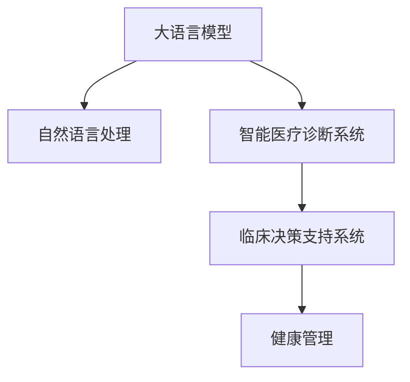

                 

# LLM在智能医疗诊断系统中的潜在作用

> 关键词：大语言模型(LLM),医疗诊断,自然语言处理(NLP),智能医疗,健康管理,临床决策支持系统

## 1. 背景介绍

### 1.1 问题由来

随着人工智能技术的快速发展，自然语言处理(NLP)和大语言模型(LLM)在医疗领域的应用前景愈发广阔。传统的医疗诊断依赖医生的个人经验和临床知识，容易受到主观偏见的影响，且难以兼顾患者的个性化需求。而基于大语言模型的智能医疗诊断系统，通过学习海量的医学文献和患者记录，能够辅助医生更快速、准确地进行诊断和治疗决策。

近年来，医学领域的研究和应用已经大量运用了NLP技术，如电子健康记录(EHR)分析、临床问答系统、医学影像分析等，但这些系统多聚焦于数据提取和信息检索，尚未能够深入理解复杂的医学逻辑和患者病情变化。而大语言模型具备强大的语义理解和生成能力，能够处理更加复杂的临床推理任务，为智能医疗诊断系统提供新的思路。

### 1.2 问题核心关键点

当前，智能医疗诊断系统在技术和应用上的核心关键点包括：

- **数据质量和量级**：用于训练大语言模型的医学数据必须标注准确、丰富多样，否则模型难以泛化。
- **临床知识融合**：模型需具备对临床知识的理解和应用能力，将医学理论、规则与实际病历结合，输出可靠诊断。
- **多模态融合**：结合影像、生化、基因等不同模态的数据，全面理解患者病情。
- **个性化服务**：针对不同患者的病情变化和历史记录，提供个性化诊断和治疗建议。
- **临床推理能力**：模型需具备基于医学知识进行因果推理和逻辑判断的能力，支持复杂的临床决策。

## 2. 核心概念与联系

### 2.1 核心概念概述

为更好地理解大语言模型在智能医疗诊断系统中的应用，本节将介绍几个核心概念：

- **大语言模型(LLM)**：指采用Transformer等先进架构预训练的语言模型，如GPT-3、BERT等，具备强大的语义理解和生成能力。
- **自然语言处理(NLP)**：使用计算机技术处理、分析和理解人类语言，包括文本分类、命名实体识别、情感分析等。
- **智能医疗诊断系统**：通过机器学习、自然语言处理等技术，辅助医生进行病历分析、诊断决策、治疗方案制定等，提升医疗服务质量和效率。
- **临床决策支持系统**：利用电子健康记录、医学数据库等数据，结合AI技术，为医生提供全面的决策支持，辅助医生进行临床决策。
- **健康管理**：通过智能穿戴设备、健康监测系统等，采集用户的生理数据和生活习惯，提供个性化的健康建议和管理。

这些核心概念之间的逻辑关系可以通过以下Mermaid流程图来展示：



这个流程图展示了大语言模型的核心概念及其与其他概念的联系：

1. 大语言模型通过预训练学习语言的通用表示。
2. 自然语言处理使模型能够理解、分析和处理医疗文本。
3. 智能医疗诊断系统利用大语言模型的语义理解能力，辅助医生进行诊断决策。
4. 临床决策支持系统通过大语言模型整合医疗数据，为医生提供全面的决策支持。
5. 健康管理领域的数据采集和分析也能借助大语言模型的处理能力。

## 3. 核心算法原理 & 具体操作步骤
### 3.1 算法原理概述

基于大语言模型的智能医疗诊断系统，其核心算法原理主要包括以下几个方面：

1. **数据预处理**：收集和清洗医疗数据，包括电子健康记录、临床文档、医学影像、基因数据等，生成大语言模型所需的标注数据。
2. **模型训练**：在标注数据上训练大语言模型，使其学习到医学领域的语言表示和知识结构。
3. **任务适配**：在预训练模型基础上，针对具体医疗诊断任务进行微调，如病历分析、症状诊断、治疗方案生成等。
4. **推理与输出**：使用微调后的模型，结合患者的具体症状、病史和影像数据，进行诊断推理和输出，提供辅助诊断结果和治疗建议。

### 3.2 算法步骤详解

以下是智能医疗诊断系统在大语言模型上的具体操作步骤：

**Step 1: 数据收集与预处理**

- 收集临床病例、电子健康记录、医学文献等医疗数据。
- 清洗数据，去除噪声和不相关的信息。
- 标注数据，如症状、诊断、治疗等，生成二元分类标签或其他形式的结构化标注。
- 对医疗数据进行数据增强，如数据扩充、格式转换、回译等，增加训练集的多样性。

**Step 2: 模型训练**

- 选择合适的预训练模型，如BERT、GPT-3等，并进行迁移学习。
- 将标注数据输入模型，进行有监督的微调。
- 使用AdamW、SGD等优化器，设置合适的学习率和批大小。
- 应用正则化技术，如L2正则、Dropout等，防止过拟合。

**Step 3: 任务适配与推理**

- 设计针对具体诊断任务的任务适配层，如分类、匹配等。
- 在微调过程中，动态生成推理路径，如逻辑推理、知识图谱查询等。
- 使用微调后的模型进行推理，输出诊断结果和治疗建议。
- 结合临床知识和专家经验，对模型的输出结果进行人工干预和校正。

### 3.3 算法优缺点

基于大语言模型的智能医疗诊断系统有以下优点：

1. **数据利用效率高**：大语言模型能够处理结构化和非结构化数据，充分利用医疗领域的数据资源。
2. **灵活适应性强**：模型能够适应不同领域和具体任务的微调，快速部署到实际应用中。
3. **临床知识融合**：模型能够整合医学理论和临床知识，提供可靠的诊断和治疗建议。
4. **个性化服务**：模型能够根据患者的个性化历史数据，提供针对性的健康建议。

然而，该方法也存在一些局限性：

1. **数据标注成本高**：标注高质量的医疗数据需要大量专业知识和人力投入，成本较高。
2. **模型解释性不足**：大语言模型的推理过程缺乏透明度，难以解释模型的诊断逻辑。
3. **知识偏见风险**：模型可能学习到训练数据中的偏见和错误，输出有误的诊断结果。
4. **多模态融合难度大**：不同模态的数据处理和融合需要复杂的技术手段，存在较大挑战。

### 3.4 算法应用领域

大语言模型在智能医疗诊断系统的应用领域主要包括：

1. **电子健康记录分析**：利用自然语言处理技术，对电子健康记录进行分析，提取和存储结构化信息，辅助医生诊断。
2. **临床问答系统**：回答医生和患者关于疾病、治疗等问题的查询，提供快速的临床信息检索服务。
3. **医学影像分析**：使用大语言模型进行图像描述和标注，辅助医生进行影像解读。
4. **症状诊断系统**：基于患者的描述和病史，利用大语言模型进行症状诊断，提出可能的疾病和诊断路径。
5. **治疗方案生成**：根据患者的病情和治疗历史，使用大语言模型生成个性化的治疗方案。
6. **临床决策支持**：结合患者的病历、影像、基因数据等，提供全面的临床决策支持。

此外，大语言模型还能在健康管理、预防保健、个性化咨询等领域发挥重要作用。

## 4. 数学模型和公式 & 详细讲解  
### 4.1 数学模型构建

在智能医疗诊断系统中，大语言模型主要负责文本的理解和分析。以一个简单的二分类任务为例，定义模型在输入$x$和标签$y$上的损失函数为：

$$
\mathcal{L}(\theta) = -\frac{1}{N}\sum_{i=1}^N [y_i\log \hat{y_i} + (1-y_i)\log (1-\hat{y_i})]
$$

其中，$\theta$为模型参数，$\hat{y_i}$为模型对样本$x_i$的预测概率。

在微调过程中，使用梯度下降等优化算法对模型参数进行更新，最小化损失函数：

$$
\theta \leftarrow \theta - \eta \nabla_{\theta}\mathcal{L}(\theta)
$$

其中，$\eta$为学习率，$\nabla_{\theta}\mathcal{L}(\theta)$为损失函数对参数$\theta$的梯度。

### 4.2 公式推导过程

以下是一个简单的二分类任务中，大语言模型的训练过程的数学推导。

假设模型对输入$x$的预测概率为$\hat{y}=M_{\theta}(x)$，真实标签为$y \in \{0,1\}$。则交叉熵损失函数为：

$$
\ell(M_{\theta}(x),y) = -[y\log \hat{y} + (1-y)\log (1-\hat{y})]
$$

将其代入经验风险公式，得：

$$
\mathcal{L}(\theta) = -\frac{1}{N}\sum_{i=1}^N [y_i\log M_{\theta}(x_i)+(1-y_i)\log(1-M_{\theta}(x_i))]
$$

根据链式法则，损失函数对参数$\theta_k$的梯度为：

$$
\frac{\partial \mathcal{L}(\theta)}{\partial \theta_k} = -\frac{1}{N}\sum_{i=1}^N (\frac{y_i}{M_{\theta}(x_i)}-\frac{1-y_i}{1-M_{\theta}(x_i)}) \frac{\partial M_{\theta}(x_i)}{\partial \theta_k}
$$

其中，$\frac{\partial M_{\theta}(x_i)}{\partial \theta_k}$可以进一步递归展开，利用自动微分技术完成计算。

### 4.3 案例分析与讲解

在智能医疗诊断系统的实际应用中，我们以症状诊断系统为例，进行详细分析。

假设已知症状描述$x$和实际诊断结果$y$，模型需要学习$x$到$y$的映射关系，即$M_{\theta}(x) \rightarrow y$。

假设模型对输入$x$的预测概率为$\hat{y}=M_{\theta}(x)$，则交叉熵损失函数为：

$$
\ell(M_{\theta}(x),y) = -[y\log \hat{y} + (1-y)\log (1-\hat{y})]
$$

将其代入经验风险公式，得：

$$
\mathcal{L}(\theta) = -\frac{1}{N}\sum_{i=1}^N [y_i\log M_{\theta}(x_i)+(1-y_i)\log(1-M_{\theta}(x_i))]
$$

在训练过程中，模型不断更新参数$\theta$，最小化经验风险，直至收敛。

假设模型在训练数据集上学习到了症状与疾病之间的映射关系，则模型对新的症状描述$x'$的预测结果$\hat{y}'=M_{\theta}(x')$可以用于诊断。若$\hat{y}'$与实际诊断结果$y'$一致，则说明模型能够正确诊断。

## 5. 项目实践：代码实例和详细解释说明
### 5.1 开发环境搭建

在进行智能医疗诊断系统的开发时，我们需要准备好开发环境。以下是使用Python进行PyTorch开发的环境配置流程：

1. 安装Anaconda：从官网下载并安装Anaconda，用于创建独立的Python环境。

2. 创建并激活虚拟环境：
```bash
conda create -n pytorch-env python=3.8 
conda activate pytorch-env
```

3. 安装PyTorch：根据CUDA版本，从官网获取对应的安装命令。例如：
```bash
conda install pytorch torchvision torchaudio cudatoolkit=11.1 -c pytorch -c conda-forge
```

4. 安装Transformers库：
```bash
pip install transformers
```

5. 安装各类工具包：
```bash
pip install numpy pandas scikit-learn matplotlib tqdm jupyter notebook ipython
```

完成上述步骤后，即可在`pytorch-env`环境中开始开发实践。

### 5.2 源代码详细实现

下面以一个简单的症状诊断系统为例，给出使用Transformers库对BERT模型进行微调的PyTorch代码实现。

首先，定义症状诊断任务的数据处理函数：

```python
from transformers import BertTokenizer
from torch.utils.data import Dataset
import torch

class SymptomDataset(Dataset):
    def __init__(self, texts, labels, tokenizer, max_len=128):
        self.texts = texts
        self.labels = labels
        self.tokenizer = tokenizer
        self.max_len = max_len
        
    def __len__(self):
        return len(self.texts)
    
    def __getitem__(self, item):
        text = self.texts[item]
        label = self.labels[item]
        
        encoding = self.tokenizer(text, return_tensors='pt', max_length=self.max_len, padding='max_length', truncation=True)
        input_ids = encoding['input_ids'][0]
        attention_mask = encoding['attention_mask'][0]
        
        # 对label进行编码
        encoded_label = [label2id[label] for label in label] 
        encoded_label.extend([label2id['None']] * (self.max_len - len(encoded_label)))
        labels = torch.tensor(encoded_label, dtype=torch.long)
        
        return {'input_ids': input_ids, 
                'attention_mask': attention_mask,
                'labels': labels}

# 标签与id的映射
label2id = {'Cough': 0, 'Fever': 1, 'Sore_Throat': 2, 'Shortness_Breath': 3}
id2label = {v: k for k, v in label2id.items()}

# 创建dataset
tokenizer = BertTokenizer.from_pretrained('bert-base-cased')

train_dataset = SymptomDataset(train_texts, train_labels, tokenizer)
dev_dataset = SymptomDataset(dev_texts, dev_labels, tokenizer)
test_dataset = SymptomDataset(test_texts, test_labels, tokenizer)
```

然后，定义模型和优化器：

```python
from transformers import BertForTokenClassification, AdamW

model = BertForTokenClassification.from_pretrained('bert-base-cased', num_labels=len(label2id))

optimizer = AdamW(model.parameters(), lr=2e-5)
```

接着，定义训练和评估函数：

```python
from torch.utils.data import DataLoader
from tqdm import tqdm
from sklearn.metrics import classification_report

device = torch.device('cuda') if torch.cuda.is_available() else torch.device('cpu')
model.to(device)

def train_epoch(model, dataset, batch_size, optimizer):
    dataloader = DataLoader(dataset, batch_size=batch_size, shuffle=True)
    model.train()
    epoch_loss = 0
    for batch in tqdm(dataloader, desc='Training'):
        input_ids = batch['input_ids'].to(device)
        attention_mask = batch['attention_mask'].to(device)
        labels = batch['labels'].to(device)
        model.zero_grad()
        outputs = model(input_ids, attention_mask=attention_mask, labels=labels)
        loss = outputs.loss
        epoch_loss += loss.item()
        loss.backward()
        optimizer.step()
    return epoch_loss / len(dataloader)

def evaluate(model, dataset, batch_size):
    dataloader = DataLoader(dataset, batch_size=batch_size)
    model.eval()
    preds, labels = [], []
    with torch.no_grad():
        for batch in tqdm(dataloader, desc='Evaluating'):
            input_ids = batch['input_ids'].to(device)
            attention_mask = batch['attention_mask'].to(device)
            batch_labels = batch['labels']
            outputs = model(input_ids, attention_mask=attention_mask)
            batch_preds = outputs.logits.argmax(dim=2).to('cpu').tolist()
            batch_labels = batch_labels.to('cpu').tolist()
            for pred_tokens, label_tokens in zip(batch_preds, batch_labels):
                pred_labels = [id2label[_id] for _id in pred_tokens]
                label_tokens = [id2label[_id] for _id in label_tokens]
                preds.append(pred_labels[:len(label_tokens)])
                labels.append(label_tokens)
                
    print(classification_report(labels, preds))
```

最后，启动训练流程并在测试集上评估：

```python
epochs = 5
batch_size = 16

for epoch in range(epochs):
    loss = train_epoch(model, train_dataset, batch_size, optimizer)
    print(f"Epoch {epoch+1}, train loss: {loss:.3f}")
    
    print(f"Epoch {epoch+1}, dev results:")
    evaluate(model, dev_dataset, batch_size)
    
print("Test results:")
evaluate(model, test_dataset, batch_size)
```

以上就是使用PyTorch对BERT进行症状诊断任务微调的完整代码实现。可以看到，得益于Transformers库的强大封装，我们可以用相对简洁的代码完成BERT模型的加载和微调。

### 5.3 代码解读与分析

让我们再详细解读一下关键代码的实现细节：

**SymptomDataset类**：
- `__init__`方法：初始化文本、标签、分词器等关键组件。
- `__len__`方法：返回数据集的样本数量。
- `__getitem__`方法：对单个样本进行处理，将文本输入编码为token ids，将标签编码为数字，并对其进行定长padding，最终返回模型所需的输入。

**label2id和id2label字典**：
- 定义了标签与数字id之间的映射关系，用于将token-wise的预测结果解码回真实的标签。

**训练和评估函数**：
- 使用PyTorch的DataLoader对数据集进行批次化加载，供模型训练和推理使用。
- 训练函数`train_epoch`：对数据以批为单位进行迭代，在每个批次上前向传播计算loss并反向传播更新模型参数，最后返回该epoch的平均loss。
- 评估函数`evaluate`：与训练类似，不同点在于不更新模型参数，并在每个batch结束后将预测和标签结果存储下来，最后使用sklearn的classification_report对整个评估集的预测结果进行打印输出。

**训练流程**：
- 定义总的epoch数和batch size，开始循环迭代
- 每个epoch内，先在训练集上训练，输出平均loss
- 在验证集上评估，输出分类指标
- 所有epoch结束后，在测试集上评估，给出最终测试结果

可以看到，PyTorch配合Transformers库使得BERT微调的代码实现变得简洁高效。开发者可以将更多精力放在数据处理、模型改进等高层逻辑上，而不必过多关注底层的实现细节。

当然，工业级的系统实现还需考虑更多因素，如模型的保存和部署、超参数的自动搜索、更灵活的任务适配层等。但核心的微调范式基本与此类似。

## 6. 实际应用场景
### 6.1 智能医疗诊断系统

基于大语言模型的智能医疗诊断系统，已经在临床实践中逐渐显示出其巨大价值。传统医疗诊断依赖医生的个人经验和临床知识，容易受到主观偏见的影响，且难以兼顾患者的个性化需求。而大语言模型具备强大的语义理解和生成能力，能够辅助医生进行快速、准确的诊断。

在实际应用中，系统通常结合医生的诊断知识和经验，对患者的症状进行综合分析，生成可能的疾病诊断路径和预测结果。医生根据系统的输出建议，结合自己的判断进行最终的诊断决策。同时，系统还可以提供个性化的治疗方案和用药建议，为患者提供全面的健康管理服务。

### 6.2 电子健康记录分析

电子健康记录(EHR)是医疗信息的重要来源，但其格式多样、结构复杂，难以直接应用于临床决策。通过大语言模型对EHR进行分析和理解，可以提取出有用的医疗信息，辅助医生进行诊断和治疗决策。

具体而言，大语言模型可以解析EHR中的文本信息，提取关键事件、疾病、治疗等信息，生成结构化数据。这些数据可以用于生成病人的医疗档案，辅助医生对病人进行长期跟踪和管理。同时，系统还可以自动生成病历摘要，提高医生的工作效率。

### 6.3 临床问答系统

临床问答系统能够提供即时的医疗信息查询服务，帮助医生快速获取临床知识，提高诊断准确率。系统通常将医学文献、诊疗指南、临床试验等信息进行预训练，并结合实际临床数据进行微调。

在实际应用中，医生可以通过系统查询特定的临床问题，如疾病诊断、治疗方案等。系统则根据医生的查询，快速检索相关的医学知识和临床数据，提供详细的回答和解释。这种高效的信息检索服务，极大地提高了医生的工作效率，促进了医疗服务的智能化和规范化。

### 6.4 未来应用展望

随着大语言模型的不断演进，其在智能医疗诊断系统中的应用将更加广泛和深入。未来，我们可以期待以下几个方向的发展：

1. **跨领域知识融合**：系统能够整合不同领域（如生物、化学、物理等）的知识，提供更加全面的临床决策支持。
2. **多模态数据处理**：系统能够处理多种类型的数据（如影像、基因、传感器等），全面理解患者的健康状况。
3. **个性化健康管理**：系统能够结合患者的基因信息、生活习惯、社会经济状况等多方面数据，提供个性化的健康管理方案。
4. **智能病历生成**：系统能够自动生成高精度的病历摘要，减少医生的书写负担，提高病历质量。
5. **实时监测与预警**：系统能够实时监测患者的生理参数和健康状态，提供及时的预警和干预措施。
6. **远程医疗支持**：系统能够支持远程医疗咨询，提供优质的医疗服务，缓解医疗资源的不足。

这些方向的发展将使智能医疗诊断系统更加智能化、人性化，为医疗服务带来革命性的变革。

## 7. 工具和资源推荐
### 7.1 学习资源推荐

为了帮助开发者系统掌握大语言模型在智能医疗诊断系统中的应用，这里推荐一些优质的学习资源：

1. 《Transformers: From Machine Learning to Deep Learning》系列博文：由大模型技术专家撰写，深入浅出地介绍了Transformer原理、BERT模型、微调技术等前沿话题。

2. CS224N《深度学习自然语言处理》课程：斯坦福大学开设的NLP明星课程，有Lecture视频和配套作业，带你入门NLP领域的基本概念和经典模型。

3. 《Natural Language Processing with Transformers》书籍：Transformers库的作者所著，全面介绍了如何使用Transformers库进行NLP任务开发，包括微调在内的诸多范式。

4. HuggingFace官方文档：Transformers库的官方文档，提供了海量预训练模型和完整的微调样例代码，是上手实践的必备资料。

5. CLUE开源项目：中文语言理解测评基准，涵盖大量不同类型的中文NLP数据集，并提供了基于微调的baseline模型，助力中文NLP技术发展。

通过对这些资源的学习实践，相信你一定能够快速掌握大语言模型在智能医疗诊断系统中的应用精髓，并用于解决实际的医疗问题。
### 7.2 开发工具推荐

高效的开发离不开优秀的工具支持。以下是几款用于大语言模型微调开发的常用工具：

1. PyTorch：基于Python的开源深度学习框架，灵活动态的计算图，适合快速迭代研究。大部分预训练语言模型都有PyTorch版本的实现。

2. TensorFlow：由Google主导开发的开源深度学习框架，生产部署方便，适合大规模工程应用。同样有丰富的预训练语言模型资源。

3. Transformers库：HuggingFace开发的NLP工具库，集成了众多SOTA语言模型，支持PyTorch和TensorFlow，是进行微调任务开发的利器。

4. Weights & Biases：模型训练的实验跟踪工具，可以记录和可视化模型训练过程中的各项指标，方便对比和调优。与主流深度学习框架无缝集成。

5. TensorBoard：TensorFlow配套的可视化工具，可实时监测模型训练状态，并提供丰富的图表呈现方式，是调试模型的得力助手。

6. Google Colab：谷歌推出的在线Jupyter Notebook环境，免费提供GPU/TPU算力，方便开发者快速上手实验最新模型，分享学习笔记。

合理利用这些工具，可以显著提升大语言模型在智能医疗诊断系统中的应用开发效率，加快创新迭代的步伐。

### 7.3 相关论文推荐

大语言模型在智能医疗诊断系统的应用源于学界的持续研究。以下是几篇奠基性的相关论文，推荐阅读：

1. Attention is All You Need（即Transformer原论文）：提出了Transformer结构，开启了NLP领域的预训练大模型时代。

2. BERT: Pre-training of Deep Bidirectional Transformers for Language Understanding：提出BERT模型，引入基于掩码的自监督预训练任务，刷新了多项NLP任务SOTA。

3. Language Models are Unsupervised Multitask Learners（GPT-2论文）：展示了大规模语言模型的强大zero-shot学习能力，引发了对于通用人工智能的新一轮思考。

4. Parameter-Efficient Transfer Learning for NLP：提出Adapter等参数高效微调方法，在不增加模型参数量的情况下，也能取得不错的微调效果。

5. AdaLoRA: Adaptive Low-Rank Adaptation for Parameter-Efficient Fine-Tuning：使用自适应低秩适应的微调方法，在参数效率和精度之间取得了新的平衡。

这些论文代表了大语言模型在智能医疗诊断系统中的应用研究的发展脉络。通过学习这些前沿成果，可以帮助研究者把握学科前进方向，激发更多的创新灵感。

## 8. 总结：未来发展趋势与挑战

### 8.1 总结

本文对基于大语言模型的智能医疗诊断系统进行了全面系统的介绍。首先阐述了大语言模型和微调技术在医疗诊断系统中的应用背景和意义，明确了微调在拓展预训练模型应用、提升诊断精度和效率方面的独特价值。其次，从原理到实践，详细讲解了监督微调的数学原理和关键步骤，给出了智能医疗诊断系统在大语言模型上的具体实现。同时，本文还广泛探讨了智能医疗诊断系统在电子健康记录分析、临床问答系统、医学影像分析等多个实际应用场景中的前景，展示了大语言模型在医疗领域的巨大潜力。

通过本文的系统梳理，可以看到，基于大语言模型的智能医疗诊断系统在医疗服务的智能化、精准化、个性化方面具备广阔的应用前景，能够显著提升医疗服务的效率和质量。未来，伴随预训练语言模型和微调方法的不断进步，相信智能医疗诊断系统必将在医疗行业带来深刻的变革。

### 8.2 未来发展趋势

展望未来，大语言模型在智能医疗诊断系统中的应用将呈现以下几个发展趋势：

1. **数据规模和质量**：随着医疗数据量的增加和数据质量的提升，大语言模型的预训练和微调效果将进一步提升。
2. **多模态融合能力**：系统将能够处理多种类型的数据（如影像、基因、传感器等），全面理解患者的健康状况。
3. **个性化健康管理**：系统能够结合患者的基因信息、生活习惯、社会经济状况等多方面数据，提供个性化的健康管理方案。
4. **实时监测与预警**：系统能够实时监测患者的生理参数和健康状态，提供及时的预警和干预措施。
5. **跨领域知识融合**：系统能够整合不同领域（如生物、化学、物理等）的知识，提供更加全面的临床决策支持。
6. **智能病历生成**：系统能够自动生成高精度的病历摘要，减少医生的书写负担，提高病历质量。

这些趋势将使智能医疗诊断系统更加智能化、人性化，为医疗服务带来革命性的变革。

### 8.3 面临的挑战

尽管大语言模型在智能医疗诊断系统中的应用前景广阔，但在迈向更加智能化、普适化应用的过程中，它仍面临诸多挑战：

1. **数据标注成本高**：标注高质量的医疗数据需要大量专业知识和人力投入，成本较高。
2. **模型鲁棒性不足**：模型可能学习到训练数据中的偏见和错误，输出有误的诊断结果。
3. **知识偏见风险**：模型可能学习到预训练数据中的偏见和错误，输出有误的诊断结果。
4. **多模态融合难度大**：不同模态的数据处理和融合需要复杂的技术手段，存在较大挑战。
5. **模型解释性不足**：大语言模型的推理过程缺乏透明度，难以解释模型的诊断逻辑。
6. **伦理与安全问题**：模型输出可能含有歧视性或有害信息，给实际应用带来安全隐患。

### 8.4 研究展望

面对大语言模型在智能医疗诊断系统中的应用所面临的挑战，未来的研究需要在以下几个方面寻求新的突破：

1. **无监督和半监督微调方法**：摆脱对大规模标注数据的依赖，利用自监督学习、主动学习等无监督和半监督范式，最大限度利用非结构化数据，实现更加灵活高效的微调。
2. **多模态数据融合技术**：开发更加高效的多模态数据融合方法，提高系统对不同类型数据处理的能力。
3. **参数高效与计算高效微调方法**：开发更加参数高效的微调方法，在固定大部分预训练参数的情况下，只更新极少量的任务相关参数。
4. **多领域知识融合**：将不同领域的知识与大语言模型进行融合，提升系统的跨领域迁移能力。
5. **因果分析与逻辑推理**：将因果分析方法引入大语言模型，增强模型的因果推理能力，提供更加可靠的诊断结果。
6. **知识库与规则融合**：将知识库、规则库等专家知识与大语言模型进行结合，提升系统的知识整合能力。
7. **伦理与安全性**：在大语言模型的训练和应用中，引入伦理导向的评估指标，过滤和惩罚有害的输出倾向，确保系统的安全性和可解释性。

这些研究方向将推动大语言模型在智能医疗诊断系统中的应用迈向更高的台阶，为医疗服务的智能化和精准化提供坚实的基础。相信随着技术的不断进步，大语言模型在医疗领域的应用将愈发广泛和深入，为人类健康带来更多的福祉。

## 9. 附录：常见问题与解答

**Q1：大语言模型在智能医疗诊断系统中的应用存在哪些局限性？**

A: 大语言模型在智能医疗诊断系统中的应用存在以下局限性：

1. **数据标注成本高**：标注高质量的医疗数据需要大量专业知识和人力投入，成本较高。
2. **模型鲁棒性不足**：模型可能学习到训练数据中的偏见和错误，输出有误的诊断结果。
3. **知识偏见风险**：模型可能学习到预训练数据中的偏见和错误，输出有误的诊断结果。
4. **多模态融合难度大**：不同模态的数据处理和融合需要复杂的技术手段，存在较大挑战。
5. **模型解释性不足**：大语言模型的推理过程缺乏透明度，难以解释模型的诊断逻辑。
6. **伦理与安全问题**：模型输出可能含有歧视性或有害信息，给实际应用带来安全隐患。

**Q2：如何提高大语言模型在智能医疗诊断系统中的泛化能力？**

A: 提高大语言模型在智能医疗诊断系统中的泛化能力，可以从以下几个方面入手：

1. **数据增强**：通过回译、数据扩充等方式增加训练集的多样性，减少模型对特定数据分布的过拟合。
2. **正则化**：使用L2正则、Dropout等正则化技术，避免模型在训练过程中过度拟合。
3. **多领域知识融合**：将不同领域的知识与大语言模型进行融合，提升模型的跨领域泛化能力。
4. **因果分析**：引入因果分析方法，增强模型的因果推理能力，提供更加可靠的诊断结果。
5. **对抗训练**：引入对抗样本，提高模型的鲁棒性和泛化能力。

**Q3：智能医疗诊断系统如何与电子健康记录(EHR)系统进行集成？**

A: 智能医疗诊断系统与电子健康记录(EHR)系统进行集成，可以通过以下几个步骤实现：

1. **数据收集**：从EHR系统中提取病人的电子健康记录，包括病历、实验室检查结果、影像数据等。
2. **数据预处理**：清洗和转换数据，使其符合智能医疗诊断系统所需的格式。
3. **数据标注**：根据医生的诊断结果，对数据进行标注，生成二元分类标签或其他形式的结构化标注。
4. **模型训练**：在标注数据上训练大语言模型，使其学习到医学领域的语言表示和知识结构。
5. **任务适配**：设计针对具体诊断任务的任务适配层，如分类、匹配等。
6. **推理与输出**：使用微调后的模型，结合病人的当前症状、病史和影像数据，进行诊断推理和输出，提供辅助诊断结果和治疗建议。

**Q4：智能医疗诊断系统如何结合多模态数据进行综合分析？**

A: 智能医疗诊断系统结合多模态数据进行综合分析，可以通过以下几个步骤实现：

1. **数据收集**：从不同来源收集病人的多模态数据，包括影像、基因、生化等。
2. **数据预处理**：对不同类型的数据进行格式转换和标准化，使其能够被大语言模型进行处理。
3. **数据融合**：将多模态数据进行融合，生成综合的病人特征向量，供模型进行分析和推理。
4. **模型训练**：在融合后的多模态数据上训练大语言模型，使其能够理解多模态信息，生成综合的诊断结果。
5. **推理与输出**：使用微调后的模型，结合病人的当前症状、病史和影像数据，进行诊断推理和输出，提供辅助诊断结果和治疗建议。

总之，智能医疗诊断系统通过多模态数据融合，可以更加全面和准确地理解病人的健康状况，提供更加个性化和精准的诊断和治疗方案。

---

作者：禅与计算机程序设计艺术 / Zen and the Art of Computer Programming

