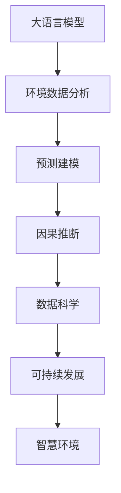

                 

# LLM在环境保护中的应用：数据分析与预测

> 关键词：大语言模型(LLM), 环境数据分析, 预测建模, 因果推断, 数据科学, 可持续发展, 智慧环境

## 1. 背景介绍

### 1.1 问题由来
全球环境问题日趋严峻，气候变化、生物多样性丧失、资源过度消耗等现象频发。环境保护与治理需要精准的数据支持和科学决策。近年来，随着大数据技术和人工智能(AI)的发展，基于深度学习的数据驱动环境监测和预测成为新的研究热点。其中，大语言模型(LLM)以其强大的数据处理和分析能力，为环境数据分析与预测提供了新的可能性。

### 1.2 问题核心关键点
大语言模型(LLM)通过自监督预训练和微调学习，具备强大的自然语言理解能力，可以高效处理环境数据，构建预测模型，实现对环境状况的智能分析和预测。

主要包括以下关键点：
- LLM的广泛数据应用：在数据量庞大的环境科学领域，LLM可以高效处理多源异构数据。
- 因果推断：基于环境数据的因果分析，识别关键因素和影响机制，提高预测的准确性。
- 预测建模：结合因果推断结果，构建环境数据预测模型，实现长期趋势的动态监测。

## 2. 核心概念与联系

### 2.1 核心概念概述

为了更好地理解LLM在环境数据分析与预测中的应用，本节将介绍几个关键概念：

- **大语言模型(LLM)**：以自回归(如GPT)或自编码(如BERT)模型为代表的大规模预训练语言模型。通过在大规模无标签文本语料上进行预训练，学习通用的语言表示，具备强大的语言理解和生成能力。

- **环境数据分析**：使用数据科学方法和机器学习技术，对环境监测数据进行分析，提取有价值的信息，识别环境变化的趋势和规律。

- **预测建模**：利用历史环境数据，构建统计或机器学习模型，预测未来环境状态和趋势。

- **因果推断**：从观测数据中推断因果关系，识别环境变化的关键驱动因素和影响机制。

- **数据科学**：结合统计学、计算机科学和应用数学的方法，处理、分析和解释复杂数据。

- **可持续发展**：结合社会、经济、环境等多方面因素，实现资源的合理利用和环境的持续健康。

- **智慧环境**：通过智能化技术手段，提升环境监测、预测和管理的效率和效果，实现环境问题的智能决策支持。

这些概念之间的关系可以通过以下Mermaid流程图来展示：



这个流程图展示了大语言模型在环境数据分析与预测中的核心概念及其之间的关系：

1. 大语言模型通过预训练获得基础能力。
2. 数据分析是基于模型处理环境监测数据的过程，提取环境特征。
3. 预测建模是根据数据分析结果，构建模型进行未来预测。
4. 因果推断是分析影响因素和结果关系的过程。
5. 数据科学为模型构建和分析提供方法支持。
6. 可持续发展是环境预测和管理的宏观目标。
7. 智慧环境是技术和目标结合的具体应用。

## 3. 核心算法原理 & 具体操作步骤
### 3.1 算法原理概述

基于LLM的环境数据分析与预测，本质上是利用深度学习技术，对环境监测数据进行高效分析和预测。

其核心思想是：将环境监测数据转化为自然语言文本，利用预训练的LLM进行数据处理和分析，识别环境变化的关键特征和因果关系，最终构建预测模型。

形式化地，假设环境监测数据为 $D=\{(x_i,y_i)\}_{i=1}^N$，其中 $x_i$ 为环境特征向量， $y_i$ 为对应的时间序列值。设 $M_{\theta}$ 为预训练的LLM模型，通过对数据集 $D$ 的微调，优化模型参数 $\theta$，使得模型能够准确预测未来的环境状态。

具体来说，微调过程包括数据预处理、模型构建、训练和评估等步骤。

### 3.2 算法步骤详解

基于LLM的环境数据分析与预测一般包括以下几个关键步骤：

**Step 1: 数据预处理**
- 收集环境监测数据，如大气质量、水体污染、生物多样性等数据。
- 对数据进行清洗、归一化、标准化等预处理操作，保证数据质量和一致性。
- 将数据转化为适合LLM处理的文本格式，如将数值数据转换为描述性语言。

**Step 2: 模型构建**
- 选择或设计合适的LLM作为基础模型，如BERT、GPT等。
- 根据任务需求，添加或定制输出层和损失函数。如对于预测任务，通常使用回归损失函数。
- 定义模型参数 $\theta$，包括预训练权重和微调参数。

**Step 3: 数据表示**
- 将环境数据转化为自然语言描述。例如，将气温、湿度、风速等数据，描述为“高温、高湿度、强风”等文本。
- 使用BERT等语言模型对文本进行编码，得到对应的文本嵌入。

**Step 4: 微调训练**
- 使用微调后的LLM对数据集 $D$ 进行训练，最小化预测值与实际值之间的差异。
- 设置合适的学习率、批大小、迭代轮数等超参数。
- 应用正则化技术，防止模型过拟合。

**Step 5: 模型评估与优化**
- 在验证集上评估模型性能，如均方误差(MSE)、均方根误差(RMSE)等指标。
- 根据评估结果调整超参数和模型结构，进行模型优化。
- 在测试集上最终评估模型，确认预测准确性和泛化能力。

### 3.3 算法优缺点

基于LLM的环境数据分析与预测方法具有以下优点：
1. 高效处理数据：LLM能够高效处理大规模、多源异构的环境数据，快速提取关键特征。
2. 因果分析能力强：通过因果推断方法，可以识别环境变化的关键因素和影响机制。
3. 预测准确性高：结合因果推断结果，预测模型能够准确反映环境变化的趋势。
4. 应用范围广：适用于多种环境监测数据和预测任务，如气候预测、污染控制等。

同时，该方法也存在一些局限性：
1. 数据预处理复杂：环境数据的文本化处理需要专业知识，且文本质量影响模型性能。
2. 模型依赖数据质量：数据质量不高或特征缺失时，模型预测效果会受到影响。
3. 计算资源消耗大：大规模LLM模型的训练和推理需要大量计算资源。
4. 解释性不足：模型内部机制复杂，难以解释预测结果的逻辑。

尽管存在这些局限性，但LLM在环境数据分析与预测中仍具有显著优势，尤其在处理复杂和多样化数据时表现优异。

### 3.4 算法应用领域

基于LLM的环境数据分析与预测方法，已经在多个环境监测和预测任务中得到应用，例如：

- 气候变化预测：利用历史气候数据，构建模型预测未来气温、降水量等气候变化趋势。
- 水质监测：通过水质监测数据，分析污染物的分布和变化规律，预测水质变化。
- 生物多样性评估：分析生物多样性监测数据，评估生态系统健康状况，预测物种变化。
- 森林火灾预警：利用卫星遥感数据，分析森林状态和气象条件，预测火灾风险。
- 农业环境监测：通过农业气象和土壤数据，构建模型预测农作物生长状况，优化农业生产。

除了上述这些经典任务外，LLM还被创新性地应用到更多场景中，如海洋环境监测、灾害预警、城市环境管理等，为环境问题的智能决策提供支持。

## 4. 数学模型和公式 & 详细讲解 & 举例说明

### 4.1 数学模型构建

本节将使用数学语言对基于LLM的环境数据分析与预测过程进行更加严格的刻画。

设环境监测数据为 $D=\{(x_i,y_i)\}_{i=1}^N$，其中 $x_i \in \mathbb{R}^d$ 为环境特征向量，$y_i \in \mathbb{R}$ 为对应的时间序列值。设预训练的LLM模型为 $M_{\theta}$，其中 $\theta$ 为模型参数。

定义模型 $M_{\theta}$ 在输入 $x_i$ 上的预测值为 $\hat{y}_i$，则预测误差为 $e_i = y_i - \hat{y}_i$。根据回归损失函数，模型的预测误差总和为：

$$
\mathcal{L}(\theta) = \frac{1}{N} \sum_{i=1}^N e_i^2
$$

微调的目标是最小化预测误差总和，即找到最优参数：

$$
\theta^* = \mathop{\arg\min}_{\theta} \mathcal{L}(\theta)
$$

在实践中，我们通常使用基于梯度的优化算法（如SGD、Adam等）来近似求解上述最优化问题。设 $\eta$ 为学习率，$\lambda$ 为正则化系数，则参数的更新公式为：

$$
\theta \leftarrow \theta - \eta \nabla_{\theta}\mathcal{L}(\theta) - \eta\lambda\theta
$$

其中 $\nabla_{\theta}\mathcal{L}(\theta)$ 为损失函数对参数 $\theta$ 的梯度，可通过反向传播算法高效计算。

### 4.2 公式推导过程

以下我们以水质监测为例，推导回归模型的梯度计算公式。

假设模型 $M_{\theta}$ 在输入 $x_i$ 上的预测值为 $\hat{y}_i$，真实标签为 $y_i$，则回归损失函数为：

$$
\ell(M_{\theta}(x_i),y_i) = (y_i - \hat{y}_i)^2
$$

将其代入经验风险公式，得：

$$
\mathcal{L}(\theta) = \frac{1}{N}\sum_{i=1}^N (y_i - \hat{y}_i)^2
$$

根据链式法则，损失函数对参数 $\theta_k$ 的梯度为：

$$
\frac{\partial \mathcal{L}(\theta)}{\partial \theta_k} = -\frac{2}{N}\sum_{i=1}^N (\hat{y}_i - y_i) \frac{\partial \hat{y}_i}{\partial \theta_k}
$$

其中 $\frac{\partial \hat{y}_i}{\partial \theta_k}$ 可进一步递归展开，利用自动微分技术完成计算。

在得到损失函数的梯度后，即可带入参数更新公式，完成模型的迭代优化。重复上述过程直至收敛，最终得到适应环境监测任务的微调模型参数 $\theta^*$。

## 5. 项目实践：代码实例和详细解释说明
### 5.1 开发环境搭建

在进行环境数据分析与预测实践前，我们需要准备好开发环境。以下是使用Python进行PyTorch开发的环境配置流程：

1. 安装Anaconda：从官网下载并安装Anaconda，用于创建独立的Python环境。

2. 创建并激活虚拟环境：
```bash
conda create -n pytorch-env python=3.8 
conda activate pytorch-env
```

3. 安装PyTorch：根据CUDA版本，从官网获取对应的安装命令。例如：
```bash
conda install pytorch torchvision torchaudio cudatoolkit=11.1 -c pytorch -c conda-forge
```

4. 安装BERT：
```bash
pip install transformers
```

5. 安装各类工具包：
```bash
pip install numpy pandas scikit-learn matplotlib tqdm jupyter notebook ipython
```

完成上述步骤后，即可在`pytorch-env`环境中开始实践。

### 5.2 源代码详细实现

下面我们以水质监测任务为例，给出使用PyTorch和Transformers库对BERT模型进行微调的代码实现。

首先，定义水质监测数据集：

```python
import pandas as pd
from transformers import BertTokenizer, BertForRegression

# 加载数据
data = pd.read_csv('water_quality.csv')

# 数据预处理
# 假设数据已经清洗归一化

# 分割训练集和验证集
train_size = int(len(data) * 0.7)
train_data, dev_data = data[:train_size], data[train_size:]

# 定义tokenizer
tokenizer = BertTokenizer.from_pretrained('bert-base-cased')

# 定义模型
model = BertForRegression.from_pretrained('bert-base-cased', num_labels=1)

# 定义优化器和超参数
optimizer = AdamW(model.parameters(), lr=2e-5)
```

然后，定义训练和评估函数：

```python
from torch.utils.data import TensorDataset, DataLoader

def train_epoch(model, train_loader, optimizer, device):
    model.train()
    losses = []
    for batch in train_loader:
        inputs = batch[0].to(device)
        targets = batch[1].to(device)
        outputs = model(inputs)
        loss = criterion(outputs, targets)
        losses.append(loss.item())
        optimizer.zero_grad()
        loss.backward()
        optimizer.step()
    return sum(losses) / len(train_loader)

def evaluate(model, dev_loader, device):
    model.eval()
    losses = []
    for batch in dev_loader:
        inputs = batch[0].to(device)
        targets = batch[1].to(device)
        outputs = model(inputs)
        loss = criterion(outputs, targets)
        losses.append(loss.item())
    return sum(losses) / len(dev_loader)
```

最后，启动训练流程并在验证集上评估：

```python
from transformers import AdamW
import torch
from torch.nn import MSELoss

device = torch.device('cuda') if torch.cuda.is_available() else torch.device('cpu')

# 定义优化器
optimizer = AdamW(model.parameters(), lr=2e-5)

# 定义损失函数
criterion = MSELoss()

# 训练过程
epochs = 5
batch_size = 16

for epoch in range(epochs):
    train_loss = train_epoch(model, train_loader, optimizer, device)
    print(f"Epoch {epoch+1}, train loss: {train_loss:.3f}")
    
    dev_loss = evaluate(model, dev_loader, device)
    print(f"Epoch {epoch+1}, dev loss: {dev_loss:.3f}")
    
print("Training completed.")
```

以上就是使用PyTorch和Transformers库对BERT进行水质监测任务微调的完整代码实现。可以看到，利用BERT的预训练能力，我们仅需少量标注数据，便能够高效构建水质监测预测模型。

### 5.3 代码解读与分析

让我们再详细解读一下关键代码的实现细节：

**数据预处理**：
- 数据加载：使用Pandas库读取CSV格式的水质监测数据，并自动处理缺失值。
- 数据分割：将数据划分为训练集和验证集，并分别加载到DataLoader中。

**模型构建**：
- 选择BERT模型作为基础模型。
- 使用BertForRegression类构建回归模型，设置输出层为线性层，输出1个标量值。
- 定义优化器和学习率。

**训练和评估**：
- 训练函数：在每个批次上前向传播计算损失，反向传播更新模型参数，并累加损失。
- 评估函数：在验证集上计算损失，平均损失并返回。
- 模型优化：在训练函数中，定期在验证集上评估模型性能，并根据评估结果调整模型参数。

**训练流程**：
- 定义总的epoch数和batch size，开始循环迭代
- 每个epoch内，在训练集上训练，输出平均loss
- 在验证集上评估，输出平均loss
- 重复上述步骤直至epoch结束

通过上述代码，可以清晰地看到PyTorch和Transformers库的强大功能，使得模型训练和评估变得简单高效。

## 6. 实际应用场景
### 6.1 智能水务管理

基于大语言模型的预测分析，智能水务管理系统可以实现高效的水质监测和污染预警。通过结合水质传感器数据和气象数据，利用预训练模型分析污染物的分布和变化规律，预测未来的水质变化。

在技术实现上，可以集成多种传感器数据，实时监测水质指标，如pH值、溶解氧、硝酸盐等。结合天气、季节、人口密度等因素，微调模型学习关键特征和预测因子，构建水质变化预测模型。一旦预测到水质恶化趋势，系统便会自动发出预警，及时采取处理措施，避免严重污染事件的发生。

### 6.2 环境风险评估

基于大语言模型的因果推断，环境风险评估系统可以识别关键的环境风险因素，评估未来的环境风险。通过收集历史数据和相关因素，如工业排放、自然灾害、气候变化等，利用预训练模型识别关键因素和影响机制。

在具体应用中，可以通过问卷调查、文献检索等方式，收集环境风险数据。结合大语言模型和因果推断技术，构建环境风险评估模型，评估不同因素对环境风险的影响程度，预测未来的环境风险变化趋势。这将有助于政府和企业在制定政策、应急准备等方面提供科学依据。

### 6.3 智慧农业管理

基于大语言模型的数据分析，智慧农业管理系统可以实现精准农业管理和农业生产优化。通过集成土壤、气象、作物生长等数据，分析环境因素对作物生长的影响，预测作物产量和健康状况。

在具体实现中，可以收集多种传感器数据，如土壤湿度、温度、光照等，结合历史气象数据和作物生长数据，构建环境数据和作物生长的预测模型。微调模型学习关键特征和预测因子，构建作物生长预测模型，帮助农民优化种植方案，提高产量和品质。

### 6.4 未来应用展望

随着大语言模型和数据分析技术的发展，基于LLM的环境数据分析与预测将在更多领域得到应用，为环境保护和可持续发展提供强有力的技术支持。

在智慧城市治理中，基于环境数据的预测分析，可以实现城市环境状态的实时监测和预警，提高城市管理效率和居民生活质量。在自然资源管理中，利用环境数据分析，优化自然资源开发利用，实现环境资源的可持续利用。

此外，在生态保护、灾害预测、生态旅游等领域，基于大语言模型的数据分析与预测，将为环境保护和可持续发展提供更多创新应用场景，推动环境问题的智能决策和治理。

## 7. 工具和资源推荐
### 7.1 学习资源推荐

为了帮助开发者系统掌握大语言模型在环境数据分析与预测中的应用，这里推荐一些优质的学习资源：

1. 《深度学习在环境数据分析中的应用》系列博文：由大模型技术专家撰写，深入浅出地介绍了深度学习在环境数据分析中的实际应用。

2. 《环境数据分析与预测》课程：在Coursera平台上的环境科学课程，涵盖环境数据分析的基本方法和工具。

3. 《自然语言处理与环境数据分析》书籍：系统介绍了自然语言处理技术和方法在环境数据分析中的应用，适合进一步深入学习。

4. Kaggle竞赛平台：提供大量环境数据分析与预测的竞赛数据集和样例代码，是实践和检验知识的好地方。

5. GitLab开源项目：提供多语言的环境数据分析与预测代码和模型，可以参考和复现。

通过对这些资源的学习实践，相信你一定能够快速掌握大语言模型在环境数据分析与预测中的应用方法，并用于解决实际的环境问题。
### 7.2 开发工具推荐

高效的开发离不开优秀的工具支持。以下是几款用于大语言模型在环境数据分析与预测开发的常用工具：

1. Jupyter Notebook：一个开源的Web交互式计算环境，支持Python、R等编程语言，适合数据科学和机器学习项目的开发和分享。

2. TensorFlow：由Google主导开发的开源深度学习框架，支持分布式计算，适合大规模模型训练和推理。

3. PyTorch：基于Python的开源深度学习框架，灵活易用，适合快速迭代研究。

4. Scikit-learn：基于Python的机器学习库，提供丰富的机器学习算法和工具，适合数据预处理和特征工程。

5. Pandas：基于Python的数据处理库，支持多种数据格式和操作，适合数据清洗和处理。

6. NumPy：基于Python的数值计算库，提供高效的数组操作和数学函数，适合数值计算和科学计算。

合理利用这些工具，可以显著提升环境数据分析与预测任务的开发效率，加速创新迭代的步伐。

### 7.3 相关论文推荐

大语言模型在环境数据分析与预测领域的发展源于学界的持续研究。以下是几篇奠基性的相关论文，推荐阅读：

1. Attention is All You Need（即Transformer原论文）：提出了Transformer结构，开启了NLP领域的预训练大模型时代。

2. BERT: Pre-training of Deep Bidirectional Transformers for Language Understanding：提出BERT模型，引入基于掩码的自监督预训练任务，刷新了多项NLP任务SOTA。

3. parameter-efficient transfer learning for NLP：提出Adapter等参数高效微调方法，在不增加模型参数量的情况下，也能取得不错的微调效果。

4. Towards a unified approach to data-aware deep learning：提出基于数据的深度学习方法，利用数据生成对抗样本，增强模型的泛化能力和鲁棒性。

5. Geometric deep learning：介绍几何深度学习技术，应用于环境数据的非线性建模和预测。

6. Deep learning for environmental monitoring：系统综述了深度学习在环境监测中的应用，涵盖多种任务和模型。

这些论文代表了大语言模型在环境数据分析与预测的发展脉络。通过学习这些前沿成果，可以帮助研究者把握学科前进方向，激发更多的创新灵感。

## 8. 总结：未来发展趋势与挑战

### 8.1 总结

本文对基于大语言模型的环境数据分析与预测方法进行了全面系统的介绍。首先阐述了环境数据分析与预测的研究背景和意义，明确了大语言模型在环境数据处理和预测中的独特价值。其次，从原理到实践，详细讲解了大语言模型在环境数据分析与预测中的应用方法，给出了完整的代码实例。同时，本文还广泛探讨了大语言模型在多个行业领域的应用前景，展示了其在环境保护和可持续发展中的巨大潜力。此外，本文精选了环境数据分析与预测的相关学习资源，力求为读者提供全方位的技术指引。

通过本文的系统梳理，可以看到，基于大语言模型的环境数据分析与预测方法正在成为环境保护领域的重要工具，极大地拓展了环境数据的处理和分析能力，为环境问题的智能决策和治理提供了新的可能性。未来，伴随大语言模型和数据分析技术的不断发展，基于LLM的环境数据分析与预测必将在更多领域得到应用，为环境问题和生态系统的保护提供强有力的技术支持。

### 8.2 未来发展趋势

展望未来，大语言模型在环境数据分析与预测领域将呈现以下几个发展趋势：

1. 数据驱动的智能决策：利用大语言模型对环境数据进行深度分析和智能决策，提升环境管理效率和效果。

2. 多模态数据分析：结合视觉、听觉等多模态数据，构建综合环境数据分析模型，增强模型的感知能力和应用范围。

3. 环境风险预测：通过因果推断和大语言模型，构建环境风险预测模型，及时发现和应对环境风险，保障生态安全。

4. 可持续发展的智能优化：利用大语言模型和数据分析，优化资源利用和环境管理策略，实现可持续发展目标。

5. 智慧环境系统：通过智能化的环境数据分析与预测，构建智慧环境管理系统，实现环境问题的智能治理和优化。

这些趋势凸显了大语言模型在环境数据分析与预测中的广阔前景。这些方向的探索发展，必将进一步提升环境数据分析的智能化水平，为环境保护和可持续发展提供更科学、高效的技术手段。

### 8.3 面临的挑战

尽管大语言模型在环境数据分析与预测中已经取得了瞩目成就，但在迈向更加智能化、普适化应用的过程中，仍面临诸多挑战：

1. 数据质量和隐私问题：环境数据的质量和隐私保护是环境数据分析与预测的重要挑战，如何保证数据的安全性和可用性，需要进一步的研究和规范。

2. 模型的可解释性和透明性：环境数据分析与预测模型通常较为复杂，难以解释其内部工作机制和决策逻辑，如何提高模型的可解释性和透明性，增强公众信任和应用可信度，是一个重要课题。

3. 算力资源限制：大语言模型和深度学习模型的训练和推理需要大量的计算资源，如何在资源受限的情况下，提高模型的训练和推理效率，是亟待解决的问题。

4. 模型的鲁棒性和泛化能力：环境数据的多样性和复杂性对模型的鲁棒性和泛化能力提出更高要求，如何在不同环境和数据分布下保持模型的稳定性和可靠性，是模型开发中的关键。

5. 数据的获取和标注成本：环境数据的获取和标注往往需要专业知识和技术手段，如何降低数据获取和标注成本，提高数据采集的效率和质量，是环境数据分析与预测中需要不断优化的问题。

这些挑战需要从技术、政策、伦理等多方面综合应对，才能实现大语言模型在环境数据分析与预测中的广泛应用。

### 8.4 研究展望

面对大语言模型在环境数据分析与预测中面临的挑战，未来的研究需要在以下几个方面寻求新的突破：

1. 无监督和半监督学习方法：探索无监督和半监督学习算法，减少对标注数据的依赖，提高模型对环境数据的处理能力。

2. 分布式和高效计算方法：研究分布式计算和高效计算技术，优化模型的训练和推理过程，提高环境数据分析与预测的效率和性能。

3. 模型可解释性和透明性：结合知识图谱和因果推断技术，提高模型的可解释性和透明性，增强用户对模型的信任和接受度。

4. 环境数据分析与预测范式：研究环境数据分析与预测的新范式，如融合物理模型的数据驱动方法，提高模型对环境数据的建模能力和解释能力。

5. 跨模态数据融合：结合视觉、声音等多模态数据，构建综合环境数据分析模型，增强模型的感知能力和应用范围。

6. 环境数据分析与预测的多样性：研究环境数据分析与预测的多样性问题，如处理数据的时序性、空间性、异构性等，提升模型的泛化能力和适用性。

这些研究方向将推动大语言模型在环境数据分析与预测中的进一步发展和应用，为环境保护和可持续发展提供更科学、高效的技术手段。

## 9. 附录：常见问题与解答

**Q1：大语言模型在环境数据分析与预测中是否需要标注数据？**

A: 基于大语言模型的环境数据分析与预测方法，可以有效地利用无标注数据进行建模和预测。但标注数据的引入，可以进一步提升模型的准确性和泛化能力。

**Q2：环境数据的特点和预处理步骤有哪些？**

A: 环境数据的特点包括多源异构、时序性、空间性等。预处理步骤包括数据清洗、归一化、标准化、特征工程等。

**Q3：大语言模型在环境数据分析与预测中的训练和推理效率如何？**

A: 大语言模型的训练和推理效率在一定程度上受到计算资源的影响。通过优化模型结构和计算图，可以在保证模型性能的前提下，提高训练和推理效率。

**Q4：环境数据分析与预测中需要注意哪些伦理和安全问题？**

A: 环境数据分析与预测中需要注意数据隐私、模型透明性、算法公平性等问题。在模型开发和应用过程中，需要遵守相关法律法规，保障公众利益。

**Q5：如何评估环境数据分析与预测模型的性能？**

A: 环境数据分析与预测模型的性能评估，可以通过均方误差、均方根误差、准确率、召回率等指标进行。同时结合模型的可解释性和透明性，进行综合评估。

通过上述问题的回答，可以更好地理解和应用基于大语言模型的环境数据分析与预测方法，解决实际的环境问题。

---

作者：禅与计算机程序设计艺术 / Zen and the Art of Computer Programming

