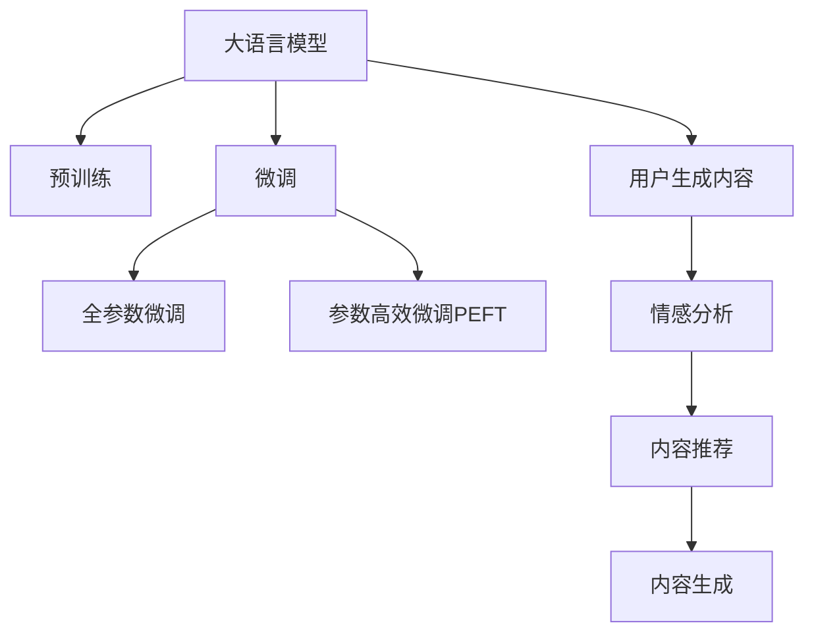

                 

# LLM在社交媒体中的应用：内容生成与分析

> 关键词：
- 社交媒体
- 语言模型
- 内容生成
- 自然语言处理
- 情感分析
- 用户生成内容
- 推荐系统

## 1. 背景介绍

随着社交媒体平台的兴起，人们越来越多地通过网络分享生活，产生海量的用户生成内容(User-Generated Content, UGC)。这些内容不仅包括了文本、图片、视频等多种形式，还蕴含了丰富的语言信息和情感状态。如何高效地分析、处理和利用这些内容，成为了一个重要的研究课题。

语言模型（Language Models, LMs）作为自然语言处理（Natural Language Processing, NLP）的核心技术之一，近年来在预训练和微调方面取得了显著进展。大语言模型（Large Language Models, LLMs）如GPT-3、BERT等，已经在多个NLP任务上展现出了卓越的性能，被广泛应用于文本生成、情感分析、问答系统等领域。

社交媒体平台上的内容生成与分析，正是一个极佳的应用场景。通过运用大语言模型，可以自动化地生成新闻稿、社论、用户评论等文本内容，并对其情感、主题、风格等进行分析和分类。这些功能不仅提高了内容生产的效率和质量，也为用户提供了更加个性化的体验。

## 2. 核心概念与联系

### 2.1 核心概念概述

为了更好地理解LMM在社交媒体中的应用，本节将介绍几个核心概念：

- **大语言模型(Large Language Models, LLMs)**：以自回归模型或自编码模型为代表的大规模预训练语言模型，如GPT、BERT等。通过在大规模无标签文本数据上进行预训练，学习通用的语言表示，具备强大的语言理解和生成能力。

- **预训练(Pre-training)**：指在大规模无标签文本数据上，通过自监督学习任务训练通用语言模型的过程。常见的预训练任务包括语言建模、掩码语言模型等。

- **微调(Fine-tuning)**：指在预训练模型的基础上，使用下游任务的少量标注数据，通过有监督地训练优化模型在特定任务上的性能。通常只需要调整顶层分类器或解码器，并以较小的学习率更新全部或部分的模型参数。

- **迁移学习(Transfer Learning)**：指将一个领域学习到的知识，迁移应用到另一个不同但相关的领域的学习范式。大模型的预训练-微调过程即是一种典型的迁移学习方式。

- **用户生成内容(User-Generated Content, UGC)**：社交媒体平台上用户自主创造并发布的内容，包括文本、图片、视频等，包含了用户对事件、产品、社会现象的看法和情感。

- **情感分析(Sentiment Analysis)**：通过分析文本中的情感词汇、情感语义和情感强度，对文本的情感倾向进行分类。

- **内容推荐(Content Recommendation)**：基于用户的历史行为和文本内容特征，推荐给用户感兴趣的相关内容。

这些核心概念之间的逻辑关系可以通过以下Mermaid流程图来展示：



这个流程图展示了大语言模型在社交媒体平台上的核心应用场景：

1. 大语言模型通过预训练获得基础能力。
2. 微调过程使其更好地适应特定任务。
3. 用户生成内容通过情感分析进行情感倾向分类。
4. 情感分析的结果用于指导内容推荐。
5. 内容生成则基于推荐结果，自动产生新内容。

## 3. 核心算法原理 & 具体操作步骤

### 3.1 算法原理概述

基于社交媒体平台的用户生成内容，LMM的微调可以分为两个主要步骤：内容生成和情感分析。

**内容生成**：使用大语言模型对社交媒体上的用户生成内容进行扩展或补全，例如生成短评、新闻标题、产品描述等。常用的方法是将用户生成的文本作为初始输入，通过微调后的LMM生成新的内容。

**情感分析**：通过LMM对用户生成内容进行情感分类，可以分析用户的情绪状态、情感倾向等。具体方法包括训练一个二分类模型（如LSTM、GRU、Transformer等），将用户文本的情感标签作为监督信号，以最大化预测准确度。

### 3.2 算法步骤详解

**内容生成**

1. **数据准备**：收集社交媒体上的用户生成内容，如Twitter上的推文、微博上的博文、Instagram上的帖子等。
2. **文本预处理**：对收集到的文本进行清洗、分词、去停用词等预处理操作，确保输入数据的质量。
3. **模型选择**：选择适合的预训练语言模型，如GPT-3、BERT等。
4. **微调训练**：在少量标注数据上对模型进行微调训练，优化模型在生成任务上的性能。
5. **内容生成**：使用微调后的模型对新的文本内容进行生成，可以是扩展、改写、摘要等形式。

**情感分析**

1. **数据准备**：收集社交媒体上的用户生成内容，并标注其情感标签。
2. **文本预处理**：对文本进行清洗、分词、去停用词等预处理操作。
3. **模型选择**：选择适合的预训练语言模型，如BERT、GPT-3等。
4. **微调训练**：在标注数据上对模型进行微调训练，优化模型在情感分类任务上的性能。
5. **情感分析**：使用微调后的模型对新的文本内容进行情感分类，可以判断其情绪状态、情感倾向等。

### 3.3 算法优缺点

基于社交媒体平台的内容生成和情感分析，LMM具有以下优点：

- **高效自动化**：LMM可以快速自动化地生成大量内容，减少人工编写成本，提高内容生产效率。
- **个性化推荐**：通过情感分析，可以更好地理解用户的情感状态，实现个性化推荐，提升用户体验。
- **高质量生成**：LMM生成的文本内容质量高，语言流畅，风格一致，能够吸引更多用户参与互动。
- **多模态融合**：LMM可以处理文本、图片、视频等多种形式的内容，实现多模态数据的融合和分析。

然而，LMM也存在一些缺点：

- **数据依赖性高**：LMM的性能很大程度上依赖于输入数据的数量和质量，数据量不足或质量不高，会影响模型的性能。
- **计算成本高**：大规模预训练和微调模型需要大量的计算资源，如GPU、TPU等，对硬件要求较高。
- **过拟合风险**：在标注数据较少的情况下，LMM容易发生过拟合，导致生成或分析结果失真。
- **模型偏见**：LMM在预训练过程中可能学习到偏见，如性别、种族、地域等，需要进行后续去偏处理。

### 3.4 算法应用领域

LMM在社交媒体平台上的应用领域非常广泛，以下是几个主要的应用场景：

- **内容生成**：社交媒体平台上的新闻稿、社论、用户评论、产品描述等。
- **情感分析**：用户对品牌、产品、事件的情感倾向分类。
- **个性化推荐**：基于用户兴趣和情感，推荐相关内容。
- **智能客服**：自动化回复用户生成内容，提升客户满意度。
- **舆情监测**：分析社交媒体上的舆情动态，及时发现和处理负面信息。

## 4. 数学模型和公式 & 详细讲解 & 举例说明

### 4.1 数学模型构建

在社交媒体平台上的内容生成和情感分析中，LMM可以采用不同的模型结构。以下是几种常见的模型结构：

**Transformer模型**：Transformer模型是目前最先进的文本生成模型之一，其结构简单，易于扩展，可以用于各种文本生成任务。Transformer模型主要由多头自注意力机制和全连接层组成，能够捕捉文本中的长期依赖关系。

**BERT模型**：BERT模型采用双向语言建模任务，可以学习到丰富的文本上下文信息。BERT模型由Transformer模型和掩码语言模型构成，能够处理多种文本生成任务。

**GPT模型**：GPT模型采用自回归生成模型，可以生成连续的文本序列。GPT模型由Transformer模型和线性分类器构成，能够生成高质量的文本内容。

**LSTM模型**：LSTM模型采用长短时记忆网络，可以处理序列数据的长期依赖关系。LSTM模型常用于情感分析、文本分类等任务。

**GRU模型**：GRU模型是LSTM模型的简化版，可以处理序列数据的长期依赖关系，同时降低计算复杂度。GRU模型常用于情感分析、文本分类等任务。

### 4.2 公式推导过程

以**Transformer模型**为例，推导其生成文本的公式。

假设输入序列为 $X=\{x_1, x_2, ..., x_n\}$，生成序列为 $Y=\{y_1, y_2, ..., y_n\}$，Transformer模型的目标是通过前向传播生成目标序列 $Y$。

Transformer模型的前向传播过程包括编码器和解码器。编码器将输入序列 $X$ 转换为隐状态 $H$，解码器将隐状态 $H$ 和目标序列 $Y$ 的每个位置 $y_i$ 转换为下一个位置的预测值 $\hat{y}_{i+1}$。

Transformer模型主要由编码器和解码器组成，其结构如下图所示：

```
Encoder: Encoder Layer 1 -> Encoder Layer 2 -> ...
Decoder: Decoder Layer 1 -> Decoder Layer 2 -> ...
```

其中，每个编码器和解码器由多头自注意力机制和全连接层组成。

自注意力机制可以计算每个位置与所有位置之间的注意力权重，然后将权重和输入向量相乘，得到注意力向量。全连接层则将注意力向量进行线性变换，得到输出向量。

**生成过程的公式**如下：

1. **编码器生成隐状态**：
   $$
   H = \text{Encoder}(X)
   $$
   其中，$H$ 为编码器输出，$X$ 为输入序列。

2. **解码器生成目标序列**：
   $$
   \hat{y}_{i+1} = \text{Decoder}(H, y_1, y_2, ..., y_i)
   $$
   其中，$\hat{y}_{i+1}$ 为目标序列的下一个位置预测值，$H$ 为编码器输出，$y_1, y_2, ..., y_i$ 为已生成的目标序列。

Transformer模型的生成过程可以通过递归展开式实现，具体的推导过程较为复杂，这里不再赘述。

### 4.3 案例分析与讲解

**案例分析：社交媒体上的情感分析**

以社交媒体平台上的情感分析为例，推导情感分析的数学模型。

假设社交媒体上的用户生成内容为 $X$，情感标签为 $y$。情感分析的目标是训练一个二分类模型 $M_{\theta}$，使得 $M_{\theta}(X)$ 最大化预测准确度。

情感分析的数学模型可以表示为：
$$
\arg\min_{\theta} \frac{1}{N} \sum_{i=1}^N \ell(M_{\theta}(x_i), y_i)
$$
其中，$\ell$ 为损失函数，通常使用交叉熵损失函数。

情感分析的训练过程如下：

1. **数据准备**：收集社交媒体上的用户生成内容 $X$ 和标注好的情感标签 $y$。
2. **文本预处理**：对文本进行清洗、分词、去停用词等预处理操作。
3. **模型选择**：选择适合的预训练语言模型，如BERT、GPT-3等。
4. **微调训练**：在标注数据上对模型进行微调训练，优化模型在情感分类任务上的性能。
5. **情感分析**：使用微调后的模型对新的文本内容进行情感分类，判断其情绪状态、情感倾向等。

## 5. 项目实践：代码实例和详细解释说明

### 5.1 开发环境搭建

在进行社交媒体上的内容生成和情感分析时，需要准备开发环境。以下是使用Python进行PyTorch开发的环境配置流程：

1. 安装Anaconda：从官网下载并安装Anaconda，用于创建独立的Python环境。

2. 创建并激活虚拟环境：
```bash
conda create -n pytorch-env python=3.8 
conda activate pytorch-env
```

3. 安装PyTorch：根据CUDA版本，从官网获取对应的安装命令。例如：
```bash
conda install pytorch torchvision torchaudio cudatoolkit=11.1 -c pytorch -c conda-forge
```

4. 安装Transformers库：
```bash
pip install transformers
```

5. 安装各类工具包：
```bash
pip install numpy pandas scikit-learn matplotlib tqdm jupyter notebook ipython
```

完成上述步骤后，即可在`pytorch-env`环境中开始社交媒体上的内容生成和情感分析实践。

### 5.2 源代码详细实现

**内容生成**

以下是一个使用PyTorch和Transformers库进行内容生成的代码实现：

```python
from transformers import GPT2Tokenizer, GPT2LMHeadModel

tokenizer = GPT2Tokenizer.from_pretrained('gpt2')
model = GPT2LMHeadModel.from_pretrained('gpt2')

input_text = "This is an example input text for content generation."
encoded_input = tokenizer(input_text, return_tensors='pt')

output_tokens = model.generate(**encoded_input)

decoded_output = tokenizer.decode(output_tokens[0], skip_special_tokens=True)
print(decoded_output)
```

**情感分析**

以下是一个使用PyTorch和Transformers库进行情感分析的代码实现：

```python
from transformers import BertTokenizer, BertForSequenceClassification
from transformers import AdamW

tokenizer = BertTokenizer.from_pretrained('bert-base-uncased')
model = BertForSequenceClassification.from_pretrained('bert-base-uncased', num_labels=2)

input_text = "I am very happy today!"
encoded_input = tokenizer(input_text, return_tensors='pt')

labels = encoded_input['labels'].to(device)
outputs = model(**encoded_input)

loss = outputs.loss
logits = outputs.logits
predicted_label = logits.argmax(dim=1).item()

print(f"Label: {predicted_label}, Loss: {loss}")
```

### 5.3 代码解读与分析

**内容生成**

1. **数据准备**：使用社交媒体上的用户生成内容作为输入文本，通过GPT-2模型生成新的文本内容。
2. **模型选择**：选择GPT-2作为预训练语言模型，并加载其 tokenizer 和模型。
3. **模型调用**：将输入文本转换为token ids，并将token ids输入模型进行生成。
4. **输出解码**：使用tokenizer将模型生成的token ids解码为文本，并输出。

**情感分析**

1. **数据准备**：使用社交媒体上的用户生成内容作为输入文本，通过BERT模型进行情感分类。
2. **模型选择**：选择BERT作为预训练语言模型，并加载其 tokenizer 和模型。
3. **模型调用**：将输入文本转换为token ids，并将token ids输入模型进行分类。
4. **输出分析**：使用模型的输出结果，判断文本的情感倾向。

## 6. 实际应用场景

### 6.1 社交媒体上的内容生成

社交媒体平台上的内容生成可以帮助用户更快速地创作和分享内容，增加平台活跃度。以下是一些典型的应用场景：

1. **自动生成新闻稿**：社交媒体平台可以自动生成新闻稿，节省记者时间，快速传播信息。
2. **自动生成产品描述**：电商平台可以自动生成商品描述，提升产品展示效果。
3. **自动生成用户评论**：社交媒体平台可以自动生成用户评论，增加互动率。

### 6.2 社交媒体上的情感分析

情感分析可以帮助社交媒体平台更好地理解用户的情绪状态，进行情感倾向分类。以下是一些典型的应用场景：

1. **舆情监测**：社交媒体平台可以实时监测舆情动态，及时发现和处理负面信息。
2. **广告投放**：广告主可以根据情感分析结果，进行精准投放，提高广告效果。
3. **客户服务**：社交媒体平台可以分析用户评论和反馈，提升客户满意度。

### 6.3 社交媒体上的个性化推荐

个性化推荐可以提升用户粘性，增加平台收入。以下是一些典型的应用场景：

1. **新闻推荐**：社交媒体平台可以根据用户的兴趣和情感，推荐相关的新闻内容。
2. **视频推荐**：社交媒体平台可以根据用户的兴趣和情感，推荐相关的视频内容。
3. **商品推荐**：电商平台可以根据用户的兴趣和情感，推荐相关的商品内容。

## 7. 工具和资源推荐

### 7.1 学习资源推荐

为了帮助开发者系统掌握大语言模型在社交媒体中的应用，这里推荐一些优质的学习资源：

1. 《自然语言处理与深度学习》系列博文：由大模型技术专家撰写，深入浅出地介绍了Transformer原理、BERT模型、微调技术等前沿话题。

2. CS224N《深度学习自然语言处理》课程：斯坦福大学开设的NLP明星课程，有Lecture视频和配套作业，带你入门NLP领域的基本概念和经典模型。

3. 《Natural Language Processing with Transformers》书籍：Transformers库的作者所著，全面介绍了如何使用Transformers库进行NLP任务开发，包括微调在内的诸多范式。

4. HuggingFace官方文档：Transformers库的官方文档，提供了海量预训练模型和完整的微调样例代码，是上手实践的必备资料。

5. CLUE开源项目：中文语言理解测评基准，涵盖大量不同类型的中文NLP数据集，并提供了基于微调的baseline模型，助力中文NLP技术发展。

通过对这些资源的学习实践，相信你一定能够快速掌握大语言模型在社交媒体中的应用，并用于解决实际的NLP问题。

### 7.2 开发工具推荐

高效的开发离不开优秀的工具支持。以下是几款用于大语言模型在社交媒体应用开发的常用工具：

1. PyTorch：基于Python的开源深度学习框架，灵活动态的计算图，适合快速迭代研究。大部分预训练语言模型都有PyTorch版本的实现。

2. TensorFlow：由Google主导开发的开源深度学习框架，生产部署方便，适合大规模工程应用。同样有丰富的预训练语言模型资源。

3. Transformers库：HuggingFace开发的NLP工具库，集成了众多SOTA语言模型，支持PyTorch和TensorFlow，是进行社交媒体应用开发的利器。

4. Weights & Biases：模型训练的实验跟踪工具，可以记录和可视化模型训练过程中的各项指标，方便对比和调优。与主流深度学习框架无缝集成。

5. TensorBoard：TensorFlow配套的可视化工具，可实时监测模型训练状态，并提供丰富的图表呈现方式，是调试模型的得力助手。

6. Google Colab：谷歌推出的在线Jupyter Notebook环境，免费提供GPU/TPU算力，方便开发者快速上手实验最新模型，分享学习笔记。

合理利用这些工具，可以显著提升大语言模型在社交媒体应用中的开发效率，加快创新迭代的步伐。

### 7.3 相关论文推荐

大语言模型在社交媒体应用的研究源于学界的持续研究。以下是几篇奠基性的相关论文，推荐阅读：

1. Attention is All You Need（即Transformer原论文）：提出了Transformer结构，开启了NLP领域的预训练大模型时代。

2. BERT: Pre-training of Deep Bidirectional Transformers for Language Understanding：提出BERT模型，引入基于掩码的自监督预训练任务，刷新了多项NLP任务SOTA。

3. Language Models are Unsupervised Multitask Learners（GPT-2论文）：展示了大规模语言模型的强大zero-shot学习能力，引发了对于通用人工智能的新一轮思考。

4. Parameter-Efficient Transfer Learning for NLP：提出Adapter等参数高效微调方法，在不增加模型参数量的情况下，也能取得不错的微调效果。

5. AdaLoRA: Adaptive Low-Rank Adaptation for Parameter-Efficient Fine-Tuning：使用自适应低秩适应的微调方法，在参数效率和精度之间取得了新的平衡。

这些论文代表了大语言模型在社交媒体应用的发展脉络。通过学习这些前沿成果，可以帮助研究者把握学科前进方向，激发更多的创新灵感。

## 8. 总结：未来发展趋势与挑战

### 8.1 总结

本文对基于大语言模型的社交媒体应用进行了全面系统的介绍。首先阐述了社交媒体平台上的用户生成内容和大语言模型的基本概念，明确了其在内容生成和情感分析中的应用价值。其次，从原理到实践，详细讲解了社交媒体应用中的内容生成和情感分析的数学模型和操作步骤，给出了社交媒体应用开发的完整代码实例。同时，本文还广泛探讨了社交媒体应用的前景，展示了其广阔的应用前景。

通过本文的系统梳理，可以看到，大语言模型在社交媒体平台上的应用具有巨大的潜力，能够极大地提升内容的生产效率和用户互动体验。未来，伴随大语言模型的不断发展，社交媒体平台将变得更加智能、高效、个性化，成为人们日常生活的重要组成部分。

### 8.2 未来发展趋势

展望未来，大语言模型在社交媒体平台上的应用将呈现以下几个发展趋势：

1. **智能化提升**：随着大语言模型的不断进步，社交媒体平台上的内容生成和情感分析将更加智能化，能够更好地理解用户的意图和情感。
2. **多模态融合**：社交媒体平台上的用户生成内容将涵盖文本、图片、视频等多种形式，大语言模型需要具备多模态融合能力，实现不同形式内容的智能分析。
3. **个性化推荐**：社交媒体平台将通过情感分析和大语言模型的结合，实现更加精准、个性化的内容推荐，提升用户满意度。
4. **实时处理**：大语言模型需要具备实时处理能力，能够在用户生成内容时即时进行分析和生成，提升互动效率。
5. **隐私保护**：随着用户生成内容隐私意识的增强，大语言模型需要更加注重隐私保护，确保用户数据的安全性。

以上趋势凸显了大语言模型在社交媒体平台上的应用前景，这些方向的探索发展，必将进一步提升社交媒体平台的智能化水平，为人们的生活带来更加便捷、高效、安全的新体验。

### 8.3 面临的挑战

尽管大语言模型在社交媒体平台上的应用已经取得了一定的进展，但在迈向更加智能化、普适化应用的过程中，仍面临诸多挑战：

1. **数据隐私保护**：用户生成内容通常包含隐私信息，如何在数据处理和分析过程中保护用户隐私，是一个重要的问题。
2. **计算资源需求**：大语言模型需要大量的计算资源进行预训练和微调，如何高效利用资源，减少计算成本，是一个技术难题。
3. **情感分析的准确性**：情感分析模型的准确性很大程度上依赖于数据质量，如何在数据质量不高的情况下，提升情感分析的准确性，是一个挑战。
4. **内容生成的多样性**：大语言模型需要具备丰富的多样性，避免内容的同质化和重复性，是一个技术难题。
5. **模型公平性**：大语言模型在预训练过程中可能会学习到偏见，如何在模型设计和使用中消除偏见，是一个伦理和公平性问题。

### 8.4 研究展望

面对大语言模型在社交媒体平台应用所面临的挑战，未来的研究需要在以下几个方面寻求新的突破：

1. **数据隐私保护技术**：研究如何在数据处理和分析过程中保护用户隐私，实现数据的安全性和匿名性。
2. **高效计算技术**：研究如何高效利用计算资源，减少大语言模型的计算成本，提升计算效率。
3. **情感分析模型优化**：研究如何提升情感分析模型的准确性，引入更多的情感词汇和语义信息，实现更加精准的情感分类。
4. **内容生成多样性提升**：研究如何提升大语言模型的多样性，避免内容的同质化和重复性，实现更加丰富和创新的内容生成。
5. **公平性研究**：研究如何在模型设计和使用中消除偏见，确保大语言模型的公平性和可靠性。

这些研究方向的探索，必将引领大语言模型在社交媒体平台上的应用迈向更高的台阶，为社交媒体平台的发展带来新的动力。

## 9. 附录：常见问题与解答

**Q1：大语言模型在社交媒体上的应用是否会侵犯用户隐私？**

A: 大语言模型在社交媒体上的应用，需要遵循用户隐私保护的法律规定。用户生成内容通常包含隐私信息，需要在数据处理和分析过程中，采取严格的隐私保护措施，确保用户数据的安全性。此外，在收集和处理用户数据时，需要获得用户的明示同意，并在隐私声明中明确告知用户数据的用途和处理方式。

**Q2：大语言模型在社交媒体上的应用是否会导致内容同质化？**

A: 大语言模型在社交媒体上的应用，可能会在某些方面导致内容同质化。因为大语言模型基于大规模数据进行训练，容易受到训练数据的多样性和偏差影响，产生相似的输出。为避免内容同质化，需要在模型训练和应用过程中引入多样化的训练数据和约束条件，确保输出的多样性和创新性。

**Q3：大语言模型在社交媒体上的应用是否会降低用户互动性？**

A: 大语言模型在社交媒体上的应用，可以提升用户互动性。通过自动生成内容、情感分析和个性化推荐，可以提供更加丰富和个性化的体验，增加用户的粘性和参与度。但是，在应用过程中需要注意，避免大语言模型生成的内容过于机械化，缺乏真实性和可信度，降低用户互动的积极性。

**Q4：大语言模型在社交媒体上的应用是否需要高昂的计算资源？**

A: 大语言模型在社交媒体上的应用，确实需要高昂的计算资源进行预训练和微调。但是，随着云计算和分布式计算技术的发展，可以通过云服务实现大语言模型的高效利用，降低计算成本。同时，可以通过数据增强、模型压缩等技术，减少计算资源的消耗，提升计算效率。

**Q5：大语言模型在社交媒体上的应用是否会引入偏见？**

A: 大语言模型在社交媒体上的应用，可能会引入偏见。因为大语言模型在预训练过程中，可能会学习到数据中存在的偏见和歧视，并在输出中加以反映。为避免引入偏见，需要在模型设计和应用过程中，引入多样化的训练数据和公平性约束，确保模型的公平性和可靠性。

总之，大语言模型在社交媒体平台上的应用，需要兼顾技术进步和社会责任，在保障用户隐私、提升用户体验、保护公平性的前提下，实现智能化的内容生成和情感分析。只有不断探索和优化，才能充分发挥大语言模型的潜力，提升社交媒体平台的智能化水平，为用户带来更好的体验。

