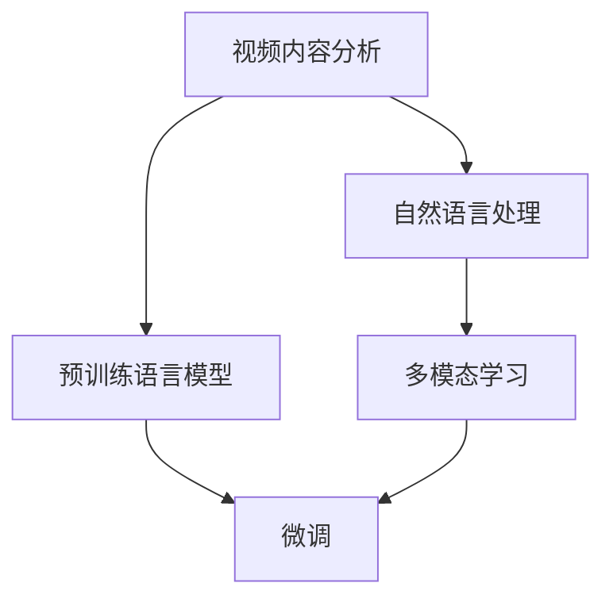

                 

# LLM在视频内容分析中的应用：自动标记与分类

> 关键词：自然语言处理(NLP), 视频内容分析, 自动标记, 视频分类, 深度学习, Transformer, 时间序列模型, 预训练模型, 微调, 多模态学习, 图像分析

## 1. 背景介绍

### 1.1 问题由来
随着互联网和数字媒体的迅猛发展，视频内容的生产和消费量呈爆炸性增长。传统的内容分类、审核、标注工作，如视频内容中的主题识别、情感判断、事件抽取等，已不再适应海量视频数据的处理需求。基于大规模预训练语言模型（Large Language Model, LLM）的深度学习技术，提供了一种新的解决方案，即利用自然语言处理(NLP)技术对视频内容进行自动标记与分类。

这种基于深度学习的自动标记和分类技术，能够显著提升视频处理的效率和准确性，减少人力成本。目前，LLM在视频内容分析中的应用已扩展到情感分析、内容标注、事件检测、字幕生成等多个方面。

### 1.2 问题核心关键点
基于LLM的视频内容分析主要有以下几个核心关键点：
- 利用预训练语言模型对视频内容进行自然语言理解。
- 设计合适的视频特征提取方法，将视频转化为可理解的语言输入。
- 对预训练模型进行微调，使其能够针对视频内容生成准确、合理的标记。
- 利用多模态学习技术，融合文本和图像等多源信息，提升分类和标记精度。

这些关键点共同构成了基于LLM的视频内容分析的核心技术框架，使得其在处理视频内容时具有较强的泛化能力和实用价值。

## 2. 核心概念与联系

### 2.1 核心概念概述

为更好地理解基于LLM的视频内容分析方法，本节将介绍几个密切相关的核心概念：

- **视频内容分析（Video Content Analysis）**：指对视频中包含的视觉、听觉、文本等各类信息进行分析，提取其中的语义信息，用于内容分类、摘要生成、事件检测等任务。

- **自然语言处理（Natural Language Processing, NLP）**：涉及文本数据的处理与分析，包括文本分类、情感分析、命名实体识别等任务。

- **预训练语言模型（Pre-trained Language Models, PLMs）**：如BERT、GPT等，通过大规模无标签文本数据预训练得到的基础语言模型，具备强大的语言理解能力。

- **微调（Fine-tuning）**：指在大规模预训练语言模型的基础上，针对特定任务进行有监督学习优化，使其能够适应新的任务需求。

- **多模态学习（Multimodal Learning）**：指融合多种数据源（如文本、图像、音频等）进行学习，提升模型在不同模态数据上的泛化能力。

这些核心概念之间的逻辑关系可以通过以下Mermaid流程图来展示：



这个流程图展示了大语言模型在视频内容分析中的核心概念及其之间的关系：

1. 预训练语言模型提供基础的自然语言理解能力。
2. 自然语言处理技术对视频内容进行文本标注和分析。
3. 多模态学习技术融合不同模态信息，提升模型理解能力。
4. 微调过程针对特定任务进行优化，增强模型性能。

## 3. 核心算法原理 & 具体操作步骤
### 3.1 算法原理概述

基于LLM的视频内容分析，本质上是将视频内容转换为文本信息，利用NLP技术进行自然语言理解，并结合多模态学习技术进行多源信息融合。以下将详细介绍该过程的算法原理和具体操作步骤。

### 3.2 算法步骤详解

1. **视频预处理**：
   - 将视频文件转换为视频帧序列。
   - 提取视频帧中的视觉、音频特征，如颜色、纹理、声音波形等。
   - 提取视频帧的文本信息，如字幕、对话等。

2. **特征提取**：
   - 利用深度学习技术（如CNN、RNN、Transformer等）对视频帧进行视觉、音频特征提取。
   - 对视频帧的文本信息进行分词、词向量化等处理，转化为模型可理解的输入形式。

3. **预训练语言模型嵌入**：
   - 将处理后的视频视觉、音频、文本信息嵌入到预训练语言模型的输入。
   - 利用预训练语言模型的编码器对输入信息进行编码，生成高维语义表示。

4. **多模态融合**：
   - 通过融合视觉、音频、文本等多模态信息，生成更丰富的语义表示。
   - 利用注意力机制（Attention Mechanism）对不同模态的信息进行加权融合，提升模型对复杂场景的理解能力。

5. **微调过程**：
   - 根据特定任务需求，如事件检测、情感分析、字幕生成等，对预训练语言模型进行微调。
   - 在微调过程中，结合目标任务的标注数据，优化模型参数，提升模型针对特定任务的表现。

6. **模型评估与部署**：
   - 在测试集上评估微调后模型的性能，对比原始模型的效果。
   - 将微调后的模型集成到实际的视频内容分析系统中，进行实时任务处理。

### 3.3 算法优缺点

基于LLM的视频内容分析方法具有以下优点：
- 数据需求少：相较于传统的视频标注方法，需要的标注数据量更少。
- 处理速度快：利用预训练模型的强大语义表示能力，能够显著提升处理速度。
- 泛化能力强：融合多模态信息，提升模型对复杂场景的理解能力。
- 效果优异：在大规模预训练语言模型的基础上，微调过程能够进一步提升模型的表现。

同时，该方法也存在以下局限性：
- 模型复杂：由于涉及多模态信息的融合，模型结构和训练过程相对复杂。
- 标注数据依赖：尽管标注需求少，但微调过程仍需要一定量的标注数据支持。
- 硬件要求高：需要高性能计算资源，如GPU、TPU等，以支持大规模预训练和微调过程。

尽管存在这些局限性，但基于LLM的视频内容分析方法在实际应用中已取得了显著效果，具有广阔的应用前景。

### 3.4 算法应用领域

基于LLM的视频内容分析方法，已在多个领域得到广泛应用，如：

- 内容审核与分类：自动判断视频内容是否违法违规，如暴力、色情、欺诈等。
- 情感分析：自动分析视频内容中的情感倾向，如愤怒、悲伤、欢乐等。
- 事件检测：自动标注视频中的事件发生时间、地点、参与者等关键信息。
- 字幕生成：自动生成视频中的对话字幕，提升观影体验。
- 自动摘要：自动提取视频内容的要点，生成简短摘要。
- 智能推荐：根据用户观看历史，推荐类似视频内容。

除了上述这些经典应用外，LLM在视频内容分析领域还有更多创新应用场景，如可控视频生成、用户行为分析、广告监测等，为视频内容处理带来全新的突破。

## 4. 数学模型和公式 & 详细讲解 & 举例说明

### 4.1 数学模型构建

本节将使用数学语言对基于LLM的视频内容分析过程进行更加严格的刻画。

设视频内容为 $V$，包含视觉、音频、文本等多种模态信息。预训练语言模型为 $M_{\theta}$，其中 $\theta$ 为预训练得到的模型参数。微调任务为 $T$，如事件检测、情感分析等。

假设模型 $M_{\theta}$ 在输入 $V$ 上的损失函数为 $\ell(M_{\theta}(V),T)$，则在数据集 $D$ 上的经验风险为：

$$
\mathcal{L}(\theta) = \frac{1}{N} \sum_{i=1}^N \ell(M_{\theta}(V_i),T_i)
$$

其中 $V_i$ 和 $T_i$ 分别表示第 $i$ 个视频的视觉、音频、文本信息及其标注。

微调的优化目标是最小化经验风险，即找到最优参数：

$$
\theta^* = \mathop{\arg\min}_{\theta} \mathcal{L}(\theta)
$$

在实践中，我们通常使用基于梯度的优化算法（如SGD、Adam等）来近似求解上述最优化问题。设 $\eta$ 为学习率，$\lambda$ 为正则化系数，则参数的更新公式为：

$$
\theta \leftarrow \theta - \eta \nabla_{\theta}\mathcal{L}(\theta) - \eta\lambda\theta
$$

其中 $\nabla_{\theta}\mathcal{L}(\theta)$ 为损失函数对参数 $\theta$ 的梯度，可通过反向传播算法高效计算。

### 4.2 公式推导过程

以下我们以事件检测为例，推导基于LLM的视频内容分析的数学模型。

事件检测任务的目标是从视频中识别出特定事件的发生时间、地点、参与者等信息。假设模型 $M_{\theta}$ 在输入 $V$ 上的输出为 $H$，表示视频内容的高维语义表示。事件标注 $T$ 包括时间、地点、人物等特征，记为 $T=\{t, l, p\}$。则事件检测损失函数可定义为：

$$
\ell(M_{\theta}(V),T) = \ell_t(H,t) + \ell_l(H,l) + \ell_p(H,p)
$$

其中 $\ell_t(H,t)$、$\ell_l(H,l)$ 和 $\ell_p(H,p)$ 分别表示时间、地点、人物特征的预测损失函数。假设损失函数为交叉熵损失函数，则有：

$$
\ell_t(H,t) = -\frac{1}{N} \sum_{i=1}^N \log p_t(H_i,t_i)
$$

其中 $p_t(H_i,t_i)$ 表示模型对时间特征 $t_i$ 的条件概率。

对于时间、地点、人物特征的预测，可以分别使用不同的方法进行建模，如循环神经网络（RNN）、卷积神经网络（CNN）、Transformer等。以Transformer为例，时间、地点、人物的特征表示分别记为 $H_t$、$H_l$、$H_p$，则事件检测的损失函数可进一步展开为：

$$
\mathcal{L}(\theta) = -\frac{1}{N} \sum_{i=1}^N (\ell_t(H_t,t_i) + \ell_l(H_l,l_i) + \ell_p(H_p,p_i))
$$

根据链式法则，损失函数对参数 $\theta_k$ 的梯度为：

$$
\frac{\partial \mathcal{L}(\theta)}{\partial \theta_k} = -\frac{1}{N} \sum_{i=1}^N \left( \frac{\partial \ell_t(H_t,t_i)}{\partial \theta_k} + \frac{\partial \ell_l(H_l,l_i)}{\partial \theta_k} + \frac{\partial \ell_p(H_p,p_i)}{\partial \theta_k} \right)
$$

其中 $\frac{\partial \ell_t(H_t,t_i)}{\partial \theta_k}$、$\frac{\partial \ell_l(H_l,l_i)}{\partial \theta_k}$ 和 $\frac{\partial \ell_p(H_p,p_i)}{\partial \theta_k}$ 可以进一步递归展开，利用自动微分技术完成计算。

### 4.3 案例分析与讲解

假设我们使用一个Transformer模型对视频内容进行事件检测，模型的输入为一个固定长度的时间序列 $V=[v_1, v_2, ..., v_n]$，其中 $v_i$ 表示第 $i$ 个时间帧的视觉、音频、文本信息。模型的输出 $H=[h_1, h_2, ..., h_n]$ 表示视频内容的高维语义表示。

在微调过程中，我们希望模型能够预测出事件发生的时间 $t$、地点 $l$ 和人物 $p$。因此，我们需要定义三个不同的预测任务，分别对应时间、地点、人物的预测。下面我们将以时间预测为例，讲解如何通过微调提高模型的准确性。

假设时间 $t$ 的标注为 $\{t_1, t_2, ..., t_m\}$，则事件检测的损失函数为：

$$
\ell(E)= -\frac{1}{N} \sum_{i=1}^N \sum_{j=1}^m \log p_t(H_i,t_j)
$$

其中 $p_t(H_i,t_j)$ 表示模型对时间 $t_j$ 的条件概率，可以通过 Softmax 函数计算得到。

为了优化模型，我们需要最小化上述损失函数。利用梯度下降等优化算法，模型参数 $\theta$ 不断更新，直至收敛到最优解 $\theta^*$。此时，模型在事件检测任务上的表现将显著提升。

## 5. 项目实践：代码实例和详细解释说明

### 5.1 开发环境搭建

在进行视频内容分析实践前，我们需要准备好开发环境。以下是使用Python进行PyTorch开发的环境配置流程：

1. 安装Anaconda：从官网下载并安装Anaconda，用于创建独立的Python环境。

2. 创建并激活虚拟环境：
```bash
conda create -n pytorch-env python=3.8 
conda activate pytorch-env
```

3. 安装PyTorch：根据CUDA版本，从官网获取对应的安装命令。例如：
```bash
conda install pytorch torchvision torchaudio cudatoolkit=11.1 -c pytorch -c conda-forge
```

4. 安装OpenCV：用于读取和处理视频帧。
```bash
pip install opencv-python
```

5. 安装Transformers库：
```bash
pip install transformers
```

6. 安装各类工具包：
```bash
pip install numpy pandas scikit-learn matplotlib tqdm jupyter notebook ipython
```

完成上述步骤后，即可在`pytorch-env`环境中开始视频内容分析实践。

### 5.2 源代码详细实现

下面我们以事件检测为例，给出使用Transformers库对BERT模型进行微调的PyTorch代码实现。

首先，定义事件检测任务的数据处理函数：

```python
from transformers import BertTokenizer
from torch.utils.data import Dataset
import torch

class EventDetectionDataset(Dataset):
    def __init__(self, videos, annotations, tokenizer, max_len=128):
        self.videos = videos
        self.annotations = annotations
        self.tokenizer = tokenizer
        self.max_len = max_len
        
    def __len__(self):
        return len(self.videos)
    
    def __getitem__(self, item):
        video = self.videos[item]
        annotation = self.annotations[item]
        
        frames = extract_video_frames(video) # 假设存在一个提取视频帧的函数
        tokens = self.tokenizer(frames, return_tensors='pt', max_length=self.max_len, padding='max_length', truncation=True)
        input_ids = tokens['input_ids'][0]
        attention_mask = tokens['attention_mask'][0]
        
        # 对标签进行编码
        encoded_labels = [label2id[label] for label in annotation] 
        encoded_labels.extend([label2id['None']] * (self.max_len - len(encoded_labels)))
        labels = torch.tensor(encoded_labels, dtype=torch.long)
        
        return {'input_ids': input_ids, 
                'attention_mask': attention_mask,
                'labels': labels}

# 标签与id的映射
label2id = {'None': 0, 'Event': 1, 'Non-Event': 2}
id2label = {v: k for k, v in label2id.items()}

# 创建dataset
tokenizer = BertTokenizer.from_pretrained('bert-base-cased')

train_dataset = EventDetectionDataset(train_videos, train_annotations, tokenizer)
dev_dataset = EventDetectionDataset(dev_videos, dev_annotations, tokenizer)
test_dataset = EventDetectionDataset(test_videos, test_annotations, tokenizer)
```

然后，定义模型和优化器：

```python
from transformers import BertForTokenClassification, AdamW

model = BertForTokenClassification.from_pretrained('bert-base-cased', num_labels=len(label2id))

optimizer = AdamW(model.parameters(), lr=2e-5)
```

接着，定义训练和评估函数：

```python
from torch.utils.data import DataLoader
from tqdm import tqdm
from sklearn.metrics import classification_report

device = torch.device('cuda') if torch.cuda.is_available() else torch.device('cpu')
model.to(device)

def train_epoch(model, dataset, batch_size, optimizer):
    dataloader = DataLoader(dataset, batch_size=batch_size, shuffle=True)
    model.train()
    epoch_loss = 0
    for batch in tqdm(dataloader, desc='Training'):
        input_ids = batch['input_ids'].to(device)
        attention_mask = batch['attention_mask'].to(device)
        labels = batch['labels'].to(device)
        model.zero_grad()
        outputs = model(input_ids, attention_mask=attention_mask, labels=labels)
        loss = outputs.loss
        epoch_loss += loss.item()
        loss.backward()
        optimizer.step()
    return epoch_loss / len(dataloader)

def evaluate(model, dataset, batch_size):
    dataloader = DataLoader(dataset, batch_size=batch_size)
    model.eval()
    preds, labels = [], []
    with torch.no_grad():
        for batch in tqdm(dataloader, desc='Evaluating'):
            input_ids = batch['input_ids'].to(device)
            attention_mask = batch['attention_mask'].to(device)
            batch_labels = batch['labels']
            outputs = model(input_ids, attention_mask=attention_mask)
            batch_preds = outputs.logits.argmax(dim=2).to('cpu').tolist()
            batch_labels = batch_labels.to('cpu').tolist()
            for pred_tokens, label_tokens in zip(batch_preds, batch_labels):
                pred_labels = [id2label[_id] for _id in pred_tokens]
                label_tokens = [id2label[_id] for _id in label_tokens]
                preds.append(pred_labels[:len(label_tokens)])
                labels.append(label_tokens)
                
    print(classification_report(labels, preds))
```

最后，启动训练流程并在测试集上评估：

```python
epochs = 5
batch_size = 16

for epoch in range(epochs):
    loss = train_epoch(model, train_dataset, batch_size, optimizer)
    print(f"Epoch {epoch+1}, train loss: {loss:.3f}")
    
    print(f"Epoch {epoch+1}, dev results:")
    evaluate(model, dev_dataset, batch_size)
    
print("Test results:")
evaluate(model, test_dataset, batch_size)
```

以上就是使用PyTorch对BERT进行事件检测任务微调的完整代码实现。可以看到，得益于Transformers库的强大封装，我们可以用相对简洁的代码完成BERT模型的加载和微调。

### 5.3 代码解读与分析

让我们再详细解读一下关键代码的实现细节：

**EventDetectionDataset类**：
- `__init__`方法：初始化视频、标注、分词器等关键组件。
- `__len__`方法：返回数据集的样本数量。
- `__getitem__`方法：对单个样本进行处理，将视频帧输入编码为token ids，将标签编码为数字，并对其进行定长padding，最终返回模型所需的输入。

**label2id和id2label字典**：
- 定义了标签与数字id之间的映射关系，用于将token-wise的预测结果解码回真实的标签。

**训练和评估函数**：
- 使用PyTorch的DataLoader对数据集进行批次化加载，供模型训练和推理使用。
- 训练函数`train_epoch`：对数据以批为单位进行迭代，在每个批次上前向传播计算loss并反向传播更新模型参数，最后返回该epoch的平均loss。
- 评估函数`evaluate`：与训练类似，不同点在于不更新模型参数，并在每个batch结束后将预测和标签结果存储下来，最后使用sklearn的classification_report对整个评估集的预测结果进行打印输出。

**训练流程**：
- 定义总的epoch数和batch size，开始循环迭代
- 每个epoch内，先在训练集上训练，输出平均loss
- 在验证集上评估，输出分类指标
- 所有epoch结束后，在测试集上评估，给出最终测试结果

可以看到，PyTorch配合Transformers库使得BERT微调的视频内容分析任务代码实现变得简洁高效。开发者可以将更多精力放在数据处理、模型改进等高层逻辑上，而不必过多关注底层的实现细节。

当然，工业级的系统实现还需考虑更多因素，如模型的保存和部署、超参数的自动搜索、更灵活的任务适配层等。但核心的微调范式基本与此类似。

## 6. 实际应用场景
### 6.1 智能视频监控

基于大语言模型微调的视频内容分析技术，可以广泛应用于智能视频监控系统中。通过实时分析视频内容，自动检测出异常事件，如盗窃、暴力、火灾等，能够快速响应并通知相关人员。

在技术实现上，可以收集各类视频监控数据的原始视频帧，将其输入到预训练语言模型中，通过微调学习出事件检测的能力。微调后的模型能够对新视频帧进行实时分析，快速判断是否存在异常事件，并发出警报。

### 6.2 内容推荐系统

随着视频内容的不断增加，推荐系统需要处理的信息量越来越大。传统的基于内容的推荐方法往往难以满足用户的多样化需求。利用基于大语言模型的视频内容分析技术，可以进一步提升推荐系统的个性化和智能化程度。

在实际应用中，可以收集用户观看视频的行为数据，将其输入到微调后的模型中，学习出用户的偏好和兴趣。利用模型的输出，推荐系统能够自动生成个性化的视频推荐列表，提升用户体验和推荐效果。

### 6.3 教育辅助

在教育领域，利用视频内容分析技术，可以辅助教师进行教学内容的分析与改进。通过分析学生的观看行为，识别出学生对哪些知识点存在理解困难，并自动生成针对性的讲解视频。

在实践过程中，可以将学生的学习视频输入到预训练模型中，进行事件检测、情感分析等处理，提取学生在学习过程中的情绪状态和行为特征。根据这些特征，推荐合适的教学视频，并自动生成个性化学习计划。

### 6.4 未来应用展望

随着大语言模型和微调方法的不断发展，基于微调的视频内容分析技术将呈现以下几个发展趋势：

1. 视频内容的多模态融合：未来将更多地融合视觉、音频、文本等多模态信息，提升模型对复杂场景的理解能力。
2. 动态视频内容的实时分析：随着深度学习技术的进步，实时分析大规模动态视频内容成为可能，提升视频监控系统的响应速度和准确性。
3. 跨领域的视频内容分析：通过多领域任务的微调，模型能够更好地适应不同应用场景，如医学、金融、交通等。
4. 基于生成对抗网络（GAN）的虚拟视频生成：结合视频内容分析技术，可以生成虚拟视频内容，用于教学、娱乐等领域。

这些趋势凸显了大语言模型微调技术在视频内容分析领域的广阔前景。这些方向的探索发展，必将进一步提升视频内容分析系统的性能和应用范围，为视频内容处理带来全新的突破。

## 7. 工具和资源推荐
### 7.1 学习资源推荐

为了帮助开发者系统掌握大语言模型微调的视频内容分析技术，这里推荐一些优质的学习资源：

1. 《Deep Learning for Natural Language Processing》书籍：由深度学习专家Ian Goodfellow等撰写，详细介绍了自然语言处理和视频内容分析的理论基础和实践方法。
2. CS224N《深度学习自然语言处理》课程：斯坦福大学开设的NLP明星课程，涵盖自然语言处理和视频内容分析的许多重要概念和技术。
3. 《Natural Language Processing with Transformers》书籍：Transformers库的作者所著，全面介绍了如何使用Transformers库进行视频内容分析。
4. Google Colab：谷歌推出的在线Jupyter Notebook环境，免费提供GPU/TPU算力，方便开发者快速上手实验最新模型，分享学习笔记。
5. Weights & Biases：模型训练的实验跟踪工具，可以记录和可视化模型训练过程中的各项指标，方便对比和调优。

通过对这些资源的学习实践，相信你一定能够快速掌握大语言模型微调的视频内容分析技术的精髓，并用于解决实际的NLP问题。
###  7.2 开发工具推荐

高效的开发离不开优秀的工具支持。以下是几款用于大语言模型微调的视频内容分析开发的常用工具：

1. PyTorch：基于Python的开源深度学习框架，灵活动态的计算图，适合快速迭代研究。大部分预训练语言模型都有PyTorch版本的实现。
2. TensorFlow：由Google主导开发的开源深度学习框架，生产部署方便，适合大规模工程应用。同样有丰富的预训练语言模型资源。
3. Transformers库：HuggingFace开发的NLP工具库，集成了众多SOTA语言模型，支持PyTorch和TensorFlow，是进行视频内容分析开发的利器。
4. Weights & Biases：模型训练的实验跟踪工具，可以记录和可视化模型训练过程中的各项指标，方便对比和调优。
5. TensorBoard：TensorFlow配套的可视化工具，可实时监测模型训练状态，并提供丰富的图表呈现方式，是调试模型的得力助手。

合理利用这些工具，可以显著提升大语言模型微调的视频内容分析任务的开发效率，加快创新迭代的步伐。

### 7.3 相关论文推荐

大语言模型和微调技术的发展源于学界的持续研究。以下是几篇奠基性的相关论文，推荐阅读：

1. Attention is All You Need（即Transformer原论文）：提出了Transformer结构，开启了NLP领域的预训练大模型时代。
2. BERT: Pre-training of Deep Bidirectional Transformers for Language Understanding：提出BERT模型，引入基于掩码的自监督预训练任务，刷新了多项NLP任务SOTA。
3. Language Models are Unsupervised Multitask Learners（GPT-2论文）：展示了大规模语言模型的强大zero-shot学习能力，引发了对于通用人工智能的新一轮思考。
4. Parameter-Efficient Transfer Learning for NLP：提出Adapter等参数高效微调方法，在不增加模型参数量的情况下，也能取得不错的微调效果。
5. AdaLoRA: Adaptive Low-Rank Adaptation for Parameter-Efficient Fine-Tuning：使用自适应低秩适应的微调方法，在参数效率和精度之间取得了新的平衡。
6. Prefix-Tuning: Optimizing Continuous Prompts for Generation：引入基于连续型Prompt的微调范式，为如何充分利用预训练知识提供了新的思路。

这些论文代表了大语言模型微调技术的发展脉络。通过学习这些前沿成果，可以帮助研究者把握学科前进方向，激发更多的创新灵感。

## 8. 总结：未来发展趋势与挑战

### 8.1 总结

本文对基于大语言模型微调的视频内容分析方法进行了全面系统的介绍。首先阐述了视频内容分析的基本原理和关键技术，明确了大语言模型在视频内容理解中的独特优势。其次，从原理到实践，详细讲解了基于LLM的视频内容分析的数学模型和算法步骤，给出了微调任务开发的完整代码实例。同时，本文还广泛探讨了LLM在视频内容分析中的应用前景，展示了其广阔的应用空间。

通过本文的系统梳理，可以看到，基于LLM的视频内容分析方法在实际应用中已取得了显著效果，具有广阔的应用前景。未来，伴随预训练语言模型和微调方法的持续演进，基于微调的视频内容分析技术必将在更多领域得到应用，为视频内容处理带来全新的突破。

### 8.2 未来发展趋势

展望未来，基于LLM的视频内容分析技术将呈现以下几个发展趋势：

1. 模型规模持续增大。随着算力成本的下降和数据规模的扩张，预训练语言模型的参数量还将持续增长。超大规模语言模型蕴含的丰富语言知识，有望支撑更加复杂多变的视频内容分析任务。
2. 视频内容的多模态融合。未来将更多地融合视觉、音频、文本等多模态信息，提升模型对复杂场景的理解能力。
3. 动态视频内容的实时分析。随着深度学习技术的进步，实时分析大规模动态视频内容成为可能，提升视频监控系统的响应速度和准确性。
4. 跨领域的视频内容分析。通过多领域任务的微调，模型能够更好地适应不同应用场景，如医学、金融、交通等。
5. 基于生成对抗网络（GAN）的虚拟视频生成。结合视频内容分析技术，可以生成虚拟视频内容，用于教学、娱乐等领域。
6. 融合智能算法的多模态分析。结合推荐系统、知识图谱、因果推理等技术，提升视频内容分析的个性化和智能化水平。

这些趋势凸显了大语言模型微调技术在视频内容分析领域的广阔前景。这些方向的探索发展，必将进一步提升视频内容分析系统的性能和应用范围，为视频内容处理带来全新的突破。

### 8.3 面临的挑战

尽管基于LLM的视频内容分析技术已经取得了显著效果，但在迈向更加智能化、普适化应用的过程中，仍面临以下挑战：

1. 数据需求量大。尽管微调需要的标注数据量较传统方法少，但对于大规模动态视频内容的实时分析，仍然需要大量高质量的标注数据。如何降低对标注数据的需求，是一个重要问题。
2. 硬件资源要求高。大规模视频内容的分析需要高性能计算资源，如GPU、TPU等。如何在有限的硬件资源下，提升模型处理能力，是亟待解决的问题。
3. 模型复杂度高。由于涉及多模态信息的融合，模型结构和训练过程相对复杂。如何简化模型结构，提高训练效率，是一个重要挑战。
4. 实时处理能力不足。尽管实时视频分析技术有所突破，但对于高分辨率视频和大规模数据集，实时处理能力仍需进一步提升。
5. 鲁棒性不足。模型面对视频内容的变化和噪声，鲁棒性仍需进一步增强。如何提升模型的泛化能力和抗干扰能力，是研究的重要方向。
6. 可解释性不足。目前基于LLM的视频内容分析模型往往缺乏可解释性，难以对其决策过程进行分析和调试。如何提高模型的可解释性，是亟待解决的问题。

尽管存在这些挑战，但基于LLM的视频内容分析技术在实际应用中已取得了显著效果，具有广阔的应用前景。相信随着学界和产业界的共同努力，这些挑战终将一一被克服，基于LLM的视频内容分析技术必将在更多领域得到应用，为视频内容处理带来全新的突破。

### 8.4 研究展望

面对大语言模型微调所面临的挑战，未来的研究需要在以下几个方面寻求新的突破：

1. 探索无监督和半监督微调方法。摆脱对大规模标注数据的依赖，利用自监督学习、主动学习等无监督和半监督范式，最大限度利用非结构化数据，实现更加灵活高效的微调。
2. 研究参数高效和计算高效的微调范式。开发更加参数高效的微调方法，在固定大部分预训练参数的同时，只更新极少量的任务相关参数。同时优化微调模型的计算图，减少前向传播和反向传播的资源消耗，实现更加轻量级、实时性的部署。
3. 融合因果和对比学习范式。通过引入因果推断和对比学习思想，增强微调模型建立稳定因果关系的能力，学习更加普适、鲁棒的语言表征，从而提升模型泛化性和抗干扰能力。
4. 引入更多先验知识。将符号化的先验知识，如知识图谱、逻辑规则等，与神经网络模型进行巧妙融合，引导微调过程学习更准确、合理的语言模型。同时加强不同模态数据的整合，实现视觉、语音等多模态信息与文本信息的协同建模。
5. 结合因果分析和博弈论工具。将因果分析方法引入微调模型，识别出模型决策的关键特征，增强输出解释的因果性和逻辑性。借助博弈论工具刻画人机交互过程，主动探索并规避模型的脆弱点，提高系统稳定性。
6. 纳入伦理道德约束。在模型训练目标中引入伦理导向的评估指标，过滤和惩罚有偏见、有害的输出倾向。同时加强人工干预和审核，建立模型行为的监管机制，确保输出符合人类价值观和伦理道德。

这些研究方向的探索，必将引领基于大语言模型微调的视频内容分析技术迈向更高的台阶，为构建安全、可靠、可解释、可控的智能系统铺平道路。面向未来，基于大语言模型微调的视频内容分析技术还需要与其他人工智能技术进行更深入的融合，如知识表示、因果推理、强化学习等，多路径协同发力，共同推动自然语言理解和智能交互系统的进步。只有勇于创新、敢于突破，才能不断拓展语言模型的边界，让智能技术更好地造福人类社会。

## 9. 附录：常见问题与解答

**Q1：视频内容分析过程中如何处理噪声和异常数据？**

A: 视频内容分析过程中，噪声和异常数据是不可避免的。为了提高模型的鲁棒性，可以采取以下措施：

1. 数据清洗：对输入数据进行预处理，去除明显噪声和异常值。如对视频帧进行去噪处理，去除低质量的图像信息。
2. 异常检测：利用异常检测技术，识别并剔除异常数据。如通过时间序列分析，检测视频内容中的异常事件。
3. 多模型融合：采用多个模型进行数据融合，取平均值或最大值作为最终输出。通过多模型的协同工作，降低噪声对模型的影响。

通过这些方法，可以显著提升模型的鲁棒性和准确性，增强其在复杂视频内容分析中的表现。

**Q2：视频内容分析中，如何确保模型的泛化能力？**

A: 确保模型的泛化能力，需要从以下几个方面入手：

1. 数据多样性：确保训练数据集覆盖多种视频内容类型，如日常生活、影视剧、纪录片等。多样化的数据能够提高模型的泛化能力。
2. 模型复杂度：控制模型的复杂度，避免过度拟合。可以通过正则化、Dropout等方法降低模型复杂度，提升泛化能力。
3. 超参数优化：通过超参数调优，找到最优的模型参数。可以通过网格搜索、贝叶斯优化等方法寻找最佳超参数组合。
4. 多领域微调：在不同领域的视频数据上进行微调，提升模型在不同场景下的适应能力。如在医学、金融、交通等多个领域进行微调，提升模型的通用性。

通过以上措施，可以有效提升模型在视频内容分析中的泛化能力，确保其在新数据上的表现。

**Q3：视频内容分析中，如何评估模型的性能？**

A: 视频内容分析模型的性能评估，可以通过以下指标进行衡量：

1. 准确率（Accuracy）：模型预测结果与真实结果一致的比例。
2. 召回率（Recall）：模型正确预测出所有真实事件的比例。
3. F1分数（F1 Score）：综合准确率和召回率的指标，用于衡量模型的整体性能。
4. ROC曲线（Receiver Operating Characteristic Curve）：通过绘制ROC曲线，评估模型在不同阈值下的性能表现。
5. PR曲线（Precision-Recall Curve）：通过绘制PR曲线，评估模型在不同阈值下的精确率和召回率表现。

在实际应用中，可以根据具体的任务需求，选择合适的评估指标进行模型性能评估。

**Q4：视频内容分析中，如何处理大规模动态视频内容？**

A: 处理大规模动态视频内容，需要采用以下策略：

1. 视频分割：将视频内容分割成多个小片段进行逐帧分析。这样可以降低内存占用，提高处理速度。
2. 并行计算：采用分布式计算技术，将视频内容分割成多个任务，并行处理。这样可以提高处理效率，缩短分析时间。
3. 高效编码：使用高效的视频编码技术，如H.264、HEVC等，减少视频帧的大小，提高处理速度。
4. 深度学习优化：通过优化深度学习模型结构，如使用轻量级模型、减少计算量等，提升处理能力。

通过这些方法，可以有效处理大规模动态视频内容，提升视频内容分析系统的响应速度和处理效率。

**Q5：视频内容分析中，如何提高模型的可解释性？**

A: 提高模型的可解释性，需要从以下几个方面入手：

1. 可视化技术：通过可视化技术，展示模型内部特征和决策过程。如使用热力图、注意力图等展示模型的预测结果和特征图。
2. 特征分析：分析模型在不同输入下的特征表现，识别关键特征和输入。可以通过特征重要性排序、特征贡献度分析等方法进行特征分析。
3. 因果推理：通过因果推理技术，理解模型的决策逻辑和因果关系。如使用因果图、因果模型等进行推理分析。

通过以上方法，可以有效提升模型的可解释性，帮助用户理解模型的决策过程，提高系统透明度和可信度。

