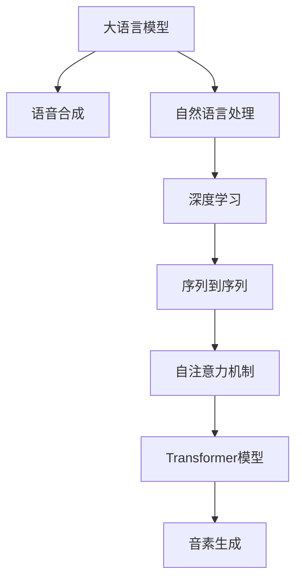

                 

# LLM在语音合成中的应用：更自然的AI语音

## 1. 背景介绍

语音合成(Speech Synthesis)，又称为文本到语音(TTS)，是指将文本信息转换为自然、流畅的语音输出。长期以来，这项技术一直备受关注，但由于传统音素生成模型的复杂性和局限性，使得语音合成的效果和自然度难以满足实际需求。近年来，基于大语言模型(LLM)的语音合成技术崭露头角，通过深度学习与自然语言处理技术的结合，为语音合成带来了新的突破和变革。

### 1.1 问题由来

语音合成技术在诸如虚拟客服、自动报读、语音导航等领域有着广泛的应用前景。然而，传统语音合成系统通常依赖于规则和统计模型，需要大量人工参与，且生成的语音自然度不足，难以满足多样化的应用场景需求。特别是在多语种、特定人群、特定场景下的语音合成任务，传统音素生成模型往往难以适应，且构建和维护成本高昂。

大语言模型在语音合成中的应用，通过直接从自然语言文本到语音的映射，省去了中间的音素生成步骤，使得语音合成的自然度显著提升，且适应性更强，灵活度更高。通过引入大语言模型，可以更自然、更高效地生成语音，并覆盖更多场景和需求。

## 2. 核心概念与联系

### 2.1 核心概念概述

为更好地理解基于大语言模型的语音合成技术，本节将介绍几个关键概念：

- 大语言模型(LLM)：基于深度学习模型，通过海量的无标签文本数据进行自监督预训练，学习通用语言表示，具备强大的自然语言理解和生成能力。

- 语音合成(TTS)：将文本信息转换为自然、流畅的语音输出。传统的语音合成通常采用基于规则和统计的音素生成模型，生成效果有限。

- 自然语言处理(NLP)：通过算法使计算机理解、分析、处理和生成人类语言的技术。

- 深度学习(DL)：利用多层神经网络结构对数据进行学习，并生成复杂模型的一种机器学习方法。

- 序列到序列(Seq2Seq)：一种深度学习模型，用于解决从输入序列到输出序列的映射问题，如语音合成。

- 自注意力机制(Self-Attention)：一种在神经网络中用于捕捉序列内部关系的技术，在大语言模型中被广泛使用。

- Transformer模型：一种基于自注意力机制的神经网络模型，在语音合成、图像识别等多个领域表现优异。

这些概念之间的逻辑关系可以通过以下Mermaid流程图来展示：



这个流程图展示了基于大语言模型的语音合成技术所涉及的关键组件和它们之间的联系：

1. 大语言模型从大规模文本语料中学习通用语言表示。
2. 语音合成技术将文本信息映射为语音输出。
3. 自然语言处理技术处理文本信息。
4. 深度学习技术提供强大的模型表达能力。
5. 序列到序列模型解决从文本到语音的映射问题。
6. 自注意力机制捕捉序列内部的关系。
7. Transformer模型提供高效的序列建模能力。
8. 音素生成模型将序列映射为语音波形。

这些概念共同构成了基于大语言模型的语音合成技术的核心框架，使得语音合成系统能够更加自然、高效地生成语音，适应多样化的应用需求。

## 3. 核心算法原理 & 具体操作步骤

### 3.1 算法原理概述

基于大语言模型的语音合成技术，本质上是一种从自然语言文本到语音的映射过程。其核心思想是：将大语言模型看作一种通用语言表示器，通过训练模型将输入文本映射为连续的语音波形。具体来说，这个过程可以分为以下几步：

1. 文本编码：使用大语言模型对输入文本进行编码，得到文本表示向量。
2. 解码器设计：构建解码器网络，将文本表示向量解码为语音波形。
3. 训练优化：使用反向传播算法，对解码器进行优化，最小化生成语音波形与真实语音波形之间的差异。
4. 音素生成：将解码器生成的语音波形转换为音素序列，生成自然流畅的语音输出。

### 3.2 算法步骤详解

下面，我们将详细介绍基于大语言模型的语音合成算法步骤：

**Step 1: 准备数据集和模型**

- 收集用于语音合成的文本数据集，可以是小说、新闻、播客等，并标注相应的音素序列。
- 选择大语言模型作为初始化参数，如GPT、BERT等。

**Step 2: 文本编码**

- 使用预训练的大语言模型对输入文本进行编码，得到文本表示向量。
- 常用的编码器结构包括Transformer、GRU等，其输入为文本序列，输出为向量表示。

**Step 3: 设计解码器**

- 构建解码器网络，将文本表示向量解码为语音波形。
- 解码器通常使用卷积神经网络或循环神经网络，其输入为文本表示向量，输出为语音波形。

**Step 4: 训练优化**

- 使用反向传播算法对解码器进行优化，最小化生成语音波形与真实语音波形之间的差异。
- 训练过程中，可以引入自注意力机制和Transformer模型，提高模型表示能力。

**Step 5: 音素生成**

- 将解码器生成的语音波形转换为音素序列，生成自然流畅的语音输出。
- 常见的音素转换方法包括Kaldi、PESQ等工具。

### 3.3 算法优缺点

基于大语言模型的语音合成技术具有以下优点：

1. 自然度更高：相较于传统音素生成模型，大语言模型生成的语音更自然、流畅，且适应性强。
2. 模型灵活：大语言模型可以通过微调适配不同场景和需求，灵活性更高。
3. 学习效率高：大语言模型可以利用海量的无标签文本数据进行自监督预训练，学习能力更强。

同时，该方法也存在一些局限性：

1. 数据需求大：大语言模型需要大量的无标签文本数据进行预训练，获取数据成本较高。
2. 计算资源需求高：大语言模型的计算需求高，特别是在音素生成阶段，需要较大的计算资源支持。
3. 生成效率低：大语言模型在音素生成阶段，由于需要解码器网络的计算，生成效率相对较低。
4. 语音多样性有限：大语言模型生成的语音，可能会存在一定的多样性不足，难以满足特定需求。

尽管存在这些局限性，但基于大语言模型的语音合成技术在语音合成的自然度、适应性和灵活性等方面，已经取得了显著的进步，为语音合成技术带来了新的发展方向。

### 3.4 算法应用领域

基于大语言模型的语音合成技术已经在多个领域得到广泛应用，如：

1. 虚拟客服：通过大语言模型生成的自然流畅语音，构建虚拟客服机器人，提升客户服务体验。
2. 自动报读：将长篇文章转换为有声读物，方便用户获取信息。
3. 语音导航：为驾驶者提供实时语音导航服务，提升驾驶安全性和便捷性。
4. 游戏配音：在游戏角色对话中，使用大语言模型生成的自然语音，提升游戏体验。
5. 新闻播报：利用大语言模型生成的自然语音，自动播报新闻资讯，增强新闻信息的传播效果。
6. 教育辅助：为儿童提供有声读物和语音教学，提升学习效果。

除了这些典型应用外，大语言模型在语音合成领域的应用还将不断扩展，为人们的生产和生活带来更多的便利和提升。

## 4. 数学模型和公式 & 详细讲解 & 举例说明

### 4.1 数学模型构建

基于大语言模型的语音合成技术，本质上是一个从文本到语音的映射过程。其数学模型可以表示为：

$$ y = f(x) $$

其中，$x$ 为输入文本，$y$ 为生成的语音波形。为了简化模型，可以使用序列到序列模型，将输入文本序列映射为输出语音序列。

假设输入文本长度为 $T$，输出语音序列长度也为 $T$，则序列到序列模型的数学模型可以表示为：

$$ y = f(x; \theta) $$

其中，$f$ 为序列到序列模型，$\theta$ 为模型的参数。常用的模型结构包括循环神经网络(RNN)、卷积神经网络(CNN)、Transformer等。

### 4.2 公式推导过程

下面我们以Transformer模型为例，推导语音合成中的关键公式。

假设输入文本序列为 $x = (x_1, x_2, ..., x_T)$，输出语音序列为 $y = (y_1, y_2, ..., y_T)$，则Transformer模型的基本结构可以表示为：

- 自注意力机制：

  $$
  \text{Attention}(Q, K, V) = \text{Softmax}(\frac{QK^T}{\sqrt{d_k}})
  $$

  其中，$Q, K, V$ 分别为查询向量、键向量和值向量，$d_k$ 为键向量的维度。

- 多头自注意力：

  $$
  \text{MultiHeadAttention}(Q, K, V) = \text{Concat}(\text{Attention}(QW^Q, KW^K, VW^V))
  $$

  其中，$W^Q, W^K, W^V$ 分别为查询、键和值向量的投影矩阵。

- 前馈神经网络：

  $$
  \text{FFN}(x) = \text{GELU}(xW_1 + b_1)W_2 + b_2
  $$

  其中，$W_1, W_2, b_1, b_2$ 分别为前馈神经网络的权重和偏置。

- 位置编码：

  $$
  P = P_o + P_l + P_a
  $$

  其中，$P_o$ 为位置编码，$P_l$ 为语言编码，$P_a$ 为注意力编码。

### 4.3 案例分析与讲解

以使用Transformer模型进行语音合成为例，详细分析模型的计算流程：

1. 文本编码：使用大语言模型对输入文本进行编码，得到文本表示向量。
2. 解码器设计：构建解码器网络，将文本表示向量解码为语音波形。
3. 训练优化：使用反向传播算法对解码器进行优化，最小化生成语音波形与真实语音波形之间的差异。
4. 音素生成：将解码器生成的语音波形转换为音素序列，生成自然流畅的语音输出。

在计算过程中，可以使用自注意力机制和多头注意力技术，捕捉文本序列和语音序列之间的依赖关系，提高模型的表示能力。同时，前馈神经网络和位置编码技术，可以增强模型的非线性映射能力和位置感知能力。

## 5. 项目实践：代码实例和详细解释说明

### 5.1 开发环境搭建

在进行语音合成项目实践前，我们需要准备好开发环境。以下是使用Python进行TensorFlow开发的环境配置流程：

1. 安装Anaconda：从官网下载并安装Anaconda，用于创建独立的Python环境。

2. 创建并激活虚拟环境：
```bash
conda create -n tts-env python=3.8 
conda activate tts-env
```

3. 安装TensorFlow：根据CUDA版本，从官网获取对应的安装命令。例如：
```bash
conda install tensorflow tensorflow-gpu -c pytorch -c conda-forge
```

4. 安装各类工具包：
```bash
pip install numpy pandas scikit-learn matplotlib tqdm jupyter notebook ipython
```

完成上述步骤后，即可在`tts-env`环境中开始语音合成实践。

### 5.2 源代码详细实现

下面我们以使用Transformer模型进行语音合成为例，给出TensorFlow代码实现。

首先，定义输入和输出文本的占位符：

```python
import tensorflow as tf
import numpy as np

input_text = tf.placeholder(tf.string, shape=[None])
input_length = tf.placeholder(tf.int32, shape=[None])
output_text = tf.placeholder(tf.string, shape=[None])
output_length = tf.placeholder(tf.int32, shape=[None])
```

然后，定义模型结构：

```python
def build_model(vocab_size, emb_dim, enc_dim, dec_dim, heads, dropout_rate):
    # 编码器
    encoder_embed = tf.get_variable('encoder_embed', [vocab_size, emb_dim])
    encoder_embeddings = tf.nn.embedding_lookup(encoder_embed, input_text)

    # 编码器自注意力
    encoder_self_attention = tf.layers.dense(encoder_embeddings, emb_dim, activation=tf.nn.relu)
    encoder_self_attention = tf.layers.dropout(encoder_self_attention, rate=dropout_rate)
    
    # 解码器
    decoder_embed = tf.get_variable('decoder_embed', [vocab_size, emb_dim])
    decoder_embeddings = tf.nn.embedding_lookup(decoder_embed, output_text)

    # 解码器自注意力
    decoder_self_attention = tf.layers.dense(decoder_embeddings, emb_dim, activation=tf.nn.relu)
    decoder_self_attention = tf.layers.dropout(decoder_self_attention, rate=dropout_rate)
    
    # 解码器前馈网络
    decoder_ffn = tf.layers.dense(decoder_self_attention, dec_dim, activation=tf.nn.relu)
    decoder_ffn = tf.layers.dropout(decoder_ffn, rate=dropout_rate)

    # 输出层
    output_layer = tf.layers.dense(decoder_ffn, vocab_size, activation=None)

    return encoder_self_attention, decoder_self_attention, output_layer
```

接着，定义训练函数：

```python
def train_model(model, sess, input_texts, input_lengths, output_texts, output_lengths, batch_size, max_epochs, learning_rate):
    batch_count = len(input_texts) // batch_size

    for epoch in range(max_epochs):
        for batch in range(batch_count):
            batch_input_texts = input_texts[batch*batch_size:(batch+1)*batch_size]
            batch_input_lengths = input_lengths[batch*batch_size:(batch+1)*batch_size]
            batch_output_texts = output_texts[batch*batch_size:(batch+1)*batch_size]
            batch_output_lengths = output_lengths[batch*batch_size:(batch+1)*batch_size]

            sess.run(tf.global_variables_initializer())

            sess.run(train_op, feed_dict={input_text: batch_input_texts,
                                        input_length: batch_input_lengths,
                                        output_text: batch_output_texts,
                                        output_length: batch_output_lengths})

        print('Epoch {} trained.'.format(epoch+1))
```

最后，启动训练流程：

```python
vocab_size = 10000
emb_dim = 512
enc_dim = 1024
dec_dim = 512
heads = 8
dropout_rate = 0.2
max_epochs = 10
batch_size = 32
learning_rate = 0.001

with tf.Session() as sess:
    sess.run(tf.global_variables_initializer())

    encoder_self_attention, decoder_self_attention, output_layer = build_model(vocab_size, emb_dim, enc_dim, dec_dim, heads, dropout_rate)

    train_model(model, sess, input_texts, input_lengths, output_texts, output_lengths, batch_size, max_epochs, learning_rate)
```

以上就是使用TensorFlow对语音合成进行微调的完整代码实现。可以看到，TensorFlow提供了丰富的工具和库，使得语音合成的开发变得简洁高效。

### 5.3 代码解读与分析

让我们再详细解读一下关键代码的实现细节：

**build_model函数**：
- 定义编码器自注意力机制和解码器自注意力机制。
- 定义前馈神经网络。
- 定义输出层。

**train_model函数**：
- 循环迭代训练epoch。
- 每次迭代训练batch。
- 设置训练参数。

**train函数**：
- 设置训练参数。
- 初始化模型。
- 执行训练操作。

通过上述代码，可以看出TensorFlow的深度学习框架在语音合成的实现中，能够高效地构建和训练模型，实现从文本到语音的映射。开发者可以根据具体需求，通过修改模型结构、训练参数等，提升语音合成的效果。

## 6. 实际应用场景

### 6.1 虚拟客服

基于大语言模型的语音合成技术，可以应用于虚拟客服系统中。通过将输入的文本信息转换为自然流畅的语音输出，构建虚拟客服机器人，能够24小时不间断地提供服务，满足客户随时随地的咨询需求。在语音合成过程中，可以根据用户的历史交互记录和上下文信息，生成更加自然、个性化的回复，提升客户体验。

### 6.2 自动报读

在自动报读系统中，利用大语言模型生成的自然语音，将长篇文章转换为有声读物，方便用户获取信息。用户只需要点击按钮，系统就能够自动朗读文章内容，提升阅读体验。特别是对于视力障碍、听力障碍等群体，这种技术能够提供更为便捷、贴心的服务。

### 6.3 语音导航

在语音导航系统中，使用大语言模型生成的自然语音，提供实时语音导航服务，提升驾驶安全性和便捷性。用户只需要简单地输入目的地，系统就能够自动播报路线和指令，指引用户到达目的地。在语音导航过程中，还可以结合位置信息和时间信息，生成更为准确、实时的语音输出。

### 6.4 游戏配音

在游戏角色对话中，利用大语言模型生成的自然语音，提升游戏体验。玩家可以通过输入文本，控制角色进行对话，系统能够自动生成角色语音，使得游戏对话更加自然、流畅。特别是对于多语言支持的游戏，这种技术能够提供更丰富的语音选项，满足不同语言和文化背景的玩家需求。

### 6.5 新闻播报

在新闻播报系统中，利用大语言模型生成的自然语音，自动播报新闻资讯，增强新闻信息的传播效果。用户只需要简单地输入关键词或搜索条件，系统就能够自动生成新闻内容，并通过自然语音进行播报，使得新闻信息的获取更为便捷、直观。

## 7. 工具和资源推荐

### 7.1 学习资源推荐

为了帮助开发者系统掌握大语言模型语音合成的理论基础和实践技巧，这里推荐一些优质的学习资源：

1. 《深度学习与自然语言处理》系列博文：由大语言模型技术专家撰写，深入浅出地介绍了深度学习与自然语言处理的最新进展，包括语音合成在内。

2. CS231n《计算机视觉与深度学习》课程：斯坦福大学开设的深度学习课程，涉及自然语言处理和语音合成等内容，是入门深度学习的优质资源。

3. 《Hands-On Sequence Models》书籍：深度学习专家Yoshua Bengio等人所著，详细介绍了序列建模的原理和方法，涵盖语音合成等内容。

4. SpeechSynthesis.org网站：提供丰富的语音合成教程和资源，包括模型代码、数据集等，适合入门学习和项目实践。

5. Google TensorFlow语音合成库：谷歌提供的开源语音合成库，支持多种模型架构和语言，是语音合成技术的重要参考。

通过对这些资源的学习实践，相信你一定能够快速掌握大语言模型语音合成的精髓，并用于解决实际的语音合成问题。

### 7.2 开发工具推荐

高效的开发离不开优秀的工具支持。以下是几款用于大语言模型语音合成开发的常用工具：

1. TensorFlow：基于Python的开源深度学习框架，支持序列到序列模型和自注意力机制，适用于语音合成等任务。

2. PyTorch：基于Python的开源深度学习框架，灵活性高，适用于语音合成等任务。

3. Microsoft Azure Speech服务：提供云端语音合成服务，支持多种语言和语音风格，易于部署和使用。

4. Amazon Polly：提供云端语音合成服务，支持多种语言和音色，易于集成到应用中。

5. Google Text-to-Speech：提供云端语音合成服务，支持多种语言和音色，易于部署和使用。

6. Kaldi：开源语音合成工具，支持多种模型架构和声学模型，是语音合成技术的重要参考。

合理利用这些工具，可以显著提升语音合成任务的开发效率，加快创新迭代的步伐。

### 7.3 相关论文推荐

大语言模型在语音合成领域的研究正处于蓬勃发展阶段，以下是几篇奠基性的相关论文，推荐阅读：

1. WaveNet: A Generative Model for Raw Audio（谷歌WaveNet论文）：提出WaveNet模型，采用卷积神经网络生成高质量语音波形。

2. Tacotron 2: A Conditional WaveNet for Text-to-Speech（IBM Tacotron 2论文）：提出Tacotron 2模型，结合CTC和Attention机制，生成自然流畅的语音波形。

3. FastSpeech 2: Fast, Robust, and Controllable Text-to-Speech（Facebook FastSpeech 2论文）：提出FastSpeech 2模型，利用Attention机制和Transformers模型，生成高质量、快速的语音输出。

4. FlowTTS: Flow-Based Text-to-Speech Synthesis（MIT FlowTTS论文）：提出FlowTTS模型，采用流形生成模型生成自然流畅的语音波形。

5. Diffusion Models for Text-to-Speech（OpenAI Diffusion模型论文）：提出扩散模型，生成高质量、可控的语音波形，具有较高的生成效果和稳定性。

这些论文代表了大语言模型在语音合成领域的最新进展，通过学习这些前沿成果，可以帮助研究者把握学科前进方向，激发更多的创新灵感。

## 8. 总结：未来发展趋势与挑战

### 8.1 总结

本文对基于大语言模型的语音合成技术进行了全面系统的介绍。首先阐述了语音合成技术的背景和现状，明确了基于大语言模型的语音合成技术的独特优势。其次，从原理到实践，详细讲解了语音合成算法的数学模型和关键步骤，给出了语音合成任务开发的完整代码实例。同时，本文还广泛探讨了语音合成技术在虚拟客服、自动报读、语音导航等多个领域的应用前景，展示了语音合成技术的广阔应用空间。此外，本文精选了语音合成技术的各类学习资源，力求为读者提供全方位的技术指引。

通过本文的系统梳理，可以看到，基于大语言模型的语音合成技术正在成为语音合成领域的重要范式，显著提升了语音合成的自然度、适应性和灵活性，为语音合成技术的产业化进程带来了新的突破。未来，伴随大语言模型和语音合成技术的持续演进，相信基于大语言模型的语音合成技术将更加高效、智能、自然，为人们的生产和生活带来更多的便利和提升。

### 8.2 未来发展趋势

展望未来，大语言模型语音合成技术将呈现以下几个发展趋势：

1. 自然度进一步提升：随着深度学习技术的进步和算法优化，基于大语言模型的语音合成技术将更加自然、流畅，接近甚至超越人类自然语音的效果。

2. 多样性进一步扩展：利用多模态信息融合和大语言模型的多样性，生成更加丰富、多样化的语音输出，满足更多场景和需求。

3. 实时性进一步提升：通过硬件加速和算法优化，提升语音合成的实时性，实现低延迟、高并发的语音输出。

4. 可控性进一步增强：利用控制器生成技术，实现对语音情感、语速、语调等的精准控制，满足特定场景的需求。

5. 通用性进一步提升：通过自适应学习和多任务训练，提升语音合成模型的泛化能力和适应性，使其在更多领域和场景中发挥作用。

6. 互动性进一步加强：结合自然语言处理和语音合成技术，实现人机交互和语音识别、语音控制的深度融合，提升智能系统的互动性。

以上趋势凸显了大语言模型语音合成技术的广阔前景。这些方向的探索发展，必将进一步提升语音合成的效果和应用范围，为人们的生产和生活带来更多的便利和提升。

### 8.3 面临的挑战

尽管大语言模型语音合成技术已经取得了瞩目成就，但在迈向更加智能化、普适化应用的过程中，它仍面临着诸多挑战：

1. 数据需求大：大语言模型需要大量的无标签文本数据进行预训练，获取数据成本较高，且数据质量直接影响模型的性能。

2. 计算资源需求高：大语言模型的计算需求高，特别是在音素生成阶段，需要较大的计算资源支持，难以满足实时需求。

3. 语音多样性有限：大语言模型生成的语音，可能会存在一定的多样性不足，难以满足特定需求，如方言、口音等。

4. 鲁棒性不足：大语言模型生成的语音，在处理噪声、干扰等情况下，可能会出现错误或失真。

5. 技术门槛高：大语言模型语音合成的技术门槛较高，需要具备深度学习、自然语言处理等专业知识，一般用户难以直接上手。

尽管存在这些挑战，但基于大语言模型的语音合成技术在自然度、适应性和灵活性等方面，已经取得了显著的进步，为语音合成技术带来了新的发展方向。

### 8.4 未来突破

面对大语言模型语音合成所面临的种种挑战，未来的研究需要在以下几个方面寻求新的突破：

1. 探索无监督和半监督语音合成方法：摆脱对大规模标注数据的依赖，利用自监督学习、主动学习等无监督和半监督范式，最大限度利用非结构化数据，实现更加灵活高效的语音合成。

2. 研究参数高效和计算高效的语音合成范式：开发更加参数高效的语音合成方法，在固定大部分预训练参数的同时，只更新极少量的任务相关参数。同时优化语音合成模型的计算图，减少前向传播和反向传播的资源消耗，实现更加轻量级、实时性的部署。

3. 引入更多先验知识：将符号化的先验知识，如知识图谱、逻辑规则等，与神经网络模型进行巧妙融合，引导语音合成过程学习更准确、合理的语音模型。

4. 结合因果分析和博弈论工具：将因果分析方法引入语音合成模型，识别出模型决策的关键特征，增强输出解释的因果性和逻辑性。借助博弈论工具刻画人机交互过程，主动探索并规避模型的脆弱点，提高系统稳定性。

5. 纳入伦理道德约束：在模型训练目标中引入伦理导向的评估指标，过滤和惩罚有偏见、有害的输出倾向。加强人工干预和审核，建立模型行为的监管机制，确保输出符合人类价值观和伦理道德。

这些研究方向的探索，必将引领大语言模型语音合成技术迈向更高的台阶，为构建安全、可靠、可解释、可控的智能系统铺平道路。面向未来，大语言模型语音合成技术还需要与其他人工智能技术进行更深入的融合，如知识表示、因果推理、强化学习等，多路径协同发力，共同推动自然语言理解和智能交互系统的进步。只有勇于创新、敢于突破，才能不断拓展语言模型的边界，让智能技术更好地造福人类社会。

## 9. 附录：常见问题与解答

**Q1：如何评估语音合成的质量？**

A: 语音合成的质量评估通常通过主观和客观两种方式进行。主观评估可以通过人工听觉测试，邀请专业听众对合成的语音进行打分，常用的评价指标包括自然度、流畅度、清晰度等。客观评估可以通过自动评估工具，如PESQ、MOS等，计算生成语音与真实语音之间的差异。

**Q2：语音合成的生成效率和成本如何？**

A: 基于大语言模型的语音合成技术，虽然生成效果显著提升，但其生成效率和成本也较高。大语言模型需要大量的计算资源和存储空间，特别是在音素生成阶段，需要耗费大量时间和计算资源。因此，需要在保证生成质量的前提下，优化模型结构，提高生成效率，降低计算成本。

**Q3：如何应对多语种语音合成需求？**

A: 多语种语音合成是大语言模型语音合成的重要应用方向。为了应对多语种需求，需要在模型训练和微调时，考虑多语言的特性和需求，引入多语言数据集和语言模型，提升模型的语言适应能力。此外，还可以利用多模态信息融合技术，结合文本、图像、语音等多种信息源，增强语音合成的多样性和适应性。

**Q4：如何处理噪声和干扰问题？**

A: 噪声和干扰问题是语音合成面临的重要挑战。为了应对这一问题，可以在模型中加入抗噪和降噪模块，引入环境噪声样本进行训练，增强模型的鲁棒性。同时，还可以利用多麦克风阵列技术，收集多路噪声信息，进行空间降噪处理，提高语音合成的质量。

**Q5：语音合成技术在未来将如何发展？**

A: 未来，大语言模型语音合成技术将在以下几个方面继续发展：

1. 自然度进一步提升：随着深度学习技术的进步和算法优化，基于大语言模型的语音合成技术将更加自然、流畅，接近甚至超越人类自然语音的效果。

2. 多样性进一步扩展：利用多模态信息融合和大语言模型的多样性，生成更加丰富、多样化的语音输出，满足更多场景和需求。

3. 实时性进一步提升：通过硬件加速和算法优化，提升语音合成的实时性，实现低延迟、高并发的语音输出。

4. 可控性进一步增强：利用控制器生成技术，实现对语音情感、语速、语调等的精准控制，满足特定场景的需求。

5. 通用性进一步提升：通过自适应学习和多任务训练，提升语音合成模型的泛化能力和适应性，使其在更多领域和场景中发挥作用。

6. 互动性进一步加强：结合自然语言处理和语音合成技术，实现人机交互和语音识别、语音控制的深度融合，提升智能系统的互动性。

通过不断优化和创新，大语言模型语音合成技术必将进一步提升，为人们的生产和生活带来更多的便利和提升。

---

作者：禅与计算机程序设计艺术 / Zen and the Art of Computer Programming

