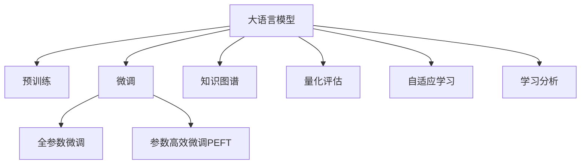

                 

# LLM对传统教育评估方法的革新

> 关键词：
- 大语言模型(LLM)
- 教育评估
- 智能评估系统
- 知识图谱
- 量化评估
- 自适应学习
- 学习分析
- 算法优化
- 教学辅助

## 1. 背景介绍

### 1.1 问题由来

在传统的教育评估体系中，教师通常依赖标准化测试、课堂表现、作业等手段进行学生评估。然而，这种方法存在诸多不足：

- 评估结果单一，难以全面反映学生的知识掌握情况和学习状态。
- 评估过程耗时耗力，教师难以兼顾学生个性化的学习需求。
- 评估方法缺乏动态适应性，难以实时调整教学内容和方法。

伴随人工智能技术的崛起，尤其是大语言模型(LLM)的出现，为传统教育评估带来了革命性的变革。LLM凭借其强大的自然语言理解和生成能力，能够实现更全面、实时、个性化的教育评估。

### 1.2 问题核心关键点

大语言模型(LLM)在教育评估中的应用，主要集中在以下几个方面：

- **全面评估**：LLM可以理解自然语言文本，不仅能评估学生的写作、阅读能力，还能通过对话生成评估学生对知识点的掌握情况。
- **实时反馈**：LLM具备即时生成回答的能力，可以实时给出学生作业和考试的反馈，提升评估效率。
- **个性化评估**：LLM能够根据学生的回答和反馈，动态调整评估难度和形式，实现个性化评估。
- **多模态评估**：LLM不仅评估语言能力，还能结合图像、视频等模态数据，评估学生的综合素养。
- **自适应学习**：LLM能够理解学生的学习进度和能力，根据其表现提供个性化的学习建议和资源。

### 1.3 问题研究意义

研究大语言模型在教育评估中的应用，对提升教育质量和效率具有重要意义：

- **提升教育质量**：全面、实时、个性化的评估方式能够更好地了解学生的学习状态和需求，提供针对性的教学建议，从而提升教育质量。
- **优化教学资源**：LLM能够高效评估学生的学习效果，帮助教师调整教学内容和方法，优化教学资源配置。
- **激发学生兴趣**：通过智能化的评估方式，增加学习的趣味性和挑战性，激发学生的学习兴趣和潜力。
- **促进教育公平**：基于数据驱动的评估系统，能够更好地识别学生的学习障碍和需求，提供公平、公正的教育支持。

## 2. 核心概念与联系

### 2.1 核心概念概述

为更好地理解LLM在教育评估中的应用，本节将介绍几个关键概念：

- **大语言模型(LLM)**：以自回归(如GPT)或自编码(如BERT)模型为代表的大规模预训练语言模型。通过在大规模无标签文本语料上进行预训练，学习通用的语言表示，具备强大的语言理解和生成能力。

- **预训练(Pre-training)**：指在大规模无标签文本语料上，通过自监督学习任务训练通用语言模型的过程。常见的预训练任务包括言语建模、遮挡语言模型等。

- **微调(Fine-tuning)**：指在预训练模型的基础上，使用下游任务的少量标注数据，通过有监督学习优化模型在特定任务上的性能。通常只需要调整顶层分类器或解码器，并以较小的学习率更新全部或部分的模型参数。

- **知识图谱(Knowledge Graph)**：一种用于表示实体和实体间关系的数据结构，通过RDF图谱描述知识结构，支持语义查询和推理。

- **量化评估(Qualitative Assessment)**：通过量化的评分系统，对学生的知识掌握情况和学习效果进行评估，如标准化测试、考试成绩等。

- **自适应学习(Adaptive Learning)**：根据学生的学习状态和能力，动态调整学习内容和方法，提供个性化的学习路径和资源。

- **学习分析(Learning Analytics)**：通过数据分析和可视化技术，挖掘学生学习行为和结果，提供教育评估和改进建议。

这些概念之间的逻辑关系可以通过以下Mermaid流程图来展示：



这个流程图展示了大语言模型的核心概念及其之间的关系：

1. 大语言模型通过预训练获得基础能力。
2. 微调是对预训练模型进行任务特定的优化，可以分为全参数微调和参数高效微调(PEFT)。
3. 知识图谱用于支持语义查询和推理，提升语言模型的表达能力。
4. 量化评估提供标准化的评分系统，用于评估学生的学习效果。
5. 自适应学习根据学生的学习状态和能力，动态调整学习内容和方法。
6. 学习分析通过数据分析和可视化技术，挖掘学生学习行为和结果，提供教育评估和改进建议。

这些概念共同构成了大语言模型在教育评估中的应用框架，使其能够在各种场景下发挥强大的语言理解和生成能力。通过理解这些核心概念，我们可以更好地把握LLM在教育评估中的应用方向。

## 3. 核心算法原理 & 具体操作步骤
### 3.1 算法原理概述

基于大语言模型(LLM)的教育评估，本质上是一个有监督的细粒度迁移学习过程。其核心思想是：将预训练的大语言模型视作一个强大的"特征提取器"，通过在下游任务的标注数据上进行有监督的微调，使得模型输出能够匹配任务标签，从而获得针对特定任务优化的模型。

形式化地，假设预训练模型为 $M_{\theta}$，其中 $\theta$ 为预训练得到的模型参数。给定教育评估任务 $T$ 的标注数据集 $D=\{(x_i, y_i)\}_{i=1}^N$，评估的目标是找到新的模型参数 $\hat{\theta}$，使得：

$$
\hat{\theta}=\mathop{\arg\min}_{\theta} \mathcal{L}(M_{\theta},D)
$$

其中 $\mathcal{L}$ 为针对任务 $T$ 设计的损失函数，用于衡量模型预测输出与真实标签之间的差异。常见的损失函数包括交叉熵损失、均方误差损失等。

通过梯度下降等优化算法，微调过程不断更新模型参数 $\theta$，最小化损失函数 $\mathcal{L}$，使得模型输出逼近真实标签。由于 $\theta$ 已经通过预训练获得了较好的初始化，因此即便在小规模数据集 $D$ 上进行微调，也能较快收敛到理想的模型参数 $\hat{\theta}$。

### 3.2 算法步骤详解

基于大语言模型(LLM)的教育评估一般包括以下几个关键步骤：

**Step 1: 准备预训练模型和数据集**
- 选择合适的预训练语言模型 $M_{\theta}$ 作为初始化参数，如 BERT、GPT 等。
- 准备教育评估任务 $T$ 的标注数据集 $D$，划分为训练集、验证集和测试集。一般要求标注数据与预训练数据的分布不要差异过大。

**Step 2: 添加任务适配层**
- 根据任务类型，在预训练模型顶层设计合适的输出层和损失函数。
- 对于评估学生的阅读理解能力，通常使用阅读理解任务的数据集和评分系统，设计问答类任务。
- 对于评估学生的写作能力，可以通过生成式任务，如写作题目的评分系统，设计文章生成任务。

**Step 3: 设置微调超参数**
- 选择合适的优化算法及其参数，如 AdamW、SGD 等，设置学习率、批大小、迭代轮数等。
- 设置正则化技术及强度，包括权重衰减、Dropout、Early Stopping等。
- 确定冻结预训练参数的策略，如仅微调顶层，或全部参数都参与微调。

**Step 4: 执行梯度训练**
- 将训练集数据分批次输入模型，前向传播计算损失函数。
- 反向传播计算参数梯度，根据设定的优化算法和学习率更新模型参数。
- 周期性在验证集上评估模型性能，根据性能指标决定是否触发 Early Stopping。
- 重复上述步骤直到满足预设的迭代轮数或 Early Stopping 条件。

**Step 5: 测试和部署**
- 在测试集上评估微调后模型 $M_{\hat{\theta}}$ 的性能，对比微调前后的评分提升。
- 使用微调后的模型对新样本进行评估，集成到实际的应用系统中。
- 持续收集新的数据，定期重新微调模型，以适应数据分布的变化。

以上是基于大语言模型(LLM)的教育评估的一般流程。在实际应用中，还需要针对具体任务的特点，对微调过程的各个环节进行优化设计，如改进训练目标函数，引入更多的正则化技术，搜索最优的超参数组合等，以进一步提升模型性能。

### 3.3 算法优缺点

基于大语言模型(LLM)的教育评估方法具有以下优点：
1. 全面高效。通过自然语言理解和生成能力，全面评估学生的语言能力和知识掌握情况。
2. 实时反馈。LLM具备即时生成回答的能力，可以实时给出学生作业和考试的反馈，提升评估效率。
3. 个性化评估。LLM能够根据学生的回答和反馈，动态调整评估难度和形式，实现个性化评估。
4. 多模态评估。结合图像、视频等模态数据，评估学生的综合素养。
5. 自适应学习。根据学生的学习状态和能力，动态调整学习内容和方法，提供个性化的学习路径和资源。

同时，该方法也存在一定的局限性：
1. 依赖标注数据。评估结果的准确性很大程度上取决于标注数据的质量和数量，获取高质量标注数据的成本较高。
2. 数据隐私问题。评估过程中涉及学生的个人信息，需要确保数据隐私和安全。
3. 过拟合风险。模型可能在少量标注数据上出现过拟合，导致评估结果不泛化。
4. 评估标准单一。当前的评估方法主要依赖标准化测试和考试成绩，缺乏对学生综合素质的全面评估。

尽管存在这些局限性，但就目前而言，基于大语言模型(LLM)的教育评估方法仍是大语言模型应用的主流范式。未来相关研究的重点在于如何进一步降低评估对标注数据的依赖，提高评估的泛化能力和多维度评估标准，同时兼顾数据隐私和安全问题。

### 3.4 算法应用领域

基于大语言模型(LLM)的教育评估方法，在教育领域已经得到了广泛的应用，覆盖了几乎所有常见评估任务，例如：

- 阅读理解：如选择题、填空题、简答题等。通过问答类任务，评估学生的阅读理解能力。
- 写作评估：如作文、论文等。通过文章生成任务，评估学生的写作能力和表达水平。
- 口语评估：如对话、演讲等。通过对话生成任务，评估学生的语言表达和理解能力。
- 图形理解：如图表分析、图像识别等。结合图像、视频等模态数据，评估学生的视觉分析和理解能力。
- 综合素质评估：如情绪识别、行为分析等。通过多模态评估，全面了解学生的综合素质和心理状态。

除了上述这些经典任务外，大语言模型(LLM)的教育评估还被创新性地应用到更多场景中，如在线测试、学习管理系统、智能辅导系统等，为教育评估提供了新的解决方案。

## 4. 数学模型和公式 & 详细讲解  
### 4.1 数学模型构建

本节将使用数学语言对基于大语言模型(LLM)的教育评估过程进行更加严格的刻画。

记预训练语言模型为 $M_{\theta}$，其中 $\theta$ 为预训练得到的模型参数。假设教育评估任务 $T$ 的训练集为 $D=\{(x_i, y_i)\}_{i=1}^N$，其中 $x_i$ 为评估题目或素材，$y_i$ 为评分或评估结果。

定义模型 $M_{\theta}$ 在数据样本 $(x,y)$ 上的损失函数为 $\ell(M_{\theta}(x),y)$，则在数据集 $D$ 上的经验风险为：

$$
\mathcal{L}(\theta) = \frac{1}{N} \sum_{i=1}^N \ell(M_{\theta}(x_i),y_i)
$$

微调的优化目标是最小化经验风险，即找到最优参数：

$$
\theta^* = \mathop{\arg\min}_{\theta} \mathcal{L}(\theta)
$$

在实践中，我们通常使用基于梯度的优化算法（如SGD、Adam等）来近似求解上述最优化问题。设 $\eta$ 为学习率，$\lambda$ 为正则化系数，则参数的更新公式为：

$$
\theta \leftarrow \theta - \eta \nabla_{\theta}\mathcal{L}(\theta) - \eta\lambda\theta
$$

其中 $\nabla_{\theta}\mathcal{L}(\theta)$ 为损失函数对参数 $\theta$ 的梯度，可通过反向传播算法高效计算。

### 4.2 公式推导过程

以下我们以阅读理解任务为例，推导交叉熵损失函数及其梯度的计算公式。

假设模型 $M_{\theta}$ 在输入 $x$ 上的输出为 $\hat{y}=M_{\theta}(x) \in [0,1]$，表示学生回答正确的概率。真实标签 $y \in \{0,1\}$。则二分类交叉熵损失函数定义为：

$$
\ell(M_{\theta}(x),y) = -[y\log \hat{y} + (1-y)\log (1-\hat{y})]
$$

将其代入经验风险公式，得：

$$
\mathcal{L}(\theta) = -\frac{1}{N}\sum_{i=1}^N [y_i\log M_{\theta}(x_i)+(1-y_i)\log(1-M_{\theta}(x_i))]
$$

根据链式法则，损失函数对参数 $\theta_k$ 的梯度为：

$$
\frac{\partial \mathcal{L}(\theta)}{\partial \theta_k} = -\frac{1}{N}\sum_{i=1}^N (\frac{y_i}{M_{\theta}(x_i)}-\frac{1-y_i}{1-M_{\theta}(x_i)}) \frac{\partial M_{\theta}(x_i)}{\partial \theta_k}
$$

其中 $\frac{\partial M_{\theta}(x_i)}{\partial \theta_k}$ 可进一步递归展开，利用自动微分技术完成计算。

在得到损失函数的梯度后，即可带入参数更新公式，完成模型的迭代优化。重复上述过程直至收敛，最终得到适应教育评估任务的最优模型参数 $\theta^*$。

## 5. 项目实践：代码实例和详细解释说明
### 5.1 开发环境搭建

在进行教育评估实践前，我们需要准备好开发环境。以下是使用Python进行PyTorch开发的环境配置流程：

1. 安装Anaconda：从官网下载并安装Anaconda，用于创建独立的Python环境。

2. 创建并激活虚拟环境：
```bash
conda create -n pytorch-env python=3.8 
conda activate pytorch-env
```

3. 安装PyTorch：根据CUDA版本，从官网获取对应的安装命令。例如：
```bash
conda install pytorch torchvision torchaudio cudatoolkit=11.1 -c pytorch -c conda-forge
```

4. 安装Transformers库：
```bash
pip install transformers
```

5. 安装各类工具包：
```bash
pip install numpy pandas scikit-learn matplotlib tqdm jupyter notebook ipython
```

完成上述步骤后，即可在`pytorch-env`环境中开始教育评估实践。

### 5.2 源代码详细实现

这里我们以阅读理解任务为例，给出使用Transformers库对BERT模型进行教育评估的PyTorch代码实现。

首先，定义阅读理解任务的数据处理函数：

```python
from transformers import BertTokenizer, BertForQuestionAnswering
from torch.utils.data import Dataset
import torch

class QuestionAnswerDataset(Dataset):
    def __init__(self, texts, questions, answers, tokenizer, max_len=128):
        self.texts = texts
        self.questions = questions
        self.answers = answers
        self.tokenizer = tokenizer
        self.max_len = max_len
        
    def __len__(self):
        return len(self.texts)
    
    def __getitem__(self, item):
        text = self.texts[item]
        question = self.questions[item]
        answer = self.answers[item]
        
        encoding = self.tokenizer(question, text, return_tensors='pt', max_length=self.max_len, padding='max_length', truncation=True)
        input_ids = encoding['input_ids'][0]
        attention_mask = encoding['attention_mask'][0]
        start_position = encoding['start_position'][0]
        end_position = encoding['end_position'][0]
        
        # 对token-wise的标签进行编码
        encoded_tags = [tag2id[tag] for tag in ['B', 'I']] 
        encoded_tags.extend([tag2id['O']] * (self.max_len - len(encoded_tags)))
        labels = torch.tensor(encoded_tags, dtype=torch.long)
        
        return {'input_ids': input_ids, 
                'attention_mask': attention_mask,
                'start_position': start_position,
                'end_position': end_position,
                'labels': labels}

# 标签与id的映射
tag2id = {'B': 0, 'I': 1, 'O': 2}
id2tag = {v: k for k, v in tag2id.items()}

# 创建dataset
tokenizer = BertTokenizer.from_pretrained('bert-base-cased')

train_dataset = QuestionAnswerDataset(train_texts, train_questions, train_answers, tokenizer)
dev_dataset = QuestionAnswerDataset(dev_texts, dev_questions, dev_answers, tokenizer)
test_dataset = QuestionAnswerDataset(test_texts, test_questions, test_answers, tokenizer)
```

然后，定义模型和优化器：

```python
from transformers import BertForQuestionAnswering, AdamW

model = BertForQuestionAnswering.from_pretrained('bert-base-cased', num_labels=2)

optimizer = AdamW(model.parameters(), lr=2e-5)
```

接着，定义训练和评估函数：

```python
from torch.utils.data import DataLoader
from tqdm import tqdm
from sklearn.metrics import classification_report

device = torch.device('cuda') if torch.cuda.is_available() else torch.device('cpu')
model.to(device)

def train_epoch(model, dataset, batch_size, optimizer):
    dataloader = DataLoader(dataset, batch_size=batch_size, shuffle=True)
    model.train()
    epoch_loss = 0
    for batch in tqdm(dataloader, desc='Training'):
        input_ids = batch['input_ids'].to(device)
        attention_mask = batch['attention_mask'].to(device)
        start_position = batch['start_position'].to(device)
        end_position = batch['end_position'].to(device)
        labels = batch['labels'].to(device)
        model.zero_grad()
        outputs = model(input_ids, attention_mask=attention_mask, start_position=start_position, end_position=end_position)
        loss = outputs.loss
        epoch_loss += loss.item()
        loss.backward()
        optimizer.step()
    return epoch_loss / len(dataloader)

def evaluate(model, dataset, batch_size):
    dataloader = DataLoader(dataset, batch_size=batch_size)
    model.eval()
    preds, labels = [], []
    with torch.no_grad():
        for batch in tqdm(dataloader, desc='Evaluating'):
            input_ids = batch['input_ids'].to(device)
            attention_mask = batch['attention_mask'].to(device)
            start_position = batch['start_position'].to(device)
            end_position = batch['end_position'].to(device)
            batch_labels = batch['labels']
            outputs = model(input_ids, attention_mask=attention_mask, start_position=start_position, end_position=end_position)
            batch_preds = outputs.start_logits.argmax(dim=1).to('cpu').tolist()
            batch_labels = batch_labels.to('cpu').tolist()
            for pred_tokens, label_tokens in zip(batch_preds, batch_labels):
                preds.append(pred_tokens[:len(label_tokens)])
                labels.append(label_tokens)
                
    print(classification_report(labels, preds))
```

最后，启动训练流程并在测试集上评估：

```python
epochs = 5
batch_size = 16

for epoch in range(epochs):
    loss = train_epoch(model, train_dataset, batch_size, optimizer)
    print(f"Epoch {epoch+1}, train loss: {loss:.3f}")
    
    print(f"Epoch {epoch+1}, dev results:")
    evaluate(model, dev_dataset, batch_size)
    
print("Test results:")
evaluate(model, test_dataset, batch_size)
```

以上就是使用PyTorch对BERT进行阅读理解任务教育评估的完整代码实现。可以看到，得益于Transformers库的强大封装，我们可以用相对简洁的代码完成BERT模型的加载和教育评估。

### 5.3 代码解读与分析

让我们再详细解读一下关键代码的实现细节：

**QuestionAnswerDataset类**：
- `__init__`方法：初始化文本、问题、答案、分词器等关键组件。
- `__len__`方法：返回数据集的样本数量。
- `__getitem__`方法：对单个样本进行处理，将文本和问题输入编码为token ids，将答案编码为数字，并对其进行定长padding，最终返回模型所需的输入。

**tag2id和id2tag字典**：
- 定义了标签与数字id之间的映射关系，用于将token-wise的预测结果解码回真实的标签。

**训练和评估函数**：
- 使用PyTorch的DataLoader对数据集进行批次化加载，供模型训练和推理使用。
- 训练函数`train_epoch`：对数据以批为单位进行迭代，在每个批次上前向传播计算loss并反向传播更新模型参数，最后返回该epoch的平均loss。
- 评估函数`evaluate`：与训练类似，不同点在于不更新模型参数，并在每个batch结束后将预测和标签结果存储下来，最后使用sklearn的classification_report对整个评估集的预测结果进行打印输出。

**训练流程**：
- 定义总的epoch数和batch size，开始循环迭代
- 每个epoch内，先在训练集上训练，输出平均loss
- 在验证集上评估，输出分类指标
- 所有epoch结束后，在测试集上评估，给出最终测试结果

可以看到，PyTorch配合Transformers库使得BERT教育评估的代码实现变得简洁高效。开发者可以将更多精力放在数据处理、模型改进等高层逻辑上，而不必过多关注底层的实现细节。

当然，工业级的系统实现还需考虑更多因素，如模型的保存和部署、超参数的自动搜索、更灵活的任务适配层等。但核心的教育评估范式基本与此类似。

## 6. 实际应用场景
### 6.1 智能测评系统

基于大语言模型(LLM)的教育评估，可以广泛应用于智能测评系统的构建。传统测评系统往往依赖人工评分，耗时耗力，难以大规模应用。使用微调后的语言模型，可以实现自动化的教育测评，提升测评效率和公平性。

在技术实现上，可以收集学生的试卷、作业、课堂表现等数据，设计评估题目和评分系统，在此基础上对预训练语言模型进行微调。微调后的模型能够自动理解学生答案，判断其正确性和推理过程，自动给出评分和反馈。对于学生提出的新问题，还可以接入检索系统实时搜索相关内容，动态组织生成回答，从而实现更全面、准确的测评。

### 6.2 个性化教学系统

智能化的教育评估系统不仅能实现自动化的测评，还能结合个性化学习技术，为学生提供定制化的学习建议和资源。基于大语言模型(LLM)的教育评估系统，可以分析学生的学习行为和评估结果，识别其薄弱环节和兴趣点，提供个性化的学习路径和推荐资源。

具体而言，可以使用机器学习技术对学生的评估结果进行聚类分析，识别出不同的学习风格和能力水平。再结合学习行为数据，如学习时长、作业完成情况等，预测学生的学习效果和潜力，为教师提供个性化的教学建议。同时，为学生推荐适合的学习资源和练习题目，帮助其高效学习。

### 6.3 智能辅导系统

在教育评估的基础上，结合智能辅导技术，可以构建更全面的智能辅导系统。该系统不仅能评估学生的学习效果，还能主动提供实时指导和辅助。当学生遇到问题时，系统会自动评估其理解程度，提供针对性的解释和示例，帮助学生更好地掌握知识点。

智能辅导系统可以实时监测学生的学习进度和状态，根据其表现调整学习内容和方法。对于难度较高的题目，系统可以提供分步指导，逐步引导学生理解和掌握知识点。对于易错的题目，系统可以提供不同难度的变体，帮助学生巩固练习。

### 6.4 未来应用展望

随着大语言模型(LLM)和教育评估技术的不断发展，基于大语言模型(LLM)的教育评估系统将在更多领域得到应用，为教育评估和改进提供新的解决方案。

在智慧校园领域，基于大语言模型的教育评估系统可以与智能教室、智能图书馆等系统集成，提供全面的学习支持和评估。在远程教育领域，智能评估系统可以帮助教师远程监测学生的学习状态和表现，提升在线教育的互动性和效果。

此外，在企业培训、职业资格认证等场景中，基于大语言模型的教育评估系统也能提供标准化、高效的测评和认证服务。通过不断优化评估方法和学习资源，大语言模型(LLM)的教育评估系统必将在教育领域发挥更大的作用，提升教育质量和学习效率。

## 7. 工具和资源推荐
### 7.1 学习资源推荐

为了帮助开发者系统掌握大语言模型(LLM)在教育评估中的应用，这里推荐一些优质的学习资源：

1. 《深度学习与自然语言处理》课程：斯坦福大学开设的NLP明星课程，涵盖深度学习、自然语言处理等基础知识，是学习大语言模型(LLM)应用的良好起点。

2. 《自然语言处理综述》书籍：多位NLP专家联合编写的综述性书籍，系统介绍了NLP领域的最新进展，包括大语言模型(LLM)的应用实例。

3. CS224N《深度学习自然语言处理》课程：斯坦福大学开设的NLP明星课程，提供Lecture视频和配套作业，带你深入学习NLP核心概念和前沿技术。

4. HuggingFace官方文档：Transformers库的官方文档，提供了海量预训练模型和完整的教育评估样例代码，是上手实践的必备资料。

5. PyTorch官方文档：PyTorch框架的官方文档，详细介绍了PyTorch的各种API和用法，是学习深度学习开发的必备资料。

通过对这些资源的学习实践，相信你一定能够快速掌握大语言模型(LLM)在教育评估中的应用，并用于解决实际的NLP问题。
###  7.2 开发工具推荐

高效的开发离不开优秀的工具支持。以下是几款用于大语言模型(LLM)教育评估开发的常用工具：

1. PyTorch：基于Python的开源深度学习框架，灵活动态的计算图，适合快速迭代研究。大部分预训练语言模型都有PyTorch版本的实现。

2. TensorFlow：由Google主导开发的开源深度学习框架，生产部署方便，适合大规模工程应用。同样有丰富的预训练语言模型资源。

3. Transformers库：HuggingFace开发的NLP工具库，集成了众多SOTA语言模型，支持PyTorch和TensorFlow，是进行教育评估任务开发的利器。

4. Weights & Biases：模型训练的实验跟踪工具，可以记录和可视化模型训练过程中的各项指标，方便对比和调优。与主流深度学习框架无缝集成。

5. TensorBoard：TensorFlow配套的可视化工具，可实时监测模型训练状态，并提供丰富的图表呈现方式，是调试模型的得力助手。

6. Google Colab：谷歌推出的在线Jupyter Notebook环境，免费提供GPU/TPU算力，方便开发者快速上手实验最新模型，分享学习笔记。

合理利用这些工具，可以显著提升大语言模型(LLM)教育评估任务的开发效率，加快创新迭代的步伐。

### 7.3 相关论文推荐

大语言模型(LLM)在教育评估中的应用源于学界的持续研究。以下是几篇奠基性的相关论文，推荐阅读：

1. Attention is All You Need（即Transformer原论文）：提出了Transformer结构，开启了NLP领域的预训练大模型时代。

2. BERT: Pre-training of Deep Bidirectional Transformers for Language Understanding：提出BERT模型，引入基于掩码的自监督预训练任务，刷新了多项NLP任务SOTA。

3. Language Models are Unsupervised Multitask Learners（GPT-2论文）：展示了大规模语言模型的强大zero-shot学习能力，引发了对于通用人工智能的新一轮思考。

4. Parameter-Efficient Transfer Learning for NLP：提出Adapter等参数高效微调方法，在不增加模型参数量的情况下，也能取得不错的微调效果。

5. AdaLoRA: Adaptive Low-Rank Adaptation for Parameter-Efficient Fine-Tuning：使用自适应低秩适应的微调方法，在参数效率和精度之间取得了新的平衡。

这些论文代表了大语言模型(LLM)教育评估技术的发展脉络。通过学习这些前沿成果，可以帮助研究者把握学科前进方向，激发更多的创新灵感。

## 8. 总结：未来发展趋势与挑战

### 8.1 总结

本文对基于大语言模型(LLM)的教育评估方法进行了全面系统的介绍。首先阐述了大语言模型(LLM)和教育评估体系的研究背景和意义，明确了教育评估在提升教育质量和效率方面的独特价值。其次，从原理到实践，详细讲解了基于大语言模型(LLM)的教育评估过程，给出了教育评估任务开发的完整代码实例。同时，本文还广泛探讨了教育评估方法在智能测评、个性化教学、智能辅导等多个教育领域的应用前景，展示了基于大语言模型(LLM)的教育评估系统的巨大潜力。此外，本文精选了教育评估技术的各类学习资源，力求为读者提供全方位的技术指引。

通过本文的系统梳理，可以看到，基于大语言模型(LLM)的教育评估系统正在成为教育领域的重要范式，极大地提升了教育评估的全面性和实时性，为教育质量提升和学习效率优化提供了新的解决方案。未来，伴随大语言模型(LLM)和教育评估技术的持续演进，基于大语言模型(LLM)的教育评估系统必将在更多教育场景中得到应用，为教育评估和改进提供新的思路和方法。

### 8.2 未来发展趋势

展望未来，大语言模型(LLM)教育评估技术将呈现以下几个发展趋势：

1. 模型规模持续增大。随着算力成本的下降和数据规模的扩张，大语言模型(LLM)的教育评估模型参数量还将持续增长。超大批次的训练和推理也可能遇到显存不足的问题。因此需要采用一些资源优化技术，如梯度积累、混合精度训练、模型并行等，来突破硬件瓶颈。

2. 多模态评估崛起。当前的教育评估方法主要依赖文本数据，未来将拓展到图像、视频、音频等多模态数据评估。多模态信息的融合，将显著提升教育评估系统对学生综合素质的全面评估能力。

3. 知识图谱整合。结合知识图谱等外部知识库，提升大语言模型(LLM)教育评估系统的推理能力和评估维度。

4. 持续学习成为常态。随着数据分布的不断变化，教育评估模型也需要持续学习新知识以保持性能。如何在不遗忘原有知识的同时，高效吸收新样本信息，将是重要的研究课题。

5. 隐私和安全问题。评估过程中涉及学生的个人信息，需要确保数据隐私和安全。如何在保证评估效果的同时，保护学生的隐私，是未来教育评估系统的重要挑战。

以上趋势凸显了大语言模型(LLM)教育评估技术的广阔前景。这些方向的探索发展，必将进一步提升教育评估系统的全面性和安全性，为教育质量提升和学习效率优化提供新的解决方案。

### 8.3 面临的挑战

尽管大语言模型(LLM)教育评估技术已经取得了瞩目成就，但在迈向更加智能化、普适化应用的过程中，它仍面临着诸多挑战：

1. 数据隐私问题。评估过程中涉及学生的个人信息，需要确保数据隐私和安全。如何在保证评估效果的同时，保护学生的隐私，是未来教育评估系统的重要挑战。

2. 过拟合风险。模型可能在少量标注数据上出现过拟合，导致评估结果不泛化。如何提高模型的泛化能力，避免评估偏差，是重要的研究方向。

3. 评估标准单一。当前的评估方法主要依赖标准化测试和考试成绩，缺乏对学生综合素质的全面评估。如何设计多维度的评估标准，提升评估体系的全面性和客观性，是未来的研究重点。

4. 硬件资源限制。大语言模型(LLM)教育评估系统的训练和推理需要高性能硬件支持，如GPU/TPU等。如何在有限的硬件资源下优化模型，提升评估效率，是重要的优化方向。

5. 模型鲁棒性不足。模型在面对域外数据时，泛化性能往往大打折扣。如何提高模型的鲁棒性，增强其跨域适应能力，是重要的研究课题。

尽管存在这些挑战，但大语言模型(LLM)教育评估技术的发展前景依然广阔。研究者需要不断突破技术瓶颈，完善教育评估方法，确保其能够在实际应用中发挥最大效能。

### 8.4 研究展望

面对大语言模型(LLM)教育评估所面临的挑战，未来的研究需要在以下几个方面寻求新的突破：

1. 探索无监督和半监督评估方法。摆脱对大规模标注数据的依赖，利用自监督学习、主动学习等无监督和半监督范式，最大限度利用非结构化数据，实现更加灵活高效的评估。

2. 研究参数高效和计算高效的评估方法。开发更加参数高效的评估方法，在固定大部分预训练参数的情况下，只更新极少量的任务相关参数。同时优化评估模型的计算图，减少前向传播和反向传播的资源消耗，实现更加轻量级、实时性的部署。

3. 引入更多先验知识。将符号化的先验知识，如知识图谱、逻辑规则等，与神经网络模型进行巧妙融合，引导评估过程学习更准确、合理的知识表示。同时加强不同模态数据的整合，实现视觉、音频等多模态信息与文本信息的协同建模。

4. 结合因果分析和博弈论工具。将因果分析方法引入评估模型，识别出模型决策的关键特征，增强输出解释的因果性和逻辑性。借助博弈论工具刻画人机交互过程，主动探索并规避模型的脆弱点，提高系统稳定性。

5. 纳入伦理道德约束。在评估目标中引入伦理导向的评估指标，过滤和惩罚有偏见、有害的输出倾向。同时加强人工干预和审核，建立模型行为的监管机制，确保输出符合人类价值观和伦理道德。

这些研究方向的探索，必将引领大语言模型(LLM)教育评估技术迈向更高的台阶，为构建安全、可靠、可解释、可控的智能评估系统铺平道路。面向未来，大语言模型(LLM)教育评估技术还需要与其他人工智能技术进行更深入的融合，如知识表示、因果推理、强化学习等，多路径协同发力，共同推动教育评估和改进的进步。只有勇于创新、敢于突破，才能不断拓展教育评估技术的边界，让智能技术更好地服务于教育事业。

## 9. 附录：常见问题与解答

**Q1：大语言模型(LLM)在教育评估中是否需要大量的标注数据？**

A: 大语言模型(LLM)在教育评估中的确需要一定量的标注数据，用于微调模型，提升其评估能力。标注数据的数量和质量会直接影响评估的准确性和泛化能力。然而，与传统评估方法相比，基于大语言模型(LLM)的教育评估在少量标注数据下也能取得较好的效果，且能实时提供反馈，提升评估效率。

**Q2：如何选择合适的学习率？**

A: 大语言模型(LLM)在教育评估中的学习率一般要比预训练时小1-2个数量级，如果使用过大的学习率，容易破坏预训练权重，导致过拟合。一般建议从1e-5开始调参，逐步减小学习率，直至收敛。也可以使用warmup策略，在开始阶段使用较小的学习率，再逐渐过渡到预设值。需要注意的是，不同的优化器(如AdamW、Adafactor等)以及不同的学习率调度策略，可能需要设置不同的学习率阈值。

**Q3：如何缓解评估过程中的过拟合问题？**

A: 过拟合是教育评估中常见的问题，尤其是在标注数据不足的情况下。常见的缓解策略包括：
1. 数据增强：通过回译、近义替换等方式扩充训练集
2. 正则化：使用L2正则、Dropout、Early Stopping等避免过拟合
3. 对抗训练：引入对抗样本，提高模型鲁棒性
4. 参数高效评估方法：如使用Adapter、Prefix等参数高效评估方法，减小过拟合风险
5. 多模型集成：训练多个评估模型，取平均输出，抑制过拟合

这些策略往往需要根据具体任务和数据特点进行灵活组合。只有在数据、模型、训练、评估等各环节进行全面优化，才能最大限度地发挥大语言模型(LLM)在教育评估中的作用。

**Q4：评估结果的准确性如何保障？**

A: 评估结果的准确性主要依赖于标注数据的质量和数量。通常采用标准化测试、在线评分系统等方法来生成高质量的标注数据。此外，为了提高评估的准确性，可以引入多模型集成、对抗样本生成等技术，提升评估模型的鲁棒性和泛化能力。

**Q5：如何平衡评估效果和隐私保护？**

A: 评估过程中涉及学生的个人信息，需要确保数据隐私和安全。为了平衡评估效果和隐私保护，可以采用差分隐私技术，在数据采集和处理过程中添加噪声，保护学生隐私。同时，合理设计评估模型，避免使用敏感的个人信息，确保评估结果的客观性和公平性。

通过本文的系统梳理，可以看到，基于大语言模型(LLM)的教育评估系统正在成为教育领域的重要范式，极大地提升了教育评估的全面性和实时性，为教育质量提升和学习效率优化提供了新的解决方案。未来，伴随大语言模型(LLM)和教育评估技术的持续演进，基于大语言模型(LLM)的教育评估系统必将在更多教育场景中得到应用，为教育评估和改进提供新的思路和方法。

作者：禅与计算机程序设计艺术 / Zen and the Art of Computer Programming

