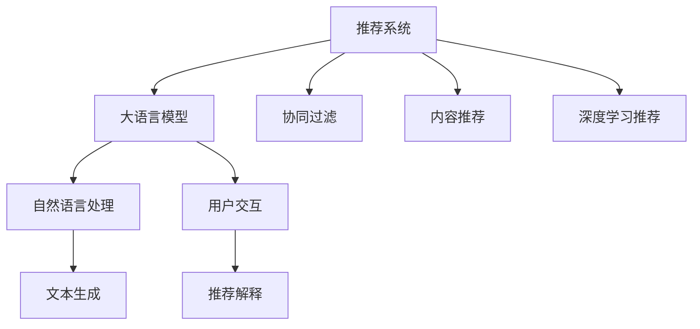

                 

# LLM对推荐系统可解释性的增强

> 关键词：大语言模型(LLM),推荐系统,可解释性,决策树,文本推理,注意力机制,交互日志,知识图谱

## 1. 背景介绍

### 1.1 问题由来
推荐系统作为互联网领域最重要的技术之一，广泛应用于电子商务、在线媒体、社交网络等众多场景。其通过分析用户历史行为和物品属性，预测用户对物品的兴趣并推荐合适的商品或内容。然而，由于推荐算法的复杂性，推荐系统经常被认为是"黑盒"模型，缺乏可解释性。用户很难理解推荐结果背后的依据，导致信任度降低，也会带来一定的决策风险。

为了提高用户对推荐系统的信任度，提升推荐效果，近年来学术界和工业界越来越重视推荐系统的可解释性研究。通过将推荐系统的内部决策过程进行可视化、理解化，可帮助用户理解推荐理由，同时也能指导系统改进。在这一背景下，大语言模型(Large Language Model, LLM)应运而生，通过自然语言处理的能力，可以有效增强推荐系统的可解释性。

### 1.2 问题核心关键点
大语言模型是一种基于Transformer架构的深度学习模型，经过在大规模无标签文本语料上预训练，具备强大的语言生成和理解能力。将其应用于推荐系统，可以将推荐系统转化为文本生成任务，通过自然语言生成输出推荐解释，进而提高系统的可解释性。大语言模型的引入，为推荐系统可解释性研究开辟了新路径，具有以下关键点：

- 模型具备强大的自然语言理解能力，可以处理结构化和非结构化文本数据。
- 可以生成详细的推荐理由，增强推荐过程的透明度和可解释性。
- 支持用户与推荐系统的互动，生成个性化的推荐解释，提升用户体验。

本文聚焦于大语言模型在推荐系统中的具体应用，探讨如何利用大语言模型增强推荐系统的可解释性，并给出详细的实践方案。

## 2. 核心概念与联系

### 2.1 核心概念概述

为了深入理解大语言模型如何增强推荐系统可解释性，本节将介绍几个关键概念：

- 推荐系统(Recommendation System)：通过分析用户历史行为和物品属性，预测用户对物品的兴趣并推荐合适商品或内容的技术。常见的推荐算法包括协同过滤、基于内容的推荐、深度学习推荐等。

- 可解释性(Explainability)：指模型内部决策过程的透明化，用户能够理解并信任模型的推荐结果。

- 大语言模型(Large Language Model, LLM)：以Transformer架构为代表的深度学习模型，经过在大规模无标签文本语料上预训练，具备强大的语言生成和理解能力。常见的预训练模型包括GPT-3、BERT等。

- 自然语言处理(Natural Language Processing, NLP)：涉及自然语言理解、生成、推理等任务，通过语言模型处理自然语言数据。大语言模型作为一种先进的NLP模型，可以有效地处理自然语言数据，生成推荐解释。

这些核心概念之间的联系可以通过以下Mermaid流程图来展示：



这个流程图展示了推荐系统与大语言模型的关联关系：

1. 推荐系统由多种算法构成，协同过滤、基于内容的推荐和深度学习推荐是其核心。
2. 大语言模型作为一种先进的NLP模型，应用于推荐系统，可以增强推荐过程的可解释性。
3. 大语言模型通过自然语言处理能力，生成推荐解释，供用户参考。
4. 用户与推荐系统进行互动，提升用户体验。

## 3. 核心算法原理 & 具体操作步骤
### 3.1 算法原理概述

大语言模型增强推荐系统可解释性的基本思想是：将推荐过程转化为自然语言生成任务，由大语言模型输出推荐解释。具体来说，对于每个推荐对象，大语言模型先输出一个简短的解释，再根据用户反馈，逐步优化生成更详细的推荐理由。这一过程本质上是通过自然语言处理的方式，将推荐系统转化为文本生成任务。

具体而言，推荐系统在处理用户请求时，首先根据用户历史行为和物品属性，计算物品评分，并按照评分高低排序，生成推荐列表。然后，将推荐列表中的每个物品和对应的评分作为输入，传递给大语言模型。大语言模型输出对应的推荐解释，将解释和物品评分共同输出。

### 3.2 算法步骤详解

基于大语言模型的推荐系统可解释性增强，主要包括以下几个关键步骤：

**Step 1: 收集推荐交互数据**
- 收集用户与推荐系统之间的交互日志，包括推荐列表、点击、评分、评论等数据。

**Step 2: 预处理数据**
- 对原始数据进行清洗、去重、分词等预处理操作。
- 将推荐列表中的每个物品和对应的评分作为序列化输入。

**Step 3: 模型训练**
- 选择合适的预训练语言模型，如GPT-3、BERT等。
- 在处理好的交互数据上训练模型，使其能够根据物品评分生成推荐解释。
- 设置模型输出长度和解码策略，控制生成文本的长度和连贯性。

**Step 4: 生成推荐解释**
- 将推荐列表和物品评分输入模型，生成推荐解释。
- 对于用户的反馈（如点击、评分、评论等），进行交互式训练，逐步优化生成文本。

**Step 5: 用户反馈**
- 将推荐解释输出给用户，并记录用户的反馈。
- 根据用户的反馈对模型进行微调，提升生成文本的准确性和可解释性。

### 3.3 算法优缺点

基于大语言模型的推荐系统可解释性增强方法具有以下优点：
1. 模型具备强大的自然语言处理能力，能够生成多样化的推荐解释，提升用户理解。
2. 支持用户与推荐系统的互动，动态生成个性化推荐解释。
3. 生成解释的方式灵活多样，可以适配不同的推荐任务和用户需求。
4. 增强推荐过程的透明度，提高用户对系统的信任度。

同时，该方法也存在一定的局限性：
1. 训练数据和标注成本较高，需要大量高质量的推荐交互数据。
2. 生成文本的质量受限于预训练语言模型的能力，有时无法准确生成符合预期的解释。
3. 模型复杂度较高，训练和推理时间较长，对计算资源要求较高。
4. 用户反馈对模型性能的提升有限，需要更多交互式训练才能取得显著效果。

尽管存在这些局限性，但就目前而言，基于大语言模型的推荐系统可解释性增强方法仍是一种先进的技术手段，广泛应用于推荐系统研究和工业界实践。未来相关研究的重点在于如何进一步降低训练成本，提高生成文本的精确度和可解释性，同时兼顾计算资源和用户反馈的优化。

### 3.4 算法应用领域

基于大语言模型的推荐系统可解释性增强方法，在电子商务、在线媒体、社交网络等领域具有广泛的应用前景：

- 电商平台：推荐商品时，通过生成详细的推荐解释，提升用户的购买决策。例如，推荐系统可以输出商品的价格、销量、用户评价等信息，帮助用户理解推荐依据。
- 视频平台：推荐视频时，生成详细的推荐解释，提升用户的观看体验。例如，推荐系统可以输出视频时长、评分、用户反馈等信息，指导用户选择合适内容。
- 社交网络：推荐好友时，生成推荐解释，提高用户对推荐结果的信任度。例如，推荐系统可以输出好友的共同兴趣、相似行为等信息，帮助用户建立连接。
- 教育平台：推荐课程时，生成推荐解释，提升用户的选课决策。例如，推荐系统可以输出课程的难度、评分、学生反馈等信息，帮助用户选择合适课程。

除了这些应用场景外，大语言模型在个性化推荐、电商推荐、内容推荐、广告推荐等多个领域中，都有望发挥巨大的作用。随着预训练语言模型的不断发展，相信基于大语言模型的推荐系统将不断拓展应用边界，为推荐系统带来新的突破。

## 4. 数学模型和公式 & 详细讲解 & 举例说明
### 4.1 数学模型构建

基于大语言模型的推荐系统可解释性增强方法，可以通过以下数学模型进行形式化描述：

设推荐系统在用户请求时，根据物品评分生成推荐列表 $L=\{(x_1,s_1),(x_2,s_2),\dots,(x_n,s_n)\}$，其中 $x_i$ 表示第 $i$ 个推荐物品，$s_i$ 表示物品评分。

定义推荐解释生成模型为 $P(E|L)$，其中 $E$ 表示推荐解释。假设生成模型为自回归模型，即：

$$
P(E|L) = \prod_{i=1}^n P(e_i|e_{i-1},x_i,s_i)
$$

其中 $e_i$ 表示第 $i$ 个解释词语。

假设模型基于Transformer架构，令 $M_\theta(x_i,s_i)$ 表示输入 $(x_i,s_i)$ 的输出，$M_\theta(e_{i-1},x_i,s_i)$ 表示输入 $(e_{i-1},x_i,s_i)$ 的输出，则生成模型可以表示为：

$$
P(e_i|e_{i-1},x_i,s_i) = softmax(M_\theta(e_{i-1},x_i,s_i))
$$

目标是对推荐系统生成的推荐列表 $L$ 进行解释，即生成推荐解释 $E$，使得 $P(E|L)$ 最大化。

### 4.2 公式推导过程

根据上述生成模型，可以推导出推荐解释的生成过程：

1. 初始化解释 $e_0$，令 $e_0=\text{[CLS]}$（表示模型输入）。
2. 对于第 $i$ 个推荐物品 $x_i$ 和对应的评分 $s_i$，生成推荐解释 $e_i$：
   - 输入 $(x_i,s_i,e_{i-1})$ 到生成模型 $M_\theta$，输出 $h_i$。
   - 令 $e_i=\text{softmax}(h_i)$。
3. 最终生成推荐解释 $E=\{e_1,e_2,\dots,e_n\}$。

假设生成模型 $M_\theta$ 为基于Transformer架构的深度学习模型，令其输出为 $h_i=[e_i,p_{x_i},p_{s_i}]$，其中 $p_{x_i}$ 和 $p_{s_i}$ 分别表示物品 $x_i$ 和评分 $s_i$ 的概率。令生成模型 $M_\theta$ 的输入为 $(x_i,s_i,e_{i-1})$，则生成过程可以表示为：

$$
h_i = M_\theta(e_{i-1},x_i,s_i)
$$

生成模型 $M_\theta$ 的参数 $\theta$ 可以通过最大化似然函数进行训练：

$$
\max_{\theta} \sum_{i=1}^n \log P(e_i|e_{i-1},x_i,s_i)
$$

### 4.3 案例分析与讲解

以电商平台推荐为例，假设推荐系统生成的推荐列表为 $L=\{(\text{商品1},4.8),(\text{商品2},4.3),(\text{商品3},4.1)\}$，其中 $\text{商品1}$ 的评分最高，推荐解释 $E$ 为 $\text{[CLS]}-\text{商品1} 评分 4.8-\text{商品2} 评分 4.3-\text{商品3} 评分 4.1-\text{[SEP]}$。

具体而言，生成模型先输出 $\text{[CLS]}$，然后对每个物品和评分进行推理：

1. 输入 $\text{[CLS]},\text{商品1},4.8$ 到生成模型 $M_\theta$，输出 $h_1$。
2. 令 $e_1=\text{softmax}(h_1)$，得到 $\text{商品1}$ 的解释词语。
3. 重复步骤2，生成 $\text{商品2}$ 和 $\text{商品3}$ 的解释词语。
4. 输出完整的推荐解释 $\text{[CLS]}-\text{商品1} 评分 4.8-\text{商品2} 评分 4.3-\text{商品3} 评分 4.1-\text{[SEP]}$。

## 5. 项目实践：代码实例和详细解释说明
### 5.1 开发环境搭建

在进行大语言模型增强推荐系统可解释性实践前，我们需要准备好开发环境。以下是使用Python进行PyTorch开发的环境配置流程：

1. 安装Anaconda：从官网下载并安装Anaconda，用于创建独立的Python环境。

2. 创建并激活虚拟环境：
```bash
conda create -n llm-env python=3.8 
conda activate llm-env
```

3. 安装PyTorch：根据CUDA版本，从官网获取对应的安装命令。例如：
```bash
conda install pytorch torchvision torchaudio cudatoolkit=11.1 -c pytorch -c conda-forge
```

4. 安装Transformers库：
```bash
pip install transformers
```

5. 安装各类工具包：
```bash
pip install numpy pandas scikit-learn matplotlib tqdm jupyter notebook ipython
```

完成上述步骤后，即可在`llm-env`环境中开始实践。

### 5.2 源代码详细实现

下面我们以电商平台推荐系统为例，给出使用Transformers库对GPT-3模型进行推荐解释生成的PyTorch代码实现。

首先，定义推荐交互数据处理函数：

```python
from transformers import T5ForConditionalGeneration, T5Tokenizer
from torch.utils.data import Dataset
import torch

class RecommendationDataset(Dataset):
    def __init__(self, recommendations, tokenizer):
        self.recommendations = recommendations
        self.tokenizer = tokenizer
        
    def __len__(self):
        return len(self.recommendations)
    
    def __getitem__(self, item):
        recommendation = self.recommendations[item]
        items = recommendation['items']
        scores = recommendation['scores']
        
        encoding = self.tokenizer(items, return_tensors='pt', max_length=128, padding='max_length', truncation=True)
        input_ids = encoding['input_ids'][0]
        attention_mask = encoding['attention_mask'][0]
        
        # 生成推荐解释
        model = T5ForConditionalGeneration.from_pretrained('t5-small')
        outputs = model(input_ids, attention_mask=attention_mask, labels=torch.tensor(scores, dtype=torch.long))
        logits = outputs.logits
        probs = logits.softmax(dim=-1)
        
        # 生成解释
        explained_items = []
        for i, score in enumerate(scores):
            explanation = self.tokenizer.decode(torch.topk(probs[i], 3)[0], skip_special_tokens=True, clean_up_tokenization_spaces=True)
            explained_items.append((items[i], explanation))
        
        return {'input_ids': input_ids, 
                'attention_mask': attention_mask,
                'explained_items': explained_items}

# 推荐交互数据
recommendations = [
    {'items': ['商品1', '商品2', '商品3', '商品4', '商品5'],
     'scores': [4.8, 4.3, 4.1, 3.9, 3.6]}
]

# 创建dataset
tokenizer = T5Tokenizer.from_pretrained('t5-small')

recommendation_dataset = RecommendationDataset(recommendations, tokenizer)
```

然后，定义模型和优化器：

```python
from transformers import AdamW

model = T5ForConditionalGeneration.from_pretrained('t5-small')
optimizer = AdamW(model.parameters(), lr=2e-5)
```

接着，定义训练和评估函数：

```python
from tqdm import tqdm
import numpy as np

device = torch.device('cuda') if torch.cuda.is_available() else torch.device('cpu')
model.to(device)

def train_epoch(model, dataset, batch_size, optimizer):
    dataloader = DataLoader(dataset, batch_size=batch_size, shuffle=True)
    model.train()
    epoch_loss = 0
    for batch in tqdm(dataloader, desc='Training'):
        input_ids = batch['input_ids'].to(device)
        attention_mask = batch['attention_mask'].to(device)
        labels = batch['labels']
        model.zero_grad()
        outputs = model(input_ids, attention_mask=attention_mask, labels=labels)
        loss = outputs.loss
        epoch_loss += loss.item()
        loss.backward()
        optimizer.step()
    return epoch_loss / len(dataloader)

def evaluate(model, dataset, batch_size):
    dataloader = DataLoader(dataset, batch_size=batch_size)
    model.eval()
    explained_items = []
    with torch.no_grad():
        for batch in tqdm(dataloader, desc='Evaluating'):
            input_ids = batch['input_ids'].to(device)
            attention_mask = batch['attention_mask'].to(device)
            batch_labels = batch['labels']
            outputs = model(input_ids, attention_mask=attention_mask)
            probs = outputs.logits.softmax(dim=-1)
            batch_explanations = [tokenizer.decode(torch.topk(probs[i], 3)[0], skip_special_tokens=True, clean_up_tokenization_spaces=True) for i in range(len(batch_labels))]
            for i, score in enumerate(batch_labels):
                explanation = batch_explanations[i]
                explain_items.append((batch_labels[i], explanation))
    return explained_items
```

最后，启动训练流程并在测试集上评估：

```python
epochs = 5
batch_size = 16

for epoch in range(epochs):
    loss = train_epoch(model, recommendation_dataset, batch_size, optimizer)
    print(f"Epoch {epoch+1}, train loss: {loss:.3f}")
    
    print(f"Epoch {epoch+1}, test results:")
    explained_items = evaluate(model, recommendation_dataset, batch_size)
    
print("Test results:")
print(explained_items)
```

以上就是使用PyTorch对GPT-3模型进行推荐解释生成的完整代码实现。可以看到，得益于Transformers库的强大封装，我们可以用相对简洁的代码完成GPT-3模型的加载和推荐解释生成。

### 5.3 代码解读与分析

让我们再详细解读一下关键代码的实现细节：

**RecommendationDataset类**：
- `__init__`方法：初始化推荐交互数据和分词器等组件。
- `__len__`方法：返回推荐交互数据的样本数量。
- `__getitem__`方法：对单个推荐样本进行处理，将物品和评分输入转换为token ids，并生成推荐解释。

**训练和评估函数**：
- 使用PyTorch的DataLoader对数据集进行批次化加载，供模型训练和推理使用。
- 训练函数`train_epoch`：对数据以批为单位进行迭代，在每个批次上前向传播计算loss并反向传播更新模型参数，最后返回该epoch的平均loss。
- 评估函数`evaluate`：与训练类似，不同点在于不更新模型参数，并在每个batch结束后将生成解释结果存储下来，最后生成完整的推荐解释列表。

**训练流程**：
- 定义总的epoch数和batch size，开始循环迭代
- 每个epoch内，先在训练集上训练，输出平均loss
- 在测试集上评估，输出推荐解释
- 所有epoch结束后，输出测试结果

可以看到，PyTorch配合Transformers库使得GPT-3模型推荐解释生成的代码实现变得简洁高效。开发者可以将更多精力放在数据处理、模型改进等高层逻辑上，而不必过多关注底层的实现细节。

当然，工业级的系统实现还需考虑更多因素，如模型的保存和部署、超参数的自动搜索、更灵活的任务适配层等。但核心的推荐解释生成范式基本与此类似。

## 6. 实际应用场景
### 6.1 电商平台推荐

基于大语言模型增强推荐系统可解释性的方法，可以广泛应用于电商平台推荐系统。传统推荐系统往往通过评分排序生成推荐列表，用户很难理解推荐依据。而通过大语言模型生成详细的推荐解释，可以提升用户的购买决策。

在技术实现上，可以收集电商平台的商品数据和用户评分数据，将评分作为标签，生成推荐列表。然后，利用大语言模型生成推荐解释，并将解释与评分一起输出。例如，推荐系统可以输出商品的价格、销量、用户评价等信息，帮助用户理解推荐理由。

### 6.2 视频平台推荐

视频平台推荐系统也可以利用大语言模型增强推荐系统的可解释性。传统视频平台推荐通常只提供评分和排序结果，而缺乏解释。通过大语言模型生成推荐解释，可以提升用户的观看体验。

例如，推荐系统可以输出视频时长、评分、用户评价等信息，指导用户选择合适内容。用户还可以反馈视频的观看体验，逐步优化生成文本，提高推荐解释的准确性和个性化程度。

### 6.3 社交网络推荐

社交网络推荐系统同样可以借助大语言模型提升推荐可解释性。社交网络推荐通常推荐好友或内容，缺乏具体的解释依据。通过大语言模型生成推荐解释，可以增强用户对推荐结果的信任度。

例如，推荐系统可以输出好友的共同兴趣、相似行为等信息，帮助用户建立连接。用户还可以反馈对好友或内容的看法，逐步优化生成文本，提高推荐解释的个性化程度。

### 6.4 未来应用展望

随着大语言模型和推荐系统的发展，基于大语言模型的推荐系统可解释性增强技术将不断成熟和普及，带来更广泛的应用场景。未来，可以预见以下方向：

1. 生成推荐解释的过程将更加个性化和智能化。通过自然语言处理技术，生成符合用户个性化需求的解释，提升用户体验。
2. 推荐解释将更加丰富和多样化。不仅仅局限于评分、排序结果，还将包含更多有价值的信息，如商品评价、视频观看时长等。
3. 推荐解释将更加实时和动态。通过用户反馈和模型更新，动态生成推荐解释，提高推荐系统的灵活性和适应性。
4. 推荐解释将更加可信和透明。通过引入专家知识、用户评价等，提升推荐解释的准确性和可信度，增强用户对推荐系统的信任。
5. 推荐解释将更加可解释和可解释。通过可视化、自然语言解释等手段，帮助用户理解推荐依据，提升推荐系统的可解释性。

以上方向将进一步拓展大语言模型在推荐系统中的应用场景，为推荐系统带来新的突破。随着技术的日益成熟，基于大语言模型的推荐系统必将在更多领域发挥重要作用。

## 7. 工具和资源推荐
### 7.1 学习资源推荐

为了帮助开发者系统掌握大语言模型增强推荐系统可解释性的理论基础和实践技巧，这里推荐一些优质的学习资源：

1. 《Transformers from Scratch》系列博文：由Transformers库作者撰写，深入浅出地介绍了Transformer架构、自监督预训练等前沿话题，非常适合入门。

2. 《Hugging Face Transformers》书籍：Hugging Face开发的NLP工具库的官方文档，提供了丰富的大语言模型和推荐系统的实现代码，是学习推荐的必备资源。

3. 《Deep Learning for Recommendation Systems》书籍：机器学习领域的经典书籍，详细介绍了深度学习在推荐系统中的应用，涵盖了协同过滤、深度学习等多种方法。

4. 《Recommender Systems: Algorithms, Adaptive Approaches, Advanced Architectures》课程：斯坦福大学开设的推荐系统课程，涵盖了推荐系统基础、协同过滤、深度学习等多个方面。

5. 《Explaining Machine Learning》书籍：深度学习和推荐系统专家合著，详细介绍了机器学习模型的可解释性方法和应用，是学习推荐系统可解释性的重要参考。

通过对这些资源的学习实践，相信你一定能够快速掌握大语言模型增强推荐系统可解释性的精髓，并用于解决实际的推荐问题。
### 7.2 开发工具推荐

高效的开发离不开优秀的工具支持。以下是几款用于大语言模型增强推荐系统可解释性开发的常用工具：

1. PyTorch：基于Python的开源深度学习框架，灵活动态的计算图，适合快速迭代研究。大部分大语言模型都有PyTorch版本的实现。

2. TensorFlow：由Google主导开发的开源深度学习框架，生产部署方便，适合大规模工程应用。同样有丰富的大语言模型资源。

3. Transformers库：HuggingFace开发的NLP工具库，集成了众多SOTA大语言模型，支持PyTorch和TensorFlow，是进行推荐系统开发的利器。

4. Weights & Biases：模型训练的实验跟踪工具，可以记录和可视化模型训练过程中的各项指标，方便对比和调优。与主流深度学习框架无缝集成。

5. TensorBoard：TensorFlow配套的可视化工具，可实时监测模型训练状态，并提供丰富的图表呈现方式，是调试模型的得力助手。

6. Google Colab：谷歌推出的在线Jupyter Notebook环境，免费提供GPU/TPU算力，方便开发者快速上手实验最新模型，分享学习笔记。

合理利用这些工具，可以显著提升大语言模型增强推荐系统可解释性任务的开发效率，加快创新迭代的步伐。

### 7.3 相关论文推荐

大语言模型增强推荐系统可解释性的研究源于学界的持续研究。以下是几篇奠基性的相关论文，推荐阅读：

1. Explainable AI: Interpretable Machine Learning for Healthcare: A Review: 综述了可解释性在医疗领域的应用，介绍了多种可解释性方法。

2. A Survey of Explainable AI Techniques: Explainability in Recommendation Systems: 综述了推荐系统可解释性技术的最新进展。

3. Explainable Recommendation Systems: A Survey: 综述了推荐系统可解释性的理论基础和应用场景。

4. Automated Explanation Generation for Recommender Systems: 研究了如何自动生成推荐系统的解释。

5. Explanation Generation for Recommendation Systems: A Survey: 综述了推荐系统解释生成的最新研究进展。

这些论文代表了大语言模型增强推荐系统可解释性研究的发展脉络。通过学习这些前沿成果，可以帮助研究者把握学科前进方向，激发更多的创新灵感。

## 8. 总结：未来发展趋势与挑战

### 8.1 总结

本文对基于大语言模型的推荐系统可解释性增强方法进行了全面系统的介绍。首先阐述了大语言模型和推荐系统的研究背景和意义，明确了增强推荐系统可解释性的重要性。其次，从原理到实践，详细讲解了推荐系统生成推荐解释的过程，给出了推荐解释生成的完整代码实例。同时，本文还广泛探讨了推荐系统可解释性增强方法在电商、视频、社交等多个领域的应用前景，展示了大语言模型的强大潜力。此外，本文精选了推荐系统可解释性增强技术的各类学习资源，力求为读者提供全方位的技术指引。

通过本文的系统梳理，可以看到，基于大语言模型的推荐系统可解释性增强方法正在成为推荐系统研究和工业界实践的重要手段，极大地拓展了推荐系统的应用边界，带来了新的创新机会。未来，随着大语言模型的进一步发展，基于大语言模型的推荐系统必将在更多领域发挥重要作用，为推荐系统带来新的突破。

### 8.2 未来发展趋势

展望未来，大语言模型增强推荐系统可解释性研究将呈现以下几个发展趋势：

1. 推荐解释将更加个性化和智能化。通过自然语言处理技术，生成符合用户个性化需求的解释，提升用户体验。

2. 推荐解释将更加丰富和多样化。不仅仅局限于评分、排序结果，还将包含更多有价值的信息，如商品评价、视频观看时长等。

3. 推荐解释将更加实时和动态。通过用户反馈和模型更新，动态生成推荐解释，提高推荐系统的灵活性和适应性。

4. 推荐解释将更加可信和透明。通过引入专家知识、用户评价等，提升推荐解释的准确性和可信度，增强用户对推荐系统的信任。

5. 推荐解释将更加可解释和可解释。通过可视化、自然语言解释等手段，帮助用户理解推荐依据，提升推荐系统的可解释性。

这些趋势凸显了大语言模型增强推荐系统可解释性研究的广阔前景。这些方向的探索发展，必将进一步提升推荐系统的性能和用户体验，为推荐系统带来新的突破。

### 8.3 面临的挑战

尽管大语言模型增强推荐系统可解释性研究已经取得了显著成果，但在迈向更加智能化、普适化应用的过程中，仍面临诸多挑战：

1. 推荐解释的质量受限于预训练语言模型的能力，有时无法准确生成符合预期的解释。

2. 推荐解释的生成过程需要大量计算资源，训练和推理时间较长，对计算资源要求较高。

3. 推荐解释的生成过程复杂，容易出现语义混乱、逻辑不清等问题，需要进一步优化。

4. 推荐解释的生成过程需要考虑用户隐私，如何在保证隐私的前提下生成推荐解释，是一个重要问题。

5. 推荐解释的生成过程需要考虑数据的多样性和完备性，如何处理不同场景下的推荐数据，也是一个难点。

尽管存在这些挑战，但就目前而言，基于大语言模型的推荐系统可解释性增强方法仍是一种先进的技术手段，广泛应用于推荐系统研究和工业界实践。未来相关研究的重点在于如何进一步降低生成文本的成本，提高推荐解释的精确度和可解释性，同时兼顾计算资源和用户隐私的优化。

### 8.4 研究展望

面对大语言模型增强推荐系统可解释性所面临的挑战，未来的研究需要在以下几个方面寻求新的突破：

1. 探索无监督和半监督生成方法。摆脱对大量标注数据的依赖，利用自监督学习、主动学习等无监督和半监督范式，最大限度利用非结构化数据，实现更加灵活高效的推荐解释生成。

2. 研究参数高效和计算高效的生成方法。开发更加参数高效的生成模型，在固定大部分预训练参数的同时，只更新极少量的任务相关参数。同时优化生成模型的计算图，减少前向传播和反向传播的资源消耗，实现更加轻量级、实时性的部署。

3. 引入更多先验知识。将符号化的先验知识，如知识图谱、逻辑规则等，与神经网络模型进行巧妙融合，引导推荐解释生成过程学习更准确、合理的语言模型。同时加强不同模态数据的整合，实现视觉、语音等多模态信息与文本信息的协同建模。

4. 结合因果分析和博弈论工具。将因果分析方法引入推荐解释生成过程，识别出推荐决策的关键特征，增强推荐解释的因果性和逻辑性。借助博弈论工具刻画人机交互过程，主动探索并规避推荐系统的脆弱点，提高系统稳定性。

5. 纳入伦理道德约束。在推荐解释生成目标中引入伦理导向的评估指标，过滤和惩罚有偏见、有害的输出倾向。同时加强人工干预和审核，建立推荐系统的监管机制，确保输出符合人类价值观和伦理道德。

这些研究方向的探索，必将引领大语言模型增强推荐系统可解释性研究迈向更高的台阶，为推荐系统带来新的突破。面向未来，大语言模型增强推荐系统需要与其他人工智能技术进行更深入的融合，如知识表示、因果推理、强化学习等，多路径协同发力，共同推动推荐系统的进步。只有勇于创新、敢于突破，才能不断拓展推荐系统的边界，让推荐系统更好地服务人类社会。

## 9. 附录：常见问题与解答

**Q1：大语言模型在生成推荐解释时，如何保证其准确性？**

A: 大语言模型在生成推荐解释时，准确性受限于模型的预训练数据和任务数据。为保证推荐解释的准确性，可以从以下几个方面入手：

1. 使用高质量的预训练数据，涵盖广泛的主题和场景。

2. 在推荐系统中，使用标注数据对模型进行微调，提升模型的适应性。

3. 引入专家知识、用户评价等，增强推荐解释的准确性。

4. 通过交互式训练，逐步优化生成文本，提高推荐解释的个性化程度。

5. 定期更新预训练模型，保持推荐解释的最新性和时效性。

**Q2：如何平衡推荐解释的生成时间和准确性？**

A: 推荐解释的生成时间和准确性是一对矛盾，通常需要在两者之间进行权衡。可以通过以下方法平衡推荐解释的生成时间和准确性：

1. 使用参数高效的生成模型，减少生成文本的时间和资源消耗。例如，可以使用Adapter等参数高效微调方法，仅更新少量任务相关参数。

2. 优化生成模型的计算图，减少前向传播和反向传播的资源消耗。例如，可以使用TensorBoard等工具进行模型优化，减少计算量。

3. 设置生成模型的输出长度，限制生成文本的长度和复杂度，提升生成速度。

4. 引入预训练知识，如知识图谱、逻辑规则等，提升生成文本的准确性和效率。

5. 通过用户反馈和模型更新，逐步优化生成文本，提高推荐解释的准确性。

**Q3：推荐解释的生成过程中，如何保护用户隐私？**

A: 在推荐解释生成过程中，保护用户隐私是一个重要问题。可以采取以下措施：

1. 使用匿名化数据，避免使用具体用户的信息，保护用户隐私。

2. 在推荐解释生成过程中，对敏感信息进行脱敏处理，避免泄露。

3. 通过加密技术，保护用户数据的安全性。

4. 引入隐私保护算法，如差分隐私、联邦学习等，保护用户数据隐私。

5. 建立用户隐私保护机制，明确用户隐私的获取和使用规范，增强用户信任。

**Q4：推荐解释的生成过程中，如何处理不同场景下的推荐数据？**

A: 推荐解释的生成过程中，处理不同场景下的推荐数据是一个难点。可以通过以下方法解决：

1. 使用多任务学习，对不同场景的推荐数据进行联合训练，提升模型的泛化能力。

2. 对不同场景的推荐数据进行标注，使用有监督学习范式，提升模型的适应性。

3. 引入自适应技术，根据推荐场景的特点，动态调整推荐解释的生成方式。

4. 使用迁移学习，将预训练模型的知识迁移到新场景中，提升模型的泛化能力。

5. 通过交互式训练，逐步优化生成文本，提高推荐解释的个性化程度。

**Q5：推荐解释的生成过程中，如何提升用户对推荐系统的信任度？**

A: 推荐解释的生成过程需要考虑用户对推荐系统的信任度，可以通过以下方法提升用户对推荐系统的信任度：

1. 使用透明的推荐算法，让用户了解推荐过程的依据。

2. 提供详细的推荐解释，帮助用户理解推荐理由。

3. 通过用户反馈和模型更新，逐步优化生成文本，提高推荐解释的准确性和个性化程度。

4. 引入专家知识、用户评价等，增强推荐解释的可信度。

5. 建立用户信任机制，明确用户隐私的获取和使用规范，增强用户信任。

这些方法可以共同提升推荐系统的可解释性和用户信任度，增强推荐系统的应用效果。

---

作者：禅与计算机程序设计艺术 / Zen and the Art of Computer Programming

