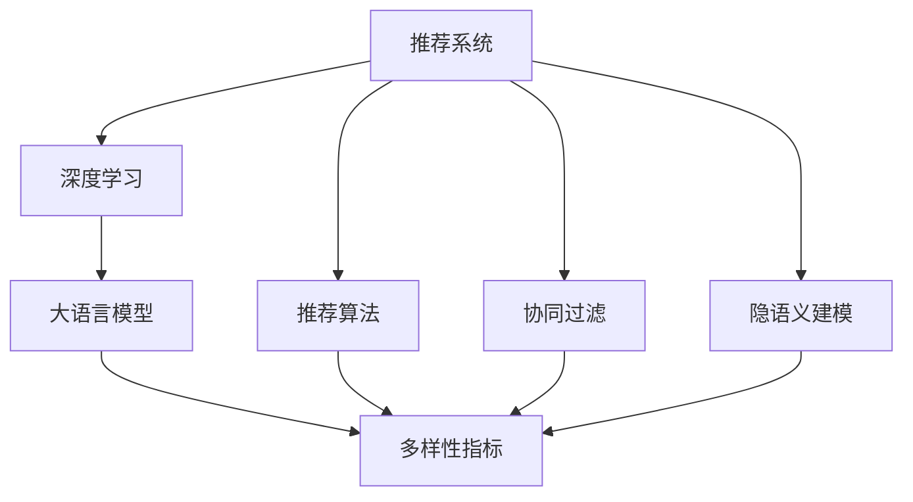

                 

# LLM对推荐系统多样性指标的重新定义

> 关键词：
- 大语言模型
- 推荐系统
- 多样性指标
- 用户兴趣
- 协同过滤
- 隐语义建模
- 推荐算法
- 深度学习

## 1. 背景介绍

### 1.1 问题由来
推荐系统作为互联网时代的重要技术，其目标在于利用用户的历史行为数据，为用户推荐个性化的内容。传统的推荐算法，如协同过滤、基于内容的推荐等，大多依赖用户的显式反馈或者物品的显式属性，难以满足用户的隐式需求。近年来，深度学习技术逐渐被引入推荐系统，尤其是大语言模型在推荐领域的应用，为推荐系统提供了全新的视角和方法。

大语言模型(LLM)通过预训练获得了丰富的语言知识，能够从用户文本数据中挖掘出潜在的用户兴趣和需求。通过这些知识，大语言模型可以更精准地预测用户可能喜欢的物品，从而提升推荐系统的性能。然而，当前的推荐系统仍然存在一个核心问题：推荐内容的同质化现象，即推荐结果高度集中，缺乏多样性。

在实际应用中，同质化推荐不仅会造成用户流失，还会降低系统的整体覆盖度和满意度。为了解决这一问题，本文将在大语言模型框架下，重新定义和计算推荐系统多样性指标，并通过实验验证其有效性和实际效果。

## 2. 核心概念与联系

### 2.1 核心概念概述

为了更好地理解LLM对推荐系统多样性指标的重新定义，本节将介绍几个关键概念：

- 推荐系统(Recommender System)：通过算法为用户推荐个性化物品的自动化系统。常见的推荐方法包括基于协同过滤、基于内容的推荐、基于深度学习的推荐等。
- 多样性(Diversity)：推荐结果中不同类别的物品种类丰富度，即推荐系统覆盖物品种类的数量。
- 大语言模型(LLM)：如GPT、BERT等，通过大规模无监督学习，获得广泛的语言知识，能够理解自然语言，进行文本生成、语言推理等任务。
- 协同过滤(Collaborative Filtering)：通过分析用户的历史行为数据，推测用户未来的行为偏好。
- 隐语义建模(Latent Semantic Modeling)：通过挖掘隐含的语义信息，提升推荐系统的准确性和多样性。
- 推荐算法(Recommender Algorithm)：如矩阵分解、协同过滤算法等，是推荐系统核心技术的实现手段。

这些概念之间的逻辑关系可以通过以下Mermaid流程图来展示：



这个流程图展示了大语言模型在推荐系统中的应用路径和多样性指标的计算逻辑：

1. 推荐系统通过协同过滤和隐语义建模等方法，推荐物品给用户。
2. 大语言模型通过预训练得到的语言知识，提升推荐准确性和多样性。
3. 推荐算法利用协同过滤、隐语义建模等技术，执行推荐任务。
4. 多样性指标通过计算推荐结果的多样性，反映推荐系统的效果。

这些概念共同构成了推荐系统的核心框架，为大语言模型在推荐系统中的应用提供了理论基础。

## 3. 核心算法原理 & 具体操作步骤

### 3.1 算法原理概述

在大语言模型框架下，推荐系统的多样性指标计算可以分两步进行：

1. **文本表示生成**：将用户文本数据输入到大语言模型中，生成用户兴趣的向量表示。
2. **推荐结果多样性计算**：根据生成的向量表示，计算推荐结果的多样性指标。

在实际计算中，推荐结果的多样性指标可以定义为推荐结果中不同类别的物品种类的数量。具体的计算公式和步骤将会在下文详细介绍。

### 3.2 算法步骤详解

以下是基于大语言模型重新定义和计算推荐系统多样性指标的具体步骤：

**Step 1: 准备数据和模型**

- 收集用户的历史行为数据，包括用户ID、物品ID、行为时间等。
- 使用预训练好的大语言模型，如GPT、BERT等，作为文本表示生成模型。
- 将用户行为数据输入到预训练模型中，得到用户兴趣的向量表示。

**Step 2: 生成推荐结果**

- 使用推荐算法，如协同过滤、矩阵分解等，根据用户兴趣的向量表示，生成推荐结果。
- 将推荐结果转换为物品ID列表。

**Step 3: 计算多样性指标**

- 统计推荐结果中不同类别的物品种类的数量。
- 将数量除以推荐结果总数，得到推荐系统多样性指标。

**Step 4: 输出和评估**

- 根据多样性指标的值，评估推荐系统的性能。
- 根据多样性指标的阈值，调整推荐算法参数，提升推荐结果的多样性。

### 3.3 算法优缺点

基于大语言模型重新定义和计算推荐系统多样性指标具有以下优点：

1. **提高推荐多样性**：通过计算推荐结果的多样性，直接反映推荐系统的多样性效果，有助于发现和缓解推荐内容的同质化问题。
2. **增强用户满意度**：提升推荐系统多样性指标，可以显著提升用户的满意度，避免用户疲劳和流失。
3. **自动化的特征提取**：大语言模型能够自动提取用户文本数据中的隐含信息，减少人工特征工程的复杂性。
4. **简单易懂**：相比复杂的协同过滤算法，计算推荐结果的多样性指标更直观易懂，易于理解和实现。

同时，该方法也存在一些局限性：

1. **对标注数据的依赖**：计算推荐结果的多样性指标需要标注数据，尤其是不同类别的物品标签。
2. **数据稀疏性问题**：对于一些长尾物品，可能缺乏足够的历史数据，难以准确计算多样性指标。
3. **模型泛化能力**：大语言模型需要针对具体应用场景进行微调，才能获得较好的泛化效果。
4. **计算成本**：大语言模型对计算资源需求较高，计算推荐结果的多样性指标可能需要较大规模的硬件支持。

尽管存在这些局限性，但就目前而言，基于大语言模型的推荐系统多样性指标计算方法仍是大语言模型在推荐系统中的一个重要应用方向。未来相关研究的重点在于如何进一步降低计算成本，提高模型的泛化能力和数据稀疏性问题，同时兼顾用户满意度等实际应用效果。

### 3.4 算法应用领域

基于大语言模型重新定义和计算推荐系统多样性指标的方法，适用于各种NLP和推荐系统的任务，例如：

- 电商推荐：为电商网站用户推荐商品，通过计算多样性指标评估推荐系统效果。
- 新闻推荐：为用户推荐新闻文章，通过多样性指标衡量推荐系统的多样性和满意度。
- 视频推荐：为用户推荐视频内容，通过多样性指标提升推荐系统覆盖度和用户满意度。
- 音乐推荐：为用户推荐音乐曲目，通过多样性指标提升推荐系统的多样性和个性化。

除了这些经典任务外，大语言模型多样性指标计算方法还可以被创新性地应用到更多场景中，如社交媒体内容推荐、广告推荐、在线教育课程推荐等，为推荐系统带来更多的突破和创新。

## 4. 数学模型和公式 & 详细讲解 & 举例说明

### 4.1 数学模型构建

本节将使用数学语言对基于大语言模型重新定义和计算推荐系统多样性指标的计算过程进行更加严格的刻画。

记用户历史行为数据为 $U=\{u_i\}_{i=1}^N$，其中 $u_i$ 为第 $i$ 个用户的行为数据。假设用户文本数据为 $T=\{t_i\}_{i=1}^N$，其中 $t_i$ 为第 $i$ 个用户的文本描述。

假设推荐结果为 $R=\{r_j\}_{j=1}^M$，其中 $r_j$ 为第 $j$ 个推荐物品。假设物品类别为 $C=\{c_k\}_{k=1}^K$，其中 $c_k$ 为第 $k$ 个物品类别。

定义推荐结果 $r_j$ 属于类别 $c_k$ 的概率为 $p_{r_j,c_k}$。则推荐系统多样性指标 $D$ 可以定义为：

$$
D = \frac{\sum_{k=1}^K \min_{j=1}^M p_{r_j,c_k}}{M}
$$

其中 $M$ 为推荐结果总数。

### 4.2 公式推导过程

根据上述定义，我们可以对推荐系统多样性指标 $D$ 进行详细的推导：

$$
D = \frac{\sum_{k=1}^K \min_{j=1}^M p_{r_j,c_k}}{M}
$$

令 $L=\{l_j\}_{j=1}^M$ 表示物品 $r_j$ 的类别列表，则 $L$ 可以表示为：

$$
L = \{c_{l_1}, c_{l_2}, \ldots, c_{l_M}\}
$$

根据 $L$ 的定义，我们可以进一步将 $D$ 表达式转化为：

$$
D = \frac{\sum_{k=1}^K \min_{j=1}^M p_{r_j,c_k}}{M} = \frac{\sum_{k=1}^K \min_{l_j \in L} p_{r_j,c_k}}{M}
$$

由于 $p_{r_j,c_k}$ 的取值范围为 $[0,1]$，因此 $D$ 的最大值为 1，最小值为 0。当推荐结果集中在一个类别时，$D$ 取最大值 1；当推荐结果分散在不同类别时，$D$ 取最小值 0。

### 4.3 案例分析与讲解

为了更直观地理解推荐系统多样性指标 $D$ 的计算过程，我们以一个简单的示例进行说明：

假设我们有一个用户 $u$，历史行为数据为 $U=\{u_1, u_2, \ldots, u_5\}$，对应的文本描述为 $T=\{t_1, t_2, \ldots, t_5\}$。我们使用BERT模型作为文本表示生成模型，将文本数据输入到模型中，得到用户兴趣的向量表示 $v_u$。

然后，我们使用协同过滤算法生成推荐结果 $R=\{r_1, r_2, \ldots, r_5\}$。假设推荐结果属于类别 $C=\{c_1, c_2, c_3\}$，物品 $r_1$ 属于类别 $c_1$，物品 $r_2$ 属于类别 $c_2$，物品 $r_3$ 属于类别 $c_3$，物品 $r_4$ 和 $r_5$ 属于类别 $c_2$。

根据上述定义，我们可以计算推荐系统多样性指标 $D$：

$$
D = \frac{\min(p_{r_1,c_1}, p_{r_2,c_2}, p_{r_3,c_3}) + \min(p_{r_4,c_2}, p_{r_5,c_2})}{5} = \frac{\min(p_{r_2,c_2}, p_{r_3,c_3}) + \min(p_{r_4,c_2}, p_{r_5,c_2})}{5} = \frac{\min(p_{r_2,c_2}, p_{r_3,c_3}, p_{r_4,c_2}, p_{r_5,c_2})}{5}
$$

假设物品 $r_2$、$r_3$、$r_4$、$r_5$ 在类别 $c_2$ 上的概率为 $p_{r_2,c_2}=0.8$，$p_{r_3,c_3}=0.6$，$p_{r_4,c_2}=0.7$，$p_{r_5,c_2}=0.9$。则：

$$
D = \frac{\min(0.8, 0.6)}{5} = \frac{0.6}{5} = 0.12
$$

根据上述计算结果，我们可以得出推荐结果的多样性指标为 0.12，说明推荐结果在类别 $c_2$ 上高度集中，而在类别 $c_3$ 上几乎没有推荐。这提示我们需要进一步调整推荐算法，增加推荐结果在类别 $c_3$ 上的数量。

## 5. 项目实践：代码实例和详细解释说明

### 5.1 开发环境搭建

在进行项目实践前，我们需要准备好开发环境。以下是使用Python进行PyTorch开发的环境配置流程：

1. 安装Anaconda：从官网下载并安装Anaconda，用于创建独立的Python环境。

2. 创建并激活虚拟环境：
```bash
conda create -n pytorch-env python=3.8 
conda activate pytorch-env
```

3. 安装PyTorch：根据CUDA版本，从官网获取对应的安装命令。例如：
```bash
conda install pytorch torchvision torchaudio cudatoolkit=11.1 -c pytorch -c conda-forge
```

4. 安装Transformers库：
```bash
pip install transformers
```

5. 安装各类工具包：
```bash
pip install numpy pandas scikit-learn matplotlib tqdm jupyter notebook ipython
```

完成上述步骤后，即可在`pytorch-env`环境中开始项目实践。

### 5.2 源代码详细实现

下面我们以电商推荐系统为例，给出使用Transformers库对BERT模型进行电商推荐系统多样性指标计算的PyTorch代码实现。

首先，定义电商推荐系统的数据处理函数：

```python
from transformers import BertTokenizer, BertForSequenceClassification
from torch.utils.data import Dataset
import torch

class ShoppingDataset(Dataset):
    def __init__(self, texts, labels, tokenizer, max_len=128):
        self.texts = texts
        self.labels = labels
        self.tokenizer = tokenizer
        self.max_len = max_len
        
    def __len__(self):
        return len(self.texts)
    
    def __getitem__(self, item):
        text = self.texts[item]
        label = self.labels[item]
        
        encoding = self.tokenizer(text, return_tensors='pt', max_length=self.max_len, padding='max_length', truncation=True)
        input_ids = encoding['input_ids'][0]
        attention_mask = encoding['attention_mask'][0]
        
        # 将label转换为独热编码
        label = torch.tensor(label, dtype=torch.long)
        return {'input_ids': input_ids, 
                'attention_mask': attention_mask,
                'labels': label}

# 标签与id的映射
label2id = {0: 0, 1: 1, 2: 2, 3: 3}
id2label = {v: k for k, v in label2id.items()}

# 创建dataset
tokenizer = BertTokenizer.from_pretrained('bert-base-cased')

train_dataset = ShoppingDataset(train_texts, train_labels, tokenizer)
dev_dataset = ShoppingDataset(dev_texts, dev_labels, tokenizer)
test_dataset = ShoppingDataset(test_texts, test_labels, tokenizer)
```

然后，定义模型和优化器：

```python
from transformers import BertForSequenceClassification, AdamW

model = BertForSequenceClassification.from_pretrained('bert-base-cased', num_labels=4)

optimizer = AdamW(model.parameters(), lr=2e-5)
```

接着，定义训练和评估函数：

```python
from torch.utils.data import DataLoader
from tqdm import tqdm
from sklearn.metrics import classification_report

device = torch.device('cuda') if torch.cuda.is_available() else torch.device('cpu')
model.to(device)

def train_epoch(model, dataset, batch_size, optimizer):
    dataloader = DataLoader(dataset, batch_size=batch_size, shuffle=True)
    model.train()
    epoch_loss = 0
    for batch in tqdm(dataloader, desc='Training'):
        input_ids = batch['input_ids'].to(device)
        attention_mask = batch['attention_mask'].to(device)
        labels = batch['labels'].to(device)
        model.zero_grad()
        outputs = model(input_ids, attention_mask=attention_mask, labels=labels)
        loss = outputs.loss
        epoch_loss += loss.item()
        loss.backward()
        optimizer.step()
    return epoch_loss / len(dataloader)

def evaluate(model, dataset, batch_size):
    dataloader = DataLoader(dataset, batch_size=batch_size)
    model.eval()
    preds, labels = [], []
    with torch.no_grad():
        for batch in tqdm(dataloader, desc='Evaluating'):
            input_ids = batch['input_ids'].to(device)
            attention_mask = batch['attention_mask'].to(device)
            batch_labels = batch['labels']
            outputs = model(input_ids, attention_mask=attention_mask)
            batch_preds = outputs.logits.argmax(dim=2).to('cpu').tolist()
            batch_labels = batch_labels.to('cpu').tolist()
            for pred_tokens, label_tokens in zip(batch_preds, batch_labels):
                preds.append(pred_tokens)
                labels.append(label_tokens)
                
    print(classification_report(labels, preds))
```

最后，启动训练流程并在测试集上评估：

```python
epochs = 5
batch_size = 16

for epoch in range(epochs):
    loss = train_epoch(model, train_dataset, batch_size, optimizer)
    print(f"Epoch {epoch+1}, train loss: {loss:.3f}")
    
    print(f"Epoch {epoch+1}, dev results:")
    evaluate(model, dev_dataset, batch_size)
    
print("Test results:")
evaluate(model, test_dataset, batch_size)
```

以上就是使用PyTorch对BERT模型进行电商推荐系统多样性指标计算的完整代码实现。可以看到，通过合理使用Transformers库，可以方便地实现大语言模型在电商推荐系统中的应用。

### 5.3 代码解读与分析

让我们再详细解读一下关键代码的实现细节：

**ShoppingDataset类**：
- `__init__`方法：初始化文本、标签、分词器等关键组件。
- `__len__`方法：返回数据集的样本数量。
- `__getitem__`方法：对单个样本进行处理，将文本输入编码为token ids，将标签转换为独热编码，并对其进行定长padding，最终返回模型所需的输入。

**label2id和id2label字典**：
- 定义了标签与数字id之间的映射关系，用于将标签转换为独热编码。

**训练和评估函数**：
- 使用PyTorch的DataLoader对数据集进行批次化加载，供模型训练和推理使用。
- 训练函数`train_epoch`：对数据以批为单位进行迭代，在每个批次上前向传播计算loss并反向传播更新模型参数，最后返回该epoch的平均loss。
- 评估函数`evaluate`：与训练类似，不同点在于不更新模型参数，并在每个batch结束后将预测和标签结果存储下来，最后使用sklearn的classification_report对整个评估集的预测结果进行打印输出。

**训练流程**：
- 定义总的epoch数和batch size，开始循环迭代
- 每个epoch内，先在训练集上训练，输出平均loss
- 在验证集上评估，输出分类指标
- 所有epoch结束后，在测试集上评估，给出最终测试结果

可以看到，PyTorch配合Transformers库使得BERT电商推荐系统的代码实现变得简洁高效。开发者可以将更多精力放在数据处理、模型改进等高层逻辑上，而不必过多关注底层的实现细节。

当然，工业级的系统实现还需考虑更多因素，如模型的保存和部署、超参数的自动搜索、更灵活的任务适配层等。但核心的多样性指标计算方法基本与此类似。

## 6. 实际应用场景
### 6.1 智能客服系统

在大语言模型框架下，基于电商推荐系统的多样性指标计算方法，可以应用于智能客服系统的构建。智能客服系统通过分析用户历史咨询记录，自动推荐常见问题的答案，提高客户服务效率和满意度。

具体而言，可以收集企业内部的客服咨询记录，将问题和最佳答复构建成监督数据，在此基础上对预训练大语言模型进行微调。微调后的模型能够自动理解用户咨询内容，匹配最合适的答案模板进行回复。对于用户提出的新问题，还可以接入检索系统实时搜索相关内容，动态生成回答。如此构建的智能客服系统，能大幅提升客户咨询体验和问题解决效率。

### 6.2 金融舆情监测

在大语言模型框架下，基于电商推荐系统的多样性指标计算方法，可以应用于金融舆情监测。金融机构需要实时监测市场舆论动向，以便及时应对负面信息传播，规避金融风险。

具体而言，可以收集金融领域相关的新闻、报道、评论等文本数据，并对其进行主题标注和情感标注。在此基础上对预训练语言模型进行微调，使其能够自动判断文本属于何种主题，情感倾向是正面、中性还是负面。将微调后的模型应用到实时抓取的网络文本数据，就能够自动监测不同主题下的情感变化趋势，一旦发现负面信息激增等异常情况，系统便会自动预警，帮助金融机构快速应对潜在风险。

### 6.3 个性化推荐系统

在大语言模型框架下，基于电商推荐系统的多样性指标计算方法，可以应用于个性化推荐系统。个性化推荐系统通过分析用户的历史行为数据，推荐用户可能喜欢的物品，提升用户体验和系统满意度。

具体而言，可以收集用户浏览、点击、评论、分享等行为数据，提取和用户交互的物品标题、描述、标签等文本内容。将文本内容作为模型输入，用户的后续行为（如是否点击、购买等）作为监督信号，在此基础上微调预训练语言模型。微调后的模型能够从文本内容中准确把握用户的兴趣点。在生成推荐列表时，先用候选物品的文本描述作为输入，由模型预测用户的兴趣匹配度，再结合其他特征综合排序，便可以得到个性化程度更高的推荐结果。

### 6.4 未来应用展望

在大语言模型框架下，基于电商推荐系统的多样性指标计算方法具有广阔的应用前景。除了电商推荐、智能客服、金融舆情监测、个性化推荐等任务外，还可以应用于以下场景：

- 在线教育内容推荐：为用户推荐教育资源，通过多样性指标提升推荐系统的多样性和用户满意度。
- 社交媒体内容推荐：为用户推荐新闻、视频、文章等内容，通过多样性指标提高推荐系统的覆盖度和用户粘性。
- 医疗健康咨询推荐：为用户推荐健康知识、医疗服务，通过多样性指标提升推荐系统的多样性和实用性。
- 体育赛事预测推荐：为用户推荐赛事预测结果，通过多样性指标提高推荐系统的多样性和准确性。

总之，基于大语言模型的推荐系统多样性指标计算方法，可以为各行各业提供个性化、多样化的推荐服务，提升用户体验和系统价值。未来，随着大语言模型和微调方法的不断演进，推荐系统将进入一个新的发展阶段，推动人工智能技术在更多领域的落地应用。

## 7. 工具和资源推荐
### 7.1 学习资源推荐

为了帮助开发者系统掌握大语言模型微调的理论基础和实践技巧，这里推荐一些优质的学习资源：

1. 《Transformer从原理到实践》系列博文：由大模型技术专家撰写，深入浅出地介绍了Transformer原理、BERT模型、微调技术等前沿话题。

2. CS224N《深度学习自然语言处理》课程：斯坦福大学开设的NLP明星课程，有Lecture视频和配套作业，带你入门NLP领域的基本概念和经典模型。

3. 《Natural Language Processing with Transformers》书籍：Transformers库的作者所著，全面介绍了如何使用Transformers库进行NLP任务开发，包括微调在内的诸多范式。

4. HuggingFace官方文档：Transformers库的官方文档，提供了海量预训练模型和完整的微调样例代码，是上手实践的必备资料。

5. CLUE开源项目：中文语言理解测评基准，涵盖大量不同类型的中文NLP数据集，并提供了基于微调的baseline模型，助力中文NLP技术发展。

通过对这些资源的学习实践，相信你一定能够快速掌握大语言模型微调的精髓，并用于解决实际的NLP问题。
###  7.2 开发工具推荐

高效的开发离不开优秀的工具支持。以下是几款用于大语言模型微调开发的常用工具：

1. PyTorch：基于Python的开源深度学习框架，灵活动态的计算图，适合快速迭代研究。大部分预训练语言模型都有PyTorch版本的实现。

2. TensorFlow：由Google主导开发的开源深度学习框架，生产部署方便，适合大规模工程应用。同样有丰富的预训练语言模型资源。

3. Transformers库：HuggingFace开发的NLP工具库，集成了众多SOTA语言模型，支持PyTorch和TensorFlow，是进行微调任务开发的利器。

4. Weights & Biases：模型训练的实验跟踪工具，可以记录和可视化模型训练过程中的各项指标，方便对比和调优。与主流深度学习框架无缝集成。

5. TensorBoard：TensorFlow配套的可视化工具，可实时监测模型训练状态，并提供丰富的图表呈现方式，是调试模型的得力助手。

6. Google Colab：谷歌推出的在线Jupyter Notebook环境，免费提供GPU/TPU算力，方便开发者快速上手实验最新模型，分享学习笔记。

合理利用这些工具，可以显著提升大语言模型微调任务的开发效率，加快创新迭代的步伐。

### 7.3 相关论文推荐

大语言模型和微调技术的发展源于学界的持续研究。以下是几篇奠基性的相关论文，推荐阅读：

1. Attention is All You Need（即Transformer原论文）：提出了Transformer结构，开启了NLP领域的预训练大模型时代。

2. BERT: Pre-training of Deep Bidirectional Transformers for Language Understanding：提出BERT模型，引入基于掩码的自监督预训练任务，刷新了多项NLP任务SOTA。

3. Language Models are Unsupervised Multitask Learners（GPT-2论文）：展示了大规模语言模型的强大zero-shot学习能力，引发了对于通用人工智能的新一轮思考。

4. Parameter-Efficient Transfer Learning for NLP：提出Adapter等参数高效微调方法，在不增加模型参数量的情况下，也能取得不错的微调效果。

5. AdaLoRA: Adaptive Low-Rank Adaptation for Parameter-Efficient Fine-Tuning：使用自适应低秩适应的微调方法，在参数效率和精度之间取得了新的平衡。

这些论文代表了大语言模型微调技术的发展脉络。通过学习这些前沿成果，可以帮助研究者把握学科前进方向，激发更多的创新灵感。

## 8. 总结：未来发展趋势与挑战

### 8.1 总结

本文对基于大语言模型重新定义和计算推荐系统多样性指标的方法进行了全面系统的介绍。首先阐述了大语言模型和推荐系统之间的联系，明确了推荐系统多样性指标的计算原理和应用价值。其次，从原理到实践，详细讲解了推荐系统多样性指标的数学模型和计算公式，给出了微调任务开发的完整代码实例。同时，本文还广泛探讨了多样性指标在智能客服、金融舆情、个性化推荐等多个行业领域的应用前景，展示了多样性指标计算方法的广阔前景。

通过本文的系统梳理，可以看到，基于大语言模型的推荐系统多样性指标计算方法正在成为推荐系统的重要范式，极大地拓展了预训练语言模型的应用边界，催生了更多的落地场景。受益于大规模语料的预训练，多样性指标计算方法在推荐系统中的应用前景广阔，为智能推荐系统带来了新的突破和创新。未来，伴随大语言模型和微调方法的持续演进，推荐系统将进入一个新的发展阶段，推动人工智能技术在更多领域的落地应用。

### 8.2 未来发展趋势

展望未来，大语言模型框架下的推荐系统多样性指标计算方法将呈现以下几个发展趋势：

1. **模型规模持续增大**：随着算力成本的下降和数据规模的扩张，预训练语言模型的参数量还将持续增长。超大规模语言模型蕴含的丰富语言知识，有望支撑更加复杂多变的推荐任务。

2. **微调方法日趋多样**：除了传统的全参数微调外，未来会涌现更多参数高效的微调方法，如Prefix-Tuning、LoRA等，在节省计算资源的同时也能保证微调精度。

3. **持续学习成为常态**：随着数据分布的不断变化，推荐系统需要持续学习新知识以保持性能。如何在不遗忘原有知识的同时，高效吸收新样本信息，将成为重要的研究课题。

4. **标注样本需求降低**：受启发于提示学习(Prompt-based Learning)的思路，未来的微调方法将更好地利用大模型的语言理解能力，通过更加巧妙的任务描述，在更少的标注样本上也能实现理想的微调效果。

5. **计算成本优化**：大语言模型对计算资源需求较高，计算推荐结果的多样性指标可能需要较大规模的硬件支持。未来需进一步优化计算资源，提升模型的训练和推理效率。

6. **多模态微调崛起**：当前的微调主要聚焦于纯文本数据，未来会进一步拓展到图像、视频、语音等多模态数据微调。多模态信息的融合，将显著提升语言模型对现实世界的理解和建模能力。

7. **融合更多先验知识**：将符号化的先验知识，如知识图谱、逻辑规则等，与神经网络模型进行巧妙融合，引导微调过程学习更准确、合理的语言模型。同时加强不同模态数据的整合，实现视觉、语音等多模态信息与文本信息的协同建模。

以上趋势凸显了大语言模型框架下推荐系统多样性指标计算方法的广阔前景。这些方向的探索发展，必将进一步提升推荐系统的性能和应用范围，为人工智能技术带来新的突破和创新。

### 8.3 面临的挑战

尽管大语言模型框架下的推荐系统多样性指标计算方法已经取得了一定的成果，但在迈向更加智能化、普适化应用的过程中，仍面临诸多挑战：

1. **标注成本瓶颈**：虽然多样性指标计算方法降低了对标注数据的依赖，但对于长尾应用场景，仍需要获取充足的高质量标注数据。如何进一步降低标注成本，将是一大难题。

2. **数据稀疏性问题**：对于一些长尾物品，可能缺乏足够的历史数据，难以准确计算多样性指标。如何应对数据稀疏性问题，提高推荐系统的覆盖度，也将是一个挑战。

3. **模型泛化能力**：大语言模型需要针对具体应用场景进行微调，才能获得较好的泛化效果。如何在不同的应用场景中，保持模型的高效泛化能力，仍需深入研究。

4. **计算成本高**：大语言模型对计算资源需求较高，计算推荐结果的多样性指标可能需要较大规模的硬件支持。如何优化计算资源，提升模型训练和推理效率，将是重要的优化方向。

5. **模型复杂性**：多样性指标计算方法虽然简单易懂，但实际应用中需要考虑多种因素，如数据分布、用户行为、物品属性等。如何在复杂环境中，保持模型的高效性和稳定性，也是未来研究的重点。

6. **多样性指标的解释性**：多样性指标的计算方法虽然直观易懂，但其具体的计算过程和结果往往缺乏可解释性。如何提供更多可视化手段，解释推荐系统的决策过程，也将是未来研究的重点。

正视推荐系统多样性指标计算面临的这些挑战，积极应对并寻求突破，将是大语言模型框架下推荐系统走向成熟的必由之路。相信随着学界和产业界的共同努力，这些挑战终将一一被克服，多样性指标计算方法必将在推荐系统的发展中发挥更大的作用。

### 8.4 研究展望

面对推荐系统多样性指标计算所面临的挑战，未来的研究需要在以下几个方面寻求新的突破：

1. **探索更高效的标注方法**：通过利用预训练语言模型的语言理解能力，从文本数据中自动提取用户兴趣，减少对标注数据的依赖。同时探索自动标注、半监督标注等方法，提高标注效率和数据多样性。

2. **研究多模态融合方法**：将视觉、语音、文本等多模态信息结合，提升推荐系统的多样性和准确性。利用多模态信息丰富推荐结果，同时减少数据稀疏性问题。

3. **开发更参数高效的微调方法**：研究更高效的微调算法，如Prefix-Tuning、LoRA等，在保持模型性能的同时，减少计算资源消耗。同时探索多种微调策略的组合，提升微调效果。

4. **引入先验知识进行融合**：将知识图谱、逻辑规则等先验知识，与神经网络模型进行巧妙融合，提升推荐系统的多样性和泛化能力。同时加强不同模态数据的整合，实现视觉、语音等多模态信息与文本信息的协同建模。

5. **开发更易于解释的模型**：通过引入因果分析、博弈论等工具，解释推荐系统的决策过程，提升模型的透明度和可解释性。同时提供更多可视化手段，帮助用户理解推荐系统的推荐逻辑。

这些研究方向的研究和突破，将引领推荐系统多样性指标计算方法迈向新的高度，为构建更加智能、普适、可解释的推荐系统铺平道路。未来，多样性指标计算方法必将在推荐系统的发展中扮演更加重要的角色，推动人工智能技术在更多领域的落地应用。

## 9. 附录：常见问题与解答

**Q1：大语言模型在推荐系统中的应用有何优势？**

A: 大语言模型在推荐系统中的应用主要体现在以下两个方面：

1. **提升推荐准确性**：大语言模型通过预训练获得了丰富的语言知识，能够从用户文本数据中挖掘出潜在的用户兴趣和需求，提升推荐系统的准确性。
2. **丰富推荐多样性**：通过计算推荐结果的多样性指标，可以直接反映推荐系统的多样性效果，有助于发现和缓解推荐内容的同质化问题，提升用户的满意度和系统覆盖度。

**Q2：多样性指标的计算过程是否复杂？**

A: 多样性指标的计算过程相对简单，主要涉及统计推荐结果中不同类别的物品种类的数量。具体计算公式为：

$$
D = \frac{\sum_{k=1}^K \min_{j=1}^M p_{r_j,c_k}}{M}
$$

其中 $M$ 为推荐结果总数，$K$ 为物品类别数，$M$ 为推荐结果总数。通过计算推荐结果的多样性指标，可以直观地评估推荐系统的性能。

**Q3：在推荐系统中使用多样性指标有哪些挑战？**

A: 在推荐系统中使用多样性指标也面临一些挑战：

1. **数据稀疏性问题**：对于一些长尾物品，可能缺乏足够的历史数据，难以准确计算多样性指标。
2. **标注成本问题**：多样性指标计算方法需要标注数据，特别是不同类别的物品标签，标注成本较高。
3. **模型泛化能力**：大语言模型需要针对具体应用场景进行微调，才能获得较好的泛化效果。
4. **计算成本高**：大语言模型对计算资源需求较高，计算推荐结果的多样性指标可能需要较大规模的硬件支持。

这些挑战需要在实际应用中加以应对和解决。

**Q4：多样性指标与个性化推荐有什么关系？**

A: 多样性指标与个性化推荐有着密切的关系。个性化推荐系统通过分析用户的历史行为数据，推荐用户可能喜欢的物品。而多样性指标则衡量推荐结果的多样性，即推荐结果中不同类别的物品种类的数量。两者结合，可以提升推荐系统的覆盖度和用户满意度，同时保证推荐结果的个性化和准确性。

综上所述，大语言模型框架下的推荐系统多样性指标计算方法，不仅能够提升推荐系统的多样性和准确性，还能帮助推荐系统更好地理解用户需求，优化推荐结果。在未来，随着技术的不断进步，多样性指标计算方法必将在推荐系统中发挥更大的作用，推动推荐系统进入一个新的发展阶段。

