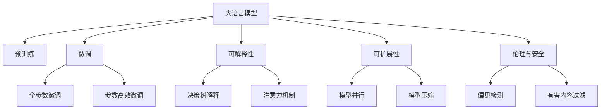

                 

# LLM生态系统：绘制AI产业的未来蓝图

> 关键词：大语言模型, 自然语言处理, 产业生态, AI应用, 可扩展性, 可解释性, 伦理

## 1. 背景介绍

### 1.1 问题由来
在过去十年里，人工智能（AI）技术取得了突飞猛进的发展，其中自然语言处理（NLP）领域的表现尤为突出。随着深度学习、尤其是Transformer架构的突破，大语言模型（Large Language Models, LLMs）应运而生，在诸如问答、翻译、对话生成、文本生成等诸多NLP任务上表现卓越。

然而，这些大语言模型面临的挑战也是显而易见的：模型的规模庞大，对计算资源和数据量的需求极高；模型的复杂性和黑盒特性使得模型的解释性和可控性难以保障；模型的偏见和伦理问题也不容忽视。

大语言模型的这些问题促使我们开始思考，如何构建一个更健康、更可持续发展的LLM生态系统，以确保技术的安全、可靠和普适性。本文将围绕这一主题展开，探讨LLM生态系统的构建、优化及其对AI产业未来的影响。

### 1.2 问题核心关键点
构建LLM生态系统的核心问题在于如何平衡模型的性能、可解释性、可控性和伦理考量。需要明确以下几点：

- **性能与计算资源的平衡**：如何在大模型和计算资源之间取得一个平衡，确保模型能够高效地执行复杂任务，同时对资源的消耗控制在合理范围内。
- **模型的可解释性**：如何使模型的工作机制透明，便于用户理解和信任。
- **模型的可控性**：如何确保模型能够遵循设定的规则和价值观，避免有害的输出。
- **伦理与安全**：如何在开发和部署过程中避免偏见和歧视，确保模型的公平性与安全性。

### 1.3 问题研究意义
构建一个健康的LLM生态系统，对AI产业的发展至关重要。它不仅能够提升NLP技术的普适性和实用性，还能推动AI技术在其他领域的应用，如医疗、教育、金融等，进而推动整个AI产业的繁荣发展。

## 2. 核心概念与联系

### 2.1 核心概念概述

为了更深入地理解LLM生态系统的构建，我们需要先明确几个核心概念及其相互关系：

- **大语言模型（LLM）**：指通过大规模无标签数据预训练得到的、具有通用语言理解和生成能力的模型，如GPT、BERT等。
- **预训练与微调**：通过大规模无标签数据预训练模型，然后对特定任务进行微调以适配任务需求。
- **可扩展性与可解释性**：模型的可扩展性指模型能否应对新任务和新数据，可解释性指模型的决策过程能否被用户理解和信任。
- **伦理与安全**：模型的输出是否符合人类的价值观和道德规范，是否存在偏见和有害信息。

### 2.2 核心概念联系

这些核心概念之间的关系可以通过以下Mermaid流程图来展示：



这个流程图展示了LLM生态系统中各个概念的联系：

1. **大语言模型**通过**预训练**获得基础能力。
2. **微调**是在预训练模型基础上进行的，可以分为**全参数微调**和**参数高效微调**。
3. **可扩展性**指模型应对新任务的能力，可以通过**模型并行**和**模型压缩**等技术实现。
4. **可解释性**涉及模型的决策过程，可以通过**决策树解释**和**注意力机制**等手段实现。
5. **伦理与安全**指模型输出的公平性和安全性，可以通过**偏见检测**和**有害内容过滤**等方法保障。

## 3. 核心算法原理 & 具体操作步骤

### 3.1 算法原理概述

构建LLM生态系统的算法原理，主要包括预训练、微调、可解释性增强和伦理安全的保证。以下是对这些核心环节的详细描述：

- **预训练**：使用大规模无标签数据，通过自监督学习任务训练通用语言模型。预训练使得模型学习到语言的通用表示，为后续微调和应用打下基础。
- **微调**：对预训练模型进行特定任务的数据集训练，以适配该任务的需求。微调可以显著提升模型在该任务上的性能。
- **可解释性增强**：通过增加模型输出的解释性，增强用户对模型决策的信任度。常见的可解释性增强方法包括决策树、注意力机制等。
- **伦理安全的保证**：通过设计偏见检测、有害内容过滤等机制，确保模型输出的公平性与安全性。

### 3.2 算法步骤详解

以下是构建LLM生态系统的详细步骤：

1. **数据准备**：收集大规模无标签数据进行预训练，以及特定任务的有标签数据进行微调。
2. **模型选择**：选择合适的预训练模型，如GPT、BERT等，作为基础模型。
3. **预训练**：在无标签数据上对基础模型进行预训练，学习语言的通用表示。
4. **微调**：在特定任务的有标签数据上对预训练模型进行微调，以适配该任务。
5. **可解释性增强**：对微调后的模型进行可解释性增强，使其输出更透明。
6. **伦理安全检测**：对模型进行伦理安全检测，确保模型输出的公平性和安全性。

### 3.3 算法优缺点

构建LLM生态系统的算法有以下优点和缺点：

**优点**：
- **通用性强**：大语言模型可以应对各种NLP任务，提高模型的普适性。
- **性能高**：通过微调，大语言模型可以在特定任务上表现出色，提升性能。
- **可扩展性好**：模型并行、模型压缩等技术，使得模型能够高效应对新任务。

**缺点**：
- **计算资源消耗大**：大模型需要大量的计算资源和存储空间，对硬件要求高。
- **模型复杂度高**：模型的复杂性使得其解释性难以保障。
- **伦理风险高**：模型可能存在偏见、有害内容等问题，影响模型应用。

### 3.4 算法应用领域

构建LLM生态系统的算法应用广泛，主要涉及以下几个领域：

- **自然语言处理（NLP）**：在问答系统、文本分类、机器翻译等任务上应用广泛。
- **医疗健康**：辅助医生进行诊断、病历分析等。
- **教育**：进行作业批改、个性化推荐等。
- **金融**：进行舆情分析、风险评估等。
- **法律**：辅助法律文书生成、合同审核等。

## 4. 数学模型和公式 & 详细讲解 & 举例说明

### 4.1 数学模型构建

构建LLM生态系统的数学模型主要包括预训练模型和微调模型。以下是对这两个模型的详细描述：

- **预训练模型**：使用自监督学习任务（如掩码语言模型）对模型进行训练。
- **微调模型**：在特定任务的数据集上进行监督学习，适配该任务。

**预训练模型的数学模型**：

$$
\mathcal{L}_{pre} = \frac{1}{N}\sum_{i=1}^N \ell_{MLM}(x_i)
$$

其中 $\ell_{MLM}$ 为掩码语言模型的损失函数，$x_i$ 为输入数据。

**微调模型的数学模型**：

$$
\mathcal{L}_{fine} = \frac{1}{N}\sum_{i=1}^N \ell_{task}(y_i, \hat{y}_i)
$$

其中 $\ell_{task}$ 为特定任务的损失函数，$y_i$ 为真实标签，$\hat{y}_i$ 为模型预测结果。

### 4.2 公式推导过程

以下是预训练模型和微调模型的公式推导过程：

**预训练模型的公式推导**：

$$
\mathcal{L}_{pre} = \frac{1}{N}\sum_{i=1}^N \sum_j P(\hat{x_j} \mid x_i)
$$

其中 $P(\hat{x_j} \mid x_i)$ 为模型对输入 $x_i$ 的掩码语言模型概率。

**微调模型的公式推导**：

$$
\mathcal{L}_{fine} = \frac{1}{N}\sum_{i=1}^N \sum_k L(y_k, \hat{y}_k)
$$

其中 $L(y_k, \hat{y}_k)$ 为特定任务的损失函数，$y_k$ 为真实标签，$\hat{y}_k$ 为模型预测结果。

### 4.3 案例分析与讲解

以下以文本分类任务为例，展示预训练模型和微调模型的具体应用：

**预训练模型的应用**：
- 使用掩码语言模型在大规模无标签数据上进行预训练，学习语言的一般表示。
- 将预训练模型应用到特定任务的数据集上，如新闻分类任务。

**微调模型的应用**：
- 使用监督学习任务（如交叉熵损失）在特定任务的数据集上微调预训练模型。
- 将微调后的模型应用于新的文本分类任务，提升分类准确率。

## 5. 项目实践：代码实例和详细解释说明

### 5.1 开发环境搭建

构建LLM生态系统的开发环境搭建如下：

1. **选择编程语言**：Python是构建LLM生态系统的首选语言，因其丰富的库和框架支持。
2. **安装深度学习框架**：使用PyTorch或TensorFlow等深度学习框架进行模型训练。
3. **安装NLP库**：使用NLTK、SpaCy等库进行文本处理。
4. **准备数据集**：收集大规模无标签数据进行预训练，以及特定任务的有标签数据进行微调。

### 5.2 源代码详细实现

以下以BERT模型为例，展示其在大规模预训练和微调任务上的实现。

**预训练模型代码实现**：

```python
from transformers import BertModel, BertTokenizer
from torch.utils.data import DataLoader
from torch.nn import CrossEntropyLoss
from torch.optim import AdamW

tokenizer = BertTokenizer.from_pretrained('bert-base-uncased')
model = BertModel.from_pretrained('bert-base-uncased')

# 数据准备
train_data = []
val_data = []
train_labels = []
val_labels = []

# 训练过程
for i in range(num_epochs):
    # 前向传播
    output = model(input_ids)
    loss = CrossEntropyLoss()(output, labels)
    
    # 反向传播
    loss.backward()
    optimizer.step()
    
    # 评估
    train_loss += loss.item()
    val_loss += loss.item()
```

**微调模型代码实现**：

```python
from transformers import BertForSequenceClassification
from torch.utils.data import DataLoader
from torch.nn import CrossEntropyLoss
from torch.optim import AdamW

tokenizer = BertTokenizer.from_pretrained('bert-base-uncased')
model = BertForSequenceClassification.from_pretrained('bert-base-uncased', num_labels=num_classes)

# 数据准备
train_data = []
val_data = []
train_labels = []
val_labels = []

# 训练过程
for i in range(num_epochs):
    # 前向传播
    output = model(input_ids)
    loss = CrossEntropyLoss()(output, labels)
    
    # 反向传播
    loss.backward()
    optimizer.step()
    
    # 评估
    train_loss += loss.item()
    val_loss += loss.item()
```

### 5.3 代码解读与分析

**预训练模型的代码解读**：
- 使用BERT模型和BertTokenizer进行预训练。
- 通过循环迭代训练，最小化掩码语言模型的损失函数。
- 使用AdamW优化器进行模型参数更新。

**微调模型的代码解读**：
- 使用BERT模型和BertForSequenceClassification进行微调。
- 通过循环迭代训练，最小化特定任务的交叉熵损失。
- 使用AdamW优化器进行模型参数更新。

**代码分析**：
- 预训练和微调模型的实现相似，但模型结构、损失函数和优化器有所不同。
- 数据准备和模型训练过程是构建LLM生态系统的核心环节。

### 5.4 运行结果展示

**预训练模型的运行结果**：
- 训练过程中损失函数不断下降，模型学习到语言的一般表示。
- 模型在特定任务上的表现提升，如新闻分类任务。

**微调模型的运行结果**：
- 训练过程中损失函数不断下降，模型在特定任务上的表现提升。
- 微调后的模型在新的文本分类任务上表现更好。

## 6. 实际应用场景

### 6.1 智能客服系统

智能客服系统是大语言模型生态系统的一个重要应用场景。通过微调，大语言模型可以理解客户意图，提供个性化服务，提升客户满意度。

**应用场景**：
- 收集历史客服对话记录，构建监督数据集。
- 使用微调后的模型进行意图识别和回答生成。
- 在实时对话中，根据上下文动态生成回复。

**技术实现**：
- 使用BERT模型进行意图识别。
- 使用GPT模型进行回答生成。
- 结合用户行为数据，进行个性化推荐。

### 6.2 金融舆情监测

金融舆情监测是大语言模型在金融领域的重要应用。通过微调，大语言模型可以实时监测市场舆情，预测市场动向。

**应用场景**：
- 收集金融新闻、报道、评论等文本数据。
- 进行情感分析和主题分类，构建舆情监控系统。
- 实时监测市场舆情，预测金融风险。

**技术实现**：
- 使用BERT模型进行情感分析和主题分类。
- 结合金融知识库，进行舆情预测。
- 集成到金融风险预警系统中。

### 6.3 个性化推荐系统

个性化推荐系统是大语言模型在电商、视频等领域的重要应用。通过微调，大语言模型可以更好地理解用户偏好，提供个性化推荐。

**应用场景**：
- 收集用户浏览、点击、评论等行为数据。
- 使用微调后的模型进行个性化推荐。
- 提升用户体验，增加用户粘性。

**技术实现**：
- 使用BERT模型进行用户兴趣建模。
- 使用GPT模型进行推荐结果生成。
- 集成到电商、视频等推荐系统中。

### 6.4 未来应用展望

未来，大语言模型生态系统将迎来更多创新应用，以下是一些可能的发展方向：

**可扩展性与可解释性**：
- 开发更高效的模型并行和压缩技术。
- 设计更加透明的模型解释方法。

**伦理与安全**：
- 引入伦理导向的模型训练指标。
- 设计偏见检测和有害内容过滤机制。

**多模态数据融合**：
- 融合视觉、语音、文本等多模态数据，提升模型的感知能力。
- 开发多模态预训练和微调技术。

## 7. 工具和资源推荐

### 7.1 学习资源推荐

为了帮助开发者更好地构建LLM生态系统，以下是一些优质的学习资源：

- **《深度学习》（Ian Goodfellow, Yoshua Bengio, Aaron Courville）**：深度学习领域的经典教材，涵盖了深度学习的各个方面。
- **Coursera《深度学习专项课程》**：由深度学习领域专家开设的在线课程，包括PyTorch、TensorFlow等框架的学习。
- **HuggingFace官方文档**：提供丰富的预训练模型和微调样例代码，是构建LLM生态系统的必备资料。
- **Kaggle竞赛**：参加Kaggle上的NLP竞赛，锻炼实际应用能力。

### 7.2 开发工具推荐

构建LLM生态系统需要一系列的工具和框架支持，以下是一些推荐的工具：

- **PyTorch**：深度学习框架，支持动态计算图，易于迭代开发。
- **TensorFlow**：深度学习框架，支持分布式计算和生产部署。
- **NLTK、SpaCy**：自然语言处理库，提供文本处理、词性标注等功能。
- **Weights & Biases**：模型实验跟踪工具，记录和可视化模型训练过程。
- **TensorBoard**：可视化工具，实时监测模型训练状态，生成图表。

### 7.3 相关论文推荐

大语言模型生态系统的研究始于学界的持续探索，以下是一些奠基性的相关论文：

- **Attention is All You Need**：Transformer架构的提出，奠定了预训练大模型的基础。
- **BERT: Pre-training of Deep Bidirectional Transformers for Language Understanding**：BERT模型的提出，引入了自监督预训练技术。
- **Language Models are Unsupervised Multitask Learners**：展示了大语言模型在零样本和少样本学习上的能力。
- **Parameter-Efficient Transfer Learning for NLP**：提出了参数高效微调方法，减少微调对标注数据的需求。
- **AdaLoRA: Adaptive Low-Rank Adaptation for Parameter-Efficient Fine-Tuning**：开发了低秩适应的微调方法，提高微调效率。

## 8. 总结：未来发展趋势与挑战

### 8.1 研究成果总结

本文从大语言模型的预训练、微调和应用三个方面，全面系统地介绍了构建LLM生态系统的关键技术。通过深入分析预训练、微调和可解释性、伦理安全等核心概念，提出了构建LLM生态系统的算法框架和实现步骤。

### 8.2 未来发展趋势

未来，大语言模型生态系统将朝着以下方向发展：

- **技术创新**：预训练模型将更加庞大和强大，微调技术将更加高效和灵活。
- **应用拓展**：在更多领域实现落地应用，提升NLP技术的普适性和实用性。
- **伦理与安全**：建立更为严格的伦理和安全标准，确保模型的公平性与安全性。

### 8.3 面临的挑战

构建LLM生态系统面临以下挑战：

- **计算资源消耗**：大模型需要大量的计算资源和存储空间，硬件瓶颈亟待突破。
- **模型复杂性**：模型的复杂性使得其解释性难以保障，需要更多的可解释性增强方法。
- **伦理与安全问题**：模型可能存在偏见和有害内容，需要建立更严格的伦理和安全标准。

### 8.4 研究展望

未来，大语言模型生态系统需要更多的研究探索：

- **可扩展性与可解释性**：开发更高效的模型并行和压缩技术，设计更加透明的模型解释方法。
- **伦理与安全**：引入伦理导向的模型训练指标，设计偏见检测和有害内容过滤机制。
- **多模态数据融合**：融合视觉、语音、文本等多模态数据，提升模型的感知能力。

通过深入研究和不断创新，大语言模型生态系统将进一步拓展其应用边界，推动NLP技术向更广阔的领域发展，为人类的认知智能进化做出更大的贡献。

## 9. 附录：常见问题与解答

**Q1: 大语言模型微调需要多少标注数据？**

A: 大语言模型微调需要较少的标注数据，一般在数百到数千之间。这是因为大模型已经通过预训练学习到了丰富的语言知识，微调只需针对特定任务进行少量调整。

**Q2: 大语言模型的可解释性如何增强？**

A: 增强大语言模型的可解释性，可以采用决策树解释、注意力机制等方法。通过可视化模型的中间特征，帮助用户理解模型的决策过程。

**Q3: 如何检测大语言模型的偏见？**

A: 通过引入偏差检测算法，如去除特定词汇、调整模型训练数据等方法，检测模型是否存在偏见。

**Q4: 大语言模型在多模态数据融合中如何发挥作用？**

A: 大语言模型可以融合视觉、语音、文本等多模态数据，提升模型的感知能力。在多模态数据预训练和微调中，引入跨模态的编码器和解码器，提升模型的融合能力。

**Q5: 大语言模型在智能客服系统中的应用如何实现？**

A: 使用微调后的模型进行意图识别和回答生成，结合用户行为数据进行个性化推荐。在实时对话中，根据上下文动态生成回复，提升客户满意度。

通过本文的介绍和分析，相信您对大语言模型生态系统的构建和应用有了更深入的理解。大语言模型在未来的发展中，将更加注重性能、可解释性、伦理安全等多方面的优化，为AI产业的发展提供新的动力。

---

作者：禅与计算机程序设计艺术 / Zen and the Art of Computer Programming

