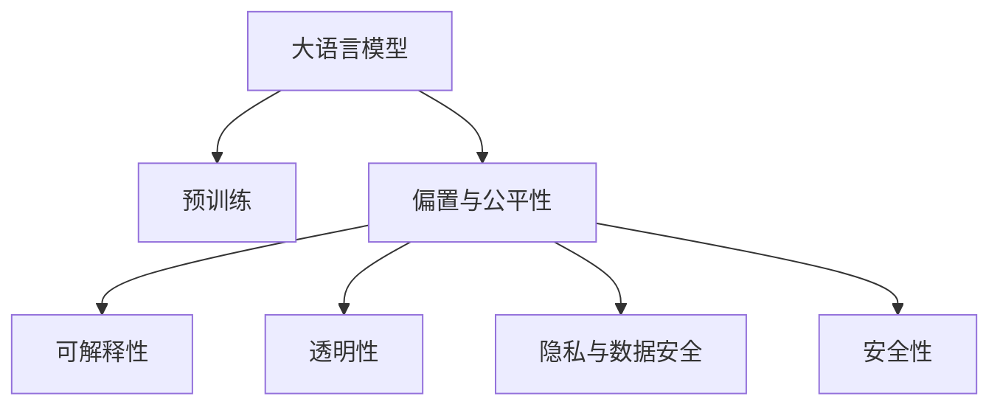

                 

## 1. 背景介绍

人工智能(AI)技术，尤其是大语言模型(Large Language Model, LLM)，已经在各个领域展现出巨大的应用潜力。然而，伴随其快速发展，伦理问题也随之显现，愈发受到广泛关注。特别是在自然语言处理(Natural Language Processing, NLP)和AI伦理领域，如何确保大语言模型的公正性、透明性和可解释性，成为一个亟待解决的难题。

### 1.1 问题由来

LLM作为一种先进的AI技术，通过大规模无监督学习获得语言能力，但同时也存在显著的伦理风险：

- **偏置与歧视**：由于训练数据本身可能存在偏见，LLM有可能继承并放大这些偏见，导致性别、种族、年龄等方面的歧视。
- **隐私与数据安全**：LLM的训练依赖大量文本数据，这些数据可能包含敏感信息，如何保护隐私、防止数据滥用是一个重要问题。
- **透明性与可解释性**：大模型往往被视为"黑盒"，难以理解其内部机制和决策逻辑，这导致应用场景下缺乏信任和透明度。
- **安全性与可靠性**：大模型的生成结果可能存在误导性、有害性，甚至被用于恶意用途，对用户和社会造成风险。

这些问题的存在，要求我们在开发和应用LLM时，必须高度重视其伦理属性，进行全面考虑和系统设计。

## 2. 核心概念与联系

### 2.1 核心概念概述

为更好理解LLM的伦理问题，本节将介绍几个关键概念：

- **大语言模型(LLM)**：以自回归(如GPT)或自编码(如BERT)模型为代表的大规模预训练语言模型。通过在大规模无标签文本语料上进行预训练，学习通用语言表示，具备强大的语言理解和生成能力。

- **预训练(Pre-training)**：指在大规模无标签文本语料上，通过自监督学习任务训练通用语言模型的过程。常见的预训练任务包括掩码语言模型、对比学习等。

- **偏置(Bias)**：指模型在训练过程中，由于数据样本不平衡、语言习惯等客观原因，导致的对某些类别的倾向性预测。

- **公平性(Fairness)**：指模型对所有用户、群体的公正对待，避免对某些群体产生不公平的输出。

- **可解释性(Explainability)**：指模型能够清晰地解释其决策依据和推理过程，使应用方和用户对模型结果有信任感。

- **透明性(Transparency)**：指模型的设计思路、参数配置、训练过程、决策逻辑等应公开透明，便于审查和监督。

- **隐私与数据安全(Privacy and Data Security)**：指在数据采集、处理、存储和传输过程中，保护用户隐私，防止数据泄露和滥用。

- **安全性(Security)**：指模型在生成和推理过程中，避免输出有害信息，防止被恶意利用。

这些核心概念之间的逻辑关系可以通过以下Mermaid流程图来展示：



这个流程图展示了大语言模型的核心概念及其与伦理问题的关联：

1. 大语言模型通过预训练获得基础能力。
2. 预训练过程中可能引入偏置，需关注公平性。
3. 模型的透明性和可解释性对应用场景至关重要。
4. 隐私与数据安全需从模型训练、使用全流程进行考虑。
5. 模型的安全性应确保输出无害，避免恶意应用。

这些概念共同构成了LLM伦理问题的研究框架，有助于我们在技术实践中全面考虑各种伦理风险。

## 3. 核心算法原理 & 具体操作步骤
### 3.1 算法原理概述

在探讨LLM的伦理问题时，我们需关注其从预训练到微调，再到应用部署的全流程。基于监督学习的微调是LLM伦理问题的一个重要环节，其算法原理和操作步骤如下：

- **预训练**：通过大规模无标签文本数据，利用自监督任务学习语言表示。
- **微调**：使用下游任务的小规模有标签数据，通过有监督学习调整模型以适应特定任务。
- **部署**：将微调后的模型应用于实际场景，进行推理和生成。

这些步骤中，模型如何学习、调整、应用，其结果如何影响伦理属性，均需要深入探讨。

### 3.2 算法步骤详解

在微调过程中，需注意以下关键步骤：

**Step 1: 收集和准备数据集**
- 确保标注数据的多样性和代表性，避免数据偏差。
- 数据集应涵盖不同背景、群体、语言习惯，以减少模型偏见。

**Step 2: 设计任务适配层**
- 设计合适的输出层和损失函数，确保模型能够理解任务语义。
- 使用公平性指标监控模型输出，确保对所有群体的公正对待。

**Step 3: 选择模型和优化器**
- 选择合适的预训练模型和优化器，考虑模型大小、参数量、计算资源等。
- 使用正则化技术防止过拟合，增强模型鲁棒性。

**Step 4: 执行梯度训练**
- 进行前向传播和反向传播，最小化损失函数。
- 周期性评估模型性能，调整超参数，确保模型公平性和可解释性。

**Step 5: 测试和部署**
- 在测试集上评估模型性能，确保输出准确、公正。
- 将模型部署到实际应用中，进行实时推理和生成。

### 3.3 算法优缺点

基于监督学习的大语言模型微调方法具有以下优点：

1. **快速适应**：微调过程可以快速适应特定任务，提高模型性能。
2. **参数灵活**：通过参数高效微调，可以保留预训练权重，减小计算成本。
3. **鲁棒性强**：正则化技术可提高模型鲁棒性，减少过拟合风险。

但同样存在一些局限：

1. **数据依赖**：微调效果高度依赖标注数据，获取高质量数据成本高。
2. **泛化能力**：当数据分布与预训练数据差异较大时，泛化性能可能下降。
3. **可解释性差**：黑盒模型难以解释其内部决策过程，缺乏透明度。

这些问题在开发和使用大语言模型时，必须全面考虑和规避。

### 3.4 算法应用领域

基于监督学习的大语言模型微调方法，在NLP领域已广泛应用于多个应用场景，包括：

- **问答系统**：通过微调使模型能够理解自然语言问题，并提供准确答案。
- **对话系统**：优化模型对话能力，使其能够与用户自然交互。
- **情感分析**：训练模型识别和分类文本中的情感倾向。
- **翻译系统**：使用微调模型将源语言文本翻译为目标语言。
- **命名实体识别**：识别文本中的特定实体，如人名、地名、机构名等。
- **机器阅读理解**：训练模型从文本中抽取关键信息，回答特定问题。

这些应用场景中，微调模型的伦理问题尤为凸显，需要系统性地考虑模型的公平性、透明性、隐私保护和安全性。

## 4. 数学模型和公式 & 详细讲解
### 4.1 数学模型构建

假设预训练模型为 $M_{\theta}$，使用下游任务 $T$ 的标注数据集 $D=\{(x_i,y_i)\}_{i=1}^N$，其中 $x_i$ 为输入文本，$y_i$ 为标签。微调的目标是最小化经验风险 $\mathcal{L}(\theta)$：

$$
\mathcal{L}(\theta) = \frac{1}{N} \sum_{i=1}^N \ell(M_{\theta}(x_i),y_i)
$$

其中 $\ell$ 为交叉熵损失函数，具体形式为：

$$
\ell(M_{\theta}(x),y) = -y \log M_{\theta}(x) - (1-y) \log (1-M_{\theta}(x))
$$

在微调过程中，需通过梯度下降等优化算法更新参数 $\theta$，使得模型输出 $M_{\theta}(x)$ 与真实标签 $y_i$ 的差异最小化。

### 4.2 公式推导过程

对于二分类任务，微调的优化目标为：

$$
\theta^* = \mathop{\arg\min}_{\theta} \mathcal{L}(\theta)
$$

其梯度更新公式为：

$$
\theta \leftarrow \theta - \eta \nabla_{\theta}\mathcal{L}(\theta)
$$

其中 $\eta$ 为学习率，$\nabla_{\theta}\mathcal{L}(\theta)$ 为损失函数对参数 $\theta$ 的梯度。在训练过程中，通过前向传播计算模型输出 $M_{\theta}(x_i)$，计算损失函数 $\ell(M_{\theta}(x_i),y_i)$，并反向传播更新参数 $\theta$。

## 5. 项目实践：代码实例和详细解释说明
### 5.1 开发环境搭建

在进行LLM的伦理问题实践前，我们需要准备好开发环境。以下是使用Python进行PyTorch开发的环境配置流程：

1. 安装Anaconda：从官网下载并安装Anaconda，用于创建独立的Python环境。

2. 创建并激活虚拟环境：
```bash
conda create -n pytorch-env python=3.8 
conda activate pytorch-env
```

3. 安装PyTorch：根据CUDA版本，从官网获取对应的安装命令。例如：
```bash
conda install pytorch torchvision torchaudio cudatoolkit=11.1 -c pytorch -c conda-forge
```

4. 安装Transformers库：
```bash
pip install transformers
```

5. 安装各类工具包：
```bash
pip install numpy pandas scikit-learn matplotlib tqdm jupyter notebook ipython
```

完成上述步骤后，即可在`pytorch-env`环境中开始LLM的伦理问题实践。

### 5.2 源代码详细实现

以下以二分类任务为例，给出使用Transformers库进行LLM的偏置检测和公平性提升的PyTorch代码实现。

首先，定义二分类任务的数据处理函数：

```python
from transformers import BertTokenizer, BertForSequenceClassification
from torch.utils.data import Dataset
import torch

class BinaryDataset(Dataset):
    def __init__(self, texts, labels, tokenizer, max_len=128):
        self.texts = texts
        self.labels = labels
        self.tokenizer = tokenizer
        self.max_len = max_len
        
    def __len__(self):
        return len(self.texts)
    
    def __getitem__(self, item):
        text = self.texts[item]
        label = self.labels[item]
        
        encoding = self.tokenizer(text, return_tensors='pt', max_length=self.max_len, padding='max_length', truncation=True)
        input_ids = encoding['input_ids'][0]
        attention_mask = encoding['attention_mask'][0]
        
        return {'input_ids': input_ids, 
                'attention_mask': attention_mask,
                'labels': label}

# 创建dataset
tokenizer = BertTokenizer.from_pretrained('bert-base-cased')

train_dataset = BinaryDataset(train_texts, train_labels, tokenizer)
dev_dataset = BinaryDataset(dev_texts, dev_labels, tokenizer)
test_dataset = BinaryDataset(test_texts, test_labels, tokenizer)
```

然后，定义模型和优化器：

```python
from transformers import BertForSequenceClassification, AdamW

model = BertForSequenceClassification.from_pretrained('bert-base-cased', num_labels=2)

optimizer = AdamW(model.parameters(), lr=2e-5)
```

接着，定义训练和评估函数：

```python
from torch.utils.data import DataLoader
from tqdm import tqdm
from sklearn.metrics import classification_report

device = torch.device('cuda') if torch.cuda.is_available() else torch.device('cpu')
model.to(device)

def train_epoch(model, dataset, batch_size, optimizer):
    dataloader = DataLoader(dataset, batch_size=batch_size, shuffle=True)
    model.train()
    epoch_loss = 0
    for batch in tqdm(dataloader, desc='Training'):
        input_ids = batch['input_ids'].to(device)
        attention_mask = batch['attention_mask'].to(device)
        labels = batch['labels'].to(device)
        model.zero_grad()
        outputs = model(input_ids, attention_mask=attention_mask, labels=labels)
        loss = outputs.loss
        epoch_loss += loss.item()
        loss.backward()
        optimizer.step()
    return epoch_loss / len(dataloader)

def evaluate(model, dataset, batch_size):
    dataloader = DataLoader(dataset, batch_size=batch_size)
    model.eval()
    preds, labels = [], []
    with torch.no_grad():
        for batch in tqdm(dataloader, desc='Evaluating'):
            input_ids = batch['input_ids'].to(device)
            attention_mask = batch['attention_mask'].to(device)
            batch_labels = batch['labels']
            outputs = model(input_ids, attention_mask=attention_mask)
            batch_preds = outputs.logits.argmax(dim=1).to('cpu').tolist()
            batch_labels = batch_labels.to('cpu').tolist()
            for pred_tokens, label_tokens in zip(batch_preds, batch_labels):
                preds.append(pred_tokens[:len(label_tokens)])
                labels.append(label_tokens)
                
    print(classification_report(labels, preds))
```

最后，启动训练流程并在测试集上评估：

```python
epochs = 5
batch_size = 16

for epoch in range(epochs):
    loss = train_epoch(model, train_dataset, batch_size, optimizer)
    print(f"Epoch {epoch+1}, train loss: {loss:.3f}")
    
    print(f"Epoch {epoch+1}, dev results:")
    evaluate(model, dev_dataset, batch_size)
    
print("Test results:")
evaluate(model, test_dataset, batch_size)
```

以上就是使用PyTorch对BERT进行二分类任务微调的完整代码实现。可以看到，在微调过程中，需特别关注模型的公平性问题。

### 5.3 代码解读与分析

让我们再详细解读一下关键代码的实现细节：

**BinaryDataset类**：
- `__init__`方法：初始化文本、标签、分词器等关键组件。
- `__len__`方法：返回数据集的样本数量。
- `__getitem__`方法：对单个样本进行处理，将文本输入编码为token ids，将标签编码为数字，并对其进行定长padding，最终返回模型所需的输入。

**公平性提升**：
- 在训练过程中，使用公平性指标监控模型输出，确保对所有群体的公正对待。例如，可以引入一些统计指标，如性别、年龄、种族等，来检测模型在各群体上的表现，并采用重新加权、引入对抗样本等策略，优化模型输出。

**模型训练**：
- 使用PyTorch的DataLoader对数据集进行批次化加载，供模型训练和推理使用。
- 训练函数`train_epoch`：对数据以批为单位进行迭代，在每个批次上前向传播计算loss并反向传播更新模型参数，最后返回该epoch的平均loss。
- 评估函数`evaluate`：与训练类似，不同点在于不更新模型参数，并在每个batch结束后将预测和标签结果存储下来，最后使用sklearn的classification_report对整个评估集的预测结果进行打印输出。

**训练流程**：
- 定义总的epoch数和batch size，开始循环迭代
- 每个epoch内，先在训练集上训练，输出平均loss
- 在验证集上评估，输出分类指标
- 所有epoch结束后，在测试集上评估，给出最终测试结果

可以看到，LLM的微调过程不仅需要关注性能提升，还需深入考虑模型的公平性和可解释性。

## 6. 实际应用场景
### 6.1 智能客服系统

在智能客服系统中，LLM需确保对不同用户的公平对待。具体而言，可以收集企业内部的历史客服对话记录，将问题和最佳答复构建成监督数据，在此基础上对预训练对话模型进行微调。微调后的对话模型能够自动理解用户意图，匹配最合适的答案模板进行回复。对于客户提出的新问题，还可以接入检索系统实时搜索相关内容，动态组织生成回答。这样构建的智能客服系统，能够更好地服务各类用户，避免因偏见导致的服务歧视。

### 6.2 金融舆情监测

在金融舆情监测中，LLM需确保对各类金融信息的公正处理。具体而言，可以收集金融领域相关的新闻、报道、评论等文本数据，并对其进行主题标注和情感标注。在此基础上对预训练语言模型进行微调，使其能够自动判断文本属于何种主题，情感倾向是正面、中性还是负面。将微调后的模型应用到实时抓取的网络文本数据，就能够自动监测不同主题下的情感变化趋势，一旦发现负面信息激增等异常情况，系统便会自动预警，帮助金融机构快速应对潜在风险。

### 6.3 个性化推荐系统

在个性化推荐系统中，LLM需确保对各类用户推荐的公正性。具体而言，可以收集用户浏览、点击、评论、分享等行为数据，提取和用户交互的物品标题、描述、标签等文本内容。将文本内容作为模型输入，用户的后续行为（如是否点击、购买等）作为监督信号，在此基础上微调预训练语言模型。微调后的模型能够从文本内容中准确把握用户的兴趣点。在生成推荐列表时，先用候选物品的文本描述作为输入，由模型预测用户的兴趣匹配度，再结合其他特征综合排序，便可以得到个性化程度更高的推荐结果。

### 6.4 未来应用展望

随着LLM和微调方法的不断发展，其伦理问题将更加突出。未来，在以下领域将有更多应用：

1. **医疗健康**：在医疗咨询、诊断、药物研发等场景中，LLM需确保对各类患者信息的公正处理，避免因偏见导致的服务不公。

2. **教育领域**：在智能教学、作业批改、学情分析等场景中，LLM需确保对各类学生的公正对待，避免因偏见导致的不公平教育。

3. **司法领域**：在法律咨询、判决文书生成、案件分析等场景中，LLM需确保对各类案件信息的公正处理，避免因偏见导致的司法不公。

4. **公共服务**：在政府部门、公共服务机构的智能客服、舆情分析、应急指挥等场景中，LLM需确保对各类公众信息的公正处理，避免因偏见导致的社会不公。

5. **文化娱乐**：在电影推荐、游戏对话、虚拟助手等场景中，LLM需确保对各类用户内容的公正处理，避免因偏见导致的内容歧视。

## 7. 工具和资源推荐
### 7.1 学习资源推荐

为了帮助开发者系统掌握LLM的伦理问题，这里推荐一些优质的学习资源：

1. 《AI伦理与法律》系列博文：探讨AI技术的伦理边界和法律问题，帮助开发者理解伦理问题的重要性。

2. CS229《机器学习伦理与公平性》课程：斯坦福大学开设的机器学习伦理课程，深入讲解伦理和公平性问题。

3. 《AI伦理：挑战与策略》书籍：系统介绍AI伦理的理论和实践，提供实用的解决方案。

4. AllenAI的Ethical AI工具集：提供一系列工具，帮助开发者在模型开发过程中进行伦理和公平性检测。

5. TensorFlow Extended（TFX）：谷歌开源的AI模型交付平台，包含自动化伦理和公平性检测工具。

通过对这些资源的学习实践，相信你一定能够全面理解LLM的伦理问题，并在开发中规避潜在风险。

### 7.2 开发工具推荐

高效的开发离不开优秀的工具支持。以下是几款用于LLM的伦理问题开发的常用工具：

1. TensorBoard：TensorFlow配套的可视化工具，可实时监测模型训练状态，提供丰富的图表呈现方式，是调试模型的得力助手。

2. Weights & Biases：模型训练的实验跟踪工具，可以记录和可视化模型训练过程中的各项指标，方便对比和调优。

3. Ethical AI Toolkit：提供一系列工具，帮助开发者在模型开发过程中进行伦理和公平性检测。

4. IBM AI Fairness 360：提供工具和库，帮助开发者检测和缓解模型的偏见。

5. Google AutoML Fairness：谷歌提供的自动公平性检测工具，适用于复杂模型和数据集。

合理利用这些工具，可以显著提升LLM的伦理问题实践，规避潜在风险，提升模型性能和公平性。

### 7.3 相关论文推荐

大语言模型和微调技术的发展源于学界的持续研究。以下是几篇奠基性的相关论文，推荐阅读：

1. Bias Amplification in Deep Neural Networks：分析深度学习模型中的偏置问题，提出相关检测和缓解策略。

2. On Fairness in Machine Learning with Deep Neural Networks：探讨深度学习模型中的公平性问题，提出相关改进方法。

3. Ethical Design of Deep Learning Algorithms for Recommendation Systems：研究推荐系统中的伦理问题，提出公平性和透明性改进方案。

4. Fairness and Explainability in Multi-Modal Deep Learning：探讨多模态深度学习模型中的公平性和可解释性问题。

5. Beyond Fairness: Exploring the Intersection of AI Ethics and Privacy Law：研究AI伦理与隐私法的关系，探讨如何在技术开发中兼顾伦理和隐私。

这些论文代表了大语言模型和微调技术的伦理问题发展脉络。通过学习这些前沿成果，可以帮助研究者把握学科前进方向，激发更多的创新灵感。

## 8. 总结：未来发展趋势与挑战
### 8.1 研究成果总结

本文对基于监督学习的大语言模型微调方法进行了全面系统的介绍。首先阐述了LLM的伦理问题，明确了公平性、透明性、可解释性、隐私保护和安全性在模型开发和应用中的重要性。其次，从原理到实践，详细讲解了微调的数学模型和操作步骤，给出了微调任务开发的完整代码实例。同时，本文还广泛探讨了LLM在智能客服、金融舆情、个性化推荐等多个领域的应用前景，展示了微调范式的巨大潜力。

通过本文的系统梳理，可以看到，LLM的伦理问题已成为技术应用的重要考量，对模型的公平性、透明性、可解释性、隐私保护和安全性提出了更高要求。如何在技术实践中全面考虑和规避这些伦理风险，将是未来研究的重要方向。

### 8.2 未来发展趋势

展望未来，LLM的伦理问题将呈现以下几个发展趋势：

1. **公平性算法**：未来将涌现更多公平性算法，如重新加权、对抗样本、公平性约束等，确保模型对所有群体的公正对待。

2. **透明性技术**：开发更透明、可解释的模型，如因果图、逻辑规则等，增强模型的透明性和可解释性。

3. **隐私保护技术**：使用差分隐私、联邦学习等技术，保护用户隐私，防止数据泄露和滥用。

4. **安全性保障**：开发更加鲁棒的模型，避免恶意利用，确保输出无害。

5. **多模态融合**：将符号化知识和多模态信息与神经网络模型进行融合，提高模型的准确性和鲁棒性。

6. **伦理理论研究**：加强AI伦理理论研究，制定行业标准和规范，推动技术健康发展。

这些趋势凸显了LLM伦理问题的广泛性和复杂性，需要在技术、理论和应用等多个层面协同推进。

### 8.3 面临的挑战

尽管LLM的伦理问题已经引起了广泛关注，但在其发展过程中仍面临诸多挑战：

1. **数据质量问题**：由于标注数据可能存在偏见，如何获取高质量、多样化的标注数据，仍是一个挑战。

2. **模型复杂性**：LLM模型参数量庞大，难以在实际应用中进行公平性、透明性和安全性的优化。

3. **算法复杂性**：现有公平性算法和隐私保护技术往往复杂度高，难以在实际应用中快速部署和优化。

4. **法律法规**：AI伦理与法律法规之间的关系复杂，如何制定合理的规范和标准，仍需广泛讨论和共识。

5. **伦理评估**：如何对模型的伦理属性进行全面评估，确定其是否满足各类伦理要求，仍需更多研究。

这些挑战需要跨学科、跨领域的共同努力，才能在技术开发和应用中全面考虑和规避伦理风险。

### 8.4 研究展望

面对LLM的伦理问题，未来的研究需要在以下几个方面寻求新的突破：

1. **公平性算法优化**：开发更高效、更稳健的公平性算法，确保模型在各群体上的公正对待。

2. **透明性技术创新**：开发更加简单、易于解释的透明性技术，增强模型的可理解性和可解释性。

3. **隐私保护技术突破**：开发更加高效、更加实用的隐私保护技术，确保用户数据的安全。

4. **安全性保障改进**：开发更加鲁棒的模型，防止恶意利用，确保输出无害。

5. **伦理理论深化**：加强AI伦理理论研究，制定更合理的行业标准和规范，推动技术健康发展。

这些研究方向的探索，必将引领LLM伦理问题的深入研究，为构建公正、透明、可解释、可控的智能系统铺平道路。面向未来，LLM的伦理问题仍需各界共同关注和努力，才能真正实现人工智能技术的广泛应用和社会效益。

## 9. 附录：常见问题与解答

**Q1：大语言模型是否能够完全解决偏置问题？**

A: 尽管大语言模型能够通过微调来缓解偏置问题，但完全消除偏置仍具有挑战性。由于训练数据和模型架构本身可能存在固有的偏见，且模型可能会放大这些偏见。因此，需要通过多方面措施，如数据筛选、正则化、公平性约束等，从不同层面进行全面优化。

**Q2：如何检测和缓解大语言模型的偏置问题？**

A: 检测和缓解偏置问题需多步骤进行：
1. **数据筛选**：在训练数据中剔除偏见样本，确保数据多样性和代表性。
2. **公平性指标**：使用性别、年龄、种族等指标监控模型输出，检测偏见。
3. **正则化技术**：引入对抗样本、Dropout、早期停止等技术，防止模型过度拟合，减少过拟合风险。
4. **公平性约束**：在模型训练中加入公平性约束，如均等化损失、平衡样本权重等，确保模型输出公正。
5. **可解释性分析**：分析模型内部权重，检测并调整潜在偏见。

这些方法需根据具体应用场景，灵活组合使用。

**Q3：如何确保大语言模型的透明性和可解释性？**

A: 确保模型的透明性和可解释性需从多个层面进行：
1. **模型设计透明**：设计简单的模型架构，避免复杂深层网络，增强模型的透明性。
2. **模型参数可视化**：使用可视化工具展示模型内部参数，帮助理解和解释模型行为。
3. **模型输出解释**：引入自然语言解释技术，解释模型输出，增加透明度。
4. **因果推理**：使用因果图等技术，解释模型决策背后的因果关系，增强可解释性。

这些措施需根据具体应用场景，结合技术手段，系统推进。

**Q4：大语言模型在实际应用中如何保护用户隐私？**

A: 保护用户隐私需从数据采集、存储、传输和处理全流程进行：
1. **数据匿名化**：在数据采集阶段，对用户个人信息进行匿名化处理，防止隐私泄露。
2. **差分隐私**：使用差分隐私技术，确保数据处理过程中不泄露个体信息。
3. **联邦学习**：在数据分布式存储的情况下，使用联邦学习技术，本地处理数据，保护用户隐私。
4. **安全多方计算**：在多用户参与的情况下，使用安全多方计算技术，确保数据处理过程中不泄露用户隐私。

这些措施需根据具体应用场景，结合技术手段，全面保障用户隐私。

**Q5：如何确保大语言模型输出的安全性？**

A: 确保模型输出的安全性需从模型设计和应用环节进行：
1. **安全培训**：在模型训练过程中，加入对抗样本和安全约束，防止模型输出有害信息。
2. **模型监控**：在模型部署后，实时监控模型输出，及时发现和纠正有害信息。
3. **安全接口**：设计安全的API接口，防止恶意调用和攻击。
4. **伦理审查**：在模型开发和应用过程中，引入伦理审查机制，确保模型输出符合伦理标准。

这些措施需根据具体应用场景，结合技术手段，全面保障模型输出的安全性。

---

作者：禅与计算机程序设计艺术 / Zen and the Art of Computer Programming

