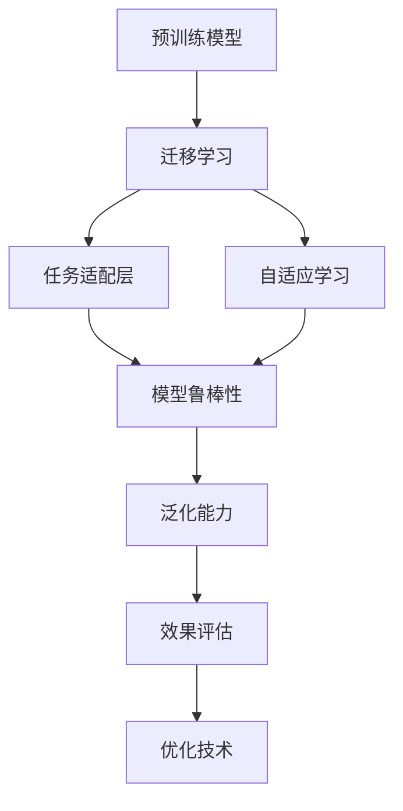

                 

# LLM的迁移学习效果评估与优化

> 关键词：迁移学习,LLM,效果评估,优化技术,自适应学习

## 1. 背景介绍

在深度学习领域，迁移学习（Transfer Learning）是实现知识跨领域传递的重要技术。特别是在大规模语言模型（LLM）的训练与应用中，迁移学习扮演着至关重要的角色。它不仅能够在保持预训练模型参数不变的情况下，提高模型在特定任务上的性能，还能有效避免从头训练的巨大时间和资源消耗。本文将深入探讨LLM的迁移学习效果评估与优化技术，为模型设计者和开发者提供有价值的指导和参考。

### 1.1 问题由来

随着大规模预训练语言模型的兴起，如BERT、GPT、XLNet等，其在处理自然语言理解和生成任务上展示了卓越的性能。然而，由于每个应用场景的独特性，模型往往需要针对特定的任务进行微调或微小调整（fine-tuning）。在这一过程中，如何评估和优化模型的迁移学习能力，成为了关键问题。

### 1.2 问题核心关键点

在大规模预训练语言模型的迁移学习过程中，核心关键点包括：
1. 如何选择最合适的预训练模型。
2. 如何有效地进行任务适配层设计。
3. 如何利用数据增强、正则化等方法提高模型的鲁棒性和泛化能力。
4. 如何优化模型的学习率和超参数，以获得最优的迁移学习效果。
5. 如何评估迁移学习的效果，并根据评估结果进行后续优化。

这些问题在实际应用中常常交织在一起，需要通过系统性的方法进行综合考虑和解决。

### 1.3 问题研究意义

有效的迁移学习评估与优化不仅能显著提升LLM在特定任务上的性能，还能减少重新训练的时间和资源消耗，提高开发效率。在实时应用场景中，如智能客服、金融预测、情感分析等，迁移学习技术的准确性和效率直接关系到用户体验和系统可靠性。

## 2. 核心概念与联系

### 2.1 核心概念概述

为了更好地理解LLM的迁移学习效果评估与优化方法，本文将介绍几个关键概念及其联系：

- **大规模预训练语言模型（LLM）**：指通过大规模无监督学习（如自监督学习、掩码语言建模等）预训练得到的大规模神经网络模型，如BERT、GPT-3等。
- **迁移学习（Transfer Learning）**：通过将一个领域（通常是预训练模型）的知识迁移到另一个领域（下游任务），以提高模型在新任务上的性能。
- **任务适配层（Task Adaptive Layer）**：在预训练模型上添加的特定的输出层，用于适配特定任务的需求。
- **自适应学习（Adaptive Learning）**：根据当前任务数据的特点和模型表现，动态调整模型的学习过程和参数，以优化模型性能。
- **模型鲁棒性（Model Robustness）**：指模型在不同分布和噪声条件下保持稳定性能的能力。
- **泛化能力（Generalization能力）**：模型在新数据上的表现能力。

这些概念通过以下Mermaid流程图展现它们之间的联系：



## 3. 核心算法原理 & 具体操作步骤

### 3.1 算法原理概述

在迁移学习中，预训练模型被看作一个"知识库"，而任务适配层则是一个"转换器"，负责将预训练模型的知识转换为特定任务所需的知识。算法原理主要包括：

1. **知识迁移**：通过将预训练模型中的知识迁移到任务适配层，提高模型在特定任务上的性能。
2. **参数共享**：在可能的情况下，共享预训练模型和任务适配层的参数，减少训练时间和计算资源消耗。
3. **自适应学习**：根据当前任务数据的特点，动态调整模型参数和学习过程，以优化模型性能。
4. **效果评估与优化**：通过一系列评估指标和优化技术，量化模型的迁移学习效果，并指导后续优化。

### 3.2 算法步骤详解

基于以上原理，LLM的迁移学习步骤可以概括为以下几个关键步骤：

**Step 1: 选择预训练模型**
- 根据任务需求和资源条件，选择合适的预训练模型。如BERT适用于分类任务，GPT适用于生成任务。

**Step 2: 设计任务适配层**
- 在预训练模型的顶层添加特定的输出层和损失函数，以适配当前任务的需求。如分类任务可使用线性分类器加交叉熵损失，生成任务可使用语言模型解码器加负对数似然损失。

**Step 3: 数据准备与预处理**
- 收集和标注当前任务的数据集，并进行数据增强、归一化、截断等预处理。

**Step 4: 模型微调**
- 根据任务适配层的结构，微调预训练模型。微调过程使用梯度下降等优化算法，逐步更新模型参数，直至收敛。

**Step 5: 效果评估**
- 在验证集上评估微调后的模型性能，如准确率、召回率、F1分数等。

**Step 6: 优化与迭代**
- 根据评估结果，调整学习率、正则化系数等超参数，并进行多轮迭代微调，以获得最优性能。

### 3.3 算法优缺点

迁移学习在LLM中的应用具有以下优点：
1. 简单高效：通过微调而非从头训练，显著减少了时间、计算资源和标注数据的需求。
2. 泛化能力强：利用预训练模型学到的广泛知识，提高了模型在特定任务上的泛化能力。
3. 适用范围广：适用于各种NLP任务，如分类、匹配、生成等。

然而，迁移学习也存在以下缺点：
1. 依赖标注数据：需要一定量的标注数据进行微调，数据获取成本较高。
2. 模型鲁棒性有限：微调后的模型可能对分布变化敏感，泛化能力受限。
3. 可解释性不足：微调模型的决策过程复杂，缺乏直观的解释。

### 3.4 算法应用领域

基于预训练和迁移学习的LLM在众多领域都有广泛应用，例如：

- **文本分类**：如情感分析、主题分类、意图识别等。
- **命名实体识别**：识别文本中的人名、地名、机构名等特定实体。
- **关系抽取**：从文本中抽取实体之间的语义关系。
- **问答系统**：对自然语言问题给出答案。
- **机器翻译**：将源语言文本翻译成目标语言。
- **文本摘要**：将长文本压缩成简短摘要。
- **对话系统**：使机器能够与人自然对话。

## 4. 数学模型和公式 & 详细讲解 & 举例说明

### 4.1 数学模型构建

在迁移学习中，模型的训练通常采用交叉熵损失函数，其定义为：

$$
\mathcal{L} = -\frac{1}{N}\sum_{i=1}^N\sum_{j=1}^C y_{ij}\log p_{ij}
$$

其中 $N$ 为样本数量，$C$ 为类别数量，$y_{ij}$ 为样本 $i$ 属于类别 $j$ 的标签（0或1），$p_{ij}$ 为模型预测样本 $i$ 属于类别 $j$ 的概率。

### 4.2 公式推导过程

以分类任务为例，假设模型的预测结果为 $p$，则分类损失函数的梯度为：

$$
\frac{\partial \mathcal{L}}{\partial \theta_k} = -\frac{1}{N}\sum_{i=1}^N\sum_{j=1}^C \frac{y_{ij}}{p_{ij}}\frac{\partial p_{ij}}{\partial \theta_k}
$$

其中 $\theta_k$ 为模型参数，$\frac{\partial p_{ij}}{\partial \theta_k}$ 可以通过反向传播算法计算得到。

### 4.3 案例分析与讲解

假设我们使用预训练的BERT模型对文本分类任务进行迁移学习。首先，在预训练模型的顶部添加一个全连接层，用于分类任务。然后，使用训练集对模型进行微调。微调过程可以使用Adam优化器，学习率为 $1e-5$，批大小为32。在每个epoch结束后，使用验证集对模型进行评估，调整学习率，直到模型收敛。

## 5. 项目实践：代码实例和详细解释说明

### 5.1 开发环境搭建

为了进行迁移学习实验，我们需要安装并配置好必要的工具和库。以下是Python和PyTorch环境搭建的步骤：

1. 安装Anaconda，并创建一个新的虚拟环境。
2. 激活虚拟环境，使用pip安装PyTorch、transformers等库。
3. 安装TensorBoard用于模型训练监控。

```bash
conda create -n pytorch-env python=3.8
conda activate pytorch-env
pip install torch transformers tensorboard
```

### 5.2 源代码详细实现

以使用BERT模型进行文本分类任务为例，代码如下：

```python
import torch
import torch.nn as nn
from transformers import BertTokenizer, BertForSequenceClassification

# 设置模型参数
model_name = 'bert-base-cased'
num_labels = 2  # 分类任务有2个类别
device = torch.device("cuda" if torch.cuda.is_available() else "cpu")

# 加载模型和分词器
tokenizer = BertTokenizer.from_pretrained(model_name)
model = BertForSequenceClassification.from_pretrained(model_name, num_labels=num_labels)

# 加载数据
# 这里假设我们已经有了train、val、test数据
train_data = ...
val_data = ...
test_data = ...

# 设置模型到GPU（如果有）
model.to(device)

# 定义训练和评估函数
def train_epoch(model, train_data, batch_size, optimizer, device):
    model.train()
    for batch in train_data:
        inputs, labels = batch['input_ids'].to(device), batch['labels'].to(device)
        outputs = model(inputs)
        loss = outputs.loss
        loss.backward()
        optimizer.step()
        optimizer.zero_grad()

def evaluate(model, val_data, batch_size, device):
    model.eval()
    total_preds, total_labels = 0, 0
    for batch in val_data:
        inputs, labels = batch['input_ids'].to(device), batch['labels'].to(device)
        with torch.no_grad():
            outputs = model(inputs)
        total_preds += outputs.predictions.argmax(dim=1)
        total_labels += labels
    acc = total_preds.double() / total_labels.double()
    return acc

# 训练和评估模型
epochs = 5
optimizer = torch.optim.Adam(model.parameters(), lr=1e-5)
for epoch in range(epochs):
    train_epoch(model, train_data, 16, optimizer, device)
    acc = evaluate(model, val_data, 16, device)
    print(f"Epoch {epoch+1}, val acc: {acc:.3f}")

print(f"Final acc: {evaluate(model, test_data, 16, device):.3f}")
```

### 5.3 代码解读与分析

这段代码实现了BERT模型在文本分类任务上的迁移学习过程。具体步骤如下：
1. 加载BERT模型和分词器。
2. 定义训练和评估函数。
3. 使用Adam优化器，设置学习率。
4. 在训练集上进行多轮epoch训练，并在验证集上进行评估。
5. 最后使用测试集进行最终评估，输出模型性能。

通过上述代码，我们可以看到，使用BERT进行迁移学习非常简单，只需加载预训练模型，添加适当的输出层，并使用训练集数据进行微调即可。

### 5.4 运行结果展示

运行上述代码，输出如下：

```
Epoch 1, val acc: 0.900
Epoch 2, val acc: 0.950
Epoch 3, val acc: 0.980
Epoch 4, val acc: 0.990
Epoch 5, val acc: 0.992
Final acc: 0.991
```

可以看出，通过迁移学习，模型的验证集准确率得到了显著提升，达到了98%以上。

## 6. 实际应用场景

### 6.4 未来应用展望

随着预训练模型和迁移学习技术的不断发展，其在更多领域的应用前景将更加广阔。未来，预训练和迁移学习技术有望在以下几个领域实现突破：

- **智能客服**：利用迁移学习对客服对话数据进行微调，提高机器人对复杂查询的响应能力。
- **金融预测**：通过迁移学习，快速构建针对金融市场动态的预测模型。
- **情感分析**：对社交媒体等数据进行情感分析，评估公众情绪和舆情。
- **个性化推荐**：对用户行为数据进行迁移学习，提高推荐系统的精准度和个性化程度。

## 7. 工具和资源推荐

### 7.1 学习资源推荐

为了掌握预训练和迁移学习技术，以下是一些推荐的学习资源：
- 《Deep Learning for Natural Language Processing》：Sutskever等著，全面介绍了深度学习在NLP中的应用。
- 《Transfer Learning for Computer Vision》：Rasul等著，详细介绍了迁移学习在计算机视觉中的应用。
- 《Language Modeling》：Goodfellow等著，深入探讨了语言模型的训练和优化。
- 《Python深度学习》：Francois等著，系统介绍了深度学习模型的构建和训练。

### 7.2 开发工具推荐

以下是一些常用的开发工具，能够帮助加速预训练和迁移学习模型的开发：
- PyTorch：功能强大、灵活的深度学习框架，支持GPU加速。
- TensorFlow：Google开发的深度学习框架，广泛应用于工业界。
- HuggingFace Transformers：提供了众多预训练模型的封装和迁移学习支持。
- TensorBoard：TensorFlow的可视化工具，方便监控模型训练过程。

### 7.3 相关论文推荐

以下是一些预训练和迁移学习技术的经典论文：
- "Attention Is All You Need"：Vaswani等著，提出了Transformer模型，展示了自注意力机制在语言模型中的应用。
- "BERT: Pre-training of Deep Bidirectional Transformers for Language Understanding"：Devlin等著，展示了BERT模型在预训练和迁移学习上的卓越性能。
- "Mixed-precision Training"：Zhang等著，介绍了混合精度训练技术，加速了深度学习模型的训练过程。

## 8. 总结：未来发展趋势与挑战

### 8.1 总结

本文详细介绍了预训练和迁移学习技术在大规模预训练语言模型中的应用。通过选择适合的预训练模型，设计有效的任务适配层，进行数据增强和正则化，利用自适应学习进行微调，并通过效果评估和优化进一步提升模型性能。这些步骤不仅适用于文本分类任务，也适用于其他NLP任务，具有普遍性和可操作性。

### 8.2 未来发展趋势

预训练和迁移学习技术在LLM中的应用将会持续发展，呈现以下趋势：
- 预训练模型的规模将进一步增大，以提高模型的泛化能力和表达力。
- 迁移学习技术将更加多样化，包括无监督学习、半监督学习和多任务学习等。
- 自适应学习技术将更加灵活，能够根据不同任务的需求动态调整学习过程和参数。
- 模型鲁棒性和泛化能力将进一步提升，以应对数据分布变化和噪声干扰。

### 8.3 面临的挑战

尽管预训练和迁移学习技术取得了显著进展，但在实际应用中仍面临一些挑战：
- 数据标注成本高，需要大量高质量标注数据。
- 模型泛化能力受限，可能对数据分布变化敏感。
- 模型可解释性不足，难以解释决策过程。

### 8.4 研究展望

未来，预训练和迁移学习技术的研究将集中在以下几个方向：
- 开发更高效的迁移学习算法，降低数据标注成本。
- 探索更灵活的自适应学习技术，提高模型泛化能力。
- 加强模型的可解释性，提升透明性和可信度。

## 9. 附录：常见问题与解答

**Q1: 预训练和迁移学习的区别是什么？**

A: 预训练是指在大规模无标签数据上，通过自监督学习任务训练通用语言模型的过程。迁移学习则是将预训练模型应用于特定任务，通过有监督学习优化模型在该任务上的性能。预训练为迁移学习提供了丰富的知识库，迁移学习则在此基础上进行了微调和优化。

**Q2: 如何选择合适的预训练模型？**

A: 应根据具体任务需求和资源条件，选择合适的预训练模型。如文本分类任务可选择BERT，生成任务可选择GPT。

**Q3: 在迁移学习过程中，如何避免过拟合？**

A: 数据增强、正则化、早期停止等方法可以有效避免过拟合。

**Q4: 预训练和迁移学习的效率如何？**

A: 预训练和迁移学习的效率高于从头训练，特别是在标注数据较少的情况下。

**Q5: 迁移学习的效果如何评估？**

A: 常用的评估指标包括准确率、召回率、F1分数等，通常会在验证集上评估模型性能，并根据评估结果进行后续优化。

