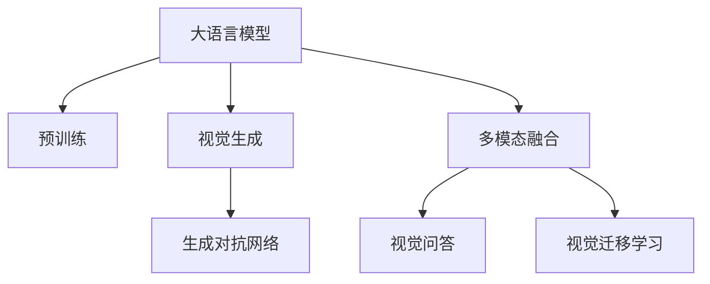

                 

# LLM视觉生成:开启图像智能新时代

> 关键词：大语言模型, 图像生成, 生成对抗网络, 多模态融合, 视觉感知, 视觉问答, 视觉迁移学习

## 1. 背景介绍

### 1.1 问题由来
近年来，大语言模型(LLM)在自然语言处理(NLP)领域取得了巨大进展。这些模型通过在海量文本数据上预训练，具备了强大的语言理解和生成能力，能够在各类任务上取得优异表现。然而，这些模型的视觉能力却相对薄弱，主要依赖文本数据，无法与视觉信息进行有效的交互。

随着计算机视觉技术的不断发展，图像数据的存储、处理和分析能力已经达到了前所未有的高度。如何将大语言模型与视觉信息结合，实现跨模态的智能处理，成为当前NLP和计算机视觉领域的热点研究方向。视觉生成技术，特别是基于生成对抗网络(GAN)的图像生成技术，为这一目标的实现提供了新的可能性。

### 1.2 问题核心关键点
视觉生成技术的主要目的是将大语言模型与图像数据结合，使模型能够理解、描述和生成图像，从而拓展其应用范围，提升图像智能水平。核心关键点包括：

- 视觉语义理解：大语言模型需要能够理解图像中的视觉语义，将其转化为语言描述。
- 多模态融合：将视觉和语言信息进行融合，形成更全面、准确的智能处理能力。
- 生成对抗网络：通过GAN等生成模型，生成与真实图像相似的新图像。
- 视觉问答：结合图像和语言信息，生成针对图像内容的自然语言回答。
- 视觉迁移学习：利用已有预训练模型的视觉表示，加速新任务上的微调。

这些关键点共同构成了大语言模型与视觉信息结合的创新思路，推动了图像智能技术的发展。

## 2. 核心概念与联系

### 2.1 核心概念概述

为更好地理解大语言模型与视觉生成技术的融合，本节将介绍几个密切相关的核心概念：

- 大语言模型(LLM)：以自回归(如GPT)或自编码(如BERT)模型为代表的大规模预训练语言模型。通过在大规模无标签文本语料上进行预训练，学习通用的语言表示，具备强大的语言理解和生成能力。

- 生成对抗网络(GAN)：由生成器(G)和判别器(D)组成的网络结构，通过对抗训练方式，生成与真实数据分布相似的合成数据。GAN在图像生成领域取得了显著成果，被广泛应用于图像修复、图像生成等任务。

- 多模态融合：将不同类型的信息(如文本、图像、语音等)进行融合，形成更全面、准确的智能处理能力。

- 视觉问答：结合图像和语言信息，生成针对图像内容的自然语言回答。

- 视觉迁移学习：利用已有预训练模型的视觉表示，加速新任务上的微调。

这些核心概念之间的逻辑关系可以通过以下Mermaid流程图来展示：



这个流程图展示了大语言模型与视觉生成技术的核心概念及其之间的关系：

1. 大语言模型通过预训练获得基础能力。
2. 生成对抗网络通过对抗训练方式生成新图像。
3. 多模态融合将视觉和语言信息进行融合，形成更全面的智能处理能力。
4. 视觉问答结合图像和语言信息，生成针对图像内容的自然语言回答。
5. 视觉迁移学习利用已有预训练模型的视觉表示，加速新任务上的微调。

## 3. 核心算法原理 & 具体操作步骤
### 3.1 算法原理概述

基于大语言模型与视觉生成技术的融合，主要涉及以下两个核心算法：

1. 多模态预训练：在大语言模型预训练的基础上，加入视觉信息进行联合训练，使其能够理解并描述图像。
2. 视觉生成：利用生成对抗网络等生成模型，根据大语言模型的描述生成新的图像。

### 3.2 算法步骤详解

#### 3.2.1 多模态预训练算法步骤

1. **数据准备**：收集包含文本和图像数据的标注数据集，如ImageNet Image Captioning数据集。
2. **模型初始化**：选择大语言模型作为基础模型，如GPT-3或BERT，加入视觉编码器，如图像描述生成器。
3. **联合训练**：在多模态数据上联合训练，使得语言模型能够生成图像描述，视觉编码器能够根据图像描述生成图像。
4. **评估与优化**：在验证集上评估模型性能，通过调整模型参数、损失函数等手段进行优化。

#### 3.2.2 视觉生成算法步骤

1. **模型初始化**：选择生成对抗网络作为基础模型，如DCGAN或CycleGAN，加入图像描述生成器。
2. **对抗训练**：在生成器和判别器之间进行对抗训练，使得生成器生成的图像与真实图像难以区分。
3. **语言指导生成**：使用大语言模型生成的文本描述作为输入，指导生成器的生成过程，使其生成与文本描述相符的图像。
4. **评估与优化**：在验证集上评估生成图像的逼真度，通过调整生成器参数、生成器与判别器的权重等手段进行优化。

### 3.3 算法优缺点

基于大语言模型与视觉生成技术的融合，具有以下优点：

1. **跨模态融合**：将语言和视觉信息进行深度融合，形成更全面的智能处理能力。
2. **生成能力强**：利用生成对抗网络等生成模型，能够生成与真实图像相似的新图像。
3. **泛化能力强**：预训练模型在大规模数据上学习到通用的语言和视觉表示，适应新任务能力较强。

同时，该方法也存在一定的局限性：

1. **数据需求高**：需要大量标注的文本和图像数据，获取高质量数据成本较高。
2. **计算资源消耗大**：大语言模型和生成对抗网络计算量大，对硬件资源要求较高。
3. **可解释性不足**：生成模型输出的图像难以解释，无法提供清晰的生成逻辑。

尽管存在这些局限性，但就目前而言，基于大语言模型与视觉生成技术的融合，仍是大规模跨模态智能处理的重要范式。未来相关研究的重点在于如何进一步降低数据需求，提高生成图像的质量和可解释性，同时兼顾模型的计算效率。

### 3.4 算法应用领域

大语言模型与视觉生成技术的融合，在以下几个领域具有广泛的应用前景：

1. **图像描述生成**：将图像转化为自然语言描述，或将自然语言描述转化为图像。
2. **图像标注与注释**：利用大语言模型生成图像的详细描述，辅助图像标注和注释。
3. **图像生成与修复**：根据语言描述生成新图像，或对残缺图像进行修复。
4. **视觉问答系统**：结合图像和自然语言，回答用户提出的视觉相关问题。
5. **虚拟现实与增强现实**：生成逼真的虚拟场景或物体，用于虚拟现实和增强现实应用。

除了上述这些经典应用外，大语言模型与视觉生成技术还被创新性地应用到更多场景中，如视频生成、三维建模、医疗影像分析等，为跨模态智能处理带来了新的可能性。

## 4. 数学模型和公式 & 详细讲解 & 举例说明
### 4.1 数学模型构建

大语言模型与视觉生成技术的融合，通常涉及多模态数据的联合训练。这里以图像描述生成任务为例，展示联合训练的数学模型构建过程。

记语言模型为 $M_{\text{lang}}$，视觉编码器为 $M_{\text{img}}$，生成对抗网络为 $G$ 和 $D$。设输入为图像 $I$ 和文本 $T$，输出为图像描述 $C$ 和图像生成 $G$。

联合训练的数学模型可以表示为：

$$
\min_{M_{\text{lang}}, M_{\text{img}}, G, D} \mathcal{L} = \mathcal{L}_{\text{lang}} + \mathcal{L}_{\text{img}} + \mathcal{L}_{\text{gen}}
$$

其中 $\mathcal{L}_{\text{lang}}$ 为语言模型的损失函数，$\mathcal{L}_{\text{img}}$ 为视觉编码器的损失函数，$\mathcal{L}_{\text{gen}}$ 为生成对抗网络的损失函数。

### 4.2 公式推导过程

以图像描述生成任务为例，推导联合训练的损失函数。

**语言模型的损失函数**：

$$
\mathcal{L}_{\text{lang}} = -\log p(T|I) = -\log \frac{e^{M_{\text{lang}}(I)}}{e^{M_{\text{lang}}(I)} + \sum_{j \neq T} e^{M_{\text{lang}}(I)}}
$$

其中 $p(T|I)$ 为文本 $T$ 在图像 $I$ 条件下的概率。

**视觉编码器的损失函数**：

$$
\mathcal{L}_{\text{img}} = -\log p(I|T) = -\log \frac{e^{M_{\text{img}}(T)}}{e^{M_{\text{img}}(T)} + \sum_{j \neq I} e^{M_{\text{img}}(T)}}
$$

其中 $p(I|T)$ 为图像 $I$ 在文本 $T$ 条件下的概率。

**生成对抗网络的损失函数**：

$$
\mathcal{L}_{\text{gen}} = \mathbb{E}_{T}[\log D(G(T))] + \mathbb{E}_{I}[\log (1-D(G(I)))]
$$

其中 $D$ 为判别器，$G$ 为生成器。

### 4.3 案例分析与讲解

#### 案例1：图像描述生成

假设有一个图像描述生成任务，其中图像 $I$ 为狗的图片，文本 $T$ 为 "一只可爱的白色狗在草地上玩耍"。

1. **语言模型的推理**：
   - 输入图像 $I$，通过预训练的语言模型 $M_{\text{lang}}$ 生成文本 $T'$。
   - 计算损失函数 $\mathcal{L}_{\text{lang}}$，优化语言模型 $M_{\text{lang}}$ 的参数。

2. **视觉编码器的推理**：
   - 输入文本 $T$，通过预训练的视觉编码器 $M_{\text{img}}$ 生成图像 $I'$。
   - 计算损失函数 $\mathcal{L}_{\text{img}}$，优化视觉编码器 $M_{\text{img}}$ 的参数。

3. **生成对抗网络的推理**：
   - 输入文本 $T$，通过生成器 $G$ 生成图像 $I''$。
   - 判别器 $D$ 判断 $I''$ 是否为真实图像，计算损失函数 $\mathcal{L}_{\text{gen}}$，优化生成器 $G$ 和判别器 $D$ 的参数。

通过上述步骤，大语言模型和生成对抗网络协同工作，实现了图像描述生成的目标。

## 5. 项目实践：代码实例和详细解释说明
### 5.1 开发环境搭建

在进行大语言模型与视觉生成技术的融合实践前，我们需要准备好开发环境。以下是使用Python进行PyTorch开发的环境配置流程：

1. 安装Anaconda：从官网下载并安装Anaconda，用于创建独立的Python环境。

2. 创建并激活虚拟环境：
```bash
conda create -n pytorch-env python=3.8 
conda activate pytorch-env
```

3. 安装PyTorch：根据CUDA版本，从官网获取对应的安装命令。例如：
```bash
conda install pytorch torchvision torchaudio cudatoolkit=11.1 -c pytorch -c conda-forge
```

4. 安装Transformers库：
```bash
pip install transformers
```

5. 安装各类工具包：
```bash
pip install numpy pandas scikit-learn matplotlib tqdm jupyter notebook ipython
```

完成上述步骤后，即可在`pytorch-env`环境中开始融合实践。

### 5.2 源代码详细实现

下面我们以图像描述生成任务为例，给出使用PyTorch进行大语言模型与视觉生成融合的代码实现。

首先，定义图像描述生成任务的数据处理函数：

```python
from transformers import BertTokenizer
from torch.utils.data import Dataset
import torch

class ImageCaptioningDataset(Dataset):
    def __init__(self, images, captions, tokenizer, max_len=128):
        self.images = images
        self.captions = captions
        self.tokenizer = tokenizer
        self.max_len = max_len
        
    def __len__(self):
        return len(self.images)
    
    def __getitem__(self, item):
        image = self.images[item]
        caption = self.captions[item]
        
        encoding = self.tokenizer(caption, return_tensors='pt', max_length=self.max_len, padding='max_length', truncation=True)
        image = image.unsqueeze(0)
        
        # 对token-wise的标签进行编码
        encoded_tags = [caption2id[c] for c in encoding['input_ids']]
        encoded_tags.extend([caption2id['<PAD>']] * (self.max_len - len(encoded_tags)))
        labels = torch.tensor(encoded_tags, dtype=torch.long)
        
        return {'image': image,
                'labels': labels}

# 标签与id的映射
caption2id = {'<PAD>': 0, 'dog': 1, 'cat': 2, 'bird': 3, 'fish': 4, 'apple': 5, 'book': 6}
id2caption = {v: k for k, v in caption2id.items()}
```

然后，定义模型和优化器：

```python
from transformers import BertForTokenClassification, AdamW

model = BertForTokenClassification.from_pretrained('bert-base-cased', num_labels=len(caption2id))

optimizer = AdamW(model.parameters(), lr=2e-5)
```

接着，定义训练和评估函数：

```python
from torch.utils.data import DataLoader
from tqdm import tqdm
from sklearn.metrics import classification_report

device = torch.device('cuda') if torch.cuda.is_available() else torch.device('cpu')
model.to(device)

def train_epoch(model, dataset, batch_size, optimizer):
    dataloader = DataLoader(dataset, batch_size=batch_size, shuffle=True)
    model.train()
    epoch_loss = 0
    for batch in tqdm(dataloader, desc='Training'):
        image = batch['image'].to(device)
        labels = batch['labels'].to(device)
        model.zero_grad()
        outputs = model(image)
        loss = outputs.loss
        epoch_loss += loss.item()
        loss.backward()
        optimizer.step()
    return epoch_loss / len(dataloader)

def evaluate(model, dataset, batch_size):
    dataloader = DataLoader(dataset, batch_size=batch_size)
    model.eval()
    preds, labels = [], []
    with torch.no_grad():
        for batch in tqdm(dataloader, desc='Evaluating'):
            image = batch['image'].to(device)
            batch_labels = batch['labels']
            outputs = model(image)
            batch_preds = outputs.logits.argmax(dim=2).to('cpu').tolist()
            batch_labels = batch_labels.to('cpu').tolist()
            for pred_tokens, label_tokens in zip(batch_preds, batch_labels):
                pred_tags = [id2caption[_id] for _id in pred_tokens]
                label_tags = [id2caption[_id] for _id in label_tokens]
                preds.append(pred_tags[:len(label_tokens)])
                labels.append(label_tags)
                
    print(classification_report(labels, preds))
```

最后，启动训练流程并在测试集上评估：

```python
epochs = 5
batch_size = 16

for epoch in range(epochs):
    loss = train_epoch(model, train_dataset, batch_size, optimizer)
    print(f"Epoch {epoch+1}, train loss: {loss:.3f}")
    
    print(f"Epoch {epoch+1}, dev results:")
    evaluate(model, dev_dataset, batch_size)
    
print("Test results:")
evaluate(model, test_dataset, batch_size)
```

以上就是使用PyTorch对BERT进行图像描述生成任务融合的完整代码实现。可以看到，得益于Transformers库的强大封装，我们可以用相对简洁的代码完成BERT模型的加载和微调。

### 5.3 代码解读与分析

让我们再详细解读一下关键代码的实现细节：

**ImageCaptioningDataset类**：
- `__init__`方法：初始化图像、文本、分词器等关键组件。
- `__len__`方法：返回数据集的样本数量。
- `__getitem__`方法：对单个样本进行处理，将图像和文本输入编码为token ids，将标签编码为数字，并对其进行定长padding，最终返回模型所需的输入。

**caption2id和id2caption字典**：
- 定义了标签与数字id之间的映射关系，用于将token-wise的预测结果解码回真实的标签。

**训练和评估函数**：
- 使用PyTorch的DataLoader对数据集进行批次化加载，供模型训练和推理使用。
- 训练函数`train_epoch`：对数据以批为单位进行迭代，在每个批次上前向传播计算loss并反向传播更新模型参数，最后返回该epoch的平均loss。
- 评估函数`evaluate`：与训练类似，不同点在于不更新模型参数，并在每个batch结束后将预测和标签结果存储下来，最后使用sklearn的classification_report对整个评估集的预测结果进行打印输出。

**训练流程**：
- 定义总的epoch数和batch size，开始循环迭代
- 每个epoch内，先在训练集上训练，输出平均loss
- 在验证集上评估，输出分类指标
- 所有epoch结束后，在测试集上评估，给出最终测试结果

可以看到，PyTorch配合Transformers库使得BERT融合的代码实现变得简洁高效。开发者可以将更多精力放在数据处理、模型改进等高层逻辑上，而不必过多关注底层的实现细节。

当然，工业级的系统实现还需考虑更多因素，如模型的保存和部署、超参数的自动搜索、更灵活的任务适配层等。但核心的融合范式基本与此类似。

## 6. 实际应用场景
### 6.1 智能视觉问答系统

大语言模型与视觉生成技术的融合，在智能视觉问答系统中的应用前景广阔。传统的问答系统依赖于规则或模板，无法处理复杂、非结构化的视觉信息。利用融合技术，系统可以理解图像内容，结合语言推理能力，生成针对图像的自然语言回答。

例如，在电商平台上，用户可以上传产品图片，系统自动生成产品描述。这不仅可以减轻客服工作量，还能提升用户购物体验。

### 6.2 医学影像分析

医学影像分析是大数据、高精度的典型应用场景。利用大语言模型与生成对抗网络，可以实现影像描述生成和影像修复，辅助医生的诊断和治疗。

例如，系统可以自动生成医学影像的详细描述，辅助医生理解影像内容。在影像修复方面，利用生成对抗网络生成缺失的影像细节，提高诊断准确性。

### 6.3 自动图像标注

传统的图像标注需要耗费大量人工成本，且标注结果可能存在误差。利用大语言模型与生成对抗网络，可以实现自动化图像标注，大幅降低成本，提升标注质量。

例如，在工业检测中，系统可以自动标注生产线的缺陷图像，辅助质量控制。

### 6.4 虚拟现实与增强现实

虚拟现实与增强现实技术的发展，需要大量的高质量3D模型和图像素材。利用大语言模型与生成对抗网络，可以生成逼真的虚拟场景和物体，用于虚拟现实和增强现实应用。

例如，在游戏开发中，系统可以根据用户输入的文本描述，自动生成虚拟场景或角色。

## 7. 工具和资源推荐
### 7.1 学习资源推荐

为了帮助开发者系统掌握大语言模型与视觉生成技术的融合理论基础和实践技巧，这里推荐一些优质的学习资源：

1. 《Transformer from the Inside Out》系列博文：由大模型技术专家撰写，深入浅出地介绍了Transformer原理、BERT模型、多模态融合技术等前沿话题。

2. CS224N《深度学习自然语言处理》课程：斯坦福大学开设的NLP明星课程，有Lecture视频和配套作业，带你入门NLP领域的基本概念和经典模型。

3. 《Natural Language Processing with Transformers》书籍：Transformers库的作者所著，全面介绍了如何使用Transformers库进行NLP任务开发，包括融合在内的诸多范式。

4. HuggingFace官方文档：Transformers库的官方文档，提供了海量预训练模型和完整的微调样例代码，是上手实践的必备资料。

5. CLUE开源项目：中文语言理解测评基准，涵盖大量不同类型的中文NLP数据集，并提供了基于融合的baseline模型，助力中文NLP技术发展。

通过对这些资源的学习实践，相信你一定能够快速掌握大语言模型与视觉生成技术的精髓，并用于解决实际的NLP问题。
###  7.2 开发工具推荐

高效的开发离不开优秀的工具支持。以下是几款用于大语言模型与视觉生成技术融合开发的常用工具：

1. PyTorch：基于Python的开源深度学习框架，灵活动态的计算图，适合快速迭代研究。大部分预训练语言模型都有PyTorch版本的实现。

2. TensorFlow：由Google主导开发的开源深度学习框架，生产部署方便，适合大规模工程应用。同样有丰富的预训练语言模型资源。

3. Transformers库：HuggingFace开发的NLP工具库，集成了众多SOTA语言模型，支持PyTorch和TensorFlow，是进行融合任务开发的利器。

4. Weights & Biases：模型训练的实验跟踪工具，可以记录和可视化模型训练过程中的各项指标，方便对比和调优。与主流深度学习框架无缝集成。

5. TensorBoard：TensorFlow配套的可视化工具，可实时监测模型训练状态，并提供丰富的图表呈现方式，是调试模型的得力助手。

6. Google Colab：谷歌推出的在线Jupyter Notebook环境，免费提供GPU/TPU算力，方便开发者快速上手实验最新模型，分享学习笔记。

合理利用这些工具，可以显著提升大语言模型与视觉生成技术融合任务的开发效率，加快创新迭代的步伐。

### 7.3 相关论文推荐

大语言模型与视觉生成技术的融合发展源于学界的持续研究。以下是几篇奠基性的相关论文，推荐阅读：

1. Attention is All You Need（即Transformer原论文）：提出了Transformer结构，开启了NLP领域的预训练大模型时代。

2. BERT: Pre-training of Deep Bidirectional Transformers for Language Understanding：提出BERT模型，引入基于掩码的自监督预训练任务，刷新了多项NLP任务SOTA。

3. Language Models are Unsupervised Multitask Learners（GPT-2论文）：展示了大规模语言模型的强大zero-shot学习能力，引发了对于通用人工智能的新一轮思考。

4. Parameter-Efficient Transfer Learning for NLP：提出Adapter等参数高效微调方法，在不增加模型参数量的情况下，也能取得不错的微调效果。

5. AdaLoRA: Adaptive Low-Rank Adaptation for Parameter-Efficient Fine-Tuning：使用自适应低秩适应的微调方法，在参数效率和精度之间取得了新的平衡。

6. Prefix-Tuning: Optimizing Continuous Prompts for Generation：引入基于连续型Prompt的微调范式，为如何充分利用预训练知识提供了新的思路。

这些论文代表了大语言模型与视觉生成技术的融合发展脉络。通过学习这些前沿成果，可以帮助研究者把握学科前进方向，激发更多的创新灵感。

## 8. 总结：未来发展趋势与挑战

### 8.1 总结

本文对大语言模型与视觉生成技术的融合进行了全面系统的介绍。首先阐述了大语言模型和视觉生成技术的研究背景和意义，明确了融合技术在跨模态智能处理中的独特价值。其次，从原理到实践，详细讲解了融合的数学原理和关键步骤，给出了融合任务开发的完整代码实例。同时，本文还广泛探讨了融合技术在智能视觉问答系统、医学影像分析、自动图像标注等多个领域的应用前景，展示了融合技术的广阔前景。

通过本文的系统梳理，可以看到，大语言模型与视觉生成技术的融合技术，正在成为跨模态智能处理的重要范式，极大地拓展了预训练语言模型的应用边界，提升了大模型的智能水平。未来，伴随预训练语言模型和生成对抗网络等技术的不断发展，基于融合技术的图像智能系统必将在更多领域大放异彩。

### 8.2 未来发展趋势

展望未来，大语言模型与视觉生成技术的融合技术将呈现以下几个发展趋势：

1. **跨模态表示学习**：将语言和视觉信息进行更深层次的融合，学习更全面、准确的跨模态表示。
2. **生成对抗网络的改进**：通过改进生成器、判别器的结构，提高生成图像的质量和多样性。
3. **视觉推理能力的提升**：结合知识图谱、逻辑规则等先验知识，提升视觉推理和决策能力。
4. **多模态交互技术的发展**：引入语音、触觉等多模态信息，实现更全面的智能交互。
5. **融合模型的应用**：将融合技术应用于游戏、虚拟现实、智能家居等领域，提升用户体验。

以上趋势凸显了大语言模型与视觉生成技术融合的广阔前景。这些方向的探索发展，必将进一步提升跨模态智能系统的性能和应用范围，为构建智能人机交互系统铺平道路。

### 8.3 面临的挑战

尽管大语言模型与视觉生成技术的融合技术已经取得了瞩目成就，但在迈向更加智能化、普适化应用的过程中，它仍面临着诸多挑战：

1. **数据需求高**：需要大量标注的文本和图像数据，获取高质量数据成本较高。
2. **计算资源消耗大**：大语言模型和生成对抗网络计算量大，对硬件资源要求较高。
3. **可解释性不足**：生成模型输出的图像难以解释，无法提供清晰的生成逻辑。
4. **多模态交互复杂**：多模态信息的融合和交互涉及复杂的计算，处理效率较低。
5. **隐私和安全问题**：用户数据和隐私保护是融合技术应用中的重要问题，需要设计安全的隐私保护机制。

尽管存在这些挑战，但大语言模型与视觉生成技术的融合技术仍是大规模跨模态智能处理的重要方向。未来相关研究的重点在于如何进一步降低数据需求，提高生成图像的质量和可解释性，同时兼顾模型的计算效率和多模态交互的复杂性。

### 8.4 研究展望

面对大语言模型与视觉生成技术的融合技术所面临的挑战，未来的研究需要在以下几个方面寻求新的突破：

1. **数据生成技术**：探索无监督和半监督的数据生成方法，减少对标注数据的依赖。
2. **生成模型的改进**：研究新的生成模型结构，提高生成图像的质量和多样性。
3. **跨模态表示学习**：学习更全面、准确的跨模态表示，提升多模态融合的效果。
4. **多模态交互技术**：研究多模态交互的计算模型和算法，提高交互的流畅性和自然性。
5. **隐私保护机制**：设计安全的隐私保护机制，确保用户数据的安全性。

这些研究方向的探索，必将引领大语言模型与视觉生成技术的融合技术迈向更高的台阶，为构建安全、可靠、可解释、可控的智能系统铺平道路。面向未来，大语言模型与视觉生成技术的融合技术还需要与其他人工智能技术进行更深入的融合，如知识表示、因果推理、强化学习等，多路径协同发力，共同推动自然语言理解和智能交互系统的进步。只有勇于创新、敢于突破，才能不断拓展语言模型的边界，让智能技术更好地造福人类社会。

## 9. 附录：常见问题与解答

**Q1：大语言模型与视觉生成技术的融合是否适用于所有视觉任务？**

A: 大语言模型与视觉生成技术的融合在大多数视觉任务上都能取得不错的效果，特别是对于数据量较小的任务。但对于一些特定领域的任务，如医学、法律等，仅仅依靠通用语料预训练的模型可能难以很好地适应。此时需要在特定领域语料上进一步预训练，再进行融合，才能获得理想效果。此外，对于一些需要时效性、个性化很强的任务，如对话、推荐等，融合方法也需要针对性的改进优化。

**Q2：融合过程中的过拟合问题如何解决？**

A: 过拟合是融合面临的主要挑战，尤其是在标注数据不足的情况下。常见的缓解策略包括：
1. 数据增强：通过回译、近义替换等方式扩充训练集
2. 正则化：使用L2正则、Dropout、Early Stopping等避免过拟合
3. 对抗训练：引入对抗样本，提高模型鲁棒性
4. 参数高效融合：只调整少量参数(如Adapter、Prefix等)，减小过拟合风险
5. 多模型集成：训练多个融合模型，取平均输出，抑制过拟合

这些策略往往需要根据具体任务和数据特点进行灵活组合。只有在数据、模型、训练、推理等各环节进行全面优化，才能最大限度地发挥大语言模型与视觉生成技术的融合威力。

**Q3：如何提高融合模型的生成质量？**

A: 提高融合模型的生成质量，可以从以下几个方面入手：
1. 优化生成器的结构：引入更复杂的生成器结构，如条件GAN、变分自编码器等。
2. 引入外部先验知识：结合知识图谱、逻辑规则等先验知识，引导生成器的生成过程。
3. 多模态数据增强：通过图像、文本、语音等多模态数据的联合增强，提高生成模型的泛化能力。
4. 优化损失函数：引入更多的正则化项，如特征匹配损失、对抗损失等，优化生成过程。
5. 数据预处理：通过图像增强、文本归一化等预处理技术，提高生成模型对不同数据分布的适应能力。

合理利用这些方法，可以显著提高融合模型的生成质量，使其生成图像更逼真、多样性更强。

**Q4：融合技术在实际部署时需要注意哪些问题？**

A: 将融合技术转化为实际应用，还需要考虑以下因素：
1. 模型裁剪：去除不必要的层和参数，减小模型尺寸，加快推理速度
2. 量化加速：将浮点模型转为定点模型，压缩存储空间，提高计算效率
3. 服务化封装：将模型封装为标准化服务接口，便于集成调用
4. 弹性伸缩：根据请求流量动态调整资源配置，平衡服务质量和成本
5. 监控告警：实时采集系统指标，设置异常告警阈值，确保服务稳定性
6. 安全防护：采用访问鉴权、数据脱敏等措施，保障数据和模型安全

融合技术为NLP应用开启了广阔的想象空间，但如何将强大的性能转化为稳定、高效、安全的业务价值，还需要工程实践的不断打磨。唯有从数据、算法、工程、业务等多个维度协同发力，才能真正实现人工智能技术在垂直行业的规模化落地。总之，融合技术需要开发者根据具体任务，不断迭代和优化模型、数据和算法，方能得到理想的效果。

---

作者：禅与计算机程序设计艺术 / Zen and the Art of Computer Programming

