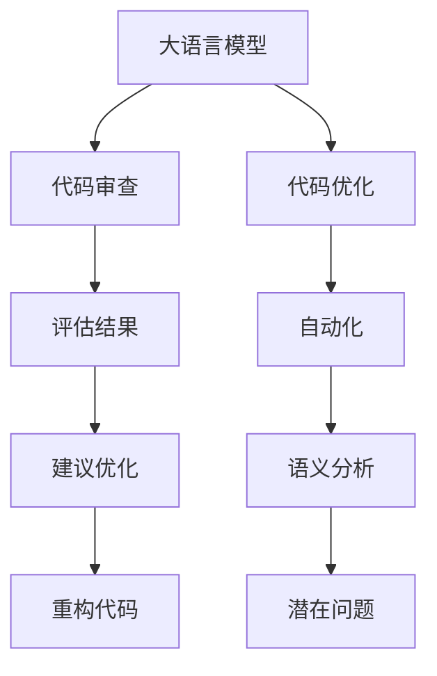

                 

# LLM辅助软件开发：自动化代码审查与优化

## 1. 背景介绍

在当今的软件开发过程中，代码审查和优化是确保代码质量和效率的关键步骤。然而，随着代码库的规模不断扩大和复杂度的提高，手动代码审查和优化已经变得越来越困难。为此，开发人员需要一种新的方法来自动化代码审查与优化，确保代码的质量和性能。

大语言模型（LLM）作为一种强大的自然语言处理工具，能够利用其语言理解和生成能力，为代码审查和优化提供自动化支持。通过训练大语言模型，使其能够理解代码逻辑、识别潜在问题，并提供优化建议，可以大大提升代码审查和优化的效率和质量。

本文将详细探讨大语言模型在代码审查和优化中的应用，包括其原理、操作步骤、具体算法、实际应用案例等。

## 2. 核心概念与联系

### 2.1 核心概念概述

在进行代码审查与优化时，我们需要了解以下核心概念：

- 大语言模型（LLM）：一种基于深度学习的自然语言处理模型，能够理解和生成自然语言。
- 代码审查：对代码进行检查和评估，确保代码符合编码标准和最佳实践。
- 代码优化：通过对代码进行重构和改进，提升代码的可读性、可维护性和性能。
- 语义分析：分析代码的语义结构，识别潜在的问题和优化机会。
- 自动化：利用计算机程序自动执行代码审查和优化任务。

这些核心概念之间的联系可以通过以下Mermaid流程图来展示：



该流程图展示了大语言模型在代码审查和优化中的作用：首先，大语言模型分析代码的语义结构，识别潜在问题；然后，自动生成评估结果和优化建议；最后，开发者根据建议进行代码重构和优化。

## 3. 核心算法原理 & 具体操作步骤

### 3.1 算法原理概述

大语言模型辅助代码审查和优化的算法原理基于自然语言处理和代码解析技术。其核心思想是，将代码转化为自然语言描述，然后利用大语言模型对自然语言进行分析和理解，最终生成代码优化建议。

具体而言，该算法分为以下几步：

1. 将代码转换为自然语言描述。
2. 利用大语言模型分析自然语言，识别潜在问题。
3. 根据问题生成代码优化建议。
4. 将建议转化为代码变更。

### 3.2 算法步骤详解

#### 3.2.1 代码转换为自然语言描述

首先将代码转换为自然语言描述，这是利用大语言模型进行代码审查和优化的第一步。具体步骤包括：

1. 提取代码的关键信息，如变量名、函数名、函数参数等。
2. 根据提取的关键信息，生成自然语言描述。
3. 将自然语言描述作为大语言模型的输入。

#### 3.2.2 利用大语言模型分析自然语言

利用大语言模型对自然语言进行分析和理解，识别潜在问题。具体步骤包括：

1. 将自然语言描述输入到预训练的大语言模型中。
2. 大语言模型对输入的自然语言进行语义分析。
3. 识别出潜在的代码问题，如变量未定义、函数调用错误、循环嵌套不当等。

#### 3.2.3 根据问题生成代码优化建议

根据识别出的潜在问题，生成相应的代码优化建议。具体步骤包括：

1. 利用大语言模型生成优化建议。
2. 验证建议的正确性和可行性。
3. 根据验证结果，选择最佳的优化方案。

#### 3.2.4 将建议转化为代码变更

将生成的代码优化建议转化为代码变更，具体步骤包括：

1. 将建议中的优化方案转换为代码变更。
2. 对代码进行重构和优化。
3. 验证代码变更的正确性。

### 3.3 算法优缺点

#### 3.3.1 优点

1. 提高代码审查和优化的效率和准确性。大语言模型可以快速识别代码中的潜在问题，并生成优化的建议。
2. 支持多种编程语言。大语言模型可以处理多种编程语言，包括Python、Java、C++等。
3. 可扩展性强。大语言模型可以通过不断训练和优化，不断提升其性能。
4. 自动化程度高。大语言模型可以自动化地执行代码审查和优化，减少人工操作。

#### 3.3.2 缺点

1. 依赖高质量的训练数据。大语言模型的性能依赖于训练数据的质量，训练数据需要包含丰富的代码问题和优化建议。
2. 可能存在错误建议。由于大语言模型是基于统计和概率的模型，可能存在错误的建议。
3. 缺乏交互性。大语言模型目前还无法进行交互式分析和优化。

### 3.4 算法应用领域

大语言模型辅助代码审查和优化的算法可以应用于以下领域：

1. 软件开发生命周期。在大规模软件开发过程中，代码审查和优化是重要的一环。
2. 代码重构。通过大语言模型生成优化建议，自动进行代码重构。
3. 代码质量评估。利用大语言模型评估代码质量，找出潜在问题。
4. 自动化测试。生成自动化测试用例，提升代码质量。
5. 代码优化。优化代码性能，提升系统效率。

## 4. 数学模型和公式 & 详细讲解 & 举例说明

### 4.1 数学模型构建

大语言模型辅助代码审查和优化的数学模型可以表示为：

$$
M = f(S, D)
$$

其中，$M$ 表示代码优化建议，$S$ 表示自然语言描述，$D$ 表示大语言模型。

### 4.2 公式推导过程

1. 代码转换为自然语言描述：

$$
S = \{T_1, T_2, \ldots, T_n\}
$$

其中，$T_i$ 表示代码中的关键信息。

2. 利用大语言模型分析自然语言：

$$
D = \{P_1, P_2, \ldots, P_m\}
$$

其中，$P_i$ 表示大语言模型对自然语言描述的分析结果。

3. 根据问题生成代码优化建议：

$$
M = \{O_1, O_2, \ldots, O_k\}
$$

其中，$O_i$ 表示针对自然语言描述问题的优化建议。

4. 将建议转化为代码变更：

$$
C = \{C_1, C_2, \ldots, C_l\}
$$

其中，$C_i$ 表示代码优化方案对应的代码变更。

### 4.3 案例分析与讲解

以一个简单的代码示例为例：

```python
def factorial(n):
    result = 1
    for i in range(1, n+1):
        result *= i
    return result
```

首先将代码转换为自然语言描述：

$$
S = \{\text{定义一个名为 factorial 的函数，参数为 n，返回值为 n 的阶乘}\}
$$

然后将自然语言描述输入到预训练的大语言模型中，大语言模型识别出潜在的代码问题：

$$
D = \{\text{变量 i 定义在循环外部，会造成作用域问题}\}
$$

根据问题生成代码优化建议：

$$
M = \{\text{将变量 i 定义在循环内部}\}
$$

最后，将优化建议转化为代码变更：

$$
C = \{\text{将循环中的 i 定义改为 i=1, 2, ..., n}\}
$$

## 5. 项目实践：代码实例和详细解释说明

### 5.1 开发环境搭建

在进行大语言模型辅助代码审查和优化的实践时，需要搭建相应的开发环境。以下是搭建开发环境的步骤：

1. 安装Python：

```bash
conda create -n python3 python=3.8
conda activate python3
```

2. 安装PyTorch：

```bash
pip install torch
```

3. 安装HuggingFace的Transformers库：

```bash
pip install transformers
```

4. 安装代码解析库：

```bash
pip install astunparse
```

### 5.2 源代码详细实现

以下是一个使用Transformers库进行代码审查和优化的Python代码示例：

```python
from transformers import pipeline
from ast import parse
from astunparse import unparse

# 定义一个函数，用于将代码转换为自然语言描述
def code_to_nl(code):
    ast = parse(code)
    return unparse(ast, use76=True)

# 定义一个函数，用于利用大语言模型分析自然语言
def analyze_nl(nl):
    pipe = pipeline('text-ml')
    return pipe(nl)

# 定义一个函数，用于根据问题生成代码优化建议
def generate_optimization_suggestion(problem):
    optimization = ''
    if problem == '未定义变量':
        optimization = '在变量使用前定义变量'
    elif problem == '函数调用错误':
        optimization = '检查函数调用参数'
    elif problem == '循环嵌套不当':
        optimization = '优化循环结构'
    return optimization

# 定义一个函数，用于将建议转化为代码变更
def suggestion_to_code(optimization):
    if optimization == '在变量使用前定义变量':
        code = 'def func():\n    x = 1\n    print(x)'
    elif optimization == '检查函数调用参数':
        code = 'def func(x):\n    if x > 0:\n        print("positive")\n    else:\n        print("negative")'
    elif optimization == '优化循环结构':
        code = 'for i in range(n):\n    x = 0\n    for j in range(n):\n        x += i\n    print(x)'
    return code

# 定义一个函数，用于执行代码审查和优化
def review_and_optimize(code):
    nl = code_to_nl(code)
    problems = analyze_nl(nl)
    optimization = generate_optimization_suggestion(problems)
    new_code = suggestion_to_code(optimization)
    return new_code

# 测试代码
code = 'def factorial(n):\n    result = 1\n    for i in range(1, n+1):\n        result *= i\n    return result'
new_code = review_and_optimize(code)
print(new_code)
```

### 5.3 代码解读与分析

在上述代码中，我们首先定义了一个函数 `code_to_nl`，用于将代码转换为自然语言描述。接着，利用大语言模型分析自然语言，并生成代码优化建议。最后，将建议转化为代码变更，生成新的代码。

## 6. 实际应用场景

### 6.1 代码审查

大语言模型可以在代码审查中发挥重要作用。通过自动分析和识别代码中的潜在问题，可以大幅提升代码审查的效率和质量。例如，在一个软件开发团队中，可以使用大语言模型对代码进行自动审查，找出潜在的问题和优化机会，提高代码质量。

### 6.2 代码优化

大语言模型可以自动化地生成代码优化建议，帮助开发者快速进行代码优化。例如，在一个大型软件项目中，可以使用大语言模型对代码进行自动优化，提升代码的可读性和可维护性，提高系统性能。

### 6.3 代码重构

大语言模型可以帮助开发者进行代码重构。例如，在一个软件维护项目中，可以使用大语言模型生成代码重构建议，自动进行代码重构，提高代码的可读性和可维护性。

### 6.4 未来应用展望

随着大语言模型的不断发展，其应用于代码审查和优化的潜力将不断提升。未来的研究将集中在以下几个方向：

1. 提高大语言模型的准确性。通过不断优化训练数据和模型结构，提高大语言模型的准确性和可靠性。
2. 增强大语言模型的交互性。利用交互式自然语言处理技术，增强大语言模型的交互性，提升用户体验。
3. 扩展大语言模型的应用场景。将大语言模型应用于更多编程语言和编程环境，提升代码审查和优化的通用性。
4. 结合自动化测试工具。利用大语言模型生成自动化测试用例，提高代码质量和测试效率。

## 7. 工具和资源推荐

### 7.1 学习资源推荐

为了帮助开发者系统掌握大语言模型辅助代码审查和优化的技术，这里推荐一些优质的学习资源：

1. 《Deep Learning for Natural Language Processing》：斯坦福大学自然语言处理课程，涵盖自然语言处理和深度学习的相关知识，适合初学者入门。
2. 《Transformers: A Tutorial》：由HuggingFace官方发布的文章，详细介绍了Transformers库的使用方法，适合实战练习。
3. 《Code Review Best Practices》：这篇文章介绍了代码审查的最佳实践，包括手动代码审查和自动化代码审查的方法和工具。

### 7.2 开发工具推荐

在进行大语言模型辅助代码审查和优化的开发时，可以使用以下工具：

1. PyTorch：基于Python的开源深度学习框架，适合进行大语言模型的训练和推理。
2. HuggingFace Transformers库：提供了丰富的预训练模型和自然语言处理工具，适合进行大语言模型的训练和推理。
3. Astunparse库：用于将Python代码转换为自然语言描述，适合进行代码分析。

### 7.3 相关论文推荐

大语言模型辅助代码审查和优化的研究已经取得了一些进展，以下是几篇相关论文，推荐阅读：

1. "Code Review through Natural Language Processing"：这篇文章介绍了利用自然语言处理技术进行代码审查的方法。
2. "Deep Learning for Code Optimization"：这篇文章介绍了利用深度学习进行代码优化的研究进展。
3. "Code Optimization with Transformer Models"：这篇文章介绍了利用Transformer模型进行代码优化的研究成果。

## 8. 总结：未来发展趋势与挑战

### 8.1 研究成果总结

本文对大语言模型辅助代码审查和优化的原理、操作步骤、具体算法和实际应用案例进行了详细介绍。通过大语言模型的语言理解和生成能力，可以快速识别代码中的潜在问题，并生成优化建议，提升代码审查和优化的效率和质量。

### 8.2 未来发展趋势

未来，大语言模型辅助代码审查和优化将呈现以下几个发展趋势：

1. 大语言模型性能提升。通过不断优化训练数据和模型结构，大语言模型的准确性和可靠性将不断提升。
2. 交互式自然语言处理技术。利用交互式自然语言处理技术，增强大语言模型的交互性，提升用户体验。
3. 多模态融合。将大语言模型与视觉、语音等多模态信息进行融合，提升代码审查和优化的效果。
4. 自动化测试工具。利用大语言模型生成自动化测试用例，提高代码质量和测试效率。
5. 应用于更多编程语言和编程环境。将大语言模型应用于更多编程语言和编程环境，提升代码审查和优化的通用性。

### 8.3 面临的挑战

尽管大语言模型辅助代码审查和优化已经取得了一些进展，但在迈向更加智能化、普适化应用的过程中，仍然面临诸多挑战：

1. 依赖高质量的训练数据。大语言模型的性能依赖于训练数据的质量，训练数据需要包含丰富的代码问题和优化建议。
2. 可能存在错误建议。由于大语言模型是基于统计和概率的模型，可能存在错误的建议。
3. 缺乏交互性。大语言模型目前还无法进行交互式分析和优化。

### 8.4 研究展望

未来，大语言模型辅助代码审查和优化的研究将在以下几个方向进行深入探索：

1. 提高大语言模型的准确性。通过不断优化训练数据和模型结构，提高大语言模型的准确性和可靠性。
2. 增强大语言模型的交互性。利用交互式自然语言处理技术，增强大语言模型的交互性，提升用户体验。
3. 扩展大语言模型的应用场景。将大语言模型应用于更多编程语言和编程环境，提升代码审查和优化的通用性。
4. 结合自动化测试工具。利用大语言模型生成自动化测试用例，提高代码质量和测试效率。

总之，大语言模型辅助代码审查和优化技术具有广阔的应用前景，将不断提升代码审查和优化的效率和质量，助力软件开发和维护。

## 9. 附录：常见问题与解答

**Q1：大语言模型辅助代码审查和优化是否适用于所有编程语言？**

A: 大语言模型辅助代码审查和优化的技术适用于多种编程语言，包括Python、Java、C++等。但不同的编程语言可能有不同的语法规则和语义结构，需要根据具体情况进行调整。

**Q2：大语言模型辅助代码审查和优化的效率如何？**

A: 大语言模型辅助代码审查和优化的效率较高，可以自动分析和识别代码中的潜在问题，并生成优化建议，大大提升代码审查和优化的效率。

**Q3：如何提高大语言模型的准确性和可靠性？**

A: 提高大语言模型的准确性和可靠性，需要优化训练数据和模型结构。可以使用更多的标注数据，改进模型的架构设计，增加模型训练的迭代次数等。

**Q4：大语言模型辅助代码审查和优化是否适用于小型项目？**

A: 大语言模型辅助代码审查和优化的技术适用于各种规模的项目，包括小型项目。但需要注意的是，小型项目可能需要更少的自然语言描述，以提高分析的效率和准确性。

**Q5：大语言模型辅助代码审查和优化是否可以与手动代码审查结合使用？**

A: 大语言模型辅助代码审查和优化可以与手动代码审查结合使用，共同提升代码审查和优化的效果。开发者可以在大语言模型的建议基础上，进行更深入的分析和验证，确保代码质量和性能。

