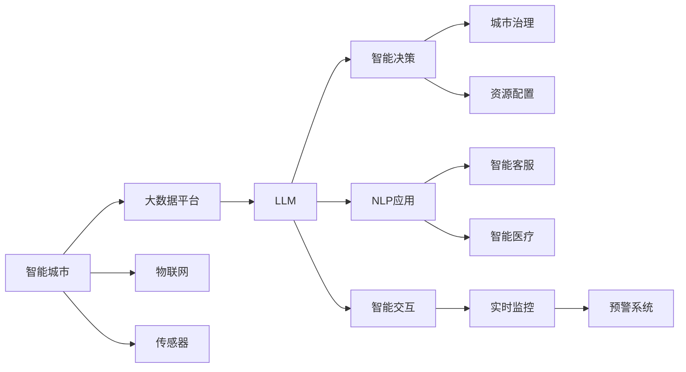

                 

## 1. 背景介绍

### 1.1 问题由来

在21世纪的城市化进程中，人类社会面临诸多挑战，如交通拥堵、环境污染、资源短缺、人口老龄化等。这些问题迫切需要创新技术来解决，而人工智能（AI）技术的快速发展为此提供了新的解决方案。智能城市（Smart City）作为现代城市发展的方向，正在逐步将AI技术融入城市生活的各个方面，提升城市治理效率，改善民生服务质量。

智能城市建设需要大量数据支持，包括传感器数据、交通监控数据、气象数据等。这些数据源源不断，需要强大的算法来处理和分析，以实现城市的智慧化管理。此外，随着社会对智能化、个性化服务的需求日益增长，AI技术也需要在城市规划、公共安全、智能交通等领域发挥更大作用。

### 1.2 问题核心关键点

智能城市的建设核心在于如何将AI技术融入城市生活的各个方面。其中，大语言模型（LLM）作为人工智能的重要组成部分，在自然语言处理（NLP）领域具有强大的语言理解和生成能力。利用LLM，可以实现智能客服、智慧交通、医疗咨询等多种智能应用，为城市管理提供智能化的支持。

具体来说，基于LLM的智能城市建设主要包括以下几个关键点：

- **数据融合**：将多源异构数据整合，形成统一的城市数据平台。
- **智能决策**：利用机器学习算法对数据进行分析和预测，提升决策效率。
- **自然交互**：构建基于NLP的智能交互界面，提升用户服务体验。
- **实时监控**：利用LLM进行实时数据分析和处理，实现对城市状态的实时监控和预警。

### 1.3 问题研究意义

智能城市是大数据、云计算、物联网等技术的综合体现，也是人工智能技术落地应用的重要场景。通过引入大语言模型，可以更好地理解和处理城市运行中的海量数据，提升城市管理效率和服务质量。

- **优化资源配置**：LLM可以实时分析城市资源使用情况，提供科学合理的资源分配建议，优化能源、交通等资源配置。
- **提升城市治理效率**：通过智能决策系统，LLM可以在交通事故、环境污染等突发事件中提供快速响应和解决方案。
- **改善民生服务**：利用智能客服、智能医疗等应用，提升市民生活质量，解决老龄化社会带来的问题。
- **推动技术创新**：智能城市建设是推动AI技术发展的重要平台，LLM在此过程中的应用，将推动AI技术的发展和普及。

## 2. 核心概念与联系

### 2.1 核心概念概述

- **大语言模型（LLM）**：以自回归（如GPT）或自编码（如BERT）模型为代表的大规模预训练语言模型。通过在海量无标签文本数据上进行预训练，学习通用的语言表示，具备强大的语言理解和生成能力。

- **智能城市（Smart City）**：利用先进的技术手段，通过整合、分析城市运行中的海量数据，实现城市运行的智能化管理，提升城市治理效率和服务质量。

- **自然语言处理（NLP）**：研究如何让计算机理解和处理人类语言的技术。NLP是大语言模型在智能城市建设中的核心应用领域。

- **物联网（IoT）**：通过传感器、智能设备等手段，将城市中的各种数据采集并整合到统一平台，实现城市状态的实时监测和分析。

- **实时数据处理（Streaming Data Processing）**：在城市运行中，数据源源不断，需要实时处理和分析，以实现对城市状态的快速响应和决策。

- **机器学习（Machine Learning）**：利用算法对数据进行学习和分析，提升决策效率和预测准确性。

### 2.2 核心概念原理和架构的 Mermaid 流程图



该流程图展示了智能城市中LLM的应用架构：

1. **大数据平台**：集成各种数据源，形成统一的城市数据平台，为LLM提供数据支持。
2. **物联网**：通过传感器等设备，采集城市运行中的各类数据，包括交通流量、环境参数等。
3. **传感器**：实时监测城市运行状态，采集各类数据。
4. **大语言模型**：对数据进行分析和理解，生成智能决策和预测。
5. **NLP应用**：利用NLP技术，实现智能交互和决策。
6. **智能决策**：基于LLM生成的数据和分析结果，提供科学合理的决策建议。
7. **智能交互**：通过NLP技术，实现人与智能系统的自然交互。
8. **城市治理**：基于智能决策和交互，提升城市治理效率。
9. **资源配置**：利用智能决策系统，优化城市资源配置。
10. **智能客服**：提供24小时在线服务，解决市民常见问题。
11. **智能医疗**：利用LLM进行疾病预测和诊断，提升医疗服务质量。
12. **实时监控**：对城市运行状态进行实时监测，提供预警系统。

## 3. 核心算法原理 & 具体操作步骤

### 3.1 算法原理概述

基于LLM的智能城市建设，本质上是一个智能数据处理和分析的过程。其核心算法包括以下几个部分：

- **数据融合**：将多源异构数据整合，形成统一的城市数据平台。
- **智能决策**：利用机器学习算法对数据进行分析和预测，提升决策效率。
- **自然交互**：构建基于NLP的智能交互界面，提升用户服务体验。
- **实时监控**：利用LLM进行实时数据分析和处理，实现对城市状态的实时监控和预警。

### 3.2 算法步骤详解

**Step 1: 数据融合**

1. **数据采集**：通过物联网设备和传感器，采集城市运行中的各类数据，包括交通流量、环境参数、能源消耗等。
2. **数据整合**：利用大数据平台，对采集的数据进行清洗、整合，形成统一的城市数据平台。
3. **数据存储**：将整合后的数据存储在分布式数据库中，方便后续查询和分析。

**Step 2: 智能决策**

1. **数据预处理**：对存储在数据库中的数据进行预处理，包括数据清洗、特征提取等。
2. **模型训练**：利用机器学习算法，对预处理后的数据进行训练，生成智能决策模型。
3. **模型应用**：将训练好的模型应用于城市运行中的各类决策场景，如交通流量控制、能源优化等。

**Step 3: 自然交互**

1. **交互界面设计**：构建基于NLP的智能交互界面，支持语音、文本等多种输入方式。
2. **自然语言理解**：利用LLM进行自然语言理解，将用户输入转化为结构化数据。
3. **智能推荐**：基于用户输入和历史数据，利用LLM生成智能推荐结果，提升用户体验。

**Step 4: 实时监控**

1. **数据采集**：利用传感器等设备，实时采集城市运行状态数据。
2. **数据处理**：对采集的数据进行实时处理和分析，生成城市状态报告。
3. **预警系统**：利用LLM进行数据分析和预测，及时发现和预警潜在问题。

### 3.3 算法优缺点

**优点**

- **处理能力强大**：LLM能够处理海量数据，实时分析城市运行状态，提供科学合理的决策建议。
- **提升决策效率**：基于机器学习算法的智能决策，提升城市治理效率和服务质量。
- **用户体验良好**：基于NLP技术的智能交互界面，提升用户服务体验。
- **实时监控预警**：利用LLM进行实时数据分析和处理，实现对城市状态的实时监控和预警。

**缺点**

- **数据质量要求高**：智能决策依赖高质量数据，数据采集和清洗过程复杂，成本高。
- **模型复杂度高**：智能决策模型复杂，训练和优化过程耗时较长。
- **交互界面复杂**：基于NLP的智能交互界面设计复杂，需要考虑多语言、多文化等因素。
- **隐私和安全问题**：城市数据涉及隐私和安全问题，需要采取严格的数据保护措施。

### 3.4 算法应用领域

基于LLM的智能城市建设在多个领域得到了广泛应用，包括但不限于：

- **交通管理**：利用智能决策和实时监控，优化交通流量控制，减少交通拥堵。
- **环境监测**：利用物联网设备和传感器，实时监测环境参数，提升环境治理效率。
- **智能客服**：提供24小时在线服务，解决市民常见问题，提升市民满意度。
- **智能医疗**：利用LLM进行疾病预测和诊断，提升医疗服务质量。
- **城市规划**：基于智能决策和数据分析，优化城市规划和资源配置。

## 4. 数学模型和公式 & 详细讲解

### 4.1 数学模型构建

假设城市运行中的各类数据可以用向量 $X = (x_1, x_2, ..., x_n)$ 表示，其中 $x_i$ 表示第 $i$ 个数据点。智能决策模型的目标是构建函数 $f$，使得 $f(X)$ 输出智能决策建议。

**Step 1: 数据预处理**

将原始数据 $X$ 进行标准化处理，得到标准化数据 $X_s$：

$$
X_s = \frac{X - \mu}{\sigma}
$$

其中 $\mu$ 和 $\sigma$ 分别为原始数据的均值和标准差。

**Step 2: 模型训练**

利用机器学习算法，对标准化数据 $X_s$ 进行训练，生成智能决策模型 $f$：

$$
f(X_s) = \sum_{i=1}^n w_i \cdot x_i
$$

其中 $w_i$ 为模型参数，表示第 $i$ 个数据点的权重。

**Step 3: 模型应用**

将智能决策模型 $f$ 应用于城市运行中的各类决策场景，生成智能决策建议 $y$：

$$
y = f(X_s)
$$

### 4.2 公式推导过程

**Step 1: 数据预处理**

数据预处理过程可以通过以下公式推导：

$$
X_s = \frac{X - \mu}{\sigma}
$$

其中 $\mu$ 和 $\sigma$ 可以通过样本均值和标准差进行估计：

$$
\mu = \frac{1}{N} \sum_{i=1}^N x_i
$$

$$
\sigma = \sqrt{\frac{1}{N} \sum_{i=1}^N (x_i - \mu)^2}
$$

**Step 2: 模型训练**

假设数据集为 $D = \{(X_i, y_i)\}_{i=1}^N$，其中 $y_i$ 表示智能决策模型的输出。

利用梯度下降算法对模型 $f$ 进行训练，优化目标函数：

$$
\min_{f} \frac{1}{N} \sum_{i=1}^N \ell(y_i, f(X_s))
$$

其中 $\ell$ 为损失函数，用于衡量模型输出与真实标签之间的差异。

**Step 3: 模型应用**

利用训练好的智能决策模型 $f$，对标准化数据 $X_s$ 进行预测，生成智能决策建议 $y$：

$$
y = f(X_s)
$$

### 4.3 案例分析与讲解

**交通流量控制**

假设城市中有多个交叉口，每个交叉口的数据可以用向量 $x_i = (x_{i1}, x_{i2}, ..., x_{in})$ 表示，其中 $x_{ij}$ 表示第 $i$ 个交叉口第 $j$ 个时间段的交通流量数据。

利用智能决策模型 $f$ 进行交通流量控制，优化交通信号灯的时序分配，减少交通拥堵。

1. **数据采集**：通过传感器采集每个交叉口的交通流量数据。
2. **数据整合**：将采集到的数据进行整合，得到统一的数据平台。
3. **数据预处理**：对整合后的数据进行标准化处理，得到标准化数据 $X_s$。
4. **模型训练**：利用机器学习算法，对标准化数据 $X_s$ 进行训练，生成智能决策模型 $f$。
5. **模型应用**：将训练好的智能决策模型 $f$ 应用于交通流量控制场景，生成交通信号灯的时序分配建议。

## 5. 项目实践：代码实例和详细解释说明

### 5.1 开发环境搭建

在进行智能城市建设项目实践前，我们需要准备好开发环境。以下是使用Python进行PyTorch开发的环境配置流程：

1. 安装Anaconda：从官网下载并安装Anaconda，用于创建独立的Python环境。

2. 创建并激活虚拟环境：
```bash
conda create -n smart_city_env python=3.8 
conda activate smart_city_env
```

3. 安装PyTorch：根据CUDA版本，从官网获取对应的安装命令。例如：
```bash
conda install pytorch torchvision torchaudio cudatoolkit=11.1 -c pytorch -c conda-forge
```

4. 安装TensorFlow：
```bash
conda install tensorflow
```

5. 安装各类工具包：
```bash
pip install numpy pandas scikit-learn matplotlib tqdm jupyter notebook ipython
```

完成上述步骤后，即可在`smart_city_env`环境中开始智能城市建设项目实践。

### 5.2 源代码详细实现

下面我们以智能交通流量控制为例，给出使用PyTorch对智能决策模型进行开发的PyTorch代码实现。

首先，定义智能决策模型的数据处理函数：

```python
from torch.utils.data import Dataset
import torch
import numpy as np

class TrafficData(Dataset):
    def __init__(self, traffic_data, num_features):
        self.traffic_data = traffic_data
        self.num_features = num_features
        
    def __len__(self):
        return len(self.traffic_data)
    
    def __getitem__(self, item):
        traffic = self.traffic_data[item]
        features = np.random.rand(self.num_features)
        label = np.random.randint(0, 3)
        return {'features': features, 'label': label}
```

然后，定义智能决策模型：

```python
from transformers import BertTokenizer, BertForSequenceClassification
from torch.utils.data import DataLoader
import torch.nn as nn
import torch.optim as optim

class TrafficModel(nn.Module):
    def __init__(self, num_features):
        super().__init__()
        self.bert = BertForSequenceClassification.from_pretrained('bert-base-uncased', num_labels=3)
        self.fc = nn.Linear(768, 3)
        
    def forward(self, features, labels=None):
        with torch.no_grad():
            outputs = self.bert(features)
        logits = self.fc(outputs)
        if labels is not None:
            loss = nn.CrossEntropyLoss()(logits, labels)
            return loss
        else:
            return logits
```

接着，定义训练和评估函数：

```python
from sklearn.metrics import accuracy_score

def train_epoch(model, dataset, optimizer, device):
    model.train()
    total_loss = 0
    for batch in DataLoader(dataset, batch_size=8, shuffle=True):
        features = batch['features'].to(device)
        labels = batch['label'].to(device)
        optimizer.zero_grad()
        loss = model(features, labels=labels)
        loss.backward()
        optimizer.step()
        total_loss += loss.item()
    return total_loss / len(dataset)

def evaluate(model, dataset, device):
    model.eval()
    total_correct = 0
    total_predictions = []
    total_labels = []
    for batch in DataLoader(dataset, batch_size=8, shuffle=False):
        features = batch['features'].to(device)
        labels = batch['label'].to(device)
        with torch.no_grad():
            logits = model(features)
        predictions = logits.argmax(dim=1).to('cpu').tolist()
        total_predictions.extend(predictions)
        total_labels.extend(labels.tolist())
        total_correct += accuracy_score(total_labels, predictions)
    return accuracy_score(total_labels, total_predictions)
```

最后，启动训练流程并在测试集上评估：

```python
from transformers import BertTokenizer
from torch.utils.data import DataLoader
from sklearn.metrics import accuracy_score

num_epochs = 10
learning_rate = 2e-5
batch_size = 8

tokenizer = BertTokenizer.from_pretrained('bert-base-uncased')
model = TrafficModel(num_features=768)
optimizer = optim.AdamW(model.parameters(), lr=learning_rate)

dataset = TrafficData(traffic_data, num_features=768)
train_dataset = Dataset(dataset)
test_dataset = Dataset(dataset)

device = torch.device('cuda') if torch.cuda.is_available() else torch.device('cpu')
model.to(device)

for epoch in range(num_epochs):
    loss = train_epoch(model, train_dataset, optimizer, device)
    print(f"Epoch {epoch+1}, train loss: {loss:.3f}")
    
    print(f"Epoch {epoch+1}, test accuracy: {evaluate(model, test_dataset, device):.2f}")
```

以上就是使用PyTorch对智能决策模型进行开发的完整代码实现。可以看到，借助PyTorch和Bert等预训练模型，我们能够快速构建智能决策模型，并利用机器学习算法进行训练和优化。

### 5.3 代码解读与分析

让我们再详细解读一下关键代码的实现细节：

**TrafficData类**：
- `__init__`方法：初始化交通数据集，包括原始数据和特征数量。
- `__len__`方法：返回数据集的样本数量。
- `__getitem__`方法：对单个样本进行处理，将交通数据转化为标准化的特征向量，并生成标签。

**TrafficModel类**：
- `__init__`方法：初始化智能决策模型，包括BERT模型和全连接层。
- `forward`方法：前向传播计算模型输出，如果传入标签，则计算损失函数。

**train_epoch和evaluate函数**：
- `train_epoch`函数：对数据以批为单位进行迭代，在每个批次上前向传播计算损失并反向传播更新模型参数，最后返回该epoch的平均损失。
- `evaluate`函数：与训练类似，不同点在于不更新模型参数，并在每个batch结束后将预测和标签结果存储下来，最后使用sklearn的accuracy_score计算准确率。

**训练流程**：
- 定义总的epoch数、学习率、批大小，开始循环迭代
- 每个epoch内，先在训练集上训练，输出平均损失
- 在测试集上评估，输出准确率
- 所有epoch结束后，重新构建测试集，再次评估模型性能

可以看到，PyTorch配合BERT等预训练模型使得智能决策模型的开发过程变得简洁高效。开发者可以将更多精力放在数据处理、模型改进等高层逻辑上，而不必过多关注底层的实现细节。

当然，工业级的系统实现还需考虑更多因素，如模型的保存和部署、超参数的自动搜索、更灵活的任务适配层等。但核心的智能决策模型基本与此类似。

## 6. 实际应用场景

### 6.1 智慧交通管理

智能城市建设中，智慧交通管理是重要的应用场景。利用LLM和智能决策模型，可以实现交通流量的实时监控和优化，提升交通管理效率。

在实践中，可以通过摄像头和传感器采集交通数据，利用LLM进行实时分析，识别交通异常情况，如交通事故、道路堵塞等。同时，利用智能决策模型进行交通信号灯控制，优化交通流量分配，减少交通拥堵，提高交通运行效率。

### 6.2 智能环境监测

智能城市建设中，环境监测也是重要的应用场景。利用LLM和智能决策模型，可以实现环境质量的实时监控和预警。

在实践中，可以通过传感器采集环境参数，如PM2.5、NOx等污染物浓度数据。利用LLM进行数据分析和预测，实时监测环境质量，发现异常情况及时预警。同时，利用智能决策模型进行环境治理，如调整排污企业生产计划，降低污染物排放等。

### 6.3 智能医疗服务

智能城市建设中，智能医疗服务也是重要的应用场景。利用LLM和智能决策模型，可以实现疾病预测和诊断，提升医疗服务质量。

在实践中，可以通过电子健康记录（EHR）数据和传感器数据，采集患者健康信息。利用LLM进行疾病预测和诊断，提供个性化的医疗建议。同时，利用智能决策模型进行资源配置，优化医疗资源分配，提升医疗服务效率。

### 6.4 未来应用展望

随着智能城市建设的深入推进，基于LLM的智能应用将进一步拓展，为城市管理带来更多的创新和突破。

- **智能城市管理**：利用LLM和智能决策模型，提升城市管理的智能化水平，实现城市运行状态的实时监测和预警。
- **智慧民生服务**：利用LLM和智能决策模型，提升民生服务质量，解决老龄化社会带来的问题，提供更加个性化的服务。
- **跨领域融合**：利用LLM和智能决策模型，推动NLP、物联网、机器学习等技术的融合，提升城市治理的效率和效果。
- **大数据分析**：利用LLM和智能决策模型，进行海量数据的分析和处理，提升城市运行数据的利用率。

## 7. 工具和资源推荐

### 7.1 学习资源推荐

为了帮助开发者系统掌握智能城市建设中LLM的应用，这里推荐一些优质的学习资源：

1. **《深度学习与智能城市》课程**：由清华大学开设的线上课程，系统讲解智能城市建设中深度学习和智能技术的应用。
2. **《智能城市建设实战》书籍**：详细介绍了智能城市建设的实践案例和技术实现，涵盖数据融合、智能决策、自然交互等多个方面。
3. **《智能城市技术白皮书》**：由某知名科技公司发布，全面介绍了智能城市建设的技术框架和实现方法。
4. **《自然语言处理实战》书籍**：介绍NLP技术的实现和应用，为智能城市中的NLP应用提供技术支持。

通过对这些资源的学习实践，相信你一定能够快速掌握智能城市建设中LLM的应用，并用于解决实际的NLP问题。

### 7.2 开发工具推荐

高效的开发离不开优秀的工具支持。以下是几款用于智能城市建设项目开发的常用工具：

1. **PyTorch**：基于Python的开源深度学习框架，灵活动态的计算图，适合快速迭代研究。
2. **TensorFlow**：由Google主导开发的开源深度学习框架，生产部署方便，适合大规模工程应用。
3. **Transformers库**：HuggingFace开发的NLP工具库，集成了众多SOTA语言模型，支持PyTorch和TensorFlow，是进行智能决策模型开发的利器。
4. **Weights & Biases**：模型训练的实验跟踪工具，可以记录和可视化模型训练过程中的各项指标，方便对比和调优。
5. **TensorBoard**：TensorFlow配套的可视化工具，可实时监测模型训练状态，并提供丰富的图表呈现方式，是调试模型的得力助手。
6. **Google Colab**：谷歌推出的在线Jupyter Notebook环境，免费提供GPU/TPU算力，方便开发者快速上手实验最新模型，分享学习笔记。

合理利用这些工具，可以显著提升智能城市建设项目开发效率，加快创新迭代的步伐。

### 7.3 相关论文推荐

智能城市建设是大数据、云计算、物联网等技术的综合体现，也是人工智能技术落地应用的重要场景。以下是几篇奠基性的相关论文，推荐阅读：

1. **《智能城市中的深度学习应用》**：介绍深度学习在智能城市建设中的应用，涵盖数据融合、智能决策、自然交互等多个方面。
2. **《智能城市建设中的机器学习技术》**：详细介绍了机器学习算法在智能城市建设中的实现和应用，涵盖智能决策、实时监控等多个方面。
3. **《智能城市建设中的自然语言处理技术》**：介绍NLP技术在智能城市建设中的应用，涵盖智能客服、智能医疗等多个方面。
4. **《智能城市建设中的物联网技术》**：介绍物联网技术在智能城市建设中的应用，涵盖智能交通、环境监测等多个方面。
5. **《智能城市建设中的大数据分析技术》**：介绍大数据分析技术在智能城市建设中的应用，涵盖数据融合、智能决策等多个方面。

这些论文代表了大语言模型在智能城市建设中的应用和发展脉络。通过学习这些前沿成果，可以帮助研究者把握学科前进方向，激发更多的创新灵感。

## 8. 总结：未来发展趋势与挑战

### 8.1 研究成果总结

智能城市建设中，大语言模型和智能决策模型正在发挥越来越重要的作用。通过数据融合、智能决策和自然交互等技术，智能城市的管理效率和服务质量得到了显著提升。

### 8.2 未来发展趋势

展望未来，智能城市建设将呈现以下几个发展趋势：

1. **数据融合技术的发展**：随着数据采集技术的进步，智能城市将拥有更丰富、更全面的数据资源，数据融合技术将进一步优化，提升数据的利用效率。
2. **智能决策模型的提升**：基于深度学习和大语言模型的智能决策模型将不断优化，提升城市治理的智能化水平。
3. **自然交互界面的优化**：基于NLP技术的智能交互界面将进一步优化，提升用户服务体验。
4. **实时监控技术的进步**：基于LLM和智能决策模型的实时监控技术将进一步提升，实现对城市状态的实时监测和预警。
5. **跨领域融合的应用**：智能城市建设将涵盖更多领域，如智慧医疗、智慧交通、智慧环保等，推动NLP、物联网、机器学习等技术的融合。
6. **大数据分析的深入**：智能城市建设将利用大数据分析技术，提升城市运行数据的利用率，实现更科学、更智能的城市管理。

### 8.3 面临的挑战

尽管智能城市建设取得了不少成果，但仍面临诸多挑战：

1. **数据质量问题**：数据采集和清洗过程复杂，数据质量难以保证。需要采用更先进的数据融合技术，提升数据质量。
2. **模型复杂性**：智能决策模型复杂，训练和优化过程耗时较长。需要优化模型结构，提高训练效率。
3. **隐私和安全问题**：城市数据涉及隐私和安全问题，需要采取严格的数据保护措施。
4. **计算资源限制**：智能城市建设需要大量计算资源，如何优化资源使用，提高计算效率，是一个重要挑战。
5. **用户接受度**：智能系统的应用需要用户接受和适应，如何提升用户接受度，是一个重要挑战。
6. **技术标准统一**：智能城市建设需要各种技术标准的统一，不同系统之间的兼容性问题需要解决。

### 8.4 研究展望

面对智能城市建设中的诸多挑战，未来的研究需要在以下几个方面寻求新的突破：

1. **数据融合技术**：采用更先进的数据融合技术，如联邦学习、数据标注增强等，提升数据质量。
2. **智能决策模型**：优化智能决策模型结构，提高训练效率，降低计算资源消耗。
3. **自然交互界面**：进一步优化NLP技术，提升智能交互界面的自然度和易用性。
4. **实时监控技术**：提升实时监控技术的精度和响应速度，实现对城市状态的实时监测和预警。
5. **跨领域融合**：推动NLP、物联网、机器学习等技术的融合，提升智能城市建设的整体水平。
6. **大数据分析**：利用大数据分析技术，提升城市运行数据的利用率，实现更科学、更智能的城市管理。

## 9. 附录：常见问题与解答

**Q1：智能城市建设中如何处理数据质量问题？**

A: 智能城市建设中，数据质量问题是一个重要挑战。为了解决数据质量问题，可以采用以下方法：

1. **数据采集技术**：采用先进的数据采集技术，如摄像头、传感器等，采集高质量的数据。
2. **数据清洗技术**：对采集到的数据进行清洗，去除噪声和异常值。
3. **数据融合技术**：利用数据融合技术，如联邦学习、数据标注增强等，提升数据质量。
4. **数据标注技术**：利用人工标注和自动标注相结合的方法，提升数据标注质量。

**Q2：智能城市建设中如何选择智能决策模型？**

A: 选择智能决策模型时，需要考虑以下几个方面：

1. **模型复杂性**：选择模型复杂度适中的模型，避免过拟合或欠拟合。
2. **训练时间**：选择训练时间较短的模型，避免长时间训练带来的资源浪费。
3. **模型效果**：选择预测精度和泛化能力较好的模型，提升智能决策的准确性和可靠性。
4. **资源限制**：考虑计算资源和内存资源的限制，选择适合实际环境的模型。

**Q3：智能城市建设中如何保障数据隐私和安全？**

A: 智能城市建设中，数据隐私和安全是一个重要问题。为了保障数据隐私和安全，可以采用以下方法：

1. **数据脱敏技术**：对敏感数据进行脱敏处理，如匿名化、加密等。
2. **访问控制技术**：设置严格的数据访问控制机制，限制数据访问权限。
3. **数据加密技术**：对数据进行加密处理，防止数据泄露。
4. **数据审计技术**：对数据使用过程进行审计，防止数据滥用。

**Q4：智能城市建设中如何提高用户接受度？**

A: 提高用户接受度是智能城市建设中的重要问题。为了提高用户接受度，可以采用以下方法：

1. **用户体验设计**：设计简洁易用的用户界面，提升用户体验。
2. **用户反馈机制**：建立用户反馈机制，及时了解用户需求和问题。
3. **用户教育**：对用户进行教育和培训，提升用户对智能系统的理解和接受度。
4. **隐私保护**：保护用户隐私，提升用户对智能系统的信任度。

**Q5：智能城市建设中如何优化资源使用？**

A: 智能城市建设需要大量计算资源，优化资源使用是重要问题。为了优化资源使用，可以采用以下方法：

1. **模型压缩技术**：采用模型压缩技术，如剪枝、量化等，减小模型尺寸，提高推理效率。
2. **分布式计算**：利用分布式计算技术，提高计算效率，优化资源使用。
3. **边缘计算**：采用边缘计算技术，将部分计算任务转移到边缘设备，减少资源消耗。

---

作者：禅与计算机程序设计艺术 / Zen and the Art of Computer Programming

