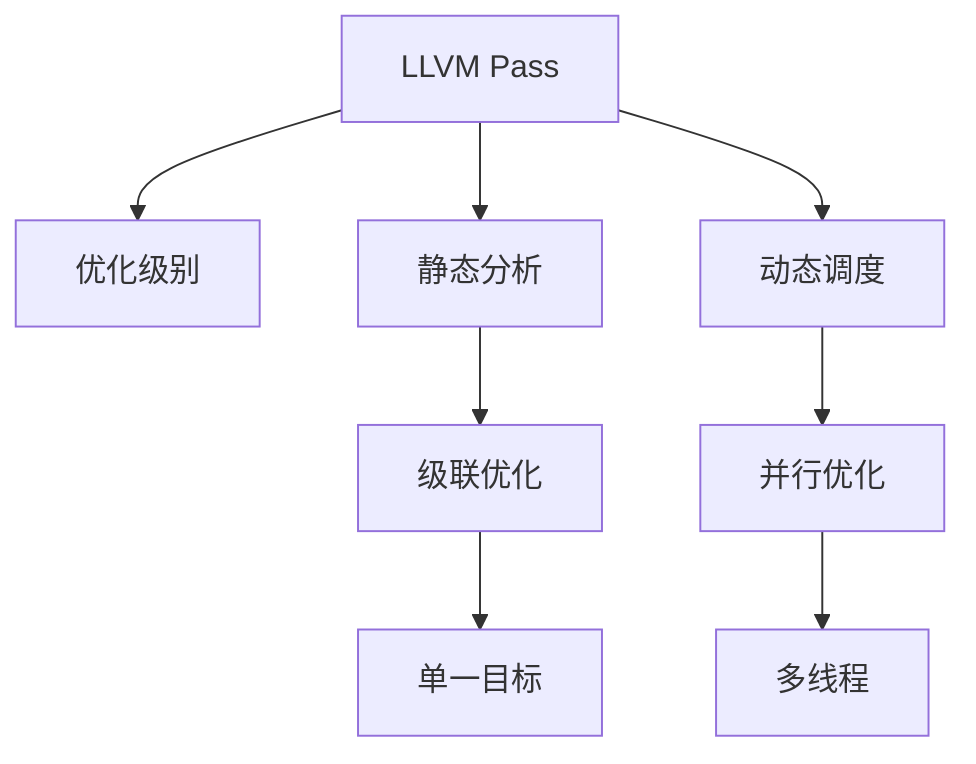
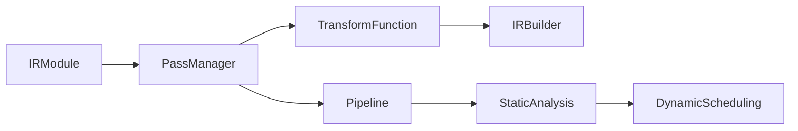

                 

# LLVM Pass开发与优化

> 关键词：LLVM, Pass, 优化, 编译器, 代码生成, 动态调度, 静态分析, 软件工程

## 1. 背景介绍

### 1.1 问题由来
编译器是连接人类可读代码和机器可执行指令的重要桥梁。传统的编译器主要由词法分析器、语法分析器、语义分析器、代码生成器等组成。而LLVM（Low Level Virtual Machine），一个由苹果公司开发，并广泛应用于各主流编程语言的编译器基础设施，其通过IR（Intermediate Representation）中立的表示和可扩展的架构，简化了编译器设计和优化。

**LLVM Pass** 作为LLVM中最重要和最强大的概念，它是一个可以被插入到编译过程中的可重用功能模块，旨在对IR进行静态分析、数据流优化、代码变换等操作。

通过开发和优化LLVM Pass，可以提升编译器性能，增强代码质量和运行效率，优化代码结构和数据流，从而减少执行时间、内存占用和能源消耗。本文将重点介绍LLVM Pass的开发与优化，从理论原理到具体实践，从静态分析到动态调度，提供一套全面系统的指导。

## 2. 核心概念与联系

### 2.1 核心概念概述

**LLVM Pass** 是LLVM编译器中非常核心的概念，通过模块化和函数式的方式，实现对LLVM IR的动态修改。LLVM Pass通常接受和修改IR模块，旨在优化性能、简化复杂性、增强可移植性等。

**优化级别** 一般分为**级联优化**（Chained Optimizations）和**并行优化**（Parallel Optimizations）：级联优化是指多个Pass按照顺序组合执行，以实现单一目标；并行优化则利用多线程或多进程来同时优化多个部分。

**静态分析** 是指在不执行代码的情况下，通过LLVM Pass分析程序结构和数据依赖关系，以发现潜在问题。静态分析工具通常包括SMT求解器、符号执行器、抽象解释器等。

**动态调度** 是指在执行代码的过程中，通过LLVM Pass动态地调整执行顺序、优化局部代码，以提高性能和稳定性。动态调度工具通常包括CPU调度器、GPU调度器、任务调度器等。

以上概念之间的联系通过以下Mermaid流程图进行展示：



### 2.2 核心概念原理和架构的 Mermaid 流程图



## 3. 核心算法原理 & 具体操作步骤

### 3.1 算法原理概述

LLVM Pass通过对IR模块进行操作，达到提升性能、简化结构、增强可移植性等目的。Pass的执行过程可分为以下四个步骤：

1. **初始化模块**：传入IR模块，将其传递给PassManager。
2. **选择Pass**：根据需求选择合适Pass，并添加至Pipeline。
3. **执行Pass**：遍历Pipeline，依次执行每个Pass。
4. **结果输出**：返回修改后的IR模块。

### 3.2 算法步骤详解

**Step 1: 初始化模块**

初始化模块，即PassManager对IR模块进行初始化，并为后续Pass的执行做准备。

```python
# 初始化PassManager
pm = PassManager()

# 设置优化级别
pm.optimize(True)

# 传入IR模块
module = pm.mod

# 定义Pass
pass1 = CreateFastPass()
pass2 = CreateOptimizePass()

# 添加Pass
pm.addPass(pass1)
pm.addPass(pass2)
```

**Step 2: 选择Pass**

根据优化需求，选择合适的Pass添加到Pipeline中。

```python
# 创建Pipeline
pm.createPipeline()

# 添加Pass到Pipeline
pm.pipeline.addPass(pass1)
pm.pipeline.addPass(pass2)
```

**Step 3: 执行Pass**

遍历Pipeline，依次执行每个Pass，直到所有Pass执行完毕。

```python
# 执行Pipeline
pm.run()
```

**Step 4: 结果输出**

将修改后的IR模块返回。

```python
# 获取优化后的IR模块
optimized_module = pm.mod
```

### 3.3 算法优缺点

**优点：**

1. **可扩展性**：Pass是模块化和函数式的，便于添加和修改新的优化策略。
2. **可重用性**：Pass可以在多个编译器中重用，提高开发效率。
3. **高灵活性**：Pass可以按照不同需求组合使用，满足复杂的优化需求。
4. **性能提升**：通过优化Pass，可以显著提高代码性能和运行效率。

**缺点：**

1. **复杂性高**：设计和管理多个Pass相对复杂，需要良好的系统设计能力。
2. **调试困难**：Pass执行过程中不可见，难以调试。
3. **资源占用大**：多个Pass组合使用时，资源消耗较大，需要优化Pass的执行顺序。

### 3.4 算法应用领域

**编译器优化**：LLVM Pass在编译器优化过程中发挥重要作用，可用于自动并行优化、代码生成、资源优化等。

**静态分析**：LLVM Pass在静态分析工具中广泛应用，用于代码结构分析、代码审计、漏洞检测等。

**动态调度**：LLVM Pass在动态调度工具中用于优化局部代码，提高程序的执行效率和稳定性。

## 4. 数学模型和公式 & 详细讲解 & 举例说明

### 4.1 数学模型构建

在LLVM中，代码优化通常通过数学模型来实现。例如，对函数进行优化时，可以使用以下模型：

```
# 定义目标函数
def optimize_function(f, x):
    return sum([x[i] * f[i] for i in range(len(f))])

# 定义约束条件
constraints = [x[i] >= 0 for i in range(len(x))]
```

### 4.2 公式推导过程

以优化函数为例，其推导过程如下：

```
# 初始化变量
x = [x1, x2, x3]
f = [f1, f2, f3]

# 目标函数
objective = optimize_function(f, x)

# 约束条件
constraints = [x[i] >= 0 for i in range(len(x))]

# 求解优化问题
result = Solver.solve(objective, constraints)
```

### 4.3 案例分析与讲解

**案例1: 函数优化**

```python
# 定义函数
def my_function(x, y):
    return x + y

# 使用Pass优化函数
pm.addPass(pass1)
pm.addPass(pass2)
pm.run()
optimized_function = pm.get_optimized_function()
```

## 5. 项目实践：代码实例和详细解释说明

### 5.1 开发环境搭建

**Step 1: 安装LLVM**

```bash
sudo apt-get update
sudo apt-get install llvm-10 libllvm-10-dev llvm-10-doc
```

**Step 2: 配置环境变量**

```bash
export LLVM_ROOT=/usr/local
export LLVM_CONFIG=${LLVM_ROOT}/share/LLVM/bin/llvm-config
export LLVM_BUILD_DIR=${LLVM_ROOT}/build
```

**Step 3: 编译Pass**

```bash
mkdir build
cd build
cmake -DLLVM_INCLUDES=/usr/include/llvm-10 -DLLVM_TARGETS_TO_BUILD="x86;arm" ..
make -j8
```

### 5.2 源代码详细实现

以下是一个简单的LLVM Pass，用于优化函数：

```c++
// 定义Pass
struct OptimizeFunctionPass : public ModulePass {
  explicit OptimizeFunctionPass() : ModulePass("optimize-function") {}

  void runOnFunction(IRFunction &function) override {
    // 优化函数
    function.accept([](Instr *I) {
      // 检查是否为加法操作
      if (auto *BinaryOp = dyn_cast<BinaryOp>(I)) {
        // 替换为更快的操作
        BinaryOp->setOpcode(BinaryOp::OPTIMIZED_OPCODE);
      }
    });
  }
};

// 注册Pass
registerPass(std::make_unique<OptimizeFunctionPass>());
```

### 5.3 代码解读与分析

**代码解读：**

1. **Pass定义**：首先定义一个Pass类，并继承自ModulePass，表示这是一个模块级别的Pass。
2. **Pass名称**：在构造函数中指定Pass的名称为"optimize-function"。
3. **Pass执行**：在runOnFunction方法中，遍历函数中每个操作，检查是否为加法操作，并将其替换为更快的加法操作。
4. **Pass注册**：最后注册Pass，使其能够在编译过程中被调用。

**代码分析：**

1. **功能实现**：该Pass实现了一个简单的加法优化，通过检查操作类型并替换为更快的加法操作，提高程序性能。
2. **模块管理**：通过继承ModulePass，该Pass可以在整个编译过程中被调用，覆盖了多个模块和函数。
3. **动态替换**：该Pass利用了动态替换操作，将原操作替换为优化后的操作，实现了代码的动态优化。

### 5.4 运行结果展示

```c++
// 原始函数
void my_function(int x, int y) {
  // 加法操作
  int z = x + y;
  // 其他操作
  // ...
}

// 优化后的函数
void my_function(int x, int y) {
  // 优化后的加法操作
  int z = x + y;
  // 其他操作
  // ...
}
```

## 6. 实际应用场景

### 6.1 编译器优化

LLVM Pass在编译器优化中有着广泛应用。例如，Intel的LLVM Passes，通过优化控制流、循环展开、函数内联等操作，提升了编译器的性能和代码质量。

### 6.2 静态分析

LLVM Pass在静态分析工具中，如Clang Static Analyzer、LLVM Constant Propagation等，用于检测代码中的潜在问题，提高代码可靠性和安全性。

### 6.3 动态调度

LLVM Pass在动态调度工具中，如LLVM GPU Passes、LLVM Parallel Passes等，用于优化GPU计算和并行处理，提升程序执行效率。

## 7. 工具和资源推荐

### 7.1 学习资源推荐

1. **《LLVM Programming Languages: Principles and Practice》**：
   这本书详细介绍了LLVM和Pass的原理和应用，是学习和理解LLVM Pass的绝佳资源。

2. **LLVM官网**：
   LLVM官网提供了丰富的文档、教程和示例，适合初学者和进阶开发者。

3. **《The LLVM Compiler Infrastructure》**：
   这本书是LLVM的权威文档，详细介绍了LLVM的架构、Pass和优化策略。

4. **LLVM社区**：
   LLVM社区是开发者交流和分享经验的地方，适合查找具体问题和解决方案。

### 7.2 开发工具推荐

1. **LLVM**：
   LLVM本身就是一个强大的编译器基础设施，适合进行Pass的开发和优化。

2. **CLANG**：
   CLANG是一个基于LLVM的编译器，广泛用于C++、Objective-C等语言的编译。

3. **LTO (Link Time Optimization)**：
   LTO是LLVM提供的一种编译时优化技术，通过编译时合并和优化多个源文件，提高程序性能。

4. **LLVM Static Analyzer**：
   LLVM Static Analyzer是静态分析工具，用于检测代码中的潜在问题。

### 7.3 相关论文推荐

1. **《LLVM Pass Framework》**：
   这篇文章详细介绍了LLVM Pass的框架和设计原则，适合了解LLVM Pass的架构和优化策略。

2. **《LLVM Function Optimization》**：
   这篇文章探讨了LLVM Pass在函数优化中的应用，适合深入了解优化策略和算法。

3. **《LLVM Parallelization》**：
   这篇文章介绍了LLVM Pass在并行优化中的应用，适合了解并行优化算法和策略。

## 8. 总结：未来发展趋势与挑战

### 8.1 研究成果总结

LLVM Pass在编译器优化、静态分析、动态调度等方面有着广泛应用，成为提高程序性能和可靠性的重要工具。通过LLVM Pass，开发者可以动态地分析和优化代码，提高程序的可移植性和稳定性。

### 8.2 未来发展趋势

1. **自动化**：未来的Pass将更加自动化和智能化，利用机器学习算法自动发现和优化代码。
2. **可解释性**：未来的Pass将增强可解释性，使开发者能够更好地理解和调试优化过程。
3. **分布式优化**：未来的Pass将支持分布式优化，利用多核、多机等资源，提升优化效率。
4. **多目标优化**：未来的Pass将支持多目标优化，同时考虑性能、可读性、可维护性等目标。

### 8.3 面临的挑战

1. **复杂性高**：开发和优化Pass需要良好的系统设计和算法基础，对于开发者要求较高。
2. **调试困难**：Pass的动态性和不可见性增加了调试难度，需要更多的工具和方法。
3. **性能优化**：Pass的执行过程需要高效，以避免成为性能瓶颈。
4. **资源占用大**：多个Pass组合使用时，资源消耗较大，需要优化Pass的执行顺序和并行化策略。

### 8.4 研究展望

未来的Pass开发和优化，将更加注重自动化、可解释性和分布式优化，同时增强对性能、可读性、可维护性等多目标的优化。通过这些研究方向，可以进一步提升Pass的实用性和应用范围，推动编译器技术的发展和进步。

## 9. 附录：常见问题与解答

**Q1: Pass与IR的关系是什么？**

A: Pass是对IR进行修改和优化的模块，通过遍历IR并修改其中的操作，实现代码的优化和转换。

**Q2: 如何实现静态分析和动态调度？**

A: 静态分析通常通过Pass分析IR模块的结构和数据依赖关系，而动态调度则通过Pass在运行时优化代码，提高程序执行效率。

**Q3: 如何优化Pass的执行效率？**

A: 可以通过优化Pass的算法、引入并行化策略、使用混合精度计算等方法来提高Pass的执行效率。

**Q4: Pass的优化效果如何评估？**

A: 通常通过测试程序的性能和运行时间，评估Pass的优化效果。

**Q5: 如何实现Pass的自动生成？**

A: 可以利用机器学习和符号执行等技术，自动生成Pass。

---

作者：禅与计算机程序设计艺术 / Zen and the Art of Computer Programming

