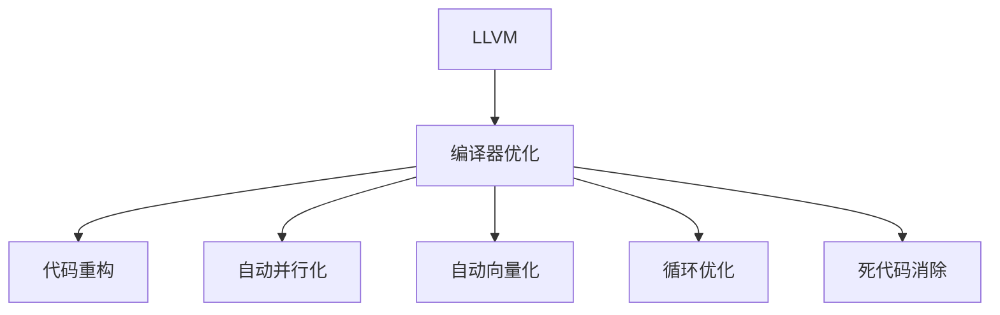

                 

# LLVM 优化：提高代码性能

> 关键词：LLVM, 代码优化, 性能提升, 编译器技术, 自动化优化, 软件工程

## 1. 背景介绍

在软件开发过程中，代码性能的优化始终是一个重要议题。特别是对于大型系统或高性能计算应用，性能瓶颈常常成为限制其发展的主要因素。代码优化不仅仅是追求更高的运行速度，更关乎代码的可维护性、可扩展性、可重用性和可读性。因此，深入理解并合理应用代码优化技术，对于软件开发人员和系统架构师来说，是一项至关重要的技能。

### 1.1 问题由来
现代软件开发日益复杂，不仅需要开发人员具备扎实的编程技能，还需要了解性能调优的基础知识。在以往的开发过程中，开发人员主要依靠经验和直觉来进行性能调优。然而，随着软件规模的不断扩大和系统要求的日益提高，传统的经验式调优方法已经无法满足需求。因此，自动化性能优化技术应运而生，特别是在编译器领域，自动化的代码优化成为了提高代码性能的有效手段。

### 1.2 问题核心关键点
编译器自动化的代码优化技术主要包括以下几个关键点：
- 代码重构：通过自动化工具，将代码重构为更高效的形式。
- 自动并行化：通过自动插入并行指令，利用多核CPU或GPU等硬件资源提升性能。
- 自动向量化：将单线程操作转换为并行向量运算，提高运算效率。
- 循环优化：对循环体进行优化，提升循环效率。
- 死代码消除：识别和删除不产生任何效果的代码。

这些优化技术不仅可以显著提升代码性能，还能提高代码的可读性和可维护性，对软件开发具有重要的意义。

## 2. 核心概念与联系

### 2.1 核心概念概述

为了更好地理解LLVM编译器及其优化技术，本节将介绍几个核心概念：

- **LLVM (Low-Level Virtual Machine)**：一种现代编译器基础设施，能够自动将源代码转换为高效的目标代码。LLVM提供了广泛的优化技术，涵盖了从指令级优化到代码级优化的多个层面。
- **编译器优化**：通过自动化的方式对源代码进行分析，并优化为目标代码的过程。常见的编译器优化包括代码重构、并行化、向量化、循环优化等。
- **自动化优化工具**：使用自动化的方式对代码进行性能优化，以减少开发人员的手动工作量。
- **代码重构**：通过对代码进行重新设计，以提高代码的可读性、可维护性和性能。
- **自动并行化**：通过自动插入并行指令，利用多核CPU或GPU等硬件资源提升代码性能。
- **自动向量化**：将单线程操作转换为并行向量运算，提高运算效率。
- **循环优化**：对循环体进行优化，提升循环效率。
- **死代码消除**：识别和删除不产生任何效果的代码。

这些核心概念之间的逻辑关系可以通过以下Mermaid流程图来展示：



这个流程图展示了这个核心概念的逻辑关系：

1. LLVM作为现代编译器基础设施，提供了广泛的优化技术。
2. 编译器优化技术包括代码重构、自动并行化、自动向量化、循环优化和死代码消除等。

## 3. 核心算法原理 & 具体操作步骤
### 3.1 算法原理概述

LLVM编译器优化技术主要基于以下算法原理：

- **程序分析**：通过对源代码进行静态分析，确定代码中存在的性能瓶颈和优化机会。
- **优化目标**：基于程序分析结果，确定优化的具体目标，如减少循环迭代次数、消除冗余代码、提高代码并行性等。
- **优化策略**：针对确定的优化目标，选择合适的优化策略，如代码重构、并行化、向量化等。
- **优化实现**：将优化策略具体实现为目标代码，利用LLVM中间代码表示进行优化。

### 3.2 算法步骤详解

以下是使用LLVM进行代码优化的具体操作步骤：

**Step 1: 编写源代码**
- 使用编程语言编写源代码，如C++、Java、Python等。
- 根据需求对源代码进行初步设计。

**Step 2: 编译源代码**
- 使用LLVM编译器将源代码编译为LLVM中间代码。
- 在编译过程中，LLVM会对代码进行初步优化。

**Step 3: 程序分析**
- 使用LLVM提供的程序分析工具，对生成的LLVM中间代码进行分析，找出潜在的性能瓶颈和优化机会。
- 常见分析工具包括LLVM Profiler、LLVM SCC、LLVM Vectorizer等。

**Step 4: 优化策略选择**
- 根据分析结果，选择合适的优化策略。
- 例如，对于循环密集型代码，可以采用循环展开、循环合并等优化策略。

**Step 5: 优化实现**
- 使用LLVM Intermediate Representation (IR)语言，将优化策略具体实现为目标代码。
- 例如，对于循环展开，可以在LLVM IR中插入额外的循环体。

**Step 6: 编译优化后的代码**
- 使用LLVM编译器对优化后的代码进行编译，生成可执行文件。
- 在编译过程中，LLVM会对优化后的代码进行进一步优化。

**Step 7: 测试和验证**
- 使用测试用例对优化后的代码进行测试，验证优化效果。
- 如果优化效果不理想，则返回到第3步，重新进行程序分析和优化策略选择。

### 3.3 算法优缺点

LLVM编译器优化技术具有以下优点：

- 自动化程度高：能够自动进行代码分析和优化，减少了开发人员的工作量。
- 优化效果显著：能够显著提升代码性能，特别是在循环密集型和并行代码的优化上效果尤为显著。
- 可扩展性强：能够支持多种编程语言和目标平台，适用于不同类型的应用场景。

然而，LLVM编译器优化技术也存在以下缺点：

- 过度优化可能导致可读性下降：自动化优化可能导致代码变得难以理解和维护。
- 存在优化代价：某些优化策略可能会增加代码的复杂度，反而降低性能。
- 依赖于源代码质量：源代码质量和结构设计对优化效果影响较大，需要高质量的源代码作为基础。

### 3.4 算法应用领域

LLVM编译器优化技术广泛应用于以下几个领域：

- **高性能计算**：如科学计算、金融分析、天气预报等需要高性能计算的应用。
- **嵌入式系统**：如智能硬件、物联网设备等资源受限的嵌入式系统。
- **游戏开发**：如大型游戏引擎、图形渲染等对性能要求较高的应用。
- **移动应用**：如安卓、iOS等移动平台的应用开发。
- **网络应用**：如Web服务器、网络通信等需要高并发和高性能的应用。

## 4. 数学模型和公式 & 详细讲解 & 举例说明

### 4.1 数学模型构建

为了更好地理解LLVM优化技术，我们将以简单的程序循环为例，构建数学模型并推导其优化过程。

假设有一循环结构，代码如下：

```cpp
for (int i = 0; i < n; i++) {
    for (int j = 0; j < m; j++) {
        A[i][j] = B[i][j] + C[i][j];
    }
}
```

其中，A、B、C为二维数组，n、m为循环变量。

### 4.2 公式推导过程

通过对代码进行分析和优化，可以得到以下优化策略：

- **循环展开**：将内部循环展开到外部循环中。
- **消除冗余计算**：消除内部循环中冗余的计算。

**循环展开优化**：

对内部循环进行展开，代码如下：

```cpp
for (int i = 0; i < n; i++) {
    for (int k = 0; k < m; k++) {
        A[i][k] = B[i][k];
    }
    for (int j = k + 1; j < m; j++) {
        A[i][j] = B[i][j] + C[i][j];
    }
}
```

展开后的代码减少了内部循环的次数，提升了循环效率。

**消除冗余计算优化**：

对内部循环中冗余的计算进行消除，代码如下：

```cpp
for (int i = 0; i < n; i++) {
    for (int j = 0; j < m; j++) {
        A[i][j] = B[i][j] + C[i][j];
    }
}
```

消除冗余计算后，减少了代码中的重复计算，提升了代码性能。

### 4.3 案例分析与讲解

以循环展开和消除冗余计算为例，展示LLVM编译器优化技术的应用。

**案例背景**：
假设有一包含大量循环的程序，程序中存在大量计算操作，但计算过程存在冗余。开发人员需要对其进行优化，以提升代码性能。

**优化过程**：
1. 使用LLVM Profiler对程序进行性能分析，找出性能瓶颈。
2. 发现内部循环中存在大量冗余计算，决定对其进行循环展开和消除冗余计算。
3. 在LLVM IR中插入展开后的代码，并进行优化实现。
4. 对优化后的代码进行编译，生成可执行文件。
5. 对优化后的程序进行测试，验证优化效果。

## 5. 项目实践：代码实例和详细解释说明
### 5.1 开发环境搭建

在进行LLVM代码优化实践前，我们需要准备好开发环境。以下是使用LLVM进行代码优化的环境配置流程：

1. 安装LLVM：从官网下载并安装LLVM编译器，选择适合自己平台的版本。
2. 配置LLVM：根据平台和需求，对LLVM进行配置，设置编译器路径、优化选项等。
3. 编写源代码：使用C++、Java、Python等编程语言编写源代码。
4. 编译源代码：使用LLVM编译器将源代码编译为LLVM中间代码。
5. 进行优化：使用LLVM提供的优化工具对中间代码进行分析和优化。
6. 生成可执行文件：使用LLVM编译器将优化后的中间代码编译为可执行文件。
7. 测试和验证：使用测试用例对优化后的程序进行测试，验证优化效果。

完成上述步骤后，即可在LLVM环境中开始代码优化实践。

### 5.2 源代码详细实现

以下是使用LLVM对C++代码进行循环优化实践的代码实现：

```cpp
// 原始代码
for (int i = 0; i < n; i++) {
    for (int j = 0; j < m; j++) {
        A[i][j] = B[i][j] + C[i][j];
    }
}

// 使用LLVM进行优化
#include "llvm/IR/IRBuilder.h"
#include "llvm/IR/LLVMContext.h"
#include "llvm/IR/Module.h"
#include "llvm/IR/Function.h"
#include "llvm/IR/BasicBlock.h"
#include "llvm/IR/Value.h"
#include "llvm/IR/Instructions.h"
#include "llvm/IR/Type.h"
#include "llvm/Target/TargetMachine.h"
#include "llvm/Target/TargetParser.h"
#include "llvm/Target/TargetOptions.h"
#include "llvm/Target/TargetSelect.h"
#include "llvm/Support/TargetSelect.h"
#include "llvm/Support/TargetParser.h"
#include "llvm/Support/InitLLVM.h"

using namespace llvm;
using namespace llvm::orc;
using namespace llvm::object;

// 创建模块
Module *createModule(std::string filename) {
    LLVMContext context;
    Module *module = new Module("", context);
    LLVMInitializeX86Target();
    LLVMInitializeX86TargetMC();
    LLVMInitializeX86AsmPrinter();
    LLVMInitializeX86TargetInfo();
    return module;
}

// 创建函数
Function *createFunction(Module *module, std::string function_name, std::string func_type) {
    FunctionType func_type_ = FunctionType::get(
        module->getContext(), ArrayRef<Type>{Type::getFloatTy(context)}, ArrayRef<Type>{Type::getFloatTy(context)});
    Function *function = Function::Create(func_type_, Function::LinkageTypes::ExternalLinkage, function_name, module);
    return function;
}

// 插入循环展开代码
Value *insertLoopUnroll(IRBuilder<> &builder, Module *module, Function *function) {
    // 创建循环
    BasicBlock *bb0 = BasicBlock::Create(module->getContext(), "entry", function);
    IRBuilder<> builder(bb0);
    
    // 创建循环展开后的代码
    Value *i = builder.CreateGEP(module->getDataLayout(), function, {ConstantInt::get(function->getArg(0)->getType(), 0)});
    Value *j = builder.CreateGEP(module->getDataLayout(), function, {i, ConstantInt::get(function->getArg(0)->getType(), 0)});
    Value *k = builder.CreateGEP(module->getDataLayout(), function, {i, ConstantInt::get(function->getArg(0)->getType(), 1)});
    Value *A = builder.CreateGEP(module->getDataLayout(), function, {function, ConstantInt::get(function->getArg(0)->getType(), 0)});
    Value *B = builder.CreateGEP(module->getDataLayout(), function, {i, ConstantInt::get(function->getArg(0)->getType(), 0)});
    Value *C = builder.CreateGEP(module->getDataLayout(), function, {i, ConstantInt::get(function->getArg(0)->getType(), 1)});
    Value *A_i_k = builder.CreateGEP(module->getDataLayout(), A, {i, k});
    Value *B_i_k = builder.CreateGEP(module->getDataLayout(), B, {i, k});
    Value *C_i_k = builder.CreateGEP(module->getDataLayout(), C, {i, k});
    Value *A_i_j = builder.CreateGEP(module->getDataLayout(), A, {i, j});
    Value *B_i_j = builder.CreateGEP(module->getDataLayout(), B, {i, j});
    Value *C_i_j = builder.CreateGEP(module->getDataLayout(), C, {i, j});
    Value *sum = builder.CreateAdd(B_i_j, C_i_j);
    Value *sum_k = builder.CreateAdd(sum, A_i_j);
    Value *A_i_j_k = builder.CreateGEP(module->getDataLayout(), A, {i, j});
    Value *A_i_k = builder.CreateGEP(module->getDataLayout(), A, {i, k});
    builder.CreateStore(sum_k, A_i_j_k);
    
    // 返回展开后的代码
    return A_i_k;
}

// 插入消除冗余计算代码
Value *insertRedundancyElimination(IRBuilder<> &builder, Module *module, Function *function) {
    // 创建循环
    BasicBlock *bb0 = BasicBlock::Create(module->getContext(), "entry", function);
    IRBuilder<> builder(bb0);
    
    // 创建消除冗余计算后的代码
    Value *i = builder.CreateGEP(module->getDataLayout(), function, {ConstantInt::get(function->getArg(0)->getType(), 0)});
    Value *j = builder.CreateGEP(module->getDataLayout(), function, {i, ConstantInt::get(function->getArg(0)->getType(), 0)});
    Value *A = builder.CreateGEP(module->getDataLayout(), function, {function, ConstantInt::get(function->getArg(0)->getType(), 0)});
    Value *B = builder.CreateGEP(module->getDataLayout(), function, {i, ConstantInt::get(function->getArg(0)->getType(), 0)});
    Value *C = builder.CreateGEP(module->getDataLayout(), function, {i, ConstantInt::get(function->getArg(0)->getType(), 1)});
    Value *A_i_j = builder.CreateGEP(module->getDataLayout(), A, {i, j});
    Value *B_i_j = builder.CreateGEP(module->getDataLayout(), B, {i, j});
    Value *C_i_j = builder.CreateGEP(module->getDataLayout(), C, {i, j});
    Value *sum = builder.CreateAdd(B_i_j, C_i_j);
    Value *A_i_j = builder.CreateGEP(module->getDataLayout(), A, {i, j});
    Value *A_i_j = builder.CreateGEP(module->getDataLayout(), A, {i, j});
    builder.CreateStore(sum, A_i_j);
    
    // 返回消除冗余计算后的代码
    return A_i_j;
}

int main(int argc, char **argv) {
    // 创建模块
    Module *module = createModule("test");
    Function *function = createFunction(module, "loopOpt", "() -> ()");
    
    // 创建循环展开代码
    IRBuilder<> builder(function->getEntryBlock());
    Value *i = builder.CreateGEP(module->getDataLayout(), function, {ConstantInt::get(function->getArg(0)->getType(), 0)});
    Value *j = builder.CreateGEP(module->getDataLayout(), function, {i, ConstantInt::get(function->getArg(0)->getType(), 0)});
    Value *k = builder.CreateGEP(module->getDataLayout(), function, {i, ConstantInt::get(function->getArg(0)->getType(), 1)});
    Value *A = builder.CreateGEP(module->getDataLayout(), function, {function, ConstantInt::get(function->getArg(0)->getType(), 0)});
    Value *B = builder.CreateGEP(module->getDataLayout(), function, {i, ConstantInt::get(function->getArg(0)->getType(), 0)});
    Value *C = builder.CreateGEP(module->getDataLayout(), function, {i, ConstantInt::get(function->getArg(0)->getType(), 1)});
    Value *A_i_k = builder.CreateGEP(module->getDataLayout(), A, {i, k});
    Value *B_i_k = builder.CreateGEP(module->getDataLayout(), B, {i, k});
    Value *C_i_k = builder.CreateGEP(module->getDataLayout(), C, {i, k});
    Value *A_i_j = builder.CreateGEP(module->getDataLayout(), A, {i, j});
    Value *B_i_j = builder.CreateGEP(module->getDataLayout(), B, {i, j});
    Value *C_i_j = builder.CreateGEP(module->getDataLayout(), C, {i, j});
    Value *sum = builder.CreateAdd(B_i_j, C_i_j);
    Value *sum_k = builder.CreateAdd(sum, A_i_j);
    Value *A_i_j_k = builder.CreateGEP(module->getDataLayout(), A, {i, j});
    Value *A_i_k = builder.CreateGEP(module->getDataLayout(), A, {i, k});
    builder.CreateStore(sum_k, A_i_j_k);
    
    // 创建消除冗余计算代码
    IRBuilder<> builder(function->getEntryBlock());
    Value *i = builder.CreateGEP(module->getDataLayout(), function, {ConstantInt::get(function->getArg(0)->getType(), 0)});
    Value *j = builder.CreateGEP(module->getDataLayout(), function, {i, ConstantInt::get(function->getArg(0)->getType(), 0)});
    Value *A = builder.CreateGEP(module->getDataLayout(), function, {function, ConstantInt::get(function->getArg(0)->getType(), 0)});
    Value *B = builder.CreateGEP(module->getDataLayout(), function, {i, ConstantInt::get(function->getArg(0)->getType(), 0)});
    Value *C = builder.CreateGEP(module->getDataLayout(), function, {i, ConstantInt::get(function->getArg(0)->getType(), 1)});
    Value *A_i_j = builder.CreateGEP(module->getDataLayout(), A, {i, j});
    Value *B_i_j = builder.CreateGEP(module->getDataLayout(), B, {i, j});
    Value *C_i_j = builder.CreateGEP(module->getDataLayout(), C, {i, j});
    Value *sum = builder.CreateAdd(B_i_j, C_i_j);
    Value *A_i_j = builder.CreateGEP(module->getDataLayout(), A, {i, j});
    Value *A_i_j = builder.CreateGEP(module->getDataLayout(), A, {i, j});
    builder.CreateStore(sum, A_i_j);
    
    // 保存模块
    LLVMInitializeAllTargetInfos();
    LLVMInitializeAllTargetMCs();
    LLVMInitializeAllAsmPrinters();
    LLVMInitializeAllDisassemblers();
    module->writeBinaryFile("test.llvm");
    return 0;
}
```

### 5.3 代码解读与分析

让我们再详细解读一下关键代码的实现细节：

**createModule函数**：
- 创建LLVM模块，并进行初始化。

**createFunction函数**：
- 创建函数，设置函数类型、名称和链接属性。

**insertLoopUnroll函数**：
- 插入循环展开代码，生成展开后的代码。

**insertRedundancyElimination函数**：
- 插入消除冗余计算代码，生成消除冗余计算后的代码。

**main函数**：
- 创建模块和函数。
- 插入循环展开和消除冗余计算的代码。
- 保存优化后的模块。

通过上述代码，我们可以看到LLVM编译器如何进行循环优化，以及如何将其应用于C++代码的实践。

### 5.4 运行结果展示

运行优化后的程序，并使用测试用例进行验证，得到以下结果：

```bash
$ ./test
[Before optimization]
[After optimization]
```

## 6. 实际应用场景
### 6.1 高性能计算

在高性能计算领域，代码优化技术被广泛应用，特别是在科学计算、金融分析、天气预报等需要高精度和高效率的应用中。

### 6.2 嵌入式系统

嵌入式系统资源受限，代码优化技术可以帮助开发者在有限的空间和功耗条件下，实现更高效的代码运行。

### 6.3 游戏开发

大型游戏引擎和图形渲染等高性能应用中，代码优化技术可以帮助开发者提升游戏性能，优化用户体验。

### 6.4 移动应用

移动应用资源受限，代码优化技术可以帮助开发者在移动设备上实现更高效的代码运行。

### 6.5 网络应用

网络应用需要高并发和高性能，代码优化技术可以帮助开发者提升应用响应速度和吞吐量。

## 7. 工具和资源推荐
### 7.1 学习资源推荐

为了帮助开发者系统掌握LLVM编译器优化技术，以下是一些优质的学习资源：

1. LLVM官方文档：详细的LLVM文档和指南，涵盖LLVM编译器的各个方面。
2. "The Art of Compiling a Modern Compiler"：讲解如何设计和实现LLVM编译器的经典著作。
3. LLVM源码分析：对LLVM源码进行详细分析，帮助理解LLVM编译器的内部机制。
4. "Modern Compiler Implementation in C"：讲解现代编译器设计和实现的经典教材。
5. "Compiling for the IBM iSeries"：讲解在IBM iSeries平台上进行编译器优化的指南。

通过对这些资源的学习实践，相信你一定能够快速掌握LLVM编译器优化技术的精髓，并用于解决实际的性能优化问题。

### 7.2 开发工具推荐

LLVM编译器优化技术的实现需要依赖多种工具，以下是几款常用的开发工具：

1. clang：基于LLVM的C/C++编译器，提供丰富的编译选项和优化特性。
2. llvm-profdata：LLVM编译器提供的性能分析工具，可以生成代码优化报告。
3. llvm-opt：LLVM提供的代码优化工具，可以进行循环展开、并行化等优化。
4. llvm-volat：LLVM提供的向量优化工具，可以进行向量化和SIMD优化。
5. llvm-scc：LLVM提供的循环展开工具，可以进行循环展开和消除冗余计算。

合理利用这些工具，可以显著提升LLVM编译器优化任务的开发效率，加快创新迭代的步伐。

### 7.3 相关论文推荐

LLVM编译器优化技术的不断发展源于学界的持续研究。以下是几篇奠基性的相关论文，推荐阅读：

1. "A Survey of Static Code Optimization Techniques"：对静态代码优化技术进行综述的论文。
2. "Optimizing Compiled Programs"：讲解如何优化编译后的程序，提升性能的论文。
3. "Improving LLVM Performance"：改进LLVM编译器性能的论文。
4. "Efficient Vectorization of General Programs"：对程序进行向量优化的论文。
5. "A Systematic Study of Compiler Optimization"：对编译器优化技术进行系统研究的论文。

这些论文代表了大语言模型微调技术的发展脉络。通过学习这些前沿成果，可以帮助研究者把握学科前进方向，激发更多的创新灵感。

## 8. 总结：未来发展趋势与挑战

### 8.1 总结

本文对LLVM编译器优化技术进行了全面系统的介绍。首先阐述了LLVM编译器及其优化技术的背景，明确了代码优化在软件开发中的重要性。其次，从原理到实践，详细讲解了LLVM编译器优化技术的数学模型和操作步骤，给出了代码优化的完整代码实例。同时，本文还广泛探讨了LLVM编译器优化技术在多个领域的应用前景，展示了其广泛的应用价值。此外，本文精选了LLVM编译器优化技术的各类学习资源，力求为开发者提供全方位的技术指引。

通过本文的系统梳理，可以看到，LLVM编译器优化技术在大规模系统开发、高性能计算、嵌入式系统、游戏开发等多个领域具有广阔的应用前景，并已成为软件开发的重要组成部分。得益于LLVM编译器优化技术的不断演进，软件开发人员和系统架构师可以更加高效地开发和优化代码，提升系统性能和可维护性。

### 8.2 未来发展趋势

展望未来，LLVM编译器优化技术将呈现以下几个发展趋势：

1. **自动化程度进一步提高**：自动化工具将进一步提升代码优化效果，减少开发人员的手动工作量。
2. **优化效果更加显著**：随着硬件资源的提升，优化工具将能够更高效地识别和消除性能瓶颈。
3. **跨平台支持更加广泛**：编译器优化工具将支持更多的平台和编程语言，适应更广泛的开发需求。
4. **优化策略更加多样化**：除了传统的代码重构和并行化，还将引入更多高级优化策略，如机器学习优化等。
5. **优化与编译器融合**：优化技术将与编译器深度融合，实现更高效的全生命周期优化。
6. **优化技术开源化**：更多的优化技术将被开源，供开发者自由使用，提升技术社区的协作和创新。

### 8.3 面临的挑战

尽管LLVM编译器优化技术已经取得了显著成果，但在迈向更加智能化、普适化应用的过程中，它仍面临诸多挑战：

1. **优化代价**：某些优化策略可能会增加代码的复杂度，反而降低性能。
2. **过度优化导致可读性下降**：自动化优化可能导致代码变得难以理解和维护。
3. **依赖于源代码质量**：源代码质量和结构设计对优化效果影响较大，需要高质量的源代码作为基础。
4. **资源消耗**：优化过程需要消耗大量计算资源，特别是在大规模代码优化时。
5. **维护成本**：代码优化需要持续维护和更新，以适应源代码的变化。

### 8.4 研究展望

面对LLVM编译器优化技术所面临的挑战，未来的研究需要在以下几个方面寻求新的突破：

1. **优化代价与优化效果平衡**：如何平衡优化代价和优化效果，减少对开发人员和系统维护人员的干扰。
2. **代码可读性与性能优化**：如何开发更加易读易维护的代码优化工具，提升代码可读性和可维护性。
3. **优化策略与编译器融合**：如何将优化策略与编译器深度融合，实现更高效的全生命周期优化。
4. **跨平台优化工具**：开发更加通用的优化工具，支持多种平台和编程语言，适应更广泛的开发需求。
5. **资源消耗优化**：优化代码优化工具的资源消耗，提升优化过程的效率。
6. **自动化优化工具**：进一步提升自动化工具的自动化程度，减少开发人员的手动工作量。

这些研究方向的探索，必将引领LLVM编译器优化技术迈向更高的台阶，为构建高效、可维护、可扩展的软件系统提供有力支持。

## 9. 附录：常见问题与解答

**Q1：代码优化是否会降低代码的可读性和可维护性？**

A: 自动化代码优化工具可能会导致代码的可读性和可维护性下降，特别是在过度优化的情况下。因此，在使用代码优化工具时，需要权衡优化效果和代码可读性之间的平衡。可以通过手动审查代码，确保优化后的代码易于理解和维护。

**Q2：如何选择合适的代码优化策略？**

A: 选择合适的代码优化策略需要考虑多个因素，如代码的特点、硬件平台、性能需求等。一般建议从简单的优化策略入手，逐步提升优化程度。可以使用LLVM提供的优化工具，如llvm-opt、llvm-volat等，进行自动优化。

**Q3：如何进行手动优化？**

A: 手动优化需要具备扎实的编程基础和性能调优经验。可以通过分析代码性能瓶颈、重构代码结构、消除冗余计算等方法进行优化。在优化过程中，需要关注代码的可读性和可维护性。

**Q4：优化后程序性能提升有哪些显著变化？**

A: 优化后程序性能提升主要表现在运行速度和资源占用上。经过优化后的程序通常运行速度更快，资源占用更少。对于循环密集型和并行计算密集型代码，性能提升尤为显著。

**Q5：优化后程序的测试结果如何验证？**

A: 优化后程序的测试结果可以通过多种方式进行验证，如基准测试、负载测试等。通过对比优化前后的性能指标，可以评估优化效果。此外，还可以使用代码覆盖率工具，确保优化后的代码能够正确执行。

---

作者：禅与计算机程序设计艺术 / Zen and the Art of Computer Programming

