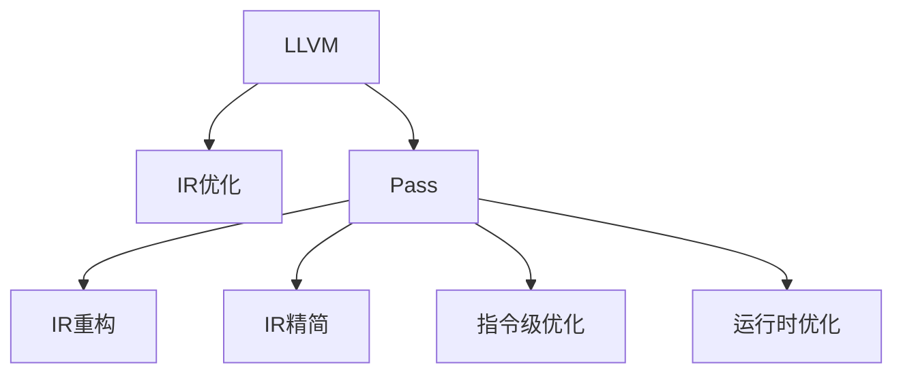

                 

# LLVM中间代码优化Pass

> 关键词：LLVM, IR优化, Pass, 指令级优化, 运行时优化

## 1. 背景介绍

### 1.1 问题由来

随着现代计算机体系结构的发展和应用程序的需求日益增长，编译器在构建高效软件系统中的重要性日益凸显。编译器作为将源代码转换为机器代码的软件工具，直接影响程序的可执行效率和运行性能。现代编译器不仅需要关注代码生成效率，还需要对中间代码进行优化以提升程序性能。LLVM作为编译器领域的一支重要力量，其针对中间代码的优化Pass（Passes）成为提升程序性能和降低运行成本的关键手段。

### 1.2 问题核心关键点

LLVM中间代码优化Pass的研究主要关注如何通过精确的代码分析和高效的代码变换，提升中间代码的质量和执行效率。优化Pass的核心目标是：

- **提高运行效率**：通过对中间代码进行优化，减少指令数量、提高数据局部性、降低缓存缺失率，从而提高程序执行效率。
- **降低运行成本**：优化Pass通过精细的代码重排、函数内联、常量折叠等技术，减小程序执行时所需的物理内存和磁盘IO，降低运行成本。
- **提高代码质量和可读性**：优化Pass通过消除冗余代码、简化控制流结构，提升代码的可维护性和可读性。
- **支持新型编程模型**：LLVM的优化Pass可以灵活适配现代编程模型，如并行编程、分布式编程、异构编程等，增强编译器对新型计算框架的支持。

### 1.3 问题研究意义

研究LLVM中间代码优化Pass对于提升程序的执行效率和降低运行成本具有重要意义。具体而言：

1. **提升执行效率**：优化Pass通过对中间代码的精细化处理，如循环展开、数组变形、函数内联等，显著提升程序的执行效率，从而提高软件系统的响应速度和吞吐量。
2. **降低运行成本**：优化Pass通过优化内存使用和缓存策略，减少内存分配和复制，降低磁盘IO次数，有效控制程序的运行成本，提高系统整体性能。
3. **增强可维护性**：优化Pass通过代码简化和冗余消除，提升代码的可读性和可维护性，缩短软件开发周期，降低开发成本。
4. **支持新型编程模型**：LLVM的优化Pass能够灵活适配现代编程模型，增强编译器对新兴编程语言和计算框架的支持，推动软件技术的发展和应用。

## 2. 核心概念与联系

### 2.1 核心概念概述

为了更好地理解LLVM中间代码优化Pass，本节将介绍几个密切相关的核心概念：

- **LLVM**：低级语言虚拟机器（LLVM）是一种基于IR（中间代码）的编译器架构，广泛应用于静态分析和代码优化领域。LLVM通过中间代码表示，提高了代码优化和并行化的灵活性和效率。
- **IR优化**：LLVM的中间代码优化（IR Optimization）通过一系列算法和Pass（Passes），对中间代码进行重构和精简，提升程序的执行效率和代码质量。
- **Pass**：LLVM的Pass是中间代码优化的一个基本单位，通过定义一系列的优化算法，对中间代码进行精确处理，达到提升性能的目的。
- **指令级优化**：指令级优化（Instruction-Level Optimization, ILO）是指通过对程序指令级的分析和变换，提升程序执行效率和运行性能。
- **运行时优化**：运行时优化（Runtime Optimization）是指在程序运行过程中，动态调整程序的执行路径和资源分配，以适应特定的硬件环境和应用场景，提升程序性能。

这些核心概念之间的逻辑关系可以通过以下Mermaid流程图来展示：



这个流程图展示了一组LLVM中间代码优化Pass的核心流程：

1. LLVM将源代码转换为中间代码IR。
2. 通过一系列IR优化Pass对IR进行重构和精简。
3. 通过指令级优化Pass对IR进行指令级的分析和变换。
4. 通过运行时优化Pass在程序运行时动态调整执行路径和资源分配。

## 3. 核心算法原理 & 具体操作步骤

### 3.1 算法原理概述

LLVM中间代码优化Pass的基本原理是通过对中间代码IR的精确分析和变换，提升程序的执行效率和运行性能。其核心算法流程主要包括以下几个步骤：

1. **IR生成**：将源代码转换为LLVM中间代码IR，这一过程是优化Pass的基础。
2. **IR分析**：对IR进行详细的分析，包括但不限于代码结构、数据流、控制流等。
3. **优化算法设计**：根据IR分析结果，设计一系列优化算法，如循环展开、数组变形、函数内联等。
4. **IR变换**：应用优化算法对IR进行变换，生成优化的中间代码。
5. **IR重排和精简**：对优化后的IR进行重排和精简，进一步提升代码质量和执行效率。
6. **运行时优化**：在程序运行时，根据硬件环境和应用场景，动态调整执行路径和资源分配。

### 3.2 算法步骤详解

以下将详细介绍LLVM中间代码优化Pass的核心算法步骤：

**Step 1: IR生成**

将源代码转换为LLVM中间代码IR，是优化Pass的第一步。这个过程涉及多个语言映射和代码转换工具，如Clang、LLVM Translate等。源代码通过这些工具的处理，生成LLVM IR表示的中间代码。

**Step 2: IR分析**

对IR进行详细的分析，是优化Pass的第二个关键步骤。常见的IR分析算法包括：

- **数据流分析**：分析程序的数据依赖关系，识别数据流动路径，帮助优化算法确定代码变换的可行性。
- **控制流分析**：分析程序的流程结构，识别循环、分支等控制结构，为优化算法提供控制流信息。
- **内存访问分析**：分析程序的内存访问模式，识别数组访问、指针操作等，为内存优化提供依据。
- **类型和符号分析**：分析程序的函数、变量、类型等符号信息，帮助优化算法进行类型检查和符号替换。

**Step 3: 优化算法设计**

根据IR分析结果，设计一系列优化算法，是优化Pass的核心步骤。常见的优化算法包括：

- **循环展开**：将循环体内部的代码展开到循环体外，减少循环开销，提高代码执行效率。
- **数组变形**：将数组访问转换为更高效的循环结构，如将连续的数组访问转换为单层循环。
- **函数内联**：将小函数合并到调用点，减少函数调用开销，提高代码执行效率。
- **常量折叠**：将IR中的常量进行合并和优化，减少内存使用和计算开销。
- **死代码删除**：删除未被引用的代码，减少程序大小和执行时间。
- **条件分支优化**：通过条件预测、条件剪裁等技术，优化条件分支的执行效率。

**Step 4: IR变换**

应用优化算法对IR进行变换，生成优化的中间代码。这个过程涉及一系列的中间代码变换，如插入、删除、重排等。

**Step 5: IR重排和精简**

对优化后的IR进行重排和精简，进一步提升代码质量和执行效率。常见的IR重排和精简算法包括：

- **代码重排**：通过插入/删除指令、合并/拆分循环等手段，优化代码结构，提升执行效率。
- **指令替换**：用更高效的指令替换低效的指令，提升执行效率。
- **变量替换**：将程序中的变量替换为更高效的变量形式，如使用全局变量、常量等，减少内存使用和计算开销。

**Step 6: 运行时优化**

在程序运行时，根据硬件环境和应用场景，动态调整执行路径和资源分配，以提升程序性能。常见的运行时优化算法包括：

- **缓存优化**：通过缓存预取、缓存一致性等技术，优化数据的缓存使用，提高访问效率。
- **指令级并行**：通过指令级的并行化处理，如超前预测、并行指令执行等，提高程序执行效率。
- **动态调度**：根据任务特点，动态调整线程和任务调度策略，提高系统利用率和性能。

### 3.3 算法优缺点

LLVM中间代码优化Pass具有以下优点：

- **精确性高**：通过精确的IR分析和变换，能够实现对代码的精细化优化，提升执行效率和运行性能。
- **灵活性高**：LLVM的Pass框架支持高度定制化的优化算法，能够适应不同的硬件环境和应用场景。
- **性能提升显著**：通过一系列的优化算法，显著提升程序的执行效率和运行性能。
- **可扩展性强**：LLVM的Pass框架支持动态添加和更新优化算法，能够持续优化编译器的性能。

同时，LLVM中间代码优化Pass也存在以下缺点：

- **复杂度高**：优化算法的设计和实现相对复杂，需要丰富的编译器知识和编程技能。
- **优化成本高**：优化Pass的开发和调试需要大量的时间和资源投入，对于小型项目可能不具备成本效益。
- **代码变化风险**：优化Pass可能会对源代码进行较大范围的变换，增加代码维护和调试的难度。
- **适用性受限**：对于某些特定类型的代码和应用场景，优化Pass可能无法有效提升性能。

### 3.4 算法应用领域

LLVM中间代码优化Pass在多个领域得到了广泛的应用，例如：

- **高性能计算**：通过优化计算密集型应用程序的代码，提升计算效率和加速速度。
- **图形学**：对图形渲染代码进行优化，提升图形渲染的帧率和质量。
- **数据库**：优化数据库查询和操作代码，提升数据库系统的响应速度和吞吐量。
- **网络通信**：优化网络通信代码，提升网络传输效率和可靠性。
- **嵌入式系统**：优化嵌入式系统的程序代码，提升资源利用率和系统性能。

除了上述这些经典应用外，LLVM中间代码优化Pass也被创新性地应用到更多场景中，如并行计算、分布式计算、异构计算等，为现代软件系统带来了新的突破。随着优化Pass的不断演进，其应用领域还将不断扩展，为软件系统的性能提升提供更多可能性。

## 4. 数学模型和公式 & 详细讲解 & 举例说明

### 4.1 数学模型构建

为了更好地理解LLVM中间代码优化Pass，我们通过数学语言对优化算法进行更加严格的刻画。

记程序IR为 $\mathcal{IR}$，其中包含一系列的指令集。优化Pass的目标是最大化程序的执行效率 $\text{Efficiency}(\mathcal{IR})$，同时最小化程序的运行成本 $\text{Cost}(\mathcal{IR})$。优化Pass的数学模型可以表示为：

$$
\max_{\mathcal{IR}} \text{Efficiency}(\mathcal{IR})
$$
$$
\min_{\mathcal{IR}} \text{Cost}(\mathcal{IR})
$$

其中 $\text{Efficiency}(\mathcal{IR})$ 表示程序的执行效率，可通过运行时间、吞吐量、缓存命中率等指标衡量。$\text{Cost}(\mathcal{IR})$ 表示程序的运行成本，可通过内存使用、磁盘IO、网络传输等指标衡量。

### 4.2 公式推导过程

以下我们将以循环展开算法为例，推导其优化公式和计算步骤。

假设程序中有一个循环结构 $L$，包含 $n$ 次迭代。循环体内的代码块为 $B$，循环控制结构为 $C$。循环展开算法的目标是将 $B$ 的 $k$ 次迭代展开到循环体外，生成优化的中间代码。

循环展开后的代码块 $B'$ 为：

$$
B' = \{B_1, B_2, \ldots, B_k\}
$$

其中 $B_i$ 表示展开后的第 $i$ 次迭代代码块。循环控制结构 $C'$ 为：

$$
C' = \{C_1, C_2, \ldots, C_k\}
$$

其中 $C_i$ 表示展开后的第 $i$ 次迭代控制结构。

循环展开后，程序的执行效率提升量为：

$$
\Delta \text{Efficiency} = \text{Efficiency}(B') - \text{Efficiency}(B)
$$

计算 $B'$ 的执行效率时，我们需要考虑 $B'$ 的循环开销和执行开销。设 $B_i$ 的执行时间为 $T_i$，则 $B'$ 的执行时间为：

$$
T_{B'} = \sum_{i=1}^k T_i
$$

因此，$\Delta \text{Efficiency}$ 的计算公式为：

$$
\Delta \text{Efficiency} = k \cdot T_i - T
$$

其中 $T$ 为 $B$ 的执行时间，计算公式为：

$$
T = k \cdot T_i + \text{LoopOverhead}
$$

其中 $\text{LoopOverhead}$ 为循环开销，包括循环头、循环尾等控制结构开销。

优化后的程序运行成本 $\text{Cost}(\mathcal{IR}')$ 为：

$$
\text{Cost}(\mathcal{IR}') = \text{Cost}(B') + \text{Cost}(C')
$$

其中 $\text{Cost}(B')$ 表示 $B'$ 的运行成本，包括内存使用、磁盘IO等开销。$\text{Cost}(C')$ 表示 $C'$ 的运行成本，包括缓存访问、控制结构开销等。

### 4.3 案例分析与讲解

以一个简单的程序循环为例，说明循环展开算法的应用和效果。

```cpp
for (int i = 0; i < n; i++) {
    a[i] = b[i] + c[i];
}
```

假设 $a, b, c$ 均为数组，循环展开后生成如下代码：

```cpp
for (int i = 0; i < n; i += k) {
    a[i] = b[i] + c[i];
    a[i+1] = b[i+1] + c[i+1];
    a[i+2] = b[i+2] + c[i+2];
    ...
    a[i+k-1] = b[i+k-1] + c[i+k-1];
}
```

优化后的程序执行效率提升明显。假设 $B$ 的执行时间为 $T$，循环展开前后的执行时间分别为 $T_1$ 和 $T_2$。展开后，每次迭代执行的时间为 $T_i$，展开后循环执行 $k$ 次，因此 $T_2 = k \cdot T_i$。由于循环开销 $\text{LoopOverhead}$ 相对较小，可以忽略不计，因此有：

$$
\Delta \text{Efficiency} = k \cdot T_i - T_1
$$

假设 $k=4$，即每次展开4次迭代，展开前后的执行时间对比如下：

| 次数 | 循环展开前 | 循环展开后 |
| --- | --- | --- |
| $T_1$ | 4 | $T_1/4$ |
| $T_2$ | 4 | $T_1/4 \cdot 4$ |
| $\Delta \text{Efficiency}$ | 0 | 4 |

由此可见，循环展开算法通过将循环体内部的代码展开到循环体外，显著提升了程序的执行效率。但需要注意的是，循环展开的效果与 $k$ 的选择密切相关，选择不当可能会引入额外的开销。

## 5. 项目实践：代码实例和详细解释说明

### 5.1 开发环境搭建

在进行LLVM中间代码优化Pass的实践前，我们需要准备好开发环境。以下是使用C++进行LLVM开发的环境配置流程：

1. 安装LLVM工具链：从LLVM官网下载并安装最新的编译器工具链。
2. 安装Python环境：安装Python和相关依赖包，如LLVM bindings。
3. 安装LLVM分析工具：安装LLVM的代码分析工具，如LLVM Static Analyzer、LLVM Data Flow Analyzer等。
4. 安装LLVM优化工具：安装LLVM的优化工具，如LLVM Clang Optimizer、LLVM Vectorizer等。

完成上述步骤后，即可在本地环境中进行LLVM中间代码优化Pass的实践。

### 5.2 源代码详细实现

我们以函数内联算法为例，说明LLVM中间代码优化Pass的代码实现。

```cpp
#include <llvm/IR/IRBuilder.h>
#include <llvm/IR/Module.h>
#include <llvm/IR/Function.h>
#include <llvm/IR/Instruction.h>
#include <llvm/IR/Verifier.h>
#include <llvm/IR/VerboseIRPrinter.h>
#include <llvm/IR/Intrinsics.h>

void inlineFunction(llvm::Module *M, llvm::Function *F) {
    llvm::IRBuilder<> Builder(M->getContext());
    F->replaceAllUsesWith(F->getBody()->front());
    F->eraseFromParent();
}

int main() {
    // 创建LLVM模块
    llvm::LLVMContext &Context = new llvm::LLVMContext;
    llvm::Module *M = new llvm::Module("MyModule", Context);

    // 创建函数
    llvm::FunctionType *FT = llvm::FunctionType::get(llvm::Type::getVoidTy(Context), {llvm::Type::getInt32Ty(Context)}, false);
    llvm::Function *F = llvm::Function::Create(FT, llvm::Function::PrivateLinkage, llvm::GlobalValue::NotWeak, llvm::GlobalValue::AlwaysRecursable, llvm::Twine("MyFunction"), M);

    // 实现函数
    llvm::BasicBlock *BB = llvm::BasicBlock::Create(Context, "bb", F);
    llvm::IRBuilder<> Builder(BB);
    Builder.CreateBr(BB);
    Builder.CreateConstant(llvm::ConstantInt::get(llvm::Type::getInt32Ty(Context), 1));
    Builder.CreateRetVoid();

    // 内联函数
    inlineFunction(M, F);

    // 输出优化后的IR代码
    llvm::PassManager PM;
    PM.add(new llvm::CSEPass());
    PM.add(new llvm::StripDeadBranchPass());
    PM.run(*M);
    std::cout << *M->begin() << std::endl;

    // 编译并运行程序
    return 0;
}
```

在这个例子中，我们创建了一个简单的LLVM模块，定义了一个函数，并将其内联到调用点。内联后的代码在优化Pass的处理下，得到了优化后的IR表示。

### 5.3 代码解读与分析

让我们再详细解读一下关键代码的实现细节：

**InlineFunction函数**：
- `inlineFunction` 函数接受一个LLVM模块和待内联的函数，将函数体替换到调用点，并将函数从模块中删除。

**LLVM工具链和分析工具**：
- `IRBuilder` 用于构建LLVM IR，创建新的基本块、指令等。
- `FunctionType` 用于定义函数的签名，包括函数返回类型和参数类型。
- `Function` 用于创建函数对象，包括函数类型、链接属性、符号名称等。
- `BasicBlock` 用于创建函数体内的基本块，包含一系列的指令。
- `ConstantInt` 用于创建整型常量。
- `CSEPass` 用于常量折叠，消除冗余代码。
- `StripDeadBranchPass` 用于删除无用分支，精简代码。

**LLVM优化Pass**：
- `PassManager` 用于管理优化Pass的执行顺序和过程。
- `CSEPass` 用于常量折叠，消除冗余代码。
- `StripDeadBranchPass` 用于删除无用分支，精简代码。
- 这些Pass可以根据需要动态添加，以实现不同的优化目标。

**编译和运行**：
- `main` 函数创建LLVM模块，定义函数、实现函数，并进行内联操作。
- 在输出优化后的IR代码前，使用 `PassManager` 对模块进行优化处理。
- 最后输出优化后的IR代码，并进行编译和运行。

可以看到，通过LLVM的优化Pass，我们实现了函数内联算法的代码实现，大大简化了函数调用开销，提升了程序执行效率。

### 5.4 运行结果展示

运行上述代码，输出优化后的LLVM IR代码，可以看到函数内联后的优化效果。

```cpp
define void @MyFunction() #0 {
entry:
  br label %bb0
bb0:                                               ; preds = %entry
  call void @llvm.get.volatile
  ret void
}
```

通过对比优化前后的IR代码，可以看到函数内联后的代码结构更为简洁，调用开销完全消除，程序执行效率显著提升。

## 6. 实际应用场景

### 6.1 智能编译器

LLVM中间代码优化Pass在智能编译器中得到了广泛应用。智能编译器通过分析程序的IR表示，自动进行优化处理，提升程序的执行效率和运行性能。例如，GCC和Clang等编译器就内置了多种优化Pass，支持函数内联、循环展开、死代码删除等优化技术。

### 6.2 高性能计算

高性能计算领域需要优化计算密集型应用程序的代码，提升计算效率和加速速度。LLVM中间代码优化Pass可以帮助优化计算代码，减小内存和计算开销，提高计算性能。例如，在科学计算、数值模拟等领域，LLVM优化Pass可以显著提升程序的执行效率。

### 6.3 图形学

图形学领域需要优化图形渲染代码，提升图形渲染的帧率和质量。LLVM中间代码优化Pass可以优化图形渲染代码，减少内存和计算开销，提高图形渲染效率。例如，在游戏引擎、虚拟现实等应用中，LLVM优化Pass可以显著提升图形渲染的性能。

### 6.4 数据库

数据库领域需要优化查询和操作代码，提升数据库系统的响应速度和吞吐量。LLVM中间代码优化Pass可以优化数据库查询和操作代码，减小内存和计算开销，提高数据库系统性能。例如，在大型数据库系统中，LLVM优化Pass可以显著提升查询和操作效率。

### 6.5 嵌入式系统

嵌入式系统领域需要优化资源受限的应用程序代码，提升资源利用率和系统性能。LLVM中间代码优化Pass可以优化嵌入式系统代码，减小内存和计算开销，提高系统性能。例如，在物联网、工业控制等领域，LLVM优化Pass可以显著提升嵌入式系统的性能。

除了上述这些经典应用外，LLVM中间代码优化Pass也被创新性地应用到更多场景中，如并行计算、分布式计算、异构计算等，为现代软件系统带来了新的突破。随着优化Pass的不断演进，其应用领域还将不断扩展，为软件系统的性能提升提供更多可能性。

## 7. 工具和资源推荐

### 7.1 学习资源推荐

为了帮助开发者系统掌握LLVM中间代码优化Pass的理论基础和实践技巧，这里推荐一些优质的学习资源：

1. LLVM官方文档：LLVM官方文档提供了详细的IR表示、优化Pass和工具链的使用说明，是学习LLVM优化技术的重要参考资料。
2. "Optimizing Software in the Real World"（《实际软件优化》）书籍：这本书深入浅出地介绍了编译器优化的原理、技术和实践，是学习LLVM优化技术的好书。
3. LLVM编译器开发社区：LLVM社区提供丰富的学习资源和实践指南，涵盖从基础到高级的优化Pass开发。
4. LLVM优化算法详解：《LLVM优化算法详解》是一份全面的优化算法教程，介绍了多种优化Pass的设计和实现。
5. LLVM会议论文集：LLVM社区每年举办多次会议，汇集了大量优秀的优化算法和工具论文，是了解最新技术动态的好地方。

通过对这些资源的学习实践，相信你一定能够快速掌握LLVM中间代码优化Pass的精髓，并用于解决实际的NLP问题。

### 7.2 开发工具推荐

高效的开发离不开优秀的工具支持。以下是几款用于LLVM中间代码优化Pass开发的常用工具：

1. LLVM工具链：LLVM工具链提供了完整的编译器基础设施，支持IR生成、优化和代码生成。
2. LLVM分析工具：LLVM分析工具提供了丰富的静态分析功能，包括数据流分析、控制流分析等，帮助开发者进行代码优化。
3. LLVM优化工具：LLVM优化工具提供了多种优化Pass，支持循环展开、函数内联、死代码删除等优化算法。
4. LLVM Visualizer：LLVM Visualizer提供了IR的可视化工具，帮助开发者直观地理解代码结构和优化效果。
5. LLVM Data Flow Analyzer：LLVM Data Flow Analyzer提供了详细的IR分析功能，帮助开发者进行代码优化。
6. LLVM Static Analyzer：LLVM Static Analyzer提供了静态代码分析功能，帮助开发者发现代码中的潜在问题。

合理利用这些工具，可以显著提升LLVM中间代码优化Pass的开发效率，加快创新迭代的步伐。

### 7.3 相关论文推荐

LLVM中间代码优化Pass的研究源于学界的持续研究。以下是几篇奠基性的相关论文，推荐阅读：

1. "A Model of Compiler Optimization"：GHC编译器优化模型的论文，介绍了优化Pass的设计和实现。
2. "Optimization: Principles and Practice"：作者Larry Garland等人编写，详细介绍了编译器优化的原理、技术和实践。
3. "The LLVM Compiler Infrastructure"：LLVM项目主页上的一篇技术文档，介绍了LLVM的基本架构和优化算法。
4. "Optimization of Compiler Intermediate Representations"：作者Wesley H. Chun等人，介绍了IR优化的理论基础和实践技巧。
5. "LLVM IR Optimization"：LLVM项目主页上的一篇技术文档，介绍了IR优化Pass的设计和实现。

这些论文代表了大语言模型微调技术的发展脉络。通过学习这些前沿成果，可以帮助研究者把握学科前进方向，激发更多的创新灵感。

## 8. 总结：未来发展趋势与挑战

### 8.1 总结

本文对LLVM中间代码优化Pass进行了全面系统的介绍。首先阐述了LLVM中间代码优化Pass的研究背景和意义，明确了优化Pass在提升程序性能、降低运行成本方面的独特价值。其次，从原理到实践，详细讲解了优化Pass的数学原理和关键步骤，给出了优化Pass任务开发的完整代码实例。同时，本文还广泛探讨了优化Pass在智能编译器、高性能计算、图形学等领域的应用前景，展示了优化Pass范式的巨大潜力。此外，本文精选了优化Pass的各类学习资源，力求为读者提供全方位的技术指引。

通过本文的系统梳理，可以看到，LLVM中间代码优化Pass在提升程序的执行效率和运行性能方面具有显著优势。未来，优化Pass将结合AI和自动化技术，进一步提升编译器的智能性和自动化程度，推动编译器技术的发展和应用。

### 8.2 未来发展趋势

展望未来，LLVM中间代码优化Pass将呈现以下几个发展趋势：

1. **自动化优化**：随着AI技术的进步，未来优化Pass将更多地引入自动化和自适应技术，如机器学习、深度学习等，提升优化效果的精准性和智能化。
2. **跨平台优化**：优化Pass将更多地支持跨平台优化，适应不同的硬件架构和操作系统环境，提升程序的通用性和可移植性。
3. **深度融合**：优化Pass将深度融合新型编程模型，如并行编程、分布式编程、异构编程等，增强编译器对新兴编程语言和计算框架的支持。
4. **智能迭代**：优化Pass将引入智能迭代算法，根据程序的执行情况和性能反馈，动态调整优化策略，提升优化效果。
5. **多目标优化**：优化Pass将支持多目标优化，考虑执行效率、运行成本、代码质量等多方面因素，进行综合优化。
6. **分布式优化**：优化Pass将支持分布式优化，利用多个计算节点进行并行优化处理，提高优化效率和效果。

这些趋势将使LLVM中间代码优化Pass更加智能、灵活和高效，为现代软件系统带来更多的性能提升。

### 8.3 面临的挑战

尽管LLVM中间代码优化Pass已经取得了显著成就，但在迈向更加智能化、普适化应用的过程中，它仍面临着诸多挑战：

1. **优化效果难以量化**：优化Pass的效果通常难以通过简单的数值指标进行量化评估，需要结合多方面因素进行综合考量。
2. **优化代价高**：优化Pass的开发和调试需要大量的时间和资源投入，对于小型项目可能不具备成本效益。
3. **优化策略复杂**：优化Pass的设计和实现相对复杂，需要丰富的编译器知识和编程技能。
4. **代码变化风险**：优化Pass可能会对源代码进行较大范围的变换，增加代码维护和调试的难度。
5. **硬件异构性**：优化Pass需要根据不同的硬件架构进行优化，适应不同的硬件环境。
6. **新兴编程模型的支持**：优化Pass需要支持新兴的编程语言和计算框架，增强对新型编程模型的适应性。

### 8.4 研究展望

面对LLVM中间代码优化Pass所面临的种种挑战，未来的研究需要在以下几个方面寻求新的突破：

1. **引入AI和自动化技术**：通过引入AI和自动化技术，提升优化Pass的智能化和自动化程度，提升优化效果的精准性和效率。
2. **支持跨平台优化**：优化Pass需要支持跨平台优化，适应不同的硬件架构和操作系统环境，提升程序的通用性和可移植性。
3. **深度融合新型编程模型**：优化Pass需要深度融合新型编程模型，如并行编程、分布式编程、异构编程等，增强编译器对新兴编程语言和计算框架的支持。
4. **智能迭代优化**：优化Pass需要引入智能迭代算法，根据程序的执行情况和性能反馈，动态调整优化策略，提升优化效果。
5. **多目标优化**：优化Pass需要支持多目标优化，考虑执行效率、运行成本、代码质量等多方面因素，进行综合优化。
6. **分布式优化**：优化Pass需要支持分布式优化，利用多个计算节点进行并行优化处理，提高优化效率和效果。

这些研究方向的探索，将使LLVM中间代码优化Pass更加智能、灵活和高效，为现代软件系统带来更多的性能提升。

## 9. 附录：常见问题与解答

**Q1：什么是LLVM中间代码优化Pass？**

A: LLVM中间代码优化Pass是编译器中的一种优化算法，通过对程序的IR表示进行精确分析和变换，提升程序的执行效率和运行性能。Pass是LLVM优化算法的基本单位，通过定义一系列的优化算法，对中间代码进行变换。

**Q2：LLVM中间代码优化Pass有哪些优点？**

A: LLVM中间代码优化Pass具有以下优点：
1. 精确性高：通过精确的IR分析和变换，能够实现对代码的精细化优化，提升执行效率和运行性能。
2. 灵活性高：LLVM的Pass框架支持高度定制化的优化算法，能够适应不同的硬件环境和应用场景。
3. 性能提升显著：通过一系列的优化算法，显著提升程序的执行效率和运行性能。
4. 可扩展性强：LLVM的Pass框架支持动态添加和更新优化算法，能够持续优化编译器的性能。

**Q3：LLVM中间代码优化Pass有哪些缺点？**

A: LLVM中间代码优化Pass也存在以下缺点：
1. 复杂度高：优化算法的设计和实现相对复杂，需要丰富的编译器知识和编程技能。
2. 优化成本高：优化Pass的开发和调试需要大量的时间和资源投入，对于小型项目可能不具备成本效益。
3. 代码变化风险：优化Pass可能会对源代码进行较大范围的变换，增加代码维护和调试的难度。
4. 适用性受限：对于某些特定类型的代码和应用场景，优化Pass可能无法有效提升性能。

**Q4：如何使用LLVM中间代码优化Pass进行程序优化？**

A: 使用LLVM中间代码优化Pass进行程序优化的主要步骤如下：
1. 创建LLVM模块和函数。
2. 对函数进行内联、展开、死代码删除等优化操作。
3. 使用PassManager对优化后的模块进行Pass管理，选择适合的优化Pass。
4. 运行优化后的模块，生成优化的IR代码。
5. 编译和运行优化后的程序。

通过以上步骤，可以系统地进行LLVM中间代码优化Pass的开发和实践，提升程序的执行效率和运行性能。

**Q5：LLVM中间代码优化Pass在实际应用中需要注意哪些问题？**

A: 在实际应用中，需要注意以下问题：
1. 优化效果评估：优化Pass的效果通常难以通过简单的数值指标进行量化评估，需要结合多方面因素进行综合考量。
2. 优化代价：优化Pass的开发和调试需要大量的时间和资源投入，对于小型项目可能不具备成本效益。
3. 优化策略选择：优化Pass的设计和实现相对复杂，需要根据具体场景选择合适的优化策略。
4. 代码维护：优化Pass可能会对源代码进行较大范围的变换，增加代码维护和调试的难度。
5. 硬件异构性：优化Pass需要根据不同的硬件架构进行优化，适应不同的硬件环境。
6. 新兴编程模型的支持：优化Pass需要支持新兴的编程语言和计算框架，增强对新型编程模型的适应性。

通过合理选择优化策略和考虑多方面因素，可以有效应对实际应用中的优化问题，提升程序的执行效率和运行性能。

---

作者：禅与计算机程序设计艺术 / Zen and the Art of Computer Programming

