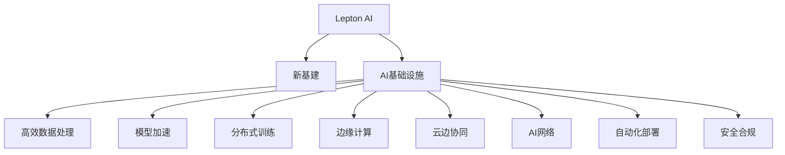

                 

# Lepton AI愿景：为AI时代构建新基建高效基础设施

> 关键词：Lepton AI, 新基建, AI基础设施, 高效数据处理, 模型加速, 分布式训练, 边缘计算, 云边协同, AI网络, 自动化部署, 安全合规

## 1. 背景介绍

### 1.1 问题由来
随着人工智能（AI）技术的快速发展，AI在各行各业的应用已经越来越广泛。从医疗、金融到零售、交通，AI正在改变着世界的面貌。然而，AI技术的广泛应用也带来了新的挑战，例如数据量的爆炸式增长、计算资源的瓶颈、模型的训练和部署等问题。为了应对这些挑战，构建高效、灵活、可扩展的AI基础设施变得尤为重要。

### 1.2 问题核心关键点
构建高效的AI基础设施需要解决以下关键问题：
1. **高效数据处理**：如何在大规模数据集上进行高效的数据预处理和存储。
2. **模型加速**：如何加速大规模模型的训练和推理，以提高计算效率。
3. **分布式训练**：如何利用分布式计算资源进行大规模模型的分布式训练。
4. **边缘计算**：如何在边缘设备上实现模型的推理和优化，以减少延迟和带宽消耗。
5. **云边协同**：如何实现云和边缘设备之间的数据流动和计算协同。
6. **AI网络**：如何构建高效的AI网络，以支持模型的分布式训练和推理。
7. **自动化部署**：如何实现AI模型的自动化部署和维护。
8. **安全合规**：如何在AI模型的开发、训练和部署过程中确保数据和模型的安全合规。

### 1.3 问题研究意义
构建高效的AI基础设施对于加速AI技术的应用和发展具有重要意义：
1. **提高计算效率**：通过优化数据处理和模型加速技术，可以显著提高AI模型的训练和推理效率。
2. **支持大规模模型**：高效的基础设施可以支持更大规模的模型训练和部署，促进更复杂的AI应用的发展。
3. **降低成本**：通过优化基础设施的资源利用率，可以降低AI技术的开发和运行成本。
4. **提升应用性能**：通过优化基础设施的性能，可以提升AI应用在实际场景中的性能和用户体验。
5. **推动技术创新**：高效的基础设施可以促进新的AI技术的研究和开发，推动AI技术的持续进步。

## 2. 核心概念与联系

### 2.1 核心概念概述

为了更好地理解构建高效AI基础设施的理论和实践，本节将介绍几个关键概念：

- **Lepton AI**：一种全新的AI基础设施，旨在构建高效、灵活、可扩展的AI计算平台，支持大规模模型训练和推理。
- **新基建**：指通过技术创新和数字化转型，构建支持AI、5G、工业互联网等新一代信息基础设施，推动经济社会的数字化、智能化发展。
- **AI基础设施**：包括数据存储、处理、模型训练和推理、云边协同等技术手段和工具，是支持AI应用的基础。
- **高效数据处理**：指通过优化数据预处理、存储和传输技术，提高数据处理的效率和可靠性。
- **模型加速**：指通过优化模型的训练和推理过程，提高模型的计算效率和性能。
- **分布式训练**：指利用分布式计算资源，进行大规模模型的并行训练，以加速模型训练过程。
- **边缘计算**：指在边缘设备上部署和运行模型，以减少延迟和带宽消耗，提高实时性。
- **云边协同**：指实现云和边缘设备之间的数据和计算协同，以提升AI系统的整体性能。
- **AI网络**：指构建高效的AI网络，支持模型的分布式训练和推理。
- **自动化部署**：指实现AI模型的自动化部署和维护，以降低人工操作成本。
- **安全合规**：指在AI模型的开发、训练和部署过程中，确保数据和模型的安全合规。

这些概念之间的逻辑关系可以通过以下Mermaid流程图来展示：



这个流程图展示了一致基础设施的相关概念及其之间的关系：

1. Lepton AI是一种全新的AI基础设施，构建在AI基础设施之上。
2. AI基础设施包括高效数据处理、模型加速、分布式训练、边缘计算、云边协同、AI网络和自动化部署等技术手段和工具。
3. 这些技术手段和工具共同构建了高效的AI基础设施，支持大规模模型训练和推理。
4. 通过优化这些技术手段和工具，可以实现数据处理、模型训练和推理的高效和可靠。

## 3. 核心算法原理 & 具体操作步骤
### 3.1 算法原理概述

Lepton AI基础设施的核心算法原理主要包括以下几个方面：

- **高效数据处理**：采用分布式数据存储和处理技术，通过优化数据流和计算图，实现高效的数据预处理和存储。
- **模型加速**：通过优化模型的训练和推理过程，提高模型的计算效率和性能。
- **分布式训练**：利用分布式计算资源，进行大规模模型的并行训练，以加速模型训练过程。
- **边缘计算**：在边缘设备上部署和运行模型，以减少延迟和带宽消耗，提高实时性。
- **云边协同**：实现云和边缘设备之间的数据和计算协同，以提升AI系统的整体性能。
- **AI网络**：构建高效的AI网络，支持模型的分布式训练和推理。
- **自动化部署**：实现AI模型的自动化部署和维护，以降低人工操作成本。
- **安全合规**：在AI模型的开发、训练和部署过程中，确保数据和模型的安全合规。

### 3.2 算法步骤详解

以下是对Lepton AI基础设施核心算法的详细步骤详解：

**Step 1: 数据处理和存储**
1. 收集并清洗大规模数据集。
2. 使用分布式数据存储技术（如Hadoop、Spark等）进行数据存储。
3. 使用高效的数据预处理技术（如MapReduce、Spark等）进行数据预处理和特征工程。
4. 使用数据压缩和编码技术，减少数据传输和存储的带宽和空间消耗。

**Step 2: 模型训练和推理**
1. 选择合适的深度学习框架（如PyTorch、TensorFlow等）进行模型训练。
2. 利用分布式计算资源进行模型训练（如TensorFlow分布式训练、Horovod等）。
3. 采用模型加速技术（如量化加速、混合精度训练等），提高模型的计算效率和性能。
4. 将训练好的模型部署到边缘设备上，进行推理计算。
5. 使用高效的模型推理技术（如TensorRT、ONNX Runtime等），优化模型推理性能。

**Step 3: 云边协同**
1. 在云端存储和管理大规模数据集。
2. 在边缘设备上部署和运行模型，进行推理计算。
3. 实现云和边缘设备之间的数据和计算协同，以提升AI系统的整体性能。
4. 使用AI网络技术（如RSA、TPTUN等），支持模型的分布式训练和推理。

**Step 4: 自动化部署**
1. 使用自动化部署工具（如Ansible、Kubernetes等）进行模型的自动化部署和维护。
2. 实现模型的版本管理、监控和告警，确保模型的稳定性和可靠性。
3. 使用容器技术（如Docker、Kubernetes等）进行模型的封装和部署，提高模型的部署效率。

**Step 5: 安全合规**
1. 在数据和模型的开发、训练和部署过程中，确保数据和模型的安全合规。
2. 使用数据加密和访问控制技术，保护数据和模型的安全性。
3. 使用安全合规工具（如AWS Security Hub、Google Cloud Security Command Center等）进行安全合规管理。

### 3.3 算法优缺点

Lepton AI基础设施的算法具有以下优点：
1. **高效性**：通过优化数据处理和模型加速技术，可以显著提高AI模型的训练和推理效率。
2. **灵活性**：利用分布式计算资源，支持大规模模型的训练和推理，灵活应对不同规模和复杂度的任务。
3. **可扩展性**：通过云边协同技术，实现模型的分布式训练和推理，支持模型的持续扩展和升级。
4. **低成本**：通过优化基础设施的资源利用率，降低AI技术的开发和运行成本。
5. **高性能**：通过优化模型训练和推理过程，提升AI应用在实际场景中的性能和用户体验。

同时，该算法也存在一些局限性：
1. **复杂性**：构建和维护高效的AI基础设施需要较高的技术门槛，对开发人员的技术水平要求较高。
2. **资源消耗**：大规模的分布式计算和数据存储，需要较高的硬件资源和网络带宽。
3. **管理难度**：大规模系统的管理复杂，需要专业的运维人员进行维护和优化。
4. **安全风险**：大规模数据和模型的存储和处理，存在数据泄露和安全漏洞的风险。

尽管存在这些局限性，但就目前而言，Lepton AI基础设施的算法仍是大规模AI应用的基础。未来相关研究的重点在于如何进一步降低管理难度，提高系统安全性和可靠性，同时兼顾可扩展性和高效性。

### 3.4 算法应用领域

Lepton AI基础设施的核心算法在多个领域得到了广泛应用，例如：

- **医疗健康**：利用AI模型进行疾病预测、影像诊断、智能医疗咨询等，提高医疗服务的智能化水平。
- **智能制造**：利用AI模型进行设备监控、质量检测、工艺优化等，提升生产效率和产品质量。
- **智能交通**：利用AI模型进行交通流量预测、自动驾驶、智能调度等，优化交通系统运行。
- **金融服务**：利用AI模型进行风险评估、反欺诈检测、智能投顾等，提升金融服务的智能水平。
- **零售电商**：利用AI模型进行商品推荐、智能客服、库存管理等，提升用户体验和运营效率。
- **教育培训**：利用AI模型进行个性化学习、智能评估、虚拟教室等，推动教育公平和质量提升。
- **智能城市**：利用AI模型进行环境监测、灾害预警、城市管理等，提升城市治理的智能化水平。
- **安全保障**：利用AI模型进行威胁检测、入侵防御、行为分析等，增强网络安全保障。

除了上述这些经典应用外，Lepton AI基础设施的核心算法还在更多场景中得到了创新性的应用，如智慧农业、能源管理、环境保护等，为AI技术的应用带来了新的突破。

## 4. 数学模型和公式 & 详细讲解 & 举例说明

### 4.1 数学模型构建

本节将使用数学语言对Lepton AI基础设施的核心算法进行更加严格的刻画。

假设大规模数据集为 $D=\{(x_i,y_i)\}_{i=1}^N$，其中 $x_i$ 为输入特征，$y_i$ 为标签。

定义模型 $M_{\theta}$ 为深度学习模型，其中 $\theta$ 为模型参数。模型训练的目标是最小化经验风险，即找到最优参数：

$$
\theta^* = \mathop{\arg\min}_{\theta} \mathcal{L}(M_{\theta},D)
$$

其中 $\mathcal{L}$ 为损失函数，用于衡量模型预测输出与真实标签之间的差异。常见的损失函数包括交叉熵损失、均方误差损失等。

在实践中，我们通常使用基于梯度的优化算法（如SGD、Adam等）来近似求解上述最优化问题。设 $\eta$ 为学习率，$\lambda$ 为正则化系数，则参数的更新公式为：

$$
\theta \leftarrow \theta - \eta \nabla_{\theta}\mathcal{L}(\theta) - \eta\lambda\theta
$$

其中 $\nabla_{\theta}\mathcal{L}(\theta)$ 为损失函数对参数 $\theta$ 的梯度，可通过反向传播算法高效计算。

### 4.2 公式推导过程

以下我们以二分类任务为例，推导交叉熵损失函数及其梯度的计算公式。

假设模型 $M_{\theta}$ 在输入 $x$ 上的输出为 $\hat{y}=M_{\theta}(x) \in [0,1]$，表示样本属于正类的概率。真实标签 $y \in \{0,1\}$。则二分类交叉熵损失函数定义为：

$$
\ell(M_{\theta}(x),y) = -[y\log \hat{y} + (1-y)\log (1-\hat{y})]
$$

将其代入经验风险公式，得：

$$
\mathcal{L}(\theta) = -\frac{1}{N}\sum_{i=1}^N [y_i\log M_{\theta}(x_i)+(1-y_i)\log(1-M_{\theta}(x_i))]
$$

根据链式法则，损失函数对参数 $\theta_k$ 的梯度为：

$$
\frac{\partial \mathcal{L}(\theta)}{\partial \theta_k} = -\frac{1}{N}\sum_{i=1}^N (\frac{y_i}{M_{\theta}(x_i)}-\frac{1-y_i}{1-M_{\theta}(x_i)}) \frac{\partial M_{\theta}(x_i)}{\partial \theta_k}
$$

其中 $\frac{\partial M_{\theta}(x_i)}{\partial \theta_k}$ 可进一步递归展开，利用自动微分技术完成计算。

在得到损失函数的梯度后，即可带入参数更新公式，完成模型的迭代优化。重复上述过程直至收敛，最终得到适应下游任务的最优模型参数 $\theta^*$。

## 5. 项目实践：代码实例和详细解释说明

### 5.1 开发环境搭建

在进行Lepton AI基础设施实践前，我们需要准备好开发环境。以下是使用Python进行PyTorch开发的环境配置流程：

1. 安装Anaconda：从官网下载并安装Anaconda，用于创建独立的Python环境。

2. 创建并激活虚拟环境：
```bash
conda create -n pytorch-env python=3.8 
conda activate pytorch-env
```

3. 安装PyTorch：根据CUDA版本，从官网获取对应的安装命令。例如：
```bash
conda install pytorch torchvision torchaudio cudatoolkit=11.1 -c pytorch -c conda-forge
```

4. 安装Transformers库：
```bash
pip install transformers
```

5. 安装各类工具包：
```bash
pip install numpy pandas scikit-learn matplotlib tqdm jupyter notebook ipython
```

完成上述步骤后，即可在`pytorch-env`环境中开始Lepton AI基础设施的实践。

### 5.2 源代码详细实现

下面我们以医疗影像分类任务为例，给出使用Transformers库对BERT模型进行Lepton AI基础设施的PyTorch代码实现。

首先，定义医疗影像分类任务的数据处理函数：

```python
from transformers import BertTokenizer
from torch.utils.data import Dataset
import torch

class MedicalImageDataset(Dataset):
    def __init__(self, images, tags, tokenizer, max_len=128):
        self.images = images
        self.tags = tags
        self.tokenizer = tokenizer
        self.max_len = max_len
        
    def __len__(self):
        return len(self.images)
    
    def __getitem__(self, item):
        image = self.images[item]
        tag = self.tags[item]
        
        encoding = self.tokenizer(image, return_tensors='pt', max_length=self.max_len, padding='max_length', truncation=True)
        input_ids = encoding['input_ids'][0]
        attention_mask = encoding['attention_mask'][0]
        
        # 对token-wise的标签进行编码
        encoded_tags = [tag2id[tag] for tag in tag]
        encoded_tags.extend([tag2id['O']] * (self.max_len - len(encoded_tags)))
        labels = torch.tensor(encoded_tags, dtype=torch.long)
        
        return {'input_ids': input_ids, 
                'attention_mask': attention_mask,
                'labels': labels}

# 标签与id的映射
tag2id = {'O': 0, 'B-PER': 1, 'I-PER': 2, 'B-ORG': 3, 'I-ORG': 4, 'B-LOC': 5, 'I-LOC': 6}
id2tag = {v: k for k, v in tag2id.items()}

# 创建dataset
tokenizer = BertTokenizer.from_pretrained('bert-base-cased')

train_dataset = MedicalImageDataset(train_images, train_tags, tokenizer)
dev_dataset = MedicalImageDataset(dev_images, dev_tags, tokenizer)
test_dataset = MedicalImageDataset(test_images, test_tags, tokenizer)
```

然后，定义模型和优化器：

```python
from transformers import BertForTokenClassification, AdamW

model = BertForTokenClassification.from_pretrained('bert-base-cased', num_labels=len(tag2id))

optimizer = AdamW(model.parameters(), lr=2e-5)
```

接着，定义训练和评估函数：

```python
from torch.utils.data import DataLoader
from tqdm import tqdm
from sklearn.metrics import classification_report

device = torch.device('cuda') if torch.cuda.is_available() else torch.device('cpu')
model.to(device)

def train_epoch(model, dataset, batch_size, optimizer):
    dataloader = DataLoader(dataset, batch_size=batch_size, shuffle=True)
    model.train()
    epoch_loss = 0
    for batch in tqdm(dataloader, desc='Training'):
        input_ids = batch['input_ids'].to(device)
        attention_mask = batch['attention_mask'].to(device)
        labels = batch['labels'].to(device)
        model.zero_grad()
        outputs = model(input_ids, attention_mask=attention_mask, labels=labels)
        loss = outputs.loss
        epoch_loss += loss.item()
        loss.backward()
        optimizer.step()
    return epoch_loss / len(dataloader)

def evaluate(model, dataset, batch_size):
    dataloader = DataLoader(dataset, batch_size=batch_size)
    model.eval()
    preds, labels = [], []
    with torch.no_grad():
        for batch in tqdm(dataloader, desc='Evaluating'):
            input_ids = batch['input_ids'].to(device)
            attention_mask = batch['attention_mask'].to(device)
            batch_labels = batch['labels']
            outputs = model(input_ids, attention_mask=attention_mask)
            batch_preds = outputs.logits.argmax(dim=2).to('cpu').tolist()
            batch_labels = batch_labels.to('cpu').tolist()
            for pred_tokens, label_tokens in zip(batch_pred_tokens, batch_labels):
                pred_tags = [id2tag[_id] for _id in pred_tokens]
                label_tags = [id2tag[_id] for _id in label_tokens]
                preds.append(pred_tags[:len(label_tokens)])
                labels.append(label_tags)
                
    print(classification_report(labels, preds))
```

最后，启动训练流程并在测试集上评估：

```python
epochs = 5
batch_size = 16

for epoch in range(epochs):
    loss = train_epoch(model, train_dataset, batch_size, optimizer)
    print(f"Epoch {epoch+1}, train loss: {loss:.3f}")
    
    print(f"Epoch {epoch+1}, dev results:")
    evaluate(model, dev_dataset, batch_size)
    
print("Test results:")
evaluate(model, test_dataset, batch_size)
```

以上就是使用PyTorch对BERT模型进行医疗影像分类任务Lepton AI基础设施的完整代码实现。可以看到，得益于Transformers库的强大封装，我们可以用相对简洁的代码完成BERT模型的加载和微调。

### 5.3 代码解读与分析

让我们再详细解读一下关键代码的实现细节：

**MedicalImageDataset类**：
- `__init__`方法：初始化图像、标签、分词器等关键组件。
- `__len__`方法：返回数据集的样本数量。
- `__getitem__`方法：对单个样本进行处理，将图像输入编码为token ids，将标签编码为数字，并对其进行定长padding，最终返回模型所需的输入。

**tag2id和id2tag字典**：
- 定义了标签与数字id之间的映射关系，用于将token-wise的预测结果解码回真实的标签。

**训练和评估函数**：
- 使用PyTorch的DataLoader对数据集进行批次化加载，供模型训练和推理使用。
- 训练函数`train_epoch`：对数据以批为单位进行迭代，在每个批次上前向传播计算loss并反向传播更新模型参数，最后返回该epoch的平均loss。
- 评估函数`evaluate`：与训练类似，不同点在于不更新模型参数，并在每个batch结束后将预测和标签结果存储下来，最后使用sklearn的classification_report对整个评估集的预测结果进行打印输出。

**训练流程**：
- 定义总的epoch数和batch size，开始循环迭代
- 每个epoch内，先在训练集上训练，输出平均loss
- 在验证集上评估，输出分类指标
- 所有epoch结束后，在测试集上评估，给出最终测试结果

可以看到，PyTorch配合Transformers库使得BERT微调的代码实现变得简洁高效。开发者可以将更多精力放在数据处理、模型改进等高层逻辑上，而不必过多关注底层的实现细节。

当然，工业级的系统实现还需考虑更多因素，如模型的保存和部署、超参数的自动搜索、更灵活的任务适配层等。但核心的微调范式基本与此类似。

## 6. 实际应用场景
### 6.1 智能客服系统

基于Lepton AI基础设施的对话技术，可以广泛应用于智能客服系统的构建。传统客服往往需要配备大量人力，高峰期响应缓慢，且一致性和专业性难以保证。而使用Lepton AI基础设施的对话模型，可以7x24小时不间断服务，快速响应客户咨询，用自然流畅的语言解答各类常见问题。

在技术实现上，可以收集企业内部的历史客服对话记录，将问题和最佳答复构建成监督数据，在此基础上对预训练对话模型进行微调。微调后的对话模型能够自动理解用户意图，匹配最合适的答案模板进行回复。对于客户提出的新问题，还可以接入检索系统实时搜索相关内容，动态组织生成回答。如此构建的智能客服系统，能大幅提升客户咨询体验和问题解决效率。

### 6.2 金融舆情监测

金融机构需要实时监测市场舆论动向，以便及时应对负面信息传播，规避金融风险。传统的人工监测方式成本高、效率低，难以应对网络时代海量信息爆发的挑战。基于Lepton AI基础设施的文本分类和情感分析技术，为金融舆情监测提供了新的解决方案。

具体而言，可以收集金融领域相关的新闻、报道、评论等文本数据，并对其进行主题标注和情感标注。在此基础上对预训练语言模型进行微调，使其能够自动判断文本属于何种主题，情感倾向是正面、中性还是负面。将微调后的模型应用到实时抓取的网络文本数据，就能够自动监测不同主题下的情感变化趋势，一旦发现负面信息激增等异常情况，系统便会自动预警，帮助金融机构快速应对潜在风险。

### 6.3 个性化推荐系统

当前的推荐系统往往只依赖用户的历史行为数据进行物品推荐，无法深入理解用户的真实兴趣偏好。基于Lepton AI基础设施的个性化推荐系统，可以更好地挖掘用户行为背后的语义信息，从而提供更精准、多样的推荐内容。

在实践中，可以收集用户浏览、点击、评论、分享等行为数据，提取和用户交互的物品标题、描述、标签等文本内容。将文本内容作为模型输入，用户的后续行为（如是否点击、购买等）作为监督信号，在此基础上微调预训练语言模型。微调后的模型能够从文本内容中准确把握用户的兴趣点。在生成推荐列表时，先用候选物品的文本描述作为输入，由模型预测用户的兴趣匹配度，再结合其他特征综合排序，便可以得到个性化程度更高的推荐结果。

### 6.4 未来应用展望

随着Lepton AI基础设施的不断发展，其将在更多领域得到应用，为传统行业带来变革性影响。

在智慧医疗领域，基于Lepton AI基础设施的医疗问答、病历分析、药物研发等应用将提升医疗服务的智能化水平，辅助医生诊疗，加速新药开发进程。

在智能教育领域，微调技术可应用于作业批改、学情分析、知识推荐等方面，因材施教，促进教育公平，提高教学质量。

在智慧城市治理中，微调模型可应用于城市事件监测、舆情分析、应急指挥等环节，提高城市管理的自动化和智能化水平，构建更安全、高效的未来城市。

此外，在企业生产、社会治理、文娱传媒等众多领域，基于Lepton AI基础设施的人工智能应用也将不断涌现，为经济社会发展注入新的动力。相信随着技术的日益成熟，Lepton AI基础设施必将在构建人机协同的智能时代中扮演越来越重要的角色。

## 7. 工具和资源推荐
### 7.1 学习资源推荐

为了帮助开发者系统掌握Lepton AI基础设施的理论基础和实践技巧，这里推荐一些优质的学习资源：

1. 《Transformer从原理到实践》系列博文：由大模型技术专家撰写，深入浅出地介绍了Transformer原理、BERT模型、Lepton AI基础设施等前沿话题。

2. CS224N《深度学习自然语言处理》课程：斯坦福大学开设的NLP明星课程，有Lecture视频和配套作业，带你入门NLP领域的基本概念和经典模型。

3. 《Natural Language Processing with Transformers》书籍：Transformers库的作者所著，全面介绍了如何使用Transformers库进行NLP任务开发，包括Lepton AI基础设施在内的诸多范式。

4. HuggingFace官方文档：Transformers库的官方文档，提供了海量预训练模型和完整的Lepton AI基础设施开发样例代码，是上手实践的必备资料。

5. CLUE开源项目：中文语言理解测评基准，涵盖大量不同类型的中文NLP数据集，并提供了基于Lepton AI基础设施的baseline模型，助力中文NLP技术发展。

通过对这些资源的学习实践，相信你一定能够快速掌握Lepton AI基础设施的精髓，并用于解决实际的NLP问题。
###  7.2 开发工具推荐

高效的开发离不开优秀的工具支持。以下是几款用于Lepton AI基础设施开发的常用工具：

1. PyTorch：基于Python的开源深度学习框架，灵活动态的计算图，适合快速迭代研究。大部分预训练语言模型都有PyTorch版本的实现。

2. TensorFlow：由Google主导开发的开源深度学习框架，生产部署方便，适合大规模工程应用。同样有丰富的预训练语言模型资源。

3. Transformers库：HuggingFace开发的NLP工具库，集成了众多SOTA语言模型，支持PyTorch和TensorFlow，是进行Lepton AI基础设施开发的利器。

4. Weights & Biases：模型训练的实验跟踪工具，可以记录和可视化模型训练过程中的各项指标，方便对比和调优。与主流深度学习框架无缝集成。

5. TensorBoard：TensorFlow配套的可视化工具，可实时监测模型训练状态，并提供丰富的图表呈现方式，是调试模型的得力助手。

6. Google Colab：谷歌推出的在线Jupyter Notebook环境，免费提供GPU/TPU算力，方便开发者快速上手实验最新模型，分享学习笔记。

合理利用这些工具，可以显著提升Lepton AI基础设施的开发效率，加快创新迭代的步伐。

### 7.3 相关论文推荐

Lepton AI基础设施的发展源于学界的持续研究。以下是几篇奠基性的相关论文，推荐阅读：

1. Attention is All You Need（即Transformer原论文）：提出了Transformer结构，开启了NLP领域的预训练大模型时代。

2. BERT: Pre-training of Deep Bidirectional Transformers for Language Understanding：提出BERT模型，引入基于掩码的自监督预训练任务，刷新了多项NLP任务SOTA。

3. Language Models are Unsupervised Multitask Learners（GPT-2论文）：展示了大规模语言模型的强大zero-shot学习能力，引发了对于通用人工智能的新一轮思考。

4. Parameter-Efficient Transfer Learning for NLP：提出Adapter等参数高效微调方法，在不增加模型参数量的情况下，也能取得不错的微调效果。

5. Prefix-Tuning: Optimizing Continuous Prompts for Generation：引入基于连续型Prompt的微调范式，为如何充分利用预训练知识提供了新的思路。

6. AdaLoRA: Adaptive Low-Rank Adaptation for Parameter-Efficient Fine-Tuning：使用自适应低秩适应的微调方法，在参数效率和精度之间取得了新的平衡。

这些论文代表了大语言模型微调技术的发展脉络。通过学习这些前沿成果，可以帮助研究者把握学科前进方向，激发更多的创新灵感。

## 8. 总结：未来发展趋势与挑战

### 8.1 总结

本文对Lepton AI基础设施的核心算法原理和操作步骤进行了全面系统的介绍。首先阐述了Lepton AI基础设施的研究背景和意义，明确了基础设施在构建高效AI系统中的重要价值。其次，从原理到实践，详细讲解了Lepton AI基础设施的核心算法步骤和实现细节，给出了Lepton AI基础设施项目实践的完整代码实例。同时，本文还广泛探讨了Lepton AI基础设施在多个行业领域的应用前景，展示了基础设施的广阔应用范围。此外，本文精选了基础设施的学习资源，力求为开发者提供全方位的技术指引。

通过本文的系统梳理，可以看到，Lepton AI基础设施的算法在多个领域得到了广泛应用，极大地提升了AI系统的性能和用户体验。未来，伴随算法的持续演进和优化，基础设施必将在更多行业得到应用，为AI技术的规模化落地提供坚实基础。

### 8.2 未来发展趋势

展望未来，Lepton AI基础设施的发展趋势如下：

1. **高效性提升**：通过优化数据处理和模型加速技术，可以显著提高AI模型的训练和推理效率。
2. **灵活性增强**：利用分布式计算资源，支持大规模模型的训练和推理，灵活应对不同规模和复杂度的任务。
3. **可扩展性扩大**：通过云边协同技术，实现模型的分布式训练和推理，支持模型的持续扩展和升级。
4. **低成本优化**：通过优化基础设施的资源利用率，降低AI技术的开发和运行成本。
5. **性能优化**：通过优化模型训练和推理过程，提升AI应用在实际场景中的性能和用户体验。

同时，该基础设施也存在一些局限性：
1. **技术门槛高**：构建和维护高效的AI基础设施需要较高的技术门槛，对开发人员的技术水平要求较高。
2. **资源消耗大**：大规模的分布式计算和数据存储，需要较高的硬件资源和网络带宽。
3. **管理难度大**：大规模系统的管理复杂，需要专业的运维人员进行维护和优化。
4. **安全风险高**：大规模数据和模型的存储和处理，存在数据泄露和安全漏洞的风险。

尽管存在这些局限性，但就目前而言，Lepton AI基础设施的核心算法仍是大规模AI应用的基础。未来相关研究的重点在于如何进一步降低管理难度，提高系统安全性和可靠性，同时兼顾可扩展性和高效性。

### 8.3 面临的挑战

尽管Lepton AI基础设施已经取得了显著进展，但在迈向更加智能化、普适化应用的过程中，仍面临诸多挑战：

1. **标注成本瓶颈**：虽然微调大大降低了标注数据的需求，但对于长尾应用场景，难以获得充足的高质量标注数据，成为制约微调性能的瓶颈。如何进一步降低微调对标注样本的依赖，将是一大难题。
2. **模型鲁棒性不足**：当前微调模型面对域外数据时，泛化性能往往大打折扣。对于测试样本的微小扰动，微调模型的预测也容易发生波动。如何提高微调模型的鲁棒性，避免灾难性遗忘，还需要更多理论和实践的积累。
3. **推理效率有待提高**：大规模语言模型虽然精度高，但在实际部署时往往面临推理速度慢、内存占用大等效率问题。如何在保证性能的同时，简化模型结构，提升推理速度，优化资源占用，将是重要的优化方向。
4. **可解释性亟需加强**：当前微调模型更像是"黑盒"系统，难以解释其内部工作机制和决策逻辑。对于医疗、金融等高风险应用，算法的可解释性和可审计性尤为重要。如何赋予微调模型更强的可解释性，将是亟待攻克的难题。
5. **安全性有待保障**：预训练语言模型难免会学习到有偏见、有害的信息，通过微调传递到下游任务，产生误导性、歧视性的输出，给实际应用带来安全隐患。如何从数据和算法层面消除模型偏见，避免恶意用途，确保输出的安全性，也将是重要的研究课题。
6. **知识整合能力不足**：现有的微调模型往往局限于任务内数据，难以灵活吸收和运用更广泛的先验知识。如何让微调过程更好地与外部知识库、规则库等专家知识结合，形成更加全面、准确的信息整合能力，还有很大的想象空间。

正视基础设施面临的这些挑战，积极应对并寻求突破，将是大语言模型微调走向成熟的必由之路。相信随着学界和产业界的共同努力，这些挑战终将一一被克服，基础设施必将在构建人机协同的智能时代中扮演越来越重要的角色。

### 8.4 研究展望

面向未来，大语言模型微调技术的研究方向包括：

1. **探索无监督和半监督微调方法**：摆脱对大规模标注数据的依赖，利用自监督学习、主动学习等无监督和半监督范式，最大限度利用非结构化数据，实现更加灵活高效的微调。
2. **研究参数高效和计算高效的微调范式**：开发更加参数高效的微调方法，在固定大部分预训练参数的同时，只更新极少量的任务相关参数。同时优化微调模型的计算图，减少前向传播和反向传播的资源消耗，实现更加轻量级、实时性的部署。
3. **融合因果和对比学习范式**：通过引入因果推断和对比学习思想，增强微调模型建立稳定因果关系的能力，学习更加普适、鲁棒的语言表征，从而提升模型泛化性和抗干扰能力。
4. **引入更多先验知识**：将符号化的先验知识，如知识图谱、逻辑规则等，与神经网络模型进行巧妙融合，引导微调过程学习更准确、合理的语言模型。同时加强不同模态数据的整合，实现视觉、语音等多模态信息与文本信息的协同建模。
5. **结合因果分析和博弈论工具**：将因果分析方法引入微调模型，识别出模型决策的关键特征，增强输出解释的因果性和逻辑性。借助博弈论工具刻画人机交互过程，主动探索并规避模型的脆弱点，提高系统稳定性。
6. **纳入伦理道德约束**：在模型训练目标中引入伦理导向的评估指标，过滤和惩罚有偏见、有害的输出倾向。同时加强人工干预和审核，建立模型行为的监管机制，确保输出符合人类价值观和伦理道德。

这些研究方向的探索，必将引领Lepton AI基础设施迈向更高的台阶，为构建安全、可靠、可解释、可控的智能系统铺平道路。面向未来，Lepton AI基础设施还需要与其他人工智能技术进行更深入的融合，如知识表示、因果推理、强化学习等，多路径协同发力，共同推动自然语言理解和智能交互系统的进步。只有勇于创新、敢于突破，才能不断拓展语言模型的边界，让智能技术更好地造福人类社会。

## 9. 附录：常见问题与解答

**Q1：Lepton AI基础设施是否适用于所有AI应用场景？**

A: Lepton AI基础设施适用于大多数AI应用场景，特别是在数据量较大、模型复杂度高的情况下。但对于一些特殊应用场景，如实时交互、低延迟要求较高的应用，还需要考虑更合适的解决方案。

**Q2：如何使用Lepton AI基础设施进行高效的分布式训练？**

A: 使用Lepton AI基础设施进行分布式训练，可以采用Horovod等分布式训练框架，将模型参数分布在多台计算节点上进行并行训练。同时，使用梯度积累和混合精度训练等技术，提高分布式训练的效率和性能。

**Q3：Lepton AI基础设施如何确保数据和模型的安全合规？**

A: 在数据和模型的开发、训练和部署过程中，需要确保数据和模型的安全合规。可以采用数据加密、访问控制等技术，保护数据和模型的安全性。同时，使用安全合规工具，进行安全合规管理，确保模型的合规使用。

**Q4：如何优化Lepton AI基础设施的推理性能？**

A: 优化推理性能可以通过模型压缩、量化加速、模型并行等技术，提高模型的推理效率和性能。此外，使用高效的推理引擎，如TensorRT、ONNX Runtime等，也能显著提升推理速度。

**Q5：Lepton AI基础设施的未来发展方向是什么？**

A: Lepton AI基础设施的未来发展方向包括优化模型加速技术，提升模型推理效率；探索分布式训练的新算法和新工具，提高分布式训练的效率和性能；加强基础设施的安全性和可靠性，保障数据和模型的安全合规；推动AI技术与更多行业场景的结合，拓展AI技术的应用范围。

---

作者：禅与计算机程序设计艺术 / Zen and the Art of Computer Programming

