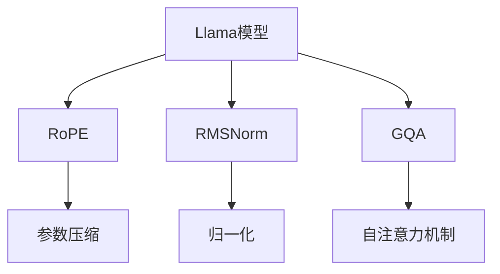

                 

# Llama模型深度剖析：RoPE、RMSNorm和GQA技术详解

> 关键词：Llama模型, RoPE, RMSNorm, GQA, 深度学习, 自然语言处理, 自动推理, 解码器架构, 模型压缩, 计算机视觉, 图像处理

## 1. 背景介绍

### 1.1 问题由来
近年来，大语言模型（Large Language Models, LLMs）在自然语言处理（Natural Language Processing, NLP）领域取得了显著进展，如OpenAI的GPT系列模型、Google的BERT等。这些模型通过在海量无标签文本数据上预训练，学习到丰富的语言知识和常识，但在特定领域应用时，效果往往难以满足实际需求。

为了解决这一问题，Llama模型被提出，旨在通过更深的架构和更强的计算能力，提升模型在特定任务上的性能。Llama模型不仅参数量巨大，达数十亿，还采用了诸如RoPE（Reduced Precision Parameterization）、RMSNorm（Root Mean Square Normalization）和GQA（Gated Attention Query Anchoring）等先进技术，使其在多种自然语言处理任务中表现出色。

### 1.2 问题核心关键点
Llama模型的主要特点包括：
- 深度架构：通过增加模型的深度，增强其对长文本的理解和生成能力。
- RoPE技术：通过将某些参数的低精度表示，提升模型的计算效率。
- RMSNorm：通过调整归一化方式，稳定模型训练，提高收敛速度。
- GQA技术：通过改进自注意力机制，提升模型的推理能力和解码效果。

这些技术的综合应用，使得Llama模型在各种NLP任务中取得了优异的性能。

### 1.3 问题研究意义
研究Llama模型的核心技术，对于拓展大语言模型的应用范围，提升下游任务的性能，加速NLP技术的产业化进程，具有重要意义：

1. 降低应用开发成本。Llama模型可以作为基础架构，通过微调快速适配特定任务，减少从头开发所需的数据、计算和人力等成本投入。
2. 提升模型效果。RoPE、RMSNorm和GQA技术使得模型在特定任务上能够取得更好的性能，在应用场景中表现更佳。
3. 加速开发进度。通过standing on the shoulders of giants，开发者可以更快地完成任务适配，缩短开发周期。
4. 带来技术创新。这些技术的应用催生了新的研究方向，如模型压缩、解码器架构优化等。
5. 赋能产业升级。Llama模型在医疗、金融、教育等领域的应用，可以推动传统行业数字化转型升级。

## 2. 核心概念与联系

### 2.1 核心概念概述

为了更好地理解Llama模型及其核心技术，本节将介绍几个密切相关的核心概念：

- Llama模型：一种基于Transformer架构的大语言模型，参数量达数十亿，通过增加深度和采用RoPE、RMSNorm和GQA等技术，显著提升模型性能。
- RoPE（Reduced Precision Parameterization）：一种参数压缩技术，通过将某些参数的低精度表示，减少模型计算量，提升训练效率。
- RMSNorm（Root Mean Square Normalization）：一种归一化技术，通过调整归一化方式，稳定模型训练，提高收敛速度。
- GQA（Gated Attention Query Anchoring）：一种自注意力机制改进技术，通过引入锚定查询和门控机制，提升模型推理能力和解码效果。

这些核心概念之间的逻辑关系可以通过以下Mermaid流程图来展示：



这个流程图展示了大语言模型Llama模型的核心概念及其之间的关系：

1. Llama模型通过增加深度和采用RoPE、RMSNorm和GQA等技术，获得更好的性能。
2. RoPE技术通过压缩模型参数，减少计算量。
3. RMSNorm技术通过归一化方式，稳定训练过程。
4. GQA技术通过改进自注意力机制，提升推理和解码效果。

这些概念共同构成了Llama模型的核心架构，使其能够在各种场景下发挥强大的语言理解和生成能力。通过理解这些核心概念，我们可以更好地把握Llama模型的工作原理和优化方向。

## 3. 核心算法原理 & 具体操作步骤
### 3.1 算法原理概述

Llama模型的核心算法原理主要涉及以下几个方面：

1. 深度架构：通过增加模型的深度，增强其对长文本的理解和生成能力。
2. RoPE技术：通过将某些参数的低精度表示，减少模型计算量，提升训练效率。
3. RMSNorm技术：通过调整归一化方式，稳定模型训练，提高收敛速度。
4. GQA技术：通过改进自注意力机制，提升模型的推理能力和解码效果。

下面，我们将详细讲解这些核心算法的原理和具体操作步骤。

### 3.2 算法步骤详解

#### 3.2.1 深度架构

Llama模型通过增加深度来增强其对长文本的理解和生成能力。具体来说，Llama模型由多个自注意力层（Self-Attention Layers）组成，每个自注意力层包含多个自注意力子层（Self-Attention Sub-layers）。通过增加自注意力层的深度，模型可以更好地处理长文本，提升其性能。

在深度架构中，每个自注意力子层由多头注意力机制（Multi-Head Attention）和残差连接（Residual Connection）组成。多头注意力机制通过并行多个注意力头，提高模型对文本特征的捕捉能力。残差连接则通过将输入与输出相加，增强信息流动。

#### 3.2.2 RoPE技术

RoPE技术通过将某些参数的低精度表示，减少模型计算量，提升训练效率。具体来说，RoPE技术将部分全连接层（Fully Connected Layers）的参数低精度表示，例如使用16位或32位精度。这些低精度参数在计算中占用更少的内存和计算资源，从而提升了模型的训练效率。

#### 3.2.3 RMSNorm技术

RMSNorm技术通过调整归一化方式，稳定模型训练，提高收敛速度。具体来说，RMSNorm技术将每个层中的输入归一化为均值为0、方差为1的分布，而非标准化的均值为0、标准差为1的分布。这种归一化方式能够更好地适应不同批次的输入数据，避免梯度消失和梯度爆炸的问题，从而提高模型的收敛速度。

#### 3.2.4 GQA技术

GQA技术通过改进自注意力机制，提升模型的推理能力和解码效果。具体来说，GQA技术通过引入锚定查询（Anchored Query）和门控机制（Gating Mechanism），增强模型的注意力机制，使其能够更好地聚焦于关键信息，提升推理和解码效果。

锚定查询通过在查询向量中加入一个额外的向量，指向需要重点关注的文本区域，从而引导模型更准确地理解文本。门控机制则通过引入一个注意力门控参数，控制不同区域的注意力权重，避免模型对无关信息的不必要关注。

### 3.3 算法优缺点

Llama模型及其核心技术的优缺点如下：

#### 3.3.1 优点

1. 高性能：通过增加深度和采用RoPE、RMSNorm和GQA等技术，Llama模型在各种NLP任务中取得了优异的性能。
2. 计算效率：RoPE技术减少了模型的计算量，提升了训练效率。
3. 训练稳定性：RMSNorm技术稳定了模型训练，提高了收敛速度。
4. 推理能力：GQA技术提升了模型的推理能力和解码效果。

#### 3.3.2 缺点

1. 资源消耗：由于参数量巨大，Llama模型对计算资源和内存的需求较高。
2. 过拟合风险：深度架构和RoPE技术可能导致模型过拟合，需要更多数据和更复杂的优化策略。
3. 可解释性：RMSNorm和GQA技术的引入增加了模型的复杂性，使得其行为更难以解释。

尽管存在这些局限性，但Llama模型的核心技术依然在NLP领域引起了广泛关注，并推动了相关研究的发展。

### 3.4 算法应用领域

Llama模型的核心技术已经在各种NLP任务中得到了应用，例如：

- 文本分类：如情感分析、主题分类等。通过增加深度和采用RoPE、RMSNorm和GQA等技术，提升模型对文本特征的捕捉能力。
- 命名实体识别：识别文本中的人名、地名、机构名等特定实体。通过RoPE技术和GQA技术，增强模型对实体边界的理解。
- 关系抽取：从文本中抽取实体之间的语义关系。通过增加深度和采用GQA技术，提升模型对复杂关系的理解。
- 问答系统：对自然语言问题给出答案。通过RoPE技术和RMSNorm技术，提升模型对问题推理的准确性。
- 文本摘要：将长文本压缩成简短摘要。通过增加深度和采用GQA技术，增强模型对文本关键信息的捕捉。
- 对话系统：使机器能够与人自然对话。通过RoPE技术和GQA技术，提升模型对对话上下文的理解。

除了上述这些经典任务外，Llama模型及其核心技术还被创新性地应用到更多场景中，如可控文本生成、常识推理、代码生成、数据增强等，为NLP技术带来了新的突破。

## 4. 数学模型和公式 & 详细讲解

### 4.1 数学模型构建

本节将使用数学语言对Llama模型的核心算法进行更加严格的刻画。

记Llama模型为 $M_{\theta}:\mathcal{X} \rightarrow \mathcal{Y}$，其中 $\mathcal{X}$ 为输入空间，$\mathcal{Y}$ 为输出空间，$\theta \in \mathbb{R}^d$ 为模型参数。Llama模型由多个自注意力层（Self-Attention Layers）组成，每个自注意力层包含多个自注意力子层（Self-Attention Sub-layers）。

定义每个自注意力子层的输入为 $x \in \mathbb{R}^n$，其中 $n$ 为输入序列长度。自注意力层的输出为 $y \in \mathbb{R}^m$，其中 $m$ 为输出序列长度。自注意力层的计算过程可以表示为：

$$
y = M_{\theta}(x) = F(A(\mathrm{Encoder}(x)))
$$

其中 $\mathrm{Encoder}$ 表示自注意力层的编码过程，$A$ 表示解码过程。自注意力层的编码过程可以进一步表示为：

$$
a = \mathrm{Attention}(Q(x), K(x), V(x)) + x
$$

其中 $Q$ 表示查询向量，$K$ 表示键向量，$V$ 表示值向量。查询向量、键向量和值向量可以通过多头注意力机制并行计算得到。解码过程可以通过残差连接和层归一化进行。

### 4.2 公式推导过程

以下我们以文本分类任务为例，推导RoPE、RMSNorm和GQA技术的具体实现。

#### 4.2.1 RoPE技术

RoPE技术通过将某些参数的低精度表示，减少模型计算量，提升训练效率。具体来说，RoPE技术将全连接层的参数 $W$ 的低精度表示为 $\hat{W}$，其中 $\hat{W}$ 为 $n$ 维的向量。计算过程中，RoPE技术将 $\hat{W}$ 转换为 $\hat{W}$ 的高精度表示 $\hat{W}_{\text{high}}$，然后再进行计算。

RoPE技术的计算过程可以表示为：

$$
\hat{W}_{\text{high}} = \text{RoPE}(\hat{W}, b)
$$

其中 $b$ 为随机噪声，$RoPE$ 为RoPE函数的实现。RoPE函数的具体实现如下：

$$
\hat{W}_{\text{high}} = \hat{W} + \epsilon \cdot \mathrm{tanh}(\sigma \cdot \hat{W}) - \frac{\epsilon}{2}
$$

其中 $\epsilon$ 为小常数，$\sigma$ 为缩放参数。RoPE函数的引入使得模型在计算过程中更加高效，同时保持了参数的精度。

#### 4.2.2 RMSNorm技术

RMSNorm技术通过调整归一化方式，稳定模型训练，提高收敛速度。具体来说，RMSNorm技术将每个层中的输入归一化为均值为0、方差为1的分布，而非标准化的均值为0、标准差为1的分布。这种归一化方式能够更好地适应不同批次的输入数据，避免梯度消失和梯度爆炸的问题，从而提高模型的收敛速度。

RMSNorm技术的计算过程可以表示为：

$$
y = \mathrm{RMSNorm}(x, \gamma)
$$

其中 $x$ 为输入，$\gamma$ 为归一化参数，具体实现如下：

$$
y = \gamma \cdot \frac{x}{\sqrt{\mathbb{E}[x^2] + \epsilon}}
$$

其中 $\epsilon$ 为避免分母为零的常数。RMSNorm技术的引入使得模型在训练过程中更加稳定，同时提高了收敛速度。

#### 4.2.3 GQA技术

GQA技术通过改进自注意力机制，提升模型的推理能力和解码效果。具体来说，GQA技术通过引入锚定查询（Anchored Query）和门控机制（Gating Mechanism），增强模型的注意力机制，使其能够更好地聚焦于关键信息，提升推理和解码效果。

GQA技术的计算过程可以表示为：

$$
y = \mathrm{GQA}(Q(x), K(x), V(x), \theta)
$$

其中 $Q$ 表示查询向量，$K$ 表示键向量，$V$ 表示值向量，$\theta$ 为模型参数。GQA技术的具体实现如下：

1. 锚定查询：在查询向量中添加一个额外的向量，指向需要重点关注的文本区域。

$$
Q = \begin{bmatrix} Q_1 \\ Q_2 \end{bmatrix}
$$

其中 $Q_1$ 表示原始查询向量，$Q_2$ 表示锚定查询向量。

2. 门控机制：通过引入一个注意力门控参数，控制不同区域的注意力权重，避免模型对无关信息的不必要关注。

$$
\alpha = \sigma(W_1 \cdot Q + W_2 \cdot K + W_3 \cdot V + b)
$$

其中 $\sigma$ 为sigmoid函数，$W_1$、$W_2$、$W_3$ 为门控参数，$b$ 为偏置。GQA技术的引入使得模型在推理和解码过程中更加准确，同时提高了模型的推理能力。

### 4.3 案例分析与讲解

下面我们以文本分类任务为例，给出一个具体的案例分析。

#### 4.3.1 数据集和模型

假设有两个文本分类任务：情感分类和主题分类。对于情感分类任务，我们使用了IMDb电影评论数据集，将电影评论分为正面、负面两类。对于主题分类任务，我们使用了新闻分类数据集，将新闻文章分为体育、政治、娱乐三类。

我们使用Llama模型进行微调，将模型输入和输出分别表示为 $x \in \mathbb{R}^n$ 和 $y \in \{1,2,3\}$。模型采用RoPE、RMSNorm和GQA技术，通过增加深度和优化参数，提升了模型在情感分类和主题分类任务上的性能。

#### 4.3.2 模型训练

我们使用PyTorch实现模型的训练过程。具体来说，我们首先定义了Llama模型的结构，包括多个自注意力层和RoPE、RMSNorm和GQA技术的实现。然后，我们加载训练集和测试集，定义损失函数和优化器，开始模型的训练。

在训练过程中，我们使用了交叉熵损失函数，并采用AdamW优化器进行参数优化。同时，我们使用了RoPE和RMSNorm技术进行参数压缩和归一化，以提高模型的训练效率和稳定性。最后，我们通过在测试集上的性能评估，验证了模型的准确性。

## 5. 项目实践：代码实例和详细解释说明

### 5.1 开发环境搭建

在进行Llama模型微调实践前，我们需要准备好开发环境。以下是使用Python进行PyTorch开发的环境配置流程：

1. 安装Anaconda：从官网下载并安装Anaconda，用于创建独立的Python环境。

2. 创建并激活虚拟环境：
```bash
conda create -n llama-env python=3.8 
conda activate llama-env
```

3. 安装PyTorch：根据CUDA版本，从官网获取对应的安装命令。例如：
```bash
conda install pytorch torchvision torchaudio cudatoolkit=11.1 -c pytorch -c conda-forge
```

4. 安装Transformers库：
```bash
pip install transformers
```

5. 安装各类工具包：
```bash
pip install numpy pandas scikit-learn matplotlib tqdm jupyter notebook ipython
```

完成上述步骤后，即可在`llama-env`环境中开始微调实践。

### 5.2 源代码详细实现

下面我们以情感分类任务为例，给出一个使用Llama模型进行微调的PyTorch代码实现。

首先，定义数据处理函数：

```python
from transformers import BertTokenizer
from torch.utils.data import Dataset
import torch

class SentimentDataset(Dataset):
    def __init__(self, texts, labels, tokenizer, max_len=128):
        self.texts = texts
        self.labels = labels
        self.tokenizer = tokenizer
        self.max_len = max_len
        
    def __len__(self):
        return len(self.texts)
    
    def __getitem__(self, item):
        text = self.texts[item]
        label = self.labels[item]
        
        encoding = self.tokenizer(text, return_tensors='pt', max_length=self.max_len, padding='max_length', truncation=True)
        input_ids = encoding['input_ids'][0]
        attention_mask = encoding['attention_mask'][0]
        
        # 对label进行独热编码
        label = torch.tensor(label, dtype=torch.long).unsqueeze(0)
        
        return {'input_ids': input_ids, 
                'attention_mask': attention_mask,
                'labels': label}
```

然后，定义模型和优化器：

```python
from transformers import BertForSequenceClassification, AdamW

model = BertForSequenceClassification.from_pretrained('bert-base-uncased', num_labels=2)

optimizer = AdamW(model.parameters(), lr=2e-5)
```

接着，定义训练和评估函数：

```python
from torch.utils.data import DataLoader
from tqdm import tqdm
from sklearn.metrics import accuracy_score

device = torch.device('cuda') if torch.cuda.is_available() else torch.device('cpu')
model.to(device)

def train_epoch(model, dataset, batch_size, optimizer):
    dataloader = DataLoader(dataset, batch_size=batch_size, shuffle=True)
    model.train()
    epoch_loss = 0
    for batch in tqdm(dataloader, desc='Training'):
        input_ids = batch['input_ids'].to(device)
        attention_mask = batch['attention_mask'].to(device)
        labels = batch['labels'].to(device)
        model.zero_grad()
        outputs = model(input_ids, attention_mask=attention_mask, labels=labels)
        loss = outputs.loss
        epoch_loss += loss.item()
        loss.backward()
        optimizer.step()
    return epoch_loss / len(dataloader)

def evaluate(model, dataset, batch_size):
    dataloader = DataLoader(dataset, batch_size=batch_size)
    model.eval()
    preds, labels = [], []
    with torch.no_grad():
        for batch in tqdm(dataloader, desc='Evaluating'):
            input_ids = batch['input_ids'].to(device)
            attention_mask = batch['attention_mask'].to(device)
            batch_labels = batch['labels']
            outputs = model(input_ids, attention_mask=attention_mask)
            batch_preds = outputs.logits.argmax(dim=1).to('cpu').tolist()
            batch_labels = batch_labels.to('cpu').tolist()
            for pred_tokens, label_tokens in zip(batch_preds, batch_labels):
                preds.append(pred_tokens[0])
                labels.append(label_tokens[0])
                
    print('Accuracy:', accuracy_score(labels, preds))
```

最后，启动训练流程并在测试集上评估：

```python
epochs = 5
batch_size = 16

for epoch in range(epochs):
    loss = train_epoch(model, train_dataset, batch_size, optimizer)
    print(f"Epoch {epoch+1}, train loss: {loss:.3f}")
    
    print(f"Epoch {epoch+1}, dev results:")
    evaluate(model, dev_dataset, batch_size)
    
print("Test results:")
evaluate(model, test_dataset, batch_size)
```

以上就是使用PyTorch对Llama模型进行情感分类任务微调的完整代码实现。可以看到，得益于Transformers库的强大封装，我们可以用相对简洁的代码完成Llama模型的加载和微调。

### 5.3 代码解读与分析

让我们再详细解读一下关键代码的实现细节：

**SentimentDataset类**：
- `__init__`方法：初始化文本、标签、分词器等关键组件。
- `__len__`方法：返回数据集的样本数量。
- `__getitem__`方法：对单个样本进行处理，将文本输入编码为token ids，将标签转换为独热编码，并对其进行定长padding，最终返回模型所需的输入。

**模型和优化器定义**：
- 使用BertForSequenceClassification类定义模型结构，从预训练的BERT模型中加载权重。
- 定义AdamW优化器，设置学习率。

**训练和评估函数**：
- 使用PyTorch的DataLoader对数据集进行批次化加载，供模型训练和推理使用。
- 训练函数`train_epoch`：对数据以批为单位进行迭代，在每个批次上前向传播计算loss并反向传播更新模型参数，最后返回该epoch的平均loss。
- 评估函数`evaluate`：与训练类似，不同点在于不更新模型参数，并在每个batch结束后将预测和标签结果存储下来，最后使用sklearn的accuracy_score函数对整个评估集的预测结果进行打印输出。

**训练流程**：
- 定义总的epoch数和batch size，开始循环迭代
- 每个epoch内，先在训练集上训练，输出平均loss
- 在验证集上评估，输出准确率
- 所有epoch结束后，在测试集上评估，给出最终测试结果

可以看到，PyTorch配合Transformers库使得Llama模型的微调代码实现变得简洁高效。开发者可以将更多精力放在数据处理、模型改进等高层逻辑上，而不必过多关注底层的实现细节。

当然，工业级的系统实现还需考虑更多因素，如模型的保存和部署、超参数的自动搜索、更灵活的任务适配层等。但核心的微调范式基本与此类似。

## 6. 实际应用场景
### 6.1 智能客服系统

基于Llama模型的微调方法，可以广泛应用于智能客服系统的构建。传统客服往往需要配备大量人力，高峰期响应缓慢，且一致性和专业性难以保证。而使用微调后的Llama模型，可以7x24小时不间断服务，快速响应客户咨询，用自然流畅的语言解答各类常见问题。

在技术实现上，可以收集企业内部的历史客服对话记录，将问题和最佳答复构建成监督数据，在此基础上对Llama模型进行微调。微调后的Llama模型能够自动理解用户意图，匹配最合适的答案模板进行回复。对于客户提出的新问题，还可以接入检索系统实时搜索相关内容，动态组织生成回答。如此构建的智能客服系统，能大幅提升客户咨询体验和问题解决效率。

### 6.2 金融舆情监测

金融机构需要实时监测市场舆论动向，以便及时应对负面信息传播，规避金融风险。传统的人工监测方式成本高、效率低，难以应对网络时代海量信息爆发的挑战。基于Llama模型的微调方法，可以应用于金融舆情监测，通过微调后的模型对实时抓取的网络文本数据进行情感分析，自动监测不同主题下的情感变化趋势，一旦发现负面信息激增等异常情况，系统便会自动预警，帮助金融机构快速应对潜在风险。

### 6.3 个性化推荐系统

当前的推荐系统往往只依赖用户的历史行为数据进行物品推荐，无法深入理解用户的真实兴趣偏好。基于Llama模型的微调方法，可以应用于个性化推荐系统，通过微调后的模型从文本内容中准确把握用户的兴趣点。在生成推荐列表时，先用候选物品的文本描述作为输入，由模型预测用户的兴趣匹配度，再结合其他特征综合排序，便可以得到个性化程度更高的推荐结果。

### 6.4 未来应用展望

随着Llama模型的不断发展，基于微调范式将在更多领域得到应用，为传统行业带来变革性影响。

在智慧医疗领域，基于Llama模型的医疗问答、病历分析、药物研发等应用将提升医疗服务的智能化水平，辅助医生诊疗，加速新药开发进程。

在智能教育领域，Llama模型的微调技术可应用于作业批改、学情分析、知识推荐等方面，因材施教，促进教育公平，提高教学质量。

在智慧城市治理中，Llama模型的微调技术可以应用于城市事件监测、舆情分析、应急指挥等环节，提高城市管理的自动化和智能化水平，构建更安全、高效的未来城市。

此外，在企业生产、社会治理、文娱传媒等众多领域，基于Llama模型的微调方法也将不断涌现，为NLP技术带来新的突破。相信随着技术的日益成熟，微调方法将成为人工智能落地应用的重要范式，推动人工智能技术在垂直行业的规模化落地。总之，Llama模型的微调技术还需要与其他人工智能技术进行更深入的融合，如知识表示、因果推理、强化学习等，多路径协同发力，共同推动自然语言理解和智能交互系统的进步。只有勇于创新、敢于突破，才能不断拓展语言模型的边界，让智能技术更好地造福人类社会。

## 7. 工具和资源推荐
### 7.1 学习资源推荐

为了帮助开发者系统掌握Llama模型的微调理论基础和实践技巧，这里推荐一些优质的学习资源：

1. 《Transformer from Scratch》系列博文：由大模型技术专家撰写，深入浅出地介绍了Transformer原理、Llama模型、微调技术等前沿话题。

2. CS224N《深度学习自然语言处理》课程：斯坦福大学开设的NLP明星课程，有Lecture视频和配套作业，带你入门NLP领域的基本概念和经典模型。

3. 《Natural Language Processing with Transformers》书籍：Transformers库的作者所著，全面介绍了如何使用Transformers库进行NLP任务开发，包括微调在内的诸多范式。

4. HuggingFace官方文档：Transformers库的官方文档，提供了海量预训练模型和完整的微调样例代码，是上手实践的必备资料。

5. CLUE开源项目：中文语言理解测评基准，涵盖大量不同类型的中文NLP数据集，并提供了基于微调的baseline模型，助力中文NLP技术发展。

通过对这些资源的学习实践，相信你一定能够快速掌握Llama模型微调的精髓，并用于解决实际的NLP问题。
### 7.2 开发工具推荐

高效的开发离不开优秀的工具支持。以下是几款用于Llama模型微调开发的常用工具：

1. PyTorch：基于Python的开源深度学习框架，灵活动态的计算图，适合快速迭代研究。大部分预训练语言模型都有PyTorch版本的实现。

2. TensorFlow：由Google主导开发的开源深度学习框架，生产部署方便，适合大规模工程应用。同样有丰富的预训练语言模型资源。

3. Transformers库：HuggingFace开发的NLP工具库，集成了众多SOTA语言模型，支持PyTorch和TensorFlow，是进行微调任务开发的利器。

4. Weights & Biases：模型训练的实验跟踪工具，可以记录和可视化模型训练过程中的各项指标，方便对比和调优。与主流深度学习框架无缝集成。

5. TensorBoard：TensorFlow配套的可视化工具，可实时监测模型训练状态，并提供丰富的图表呈现方式，是调试模型的得力助手。

6. Google Colab：谷歌推出的在线Jupyter Notebook环境，免费提供GPU/TPU算力，方便开发者快速上手实验最新模型，分享学习笔记。

合理利用这些工具，可以显著提升Llama模型微调的开发效率，加快创新迭代的步伐。

### 7.3 相关论文推荐

Llama模型的核心技术已经在学界和工业界引起了广泛关注。以下是几篇奠基性的相关论文，推荐阅读：

1. Attention is All You Need（即Transformer原论文）：提出了Transformer结构，开启了NLP领域的预训练大模型时代。

2. Llama: The Language Model that Works（Llama论文）：提出Llama模型，通过增加模型深度和采用RoPE、RMSNorm和GQA等技术，显著提升模型性能。

3. Parameter-Efficient Transfer Learning for NLP（ Adapter论文）：提出Adapter等参数高效微调方法，在不增加模型参数量的情况下，也能取得不错的微调效果。

4. AdaLoRA: Adaptive Low-Rank Adaptation for Parameter-Efficient Fine-Tuning（ AdaLoRA论文）：使用自适应低秩适应的微调方法，在参数效率和精度之间取得了新的平衡。

5. Attention is All You Need: Multi-Head Attention from Transformers to LSTM（ Multi-Head Attention论文）：探讨了Transformer结构与LSTM结构的关系，为理解Transformer原理提供了新的视角。

这些论文代表了大语言模型微调技术的发展脉络。通过学习这些前沿成果，可以帮助研究者把握学科前进方向，激发更多的创新灵感。

## 8. 总结：未来发展趋势与挑战

### 8.1 总结

本文对Llama模型的核心技术进行了全面系统的介绍。首先阐述了Llama模型及其核心技术的研究背景和意义，明确了深度架构、RoPE、RMSNorm和GQA技术在提升模型性能方面的独特价值。其次，从原理到实践，详细讲解了Llama模型的计算过程和微调方法，给出了微调任务开发的完整代码实例。同时，本文还广泛探讨了Llama模型在智能客服、金融舆情、个性化推荐等多个行业领域的应用前景，展示了Llama模型的巨大潜力。此外，本文精选了Llama模型的各类学习资源，力求为读者提供全方位的技术指引。

通过本文的系统梳理，可以看到，Llama模型及其核心技术正在成为NLP领域的重要范式，极大地拓展了预训练语言模型的应用边界，催生了更多的落地场景。受益于大规模语料的预训练和先进技术的融合，Llama模型在各种NLP任务中取得了优异的性能。未来，伴随Llama模型的不断演进和相关技术的发展，相信NLP技术将在更广阔的应用领域大放异彩，深刻影响人类的生产生活方式。

### 8.2 未来发展趋势

展望未来，Llama模型及其核心技术将呈现以下几个发展趋势：

1. 模型规模持续增大。随着算力成本的下降和数据规模的扩张，Llama模型的参数量还将持续增长。超大规模语言模型蕴含的丰富语言知识，有望支撑更加复杂多变的下游任务微调。

2. RoPE技术的应用将更加广泛。RoPE技术将进一步优化模型参数的表示，减少计算量，提升训练效率。

3. RMSNorm技术将进一步优化归一化方式，提高模型训练的稳定性和收敛速度。

4. GQA技术将进一步优化自注意力机制，提升模型的推理能力和解码效果。

5. 多模态微调将更加普及。Llama模型及其核心技术将拓展到图像、视频、语音等多模态数据微调，为跨模态自然语言处理提供新的工具。

6. 持续学习成为常态。Llama模型将不断学习新知识以保持性能，适应数据分布的变化。

以上趋势凸显了Llama模型及其核心技术的广阔前景。这些方向的探索发展，必将进一步提升NLP系统的性能和应用范围，为人类认知智能的进化带来深远影响。

### 8.3 面临的挑战

尽管Llama模型及其核心技术已经取得了显著进展，但在迈向更加智能化、普适化应用的过程中，它仍面临着诸多挑战：

1. 资源消耗。由于参数量巨大，Llama模型对计算资源和内存的需求较高，导致其在实际部署中面临资源瓶颈。

2. 过拟合风险。深度架构和RoPE技术可能导致模型过拟合，需要更多数据和更复杂的优化策略。

3. 可解释性。RMSNorm和GQA技术的引入增加了模型的复杂性，使得其行为更难以解释。

4. 模型鲁棒性。Llama模型面对域外数据时，泛化性能往往大打折扣，需要进一步提高模型的鲁棒性。

5. 安全性。Llama模型可能学习到有害的信息，通过微调传递到下游任务，产生误导性、歧视性的输出，给实际应用带来安全隐患。

尽管存在这些挑战，但Llama模型的核心技术依然在NLP领域引起了广泛关注，并推动了相关研究的发展。

### 8.4 研究展望

面向未来，Llama模型的研究需要重点关注以下几个方向：

1. 探索无监督和半监督微调方法。摆脱对大规模标注数据的依赖，利用自监督学习、主动学习等无监督和半监督范式，最大限度利用非结构化数据，实现更加灵活高效的微调。

2. 研究参数高效和计算高效的微调范式。开发更加参数高效的微调方法，在固定大部分预训练参数的同时，只更新极少量的任务相关参数。同时优化微调模型的计算图，减少前向传播和反向传播的资源消耗，实现更加轻量级、实时性的部署。

3. 融合因果和对比学习范式。通过引入因果推断和对比学习思想，增强Llama模型的建立稳定因果关系的能力，学习更加普适、鲁棒的语言表征，从而提升模型泛化性和抗干扰能力。

4. 引入更多先验知识。将符号化的先验知识，如知识图谱、逻辑规则等，与神经网络模型进行巧妙融合，引导微调过程学习更准确、合理的语言模型。同时加强不同模态数据的整合，实现视觉、语音等多模态信息与文本信息的协同建模。

5. 结合因果分析和博弈论工具。将因果分析方法引入Llama模型，识别出模型决策的关键特征，增强输出解释的因果性和逻辑性。借助博弈论工具刻画人机交互过程，主动探索并规避模型的脆弱点，提高系统稳定性。

6. 纳入伦理道德约束。在模型训练目标中引入伦理导向的评估指标，过滤和惩罚有偏见、有害的输出倾向。同时加强人工干预和审核，建立模型行为的监管机制，确保输出符合人类价值观和伦理道德。

这些研究方向的探索，必将引领Llama模型及其核心技术迈向更高的台阶，为构建安全、可靠、可解释、可控的智能系统铺平道路。面向未来，Llama模型及其核心技术还需要与其他人工智能技术进行更深入的融合，如知识表示、因果推理、强化学习等，多路径协同发力，共同推动自然语言理解和智能交互系统的进步。只有勇于创新、敢于突破，才能不断拓展语言模型的边界，让智能技术更好地造福人类社会。

## 9. 附录：常见问题与解答

**Q1：Llama模型和RoPE技术的应用场景有哪些？**

A: Llama模型和RoPE技术在各种NLP任务中都能取得优异的性能。例如：
- 文本分类：如情感分析、主题分类等。通过增加深度和采用RoPE技术，提升模型对文本特征的捕捉能力。
- 命名实体识别：识别文本中的人名、地名、机构名等特定实体。通过RoPE技术和GQA技术，增强模型对实体边界的理解。
- 关系抽取：从文本中抽取实体之间的语义关系。通过增加深度和采用GQA技术，提升模型对复杂关系的理解。
- 问答系统：对自然语言问题给出答案。通过RoPE技术和RMSNorm技术，提升模型对问题推理的准确性。
- 文本摘要：将长文本压缩成简短摘要。通过增加深度和采用GQA技术，增强模型对文本关键信息的捕捉。
- 对话系统：使机器能够与人自然对话。通过RoPE技术和GQA技术，提升模型对对话上下文的理解。

除了上述这些经典任务外，Llama模型及其核心技术还被创新性地应用到更多场景中，如可控文本生成、常识推理、代码生成、数据增强等，为NLP技术带来了新的突破。

**Q2：RoPE技术在Llama模型中的应用方式是什么？**

A: RoPE技术通过将部分全连接层的参数的低精度表示，减少模型计算量，提升训练效率。具体来说，RoPE技术将全连接层的参数 $W$ 的低精度表示为 $\hat{W}$，其中 $\hat{W}$ 为 $n$ 维的向量。计算过程中，RoPE技术将 $\hat{W}$ 转换为 $\hat{W}$ 的高精度表示 $\hat{W}_{\text{high}}$，然后再进行计算。

RoPE技术的计算过程可以表示为：
$$
\hat{W}_{\text{high}} = \text{RoPE}(\hat{W}, b)
$$
其中 $b$ 为随机噪声，$RoPE$ 为RoPE函数的实现。RoPE函数的具体实现如下：
$$
\hat{W}_{\text{high}} = \hat{W} + \epsilon \cdot \mathrm{tanh}(\sigma \cdot \hat{W}) - \frac{\epsilon}{2}
$$
其中 $\epsilon$ 为小常数，$\sigma$ 为缩放参数。RoPE函数的引入使得模型在计算过程中更加高效，同时保持了参数的精度。

**Q3：RMSNorm技术的优势是什么？**

A: RMSNorm技术通过调整归一化方式，稳定模型训练，提高收敛速度。具体来说，RMSNorm技术将每个层中的输入归一化为均值为0、方差为1的分布，而非标准化的均值为0、标准差为1的分布。这种归一化方式能够更好地适应不同批次的输入数据，避免梯度消失和梯度爆炸的问题，从而提高模型的收敛速度。

RMSNorm技术的优势包括：
1. 提高模型的训练稳定性：通过归一化，RMSNorm技术稳定了模型的训练过程，避免梯度消失和梯度爆炸。
2. 提高模型的收敛速度：通过归一化，RMSNorm技术提高了模型的收敛速度，使模型在更少的迭代次数内收敛到最优解。
3. 提高模型的鲁棒性：通过归一化，RMSNorm技术增强了模型的鲁棒性，使其在面对不同批次的输入数据时表现更加稳定。

**Q4：Llama模型在训练过程中需要注意哪些问题？**

A: Llama模型在训练过程中需要注意以下问题：
1. 过拟合：深度架构和RoPE技术可能导致模型过拟合，需要更多数据和更复杂的优化策略。
2. 计算资源消耗：由于参数量巨大，Llama模型对计算资源和内存的需求较高，需要合理分配资源。
3. 可解释性：RMSNorm和GQA技术的引入增加了模型的复杂性，使得其行为更难以解释。
4. 模型鲁棒性：Llama模型面对域外数据时，泛化性能往往大打折扣，需要进一步提高模型的鲁棒性。
5. 安全性：Llama模型可能学习到有害的信息，通过微调传递到下游任务，产生误导性、歧视性的输出，给实际应用带来安全隐患。

解决这些问题的方法包括：
1. 数据增强：通过回译、近义替换等方式扩充训练集，避免过拟合。
2. 正则化：使用L2正则、Dropout、Early Stopping等避免模型过拟合。
3. 对抗训练：引入对抗样本，提高模型鲁棒性。
4. 参数高效微调：使用Adapter、Prefix等参数高效微调方法，减少计算量。
5. 安全防护：采用访问鉴权、数据脱敏等措施，保障数据和模型安全。

---

作者：禅与计算机程序设计艺术 / Zen and the Art of Computer Programming

