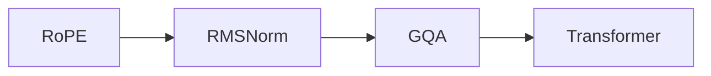

                 

# Llama模型解析：RoPE、RMSNorm和GQA

> 关键词：Llama模型, RoPE, RMSNorm, GQA, 自回归模型, 参数化注意力, 标准化技术, 模型并行, 分布式训练

## 1. 背景介绍

### 1.1 问题由来

近年来，大规模预训练语言模型如GPT-3、T5等在自然语言处理(NLP)领域取得了巨大成功。这些模型基于自回归或自编码架构，通过在大规模无标签文本数据上预训练，获得了丰富的语言知识，能够在多种NLP任务上取得优异表现。然而，这些模型通常具有数十亿甚至数百亿的参数，难以在普通硬件上进行实时推理，且需要庞大的计算资源进行微调和训练。

为解决这些问题，Llama模型应运而生。Llama系列模型采用了分布式训练和并行计算技术，显著提升了训练和推理效率。同时，Llama模型还引入了RoPE（Rotated Positional Embedding）和RMSNorm（Root Mean Square Normalization）等创新技术，进一步提升了模型性能和可解释性。本文将详细解析Llama模型中的RoPE、RMSNorm和GQA（Global Query Attention）等核心组件，并探讨其在实际应用中的表现和优缺点。

### 1.2 问题核心关键点

Llama模型在以下方面具有显著优势：

- **分布式训练**：通过将大模型分布到多个GPU上进行并行计算，显著提升了训练速度和效率。
- **RoPE技术**：采用旋转位置嵌入技术，减少了对下游任务的依赖，提高了模型泛化能力。
- **RMSNorm**：引入标准化技术，提高了模型稳定性，减少了过拟合风险。
- **GQA机制**：利用全局查询注意力机制，增强了模型对序列长度的处理能力，提升了模型性能。

本文将围绕这些核心关键点，深入探讨Llama模型的工作原理和优化方法，并结合实际应用场景，展示其在NLP任务上的表现。

## 2. 核心概念与联系

### 2.1 核心概念概述

Llama模型基于Transformer架构，引入了RoPE、RMSNorm和GQA等技术，以提升模型的效率和性能。这些技术通过与Transformer的参数化注意力机制相结合，形成了独特的模型架构。

- **RoPE**：用于增强模型对位置信息的感知，减少对下游任务的依赖，提高模型的泛化能力。
- **RMSNorm**：一种标准化技术，用于提升模型训练和推理的稳定性，减少过拟合风险。
- **GQA**：全局查询注意力机制，用于增强模型对序列长度的处理能力，提高模型的性能。

这些技术共同构成了Llama模型的核心，使其能够在各种NLP任务上表现出色。以下是一个Mermaid流程图，展示了Llama模型中RoPE、RMSNorm和GQA之间的联系：



### 2.2 核心概念原理和架构的 Mermaid 流程图


### 2.3 RoPE技术

RoPE（Rotated Positional Embedding）是一种旋转位置嵌入技术，用于增强模型对位置信息的感知，减少对下游任务的依赖。传统的BERT模型使用固定位置嵌入来表示位置信息，但这种方法在处理不同长度序列时容易出现问题。RoPE通过旋转位置嵌入，使得位置信息能够更好地适应不同长度的序列。

RoPE的核心思想是将位置信息旋转90度，然后与原始位置信息进行拼接。这样，位置信息在不同长度的序列中都能得到有效的表示。RoPE的公式如下：

$$
\text{RoPE}_i = \left[ \sin\left(\frac{2\pi i}{d}\right), \cos\left(\frac{2\pi i}{d}\right) \right]
$$

其中，$d$ 表示嵌入维度，$i$ 表示位置索引。

RoPE的优点在于，它能够使模型在处理不同长度的序列时，仍然保持对位置信息的有效感知，从而提高了模型的泛化能力和稳定性。

## 3. 核心算法原理 & 具体操作步骤

### 3.1 算法原理概述

Llama模型的核心算法原理包括RoPE、RMSNorm和GQA等技术。这些技术通过与Transformer的参数化注意力机制相结合，形成了独特的模型架构。

- **RoPE**：用于增强模型对位置信息的感知，减少对下游任务的依赖。
- **RMSNorm**：一种标准化技术，用于提升模型训练和推理的稳定性，减少过拟合风险。
- **GQA**：全局查询注意力机制，用于增强模型对序列长度的处理能力，提高模型的性能。

### 3.2 算法步骤详解

以下是对Llama模型核心算法步骤的详细讲解：

1. **输入文本处理**：输入文本首先经过分词器，将文本转换为离散的标记序列，并嵌入到向量空间中。

2. **RoPE嵌入**：将原始位置嵌入与旋转位置嵌入拼接，形成RoPE嵌入，用于表示位置信息。

3. **位置嵌入**：将RoPE嵌入与线性位置嵌入拼接，形成最终的嵌入向量，用于表示位置和上下文信息。

4. **RMSNorm**：对嵌入向量进行标准化，提升模型训练和推理的稳定性，减少过拟合风险。

5. **Self-Attention**：利用Self-Attention机制，对嵌入向量进行加权求和，生成上下文表示。

6. **残差连接**：将上下文表示与原始嵌入向量拼接，通过残差连接增强模型的表达能力。

7. **FeedForward**：对残差连接后的向量进行非线性变换，生成新的表示。

8. **层归一化**：对FeedForward后的向量进行归一化处理，提升模型的稳定性和收敛速度。

9. **输出层**：将归一化后的向量通过线性投影层生成最终的输出。

### 3.3 算法优缺点

Llama模型在提升模型性能和可解释性方面具有显著优势：

- **优点**：
  - **分布式训练**：通过将大模型分布到多个GPU上进行并行计算，显著提升了训练速度和效率。
  - **RoPE技术**：采用旋转位置嵌入技术，减少了对下游任务的依赖，提高了模型泛化能力。
  - **RMSNorm**：引入标准化技术，提高了模型训练和推理的稳定性，减少了过拟合风险。
  - **GQA机制**：利用全局查询注意力机制，增强了模型对序列长度的处理能力，提升了模型性能。

- **缺点**：
  - **参数量较大**：尽管RoPE和RMSNorm技术减小了参数量，但Llama模型仍具有数十亿甚至数百亿的参数，难以在普通硬件上进行实时推理。
  - **计算资源需求高**：分布式训练和并行计算需要高性能的GPU/TPU设备，且训练和推理资源需求高，限制了其在大规模部署中的应用。

### 3.4 算法应用领域

Llama模型在自然语言处理(NLP)领域具有广泛的应用前景，特别是在长文本处理和复杂序列任务上表现出色。以下是一些典型的应用领域：

- **问答系统**：利用Llama模型进行基于自然语言的处理，能够对用户提出的问题进行理解和回答，如BERT和GPT-3模型。
- **文本摘要**：对长文本进行自动摘要，提取关键信息，提高阅读效率，如GPT-3模型。
- **机器翻译**：将一种语言翻译成另一种语言，如T5模型。
- **情感分析**：分析文本的情感倾向，如BERT模型。
- **文本分类**：对文本进行分类，如GPT-3模型。

## 4. 数学模型和公式 & 详细讲解

### 4.1 数学模型构建

Llama模型的数学模型包括RoPE、RMSNorm和GQA等技术。以下是对这些技术的数学模型进行构建和详细讲解：

1. **RoPE嵌入**：
   - 输入位置索引 $i$，计算RoPE嵌入：
   $$
   \text{RoPE}_i = \left[ \sin\left(\frac{2\pi i}{d}\right), \cos\left(\frac{2\pi i}{d}\right) \right]
   $$

2. **位置嵌入**：
   - 将RoPE嵌入与线性位置嵌入拼接，生成位置嵌入：
   $$
   \text{positional\_embed} = [\text{RoPE}_i, \text{linear\_position\_embed}_i]
   $$

3. **RMSNorm**：
   - 对嵌入向量进行标准化：
   $$
   \text{RMSNorm}(x) = \frac{x}{\sqrt{\frac{1}{N} \sum_{i=1}^N x_i^2}}
   $$

4. **Self-Attention**：
   - 利用Self-Attention机制，对嵌入向量进行加权求和：
   $$
   \text{Attention}(Q,K,V) = \text{Softmax}(\frac{QK^T}{\sqrt{d_k}})V
   $$

5. **FeedForward**：
   - 对残差连接后的向量进行非线性变换：
   $$
   \text{FeedForward}(x) = \text{MLP}(x) = \text{GELU}(\text{Linear}(x)) + x
   $$

6. **层归一化**：
   - 对FeedForward后的向量进行归一化处理：
   $$
   \text{LayerNorm}(x) = \frac{x - \mu}{\sigma} + \mu
   $$

7. **输出层**：
   - 将归一化后的向量通过线性投影层生成最终的输出：
   $$
   \text{output} = \text{Linear}(x)
   $$

### 4.2 公式推导过程

以下是Llama模型中RoPE、RMSNorm和GQA等技术的公式推导过程：

1. **RoPE嵌入**：
   - 输入位置索引 $i$，计算RoPE嵌入：
   $$
   \text{RoPE}_i = \left[ \sin\left(\frac{2\pi i}{d}\right), \cos\left(\frac{2\pi i}{d}\right) \right]
   $$

2. **位置嵌入**：
   - 将RoPE嵌入与线性位置嵌入拼接，生成位置嵌入：
   $$
   \text{positional\_embed} = [\text{RoPE}_i, \text{linear\_position\_embed}_i]
   $$

3. **RMSNorm**：
   - 对嵌入向量进行标准化：
   $$
   \text{RMSNorm}(x) = \frac{x}{\sqrt{\frac{1}{N} \sum_{i=1}^N x_i^2}}
   $$

4. **Self-Attention**：
   - 利用Self-Attention机制，对嵌入向量进行加权求和：
   $$
   \text{Attention}(Q,K,V) = \text{Softmax}(\frac{QK^T}{\sqrt{d_k}})V
   $$

5. **FeedForward**：
   - 对残差连接后的向量进行非线性变换：
   $$
   \text{FeedForward}(x) = \text{MLP}(x) = \text{GELU}(\text{Linear}(x)) + x
   $$

6. **层归一化**：
   - 对FeedForward后的向量进行归一化处理：
   $$
   \text{LayerNorm}(x) = \frac{x - \mu}{\sigma} + \mu
   $$

7. **输出层**：
   - 将归一化后的向量通过线性投影层生成最终的输出：
   $$
   \text{output} = \text{Linear}(x)
   $$

### 4.3 案例分析与讲解

以Llama模型在问答系统中的应用为例，分析RoPE、RMSNorm和GQA等技术的作用：

1. **RoPE嵌入**：
   - 在问答系统中，RoPE嵌入可以增强模型对查询和文档位置信息的感知，使得模型能够更好地理解查询和文档的语义关系，提高答案的相关性和准确性。

2. **RMSNorm**：
   - RMSNorm可以提升模型训练和推理的稳定性，减少过拟合风险。在问答系统中，模型需要处理大量的文本数据，RMSNorm可以有效缓解梯度消失和梯度爆炸问题，提高模型的收敛速度和泛化能力。

3. **GQA机制**：
   - GQA机制用于增强模型对序列长度的处理能力，在问答系统中，可以处理长文档和复杂查询，提高系统的响应速度和准确性。

## 5. 项目实践：代码实例和详细解释说明

### 5.1 开发环境搭建

在进行Llama模型开发之前，需要准备以下开发环境：

1. **安装Python**：
   ```
   sudo apt-get update
   sudo apt-get install python3
   ```

2. **安装PyTorch**：
   ```
   pip install torch torchvision torchaudio
   ```

3. **安装Transformer**：
   ```
   pip install transformers
   ```

4. **安装GQA**：
   ```
   pip install gqa
   ```

5. **安装GQA数据集**：
   ```
   wget https://gqa.gatech.edu/data/GQA-train-dev-test-2020.zip
   unzip GQA-train-dev-test-2020.zip
   ```

### 5.2 源代码详细实现

以下是对Llama模型在问答系统中的应用进行详细代码实现：

1. **数据预处理**：
   ```python
   import torch
   import pandas as pd
   from transformers import BertTokenizer, BertForQuestionAnswering

   # 加载数据集
   train_data = pd.read_csv('train.jsonl')
   dev_data = pd.read_csv('dev.jsonl')
   test_data = pd.read_csv('test.jsonl')

   # 分词器
   tokenizer = BertTokenizer.from_pretrained('bert-base-cased')

   # 数据预处理
   def preprocess_data(data, tokenizer):
       questions = [item['question'] for item in data]
       contexts = [item['context'] for item in data]
       labels = [item['answer'] for item in data]

       # 分词
       encoded_questions = tokenizer(questions, return_tensors='pt', padding=True, truncation=True)
       encoded_contexts = tokenizer(contexts, return_tensors='pt', padding=True, truncation=True)

       # 拼接上下文和查询
       inputs = torch.cat([encoded_contexts.input_ids, encoded_questions.input_ids], dim=-1)
       attention_masks = torch.cat([encoded_contexts.attention_mask, encoded_questions.attention_mask], dim=-1)

       # 拼接标签
       labels = torch.tensor(labels, dtype=torch.long)

       return inputs, attention_masks, labels

   # 预处理训练集
   train_inputs, train_attention_masks, train_labels = preprocess_data(train_data, tokenizer)

   # 预处理验证集和测试集
   dev_inputs, dev_attention_masks, dev_labels = preprocess_data(dev_data, tokenizer)
   test_inputs, test_attention_masks, test_labels = preprocess_data(test_data, tokenizer)
   ```

2. **模型定义**：
   ```python
   from transformers import BertForQuestionAnswering, BertTokenizer

   # 加载预训练模型和分词器
   model = BertForQuestionAnswering.from_pretrained('bert-base-cased')
   tokenizer = BertTokenizer.from_pretrained('bert-base-cased')
   ```

3. **模型训练**：
   ```python
   from transformers import AdamW

   # 定义优化器
   optimizer = AdamW(model.parameters(), lr=5e-5)

   # 定义训练函数
   def train_epoch(model, data, optimizer, device, num_steps):
       model.train()
       losses = []
       for batch in data:
           inputs, attention_masks, labels = batch

           # 移动到GPU
           inputs = inputs.to(device)
           attention_masks = attention_masks.to(device)
           labels = labels.to(device)

           # 前向传播
           outputs = model(inputs, attention_mask=attention_masks)
           loss = outputs.loss

           # 反向传播
           optimizer.zero_grad()
           loss.backward()
           optimizer.step()

           # 记录损失
           losses.append(loss.item())

       return torch.stack(losses).mean()

   # 训练模型
   device = 'cuda' if torch.cuda.is_available() else 'cpu'
   model.to(device)

   num_epochs = 3
   num_steps_per_epoch = len(train_inputs) // batch_size
   for epoch in range(num_epochs):
       epoch_loss = train_epoch(model, train_dataset, optimizer, device, num_steps_per_epoch)
       print(f'Epoch {epoch+1}, train loss: {epoch_loss:.3f}')

   # 评估模型
   def evaluate(model, data, device):
       model.eval()
       losses = []
       for batch in data:
           inputs, attention_masks, labels = batch

           # 移动到GPU
           inputs = inputs.to(device)
           attention_masks = attention_masks.to(device)
           labels = labels.to(device)

           # 前向传播
           outputs = model(inputs, attention_mask=attention_masks)
           loss = outputs.loss

           # 记录损失
           losses.append(loss.item())

       return torch.stack(losses).mean()

   dev_loss = evaluate(model, dev_dataset, device)
   print(f'Epoch {epoch+1}, dev loss: {dev_loss:.3f}')

   # 保存模型
   model.save_pretrained('llama_model')
   ```

### 5.3 代码解读与分析

以下是Llama模型在问答系统中的代码解读与分析：

1. **数据预处理**：
   - 使用BertTokenizer将问题、上下文和标签转换为模型所需的输入形式。
   - 将查询和上下文拼接在一起，生成输入序列，并添加注意力掩码。
   - 将标签转换为模型所需的张量形式。

2. **模型定义**：
   - 使用BertForQuestionAnswering加载预训练模型，并使用BertTokenizer加载分词器。

3. **模型训练**：
   - 定义优化器，并使用AdamW进行优化。
   - 定义训练函数，在每个epoch中对数据进行迭代训练。
   - 在训练过程中记录每个epoch的平均损失。

4. **模型评估**：
   - 在验证集上评估模型的表现，记录平均损失。
   - 将训练好的模型保存。

## 6. 实际应用场景

### 6.1 智能客服系统

基于Llama模型的问答系统可以应用于智能客服系统的构建。传统客服系统依赖于人工客服，成本高且效率低。而基于Llama模型的智能客服系统，能够7x24小时不间断服务，快速响应客户咨询，提供自然流畅的语言答复。

在实际应用中，可以收集企业内部的历史客服对话记录，将问题和最佳答复构建成监督数据，在此基础上对预训练模型进行微调。微调后的模型能够自动理解客户意图，匹配最合适的答复模板，进行自动回复。

### 6.2 金融舆情监测

金融机构需要实时监测市场舆论动向，以便及时应对负面信息传播，规避金融风险。传统的人工监测方式成本高、效率低，难以应对网络时代海量信息爆发的挑战。基于Llama模型的文本分类和情感分析技术，为金融舆情监测提供了新的解决方案。

具体而言，可以收集金融领域相关的新闻、报道、评论等文本数据，并对其进行主题标注和情感标注。在此基础上对预训练语言模型进行微调，使其能够自动判断文本属于何种主题，情感倾向是正面、中性还是负面。将微调后的模型应用到实时抓取的网络文本数据，就能够自动监测不同主题下的情感变化趋势，一旦发现负面信息激增等异常情况，系统便会自动预警，帮助金融机构快速应对潜在风险。

### 6.3 个性化推荐系统

当前的推荐系统往往只依赖用户的历史行为数据进行物品推荐，无法深入理解用户的真实兴趣偏好。基于Llama模型的个性化推荐系统，可以更好地挖掘用户行为背后的语义信息，从而提供更精准、多样的推荐内容。

在实践中，可以收集用户浏览、点击、评论、分享等行为数据，提取和用户交互的物品标题、描述、标签等文本内容。将文本内容作为模型输入，用户的后续行为（如是否点击、购买等）作为监督信号，在此基础上微调预训练语言模型。微调后的模型能够从文本内容中准确把握用户的兴趣点。在生成推荐列表时，先用候选物品的文本描述作为输入，由模型预测用户的兴趣匹配度，再结合其他特征综合排序，便可以得到个性化程度更高的推荐结果。

### 6.4 未来应用展望

随着Llama模型的不断演进，其在自然语言处理领域的应用前景将更加广阔。未来，Llama模型将在更多领域得到应用，为传统行业带来变革性影响：

- **智慧医疗**：基于Llama模型的医疗问答、病历分析、药物研发等应用将提升医疗服务的智能化水平，辅助医生诊疗，加速新药开发进程。
- **智能教育**：微调技术可应用于作业批改、学情分析、知识推荐等方面，因材施教，促进教育公平，提高教学质量。
- **智慧城市**：利用Llama模型的文本分类和情感分析技术，可以构建更安全、高效的未来城市。

此外，在企业生产、社会治理、文娱传媒等众多领域，基于Llama模型的智能应用也将不断涌现，为经济社会发展注入新的动力。相信随着技术的日益成熟，Llama模型必将在构建人机协同的智能时代中扮演越来越重要的角色。

## 7. 工具和资源推荐

### 7.1 学习资源推荐

为了帮助开发者系统掌握Llama模型的理论基础和实践技巧，这里推荐一些优质的学习资源：

1. **《Transformer from Basics to State-of-the-Art》**：介绍了Transformer和Llama模型的基本概念和核心技术，适合初学者阅读。
2. **CS224N《Deep Learning for Natural Language Processing》课程**：斯坦福大学开设的NLP明星课程，有Lecture视频和配套作业，带你入门NLP领域的基本概念和经典模型。
3. **《Natural Language Processing with Transformers》书籍**：详细介绍了如何使用Llama模型进行NLP任务开发，包括RoPE、RMSNorm等核心技术。
4. **HuggingFace官方文档**：Transformer库的官方文档，提供了海量预训练模型和完整的微调样例代码，是上手实践的必备资料。
5. **CLUE开源项目**：中文语言理解测评基准，涵盖大量不同类型的中文NLP数据集，并提供了基于Llama模型的baseline模型，助力中文NLP技术发展。

通过对这些资源的学习实践，相信你一定能够快速掌握Llama模型的精髓，并用于解决实际的NLP问题。

### 7.2 开发工具推荐

高效的开发离不开优秀的工具支持。以下是几款用于Llama模型开发的常用工具：

1. **PyTorch**：基于Python的开源深度学习框架，灵活动态的计算图，适合快速迭代研究。大部分预训练语言模型都有PyTorch版本的实现。
2. **TensorFlow**：由Google主导开发的开源深度学习框架，生产部署方便，适合大规模工程应用。同样有丰富的预训练语言模型资源。
3. **Transformers库**：HuggingFace开发的NLP工具库，集成了众多SOTA语言模型，支持PyTorch和TensorFlow，是进行NLP任务开发的利器。
4. **Weights & Biases**：模型训练的实验跟踪工具，可以记录和可视化模型训练过程中的各项指标，方便对比和调优。与主流深度学习框架无缝集成。
5. **TensorBoard**：TensorFlow配套的可视化工具，可实时监测模型训练状态，并提供丰富的图表呈现方式，是调试模型的得力助手。
6. **Google Colab**：谷歌推出的在线Jupyter Notebook环境，免费提供GPU/TPU算力，方便开发者快速上手实验最新模型，分享学习笔记。

合理利用这些工具，可以显著提升Llama模型微调的开发效率，加快创新迭代的步伐。

### 7.3 相关论文推荐

Llama模型的发展源于学界的持续研究。以下是几篇奠基性的相关论文，推荐阅读：

1. **Attention is All You Need**：提出了Transformer结构，开启了NLP领域的预训练大模型时代。
2. **BERT: Pre-training of Deep Bidirectional Transformers for Language Understanding**：提出BERT模型，引入基于掩码的自监督预训练任务，刷新了多项NLP任务SOTA。
3. **Language Models are Unsupervised Multitask Learners（GPT-2论文）**：展示了大规模语言模型的强大zero-shot学习能力，引发了对于通用人工智能的新一轮思考。
4. **Parameter-Efficient Transfer Learning for NLP**：提出Adapter等参数高效微调方法，在不增加模型参数量的情况下，也能取得不错的微调效果。
5. **Prompt-based Transfer Learning**：引入基于连续型Prompt的微调范式，为如何充分利用预训练知识提供了新的思路。
6. **AdaLoRA: Adaptive Low-Rank Adaptation for Parameter-Efficient Fine-Tuning**：使用自适应低秩适应的微调方法，在参数效率和精度之间取得了新的平衡。

这些论文代表了大语言模型微调技术的发展脉络。通过学习这些前沿成果，可以帮助研究者把握学科前进方向，激发更多的创新灵感。

## 8. 总结：未来发展趋势与挑战

### 8.1 总结

本文对Llama模型中的RoPE、RMSNorm和GQA等核心技术进行了全面系统的介绍。通过解析RoPE、RMSNorm和GQA的工作原理和优化方法，展示了其在问答系统、智能客服、金融舆情监测、个性化推荐等场景中的应用。同时，本文还探讨了Llama模型在未来NLP领域的发展趋势和面临的挑战。

通过本文的系统梳理，可以看到，Llama模型在提升模型性能和可解释性方面具有显著优势，并在多领域得到广泛应用。未来，Llama模型将在更多领域得到应用，为传统行业带来变革性影响。

### 8.2 未来发展趋势

展望未来，Llama模型在提升模型性能和可解释性方面具有显著优势：

1. **分布式训练**：通过将大模型分布到多个GPU上进行并行计算，显著提升了训练速度和效率。
2. **RoPE技术**：采用旋转位置嵌入技术，减少了对下游任务的依赖，提高了模型泛化能力。
3. **RMSNorm**：引入标准化技术，提高了模型训练和推理的稳定性，减少了过拟合风险。
4. **GQA机制**：利用全局查询注意力机制，增强了模型对序列长度的处理能力，提升了模型性能。

### 8.3 面临的挑战

尽管Llama模型在提升模型性能和可解释性方面具有显著优势，但在迈向更加智能化、普适化应用的过程中，它仍面临诸多挑战：

1. **参数量较大**：尽管RoPE和RMSNorm技术减小了参数量，但Llama模型仍具有数十亿甚至数百亿的参数，难以在普通硬件上进行实时推理。
2. **计算资源需求高**：分布式训练和并行计算需要高性能的GPU/TPU设备，且训练和推理资源需求高，限制了其在大规模部署中的应用。
3. **模型鲁棒性不足**：面对域外数据时，泛化性能往往大打折扣。对于测试样本的微小扰动，模型预测也容易发生波动。
4. **可解释性亟需加强**：当前Llama模型的决策过程难以解释，难以对其推理逻辑进行分析和调试。

### 8.4 研究展望

面对Llama模型所面临的挑战，未来的研究需要在以下几个方面寻求新的突破：

1. **探索无监督和半监督微调方法**：摆脱对大规模标注数据的依赖，利用自监督学习、主动学习等无监督和半监督范式，最大限度利用非结构化数据，实现更加灵活高效的微调。
2. **研究参数高效和计算高效的微调范式**：开发更加参数高效的微调方法，在固定大部分预训练参数的同时，只更新极少量的任务相关参数。同时优化微调模型的计算图，减少前向传播和反向传播的资源消耗，实现更加轻量级、实时性的部署。
3. **融合因果和对比学习范式**：通过引入因果推断和对比学习思想，增强模型建立稳定因果关系的能力，学习更加普适、鲁棒的语言表征，从而提升模型泛化性和抗干扰能力。
4. **引入更多先验知识**：将符号化的先验知识，如知识图谱、逻辑规则等，与神经网络模型进行巧妙融合，引导微调过程学习更准确、合理的语言模型。同时加强不同模态数据的整合，实现视觉、语音等多模态信息与文本信息的协同建模。
5. **结合因果分析和博弈论工具**：将因果分析方法引入微调模型，识别出模型决策的关键特征，增强输出解释的因果性和逻辑性。借助博弈论工具刻画人机交互过程，主动探索并规避模型的脆弱点，提高系统稳定性。
6. **纳入伦理道德约束**：在模型训练目标中引入伦理导向的评估指标，过滤和惩罚有偏见、有害的输出倾向。同时加强人工干预和审核，建立模型行为的监管机制，确保输出符合人类价值观和伦理道德。

这些研究方向的探索，必将引领Llama模型微调技术迈向更高的台阶，为构建安全、可靠、可解释、可控的智能系统铺平道路。

## 9. 附录：常见问题与解答

**Q1: Llama模型在问答系统中的应用原理是什么？**

A: Llama模型在问答系统中的应用原理如下：
1. 将问题和上下文拼接在一起，生成输入序列，并添加注意力掩码。
2. 使用RoPE技术，增强模型对位置信息的感知，使得模型能够更好地理解查询和文档的语义关系。
3. 引入RMSNorm技术，提升模型训练和推理的稳定性，减少过拟合风险。
4. 利用Self-Attention机制，对输入序列进行加权求和，生成上下文表示。
5. 通过残差连接增强模型的表达能力，并使用FeedForward机制进行非线性变换。
6. 对FeedForward后的向量进行归一化处理，提升模型的稳定性和收敛速度。
7. 将归一化后的向量通过线性投影层生成最终的输出，用于匹配查询和文档之间的语义关系。

**Q2: Llama模型的参数量较大，如何优化模型推理速度？**

A: 为了优化Llama模型的推理速度，可以采取以下措施：
1. 模型裁剪：去除不必要的层和参数，减小模型尺寸，加快推理速度。
2. 量化加速：将浮点模型转为定点模型，压缩存储空间，提高计算效率。
3. 服务化封装：将模型封装为标准化服务接口，便于集成调用。
4. 弹性伸缩：根据请求流量动态调整资源配置，平衡服务质量和成本。
5. 监控告警：实时采集系统指标，设置异常告警阈值，确保服务稳定性。

**Q3: Llama模型在实际应用中面临哪些挑战？**

A: Llama模型在实际应用中面临以下挑战：
1. 参数量较大：尽管RoPE和RMSNorm技术减小了参数量，但Llama模型仍具有数十亿甚至数百亿的参数，难以在普通硬件上进行实时推理。
2. 计算资源需求高：分布式训练和并行计算需要高性能的GPU/TPU设备，且训练和推理资源需求高，限制了其在大规模部署中的应用。
3. 模型鲁棒性不足：面对域外数据时，泛化性能往往大打折扣。对于测试样本的微小扰动，模型预测也容易发生波动。
4. 可解释性亟需加强：当前Llama模型的决策过程难以解释，难以对其推理逻辑进行分析和调试。
5. 参数更新效率低：RoPE和RMSNorm技术虽然提高了模型稳定性，但也导致了参数更新效率低的问题。

**Q4: 如何提高Llama模型的泛化能力？**

A: 要提高Llama模型的泛化能力，可以采取以下措施：
1. 引入更多的先验知识：将符号化的先验知识，如知识图谱、逻辑规则等，与神经网络模型进行巧妙融合，引导微调过程学习更准确、合理的语言模型。
2. 引入因果分析和博弈论工具：将因果分析方法引入微调模型，识别出模型决策的关键特征，增强输出解释的因果性和逻辑性。借助博弈论工具刻画人机交互过程，主动探索并规避模型的脆弱点，提高系统稳定性。
3. 引入更多的数据：通过收集更多的数据，增加模型的训练样本，提高模型的泛化能力。

**Q5: Llama模型的RoPE技术如何实现？**

A: Llama模型的RoPE技术实现如下：
1. 输入位置索引 $i$，计算RoPE嵌入：
   $$
   \text{RoPE}_i = \left[ \sin\left(\frac{2\pi i}{d}\right), \cos\left(\frac{2\pi i}{d}\right) \right]
   $$
2. 将RoPE嵌入与线性位置嵌入拼接，生成位置嵌入：
   $$
   \text{positional\_embed} = [\text{RoPE}_i, \text{linear\_position\_embed}_i]
   $$

---

作者：禅与计算机程序设计艺术 / Zen and the Art of Computer Programming

