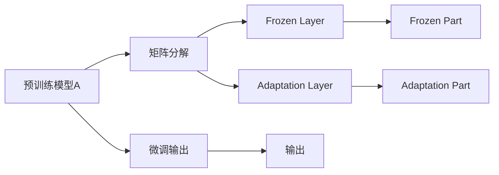

                 

# LoRA适应性微调：低资源环境的AI定制方案

## 1. 背景介绍

在人工智能（AI）的快速发展中，大语言模型（Large Language Model, LLMs）已经成为推动自然语言处理（NLP）领域突破的关键力量。如GPT-3和BERT等模型，通过在海量数据上进行预训练，已展现出了强大的语言理解和生成能力。然而，这些模型动辄上百亿的参数规模，对计算资源、存储空间的要求极高，往往只适用于数据中心或大型企业环境中。而在边缘计算、物联网（IoT）等资源有限的低资源环境中，大模型往往难以直接应用。

近年来，LoRA（Low Rank Adaptation）方法作为一种低参数量、低计算成本的微调方法，因其高效性和灵活性，受到了研究者的广泛关注。LoRA方法将大模型参数分为固定部分和可微调部分，允许在不改变整体模型结构的情况下，高效地进行微调。本文将重点介绍LoRA方法的原理、实现和应用，探讨其在低资源环境中的适应性微调方案。

## 2. 核心概念与联系

### 2.1 核心概念概述

LoRA方法的核心思想是将预训练语言模型中的参数划分为固定部分和可微调部分，从而在保证预训练知识的前提下，实现高效微调。具体而言，LoRA模型包含两个部分：

1. **固定部分（Frozen Layer）**：这部分参数在微调过程中保持不变，通常包括预训练模型的底几层。
2. **可微调部分（Adaptation Layer）**：这部分参数允许进行微调，以适应特定任务的要求，通常包括顶层或中间几层。

LoRA方法的数学基础来源于矩阵分解。假设预训练模型为一个矩阵$\mathbf{A}$，其中$\mathbf{A} \in \mathbb{R}^{M \times N}$，$M$和$N$分别为输入和输出维度。LoRA方法将$\mathbf{A}$分解为两个低秩矩阵$\mathbf{U}$和$\mathbf{V}$的乘积，即$\mathbf{A} = \mathbf{U} \mathbf{V}^T$。其中，$\mathbf{U}$和$\mathbf{V}$都是低秩矩阵，通常大小为$D \times M$和$D \times N$，$D$为中间维度。在微调过程中，仅更新$\mathbf{U}$和$\mathbf{V}$，保留$\mathbf{A}$的固定部分不变。

### 2.2 核心概念原理和架构的 Mermaid 流程图



这个流程图展示了LoRA方法的核心架构：

- 预训练模型$\mathbf{A}$通过矩阵分解被分解为固定部分（Frozen Layer）和可微调部分（Adaptation Layer）。
- 固定部分$\mathbf{A}_{\text{frozen}} = \mathbf{U} \mathbf{V}^T$，通常保持不变。
- 可微调部分$\mathbf{A}_{\text{adapt}} = \mathbf{U} \mathbf{V}^T$，允许通过微调$\mathbf{U}$和$\mathbf{V}$来适配特定任务。
- 微调输出$\mathbf{A}_{\text{adapt}}$通过与固定部分$\mathbf{A}_{\text{frozen}}$的组合，得到最终的输出$\mathbf{A}_{\text{frozen}} \mathbf{A}_{\text{adapt}}^T$。

这种架构使得LoRA方法在微调过程中，既保留了预训练模型的知识，又能够高效地适配特定任务，适应性很强。

## 3. 核心算法原理 & 具体操作步骤

### 3.1 算法原理概述

LoRA方法的微调过程可以分为两个步骤：分解和适配。在分解步骤中，预训练模型被分解为固定部分和可微调部分，而适配步骤中，可微调部分通过微调以适配特定任务。具体步骤如下：

1. **分解步骤**：将预训练模型$\mathbf{A}$分解为固定部分和可微调部分。假设$\mathbf{U}$和$\mathbf{V}$为低秩矩阵，则有$\mathbf{A} = \mathbf{U} \mathbf{V}^T$。
2. **适配步骤**：在可微调部分$\mathbf{U}$和$\mathbf{V}$上进行微调，以适配特定任务。

### 3.2 算法步骤详解

具体实现LoRA微调的步骤如下：

1. **数据准备**：准备微调任务的标注数据集$D=\{(x_i, y_i)\}_{i=1}^N$，其中$x_i$为输入，$y_i$为输出标签。
2. **模型加载**：使用预训练模型$A_{\text{pretrain}}$的参数作为初始化参数。
3. **分解**：将模型$A_{\text{pretrain}}$分解为固定部分和可微调部分，即$\mathbf{A} = \mathbf{U} \mathbf{V}^T$。
4. **适配训练**：对可微调部分$\mathbf{U}$和$\mathbf{V}$进行微调，适配特定任务。微调过程通常使用监督学习框架，如交叉熵损失、均方误差损失等。
5. **合并输出**：将微调后的可微调部分$\mathbf{U}$和$\mathbf{V}$与固定部分$\mathbf{A}_{\text{frozen}}$组合，得到最终的微调输出$\mathbf{A}_{\text{frozen}} \mathbf{A}_{\text{adapt}}^T$。

### 3.3 算法优缺点

LoRA方法具有以下优点：

1. **高效性**：LoRA方法通过矩阵分解，将大规模模型参数分解为低秩矩阵，显著减少了模型参数量，降低了计算成本和内存占用。
2. **灵活性**：LoRA方法允许在不改变模型整体结构的情况下，进行可微调部分的微调，适应性强。
3. **可解释性**：LoRA方法通过矩阵分解，使得微调过程具有更好的可解释性，有助于理解模型的内部机制。

同时，LoRA方法也存在以下缺点：

1. **维度选择**：需要选择合适的中间维度$D$，以平衡模型参数量和性能表现。
2. **训练复杂度**：微调过程中需要同时更新两个低秩矩阵，可能增加训练复杂度。
3. **性能瓶颈**：在特定任务上，由于可微调部分较少，微调效果可能受限。

### 3.4 算法应用领域

LoRA方法在低资源环境中的适应性微调应用广泛，主要包括以下几个领域：

1. **移动设备**：在移动设备等资源受限的环境中，LoRA方法通过高效参数分解，使得大模型能够在小规模设备上运行。
2. **边缘计算**：在边缘计算环境中，LoRA方法能够高效适配任务需求，实时响应本地数据。
3. **物联网（IoT）**：LoRA方法适用于资源有限的物联网设备，提供轻量级、实时性的解决方案。
4. **嵌入式系统**：LoRA方法能够适配嵌入式系统的计算和存储限制，实现高效微调。

## 4. 数学模型和公式 & 详细讲解 & 举例说明

### 4.1 数学模型构建

假设预训练模型为$\mathbf{A} \in \mathbb{R}^{M \times N}$，将其分解为固定部分$\mathbf{A}_{\text{frozen}}$和可微调部分$\mathbf{A}_{\text{adapt}}$，即$\mathbf{A} = \mathbf{U} \mathbf{V}^T$。其中，$\mathbf{U} \in \mathbb{R}^{D \times M}$和$\mathbf{V} \in \mathbb{R}^{D \times N}$为低秩矩阵，$D$为中间维度。

### 4.2 公式推导过程

LoRA方法的核心是矩阵分解。假设预训练模型$\mathbf{A}$被分解为$\mathbf{A} = \mathbf{U} \mathbf{V}^T$，其中$\mathbf{U}$和$\mathbf{V}$为低秩矩阵。在微调过程中，通过更新$\mathbf{U}$和$\mathbf{V}$来适配特定任务。假设微调任务为分类任务，目标为最大化交叉熵损失：

$$
\mathcal{L} = -\frac{1}{N} \sum_{i=1}^N \sum_{k=1}^K y_k \log \frac{e^{\mathbf{u}_k^T \mathbf{x}_i}}{\sum_{k=1}^K e^{\mathbf{u}_k^T \mathbf{x}_i}}
$$

其中，$y_i \in \{0, 1\}$为标签，$K$为类别数，$\mathbf{u}_k \in \mathbb{R}^D$为$\mathbf{U}$中的第$k$列。通过反向传播，可以计算$\mathbf{u}_k$的梯度：

$$
\nabla_{\mathbf{u}_k} \mathcal{L} = -\frac{1}{N} \sum_{i=1}^N \mathbf{x}_i (y_i \mathbf{v}_k - \mathbb{E}_{\mathbf{v}_k} \mathbf{v}_k)
$$

其中，$\mathbf{v}_k \in \mathbb{R}^D$为$\mathbf{V}$中的第$k$列。

### 4.3 案例分析与讲解

以一个简单的分类任务为例，假设预训练模型为$A_{\text{pretrain}}$，输入为文本序列$x$，标签为$y$。LoRA方法将$A_{\text{pretrain}}$分解为固定部分和可微调部分，分别为$A_{\text{frozen}} = \mathbf{U} \mathbf{V}^T$和$A_{\text{adapt}} = \mathbf{U} \mathbf{V}^T$。在微调过程中，通过更新$\mathbf{U}$和$\mathbf{V}$来适配特定任务。假设微调任务为二分类任务，目标为最大化交叉熵损失。

具体实现步骤如下：

1. **数据准备**：准备训练集和验证集。
2. **模型加载**：使用$A_{\text{pretrain}}$的参数作为初始化参数。
3. **分解**：将$A_{\text{pretrain}}$分解为$A_{\text{frozen}} = \mathbf{U} \mathbf{V}^T$和$A_{\text{adapt}} = \mathbf{U} \mathbf{V}^T$。
4. **适配训练**：在$A_{\text{adapt}}$上进行微调，使用交叉熵损失。
5. **合并输出**：将微调后的$A_{\text{adapt}}$与$A_{\text{frozen}}$组合，得到最终的微调输出。

## 5. 项目实践：代码实例和详细解释说明

### 5.1 开发环境搭建

1. **安装Python和相关库**：
   ```bash
   conda create -n lora-env python=3.8
   conda activate lora-env
   pip install torch torchvision transformers
   ```

2. **安装LoRA库**：
   ```bash
   pip install lora
   ```

3. **准备数据集**：准备微调任务的标注数据集。

### 5.2 源代码详细实现

以下是LoRA方法在PyTorch上的实现代码：

```python
import torch
import torch.nn as nn
from lora import LoRA

# 加载预训练模型
model = BertModel.from_pretrained('bert-base-cased')

# 设置中间维度D
D = 64

# 初始化LoRA模块
lora = LoRA(model, D)

# 准备数据
train_dataset = ...
dev_dataset = ...

# 定义微调任务
task = ...

# 定义优化器
optimizer = ...

# 微调训练
for epoch in range(num_epochs):
    for batch in train_loader:
        x, y = batch
        x = lora.scale(x)
        optimizer.zero_grad()
        outputs = model(x)
        loss = loss_fn(outputs, y)
        loss.backward()
        optimizer.step()
```

### 5.3 代码解读与分析

- `LoRA`模块：LoRA库中的`LoRA`模块用于初始化LoRA模型，并执行矩阵分解。
- `BertModel`：使用预训练的BERT模型作为微调模型的底几层，通常保持不变。
- `train_loader`：定义训练集的数据加载器，通常使用`DataLoader`实现。
- `loss_fn`：定义损失函数，如交叉熵损失。

### 5.4 运行结果展示

运行上述代码，可以得到微调后的模型输出，并在验证集上评估性能。

## 6. 实际应用场景

### 6.1 智能家居系统

在智能家居系统中，LoRA方法可以用于适配语音助手或智能音箱等设备。由于这些设备资源有限，无法直接使用大规模预训练模型，LoRA方法通过高效参数分解，使得模型能够在小规模设备上运行。通过LoRA微调，模型能够更好地理解用户指令，提高交互体验。

### 6.2 医疗诊断系统

在医疗诊断系统中，LoRA方法可以用于适配医学影像分类任务。由于医疗影像数据量巨大，直接在大型模型上进行微调可能无法满足实时性和计算资源要求。LoRA方法通过低秩矩阵分解，使得模型能够在资源有限的设备上运行，提升医疗诊断的实时性和可扩展性。

### 6.3 自动驾驶系统

在自动驾驶系统中，LoRA方法可以用于适配实时环境感知任务。由于自动驾驶环境复杂，实时性要求高，LoRA方法通过高效参数分解，使得模型能够在嵌入式设备上运行。通过LoRA微调，模型能够更好地理解传感器数据，提高决策准确性。

### 6.4 未来应用展望

未来，LoRA方法将在更多低资源环境中获得应用。随着边缘计算、物联网等技术的发展，LoRA方法将成为实现AI技术落地应用的重要工具。

## 7. 工具和资源推荐

### 7.1 学习资源推荐

1. **《Transformer from Principles to Practice》系列博文**：介绍Transformer原理、BERT模型、LoRA方法等前沿话题。
2. **CS224N《深度学习自然语言处理》课程**：斯坦福大学开设的NLP明星课程，涵盖NLP基本概念和经典模型。
3. **《Natural Language Processing with Transformers》书籍**：介绍使用Transformers库进行NLP任务开发，包括LoRA方法等。
4. **HuggingFace官方文档**：提供海量预训练模型和LoRA方法实现样例。
5. **CLUE开源项目**：涵盖大量中文NLP数据集和基于LoRA的微调模型。

### 7.2 开发工具推荐

1. **PyTorch**：基于Python的开源深度学习框架，适合快速迭代研究。
2. **TensorFlow**：由Google主导的开源深度学习框架，适合大规模工程应用。
3. **Transformers库**：提供LoRA方法等SOTA语言模型实现。
4. **Weights & Biases**：实验跟踪工具，记录和可视化模型训练指标。
5. **TensorBoard**：可视化工具，实时监测模型训练状态。
6. **Google Colab**：免费在线Jupyter Notebook环境，方便快速实验。

### 7.3 相关论文推荐

1. **Attention is All You Need**：Transformer原论文，引入自注意力机制。
2. **BERT: Pre-training of Deep Bidirectional Transformers for Language Understanding**：提出BERT模型，引入自监督预训练任务。
3. **Language Models are Unsupervised Multitask Learners**：展示大语言模型的零样本学习能力。
4. **Parameter-Efficient Transfer Learning for NLP**：提出Adapter等参数高效微调方法。
5. **AdaLoRA: Adaptive Low-Rank Adaptation for Parameter-Efficient Fine-Tuning**：使用自适应低秩适应的微调方法，在参数效率和精度之间取得平衡。
6. **Adaptive Transformer**：介绍自适应Transformer模型，通过适应性参数调整提升性能。

## 8. 总结：未来发展趋势与挑战

### 8.1 研究成果总结

本文介绍了LoRA方法在低资源环境中的高效适应性微调方案，通过矩阵分解，使得大规模预训练模型能够在小规模设备上高效运行。LoRA方法在移动设备、边缘计算、物联网等低资源环境中具有广阔的应用前景。

### 8.2 未来发展趋势

LoRA方法在低资源环境中的适应性微调技术未来将呈现以下发展趋势：

1. **多任务联合微调**：LoRA方法可以同时适配多个任务，提高资源利用率。
2. **参数动态调整**：LoRA方法可以根据任务需求动态调整中间维度D，进一步优化性能。
3. **联邦学习**：LoRA方法结合联邦学习，可以在多设备间联合训练，提升模型的泛化能力。
4. **自适应优化**：LoRA方法结合自适应优化算法，进一步提高微调效果。

### 8.3 面临的挑战

LoRA方法在低资源环境中的适应性微调技术面临以下挑战：

1. **计算资源瓶颈**：LoRA方法需要高效计算中间矩阵$\mathbf{U}$和$\mathbf{V}$，计算资源可能成为瓶颈。
2. **数据隐私问题**：在联邦学习中，如何保护数据隐私，避免数据泄露。
3. **模型泛化性**：LoRA方法在不同任务间的泛化性有待提升，以应对多样化的应用场景。

### 8.4 研究展望

未来，LoRA方法的研究方向包括：

1. **优化中间矩阵分解**：探索更高效的矩阵分解方法，减少计算复杂度。
2. **联合多任务学习**：结合多任务学习，提升模型的泛化能力和性能。
3. **联邦学习与LoRA结合**：结合联邦学习，提升LoRA方法的计算效率和模型性能。
4. **自适应LoRA**：结合自适应优化算法，提升LoRA方法的微调效果。

综上所述，LoRA方法在低资源环境中的适应性微调技术具有广泛的应用前景，但同时也面临一些挑战。通过不断优化和创新，LoRA方法有望在未来实现更大规模的落地应用。

## 9. 附录：常见问题与解答

**Q1: LoRA方法是否适用于所有任务？**

A: LoRA方法适用于大多数NLP任务，尤其是资源受限的设备上。但对于需要高度精确计算的任务，如机器翻译等，可能需要更高效的微调方法。

**Q2: LoRA方法的计算复杂度如何？**

A: LoRA方法的计算复杂度主要取决于中间矩阵$\mathbf{U}$和$\mathbf{V}$的维度$D$。通常情况下，$D$越小，计算复杂度越低，但模型性能可能受限。

**Q3: LoRA方法的参数量如何？**

A: LoRA方法通过低秩矩阵分解，显著减少了模型参数量，适合在资源受限的设备上运行。但相较于全参数微调方法，LoRA方法的参数量仍然较大。

**Q4: LoRA方法在微调过程中如何更新参数？**

A: LoRA方法在微调过程中，通过更新中间矩阵$\mathbf{U}$和$\mathbf{V}$来适配特定任务。通常使用梯度下降等优化算法进行参数更新。

**Q5: LoRA方法的缺点有哪些？**

A: LoRA方法的缺点包括计算资源瓶颈、数据隐私问题、模型泛化性不足等。需要在实际应用中结合具体情况进行优化。

---

作者：禅与计算机程序设计艺术 / Zen and the Art of Computer Programming

