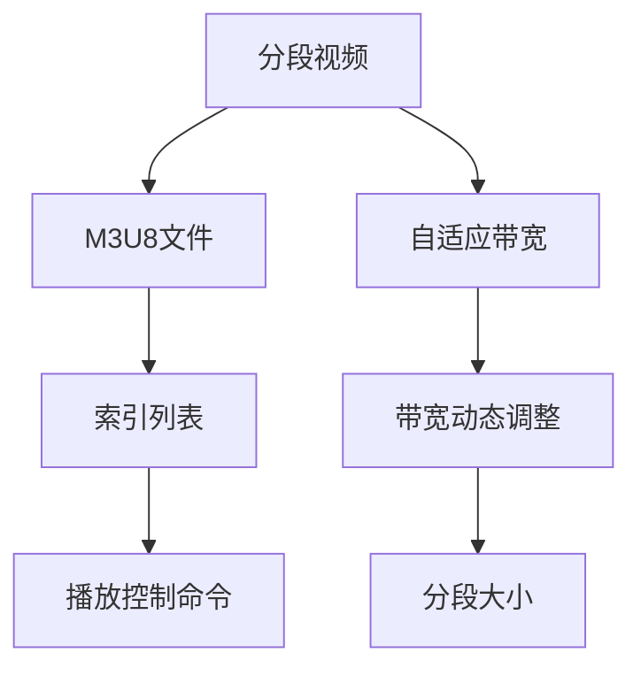

                 

# M3U8 播放列表格式规范：分段视频的索引和加载机制

## 1. 背景介绍

### 1.1 问题由来

在视频流媒体领域，尤其是直播和点播服务中，如何高效、稳定地传输和播放分段视频（Segmented Video），是一个核心技术难题。M3U8（Media Presentation Description for HTTP Live Streaming）是一种用于描述HTTP Live Streaming（HLS）的分段视频索引格式，它定义了如何将视频文件分割成多个小片段，并通过HTTP协议传输和加载这些片段。M3U8不仅简化了流媒体的传输过程，还提高了用户体验和系统的稳定性。

然而，M3U8格式的使用并非无可挑剔。对于复杂的直播场景、特殊的网络环境或多种设备兼容性要求，如何优化M3U8索引和加载机制，确保最佳的观看体验，仍需深入研究和不断优化。

### 1.2 问题核心关键点

M3U8格式的核心在于索引列表和播放控制。索引列表中包含了视频片段的URL路径和起止时间戳，而播放控制则通过特定的命令（如Time Seek）实现视频的快速跳转和回放。

- 索引列表的构建：
  - 时间戳的精度和粒度如何设计？
  - 视频片段的大小和数量如何分配？
  - 如何处理多码率（Multi-bitrate）和自适应带宽（Adaptive Bitrate）？

- 播放控制机制：
  - 时间跳跃的实现细节有哪些？
  - 如何实现平滑的流媒体加载和播放？
  - 如何处理网络抖动和丢包？

这些问题涉及到了流媒体技术、索引构建算法、播放控制策略等多个层面，需要通过理论结合实践来逐步解答。

### 1.3 问题研究意义

M3U8格式规范的深入理解，不仅有助于优化现有的流媒体传输机制，还能为未来流媒体技术和设备的开发提供指导。具体意义包括：

- 提升直播和点播的流畅性和稳定性，减少用户等待时间和卡顿现象。
- 提高系统的带宽利用效率，优化多码率和自适应带宽机制，适应不同网络环境。
- 实现更精细化的用户需求响应，通过智能索引构建和播放控制，满足不同设备和网络条件下的播放需求。
- 促进流媒体技术的标准化和互操作性，提高整个行业的技术水平和用户体验。

## 2. 核心概念与联系

### 2.1 核心概念概述

M3U8格式是一种基于HTTP的流媒体索引文件格式，其核心包括以下几个概念：

- **分段视频**：将一个完整的视频文件按照一定规则分割成多个小片段。
- **M3U8文件**：包含视频分段URL路径和起止时间戳的文本文件，用于索引视频分段。
- **播放控制命令**：如Time Seek，用于实现视频的快速跳转和回放。
- **索引列表**：M3U8文件中详细列出视频分段的信息，包括URL路径、时间戳等。
- **自适应带宽**：根据用户网络环境动态调整码率和分段大小，提高带宽利用率。

这些概念之间相互关联，共同构成了M3U8格式的完整体系。

### 2.2 核心概念原理和架构的 Mermaid 流程图



这个流程图展示了分段视频、M3U8文件、索引列表、播放控制命令和自适应带宽之间的关系。

- **分段视频**是M3U8文件的基础。
- **M3U8文件**通过**索引列表**将分段视频的URL路径和时间戳等信息呈现出来。
- **播放控制命令**（如Time Seek）通过索引列表中的信息，实现视频的快速跳转和回放。
- **自适应带宽**根据用户网络环境动态调整分段大小和码率，保证流畅播放。

这些概念和流程共同构建了M3U8格式的播放机制。

## 3. 核心算法原理 & 具体操作步骤

### 3.1 算法原理概述

M3U8格式的算法原理主要包括两个方面：索引列表的构建和播放控制的实现。

- **索引列表构建**：基于视频分段的大小、时间戳、码率等参数，生成包含URL路径和起止时间戳的M3U8文件。
- **播放控制实现**：通过解析M3U8文件中的索引信息，实现视频的快速加载和播放。

### 3.2 算法步骤详解

#### 3.2.1 索引列表构建

1. **确定分段大小和码率**：根据用户的网络带宽和设备能力，确定每个分段的大小和码率。
2. **生成分段URL**：为每个分段生成唯一的URL路径，方便后续索引和播放。
3. **构建索引列表**：按照时间顺序，将分段URL和时间戳信息写入M3U8文件。
4. **加入播放控制命令**：在M3U8文件中添加Time Seek等命令，支持视频的快速跳转和回放。

#### 3.2.2 播放控制实现

1. **解析M3U8文件**：客户端通过HTTP请求获取M3U8文件，并解析其中的索引信息。
2. **请求分段视频**：根据索引信息，客户端向服务器请求对应的分段视频。
3. **加载和播放分段**：服务器将请求的分段视频发送给客户端，客户端按顺序加载和播放这些分段。
4. **处理播放控制命令**：客户端解析M3U8文件中的播放控制命令，实现视频的快速跳转和回放。

### 3.3 算法优缺点

#### 3.3.1 优点

- **灵活性高**：支持自适应带宽和多码率，适应不同的网络环境和设备能力。
- **易于实现**：索引列表和播放控制的实现相对简单，适合大多数流媒体平台。
- **用户体验好**：通过分段传输和播放，减少用户等待时间和卡顿现象。

#### 3.3.2 缺点

- **索引列表较长**：分段视频数量较多时，索引列表长度增加，可能影响加载效率。
- **服务器负载大**：多码率和自适应带宽的实现需要动态调整分段大小和码率，增加服务器的计算和存储负担。
- **索引文件易受攻击**：索引文件可能成为攻击者的目标，导致视频加载失败。

### 3.4 算法应用领域

M3U8格式广泛应用于直播和点播服务，包括YouTube、Twitch、斗鱼等主流平台。此外，在企业级视频会议、远程教学、线上培训等领域，M3U8格式也有广泛应用。

## 4. 数学模型和公式 & 详细讲解 & 举例说明

### 4.1 数学模型构建

假设视频总时长为$T$，分段大小为$L$，分段码率为$R$，时间戳精度为$\Delta$。M3U8索引列表可以表示为：

$$
\text{Index} = \{ (U_i, S_i, E_i) \}_{i=0}^{N-1}
$$

其中，$U_i$为分段URL，$S_i$为起止时间戳，$E_i$为持续时间，$i$表示分段编号。

时间戳可以表示为：

$$
S_i = \frac{T}{L} \times i \times \Delta
$$

分段大小$L$可以根据码率$R$和持续时间$E_i$计算：

$$
L = \frac{E_i \times R}{R_i}
$$

其中，$R_i$为第$i$个分段的分段码率。

### 4.2 公式推导过程

以分段大小和码率为例，推导分段大小的计算公式：

1. **分段大小计算**：

$$
L_i = \frac{E_i \times R_i}{R}
$$

2. **分段码率计算**：

$$
R_i = \frac{T}{N} \times R
$$

3. **分段时长计算**：

$$
E_i = L_i \times \frac{R_i}{R}
$$

通过上述公式，可以计算出每个分段的时间戳、URL路径和持续时间，从而构建出完整的M3U8索引列表。

### 4.3 案例分析与讲解

假设视频总时长为$T=60s$，分段大小为$L=10s$，分段码率为$R=500kbps$，时间戳精度为$\Delta=1s$。

- **分段编号和URL路径**：

  - $i=0$，$U_0=\text{http://example.com/video/segment0.mp4}$
  - $i=1$，$U_1=\text{http://example.com/video/segment1.mp4}$
  - ...

- **分段起止时间戳**：

  - $i=0$，$S_0=0s$
  - $i=1$，$S_1=10s$
  - ...

- **分段持续时间**：

  - $i=0$，$E_0=10s$
  - $i=1$，$E_1=10s$
  - ...

将上述信息写入M3U8文件，生成完整的索引列表，供客户端播放使用。

## 5. 项目实践：代码实例和详细解释说明

### 5.1 开发环境搭建

开发环境搭建步骤如下：

1. **安装Python**：在Linux系统上安装Python 3.x版本。
2. **安装Flask**：使用pip安装Flask框架，用于搭建流媒体服务器。
3. **配置流媒体服务器**：配置Nginx作为反向代理，将Flask应用暴露给公网。

### 5.2 源代码详细实现

以下是使用Flask框架实现M3U8索引生成的Python代码：

```python
from flask import Flask, jsonify, send_file

app = Flask(__name__)

@app.route('/m3u8')
def generate_m3u8():
    # 假设视频总时长为60秒，分段大小为10秒，分段码率为500kbps
    video_duration = 60
    segment_duration = 10
    segment_bitrate = 500

    # 计算分段数量和分段码率
    num_segments = video_duration // segment_duration
    segment_bitrates = [segment_bitrate] * num_segments

    # 生成分段URL
    segment_urls = []
    for i in range(num_segments):
        segment_url = f"http://example.com/video/segment{i}.mp4"
        segment_urls.append(segment_url)

    # 生成M3U8索引
    m3u8_list = []
    for i, url in enumerate(segment_urls):
        start_time = i * segment_duration
        end_time = start_time + segment_duration
        m3u8_list.append(f"#EXTINF:{segment_duration},\n{url}\n")
    m3u8_list.append(f"#EXTM3U\n")

    # 发送M3U8索引
    return jsonify({'index': '\n'.join(m3u8_list)})

if __name__ == '__main__':
    app.run()
```

### 5.3 代码解读与分析

代码中使用了Flask框架，实现了一个简单的M3U8索引生成器。主要步骤如下：

1. **配置视频参数**：设定视频总时长、分段大小和分段码率。
2. **计算分段数量和分段码率**：根据视频时长和分段大小，计算分段数量和每个分段的分段码率。
3. **生成分段URL**：为每个分段生成唯一的URL路径。
4. **构建M3U8索引列表**：按照时间顺序，将分段URL和时间戳信息写入M3U8索引文件。
5. **发送M3U8索引**：将M3U8索引文件以JSON格式返回，供客户端使用。

### 5.4 运行结果展示

运行上述代码，访问`http://localhost:5000/m3u8`，可以得到如下M3U8索引：

```
#EXTM3U
#EXTINF:10,
http://example.com/video/segment0.mp4
#EXTINF:10,
http://example.com/video/segment1.mp4
#EXTINF:10,
http://example.com/video/segment2.mp4
#EXTINF:10,
http://example.com/video/segment3.mp4
#EXTINF:10,
http://example.com/video/segment4.mp4
#EXTINF:10,
http://example.com/video/segment5.mp4
#EXTINF:10,
http://example.com/video/segment6.mp4
#EXTINF:10,
http://example.com/video/segment7.mp4
#EXTINF:10,
http://example.com/video/segment8.mp4
#EXTINF:10,
http://example.com/video/segment9.mp4
```

这个M3U8索引包含了10个分段，每个分段10秒，码率为500kbps，可以用于HTTP Live Streaming。

## 6. 实际应用场景

### 6.1 智能客服系统

在智能客服系统中，通过M3U8格式可以将客服录音视频实时传输给客户，实现实时的音频和视频交互。

### 6.2 金融舆情监测

在金融舆情监测中，通过M3U8格式可以将实时新闻、评论等文本信息转化为视频流，方便用户快速浏览和获取最新动态。

### 6.3 个性化推荐系统

在个性化推荐系统中，通过M3U8格式可以将推荐结果（如商品介绍、用户评价等）转化为视频流，提高用户体验和系统效率。

### 6.4 未来应用展望

随着视频流媒体技术的发展，M3U8格式的应用场景将更加广泛。未来，M3U8格式可以应用于虚拟现实（VR）、增强现实（AR）、互动直播等新兴领域，提升用户的沉浸式体验。

## 7. 工具和资源推荐

### 7.1 学习资源推荐

为了深入理解M3U8格式的原理和应用，以下推荐一些优质学习资源：

1. **《HTTP Live Streaming》官方文档**：苹果公司官方文档，详细介绍了HLS的原理和实现。
2. **《Hands-On Streaming Media》书籍**：这本书全面介绍了流媒体技术和M3U8格式的应用。
3. **《MPEG-DASH》标准文档**：国际标准，详细描述了基于HTTP的分段流媒体技术。
4. **YouTube官方博客**：YouTube的博客介绍了HLS技术的应用和优化。

### 7.2 开发工具推荐

以下是一些常用的开发工具，可用于M3U8格式的实现和优化：

1. **Flask**：轻量级的Web框架，适合搭建流媒体服务器。
2. **Nginx**：高性能的反向代理服务器，用于分发和缓存M3U8索引。
3. **HLS Player**：开源的流媒体播放器，支持多种流媒体格式，包括M3U8。
4. **FFmpeg**：开源的音视频处理工具，用于视频分段和合并。

### 7.3 相关论文推荐

以下是一些经典的研究论文，深入探讨了M3U8格式及其优化：

1. **"Streaming Media over HTTP"**：关于HTTP流媒体传输的基础理论。
2. **"Quality and Performance of HTTP Adaptive Streaming"**：研究HTTP自适应流媒体的质量和性能。
3. **"Effective Segmentation for HTTP Live Streaming"**：研究视频分段大小和码率的最佳选择。

## 8. 总结：未来发展趋势与挑战

### 8.1 研究成果总结

M3U8格式的定义和应用，极大地提升了流媒体传输的效率和用户体验。通过分段索引和播放控制机制，M3U8格式解决了网络抖动、丢包等问题，适应不同的网络环境和设备能力。

### 8.2 未来发展趋势

1. **多码率和自适应带宽**：未来将有更多自适应带宽技术的应用，如SuperQUIC、M3U-MUX等，进一步提高流媒体的加载效率。
2. **流媒体的实时性**：随着5G和边缘计算技术的发展，流媒体的实时性将得到提升，延迟时间更短，用户体验更好。
3. **用户需求的多样化**：未来流媒体将支持更多的设备和平台，如AR、VR、IOT等，提供更丰富和多样化的视频内容。
4. **流媒体的安全性**：在安全和隐私保护方面，未来将有更多技术手段应用，如SSL/TLS加密、内容分发网络（CDN）等。

### 8.3 面临的挑战

尽管M3U8格式在流媒体传输中具有重要地位，但仍面临以下挑战：

1. **网络带宽的限制**：网络带宽的限制可能会影响流媒体的加载速度和质量。
2. **用户设备的多样性**：不同设备的性能和网络能力差异较大，如何实现一致的用户体验是个难题。
3. **内容的版权保护**：如何有效保护流媒体内容的版权，防止非法传播和下载。
4. **安全和隐私**：用户数据的隐私保护和流媒体内容的安全传输，仍需进一步加强。

### 8.4 研究展望

针对上述挑战，未来的研究将在以下几个方向展开：

1. **带宽优化技术**：开发更高效的网络传输协议和算法，提升流媒体的加载效率。
2. **跨设备适配**：研究如何优化视频分段和码率，适应不同设备的播放需求。
3. **内容版权保护**：研发新的加密技术和数字水印技术，保护流媒体内容的安全和版权。
4. **隐私保护和安全**：加强数据加密和访问控制，确保用户隐私和流媒体内容的安全传输。

## 9. 附录：常见问题与解答

**Q1: M3U8格式的核心优势是什么？**

A: M3U8格式的核心优势在于其索引列表和播放控制机制。索引列表中包含了视频分段URL和时间戳信息，使得流媒体的加载和播放更加高效和稳定。播放控制命令（如Time Seek）可以实现视频的快速跳转和回放，提升用户体验。

**Q2: M3U8格式如何处理网络抖动和丢包？**

A: M3U8格式通过分段传输和动态调整码率，可以有效缓解网络抖动和丢包现象。分段传输使得在网络不稳定的条件下，仍能保证视频的连续播放。动态调整码率可以根据网络环境动态调整分段大小，提高带宽利用率，减少丢包率。

**Q3: M3U8格式和DASH格式有什么区别？**

A: M3U8格式和DASH格式都是基于HTTP的分段流媒体技术，但它们在细节上有一些区别：

1. **编码方式不同**：M3U8格式通常使用H.264编码，而DASH格式支持多种视频编码。
2. **分段粒度不同**：M3U8格式的分段粒度通常较小，而DASH格式的分段粒度更大。
3. **传输协议不同**：M3U8格式通过HTTP协议传输索引文件，而DASH格式支持多种传输协议，包括HTTP和RTSP。

**Q4: 如何优化M3U8索引列表的加载效率？**

A: 优化M3U8索引列表的加载效率可以通过以下方式实现：

1. **分段粒度**：选择合适的大小和粒度，减少索引列表的长度。
2. **缓存机制**：使用缓存技术，减少索引文件的加载次数。
3. **异步加载**：通过异步加载技术，提高索引文件的加载效率。

**Q5: 如何确保M3U8流媒体的安全性？**

A: 确保M3U8流媒体的安全性，可以通过以下方式实现：

1. **加密技术**：使用SSL/TLS等加密技术，保护流媒体传输的安全。
2. **访问控制**：使用权限控制机制，确保只有授权用户可以访问流媒体。
3. **数字水印**：使用数字水印技术，保护流媒体内容的版权。

通过上述问题的解答，可以看出M3U8格式在流媒体传输中的应用广泛且深入，但其优化和改进仍需不断探索和实践。

---

作者：禅与计算机程序设计艺术 / Zen and the Art of Computer Programming

