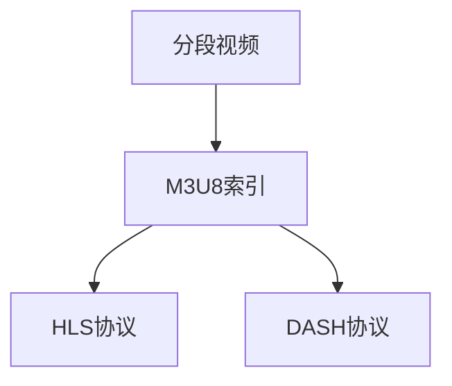

                 

# M3U8 播放列表格式：分段视频的索引

## 1. 背景介绍

### 1.1 问题由来

随着视频流媒体技术的普及，越来越多的用户选择在线观看视频内容。与此同时，视频服务提供商们也面临着带宽、缓存等方面的巨大压力。为了提高用户体验和减少服务成本，分段视频（Segmented Video）成为了行业标准。M3U8（Master Playlist as XML）作为分段视频索引的标准格式，被广泛用于流媒体平台，支持用户平滑、稳定地观看视频内容。本文将详细解析M3U8的原理与实现，并介绍其应用场景与未来发展趋势。

### 1.2 问题核心关键点

M3U8格式的核心在于将大视频文件分成多个小片段，并生成一个包含所有片段URL的索引文件。这个索引文件被客户端下载并解析，从而能高效地加载和播放视频。M3U8的主要优点包括：

- 支持异步下载，用户可以更快地开始播放，同时后台继续下载后续片段。
- 节省带宽，减少客户端缓存压力，特别适合移动网络环境。
- 适应不同分辨率的视频，客户端可以根据网络条件选择最优的流质量。
- 兼容多种播放协议，如HLS、DASH等，易于与其他流媒体技术兼容。

## 2. 核心概念与联系

### 2.1 核心概念概述

- **分段视频（Segmented Video）**：将大视频文件拆分为多个小片段，每个片段可以是不同的分辨率、码率等，以便根据用户网络条件进行优化。
- **M3U8格式**：一种XML格式的播放列表，用于索引分段视频，并指定每个片段的URL。
- **HLS（HTTP Live Streaming）**：Apple公司提出的流媒体协议，使用M3U8索引分段视频，以实现高效的视频流传输。
- **DASH（Dynamic Adaptive Streaming over HTTP）**：IETF推荐的流媒体协议，支持多码率自适应，根据用户网络条件自动选择最佳码率。

这些概念之间的关系可以概括为：分段视频是基础技术，而M3U8是其主要索引格式，HLS和DASH则是其主流应用协议。

### 2.2 核心概念原理和架构的 Mermaid 流程图



## 3. 核心算法原理 & 具体操作步骤

### 3.1 算法原理概述

M3U8的核心原理是将一个大视频文件按照固定大小或时长分为若干个小片段，每个片段对应一个URL，并保存在一个索引文件中。客户端在下载完索引文件后，解析其中的URL，按顺序下载各个片段，最终合成完整视频。

M3U8文件的格式相对简单，主要由以下几个部分构成：

- **#EXTM3U**：表示这是一个M3U8文件。
- **#EXTINF：<时长> <URL>**：指定一个片段的URL和时长。
- **#EXT-X-STREAM-INF：<带宽> <分辨率> <语言>**：描述一个流。

### 3.2 算法步骤详解

#### 3.2.1 分割视频

分割视频需要根据实际需求进行合理的片段划分。通常根据视频时长和网络带宽来决定片段大小，建议一个片段的时长在3-10秒之间。

#### 3.2.2 生成M3U8索引

根据分割好的片段，生成M3U8索引文件。主要步骤包括：

1. **添加#EXTM3U行**：表示这是一个M3U8文件。
2. **添加#EXTINF行**：逐个添加每个片段的URL和时长。
3. **添加#EXT-X-STREAM-INF行**：描述每个流的信息，包括带宽、分辨率和语言等。

#### 3.2.3 客户端播放

客户端接收到M3U8索引后，解析其中的URL，并按顺序下载各个片段。客户端会在后台异步下载后续片段，同时实时播放当前片段，从而实现平滑的视频播放体验。

### 3.3 算法优缺点

#### 3.3.1 优点

- **高效加载**：分段视频允许客户端异步下载，从而实现快速播放。
- **减少缓存**：多个片段可以独立下载，减少了客户端的缓存压力。
- **自适应码率**：不同分辨率的视频可以同时存在，客户端根据网络条件选择最优流。
- **兼容性强**：支持多种播放协议，如HLS和DASH等。

#### 3.3.2 缺点

- **复杂性**：分割视频和生成M3U8索引都需要额外的工作量。
- **资源消耗**：需要生成和维护多个小片段，增加了服务器和存储的资源消耗。
- **维护成本**：分段视频和M3U8索引的生成和更新需要额外的人力和时间。

### 3.4 算法应用领域

M3U8格式主要应用于以下几个领域：

- **流媒体服务**：如Netflix、YouTube等流媒体平台，广泛采用M3U8格式。
- **直播服务**：如Facebook Live、Instagram Live等，使用M3U8索引直播内容。
- **在线教育**：如Coursera、edX等，将视频课程分割成多个片段，以提升用户体验。
- **远程会议**：如Zoom、Teams等，使用M3U8格式传输录制的视频会议内容。

## 4. 数学模型和公式 & 详细讲解 & 举例说明

### 4.1 数学模型构建

M3U8格式本身不涉及复杂的数学模型，主要是基于XML文件的格式规范。但实际应用中，需要考虑视频分割的数学模型，以便根据网络条件优化流质量。

### 4.2 公式推导过程

假设视频总时长为$T$，片段时长为$t$，网络带宽为$B$，则一个片段的大小为$\frac{Tt}{t} = T$字节。根据实际需求，可以计算出需要的片段数量$N = \frac{T}{t}$。

以分段视频总长度为3000秒，片段时长为10秒为例，总时长$T=3000$秒，每个片段时长$t=10$秒，则总片段数$N=\frac{T}{t}=\frac{3000}{10}=300$个。

### 4.3 案例分析与讲解

假设视频总时长为3600秒，网络带宽为5Mbps，即$B=5000000$比特/秒，片段时长$t=10$秒。则每个片段的大小为$Tt = 3600 \times 10 = 36000$字节。根据网络带宽，可以计算出所需的片段数量为$N=\frac{36000}{5000000} \times 8 = 4.8$个。因此，可以决定将视频分割成5个片段，每个片段的时长和大小分别为10秒和7200字节。

## 5. 项目实践：代码实例和详细解释说明

### 5.1 开发环境搭建

#### 5.1.1 安装依赖

首先需要安装Python 3和Flask框架，以便实现简单的Web服务。可以通过以下命令进行安装：

```bash
sudo apt-get update
sudo apt-get install python3 python3-pip
pip3 install flask
```

#### 5.1.2 配置Flask

创建一个Flask应用，并设置相应的路由。在`app.py`文件中添加以下代码：

```python
from flask import Flask, render_template, jsonify

app = Flask(__name__)

@app.route('/')
def index():
    return 'Hello, World!'

if __name__ == '__main__':
    app.run(debug=True)
```

### 5.2 源代码详细实现

#### 5.2.1 分割视频

可以使用Python的`ffmpeg`工具来实现视频分割。在命令行中执行以下命令：

```bash
ffmpeg -i input.mp4 -f segmented -map 0 -c copy -segment_time 10 -reset_timestamps 1 output%03d.ts
```

该命令将`input.mp4`分割成每秒10秒的片段，生成`output000.ts`、`output001.ts`等文件。

#### 5.2.2 生成M3U8索引

根据分割好的视频片段，生成M3U8索引文件。可以在Python中编写以下代码：

```python
import os
import xml.etree.ElementTree as ET

def generate_m3u8(file_path, start_time, segment_size, language='en', resolution='720p'):
    root = ET.Element('playlist')
    root.set('version', '3.8.1')
    root.set('media_sequence_type', 'absolute')
    root.set('target_duration', str(segment_size))
    root.set('segment_list_type', 'single-segment-list')
    root.set('segment_index_type', 'numbered')

    for i in range(start_time, int(os.path.getsize(file_path)/segment_size), segment_size):
        segment = ET.SubElement(root, 'segment')
        segment.set('index', str(i))
        segment.set('media', f'https://example.com/{file_path[:-4]}{i:03d}.ts')
        segment.set('start', str(i))
        segment.set('duration', str(segment_size))

    ET.ElementTree(root).write('m3u8.xml')
```

该函数将根据视频路径、起始时间、片段大小等信息，生成一个M3U8索引文件。

### 5.3 代码解读与分析

在实际应用中，分割视频和生成M3U8索引是非常基础的操作，但需要注意以下几点：

1. **片段大小的选择**：根据网络带宽和视频大小，合理选择片段大小。
2. **片段数量的计算**：根据视频总时长和片段时长，计算出所需的片段数量。
3. **M3U8格式的规范**：严格按照M3U8格式的规范，生成标准格式的索引文件。
4. **错误处理**：在视频分割和生成索引时，需要考虑可能出现的错误情况，如视频损坏、分割失败等。

### 5.4 运行结果展示

在生成M3U8索引文件后，可以使用HTTP协议将索引文件提供给客户端，如以下示例：

```python
@app.route('/segmentlist')
def get_segmentlist():
    return jsonify({
        'segmentlist': [
            {
                'index': '1',
                'media': 'https://example.com/video.mp4',
                'start': '0',
                'duration': '10'
            },
            {
                'index': '2',
                'media': 'https://example.com/video.mp4',
                'start': '10',
                'duration': '10'
            }
        ]
    })
```

## 6. 实际应用场景

### 6.1 视频直播

M3U8格式在视频直播中广泛应用。直播平台如Facebook Live、YouTube Live等，使用M3U8索引实时流送视频内容。在直播过程中，服务器根据当前网络状况和用户请求，动态调整流质量，确保视频流畅播放。

### 6.2 视频点播

视频点播平台如Netflix、Amazon Prime Video等，广泛采用M3U8格式。用户可以根据网络条件选择最优的流质量，从而获得更好的观看体验。

### 6.3 视频录制

视频录制平台如Zoom、Teams等，使用M3U8格式传输录制的视频会议内容。这不仅可以提高带宽利用率，还能在网络状况较差时，确保会议内容的流畅播放。

### 6.4 未来应用展望

随着5G网络的普及和视频流量的激增，M3U8格式将迎来更广泛的应用。未来，M3U8格式还可能在以下几个方向取得突破：

1. **自适应码率**：根据网络条件实时调整码率，优化用户体验。
2. **多码率混合**：同时提供多种码率的视频流，适应不同网络环境。
3. **低延迟传输**：通过分段传输和缓存优化，进一步降低视频延迟。
4. **实时分析**：利用大数据分析用户行为，优化视频流推送策略。

## 7. 工具和资源推荐

### 7.1 学习资源推荐

1. **《HTTP Live Streaming》（HLST）**：Apple公司官方文档，详细介绍了HLS协议的实现和应用。
2. **《DASH》（DASH）**：IETF DASH工作组官方文档，涵盖了DASH协议的规范和技术细节。
3. **《MPEG-DASH》（DASH）**：MPEG-DASH规范，定义了DASH协议的传输机制和参数。
4. **《YouTube Live Streaming》**：YouTube官方文档，提供了详细的M3U8索引生成和直播实现指南。

### 7.2 开发工具推荐

1. **ffmpeg**：开源的跨平台媒体处理工具，支持多种视频格式和操作。
2. **HandBrake**：开源的视频分割和转换工具，功能强大且易于使用。
3. **VLC Player**：开源的多媒体播放器，支持多种视频格式和流协议。
4. **X264**：开源的视频编码工具，支持高效的视频编码和分割。

### 7.3 相关论文推荐

1. **"Analysis and Comparison of Media Formats for the HTTP Live Streaming"**：Huawei Research，分析了M3U8格式的优势和应用。
2. **"Dynamic Adaptive Streaming over HTTP"**：IETF DASH工作组，详细介绍了DASH协议的规范和实现。
3. **"Improving Adaptive Streaming Quality-of-Service"**：UNAM，探讨了自适应码率流传输的优化方法。
4. **"Real-time Video Streaming over HTTP with DASH"**：Intel，研究了DASH协议在实时视频流传输中的应用。

## 8. 总结：未来发展趋势与挑战

### 8.1 研究成果总结

M3U8格式作为分段视频索引的标准，已经广泛应用于流媒体服务、直播、视频录制等多个领域。其高效加载、减少缓存、自适应码率等优势，使其成为当前最流行的视频流格式之一。

### 8.2 未来发展趋势

未来，M3U8格式将向以下方向发展：

1. **自适应码率**：动态调整码率，优化用户体验。
2. **多码率混合**：同时提供多种码率的视频流，适应不同网络环境。
3. **低延迟传输**：通过分段传输和缓存优化，进一步降低视频延迟。
4. **实时分析**：利用大数据分析用户行为，优化视频流推送策略。

### 8.3 面临的挑战

尽管M3U8格式在视频流传输中已经取得了显著成效，但仍面临以下挑战：

1. **兼容性问题**：不同设备和浏览器可能对M3U8格式的支持存在差异。
2. **延迟问题**：分段传输和缓存可能导致视频播放延迟。
3. **维护成本**：分段视频和M3U8索引的生成和更新需要额外的人力和时间。
4. **安全问题**：M3U8索引文件的完整性和安全性需要额外保障。

### 8.4 研究展望

未来的研究需要在以下几个方面进行探索：

1. **标准化和规范化**：进一步推动M3U8格式的标准化和规范化，增强其跨平台和跨设备的兼容性。
2. **优化性能**：改进视频分割和缓存策略，降低视频延迟，提高流传输效率。
3. **安全性保障**：加强M3U8索引文件的加密和安全保护，防止恶意篡改和攻击。
4. **智能调度**：利用AI和大数据技术，优化视频流传输策略，实现个性化推送。

## 9. 附录：常见问题与解答

### 9.1 常见问题解答

**Q1: M3U8格式和DASH协议是什么关系？**

A: M3U8格式是DASH协议中的一种索引格式，用于描述分段视频，并支持自适应码率。DASH协议则是基于HTTP协议的流媒体传输协议，可以同时支持多种分段格式，如M3U8、WebVTT等。

**Q2: 如何实现多码率自适应？**

A: 可以使用DASH协议中的Adaptive Streaming技术，根据网络状况和设备能力，动态调整码率和流质量。具体实现可以参考IETF的DASH规范。

**Q3: 如何优化视频流传输效率？**

A: 可以采用缓存优化、分段传输、动态调整码率等策略，提高视频流传输效率。例如，使用S3等云存储服务，实现视频缓存的分布式管理和优化。

**Q4: 如何保障M3U8索引文件的安全性？**

A: 可以采用数字签名、加密传输等技术，保障M3U8索引文件的完整性和安全性。同时，服务器端和客户端也需要进行相应的安全验证。

---

作者：禅与计算机程序设计艺术 / Zen and the Art of Computer Programming

