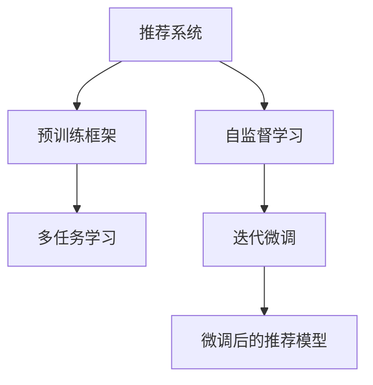

                 

# P5:统一的推荐系统预训练框架

在现代互联网中，推荐系统是提高用户体验、提升业务价值的关键技术之一。通过分析用户的历史行为数据，推荐系统可以预测用户可能感兴趣的物品，并将结果呈现给用户，从而增强用户粘性，提升交易转化率。然而，现有的推荐系统往往依赖于庞大的标注数据，模型训练成本高，且难以兼顾个性化与泛化性能。为了突破这一瓶颈，预训练框架的提出无疑为推荐系统提供了全新的思路。本文将系统地介绍统一的推荐系统预训练框架的设计原理、实现方法及其应用前景，希望能为推荐系统领域的研究者提供参考。

## 1. 背景介绍

### 1.1 问题由来

推荐系统的核心目标是根据用户的历史行为数据，预测并推荐用户可能感兴趣的物品。当前主流推荐系统的构建范式依赖于基于用户-物品交互历史的大规模标注数据。这些数据通常包括用户点击、浏览、购买等行为。然而，在大规模数据集上从头训练推荐模型，不仅需要大量标注数据，还需要高昂的计算资源和时间成本。此外，大规模训练还会带来过拟合等问题，模型泛化能力不足，难以应对实际应用中物品分布的变化。

为了解决上述问题，预训练框架应运而生。预训练框架通过在大量无标注数据上预训练一个通用的推荐模型，然后根据用户的行为数据对模型进行微调，使得模型能够更好地适应用户的个性化需求。相比从头训练，预训练框架可以在较低的数据标注成本和计算资源下，快速构建高性能的推荐系统。

### 1.2 问题核心关键点

预训练框架的核心在于如何构建一个通用的推荐模型，使其能够在无标注数据上预训练出泛化的推荐能力。具体的关键点包括：

- **无监督预训练**：如何利用无标注数据构建推荐模型的通用表征。
- **参数共享与任务无关**：如何在预训练过程中，共享模型参数，使得预训练模型能够更好地适应用户行为数据的微调。
- **多任务学习**：如何在预训练过程中同时学习多个推荐任务，提高模型泛化能力。
- **自监督学习**：如何利用自监督学习任务，如负采样等，增强模型在无标注数据上的预训练效果。
- **迭代微调**：如何设计微调过程，使得模型能够随着新数据的加入，逐步提升性能。

## 2. 核心概念与联系

### 2.1 核心概念概述

为更好地理解统一的推荐系统预训练框架，本节将介绍几个关键概念：

- **推荐系统**：利用用户历史行为数据预测并推荐用户感兴趣物品的系统。
- **预训练框架**：在大量无标注数据上预训练一个通用的推荐模型，然后在有标注数据上进行微调，提升模型性能的框架。
- **自监督学习**：利用未标注数据训练模型的过程。
- **多任务学习**：在训练过程中同时学习多个推荐任务，提高模型泛化能力的方法。
- **迭代微调**：在已有预训练模型的基础上，通过少量标注数据进行微调，提升模型性能的过程。

这些核心概念之间的逻辑关系可以通过以下Mermaid流程图来展示：



这个流程图展示了推荐系统的核心概念及其之间的关系：

1. 推荐系统通过预训练框架在无标注数据上进行预训练，构建通用的推荐模型。
2. 预训练过程利用自监督学习任务，增强模型在无标注数据上的学习效果。
3. 预训练模型在多任务学习框架下，同时学习多个推荐任务，提升泛化能力。
4. 预训练模型在获取少量标注数据后，通过迭代微调过程，逐步提升性能。

## 3. 核心算法原理 & 具体操作步骤
### 3.1 算法原理概述

统一的推荐系统预训练框架通过在大量无标注数据上预训练一个通用的推荐模型，然后根据用户的行为数据对模型进行微调。其核心思想是：将推荐系统看作一个优化问题，即在用户历史行为数据上最大化推荐效果。预训练框架通过在大规模无标注数据上预训练模型，学习到全局性的推荐模式，然后通过微调过程，使得模型能够更好地适应用户的个性化需求。

具体的，预训练框架的构建分为两个阶段：

1. **无监督预训练阶段**：在大量无标注数据上预训练模型，学习通用的推荐模式。
2. **微调阶段**：在少量标注数据上对预训练模型进行微调，使得模型能够适应用户的个性化需求。

### 3.2 算法步骤详解

预训练框架的构建步骤如下：

**Step 1: 准备数据集**
- 准备大规模无标注数据集，作为预训练数据。数据集应尽量覆盖各种不同的物品和用户行为模式，以确保预训练模型的泛化能力。
- 准备少量标注数据集，作为微调数据。数据集应包含用户行为与物品的匹配情况，用于指导微调过程。

**Step 2: 设计预训练模型**
- 选择或设计一个通用的推荐模型作为预训练的基础模型。常用的模型包括矩阵分解、基于神经网络的结构化模型等。
- 设计自监督学习任务，利用无标注数据训练模型。常见的自监督任务包括负采样、三元组预测等。
- 引入多任务学习框架，同时学习多个推荐任务。如推荐相似物品、推荐热门物品等。

**Step 3: 执行预训练**
- 在大规模无标注数据集上，执行预训练过程。根据设计的自监督学习任务，更新模型参数。
- 通过多任务学习框架，同时更新多个推荐任务的目标函数，提高模型的泛化能力。
- 使用迭代优化算法，如SGD、Adam等，更新模型参数。

**Step 4: 设计微调模型**
- 根据具体推荐任务，设计任务的适配层。如对于物品推荐任务，可以设计一个线性分类器作为输出层。
- 选择合适的损失函数，如交叉熵损失、均方误差损失等。
- 设置微调的超参数，如学习率、批大小等。

**Step 5: 执行微调**
- 在少量标注数据集上，对预训练模型进行微调。使用优化算法，如AdamW、SGD等，更新模型参数。
- 周期性在验证集上评估模型性能，根据性能指标决定是否触发Early Stopping。
- 重复上述步骤，直至满足预设的迭代轮数或Early Stopping条件。

### 3.3 算法优缺点

统一的推荐系统预训练框架具有以下优点：
1. 预训练过程可以利用大规模无标注数据，降低标注数据的需求。
2. 预训练模型通过多任务学习，能够同时学习多个推荐任务，提高泛化能力。
3. 微调过程可以根据少量标注数据，快速构建高性能推荐模型。
4. 微调过程仅更新模型的一小部分参数，提高微调效率，避免过拟合。

同时，该框架也存在一些局限性：
1. 预训练模型的泛化能力依赖于预训练数据的覆盖程度和多样性。
2. 预训练模型可能存在一定的过拟合风险，需要选择合适的超参数和正则化方法。
3. 微调过程中，标注数据不足时，模型性能可能受限。
4. 微调模型的泛化能力需要随着新数据的加入逐步提升。

尽管存在这些局限性，但预训练框架无疑为推荐系统提供了一种高效、灵活的构建范式，值得进一步研究和发展。

### 3.4 算法应用领域

统一的推荐系统预训练框架已经在推荐系统领域得到广泛应用，涵盖了各种推荐任务，例如：

- 物品推荐：为用户推荐感兴趣的物品。
- 相似物品推荐：推荐与已感兴趣物品相似的物品。
- 热门物品推荐：推荐当前热门的新物品。
- 多物品推荐：推荐多种物品，如搭配推荐。
- 实时推荐：根据用户的实时行为，实时生成推荐结果。

除了上述这些经典任务外，预训练框架还被创新性地应用到更多场景中，如跨领域推荐、冷启动推荐等，为推荐系统带来新的突破。随着预训练模型和微调方法的不断进步，相信预训练框架将在更广泛的推荐领域发挥作用，推动推荐系统技术的产业化进程。

## 4. 数学模型和公式 & 详细讲解 & 举例说明

### 4.1 数学模型构建

本节将使用数学语言对统一的推荐系统预训练框架的构建过程进行更加严格的刻画。

记推荐模型为 $M_{\theta}:\mathcal{X} \rightarrow \mathcal{Y}$，其中 $\mathcal{X}$ 为输入空间，$\mathcal{Y}$ 为输出空间，$\theta \in \mathbb{R}^d$ 为模型参数。假设推荐系统有三个任务，分别是物品推荐、相似物品推荐和热门物品推荐，对应的标签空间分别为 $\mathcal{Y}_1, \mathcal{Y}_2, \mathcal{Y}_3$。

定义推荐模型在数据样本 $(x,y)$ 上的损失函数为 $\ell(M_{\theta}(x),y)$，则在数据集 $D$ 上的经验风险为：

$$
\mathcal{L}(\theta) = \frac{1}{N}\sum_{i=1}^N \left(\ell_1(M_{\theta}(x_i),y_{i,1}) + \ell_2(M_{\theta}(x_i),y_{i,2}) + \ell_3(M_{\theta}(x_i),y_{i,3})\right)
$$

其中 $\ell_j$ 为第 $j$ 个任务的损失函数。

预训练模型的目标是最小化经验风险，即找到最优参数：

$$
\theta^* = \mathop{\arg\min}_{\theta} \mathcal{L}(\theta)
$$

在实践中，我们通常使用基于梯度的优化算法（如SGD、Adam等）来近似求解上述最优化问题。设 $\eta$ 为学习率，$\lambda$ 为正则化系数，则参数的更新公式为：

$$
\theta \leftarrow \theta - \eta \nabla_{\theta}\mathcal{L}(\theta) - \eta\lambda\theta
$$

其中 $\nabla_{\theta}\mathcal{L}(\theta)$ 为损失函数对参数 $\theta$ 的梯度，可通过反向传播算法高效计算。

### 4.2 公式推导过程

以下我们以物品推荐任务为例，推导交叉熵损失函数及其梯度的计算公式。

假设推荐模型 $M_{\theta}$ 在输入 $x$ 上的输出为 $\hat{y}=M_{\theta}(x) \in [0,1]$，表示物品 $x$ 被用户 $x$ 点击的概率。真实标签 $y \in \{0,1\}$。则二分类交叉熵损失函数定义为：

$$
\ell(M_{\theta}(x),y) = -[y\log \hat{y} + (1-y)\log (1-\hat{y})]
$$

将其代入经验风险公式，得：

$$
\mathcal{L}(\theta) = -\frac{1}{N}\sum_{i=1}^N [y_i\log M_{\theta}(x_i)+(1-y_i)\log(1-M_{\theta}(x_i))]
$$

根据链式法则，损失函数对参数 $\theta_k$ 的梯度为：

$$
\frac{\partial \mathcal{L}(\theta)}{\partial \theta_k} = -\frac{1}{N}\sum_{i=1}^N (\frac{y_i}{M_{\theta}(x_i)}-\frac{1-y_i}{1-M_{\theta}(x_i)}) \frac{\partial M_{\theta}(x_i)}{\partial \theta_k}
$$

其中 $\frac{\partial M_{\theta}(x_i)}{\partial \theta_k}$ 可进一步递归展开，利用自动微分技术完成计算。

在得到损失函数的梯度后，即可带入参数更新公式，完成模型的迭代优化。重复上述过程直至收敛，最终得到适应下游任务的最优模型参数 $\theta^*$。

### 4.3 案例分析与讲解

假设我们有一个推荐系统，需要为用户推荐热门的电影。在预训练过程中，我们可以利用无标注数据集中的电影名称和用户评分，设计负采样任务，训练一个矩阵分解的预训练模型 $M_{\theta}$。微调过程中，我们使用标注数据集中的用户评分和电影名称，对预训练模型进行微调，优化推荐效果。

具体实现步骤如下：

1. **准备数据集**：准备一个电影评分数据集，其中包含用户对电影的评分。将评分映射为0-1之间的概率，作为模型的输出。
2. **设计预训练模型**：设计一个矩阵分解模型，作为预训练的基础模型。该模型可以学习到电影的隐向量表示。
3. **执行预训练**：在无标注电影数据集上执行预训练过程，优化矩阵分解模型的参数。
4. **设计微调模型**：在标注电影数据集上，设计一个线性分类器作为输出层，并使用交叉熵损失函数。
5. **执行微调**：在标注电影数据集上，对预训练模型进行微调，优化推荐效果。

## 5. 项目实践：代码实例和详细解释说明

### 5.1 开发环境搭建

在进行预训练框架实践前，我们需要准备好开发环境。以下是使用Python进行PyTorch开发的环境配置流程：

1. 安装Anaconda：从官网下载并安装Anaconda，用于创建独立的Python环境。

2. 创建并激活虚拟环境：
```bash
conda create -n pretrain-env python=3.8 
conda activate pretrain-env
```

3. 安装PyTorch：根据CUDA版本，从官网获取对应的安装命令。例如：
```bash
conda install pytorch torchvision torchaudio cudatoolkit=11.1 -c pytorch -c conda-forge
```

4. 安装Transformers库：
```bash
pip install transformers
```

5. 安装各类工具包：
```bash
pip install numpy pandas scikit-learn matplotlib tqdm jupyter notebook ipython
```

完成上述步骤后，即可在`pretrain-env`环境中开始预训练框架的实践。

### 5.2 源代码详细实现

下面我们以物品推荐任务为例，给出使用Transformers库对预训练模型进行微调的PyTorch代码实现。

首先，定义物品推荐任务的数据处理函数：

```python
from transformers import BertTokenizer
from torch.utils.data import Dataset
import torch

class MovieDataset(Dataset):
    def __init__(self, texts, scores, tokenizer, max_len=128):
        self.texts = texts
        self.scores = scores
        self.tokenizer = tokenizer
        self.max_len = max_len
        
    def __len__(self):
        return len(self.texts)
    
    def __getitem__(self, item):
        text = self.texts[item]
        score = self.scores[item]
        
        encoding = self.tokenizer(text, return_tensors='pt', max_length=self.max_len, padding='max_length', truncation=True)
        input_ids = encoding['input_ids'][0]
        attention_mask = encoding['attention_mask'][0]
        
        # 对评分进行编码
        encoded_scores = [score] 
        encoded_scores.extend([0.] * (self.max_len - len(encoded_scores)))
        labels = torch.tensor(encoded_scores, dtype=torch.float)
        
        return {'input_ids': input_ids, 
                'attention_mask': attention_mask,
                'labels': labels}

# 评分与标签的映射
label2id = {0: 0, 1: 1}
id2label = {v: k for k, v in label2id.items()}

# 创建dataset
tokenizer = BertTokenizer.from_pretrained('bert-base-cased')

train_dataset = MovieDataset(train_texts, train_scores, tokenizer)
dev_dataset = MovieDataset(dev_texts, dev_scores, tokenizer)
test_dataset = MovieDataset(test_texts, test_scores, tokenizer)
```

然后，定义模型和优化器：

```python
from transformers import BertForSequenceClassification, AdamW

model = BertForSequenceClassification.from_pretrained('bert-base-cased', num_labels=len(label2id))

optimizer = AdamW(model.parameters(), lr=2e-5)
```

接着，定义训练和评估函数：

```python
from torch.utils.data import DataLoader
from tqdm import tqdm
from sklearn.metrics import roc_auc_score

device = torch.device('cuda') if torch.cuda.is_available() else torch.device('cpu')
model.to(device)

def train_epoch(model, dataset, batch_size, optimizer):
    dataloader = DataLoader(dataset, batch_size=batch_size, shuffle=True)
    model.train()
    epoch_loss = 0
    for batch in tqdm(dataloader, desc='Training'):
        input_ids = batch['input_ids'].to(device)
        attention_mask = batch['attention_mask'].to(device)
        labels = batch['labels'].to(device)
        model.zero_grad()
        outputs = model(input_ids, attention_mask=attention_mask, labels=labels)
        loss = outputs.loss
        epoch_loss += loss.item()
        loss.backward()
        optimizer.step()
    return epoch_loss / len(dataloader)

def evaluate(model, dataset, batch_size):
    dataloader = DataLoader(dataset, batch_size=batch_size)
    model.eval()
    preds, labels = [], []
    with torch.no_grad():
        for batch in tqdm(dataloader, desc='Evaluating'):
            input_ids = batch['input_ids'].to(device)
            attention_mask = batch['attention_mask'].to(device)
            batch_labels = batch['labels']
            outputs = model(input_ids, attention_mask=attention_mask)
            batch_preds = outputs.logits.argmax(dim=2).to('cpu').tolist()
            batch_labels = batch_labels.to('cpu').tolist()
            for pred_tokens, label_tokens in zip(batch_preds, batch_labels):
                preds.append(pred_tokens[:len(label_tokens)])
                labels.append(label_tokens)
                
    return roc_auc_score(labels, preds)
```

最后，启动训练流程并在测试集上评估：

```python
epochs = 5
batch_size = 16

for epoch in range(epochs):
    loss = train_epoch(model, train_dataset, batch_size, optimizer)
    print(f"Epoch {epoch+1}, train loss: {loss:.3f}")
    
    print(f"Epoch {epoch+1}, dev results:")
    roc_auc = evaluate(model, dev_dataset, batch_size)
    print(f"ROC-AUC: {roc_auc:.3f}")
    
print("Test results:")
roc_auc = evaluate(model, test_dataset, batch_size)
print(f"ROC-AUC: {roc_auc:.3f}")
```

以上就是使用PyTorch对预训练模型进行物品推荐任务微调的完整代码实现。可以看到，得益于Transformers库的强大封装，我们可以用相对简洁的代码完成预训练模型的加载和微调。

### 5.3 代码解读与分析

让我们再详细解读一下关键代码的实现细节：

**MovieDataset类**：
- `__init__`方法：初始化文本、评分、分词器等关键组件。
- `__len__`方法：返回数据集的样本数量。
- `__getitem__`方法：对单个样本进行处理，将文本输入编码为token ids，将评分编码为数字，并对其进行定长padding，最终返回模型所需的输入。

**label2id和id2label字典**：
- 定义了评分与数字标签之间的映射关系，用于将评分预测结果解码回真实的评分。

**训练和评估函数**：
- 使用PyTorch的DataLoader对数据集进行批次化加载，供模型训练和推理使用。
- 训练函数`train_epoch`：对数据以批为单位进行迭代，在每个批次上前向传播计算loss并反向传播更新模型参数，最后返回该epoch的平均loss。
- 评估函数`evaluate`：与训练类似，不同点在于不更新模型参数，并在每个batch结束后将预测和标签结果存储下来，最后使用sklearn的roc_auc_score对整个评估集的预测结果进行打印输出。

**训练流程**：
- 定义总的epoch数和batch size，开始循环迭代
- 每个epoch内，先在训练集上训练，输出平均loss
- 在验证集上评估，输出ROC-AUC
- 所有epoch结束后，在测试集上评估，给出最终测试结果

可以看到，PyTorch配合Transformers库使得预训练模型的微调代码实现变得简洁高效。开发者可以将更多精力放在数据处理、模型改进等高层逻辑上，而不必过多关注底层的实现细节。

当然，工业级的系统实现还需考虑更多因素，如模型的保存和部署、超参数的自动搜索、更灵活的任务适配层等。但核心的微调范式基本与此类似。

## 6. 实际应用场景
### 6.1 智能推荐系统

预训练框架在智能推荐系统中得到了广泛应用，特别是在个性化推荐、跨领域推荐等场景中，表现出了显著的优势。

1. **个性化推荐**：根据用户的历史行为数据，推荐用户可能感兴趣的物品。预训练框架可以利用无标注数据预训练一个通用的推荐模型，然后通过微调过程，使得模型能够更好地适应用户的个性化需求。

2. **跨领域推荐**：不同领域的物品可能具有不同的推荐模式。预训练框架可以通过多任务学习，同时学习多个领域的推荐任务，提高模型的泛化能力。

3. **冷启动推荐**：新物品可能没有足够的历史数据进行训练。预训练框架可以利用无标注数据预训练一个通用的推荐模型，然后通过微调过程，逐步提升对新物品的推荐效果。

4. **实时推荐**：根据用户的实时行为，实时生成推荐结果。预训练框架可以利用无标注数据预训练一个通用的推荐模型，然后通过微调过程，逐步提升对新数据的适应能力。

### 6.2 未来应用展望

随着预训练框架的不断发展，其在推荐系统领域的应用前景将更加广阔。未来，预训练框架将在更多推荐场景中得到应用，为推荐系统带来新的突破。

1. **多模态推荐**：将视觉、语音等多模态数据与文本数据进行融合，提高推荐系统的泛化能力。
2. **跨平台推荐**：在不同平台间进行推荐系统协同，提升推荐效果。
3. **分布式推荐**：利用分布式计算资源，提高推荐系统的扩展性和性能。
4. **基于内容的推荐**：将物品的描述、属性等信息与推荐过程进行融合，提高推荐的精准度。
5. **用户行为预测**：预测用户未来的行为，提前推荐相关物品，提高用户满意度。

这些技术的发展，将进一步提升推荐系统的智能化水平，为推荐系统带来更广阔的应用前景。

## 7. 工具和资源推荐
### 7.1 学习资源推荐

为了帮助开发者系统掌握预训练框架的理论基础和实践技巧，这里推荐一些优质的学习资源：

1. 《深度学习入门》系列书籍：介绍深度学习的基本原理和经典算法，适合初学者入门。

2. 《自然语言处理综论》课程：斯坦福大学开设的NLP明星课程，涵盖NLP的前沿技术和应用案例。

3. 《推荐系统实战》书籍：介绍推荐系统的构建原理和工程实践，包含大量的案例分析。

4. CS344《推荐系统》课程：清华大学开设的推荐系统课程，提供系统全面的学习资料。

5. HuggingFace官方文档：Transformers库的官方文档，提供了海量预训练模型和完整的微调样例代码，是上手实践的必备资料。

通过对这些资源的学习实践，相信你一定能够快速掌握预训练框架的精髓，并用于解决实际的推荐问题。
###  7.2 开发工具推荐

高效的开发离不开优秀的工具支持。以下是几款用于预训练框架开发的常用工具：

1. PyTorch：基于Python的开源深度学习框架，灵活动态的计算图，适合快速迭代研究。大部分预训练语言模型都有PyTorch版本的实现。

2. TensorFlow：由Google主导开发的开源深度学习框架，生产部署方便，适合大规模工程应用。同样有丰富的预训练语言模型资源。

3. Transformers库：HuggingFace开发的NLP工具库，集成了众多SOTA语言模型，支持PyTorch和TensorFlow，是进行预训练框架开发的利器。

4. Weights & Biases：模型训练的实验跟踪工具，可以记录和可视化模型训练过程中的各项指标，方便对比和调优。与主流深度学习框架无缝集成。

5. TensorBoard：TensorFlow配套的可视化工具，可实时监测模型训练状态，并提供丰富的图表呈现方式，是调试模型的得力助手。

6. Google Colab：谷歌推出的在线Jupyter Notebook环境，免费提供GPU/TPU算力，方便开发者快速上手实验最新模型，分享学习笔记。

合理利用这些工具，可以显著提升预训练框架的开发效率，加快创新迭代的步伐。

### 7.3 相关论文推荐

预训练框架的提出源于学界的持续研究。以下是几篇奠基性的相关论文，推荐阅读：

1. Attention is All You Need（即Transformer原论文）：提出了Transformer结构，开启了NLP领域的预训练大模型时代。

2. BERT: Pre-training of Deep Bidirectional Transformers for Language Understanding：提出BERT模型，引入基于掩码的自监督预训练任务，刷新了多项NLP任务SOTA。

3. Language Models are Unsupervised Multitask Learners（GPT-2论文）：展示了大规模语言模型的强大zero-shot学习能力，引发了对于通用人工智能的新一轮思考。

4. Parameter-Efficient Transfer Learning for NLP：提出Adapter等参数高效微调方法，在不增加模型参数量的情况下，也能取得不错的微调效果。

5. Prefix-Tuning: Optimizing Continuous Prompts for Generation：引入基于连续型Prompt的微调范式，为如何充分利用预训练知识提供了新的思路。

6. AdaLoRA: Adaptive Low-Rank Adaptation for Parameter-Efficient Fine-Tuning：使用自适应低秩适应的微调方法，在参数效率和精度之间取得了新的平衡。

这些论文代表了大语言模型预训练框架的发展脉络。通过学习这些前沿成果，可以帮助研究者把握学科前进方向，激发更多的创新灵感。

## 8. 总结：未来发展趋势与挑战

### 8.1 总结

本文对统一的推荐系统预训练框架的设计原理、实现方法及其应用前景进行了全面系统的介绍。首先阐述了预训练框架在推荐系统中的重要作用，明确了预训练框架在降低标注数据需求、提升泛化能力、加速模型训练等方面的独特价值。其次，从原理到实践，详细讲解了预训练框架的构建步骤，包括数据准备、预训练模型设计、自监督学习任务、多任务学习框架和迭代微调过程。同时，本文还广泛探讨了预训练框架在智能推荐、跨领域推荐等诸多推荐场景中的应用前景，展示了预训练框架的强大潜力。最后，本文精选了预训练框架的相关学习资源，力求为开发者提供全方位的技术指引。

通过本文的系统梳理，可以看到，预训练框架为推荐系统提供了一种高效、灵活的构建范式，能够显著降低标注数据需求，提高模型泛化能力，加速推荐系统的构建和优化。未来，预训练框架必将在更多推荐领域得到应用，推动推荐系统技术的产业化进程。

### 8.2 未来发展趋势

展望未来，预训练框架将在推荐系统领域呈现以下几个发展趋势：

1. **预训练模型的多样性**：随着模型架构的不断创新，预训练框架将涵盖更多类型的推荐模型，如基于神经网络的结构化模型、基于自编码器的推荐模型等。

2. **多模态推荐**：将视觉、语音等多模态数据与文本数据进行融合，提高推荐系统的泛化能力。

3. **跨平台推荐**：在不同平台间进行推荐系统协同，提升推荐效果。

4. **分布式推荐**：利用分布式计算资源，提高推荐系统的扩展性和性能。

5. **基于内容的推荐**：将物品的描述、属性等信息与推荐过程进行融合，提高推荐的精准度。

6. **用户行为预测**：预测用户未来的行为，提前推荐相关物品，提高用户满意度。

以上趋势凸显了预训练框架的广阔前景。这些方向的探索发展，必将进一步提升推荐系统的智能化水平，为推荐系统带来新的突破。

### 8.3 面临的挑战

尽管预训练框架已经取得了瞩目成就，但在迈向更加智能化、普适化应用的过程中，它仍面临着诸多挑战：

1. **预训练数据的获取和处理**：预训练框架需要大量无标注数据进行训练，但这些数据的获取和处理需要大量的成本和资源。如何高效获取和处理无标注数据，将是一大难题。

2. **模型的可解释性**：预训练模型往往被视为"黑盒"系统，难以解释其内部工作机制和决策逻辑。如何赋予预训练模型更强的可解释性，将是亟待攻克的难题。

3. **模型的鲁棒性**：预训练模型可能存在一定的过拟合风险，需要选择合适的超参数和正则化方法。如何在无标注数据上构建鲁棒性强的预训练模型，将是一大挑战。

4. **模型的泛化能力**：预训练模型的泛化能力依赖于预训练数据的覆盖程度和多样性。如何利用更广泛的数据进行预训练，提高模型的泛化能力，将是一个重要课题。

5. **模型的部署效率**：预训练模型往往具有较大的计算复杂度，如何在保证性能的同时，提升模型的部署效率，优化资源占用，将是重要的优化方向。

6. **模型的可扩展性**：预训练框架需要在大规模数据集上进行训练，如何设计高效的数据加载和管理机制，提升系统的可扩展性，将是未来的研究方向。

尽管存在这些挑战，但预训练框架无疑为推荐系统提供了一种高效、灵活的构建范式，值得进一步研究和发展。相信随着学界和产业界的共同努力，这些挑战终将一一被克服，预训练框架必将在推荐系统领域发挥更大的作用。

### 8.4 研究展望

面对预训练框架所面临的种种挑战，未来的研究需要在以下几个方面寻求新的突破：

1. **高效数据获取和处理**：研究如何高效获取和处理大规模无标注数据，减少预训练框架的预处理成本。

2. **模型可解释性**：研究如何赋予预训练模型更强的可解释性，使其能够更好地解释内部工作机制和决策逻辑。

3. **鲁棒性预训练**：研究如何在无标注数据上构建鲁棒性强的预训练模型，提高模型的泛化能力。

4. **模型部署效率**：研究如何优化预训练模型的计算图，提升模型的部署效率，优化资源占用。

5. **分布式预训练**：研究如何利用分布式计算资源，提高预训练框架的可扩展性，提升系统的性能和稳定性。

这些研究方向将进一步推动预训练框架的发展，使其在推荐系统领域发挥更大的作用，提升推荐系统的智能化水平，为推荐系统带来新的突破。总之，预训练框架作为一种高效、灵活的构建范式，将在未来的推荐系统领域发挥更加重要的作用，推动推荐系统技术的产业化进程。

## 9. 附录：常见问题与解答

**Q1：预训练框架是否适用于所有推荐任务？**

A: 预训练框架在大多数推荐任务上都能取得不错的效果，特别是对于数据量较小的任务。但对于一些特定领域的任务，如医学、法律等，仅仅依靠通用语料预训练的模型可能难以很好地适应。此时需要在特定领域语料上进一步预训练，再进行微调，才能获得理想效果。此外，对于一些需要时效性、个性化很强的任务，如对话推荐等，预训练框架也需要针对性的改进优化。

**Q2：预训练框架的超参数如何调整？**

A: 预训练框架的超参数设置主要包括学习率、批大小、优化器等。通常建议从较小的学习率开始，逐步增大，直至模型收敛。批大小的设置需要根据硬件资源和数据量进行调整，一般建议在1024-4096之间。优化器一般选择AdamW或SGD，根据实际情况进行调整。

**Q3：预训练框架的泛化能力如何保证？**

A: 预训练框架的泛化能力依赖于预训练数据的覆盖程度和多样性。可以通过收集更多类型和领域的无标注数据，增强预训练模型的泛化能力。同时，通过多任务学习框架，让预训练模型同时学习多个推荐任务，提高泛化能力。

**Q4：预训练框架在实际部署中需要注意哪些问题？**

A: 将预训练框架转化为实际应用，还需要考虑以下因素：
1. 模型裁剪：去除不必要的层和参数，减小模型尺寸，加快推理速度。
2. 量化加速：将浮点模型转为定点模型，压缩存储空间，提高计算效率。
3. 服务化封装：将模型封装为标准化服务接口，便于集成调用。
4. 弹性伸缩：根据请求流量动态调整资源配置，平衡服务质量和成本。
5. 监控告警：实时采集系统指标，设置异常告警阈值，确保服务稳定性。
6. 安全防护：采用访问鉴权、数据脱敏等措施，保障数据和模型安全。

预训练框架需要开发者根据具体任务，不断迭代和优化模型、数据和算法，方能得到理想的效果。

---

作者：禅与计算机程序设计艺术 / Zen and the Art of Computer Programming

