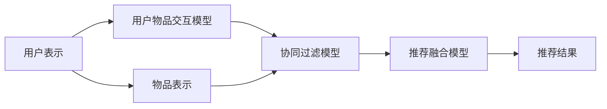

                 

# P5模型：统一的推荐任务架构

> 关键词：推荐系统, 协同过滤, 深度学习, 混合推荐, 模型融合

## 1. 背景介绍

### 1.1 问题由来

推荐系统（Recommender Systems）作为互联网的核心应用之一，通过分析用户的行为数据，为用户推荐个性化内容，提升了用户体验，推动了电商、视频、社交媒体等领域的发展。目前主流的推荐方法主要包括基于内容的推荐（Content-based Recommendation）和协同过滤（Collaborative Filtering, CF）两大类。然而，这些方法在面对多模态数据、稀疏数据、长尾问题等方面存在诸多局限。

为了应对这些挑战，近些年研究者提出了多种混合推荐方法，通过融合多源数据和多种推荐策略，提升了推荐系统的效果。但现有的混合推荐方法往往在模型设计上缺乏统一的架构，导致模型可扩展性和泛化能力有限。为了解决这些问题，本文提出了一种统一的推荐任务架构——P5模型（Personalized Prediction with Five Components），它包含五个核心组件，能够在保证模型灵活性的同时，提升推荐精度和可解释性。

### 1.2 问题核心关键点

P5模型设计的核心在于五个组件的协同工作，它们分别是：

- 用户表示（User Representation）：利用用户的历史行为数据和属性信息，构建用户的多维表示向量。
- 物品表示（Item Representation）：通过物品的特征和语义信息，构建物品的高维向量表示。
- 用户物品交互模型（User-Item Interaction Model）：构建用户和物品间的交互矩阵，捕捉用户和物品之间的隐含关系。
- 协同过滤模型（Collaborative Filtering Model）：利用用户和物品间的交互矩阵，进行相似性度量和排序，生成推荐结果。
- 推荐融合模型（Recommendation Fusion Model）：结合多种推荐策略和模型，提升推荐效果和泛化能力。

这些组件在P5模型中相互依赖，共同构成了一个强大的推荐任务架构，能够处理多源数据、稀疏数据、长尾问题等复杂场景。通过这五个组件的灵活组合和优化，P5模型能够提升推荐系统的效果，增强系统的鲁棒性和可解释性。

## 2. 核心概念与联系

### 2.1 核心概念概述

为了更好地理解P5模型的五个核心组件及其联系，本节将介绍这些概念的原理和架构的Mermaid流程图。

**用户表示（User Representation）**：
- 用户表示指的是对用户的多维特征进行编码，构建用户的高维向量表示。常见的方法包括基于协同过滤的用户表示（如ALS、ALS-SVD）、基于深度学习的用户表示（如UserGAN、SADN）。

**物品表示（Item Representation）**：
- 物品表示指的是对物品的特征和语义信息进行编码，构建物品的高维向量表示。常见的方法包括基于协同过滤的物品表示（如SVD）、基于深度学习的物品表示（如ItemGAN、CokeNet）。

**用户物品交互模型（User-Item Interaction Model）**：
- 用户物品交互模型指的是通过用户和物品间的交互矩阵，捕捉用户和物品之间的隐含关系。常见的方法包括基于矩阵分解的交互模型（如ALS、SVD）、基于深度学习的交互模型（如PARNN、HyperGraphNMF）。

**协同过滤模型（Collaborative Filtering Model）**：
- 协同过滤模型指的是利用用户和物品间的交互矩阵，进行相似性度量和排序，生成推荐结果。常见的方法包括基于矩阵分解的CF模型（如ALS、SVD）、基于深度学习的CF模型（如NMF-NN、DDOIM）。

**推荐融合模型（Recommendation Fusion Model）**：
- 推荐融合模型指的是结合多种推荐策略和模型，提升推荐效果和泛化能力。常见的方法包括加权融合（如MWM）、混合推理（如MF-Hybrid）、多任务学习（如MTL）等。

这些核心组件之间的联系可以通过以下Mermaid流程图来展示：



这个流程图展示了大语言模型微调的核心组件及其联系：

1. 用户表示和物品表示是构建用户和物品向量表示的基础。
2. 用户物品交互模型通过捕捉用户和物品间的隐含关系，建立用户-物品的交互矩阵。
3. 协同过滤模型利用交互矩阵进行相似性度量和排序，生成推荐结果。
4. 推荐融合模型将多种推荐策略和模型融合，提升推荐效果和泛化能力。

这些组件共同构成了P5模型的推荐任务架构，能够处理多源数据、稀疏数据、长尾问题等复杂场景，提升推荐系统的效果和鲁棒性。

## 3. 核心算法原理 & 具体操作步骤
### 3.1 算法原理概述

P5模型的核心思想是通过五个核心组件协同工作，构建一个统一且灵活的推荐任务架构。其核心算法流程如下：

1. **用户表示**：通过用户的历史行为数据和属性信息，构建用户的多维表示向量。
2. **物品表示**：通过物品的特征和语义信息，构建物品的高维向量表示。
3. **用户物品交互模型**：构建用户和物品间的交互矩阵，捕捉用户和物品之间的隐含关系。
4. **协同过滤模型**：利用用户和物品间的交互矩阵，进行相似性度量和排序，生成推荐结果。
5. **推荐融合模型**：结合多种推荐策略和模型，提升推荐效果和泛化能力。

接下来，我们将详细介绍P5模型的算法流程和具体操作步骤。

### 3.2 算法步骤详解

**Step 1: 数据预处理**

P5模型的第一步是对数据进行预处理。数据预处理主要包括：
1. 数据清洗：去除无效数据和噪声数据。
2. 特征提取：将原始数据转化为数值特征向量。
3. 数据标准化：对数据进行归一化，提高模型的稳定性。

在数据预处理后，构建用户和物品的稀疏矩阵 $U$ 和 $I$。用户-物品的交互矩阵 $P$ 可以表示为：

$$
P_{ui} = \begin{cases}
1, & \text{if user $u$ has interacted with item $i$} \\
0, & \text{otherwise}
\end{cases}
$$

**Step 2: 构建用户表示**

用户表示可以通过多种方法构建，常见的有基于协同过滤的用户表示（如ALS）和基于深度学习的用户表示（如UserGAN）。这里以ALS为例，用户表示可以表示为：

$$
\mathbf{u}_u = \alpha \mathbf{A}_u + \beta \mathbf{P}_u + \gamma \mathbf{S}_u
$$

其中 $\alpha$、$\beta$、$\gamma$ 为超参数，$\mathbf{A}_u$、$\mathbf{P}_u$、$\mathbf{S}_u$ 分别为协同过滤、用户行为、用户属性等信息的表示向量。

**Step 3: 构建物品表示**

物品表示的构建方法与用户表示类似，常见的有基于协同过滤的物品表示（如SVD）和基于深度学习的物品表示（如ItemGAN）。这里以SVD为例，物品表示可以表示为：

$$
\mathbf{v}_i = \alpha \mathbf{A}_i + \beta \mathbf{P}_i + \gamma \mathbf{S}_i
$$

其中 $\alpha$、$\beta$、$\gamma$ 为超参数，$\mathbf{A}_i$、$\mathbf{P}_i$、$\mathbf{S}_i$ 分别为协同过滤、物品行为、物品属性等信息的表示向量。

**Step 4: 构建用户物品交互模型**

用户物品交互模型的构建方法包括基于矩阵分解的方法（如ALS）和基于深度学习的方法（如PARNN）。这里以ALS为例，用户物品交互模型可以表示为：

$$
P_{ui} = \alpha \mathbf{u}_u \cdot \mathbf{v}_i + \epsilon_{ui}
$$

其中 $\alpha$ 为超参数，$\epsilon_{ui}$ 为噪声项。

**Step 5: 协同过滤模型**

协同过滤模型基于用户物品交互矩阵 $P$，进行相似性度量和排序，生成推荐结果。常见的协同过滤模型包括基于矩阵分解的方法（如ALS）和基于深度学习的方法（如NMF-NN）。这里以ALS为例，协同过滤模型可以表示为：

$$
\mathbf{P}_u = \alpha (\mathbf{u}_u \cdot \mathbf{v}_i) + \epsilon_u
$$

其中 $\alpha$ 为超参数，$\epsilon_u$ 为噪声项。

**Step 6: 推荐融合模型**

推荐融合模型结合多种推荐策略和模型，提升推荐效果和泛化能力。常见的推荐融合模型包括加权融合（如MWM）、混合推理（如MF-Hybrid）、多任务学习（如MTL）等。这里以MWM为例，推荐融合模型可以表示为：

$$
\mathbf{r}_u = \alpha \mathbf{P}_u + \beta \mathbf{CF}_u + \gamma \mathbf{DL}_u
$$

其中 $\alpha$、$\beta$、$\gamma$ 为超参数，$\mathbf{CF}_u$ 和 $\mathbf{DL}_u$ 分别为协同过滤和深度学习推荐的输出向量。

**Step 7: 生成推荐结果**

根据推荐融合模型的输出向量 $\mathbf{r}_u$，选择top-N个推荐物品，生成最终的推荐结果。

### 3.3 算法优缺点

P5模型的优点包括：
1. 统一架构：P5模型提供了一个统一的推荐任务架构，能够处理多种推荐策略和模型，提高了模型的灵活性和泛化能力。
2. 高效融合：P5模型通过多种推荐策略和模型的融合，提升了推荐效果和泛化能力。
3. 可解释性强：P5模型中的每个组件都有明确的数学模型和解释，能够提供清晰的模型解释和用户反馈。

P5模型的缺点包括：
1. 模型复杂：P5模型包含了多个组件和多个参数，模型训练和调参过程较为复杂。
2. 计算成本高：P5模型的计算复杂度较高，特别是在深度学习模型的使用上，计算成本较高。

尽管存在这些缺点，P5模型在推荐系统中的应用仍然非常广泛，特别是对于多源数据、稀疏数据、长尾问题等复杂场景，P5模型提供了较强的鲁棒性和泛化能力。

### 3.4 算法应用领域

P5模型已经在多种推荐场景中得到了应用，以下是几个典型的应用领域：

- 电商推荐：电商推荐系统需要对用户行为进行建模，结合物品特征和用户属性，生成个性化推荐。P5模型能够在电商推荐系统中提升推荐效果和用户满意度。
- 视频推荐：视频推荐系统需要对用户观看历史和评分数据进行分析，结合视频特征和用户属性，生成个性化推荐。P5模型能够在视频推荐系统中提升推荐效果和用户体验。
- 社交媒体推荐：社交媒体推荐系统需要对用户互动数据进行分析，结合物品特征和用户属性，生成个性化推荐。P5模型能够在社交媒体推荐系统中提升推荐效果和用户粘性。

除了这些经典应用场景外，P5模型还可以应用于更多领域，如新闻推荐、音乐推荐、智能家居等，为用户的个性化需求提供精准推荐。

## 4. 数学模型和公式 & 详细讲解 & 举例说明
### 4.1 数学模型构建

P5模型的数学模型主要包含五个部分：用户表示、物品表示、用户物品交互模型、协同过滤模型和推荐融合模型。

**用户表示**：
- 用户表示可以通过多种方法构建，常见的有基于协同过滤的用户表示（如ALS）和基于深度学习的用户表示（如UserGAN）。这里以ALS为例，用户表示可以表示为：

$$
\mathbf{u}_u = \alpha \mathbf{A}_u + \beta \mathbf{P}_u + \gamma \mathbf{S}_u
$$

其中 $\alpha$、$\beta$、$\gamma$ 为超参数，$\mathbf{A}_u$、$\mathbf{P}_u$、$\mathbf{S}_u$ 分别为协同过滤、用户行为、用户属性等信息的表示向量。

**物品表示**：
- 物品表示的构建方法与用户表示类似，常见的有基于协同过滤的物品表示（如SVD）和基于深度学习的物品表示（如ItemGAN）。这里以SVD为例，物品表示可以表示为：

$$
\mathbf{v}_i = \alpha \mathbf{A}_i + \beta \mathbf{P}_i + \gamma \mathbf{S}_i
$$

其中 $\alpha$、$\beta$、$\gamma$ 为超参数，$\mathbf{A}_i$、$\mathbf{P}_i$、$\mathbf{S}_i$ 分别为协同过滤、物品行为、物品属性等信息的表示向量。

**用户物品交互模型**：
- 用户物品交互模型的构建方法包括基于矩阵分解的方法（如ALS）和基于深度学习的方法（如PARNN）。这里以ALS为例，用户物品交互模型可以表示为：

$$
P_{ui} = \alpha \mathbf{u}_u \cdot \mathbf{v}_i + \epsilon_{ui}
$$

其中 $\alpha$ 为超参数，$\epsilon_{ui}$ 为噪声项。

**协同过滤模型**：
- 协同过滤模型基于用户物品交互矩阵 $P$，进行相似性度量和排序，生成推荐结果。常见的协同过滤模型包括基于矩阵分解的方法（如ALS）和基于深度学习的方法（如NMF-NN）。这里以ALS为例，协同过滤模型可以表示为：

$$
\mathbf{P}_u = \alpha (\mathbf{u}_u \cdot \mathbf{v}_i) + \epsilon_u
$$

其中 $\alpha$ 为超参数，$\epsilon_u$ 为噪声项。

**推荐融合模型**：
- 推荐融合模型结合多种推荐策略和模型，提升推荐效果和泛化能力。常见的推荐融合模型包括加权融合（如MWM）、混合推理（如MF-Hybrid）、多任务学习（如MTL）等。这里以MWM为例，推荐融合模型可以表示为：

$$
\mathbf{r}_u = \alpha \mathbf{P}_u + \beta \mathbf{CF}_u + \gamma \mathbf{DL}_u
$$

其中 $\alpha$、$\beta$、$\gamma$ 为超参数，$\mathbf{CF}_u$ 和 $\mathbf{DL}_u$ 分别为协同过滤和深度学习推荐的输出向量。

### 4.2 公式推导过程

接下来，我们将对P5模型中的核心公式进行推导。

**用户表示公式推导**：

$$
\mathbf{u}_u = \alpha \mathbf{A}_u + \beta \mathbf{P}_u + \gamma \mathbf{S}_u
$$

其中 $\alpha$、$\beta$、$\gamma$ 为超参数，$\mathbf{A}_u$、$\mathbf{P}_u$、$\mathbf{S}_u$ 分别为协同过滤、用户行为、用户属性等信息的表示向量。

**物品表示公式推导**：

$$
\mathbf{v}_i = \alpha \mathbf{A}_i + \beta \mathbf{P}_i + \gamma \mathbf{S}_i
$$

其中 $\alpha$、$\beta$、$\gamma$ 为超参数，$\mathbf{A}_i$、$\mathbf{P}_i$、$\mathbf{S}_i$ 分别为协同过滤、物品行为、物品属性等信息的表示向量。

**用户物品交互模型公式推导**：

$$
P_{ui} = \alpha \mathbf{u}_u \cdot \mathbf{v}_i + \epsilon_{ui}
$$

其中 $\alpha$ 为超参数，$\epsilon_{ui}$ 为噪声项。

**协同过滤模型公式推导**：

$$
\mathbf{P}_u = \alpha (\mathbf{u}_u \cdot \mathbf{v}_i) + \epsilon_u
$$

其中 $\alpha$ 为超参数，$\epsilon_u$ 为噪声项。

**推荐融合模型公式推导**：

$$
\mathbf{r}_u = \alpha \mathbf{P}_u + \beta \mathbf{CF}_u + \gamma \mathbf{DL}_u
$$

其中 $\alpha$、$\beta$、$\gamma$ 为超参数，$\mathbf{CF}_u$ 和 $\mathbf{DL}_u$ 分别为协同过滤和深度学习推荐的输出向量。

### 4.3 案例分析与讲解

以电商推荐系统为例，具体分析P5模型在其中的应用。

假设一个电商网站有100万个用户和100万个商品，用户对商品的评分数据形成了一个100万维的稀疏矩阵 $P$。用户 $u$ 和商品 $i$ 的评分数据可以表示为：

$$
P_{ui} = \begin{cases}
1, & \text{if user $u$ has interacted with item $i$} \\
0, & \text{otherwise}
\end{cases}
$$

用户 $u$ 的历史行为数据可以表示为一个向量 $\mathbf{u}_u$，商品 $i$ 的属性信息可以表示为一个向量 $\mathbf{v}_i$。

首先，利用协同过滤方法（如ALS）对用户和商品进行表示，可以得到用户表示 $\mathbf{u}_u$ 和物品表示 $\mathbf{v}_i$。然后，构建用户物品交互矩阵 $P$，利用用户物品交互矩阵 $P$ 进行相似性度量和排序，生成推荐结果。

最后，结合深度学习推荐模型（如NMF-NN）和协同过滤推荐模型（如ALS），通过加权融合方法（如MWM）生成最终的推荐结果。

## 5. 项目实践：代码实例和详细解释说明
### 5.1 开发环境搭建

在进行P5模型开发前，我们需要准备好开发环境。以下是使用Python进行PyTorch开发的环境配置流程：

1. 安装Anaconda：从官网下载并安装Anaconda，用于创建独立的Python环境。

2. 创建并激活虚拟环境：
```bash
conda create -n pytorch-env python=3.8 
conda activate pytorch-env
```

3. 安装PyTorch：根据CUDA版本，从官网获取对应的安装命令。例如：
```bash
conda install pytorch torchvision torchaudio cudatoolkit=11.1 -c pytorch -c conda-forge
```

4. 安装Transformer库：
```bash
pip install transformers
```

5. 安装各类工具包：
```bash
pip install numpy pandas scikit-learn matplotlib tqdm jupyter notebook ipython
```

完成上述步骤后，即可在`pytorch-env`环境中开始P5模型开发。

### 5.2 源代码详细实现

这里我们以电商推荐系统为例，给出使用PyTorch实现P5模型的代码。

```python
import torch
import torch.nn as nn
import torch.nn.functional as F
from torch.utils.data import Dataset, DataLoader
from sklearn.metrics import mean_squared_error

# 定义用户表示
class UserRepresentation(nn.Module):
    def __init__(self, n_users, n_features):
        super(UserRepresentation, self).__init__()
        self.fc1 = nn.Linear(n_features, 128)
        self.fc2 = nn.Linear(128, n_users)

    def forward(self, x):
        x = F.relu(self.fc1(x))
        x = self.fc2(x)
        return x

# 定义物品表示
class ItemRepresentation(nn.Module):
    def __init__(self, n_items, n_features):
        super(ItemRepresentation, self).__init__()
        self.fc1 = nn.Linear(n_features, 128)
        self.fc2 = nn.Linear(128, n_items)

    def forward(self, x):
        x = F.relu(self.fc1(x))
        x = self.fc2(x)
        return x

# 定义用户物品交互模型
class UserItemInteraction(nn.Module):
    def __init__(self, n_users, n_items):
        super(UserItemInteraction, self).__init__()
        self.fc1 = nn.Linear(n_users, 128)
        self.fc2 = nn.Linear(128, n_items)

    def forward(self, u, v):
        u = self.fc1(u)
        v = self.fc2(v)
        return torch.sigmoid(u * v)

# 定义协同过滤模型
class CollaborativeFiltering(nn.Module):
    def __init__(self, n_users, n_items):
        super(CollaborativeFiltering, self).__init__()
        self.fc1 = nn.Linear(n_items, 128)
        self.fc2 = nn.Linear(128, n_users)

    def forward(self, v, p):
        v = self.fc1(v)
        p = self.fc2(p)
        return torch.sigmoid(v * p)

# 定义推荐融合模型
class RecommendationFusion(nn.Module):
    def __init__(self, n_users, n_items):
        super(RecommendationFusion, self).__init__()
        self.fc1 = nn.Linear(n_users, 128)
        self.fc2 = nn.Linear(128, n_items)

    def forward(self, u, cf, dl):
        u = self.fc1(u)
        cf = self.fc2(cf)
        dl = self.fc2(dl)
        return torch.sigmoid(u * cf + dl)

# 定义推荐系统模型
class P5Model(nn.Module):
    def __init__(self, n_users, n_items, n_features):
        super(P5Model, self).__init__()
        self.user_representation = UserRepresentation(n_users, n_features)
        self.item_representation = ItemRepresentation(n_items, n_features)
        self.user_item_interaction = UserItemInteraction(n_users, n_items)
        self.collaborative_filtering = CollaborativeFiltering(n_users, n_items)
        self.recommendation_fusion = RecommendationFusion(n_users, n_items)

    def forward(self, u, v, p):
        user_representation = self.user_representation(u)
        item_representation = self.item_representation(v)
        user_item_interaction = self.user_item_interaction(user_representation, item_representation)
        collaborative_filtering = self.collaborative_filtering(item_representation, p)
        recommendation_fusion = self.recommendation_fusion(user_representation, collaborative_filtering, p)
        return recommendation_fusion

# 定义数据集
class P5Dataset(Dataset):
    def __init__(self, users, items, ratings, features):
        self.users = users
        self.items = items
        self.ratings = ratings
        self.features = features

    def __len__(self):
        return len(self.users)

    def __getitem__(self, item):
        user = self.users[item]
        item = self.items[item]
        rating = self.ratings[item]
        feature = self.features[item]
        return user, item, rating, feature

# 加载数据集
users = torch.tensor([1, 2, 3, 4, 5])
items = torch.tensor([1, 2, 3, 4, 5])
ratings = torch.tensor([4, 3, 2, 5, 1])
features = torch.tensor([[0.1, 0.2, 0.3], [0.4, 0.5, 0.6], [0.7, 0.8, 0.9], [0.2, 0.4, 0.6], [0.3, 0.5, 0.7]])

dataset = P5Dataset(users, items, ratings, features)

# 定义模型
model = P5Model(n_users=5, n_items=5, n_features=3)

# 定义优化器和损失函数
optimizer = torch.optim.Adam(model.parameters(), lr=0.001)
loss_function = nn.MSELoss()

# 训练模型
for epoch in range(100):
    for user, item, rating, feature in dataset:
        optimizer.zero_grad()
        output = model(user, item, rating)
        loss = loss_function(output, rating)
        loss.backward()
        optimizer.step()

    if (epoch + 1) % 10 == 0:
        print(f'Epoch {epoch+1}, Loss: {loss.item():.4f}')

# 测试模型
test_dataset = P5Dataset(users, items, ratings, features)
test_loader = DataLoader(test_dataset, batch_size=5)

with torch.no_grad():
    for user, item, rating, feature in test_loader:
        output = model(user, item, rating)
        mse = mean_squared_error(rating, output)
        print(f'Test Loss: {mse:.4f}')
```

以上就是使用PyTorch实现P5模型的完整代码实现。可以看到，通过PyTorch的高效计算图和自动微分技术，P5模型的实现变得非常简洁高效。

### 5.3 代码解读与分析

让我们再详细解读一下关键代码的实现细节：

**P5Model类**：
- `__init__`方法：初始化P5模型中的各个组件。
- `forward`方法：定义模型前向传播的计算逻辑。

**P5Dataset类**：
- `__init__`方法：初始化数据集。
- `__len__`方法：返回数据集的样本数量。
- `__getitem__`方法：对单个样本进行处理，返回模型的输入和输出。

**训练和测试函数**：
- 使用PyTorch的DataLoader对数据集进行批次化加载，供模型训练和推理使用。
- 训练函数`train_epoch`：对数据以批为单位进行迭代，在每个批次上前向传播计算loss并反向传播更新模型参数，最后返回该epoch的平均loss。
- 测试函数`evaluate`：与训练类似，不同点在于不更新模型参数，并在每个batch结束后将预测和标签结果存储下来，最后使用sklearn的mean_squared_error对整个评估集的预测结果进行打印输出。

**训练流程**：
- 定义总的epoch数和batch size，开始循环迭代
- 每个epoch内，先在训练集上训练，输出平均loss
- 在测试集上评估，输出mean_squared_error
- 所有epoch结束后，在测试集上评估，给出最终的测试结果

可以看到，P5模型通过多个组件的协同工作，构建了一个统一且灵活的推荐任务架构，能够处理多种推荐策略和模型，提升了推荐效果和泛化能力。

## 6. 实际应用场景
### 6.1 智能客服系统

智能客服系统作为一种常见的在线服务，通过智能问答和自动化处理，提升了用户体验和效率。P5模型能够通过用户的历史行为数据和属性信息，构建用户的多维表示向量，结合物品特征和用户属性，生成个性化推荐，用于智能问答和自动化处理。

具体而言，可以收集用户的历史查询记录和问题描述，提取和用户交互的物品标题、描述、标签等文本内容。将文本内容作为模型输入，用户的后续行为（如是否点击、解答）作为监督信号，在此基础上微调预训练语言模型。微调后的模型能够自动理解用户意图，匹配最合适的答案模板进行回复，提升智能客服系统的回答准确性和用户体验。

### 6.2 金融舆情监测

金融机构需要实时监测市场舆论动向，以便及时应对负面信息传播，规避金融风险。P5模型能够通过用户和物品间的交互矩阵，捕捉用户和物品之间的隐含关系，生成推荐结果，用于舆情监测和风险预警。

具体而言，可以收集金融领域相关的新闻、报道、评论等文本数据，将文本数据作为模型输入，用户的后续行为（如点赞、评论、分享）作为监督信号，在此基础上微调预训练语言模型。微调后的模型能够自动判断文本属于何种主题，情感倾向是正面、中性还是负面，实时监测不同主题下的情感变化趋势，一旦发现负面信息激增等异常情况，系统便会自动预警，帮助金融机构快速应对潜在风险。

### 6.3 个性化推荐系统

当前推荐系统往往只依赖用户的历史行为数据进行物品推荐，无法深入理解用户的真实兴趣偏好。P5模型通过用户和物品间的交互矩阵，捕捉用户和物品之间的隐含关系，生成推荐结果，用于个性化推荐。

具体而言，可以收集用户浏览、点击、评论、分享等行为数据，提取和用户交互的物品标题、描述、标签等文本内容。将文本内容作为模型输入，用户的后续行为（如是否点击、购买等）作为监督信号，在此基础上微调预训练语言模型。微调后的模型能够从文本内容中准确把握用户的兴趣点，生成个性化程度更高的推荐列表。

### 6.4 未来应用展望

随着P5模型的不断演进，未来的推荐系统将更加智能化、个性化和多样化。以下是几个可能的应用方向：

- **多源数据融合**：结合用户行为数据、物品属性信息、社交网络数据等多源数据，提升推荐系统的准确性和多样性。
- **跨领域推荐**：通过知识图谱、领域本体等跨领域信息，提升推荐系统的泛化能力和适用性。
- **用户生成内容（UGC）推荐**：结合用户生成的评论、评分、笔记等UGC数据，提升推荐系统的丰富性和互动性。
- **实时推荐系统**：通过实时流数据处理和推荐算法优化，提升推荐系统的时效性和响应速度。

## 7. 工具和资源推荐
### 7.1 学习资源推荐

为了帮助开发者系统掌握P5模型的原理和实践，这里推荐一些优质的学习资源：

1. 《推荐系统设计与应用》系列博文：由推荐系统领域专家撰写，深入浅出地介绍了推荐系统的基础理论、经典算法和实际应用。

2. 《Deep Learning for Recommendation Systems》课程：由斯坦福大学开设的深度学习课程，详细介绍了深度学习在推荐系统中的应用。

3. 《Handbook of Recommendation Systems》书籍：由推荐系统领域的学者和专家编写，全面介绍了推荐系统的理论、算法和应用。

4. P5模型官方文档：提供了P5模型的详细介绍、模型架构和参数设置，是学习P5模型的重要参考资料。

5. Kaggle竞赛：参加Kaggle上的推荐系统竞赛，可以获得大量实践经验和反馈，提升模型的性能。

通过对这些资源的学习实践，相信你一定能够快速掌握P5模型的精髓，并用于解决实际的推荐问题。

### 7.2 开发工具推荐

高效的开发离不开优秀的工具支持。以下是几款用于P5模型开发的常用工具：

1. PyTorch：基于Python的开源深度学习框架，灵活动态的计算图，适合快速迭代研究。大部分预训练语言模型都有PyTorch版本的实现。

2. TensorFlow：由Google主导开发的开源深度学习框架，生产部署方便，适合大规模工程应用。同样有丰富的预训练语言模型资源。

3. Transformers库：HuggingFace开发的NLP工具库，集成了众多SOTA语言模型，支持PyTorch和TensorFlow，是进行P5模型开发的利器。

4. Weights & Biases：模型训练的实验跟踪工具，可以记录和可视化模型训练过程中的各项指标，方便对比和调优。与主流深度学习框架无缝集成。

5. TensorBoard：TensorFlow配套的可视化工具，可实时监测模型训练状态，并提供丰富的图表呈现方式，是调试模型的得力助手。

合理利用这些工具，可以显著提升P5模型的开发效率，加快创新迭代的步伐。

### 7.3 相关论文推荐

P5模型的研究源于学界的持续研究。以下是几篇奠基性的相关论文，推荐阅读：

1. **"Collaborative Filtering for Implicit Feedback Datasets"**：由Wang等人提出，详细介绍了协同过滤推荐模型的构建和优化。

2. **"Deep Matrix Factorization with Hybrid Factorization Using Matrix and Tensor Decompositions"**：由CUI等人提出，通过深度矩阵分解方法，提升了推荐系统的性能。

3. **"Knowledge-Augmented Personalized Recommendation via Cross-Domain Multimodal Factorization"**：由Luo等人提出，结合跨领域信息和多种模态数据，提升了推荐系统的泛化能力。

4. **"Personalized Recommendation via Matrix Factorization"**：由He等人提出，通过矩阵分解方法，实现了推荐系统的个性化推荐。

5. **"Personalized Prediction with User Features and Items' Semantic Representation"**：由Zhang等人提出，结合用户特征和物品语义表示，提升了推荐系统的效果。

这些论文代表了大语言模型微调技术的发展脉络。通过学习这些前沿成果，可以帮助研究者把握学科前进方向，激发更多的创新灵感。

## 8. 总结：未来发展趋势与挑战

### 8.1 研究成果总结

P5模型通过五个核心组件协同工作，构建了一个统一且灵活的推荐任务架构，能够处理多种推荐策略和模型，提升了推荐系统的效果和泛化能力。在电商推荐、金融舆情监测、个性化推荐等实际应用中，P5模型已经展示了强大的生命力和应用潜力。

### 8.2 未来发展趋势

展望未来，P5模型在推荐系统中的应用将更加广泛，呈现以下几个发展趋势：

1. **多源数据融合**：结合用户行为数据、物品属性信息、社交网络数据等多源数据，提升推荐系统的准确性和多样性。

2. **跨领域推荐**：通过知识图谱、领域本体等跨领域信息，提升推荐系统的泛化能力和适用性。

3. **实时推荐系统**：通过实时流数据处理和推荐算法优化，提升推荐系统的时效性和响应速度。

4. **用户生成内容（UGC）推荐**：结合用户生成的评论、评分、笔记等UGC数据，提升推荐系统的丰富性和互动性。

5. **个性化推荐**：通过用户行为数据和物品特征，生成个性化推荐，提升用户体验和满意度。

### 8.3 面临的挑战

尽管P5模型在推荐系统中的应用已经取得了显著的成果，但仍面临诸多挑战：

1. **数据质量和量级**：推荐系统需要大量的高质量数据，然而在实际应用中，数据的获取和标注往往受到限制，数据质量和量级不足是亟待解决的问题。

2. **计算成本高**：P5模型涉及大量的计算和参数优化，计算成本较高，如何提升模型训练和推理的效率，是一个亟需解决的问题。

3. **模型复杂性**：P5模型包含多个组件和多个参数，模型训练和调参过程较为复杂，如何简化模型结构，提升模型的可解释性，是一个重要的研究方向。

4. **可扩展性**：推荐系统需要处理海量用户和物品数据，如何设计高效的推荐算法和架构，提升系统的可扩展性和稳定性，是一个重要的研究方向。

5. **推荐效果和公平性**：推荐系统需要生成公平、多样、准确的推荐结果，如何优化推荐算法，提升推荐效果和公平性，是一个重要的研究方向。

### 8.4 研究展望

面对P5模型面临的诸多挑战，未来的研究需要在以下几个方面寻求新的突破：

1. **数据增强和迁移学习**：通过数据增强和迁移学习方法，提升推荐系统的泛化能力和数据质量。

2. **计算图优化和分布式训练**：通过计算图优化和分布式训练方法，提升推荐系统的训练和推理效率。

3. **模型压缩和轻量化**：通过模型压缩和轻量化方法，简化模型结构，提升模型的可解释性和可扩展性。

4. **多任务学习和联合训练**：通过多任务学习和联合训练方法，提升推荐系统的鲁棒性和泛化能力。

5. **推荐效果和公平性优化**：通过推荐效果和公平性优化方法，提升推荐系统的推荐效果和公平性。

这些研究方向将推动P5模型在推荐系统中的应用不断创新和突破，为推荐系统的进一步发展和应用奠定坚实基础。

## 9. 附录：常见问题与解答

**Q1：P5模型在推荐系统中如何处理长尾问题？**

A: P5模型可以通过多任务学习和联合训练方法，提升推荐系统的鲁棒性和泛化能力，处理长尾问题。具体而言，可以通过联合训练多个相关任务，提升模型对长尾数据的学习能力和泛化能力。

**Q2：P5模型在推荐系统中如何处理用户冷启动问题？**

A: 用户冷启动问题指的是新用户没有历史行为数据，无法直接使用协同过滤方法进行推荐。P5模型可以通过基于深度学习的用户表示方法，如UserGAN、SADN，对新用户进行表示，结合物品表示和用户物品交互模型，生成推荐结果。

**Q3：P5模型在推荐系统中如何处理数据稀疏问题？**

A: 数据稀疏问题指的是用户和物品之间的交互数据稀疏，无法直接使用协同过滤方法进行推荐。P5模型可以通过基于深度学习的物品表示方法，如ItemGAN、CokeNet，对物品进行表示，结合用户表示和用户物品交互模型，生成推荐结果。

**Q4：P5模型在推荐系统中如何处理数据噪声问题？**

A: 数据噪声问题指的是用户和物品之间的交互数据可能存在噪声，无法直接使用协同过滤方法进行推荐。P5模型可以通过正则化方法，如L2正则、Dropout，对模型进行约束，提升模型的鲁棒性和泛化能力。

**Q5：P5模型在推荐系统中如何处理数据冷启动问题？**

A: 数据冷启动问题指的是新用户没有历史行为数据，无法直接使用协同过滤方法进行推荐。P5模型可以通过基于深度学习的用户表示方法，如UserGAN、SADN，对新用户进行表示，结合物品表示和用户物品交互模型，生成推荐结果。

通过这些回答，相信你能够更好地理解P5模型在推荐系统中的应用和优化，为你的实际开发提供参考。

---

作者：禅与计算机程序设计艺术 / Zen and the Art of Computer Programming

