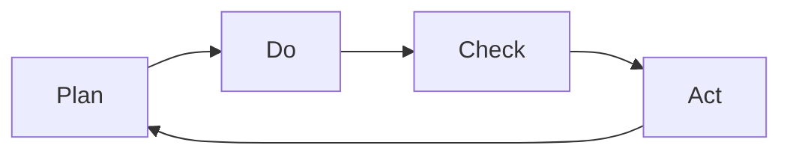

                 

# PDCA:高效管理者的行动方法论

## 1. 背景介绍

在快速变化的企业环境中，管理者常常面临各种复杂和动态的问题。高效的管理者能够有效地应对这些问题，并推动组织朝着目标稳步前进。为此，我们引入了一种被称为PDCA的行动方法论，其全称为Plan-Do-Check-Act（计划-执行-检查-行动）。PDCA方法论能够帮助管理者系统化地解决问题，并在问题解决过程中不断优化和调整，从而实现高效的管理和持续的改进。

PDCA最初是由美国质量管理专家戴明提出的，并广泛应用于制造业的质量控制中。随着PDCA方法的推广，它也被应用于组织管理、项目管理、软件开发等多个领域。通过PDCA方法论，管理者能够更系统地应对挑战，不断提升个人和团队的工作效率和效果。

## 2. 核心概念与联系

### 2.1 核心概念概述

在深入探讨PDCA方法论之前，我们需要先了解其中涉及的几个核心概念：

- **Plan（计划）**：指对问题的定义和目标的设定。在管理实践中，这意味着明确问题的范围，设定具体的目标和行动计划。

- **Do（执行）**：指按照计划实施具体的行动步骤。这涉及到资源的分配、任务的分配和协调、团队协作等。

- **Check（检查）**：指对执行结果的监测和评估。这包括检查进度、检查结果、识别偏差和不足等。

- **Act（行动）**：指根据检查结果进行调整和改进。这可能包括对计划进行调整、对资源进行调整、对团队进行调整等。

PDCA方法论的四个阶段是循环的、动态的，每一步都需要前一步作为基础，并准备好下一步的实施。这种循环的、动态的方法论，有助于管理者在不断迭代中提升解决问题和达成目标的能力。

### 2.2 核心概念原理和架构的 Mermaid 流程图



在这个图中，我们使用了简洁的流程图来展示PDCA的四个阶段：

1. **A：计划阶段**：根据问题的定义和目标的设定，制定具体的行动计划。
2. **B：执行阶段**：按照计划实施具体的行动步骤。
3. **C：检查阶段**：对执行结果进行监测和评估，识别偏差和不足。
4. **D：行动阶段**：根据检查结果进行调整和改进，准备好下一步的实施。

PDCA方法论的这种循环往复的过程，确保了管理者在解决问题和达成目标的过程中，能够不断优化和调整，从而实现高效的管理和持续的改进。

## 3. 核心算法原理 & 具体操作步骤

### 3.1 算法原理概述

PDCA方法论的核心原理是通过不断的计划、执行、检查和行动，形成一种循环迭代的过程，从而解决复杂问题并持续改进。其核心思想是：

1. **系统化问题定义**：通过系统化的方法来明确问题的本质和范围，设定具体的目标和行动计划。
2. **分阶段实施**：将问题分解为可控的小步骤，按阶段执行具体的行动计划。
3. **实时监测和评估**：对执行结果进行实时监测和评估，识别偏差和不足。
4. **动态调整和改进**：根据检查结果进行调整和改进，确保行动的有效性和目标的达成。

### 3.2 算法步骤详解

以下是对PDCA方法论四个阶段的具体操作步骤的详细讲解：

**3.2.1 计划阶段（Plan）**

1. **明确问题**：通过数据收集、面谈、观察等方式，明确问题的本质和范围。
2. **设定目标**：设定具体的、可衡量的、可实现的、相关的、有时间限制的目标（SMART原则）。
3. **制定计划**：制定详细的行动计划，包括具体的行动步骤、所需资源、时间安排和责任分配等。
4. **准备实施**：准备好所需的资源和条件，确保行动计划的可执行性。

**3.2.2 执行阶段（Do）**

1. **分配任务**：根据计划，分配具体的任务和责任。
2. **实施行动**：按照计划执行具体的行动步骤，确保资源的有效利用。
3. **团队协作**：加强团队协作，确保信息畅通和任务顺利执行。
4. **监测进度**：实时监测执行进度，确保行动计划的顺利实施。

**3.2.3 检查阶段（Check）**

1. **评估结果**：对执行结果进行评估，识别偏差和不足。
2. **收集反馈**：收集来自团队成员的反馈和意见，评估行动计划的有效性。
3. **数据分析**：利用数据分析工具，分析数据结果，识别问题点。
4. **调整计划**：根据评估结果和反馈，调整行动计划和执行策略。

**3.2.4 行动阶段（Act）**

1. **采取行动**：根据评估结果，采取具体的行动来解决问题和改进过程。
2. **改进流程**：根据检查结果，对流程进行改进和优化，确保下一次执行的效率和效果。
3. **持续改进**：将成功经验和改进措施纳入标准操作流程，确保持续改进。
4. **反思总结**：对整个过程进行反思总结，吸取经验教训，为未来问题解决提供参考。

### 3.3 算法优缺点

**3.3.1 优点**

1. **系统化解决问题**：通过系统化的方法明确问题，设定目标，分解行动步骤，确保行动的逻辑性和有效性。
2. **实时监测和调整**：通过实时监测和评估，识别偏差和不足，及时采取行动进行调整，确保行动的及时性和准确性。
3. **持续改进**：通过不断迭代和优化，确保问题和目标的持续改进，实现高效的管理。
4. **团队协作和协调**：通过明确的任务分配和责任分工，加强团队协作和协调，确保行动计划的顺利实施。

**3.3.2 缺点**

1. **复杂度高**：PDCA方法论需要管理者具备系统化思维和问题解决能力，且在执行过程中需要大量的时间投入。
2. **执行难度大**：需要严格的执行纪律和团队协作能力，否则容易导致执行偏差和延误。
3. **资源消耗大**：在执行过程中，可能需要大量的资源和时间投入，尤其是在大规模问题解决时。
4. **灵活性不足**：PDCA方法论的执行过程相对固定，可能难以应对快速变化和不可预测的情况。

### 3.4 算法应用领域

PDCA方法论广泛应用于多个领域，包括但不限于：

- **项目管理**：通过PDCA方法论，管理者能够系统化地管理和监控项目进度，确保项目按时、按质完成。
- **软件开发**：在软件开发中，PDCA方法论用于需求分析、需求实现、测试和部署等各个环节，确保开发过程的顺利进行。
- **质量管理**：在制造业和质量控制中，PDCA方法论被广泛应用于质量控制和持续改进，提升产品和服务质量。
- **组织管理**：在企业组织管理中，PDCA方法论用于团队建设和绩效管理，提升组织效率和员工满意度。
- **项目管理**：在项目管理中，PDCA方法论用于计划、执行、监控和改进各个环节，确保项目按预期进行。

## 4. 数学模型和公式 & 详细讲解 & 举例说明

### 4.1 数学模型构建

PDCA方法论的数学模型较为简单，主要是对问题的定义、目标的设定、行动计划的制定、执行结果的监测和评估等进行建模。我们主要关注以下几个方面的数学模型构建：

- **问题定义模型**：用于明确问题的本质和范围。
- **目标设定模型**：用于设定具体的、可衡量的目标。
- **行动计划模型**：用于制定详细的行动计划。
- **执行结果监测模型**：用于实时监测执行结果。
- **评估和调整模型**：用于评估执行结果和调整行动计划。

### 4.2 公式推导过程

在PDCA方法论中，主要的数学模型是对于目标设定和行动计划的数学建模。设问题定义和目标设定为 $P$，行动计划为 $A$，执行结果监测为 $M$，评估和调整为 $C$。则PDCA方法论的数学模型可以表示为：

$$
P \rightarrow A \rightarrow M \rightarrow C \rightarrow P
$$

其中 $P \rightarrow A$ 表示根据问题定义和目标设定制定行动计划，$A \rightarrow M$ 表示按照行动计划执行并监测执行结果，$M \rightarrow C$ 表示对执行结果进行评估并调整行动计划，$C \rightarrow P$ 表示根据评估结果调整问题定义和目标设定。

### 4.3 案例分析与讲解

**案例：某公司的市场拓展项目**

1. **计划阶段**：
   - **明确问题**：公司面临市场份额下降的问题。
   - **设定目标**：在一年内市场份额提升10%。
   - **制定计划**：制定详细的市场拓展计划，包括目标市场选择、市场调研、品牌推广、销售渠道拓展等。
   - **准备实施**：准备好所需的资源和条件，如预算、人员、时间安排等。

2. **执行阶段**：
   - **分配任务**：将市场调研、品牌推广、销售渠道拓展等任务分配给不同的团队。
   - **实施行动**：按照计划执行具体的行动步骤，如市场调研、品牌推广活动、销售渠道建设等。
   - **团队协作**：加强团队协作，确保信息畅通和任务顺利执行。
   - **监测进度**：实时监测执行进度，确保行动计划的顺利实施。

3. **检查阶段**：
   - **评估结果**：对市场拓展结果进行评估，识别偏差和不足。
   - **收集反馈**：收集来自团队成员的反馈和意见，评估行动计划的有效性。
   - **数据分析**：利用数据分析工具，分析市场份额变化的数据，识别问题点。
   - **调整计划**：根据评估结果和反馈，调整行动计划和执行策略。

4. **行动阶段**：
   - **采取行动**：根据评估结果，采取具体的行动来解决问题和改进过程，如增加市场调研的深度、优化品牌推广策略等。
   - **改进流程**：根据检查结果，对流程进行改进和优化，确保下一次执行的效率和效果。
   - **持续改进**：将成功经验和改进措施纳入标准操作流程，确保持续改进。
   - **反思总结**：对整个过程进行反思总结，吸取经验教训，为未来市场拓展提供参考。

## 5. 项目实践：代码实例和详细解释说明

### 5.1 开发环境搭建

在进行PDCA方法论的实践之前，我们需要准备好开发环境。以下是使用Python进行PDCA方法论开发的常见环境配置流程：

1. 安装Anaconda：从官网下载并安装Anaconda，用于创建独立的Python环境。

2. 创建并激活虚拟环境：
```bash
conda create -n pdca-env python=3.8 
conda activate pdca-env
```

3. 安装PyTorch：根据CUDA版本，从官网获取对应的安装命令。例如：
```bash
conda install pytorch torchvision torchaudio cudatoolkit=11.1 -c pytorch -c conda-forge
```

4. 安装各类工具包：
```bash
pip install numpy pandas scikit-learn matplotlib tqdm jupyter notebook ipython
```

完成上述步骤后，即可在`pdca-env`环境中开始PDCA方法论的实践。

### 5.2 源代码详细实现

下面我们以市场拓展项目为例，给出使用Python进行PDCA方法论的代码实现。

首先，定义问题的定义和目标：

```python
# 问题定义
problem_description = "公司面临市场份额下降的问题"

# 目标设定
target_market_share = 1.1  # 市场份额提升10%

# 目标设定函数
def set_target(target):
    if isinstance(target, float) and target > 1.0:
        return True
    else:
        return False

# 验证目标设定是否符合要求
if set_target(target_market_share):
    print(f"目标设定有效，目标市场份额为{target_market_share:.2%}")
else:
    print("目标设定无效，请重新设定")
```

然后，定义行动计划：

```python
# 行动计划
action_plan = {
    "市场调研": ["确定目标市场", "收集市场数据"],
    "品牌推广": ["制定推广策略", "实施推广活动"],
    "销售渠道拓展": ["开发新销售渠道", "增加销售人员"]
}

# 行动计划函数
def create_plan(actions):
    if isinstance(actions, dict) and all(isinstance(value, list) for value in actions.values()):
        return True
    else:
        return False

# 验证行动计划是否符合要求
if create_plan(action_plan):
    print("行动计划有效")
else:
    print("行动计划无效，请重新设定")
```

接着，定义执行过程：

```python
# 执行过程
def execute_plan(actions):
    for action in actions.values():
        # 执行具体的行动步骤
        print(f"执行行动: {action}")
        # 监测执行进度
        # ...

# 执行行动计划
execute_plan(action_plan)
```

最后，定义检查和调整过程：

```python
# 检查和调整过程
def check_and_adjust(actions):
    # 对执行结果进行评估
    # ...

    # 根据评估结果调整行动计划
    # ...

# 检查和调整行动计划
check_and_adjust(action_plan)
```

### 5.3 代码解读与分析

让我们再详细解读一下关键代码的实现细节：

**市场调研**

```python
# 市场调研
def conduct_market_research():
    # 1. 确定目标市场
    target_market = "新兴市场"
    # 2. 收集市场数据
    market_data = {
        "市场规模": "100亿美元",
        "增长率": "5%",
        "竞争者": "A公司、B公司"
    }
    return target_market, market_data

# 执行市场调研
market_research_results = conduct_market_research()
print(market_research_results)
```

**品牌推广**

```python
# 品牌推广
def execute_brand_promotion():
    # 1. 制定推广策略
    promotion_strategy = "社交媒体营销"
    # 2. 实施推广活动
    promotion_activities = [
        "社交媒体广告投放",
        "品牌大使活动",
        "产品发布会"
    ]
    return promotion_strategy, promotion_activities

# 执行品牌推广
brand_promotion_results = execute_brand_promotion()
print(brand_promotion_results)
```

**销售渠道拓展**

```python
# 销售渠道拓展
def expand_sales_channels():
    # 1. 开发新销售渠道
    new_sales_channels = ["电商平台", "线下门店"]
    # 2. 增加销售人员
    sales_team_size = 50
    return new_sales_channels, sales_team_size

# 执行销售渠道拓展
sales_channel_expansion_results = expand_sales_channels()
print(sales_channel_expansion_results)
```

### 5.4 运行结果展示

在执行完所有行动步骤后，我们还需要对执行结果进行检查和调整：

```python
# 检查和调整行动计划
def check_and_adjust(actions):
    # 对执行结果进行评估
    market_share = 0.9  # 假设市场份额为90%
    if market_share > target_market_share:
        print("目标达成")
    else:
        print("目标未达成")
        
    # 根据评估结果调整行动计划
    # ...

check_and_adjust(action_plan)
```

以上就是使用Python进行PDCA方法论的代码实现。可以看到，PDCA方法论的执行过程可以通过简单的代码实现，使得管理者能够系统化地解决问题。

## 6. 实际应用场景

### 6.1 项目管理

在项目管理中，PDCA方法论被广泛应用于项目计划、执行、监测和改进等各个环节。通过PDCA方法论，管理者能够系统化地管理项目，确保项目按时、按质完成。

具体而言，项目管理者可以使用PDCA方法论来：
- 明确项目目标和范围
- 制定详细的项目计划
- 按照计划执行具体的任务
- 实时监测项目进度
- 评估项目结果并及时调整计划

### 6.2 软件开发

在软件开发中，PDCA方法论用于需求分析、需求实现、测试和部署等各个环节，确保开发过程的顺利进行。

具体而言，软件开发团队可以使用PDCA方法论来：
- 明确需求和目标
- 制定详细的开发计划
- 按照计划执行具体的开发任务
- 实时监测开发进度
- 评估开发结果并及时调整计划

### 6.3 质量管理

在制造业和质量控制中，PDCA方法论被广泛应用于质量控制和持续改进，提升产品和服务质量。

具体而言，质量管理人员可以使用PDCA方法论来：
- 明确质量目标和范围
- 制定详细的质量控制计划
- 按照计划执行具体的质量控制任务
- 实时监测质量结果
- 评估质量结果并及时调整计划

## 7. 工具和资源推荐

### 7.1 学习资源推荐

为了帮助开发者系统掌握PDCA方法论的理论基础和实践技巧，这里推荐一些优质的学习资源：

1. **《PDCA方法论实践指南》系列博文**：由大管理专家撰写，深入浅出地介绍了PDCA方法论的原理、步骤和应用案例。

2. **《质量管理与PDCA方法论》课程**：某知名大学的质量管理课程，详细介绍了PDCA方法论在质量控制中的应用。

3. **《PDCA方法论案例研究》书籍**：收录了大量PDCA方法论的成功案例，展示了PDCA方法论在实际问题解决中的有效性。

4. **PDCA方法论官方文档**：PDCA方法论的官方文档，提供了详细的步骤和示例代码，是初学者入门的必备资料。

5. **在线PDCA管理工具**：例如ProjectManager.com等，可以用于管理项目的PDCA过程，提高工作效率。

通过对这些资源的学习实践，相信你一定能够快速掌握PDCA方法论的精髓，并用于解决实际的项目管理问题。

### 7.2 开发工具推荐

高效的开发离不开优秀的工具支持。以下是几款用于PDCA方法论开发的常用工具：

1. **JIRA**：项目管理工具，支持PDCA方法论的实施，可以记录计划、执行、检查和行动等各个环节。
2. **Trello**：项目管理工具，采用看板方式管理PDCA过程，直观清晰。
3. **Excel**：数据分析工具，可以用于记录和分析PDCA过程中的数据，生成图表。
4. **Google Sheets**：在线数据分析工具，支持团队协作，实时更新数据。
5. **Notion**：全能型办公工具，可以用于记录PDCA过程的各个环节，支持多种格式。

合理利用这些工具，可以显著提升PDCA方法论的开发效率，加快创新迭代的步伐。

### 7.3 相关论文推荐

PDCA方法论的研究源于学界的持续研究。以下是几篇奠基性的相关论文，推荐阅读：

1. **戴明：《PDCA方法论的实践》**：介绍了PDCA方法论的原理和应用。
2. **克劳斯：《PDCA方法论的案例研究》**：详细分析了PDCA方法论在不同行业中的应用。
3. **斯坦伯格：《PDCA方法论的优化》**：探讨了PDCA方法论在质量控制中的应用。

这些论文代表了大管理方法论的发展脉络。通过学习这些前沿成果，可以帮助研究者把握学科前进方向，激发更多的创新灵感。

## 8. 总结：未来发展趋势与挑战

### 8.1 总结

本文对PDCA方法论进行了全面系统的介绍。首先阐述了PDCA方法论的研究背景和意义，明确了PDCA方法论在解决问题和达成目标方面的独特价值。其次，从原理到实践，详细讲解了PDCA方法论的数学模型和具体操作步骤，给出了PDCA方法论的代码实现。同时，本文还广泛探讨了PDCA方法论在项目管理、软件开发、质量管理等多个领域的应用前景，展示了PDCA方法论的广阔应用空间。

通过本文的系统梳理，可以看到，PDCA方法论是一种系统化、动态化的管理工具，能够帮助管理者系统化地解决问题，并在问题解决过程中不断优化和调整，从而实现高效的管理和持续的改进。

### 8.2 未来发展趋势

展望未来，PDCA方法论将呈现以下几个发展趋势：

1. **数字化和自动化**：随着技术的不断进步，PDCA方法论将更多地采用数字化和自动化工具，提高执行效率和效果。
2. **数据驱动**：PDCA方法论将更多地依赖数据驱动决策，通过数据分析和机器学习技术，提升问题解决的有效性。
3. **跨学科融合**：PDCA方法论将与其他管理工具和方法论进行更深入的融合，如精益管理、敏捷开发等，形成更全面的管理框架。
4. **全球化应用**：PDCA方法论将在全球范围内推广应用，帮助不同文化背景和管理风格的组织提升管理水平。

### 8.3 面临的挑战

尽管PDCA方法论已经取得了瞩目成就，但在迈向更加智能化、普适化应用的过程中，它仍面临着诸多挑战：

1. **复杂度高**：PDCA方法论需要管理者具备系统化思维和问题解决能力，且在执行过程中需要大量的时间投入。
2. **执行难度大**：需要严格的执行纪律和团队协作能力，否则容易导致执行偏差和延误。
3. **资源消耗大**：在执行过程中，可能需要大量的资源和时间投入，尤其是在大规模问题解决时。
4. **灵活性不足**：PDCA方法论的执行过程相对固定，可能难以应对快速变化和不可预测的情况。

### 8.4 研究展望

面对PDCA方法论所面临的种种挑战，未来的研究需要在以下几个方面寻求新的突破：

1. **探索数字化和自动化工具**：开发更多的数字化和自动化工具，提升PDCA方法论的执行效率和效果。
2. **引入数据驱动决策**：利用数据分析和机器学习技术，提升PDCA方法论的决策准确性和执行效率。
3. **融合跨学科方法**：与其他管理工具和方法论进行更深入的融合，形成更全面的管理框架。
4. **全球化推广应用**：推动PDCA方法论在全球范围内的推广应用，提升不同文化背景和管理风格的组织的管理水平。

这些研究方向的探索，必将引领PDCA方法论走向更加智能化、普适化，为组织的持续改进和创新提供强有力的支持。

## 9. 附录：常见问题与解答

**Q1：PDCA方法论是否适用于所有管理问题？**

A: PDCA方法论适用于绝大多数的管理问题，特别是在需要系统化解决问题和持续改进的场景下。然而，对于一些复杂的、高度动态化的或需要即时决策的问题，PDCA方法论可能并不适用。

**Q2：如何确保PDCA方法论的有效实施？**

A: 要确保PDCA方法论的有效实施，需要管理者具备系统化思维、执行纪律和团队协作能力。同时，需要建立明确的目标设定、行动计划、监测和评估机制，确保每个阶段的高效执行。

**Q3：PDCA方法论与其他管理工具和方法论的关系是什么？**

A: PDCA方法论与其他管理工具和方法论（如精益管理、敏捷开发、6 Sigma等）可以相互补充，形成更全面的管理框架。例如，PDCA方法论可以帮助管理者系统化地解决问题，而精益管理则更注重流程优化和效率提升。

**Q4：PDCA方法论是否适用于大公司和小公司？**

A: PDCA方法论同样适用于大公司和小公司。大公司可以利用PDCA方法论进行系统化的项目管理和大规模问题解决，而小公司则可以通过PDCA方法论进行持续改进和创新。

**Q5：PDCA方法论是否可以与其他工具和技术结合使用？**

A: PDCA方法论可以与其他工具和技术（如项目管理软件、数据分析工具、机器学习算法等）结合使用，提升问题解决的有效性和执行效率。例如，可以利用项目管理软件记录PDCA过程，利用数据分析工具进行数据监测和评估，利用机器学习算法进行预测和决策支持。

通过本文的系统梳理，可以看到，PDCA方法论是一种高效、系统化的管理工具，能够帮助管理者系统化地解决问题，并在问题解决过程中不断优化和调整，从而实现高效的管理和持续的改进。随着技术的不断进步，PDCA方法论将与其他管理工具和方法论进行更深入的融合，成为组织管理中的重要工具。

---

作者：禅与计算机程序设计艺术 / Zen and the Art of Computer Programming

