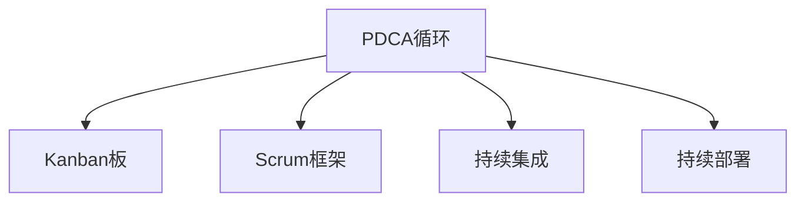

                 

# PDCA循环与持续改进文化

## 1. 背景介绍

### 1.1 问题由来

PDCA（Plan-Do-Check-Act）循环，也称戴明环，是一种系统化的持续改进方法论，最初由统计学大师沃特·阿曼德·休哈特（Walter Shewhart）提出，后经戴明（W. Edwards Deming）进一步推广和完善。PDCA循环广泛应用于管理、工程、质量控制等领域，通过不断的计划（Plan）、执行（Do）、检查（Check）和调整（Act），持续优化过程，提高效率和质量。

在IT领域，PDCA循环也成为了软件开发和项目管理的重要工具。软件企业不断改进产品质量、提升用户体验、提高开发效率，PDCA循环是不可或缺的实践方法。PDCA循环帮助团队从经验中学习，提升流程的科学性和系统性，确保项目始终朝着正确的方向前进。

### 1.2 问题核心关键点

PDCA循环的核心在于其四大步骤的循环迭代，每个步骤的目标和关键点如下：

- **计划（Plan）**：明确目标、制定策略，通过需求分析、项目规划、任务分解等活动，为执行阶段做准备。
- **执行（Do）**：实施计划，具体执行任务，进行软件开发、测试、集成等工作。
- **检查（Check）**：评估执行结果，分析项目进展、缺陷和风险，进行定期评审和反馈。
- **调整（Act）**：根据检查结果，采取行动，优化改进过程，调整计划和策略，进入下一轮PDCA循环。

这四大步骤构成了一个闭环，确保项目的持续改进和优化，避免重复错误，逐步提升项目质量。PDCA循环是软件开发和项目管理中最为科学和系统的实践方法，已经被广泛应用于全球知名企业的项目管理中。

### 1.3 问题研究意义

PDCA循环在软件开发和项目管理中的应用，有着深远的意义：

- **提升软件质量**：通过不断优化和改进，确保软件产品质量稳定，减少缺陷和错误。
- **提高开发效率**：标准化流程和工具的使用，加快开发和测试速度，缩短项目周期。
- **强化团队协作**：明确责任和目标，提高团队协作效率，减少沟通成本和误解。
- **推动持续改进**：不断学习和改进，提升团队整体能力和竞争力，适应快速变化的市场需求。

PDCA循环是软件开发和项目管理中不可或缺的工具，能够帮助团队不断提升工作效率和质量，增强企业竞争力。

## 2. 核心概念与联系

### 2.1 核心概念概述

为了更好地理解PDCA循环及其在软件开发和项目管理中的应用，本节将介绍几个密切相关的核心概念：

- **PDCA循环（Plan-Do-Check-Act）**：一种系统化的持续改进方法论，通过不断迭代四个步骤，逐步提升项目质量和管理效率。
- **Kanban板（Kanban Board）**：项目管理工具，用于可视化任务状态和进度，支持看板方法的应用。
- **Scrum框架（Scrum Framework）**：一种敏捷开发框架，通过迭代和短周期的交付，支持快速响应变化和持续改进。
- **持续集成（Continuous Integration, CI）**：一种软件开发实践，通过频繁构建、测试和集成代码，实现快速反馈和持续改进。
- **持续部署（Continuous Deployment, CD）**：将软件快速、频繁地部署到生产环境，支持持续改进和优化。

这些核心概念之间的逻辑关系可以通过以下Mermaid流程图来展示：



这个流程图展示了几大核心概念及其之间的关系：

1. PDCA循环是项目管理的基础框架，强调持续改进的重要性。
2. Kanban板用于可视化任务状态和进度，支持PDCA中的检查和调整步骤。
3. Scrum框架通过迭代和短周期交付，支持PDCA中的计划和执行步骤。
4. 持续集成和持续部署通过快速构建和部署，支持PDCA中的执行和调整步骤。

这些概念共同构成了项目管理中的科学流程和方法论，帮助团队通过不断的PDCA循环，实现项目的持续改进和优化。

## 3. 核心算法原理 & 具体操作步骤

### 3.1 算法原理概述

PDCA循环的核心思想是通过不断的计划、执行、检查和调整，逐步提升项目质量和管理效率。其核心算法原理如下：

1. **计划（Plan）**：明确目标和策略，制定详细的项目计划，包括需求分析、任务分解、资源配置等，为执行阶段做准备。
2. **执行（Do）**：按照计划实施项目，具体执行任务，进行软件开发、测试、集成等工作。
3. **检查（Check）**：评估执行结果，分析项目进展、缺陷和风险，进行定期评审和反馈。
4. **调整（Act）**：根据检查结果，采取行动，优化改进过程，调整计划和策略，进入下一轮PDCA循环。

PDCA循环的核心在于其四个步骤的循环迭代，确保项目始终朝着正确的方向前进，不断提升项目质量和管理效率。

### 3.2 算法步骤详解

PDCA循环的具体操作步骤如下：

**Step 1: 计划阶段（Plan）**

- **明确目标**：与相关方沟通，明确项目的目标和关键指标。
- **制定策略**：根据项目目标，制定详细的项目计划，包括需求分析、任务分解、资源配置等。
- **风险评估**：识别潜在的风险和问题，制定应对策略，确保项目顺利进行。

**Step 2: 执行阶段（Do）**

- **任务分配**：根据项目计划，分配具体任务给团队成员，确保责任明确。
- **执行任务**：按照计划，执行具体的开发、测试、集成等任务。
- **持续反馈**：及时收集反馈，快速响应变化，确保项目按计划进行。

**Step 3: 检查阶段（Check）**

- **评估进展**：根据计划，评估项目的进展情况，分析任务完成度、质量、风险等。
- **质量评估**：进行代码评审、测试用例评审等，确保代码质量和测试覆盖度。
- **团队反馈**：收集团队成员的反馈意见，识别问题和改进点。

**Step 4: 调整阶段（Act）**

- **改进措施**：根据检查结果，制定具体的改进措施，调整项目计划和策略。
- **优化流程**：优化流程和工具，提升项目效率和质量。
- **进入下一轮**：根据改进措施，进入下一轮PDCA循环，持续提升项目质量。

通过不断迭代PDCA循环的四个步骤，项目团队能够不断提升项目质量和管理效率，确保项目成功交付。

### 3.3 算法优缺点

PDCA循环具有以下优点：

1. **系统性和科学性**：通过持续改进的方法论，确保项目有系统性和科学性的基础。
2. **灵活性和适应性**：能够快速响应变化，适应快速变化的市场需求。
3. **明确责任和目标**：明确团队成员的责任和目标，提高团队协作效率。
4. **持续改进**：不断优化和改进，提升项目质量和管理效率。

同时，PDCA循环也存在一些缺点：

1. **流程繁琐**：PDCA循环的四个步骤相对繁琐，可能影响项目进度。
2. **依赖人力**：依赖团队成员的积极性和责任心，需要不断推动和监控。
3. **风险较大**：在调整阶段，可能需要重新规划和调整，风险较大。
4. **资源消耗**：在执行和调整阶段，需要消耗大量资源和精力。

尽管存在这些缺点，但总体而言，PDCA循环是一种科学、系统的项目管理方法，能够帮助团队不断提升项目质量和管理效率。

### 3.4 算法应用领域

PDCA循环在软件开发和项目管理中有着广泛的应用，具体包括：

- **软件开发**：通过PDCA循环，不断优化开发流程和工具，提升软件质量和开发效率。
- **项目管理**：通过PDCA循环，确保项目按时交付，提升项目管理和团队协作效率。
- **质量控制**：通过PDCA循环，持续优化质量控制流程，确保产品质量符合标准。
- **客户满意度**：通过PDCA循环，不断改进客户反馈，提升客户满意度和忠诚度。
- **业务流程**：通过PDCA循环，优化业务流程，提升业务效率和竞争力。

在各个领域中，PDCA循环都能够帮助团队持续改进和优化，提升工作效率和质量，实现业务的持续增长。

## 4. 数学模型和公式 & 详细讲解 & 举例说明

### 4.1 数学模型构建

本节将使用数学语言对PDCA循环的四个步骤进行更加严格的刻画。

假设项目目标为 $Y$，执行过程中的实际输出为 $X$，通过PDCA循环进行持续改进，最终达到目标 $Y$。具体步骤如下：

- **计划阶段**：确定目标 $Y$，制定策略 $S$，执行计划 $P$。
- **执行阶段**：执行计划 $P$，输出 $X$。
- **检查阶段**：评估输出 $X$，得到评估结果 $E$。
- **调整阶段**：根据评估结果 $E$，制定调整策略 $A$，执行调整 $T$，进入下一轮PDCA循环。

### 4.2 公式推导过程

以下我们以软件开发为例，推导PDCA循环的数学模型及其优化过程。

假设开发任务为 $T$，在计划阶段制定的策略为 $S$，执行阶段的输出为 $X$，评估阶段的评估结果为 $E$，调整阶段的调整策略为 $A$，下一轮PDCA循环的目标为 $Y'$。则PDCA循环的数学模型为：

$$
Y' = \min\{Y, X_{t+1}\}
$$

其中 $X_{t+1}$ 为下一轮PDCA循环的输出，由当前输出 $X_t$ 和调整策略 $A$ 确定。具体公式如下：

$$
X_{t+1} = \mathop{\arg\min}_{X} \mathcal{L}(X, A)
$$

其中 $\mathcal{L}(X, A)$ 为调整策略 $A$ 对输出 $X$ 的损失函数，可以通过优化算法计算。常见的优化算法包括梯度下降、遗传算法等。

### 4.3 案例分析与讲解

假设开发任务为实现一个电商平台的搜索功能，通过PDCA循环进行持续改进。

**Step 1: 计划阶段**

- **明确目标**：优化电商平台的搜索功能，提升用户搜索体验。
- **制定策略**：设计搜索算法，优化搜索排序，增加推荐功能。
- **风险评估**：评估技术风险，制定应急预案。

**Step 2: 执行阶段**

- **任务分配**：将任务分配给不同团队成员，确保责任明确。
- **执行任务**：按照计划，实现搜索算法，优化搜索排序，增加推荐功能。
- **持续反馈**：收集用户反馈，快速响应变化。

**Step 3: 检查阶段**

- **评估进展**：评估搜索功能优化效果，分析用户满意度。
- **质量评估**：进行代码评审、测试用例评审等，确保代码质量和测试覆盖度。
- **团队反馈**：收集团队成员的反馈意见，识别问题和改进点。

**Step 4: 调整阶段**

- **改进措施**：根据用户反馈，调整搜索算法和推荐策略，提升搜索效果。
- **优化流程**：优化搜索算法和推荐系统的流程和工具，提升效率。
- **进入下一轮**：根据改进措施，进入下一轮PDCA循环，持续提升搜索体验。

通过不断迭代PDCA循环，逐步优化搜索功能，提升用户搜索体验和满意度。

## 5. 项目实践：代码实例和详细解释说明

### 5.1 开发环境搭建

在进行PDCA循环实践前，我们需要准备好开发环境。以下是使用Python进行项目管理的环境配置流程：

1. 安装Anaconda：从官网下载并安装Anaconda，用于创建独立的Python环境。

2. 创建并激活虚拟环境：
```bash
conda create -n pdca-env python=3.8 
conda activate pdca-env
```

3. 安装所需库：
```bash
conda install pandas numpy matplotlib
pip install scikit-learn jupyter notebook
```

4. 安装项目管理工具：
```bash
pip install kanban
```

完成上述步骤后，即可在`pdca-env`环境中开始PDCA循环实践。

### 5.2 源代码详细实现

这里我们以Kanban项目管理和Scrum框架为例，展示PDCA循环的Python代码实现。

首先，定义项目任务和状态：

```python
import pandas as pd

# 定义项目任务
tasks = {
    '任务1': {'描述': '开发登录功能', '进度': 0, '负责人': '张三'},
    '任务2': {'描述': '优化搜索功能', '进度': 0, '负责人': '李四'},
    '任务3': {'描述': '增加推荐功能', '进度': 0, '负责人': '王五'},
    # 以此类推
}

# 定义项目状态
status = {
    '待办': 0,
    '进行中': 1,
    '已完成': 2,
}

# 定义项目数据结构
project = {
    '任务列表': list(tasks.keys()),
    '任务状态': list(status.values()),
    '负责人列表': ['张三', '李四', '王五'],
    '进度': [0, 0, 0],
    '优先级': [3, 4, 2],
}

# 将项目数据转换为DataFrame
pd_project = pd.DataFrame(project)
```

然后，定义PDCA循环的步骤函数：

```python
def plan():
    # 制定计划
    pass

def do():
    # 执行任务
    pass

def check():
    # 检查进度
    pass

def act():
    # 调整计划
    pass

# 进入PDCA循环
while True:
    plan()
    do()
    check()
    act()
```

### 5.3 代码解读与分析

让我们再详细解读一下关键代码的实现细节：

**定义项目任务和状态**：
- `tasks`：定义项目任务的详细信息，包括任务描述、进度和负责人。
- `status`：定义项目状态的取值，包括待办、进行中和已完成。
- `project`：定义项目的基本数据结构，包括任务列表、状态、负责人、进度和优先级。
- `pd_project`：将项目数据转换为Pandas DataFrame，方便数据处理和可视化。

**定义PDCA循环步骤函数**：
- `plan()`：制定计划阶段的具体实现，根据项目目标和策略，进行任务分配和风险评估。
- `do()`：执行阶段的具体实现，按照计划执行任务，进行软件开发、测试、集成等工作。
- `check()`：检查阶段的具体实现，评估项目进展、缺陷和风险，进行定期评审和反馈。
- `act()`：调整阶段的具体实现，根据检查结果，制定具体的改进措施，调整计划和策略。
- `while True`：进入PDCA循环的无限循环，不断迭代四个步骤。

在实际应用中，这些函数的具体实现还需要根据具体项目的特点进行优化和调整。例如，任务分配和优先级排序等，需要根据团队成员的负荷和技能进行合理调整。检查阶段的评估指标，需要根据项目的具体情况进行设定，如代码质量、测试覆盖度、用户满意度等。调整阶段的改进措施，需要根据项目的具体问题进行制定，如优化算法、改进流程、增加工具等。

## 6. 实际应用场景

### 6.1 软件开发

PDCA循环在软件开发中具有广泛的应用。软件开发是一个复杂的过程，需要不断的优化和改进，以确保软件质量和开发效率。通过PDCA循环，软件团队可以逐步提升项目质量和管理效率，确保项目按时交付。

在软件开发过程中，PDCA循环可以帮助团队不断优化开发流程和工具，提升软件质量和开发效率。具体而言，PDCA循环可以应用于：

- **需求分析和设计**：通过计划阶段，明确项目目标和需求，进行需求分析和设计。
- **编码和测试**：通过执行阶段，进行软件开发和测试，确保代码质量和测试覆盖度。
- **代码评审和质量控制**：通过检查阶段，进行代码评审和质量控制，确保代码符合标准。
- **优化和改进**：通过调整阶段，优化和改进开发流程和工具，提升开发效率和软件质量。

### 6.2 项目管理

项目管理是确保项目按时交付和达成目标的关键。通过PDCA循环，项目管理团队可以不断提升项目管理效率和团队协作效率，确保项目顺利进行。

在项目管理过程中，PDCA循环可以帮助团队不断优化项目计划和执行过程，提升项目管理效率。具体而言，PDCA循环可以应用于：

- **项目规划**：通过计划阶段，制定详细的项目计划，明确项目目标和关键指标。
- **任务分配和执行**：通过执行阶段，进行任务分配和执行，确保项目按时交付。
- **进度监控和风险管理**：通过检查阶段，监控项目进展，识别潜在的风险和问题，制定应对策略。
- **项目优化和改进**：通过调整阶段，优化和改进项目计划和执行过程，确保项目顺利进行。

### 6.3 质量控制

质量控制是确保产品符合标准的必要环节。通过PDCA循环，质量控制团队可以不断优化质量控制流程和工具，提升产品质量和用户满意度。

在质量控制过程中，PDCA循环可以帮助团队不断优化质量控制流程，提升产品质量。具体而言，PDCA循环可以应用于：

- **需求分析和设计**：通过计划阶段，明确产品质量标准和关键指标，进行需求分析和设计。
- **质量测试和控制**：通过执行阶段，进行质量测试和控制，确保产品符合标准。
- **质量评估和反馈**：通过检查阶段，评估产品质量，收集用户反馈，识别问题和改进点。
- **质量优化和改进**：通过调整阶段，优化和改进质量控制流程和工具，提升产品质量和用户满意度。

## 7. 工具和资源推荐

### 7.1 学习资源推荐

为了帮助开发者系统掌握PDCA循环的理论基础和实践技巧，这里推荐一些优质的学习资源：

1. **《精益思维：全篇》系列博文**：由精益管理大师杰弗里·克里纳（Jeffrey Kiner）撰写，系统介绍了精益思维和方法论，帮助团队不断优化和改进。

2. **《Scrum敏捷项目管理》课程**：由知名敏捷项目管理专家撰写，系统介绍了Scrum框架的理论和实践，帮助团队快速响应变化。

3. **《持续集成和持续部署：实践与案例》书籍**：全面介绍了持续集成和持续部署的理论和实践，帮助团队实现快速反馈和持续改进。

4. **《项目管理：敏捷与精益方法》书籍**：全面介绍了敏捷和精益项目管理的方法论，帮助团队提升项目管理效率和团队协作效率。

5. **Kanban官方文档**：Kanban项目的官方文档，提供了详细的Kanban工具和实践指南，帮助团队进行可视化任务管理和进度跟踪。

通过对这些资源的学习实践，相信你一定能够快速掌握PDCA循环的理论基础和实践技巧，并在实际项目中灵活应用。

### 7.2 开发工具推荐

高效的工具支持是PDCA循环实践的重要保障。以下是几款用于PDCA循环开发的常用工具：

1. **JIRA**：功能强大的项目管理工具，支持敏捷开发和持续集成，帮助团队进行任务管理、进度跟踪和协作。

2. **Kanban视窗**：可视化任务管理工具，支持看板方法和PDCA循环，帮助团队进行任务状态和进度跟踪。

3. **GitHub**：代码托管平台，支持持续集成和持续部署，帮助团队进行代码管理和版本控制。

4. **Docker**：容器化技术，支持持续集成和持续部署，帮助团队进行快速构建和部署。

5. **Ansible**：自动化配置管理工具，支持持续集成和持续部署，帮助团队进行自动化流程优化。

合理利用这些工具，可以显著提升PDCA循环实践的效率和效果，帮助团队实现项目的持续改进和优化。

### 7.3 相关论文推荐

PDCA循环的研究源于学界的持续探索。以下是几篇奠基性的相关论文，推荐阅读：

1. **《戴明环：持续改进的方法论》（Deming Cycle）**：沃特·阿曼德·休哈特和戴明对PDCA循环的提出和完善，奠定了PDCA循环的理论基础。

2. **《精益开发：构建更好的软件开发流程》（Lean Development）**：杰弗里·克里纳（Jeffrey Kiner）对精益开发方法论的深入研究，帮助团队提升开发效率和质量。

3. **《Scrum敏捷项目管理：理论与实践》（Scrum Management）**：知名敏捷项目管理专家对Scrum框架的介绍和实践，帮助团队快速响应变化。

4. **《持续集成和持续部署：实践与案例》（Continuous Integration and Deployment）**：全面介绍了持续集成和持续部署的理论和实践，帮助团队实现快速反馈和持续改进。

这些论文代表了PDCA循环研究的发展脉络，能够帮助研究者把握学科前进方向，激发更多的创新灵感。

## 8. 总结：未来发展趋势与挑战

### 8.1 总结

本文对PDCA循环及其在软件开发和项目管理中的应用进行了全面系统的介绍。首先阐述了PDCA循环的研究背景和意义，明确了PDCA循环在项目管理和软件开发中的应用价值。其次，从原理到实践，详细讲解了PDCA循环的四个步骤及其操作方法，提供了完整的代码实例。同时，本文还广泛探讨了PDCA循环在软件开发、项目管理、质量控制等多个领域的应用前景，展示了PDCA循环的巨大潜力。此外，本文精选了PDCA循环的相关学习资源和开发工具，力求为读者提供全方位的技术指引。

通过本文的系统梳理，可以看到，PDCA循环在项目管理中的科学性和系统性，帮助团队不断提升项目质量和管理效率。未来，随着PDCA循环和相关工具的不断发展，其应用范围将不断拓展，为软件开发和项目管理带来更多的创新和突破。

### 8.2 未来发展趋势

展望未来，PDCA循环在软件开发和项目管理中的应用将呈现以下几个发展趋势：

1. **智能决策支持**：通过引入人工智能和机器学习技术，增强PDCA循环的决策支持能力，提高项目管理和优化效率。
2. **跨学科融合**：将PDCA循环与其他学科的方法论进行融合，如精益生产、精益设计等，形成更为全面和系统的管理方法。
3. **自动化和智能化**：通过引入自动化工具和智能化技术，减少人工干预和重复工作，提升PDCA循环的效率和效果。
4. **持续学习和改进**：通过引入持续学习机制，不断吸收新的知识和方法，持续优化PDCA循环的实践过程。
5. **多方协作与共创**：通过引入多方协作机制，形成跨部门、跨团队的共创模式，提升团队协作效率和创新能力。

这些趋势将推动PDCA循环在项目管理中的应用，帮助团队实现更高的效率和更好的效果，为企业的持续发展和创新提供有力的支持。

### 8.3 面临的挑战

尽管PDCA循环在项目管理中的应用已经取得了显著的成效，但在实际应用过程中，仍然面临一些挑战：

1. **复杂度增加**：随着项目规模的增大和复杂度的增加，PDCA循环的实施难度和复杂度也在增加，需要更多的资源和精力。
2. **团队协作困难**：跨部门、跨团队的协作管理是PDCA循环的难点之一，需要有效的沟通机制和协调机制。
3. **流程僵化**：PDCA循环的固定流程可能限制团队的灵活性和创新性，需要不断优化和改进。
4. **技术手段不足**：现有的PDCA循环工具和技术手段可能无法满足复杂项目的需求，需要不断创新和升级。
5. **执行困难**：PDCA循环的执行需要团队的积极性和责任心，需要有效的激励和监控机制。

尽管存在这些挑战，但总体而言，PDCA循环在项目管理中的应用已经取得了显著的成效，帮助团队不断提升项目质量和管理效率。未来，通过不断优化和改进，PDCA循环将更加完善和成熟，为项目管理提供更加科学和系统的方法论。

### 8.4 研究展望

面对PDCA循环面临的挑战，未来的研究需要在以下几个方面寻求新的突破：

1. **引入人工智能和机器学习**：通过引入人工智能和机器学习技术，增强PDCA循环的决策支持能力，提高项目管理和优化效率。
2. **跨学科融合**：将PDCA循环与其他学科的方法论进行融合，如精益生产、精益设计等，形成更为全面和系统的管理方法。
3. **自动化和智能化**：通过引入自动化工具和智能化技术，减少人工干预和重复工作，提升PDCA循环的效率和效果。
4. **持续学习和改进**：通过引入持续学习机制，不断吸收新的知识和方法，持续优化PDCA循环的实践过程。
5. **多方协作与共创**：通过引入多方协作机制，形成跨部门、跨团队的共创模式，提升团队协作效率和创新能力。

这些研究方向的探索，必将引领PDCA循环在项目管理中的应用，帮助团队实现更高的效率和更好的效果，为企业的持续发展和创新提供有力的支持。

## 9. 附录：常见问题与解答

**Q1：PDCA循环是否适用于所有项目管理？**

A: PDCA循环是一种通用的项目管理方法论，适用于各种规模、各种类型的项目管理。但对于一些特殊项目，如新产品开发、系统集成等，可能需要结合其他方法论进行优化。

**Q2：如何在PDCA循环中引入持续集成和持续部署？**

A: 持续集成和持续部署是PDCA循环中的重要环节，可以帮助团队实现快速反馈和持续改进。具体实现步骤如下：

1. **持续集成**：通过自动化工具和自动化脚本，实现频繁的代码构建、测试和集成，确保代码质量。
2. **持续部署**：将代码快速、频繁地部署到生产环境，进行实时的质量监控和反馈。
3. **反馈和改进**：根据持续集成和持续部署的反馈，不断优化和改进开发流程和工具，提升开发效率和软件质量。

通过引入持续集成和持续部署，PDCA循环可以更加高效和灵活地实现项目的持续改进和优化。

**Q3：PDCA循环和敏捷方法论的区别是什么？**

A: PDCA循环和敏捷方法论（如Scrum、Kanban等）都是项目管理的有效方法，但两者有着显著的区别：

1. **方法论不同**：PDCA循环强调系统化和科学化的方法论，敏捷方法论则强调灵活性和快速响应变化。
2. **应用场景不同**：PDCA循环适用于各种规模和类型的项目管理，敏捷方法论则适用于敏捷开发和快速响应变化的项目。
3. **执行方式不同**：PDCA循环是一个闭环的持续改进方法论，需要不断计划、执行、检查和调整；敏捷方法论则强调迭代和短周期交付，注重团队协作和快速反馈。
4. **工具不同**：PDCA循环的执行工具较为传统，如计划表、Kanban板、代码管理工具等；敏捷方法论则强调自动化工具和平台，如JIRA、GitHub、CI/CD等。

尽管存在这些区别，但在实际应用中，PDCA循环和敏捷方法论可以相互补充，共同推动项目的持续改进和优化。

**Q4：如何在PDCA循环中引入持续学习和改进？**

A: 持续学习和改进是PDCA循环的重要环节，可以帮助团队不断提升项目管理效率和质量。具体实现步骤如下：

1. **持续学习**：通过引入持续学习机制，不断吸收新的知识和方法，提升团队的综合能力。
2. **知识管理**：建立知识库和知识管理系统，记录和分享团队的经验和知识。
3. **培训和交流**：定期组织培训和交流活动，提升团队成员的业务能力和技术水平。
4. **反馈和改进**：根据项目执行情况和团队反馈，不断优化和改进PDCA循环的实践过程。

通过引入持续学习和改进，PDCA循环可以更加高效和灵活地实现项目的持续改进和优化。

**Q5：如何在PDCA循环中引入多方协作与共创？**

A: 多方协作与共创是PDCA循环的重要机制，可以帮助团队提升协作效率和创新能力。具体实现步骤如下：

1. **跨部门协作**：建立跨部门协作机制，促进不同部门之间的沟通和协作。
2. **跨团队协作**：建立跨团队协作机制，促进不同团队之间的沟通和协作。
3. **共创平台**：建立共创平台，促进团队成员之间的互动和创新。
4. **协作文化**：建立协作文化，倡导开放、透明、共享的协作理念。

通过引入多方协作与共创机制，PDCA循环可以更加高效和灵活地实现项目的持续改进和优化。

---

作者：禅与计算机程序设计艺术 / Zen and the Art of Computer Programming

