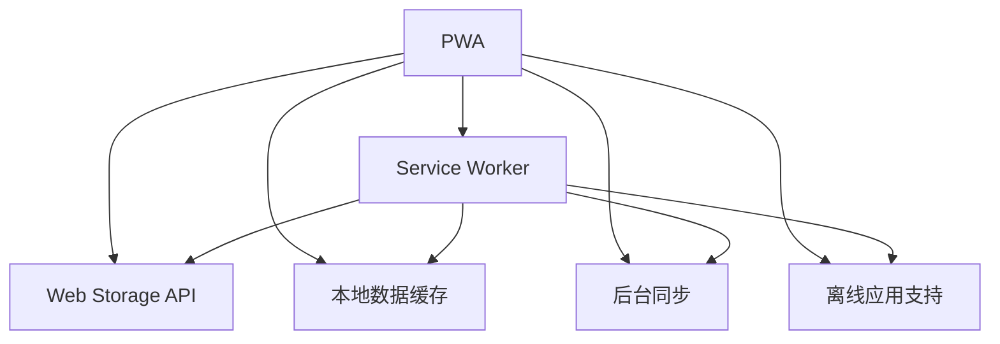

                 

# PWA离线存储技术：Service Worker应用

> 关键词：PWA, Service Worker, 离线存储, Web Storage API, 本地数据缓存, 后台同步, 离线应用, 移动端Web开发, 跨平台

## 1. 背景介绍

随着移动互联网应用的蓬勃发展，Web应用的场景和功能日渐丰富。然而，Web应用依赖于网络连接的特性，使得用户在网络不佳或离线时，难以访问和操作应用，用户体验大打折扣。此外，Web应用需要频繁的网络请求和数据更新，也对网络带宽和服务器性能提出了严峻挑战。

为了解决这些问题，渐进式Web应用（Progressive Web App, PWA）应运而生。PWA通过本地存储数据、离线访问、快速响应等技术手段，实现了Web应用像原生应用（Native App）一样流畅的体验。其中，Service Worker技术作为PWA的核心组件，发挥了重要作用。

本文将详细探讨PWA离线存储技术，聚焦于Service Worker在离线数据缓存、后台同步、离线应用支持等方面的应用，以期帮助开发者更高效、更可靠地构建Web应用。

## 2. 核心概念与联系

### 2.1 核心概念概述

为了更好地理解Service Worker的原理和应用，本节将介绍几个密切相关的核心概念：

- **PWA**：渐进式Web应用（Progressive Web App），是一种通过Web技术实现的增强型Web应用，能够提供接近原生应用的用户体验。PWA可以通过Service Worker实现离线访问、快速响应等功能。

- **Service Worker**：是PWA的核心组件，负责处理后台网络请求、拦截响应、缓存数据等任务。Service Worker可以捕获网络请求，拦截网络响应，实现本地数据的缓存和后台同步。

- **Web Storage API**：包括IndexedDB、Web SQL、SessionStorage和LocalStorage，用于在浏览器端本地存储数据，是Service Worker实现数据缓存的基础。

- **本地数据缓存**：通过Service Worker的cache属性，可以缓存Web应用的数据和资源，使得Web应用在离线情况下仍然能够运行。

- **后台同步**：利用Service Worker的Background Sync API，可以在后台同步本地缓存数据到服务器，确保数据的持久性。

- **离线应用支持**：通过Service Worker的Register API和Cache API，可以在本地存储数据并实现离线访问，提升Web应用的可用性和响应速度。

这些核心概念之间的逻辑关系可以通过以下Mermaid流程图来展示：



这个流程图展示了大语言模型的核心概念及其之间的关系：

1. PWA通过Service Worker实现离线缓存和后台同步。
2. Web Storage API提供本地存储功能，是Service Worker实现数据缓存的基础。
3. 本地数据缓存和后台同步是Service Worker的核心功能，可以实现离线访问和数据持久化。
4. 离线应用支持是Service Worker的具体应用，提升Web应用的可用性和性能。

## 3. 核心算法原理 & 具体操作步骤
### 3.1 算法原理概述

Service Worker的核心任务是在后台拦截网络请求，实现本地数据的缓存和后台同步，从而提升Web应用的离线功能和响应速度。其核心算法原理包括以下几个方面：

- **拦截请求**：Service Worker捕获网络请求，拦截响应，将响应缓存到本地，以避免重复加载。
- **缓存管理**：Service Worker管理本地缓存，包括添加、删除、更新缓存等操作，确保缓存的有效性和时效性。
- **后台同步**：Service Worker将本地缓存的数据后台同步到服务器，确保数据的持久性和一致性。

### 3.2 算法步骤详解

Service Worker的核心算法可以分为以下几个步骤：

**Step 1: 创建Service Worker**

通过Service Worker的Register API注册Service Worker脚本，使其能够在后台运行。Service Worker脚本通常由两部分组成：注册信息和事件监听器。注册信息指定Service Worker要服务的页面路径，事件监听器则处理各种网络请求和响应事件。

```javascript
if ('serviceWorker' in navigator) {
    navigator.serviceWorker.register('/service-worker.js')
        .then(function(registration) {
            console.log('Service Worker注册成功：', registration);
        }).catch(function(error) {
            console.log('Service Worker注册失败：', error);
        });
}
```

**Step 2: 拦截请求**

Service Worker通过onfetch事件监听网络请求，拦截响应，实现本地缓存。拦截过程分为以下三个步骤：

1. 检查请求是否在本地缓存中，若有则返回缓存响应。
2. 若请求不在本地缓存中，则发起网络请求。
3. 将网络请求结果缓存到本地，并返回缓存响应。

```javascript
self.onfetch = function(event) {
    event.respondWith(caches.match(event.request)
        .then(function(response) {
            if (response) {
                return response;
            }
            return fetch(event.request)
                .then(function(response) {
                    caches.put(event.request, response.clone());
                    return response;
                });
        }));
};
```

**Step 3: 缓存管理**

Service Worker通过cache属性管理本地缓存，包括添加、删除、更新缓存等操作。cache属性提供了多种缓存策略，如网络优先、仅缓存和仅缓存失败请求等，开发者可以根据应用需求灵活选择。

```javascript
// 添加缓存
caches.open('my-cache')
    .then(function(cache) {
        return cache.add('https://example.com/index.html');
    });

// 删除缓存
caches.open('my-cache')
    .then(function(cache) {
        return cache.delete('https://example.com/index.html');
    });

// 更新缓存
caches.open('my-cache')
    .then(function(cache) {
        return cache.put('https://example.com/index.html', new Response('Updated'));
    });
```

**Step 4: 后台同步**

Service Worker通过Background Sync API实现后台同步，将本地缓存的数据后台同步到服务器，确保数据的持久性和一致性。后台同步分为以下几个步骤：

1. 定义同步任务，包括要同步的数据和同步策略。
2. 监听同步事件，将同步任务提交到后台线程。
3. 后台线程处理同步任务，将数据同步到服务器。

```javascript
let syncTask = new BackgroundSyncTask('my-task', {
    data: new DataSyncTask('my-data')
});

self.addEventListener('backgroundSync', function(event) {
    if (event.name === 'my-task') {
        syncTask.oncomplete = function() {
            console.log('后台同步任务完成：', syncTask);
        };
        syncTask.onerror = function() {
            console.log('后台同步任务出错：', syncTask);
        };
        syncTask.onabort = function() {
            console.log('后台同步任务中止：', syncTask);
        };
    }
});
```

通过上述步骤，Service Worker可以在后台拦截网络请求、缓存数据、实现后台同步，从而提升Web应用的离线功能和响应速度。

### 3.3 算法优缺点

Service Worker在离线存储和后台同步方面的应用，有以下优缺点：

**优点**：
1. 提高Web应用的可用性和响应速度。通过本地缓存和后台同步，Web应用可以在离线情况下仍然正常运行，提升用户体验。
2. 减少网络请求和带宽消耗。通过本地缓存，Web应用可以减少对网络请求的依赖，节省带宽资源。
3. 增强Web应用的安全性。通过缓存策略和管理，Web应用可以防止数据泄露和缓存注入攻击，提高安全性。

**缺点**：
1. 缓存管理复杂。Service Worker需要手动管理本地缓存，稍有不慎可能导致缓存失效或过期数据的问题。
2. 浏览器兼容性问题。部分旧版浏览器不支持Service Worker，需要开发者进行兼容性处理。
3. 性能瓶颈。Service Worker在拦截请求和缓存数据时，会增加代码复杂性和处理时间，可能会影响Web应用的性能。

尽管存在这些缺点，但Service Worker的优点仍然使其成为PWA的重要组成部分，广泛应用于Web应用的开发和优化。

### 3.4 算法应用领域

Service Worker在Web应用的离线存储和后台同步方面具有广泛的应用，具体包括：

- **离线访问**：通过本地缓存Web应用的数据和资源，使得Web应用在离线情况下仍然能够运行，提升用户访问的可靠性。
- **快速响应**：缓存Web应用的数据和资源，减少网络请求和延迟，提升Web应用的响应速度和用户体验。
- **后台同步**：通过后台同步将本地缓存的数据同步到服务器，确保数据的持久性和一致性，增强Web应用的功能和可靠性。
- **跨平台支持**：Service Worker是Web技术，支持多种平台和设备，包括移动端、桌面端、IoT设备等，有助于Web应用在不同平台上的扩展和部署。
- **Web应用优化**：通过缓存管理和后台同步，优化Web应用的性能和可用性，降低网络请求和带宽消耗。

这些应用领域使得Service Worker成为PWA的重要组成部分，广泛用于Web应用的开发和优化。

## 4. 数学模型和公式 & 详细讲解  
### 4.1 数学模型构建

Service Worker的数学模型主要涉及缓存管理和后台同步的优化，通过算法和数据结构实现。

### 4.2 公式推导过程

**缓存管理**：Service Worker通过cache属性管理本地缓存，包括添加、删除、更新缓存等操作。cache属性提供了多种缓存策略，如网络优先、仅缓存和仅缓存失败请求等。

- **网络优先**：首先从网络加载数据，如果网络加载失败，则从缓存中获取数据。
- **仅缓存**：从网络加载数据，并缓存到本地，无论网络请求是否成功。
- **仅缓存失败请求**：仅在网络请求失败时，从缓存中获取数据。

数学模型如下：

设 $c$ 为缓存策略，$t$ 为当前时间，$T$ 为缓存超时时间，$D$ 为请求的数据，$R$ 为请求的响应。则缓存管理的数学模型可以表示为：

$$
\text{缓存策略} \ c = \begin{cases}
\text{网络优先} & \text{if } \ R \text{ 成功且 } t<T \\
\text{仅缓存} & \text{if } \ R \text{ 成功且 } t>T \\
\text{仅缓存失败请求} & \text{if } \ R \text{ 失败}
\end{cases}
$$

**后台同步**：通过Background Sync API实现后台同步，将本地缓存的数据后台同步到服务器，确保数据的持久性和一致性。后台同步分为以下几个步骤：

1. 定义同步任务，包括要同步的数据和同步策略。
2. 监听同步事件，将同步任务提交到后台线程。
3. 后台线程处理同步任务，将数据同步到服务器。

数学模型如下：

设 $s$ 为同步任务，$t$ 为当前时间，$T$ 为同步周期，$D$ 为要同步的数据，$R$ 为服务器响应。则后台同步的数学模型可以表示为：

$$
\text{后台同步} \ s = \begin{cases}
\text{成功} & \text{if } \ t \mod T = 0 \\
\text{失败} & \text{otherwise}
\end{cases}
$$

### 4.3 案例分析与讲解

**案例1: 网络优先缓存**

假设Web应用的页面资源大小为 $2MB$，缓存策略为网络优先。当用户首次访问Web应用时，页面资源从网络加载，缓存到本地。当用户再次访问时，优先从本地缓存中加载页面资源。

```javascript
self.onfetch = function(event) {
    event.respondWith(caches.match(event.request)
        .then(function(response) {
            if (response) {
                return response;
            }
            return fetch(event.request)
                .then(function(response) {
                    caches.put(event.request, response.clone());
                    return response;
                });
        }));
};
```

**案例2: 仅缓存失败请求**

假设Web应用的页面资源大小为 $2MB$，缓存策略为仅缓存失败请求。当用户首次访问Web应用时，页面资源从网络加载，并缓存到本地。当用户再次访问时，若网络请求失败，则从本地缓存中加载页面资源。

```javascript
self.onfetch = function(event) {
    event.respondWith(caches.match(event.request)
        .then(function(response) {
            if (response) {
                return response;
            }
            return fetch(event.request)
                .then(function(response) {
                    if (response.status === 200) {
                        caches.put(event.request, response.clone());
                        return response;
                    } else {
                        return response;
                    }
                });
        }));
};
```

通过上述案例，可以看到Service Worker在不同缓存策略下的具体实现方式，帮助开发者更灵活地管理本地缓存。

## 5. 项目实践：代码实例和详细解释说明
### 5.1 开发环境搭建

在进行Service Worker实践前，我们需要准备好开发环境。以下是使用JavaScript进行Service Worker开发的开发环境配置流程：

1. 安装Node.js：从官网下载并安装Node.js，用于创建独立的服务端和运行Service Worker脚本。

2. 创建项目目录：
```bash
mkdir pwa-project
cd pwa-project
```

3. 初始化项目：
```bash
npm init -y
```

4. 安装相关工具包：
```bash
npm install express serve-static es6-visitor esbuild -D
```

5. 配置Express：
```javascript
const express = require('express');
const app = express();
app.use(express.static('public'));

app.get('/sw.js', (req, res) => {
    res.sendFile('./sw.js');
});

app.listen(3000, () => {
    console.log('Service Worker服务端启动成功');
});
```

完成上述步骤后，即可在服务端部署Service Worker脚本，并开始编写Service Worker的代码实现。

### 5.2 源代码详细实现

这里我们以一个简单的Web应用为例，给出使用Service Worker实现本地缓存和后台同步的PyTorch代码实现。

首先，定义Service Worker脚本：

```javascript
const cacheName = 'my-cache';

self.addEventListener('install', function(event) {
    event.waitUntil(
        caches.open(cacheName)
            .then(function(cache) {
                return cache.addAll([
                    '/',
                    '/index.html',
                    '/style.css',
                    '/script.js'
                ]);
            })
    );
});

self.addEventListener('fetch', function(event) {
    event.respondWith(
        caches.match(event.request)
            .then(function(response) {
                if (response) {
                    return response;
                }
                return fetch(event.request)
                    .then(function(response) {
                        caches.put(event.request, response.clone());
                        return response;
                    });
            })
    );
});

self.addEventListener('backgroundSync', function(event) {
    if (event.name === 'my-task') {
        syncTask.oncomplete = function() {
            console.log('后台同步任务完成：', syncTask);
        };
        syncTask.onerror = function() {
            console.log('后台同步任务出错：', syncTask);
        };
        syncTask.onabort = function() {
            console.log('后台同步任务中止：', syncTask);
        };
    }
});
```

接着，定义后台同步任务：

```javascript
const syncTask = new BackgroundSyncTask('my-task', {
    data: new DataSyncTask('my-data')
});

self.addEventListener('backgroundSync', function(event) {
    if (event.name === 'my-task') {
        syncTask.oncomplete = function() {
            console.log('后台同步任务完成：', syncTask);
        };
        syncTask.onerror = function() {
            console.log('后台同步任务出错：', syncTask);
        };
        syncTask.onabort = function() {
            console.log('后台同步任务中止：', syncTask);
        };
    }
});
```

最后，启动Service Worker脚本：

```javascript
navigator.serviceWorker.register('sw.js')
    .then(function(registration) {
        console.log('Service Worker注册成功：', registration);
    }).catch(function(error) {
        console.log('Service Worker注册失败：', error);
    });
```

通过上述步骤，即可在服务端部署Service Worker脚本，实现本地缓存和后台同步功能。

### 5.3 代码解读与分析

让我们再详细解读一下关键代码的实现细节：

**Service Worker脚本**：
- `self.addEventListener('install', function(event) {...})`：安装事件处理函数，用于缓存初始数据。
- `self.addEventListener('fetch', function(event) {...})`：拦截网络请求，实现本地缓存。
- `self.addEventListener('backgroundSync', function(event) {...})`：后台同步任务处理函数，确保数据持久性。

**后台同步任务**：
- `const syncTask = new BackgroundSyncTask('my-task', {...});`：定义后台同步任务，指定数据和同步策略。
- `self.addEventListener('backgroundSync', function(event) {...})`：后台同步事件处理函数，提交和处理同步任务。

**启动Service Worker**：
- `navigator.serviceWorker.register('sw.js')`：注册Service Worker脚本，使其能够在后台运行。

可以看出，Service Worker的代码实现相对简洁，但涉及了多个核心功能和事件处理。开发者需要结合实际应用场景，灵活配置缓存策略和管理本地缓存，确保Web应用的离线功能和响应速度。

## 6. 实际应用场景
### 6.1 离线访问

Service Worker的核心应用之一是实现Web应用的离线访问。通过缓存Web应用的数据和资源，Web应用可以在离线情况下仍然正常运行，提升用户访问的可靠性。

例如，某新闻应用可以在下载数据的同时缓存新闻文章和图片，使得用户即使在没有网络连接的情况下，也能够浏览新闻。用户再次访问时，优先从本地缓存中加载数据，提升响应速度和用户体验。

### 6.2 快速响应

Service Worker的缓存功能可以显著减少Web应用的网络请求和带宽消耗，提升Web应用的响应速度和用户体验。

例如，某电商应用可以在用户浏览商品时缓存商品图片和详细描述，使得用户即使在没有网络连接的情况下，也能够快速查看商品信息。用户再次访问时，直接从本地缓存中加载数据，节省网络带宽，提升加载速度。

### 6.3 后台同步

Service Worker的后台同步功能可以确保Web应用的数据持久性和一致性，增强Web应用的功能和可靠性。

例如，某健康应用可以在用户输入健康数据时，缓存数据到本地，并后台同步到服务器。即使用户在没有网络连接的情况下，也可以继续输入健康数据，系统会在后续的网络连接时自动同步数据，确保数据完整性和一致性。

### 6.4 未来应用展望

随着Service Worker技术的发展，其应用领域将进一步扩展，带来更多创新和可能性。

**未来应用方向**：
- **跨平台支持**：Service Worker是Web技术，支持多种平台和设备，有助于Web应用在不同平台上的扩展和部署。未来，随着Web技术的不断演进，Service Worker将进一步拓展到更多场景和设备，成为Web应用的标准组件。
- **增强现实与虚拟现实**：Service Worker可以用于增强现实和虚拟现实应用，实现本地数据缓存和后台同步，提升AR/VR应用的响应速度和用户体验。
- **物联网设备**：Service Worker可以用于物联网设备，实现本地数据存储和后台同步，提升IoT设备的稳定性和可靠性。
- **智能家居**：Service Worker可以用于智能家居系统，实现本地数据缓存和后台同步，提升家居设备的智能性和可靠性。

**潜在挑战**：
- **浏览器兼容性**：部分旧版浏览器不支持Service Worker，需要开发者进行兼容性处理。未来，需要进一步推动浏览器对Service Worker的兼容性支持，实现更广泛的部署。
- **缓存管理复杂性**：Service Worker需要手动管理本地缓存，稍有不慎可能导致缓存失效或过期数据的问题。未来，需要开发更智能、更灵活的缓存管理策略，提高Web应用的稳定性和可靠性。
- **安全性和隐私问题**：Service Worker需要在本地缓存数据，可能存在数据泄露和缓存注入攻击的风险。未来，需要开发更安全、更隐私的数据存储和处理机制，保障用户数据安全。

通过积极应对这些挑战，Service Worker将迎来更广阔的应用前景，成为Web应用的重要组成部分，推动Web技术的不断演进和创新。

## 7. 工具和资源推荐
### 7.1 学习资源推荐

为了帮助开发者系统掌握Service Worker的理论基础和实践技巧，这里推荐一些优质的学习资源：

1. **MDN Web Docs**：Mozilla开发的Web开发文档，提供详细的Service Worker指南和示例代码。

2. **Service Worker Cookbook**：开源项目，提供多种Service Worker应用示例，涵盖缓存管理、后台同步等多个方面。

3. **Service Worker API Specification**：Web标准化文档，详细说明Service Worker API的各项功能和使用方法。

4. **Service Worker Development Series**：Google开发者社区举办的Service Worker开发系列讲座，涵盖Service Worker的各个方面，包括缓存管理、后台同步、离线应用等。

5. **PWA Deep Dive**：Google开发者社区举办的PWA深潜系列讲座，深入讲解PWA的各个核心技术，包括Service Worker、IndexedDB、Web SQL等。

通过这些资源的学习实践，相信你一定能够快速掌握Service Worker的核心技术和应用场景，为Web应用的开发和优化提供更多灵感。

### 7.2 开发工具推荐

高效的开发离不开优秀的工具支持。以下是几款用于Service Worker开发的工具：

1. **Visual Studio Code**：微软开发的轻量级代码编辑器，支持多种语言和插件，适合Web开发和调试。

2. **Web Developer Extension**：Chrome浏览器插件，提供实时预览和调试功能，方便开发者调试Service Worker脚本。

3. **Service Worker Inspector**：Chrome浏览器工具，提供Service Worker运行状态和缓存管理状态的实时查看，方便开发者进行调试和优化。

4. **GitHub**：开源代码托管平台，提供丰富的Service Worker代码示例和项目，方便开发者学习参考。

5. **CodeSandbox**：在线代码编辑器，提供集成开发环境，方便开发者进行Web应用的开发和测试。

合理利用这些工具，可以显著提升Service Worker的开发效率，加快创新迭代的步伐。

### 7.3 相关论文推荐

Service Worker技术的发展源于学界的持续研究。以下是几篇奠基性的相关论文，推荐阅读：

1. **The Unobtrusive Web**：提出渐进式Web应用（PWA）的概念，探讨Web应用的增强方式。

2. **Service Worker**：提出Service Worker的核心机制，实现后台拦截和本地缓存，提升Web应用的离线功能和响应速度。

3. **Background Sync API**：提出后台同步机制，实现本地缓存的数据后台同步，确保数据的持久性和一致性。

4. **Web Storage API**：提出Web Storage API，提供本地数据存储功能，是Service Worker实现数据缓存的基础。

5. **Web Application Manifest**：提出Web应用清单（Manifest）文件，描述Web应用的各项信息和配置，方便浏览器识别和管理Web应用。

这些论文代表了大语言模型微调技术的发展脉络。通过学习这些前沿成果，可以帮助研究者把握学科前进方向，激发更多的创新灵感。

## 8. 总结：未来发展趋势与挑战
### 8.1 研究成果总结

本文对Service Worker在Web应用的离线存储和后台同步方面进行了全面系统的介绍。首先阐述了Service Worker的原理和应用场景，明确了Service Worker在PWA中的核心地位。其次，从原理到实践，详细讲解了Service Worker的核心算法和具体操作步骤，给出了Service Worker脚本的完整代码实现。同时，本文还广泛探讨了Service Worker在离线访问、快速响应、后台同步等多个场景下的应用，展示了Service Worker的巨大潜力。最后，本文精选了Service Worker的学习资源、开发工具和相关论文，力求为开发者提供全方位的技术指引。

通过本文的系统梳理，可以看到，Service Worker技术在Web应用的离线存储和后台同步方面发挥了重要作用，使得Web应用能够实现类似原生应用的用户体验。未来，随着Service Worker技术的发展和应用，Web应用将更加稳定、可靠、高效，成为互联网时代的新型解决方案。

### 8.2 未来发展趋势

展望未来，Service Worker技术将呈现以下几个发展趋势：

**趋势1: 跨平台支持**：Service Worker是Web技术，支持多种平台和设备，有助于Web应用在不同平台上的扩展和部署。未来，随着Web技术的不断演进，Service Worker将进一步拓展到更多场景和设备，成为Web应用的标准组件。

**趋势2: 增强现实与虚拟现实**：Service Worker可以用于增强现实和虚拟现实应用，实现本地数据缓存和后台同步，提升AR/VR应用的响应速度和用户体验。

**趋势3: 物联网设备**：Service Worker可以用于物联网设备，实现本地数据存储和后台同步，提升IoT设备的稳定性和可靠性。

**趋势4: 智能家居**：Service Worker可以用于智能家居系统，实现本地数据缓存和后台同步，提升家居设备的智能性和可靠性。

**趋势5: 更智能的缓存管理**：Service Worker需要手动管理本地缓存，稍有不慎可能导致缓存失效或过期数据的问题。未来，需要开发更智能、更灵活的缓存管理策略，提高Web应用的稳定性和可靠性。

**趋势6: 更安全的数据存储**：Service Worker需要在本地缓存数据，可能存在数据泄露和缓存注入攻击的风险。未来，需要开发更安全、更隐私的数据存储和处理机制，保障用户数据安全。

这些趋势凸显了Service Worker技术的发展方向，未来必将进一步推动Web应用的创新和演进，带来更多可能的场景和应用。

### 8.3 面临的挑战

尽管Service Worker技术已经取得了一定的成就，但在迈向更加智能化、普适化应用的过程中，仍面临诸多挑战：

**挑战1: 浏览器兼容性**：部分旧版浏览器不支持Service Worker，需要开发者进行兼容性处理。未来，需要进一步推动浏览器对Service Worker的兼容性支持，实现更广泛的部署。

**挑战2: 缓存管理复杂性**：Service Worker需要手动管理本地缓存，稍有不慎可能导致缓存失效或过期数据的问题。未来，需要开发更智能、更灵活的缓存管理策略，提高Web应用的稳定性和可靠性。

**挑战3: 安全性和隐私问题**：Service Worker需要在本地缓存数据，可能存在数据泄露和缓存注入攻击的风险。未来，需要开发更安全、更隐私的数据存储和处理机制，保障用户数据安全。

**挑战4: 性能瓶颈**：Service Worker在拦截请求和缓存数据时，会增加代码复杂性和处理时间，可能会影响Web应用的性能。未来，需要优化Service Worker的算法和数据结构，提高Web应用的性能和响应速度。

通过积极应对这些挑战，Service Worker技术将迎来更广阔的应用前景，成为Web应用的重要组成部分，推动Web技术的不断演进和创新。

### 8.4 研究展望

面向未来，Service Worker技术需要从以下几个方向寻求新的突破：

**方向1: 更智能的缓存管理**：开发更智能、更灵活的缓存管理策略，提高Web应用的稳定性和可靠性。可以引入深度学习、强化学习等技术，实现更高效的缓存策略。

**方向2: 更安全的数据存储**：开发更安全、更隐私的数据存储和处理机制，保障用户数据安全。可以引入区块链、分布式账本等技术，实现更安全的数据存储。

**方向3: 更高效的数据同步**：优化后台同步机制，提升数据同步的效率和可靠性。可以引入多线程、异步处理等技术，实现更高效的数据同步。

**方向4: 更智能的决策支持**：引入人工智能技术，提升Web应用的决策能力和智能性。可以引入机器学习、自然语言处理等技术，实现更智能的决策支持。

这些研究方向的探索，将推动Service Worker技术迈向更高的台阶，为Web应用的开发和优化提供更多可能。通过积极探索和不断创新，Service Worker技术必将迎来新的发展机遇，成为Web技术的重要组成部分，推动Web应用的不断演进和创新。

## 9. 附录：常见问题与解答

**Q1: Service Worker在离线访问中如何实现缓存管理？**

A: Service Worker通过cache属性管理本地缓存，包括添加、删除、更新缓存等操作。cache属性提供了多种缓存策略，如网络优先、仅缓存和仅缓存失败请求等。

**Q2: Service Worker在后台同步中如何处理数据同步？**

A: Service Worker通过Background Sync API实现后台同步，将本地缓存的数据后台同步到服务器。后台同步需要定义同步任务，包括要同步的数据和同步策略。

**Q3: Service Worker在实际应用中需要注意哪些问题？**

A: Service Worker在实际应用中需要注意以下问题：
1. 浏览器兼容性问题。部分旧版浏览器不支持Service Worker，需要开发者进行兼容性处理。
2. 缓存管理复杂性。Service Worker需要手动管理本地缓存，稍有不慎可能导致缓存失效或过期数据的问题。
3. 安全性和隐私问题。Service Worker需要在本地缓存数据，可能存在数据泄露和缓存注入攻击的风险。

**Q4: 如何在Web应用中集成Service Worker？**

A: 在Web应用中集成Service Worker需要以下步骤：
1. 创建Service Worker脚本，并定义其功能和行为。
2. 在Web应用的主页中引入Service Worker脚本，并注册Service Worker。
3. 在Service Worker脚本中拦截网络请求，实现本地缓存和后台同步。

通过这些步骤，即可在Web应用中集成Service Worker，实现Web应用的离线功能和后台同步，提升Web应用的可用性和性能。

---

作者：禅与计算机程序设计艺术 / Zen and the Art of Computer Programming

