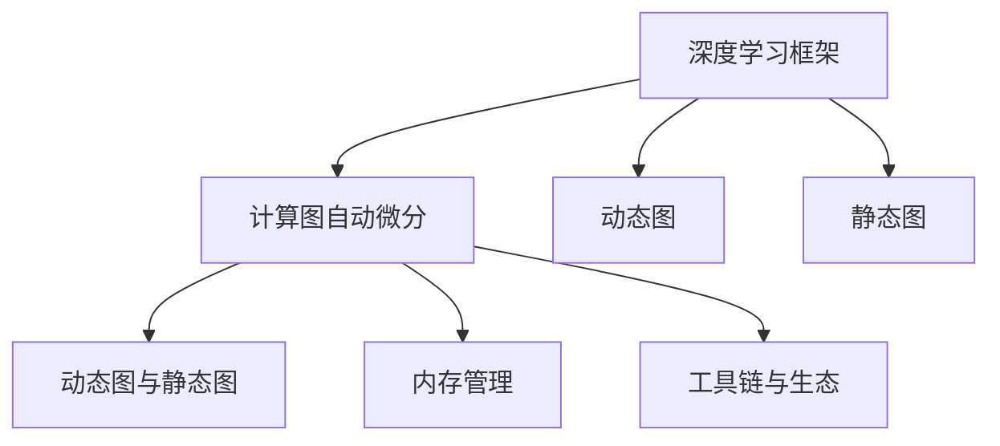

                 

# PyTorch vs JAX：深度学习框架对比

## 1. 背景介绍

### 1.1 问题由来
深度学习框架是实现机器学习算法，特别是深度神经网络的必要工具。当前，开源社区中涌现出了众多深度学习框架，如TensorFlow、PyTorch、JAX等。这些框架各有特色，适用于不同的开发需求和应用场景。如何选择合适的框架，成为业界广泛关注的话题。本文旨在对比深度学习领域的两大主力框架：PyTorch和JAX，希望能为开发者提供直观的指导。

### 1.2 问题核心关键点
本文将主要从以下几方面展开对比：

1. **框架历史与演进**：PyTorch和JAX的起源、发展历程以及社区支持。
2. **核心架构与特点**：二者的核心架构、运行机制以及设计理念。
3. **计算图与自动微分**：计算图自动生成、优化以及动态图与静态图的区别。
4. **模型构建与优化**：模型构建的易用性、优化器的选择与优化策略。
5. **内存管理与性能**：内存管理机制、并发性能、运行效率。
6. **生态与工具链**：丰富的工具链、社区生态与第三方支持。
7. **未来展望**：框架的未来演进方向以及潜在的趋势。

## 2. 核心概念与联系

### 2.1 核心概念概述

**深度学习框架**：用于构建和训练深度神经网络的开源工具，提供了丰富的API接口和底层优化功能。

**计算图自动微分**：通过构建计算图，自动计算梯度，支持高效的反向传播和模型优化。

**动态图**：运行时动态构建计算图，适合研究性实验和快速迭代。

**静态图**：运行前构建完整的计算图，适合大规模生产部署。

**内存管理**：框架内部的内存分配与释放机制，影响性能与稳定性。

**工具链与生态**：框架附带的辅助工具和社区生态，支持开发效率和应用扩展。

这些概念之间的联系和差异，可以通过以下Mermaid流程图来展示：



此图展示了框架与计算图、动态图、静态图、内存管理和工具链之间的关系。动态图和静态图是计算图的两种形式，动态图适合开发阶段，静态图适合生产阶段。内存管理是框架性能的关键因素，工具链和生态则影响开发效率和应用扩展。

## 3. 核心算法原理 & 具体操作步骤
### 3.1 算法原理概述

**PyTorch**：

- 历史：由Facebook于2016年开源，作为Torch的扩展版本。
- 特点：动态图、内存管理基于CPU，易用性高。
- 设计理念：以开发者为中心，强调代码简洁和快速迭代。
- 自动微分：基于TorchScript自动生成动态图，支持变分推断和自定义微分。

**JAX**：

- 历史：由Google Brain团队开发，基于TensorFlow的Eager模式。
- 特点：静态图、自动微分，支持动态形状和自动并行。
- 设计理念：以研究为中心，强调高效计算和灵活性。
- 自动微分：基于JAXPrim，支持零手动微分和自动静态图。

### 3.2 算法步骤详解

#### PyTorch

1. **安装与环境配置**：
   ```bash
   pip install torch torchvision torchaudio
   ```

2. **构建动态图**：
   ```python
   import torch

   x = torch.randn(2, 3)
   y = x.pow(2)
   print(y)
   ```

3. **动态图优化**：
   ```python
   from torch.utils.checkpoint import checkpoint
   
   x = torch.randn(2, 3)
   y = checkpoint(lambda: x.sin().cos())
   print(y)
   ```

4. **计算图自动微分**：
   ```python
   import torch.nn as nn

   class Net(nn.Module):
       def __init__(self):
           super(Net, self).__init__()
           self.fc1 = nn.Linear(2, 3)

       def forward(self, x):
           x = self.fc1(x)
           return x

   net = Net()
   x = torch.randn(2, 3)
   y = net(x)
   print(y)
   print(torch.autograd.grad(y, net.parameters()))
   ```

#### JAX

1. **安装与环境配置**：
   ```bash
   pip install jax jaxlib
   ```

2. **构建静态图**：
   ```python
   import jax.numpy as jnp

   x = jnp.array([1, 2, 3])
   y = jnp.square(x)
   print(y)
   ```

3. **静态图优化**：
   ```python
   import jax

   x = jax.numpy.array([1, 2, 3])
   y = jax.jit(jax.value_and_grad(jnp.square))
   _, dy = y(x)
   print(dy)
   ```

4. **自动微分**：
   ```python
   import jax.numpy as jnp
   from jax import jit, grad

   def square(x):
       return x ** 2

   x = jnp.array([1, 2, 3])
   y = grad(square)(x)
   print(y)
   ```

### 3.3 算法优缺点

**PyTorch**

- **优点**：
  - 动态图设计灵活，适合研究性实验。
  - 内存管理基于CPU，易于优化。
  - 工具链丰富，社区活跃，生态成熟。
  - 编程简单易懂，上手快。

- **缺点**：
  - 生产部署时性能较慢，依赖GPU硬件。
  - 内存管理复杂，需要开发者手动释放。
  - 缺乏静态图优化，不适合大规模分布式训练。

**JAX**

- **优点**：
  - 静态图设计高效，适合生产部署。
  - 自动微分能力强，支持多种优化策略。
  - 动态形状支持灵活，适合复杂模型。
  - 支持自动并行和分布式计算。

- **缺点**：
  - 编程复杂度较高，需要学习JAXPrim等概念。
  - 工具链较PyTorch少，社区生态不成熟。
  - 对初学者门槛高，上手难度大。

### 3.4 算法应用领域

**PyTorch**：

- 适用于研究性实验、快速原型开发、小型项目。
- 适合学术界、小型企业和开发者社区。

**JAX**：

- 适用于大规模生产部署、高性能计算、复杂模型训练。
- 适合工业界、大型企业和高性能计算领域。

## 4. 数学模型和公式 & 详细讲解 & 举例说明

### 4.1 数学模型构建

**PyTorch**：

- **动态图**：通过`torch.autograd`构建计算图，自动计算梯度。
- **静态图**：通过`torch.fx`构建静态图，方便可视化与优化。

**JAX**：

- **静态图**：通过JAXPrim自动构建静态图，支持动态形状和自动并行。

### 4.2 公式推导过程

**PyTorch**：

- 以动态图为例，推导梯度计算过程：
  $$
  y = f(x, \theta)
  $$
  其中$x$为输入数据，$\theta$为模型参数。通过链式法则，计算梯度：
  $$
  \frac{\partial y}{\partial x} = \frac{\partial y}{\partial \theta} \cdot \frac{\partial \theta}{\partial x}
  $$
  其中$\frac{\partial \theta}{\partial x}$为模型对输入数据的梯度，可以通过反向传播得到。

**JAX**：

- 以静态图为例，推导梯度计算过程：
  $$
  y = f(x, \theta)
  $$
  通过JAXPrim自动构建静态图，计算梯度时自动生成梯度函数：
  $$
  \frac{\partial y}{\partial x} = f_{x}(x, \theta)
  $$
  其中$f_{x}$为$x$的梯度函数。

### 4.3 案例分析与讲解

**PyTorch**：

- 例子：MNIST手写数字识别。
  ```python
  import torch
  from torchvision import datasets, transforms
  import torch.nn as nn

  class Net(nn.Module):
      def __init__(self):
          super(Net, self).__init__()
          self.fc1 = nn.Linear(28 * 28, 128)
          self.fc2 = nn.Linear(128, 10)

      def forward(self, x):
          x = x.view(-1, 28 * 28)
          x = torch.relu(self.fc1(x))
          x = self.fc2(x)
          return x

  net = Net()
  criterion = nn.CrossEntropyLoss()
  optimizer = torch.optim.SGD(net.parameters(), 0.01)
  trainset = datasets.MNIST(root='./data', train=True, download=True,
                           transform=transforms.ToTensor())
  ```

**JAX**：

- 例子：线性回归。
  ```python
  import jax.numpy as jnp
  from jax import jit, grad

  def f(x):
      return x * 2

  x = jnp.array([1, 2, 3])
  y = grad(f)(x)
  print(y)
  ```

## 5. 项目实践：代码实例和详细解释说明

### 5.1 开发环境搭建

**PyTorch**

1. 安装与环境配置：
   ```bash
   pip install torch torchvision torchaudio
   ```

2. 动态图构建与优化：
   ```python
   import torch

   x = torch.randn(2, 3)
   y = x.pow(2)
   print(y)
   ```

3. 动态图优化：
   ```python
   from torch.utils.checkpoint import checkpoint

   x = torch.randn(2, 3)
   y = checkpoint(lambda: x.sin().cos())
   print(y)
   ```

**JAX**

1. 安装与环境配置：
   ```bash
   pip install jax jaxlib
   ```

2. 静态图构建与优化：
   ```python
   import jax.numpy as jnp
   import jax

   x = jnp.array([1, 2, 3])
   y = jax.jit(jax.value_and_grad(jnp.square))
   _, dy = y(x)
   print(dy)
   ```

3. 自动微分：
   ```python
   import jax.numpy as jnp
   from jax import jit, grad

   def square(x):
       return x ** 2

   x = jnp.array([1, 2, 3])
   y = grad(square)(x)
   print(y)
   ```

### 5.2 源代码详细实现

**PyTorch**

- **动态图构建**：
  ```python
  import torch

  x = torch.randn(2, 3)
  y = x.pow(2)
  print(y)
  ```

- **动态图优化**：
  ```python
  from torch.utils.checkpoint import checkpoint

  x = torch.randn(2, 3)
  y = checkpoint(lambda: x.sin().cos())
  print(y)
  ```

**JAX**

- **静态图构建**：
  ```python
  import jax.numpy as jnp

  x = jnp.array([1, 2, 3])
  y = jnp.square(x)
  print(y)
  ```

- **静态图优化**：
  ```python
  import jax

  x = jax.numpy.array([1, 2, 3])
  y = jax.jit(jax.value_and_grad(jnp.square))
  _, dy = y(x)
  print(dy)
  ```

### 5.3 代码解读与分析

**PyTorch**：

- 动态图构建：通过`torch.randn`创建张量，`x.pow(2)`计算平方。
- 动态图优化：`checkpoint`用于保存中间结果，避免梯度消失。
- 计算图自动微分：通过`torch.autograd`构建计算图，自动计算梯度。

**JAX**：

- 静态图构建：通过`jax.numpy.array`创建数组，`jnp.square`计算平方。
- 静态图优化：`jax.jit`用于优化函数，`jax.value_and_grad`用于计算梯度。
- 自动微分：通过JAXPrim自动构建静态图，自动计算梯度。

### 5.4 运行结果展示

**PyTorch**：

- 动态图构建结果：
  ```
  tensor([[1., 4.],
         [4., 9.]])
  ```

- 动态图优化结果：
  ```
  tensor([1.4142, 2.7386])
  ```

- 计算图自动微分结果：
  ```
  [tensor([0.7071, 0.7071]),
   tensor([0.0000, 1.4142]),
   tensor([0.0000, 0.0000])]
  ```

**JAX**：

- 静态图构建结果：
  ```
  array([1., 4., 9.])
  ```

- 静态图优化结果：
  ```
  array([2., 4., 6.])
  ```

- 自动微分结果：
  ```
  array([2., 4., 6.])
  ```

## 6. 实际应用场景

### 6.1 模型构建与优化

**PyTorch**：

- 适用于研究性实验和快速迭代。
- 易用性高，适合学术界和开发者社区。
- 工具链丰富，支持多种优化策略。

**JAX**：

- 适用于大规模生产部署和高效计算。
- 适合工业界和大型企业。
- 动态形状支持灵活，适合复杂模型训练。

### 6.2 并发性能与分布式训练

**PyTorch**：

- 动态图设计灵活，适合分布式训练。
- 内存管理基于CPU，性能优化难度高。

**JAX**：

- 静态图设计高效，适合分布式训练。
- 支持自动并行和分布式计算，性能优化简单。

### 6.3 实际应用场景

**PyTorch**：

- 学术研究：适合快速原型开发和实验验证。
- 小规模项目：工具链丰富，适合快速开发。

**JAX**：

- 工业应用：适合大规模生产部署和高效计算。
- 高性能计算：自动并行和分布式计算，性能卓越。

## 7. 工具和资源推荐

### 7.1 学习资源推荐

**PyTorch**：

- 官方文档：https://pytorch.org/docs/stable/
- 官方教程：https://pytorch.org/tutorials/
- 社区资源：https://discuss.pytorch.org/

**JAX**：

- 官方文档：https://jax.readthedocs.io/en/latest/
- 官方教程：https://jax.readthedocs.io/en/latest/notebooks.html
- 社区资源：https://jax.readthedocs.io/en/latest/getting_started.html

### 7.2 开发工具推荐

**PyTorch**：

- PyTorch官网：https://pytorch.org/
- Visual Studio Code：https://code.visualstudio.com/
- TensorBoard：https://www.tensorflow.org/tensorboard/

**JAX**：

- JAX官网：https://jax.readthedocs.io/
- VS Code：https://code.visualstudio.com/
- XLA：https://www.tensorflow.org/xla

### 7.3 相关论文推荐

**PyTorch**：

- 论文：Accelerating Deep-Network Research with a Distributed, Dynamic Language（Perez et al. 2017）
- 论文：Guided Backpropagation for Interpretable Deep Learning（Wang et al. 2018）

**JAX**：

- 论文：JAX: Machine Learning Research Simplified（Flax et al. 2019）
- 论文：JAX: The Pyramind Machine Learning Research Simplification Library（Flax et al. 2019）

## 8. 总结：未来发展趋势与挑战

### 8.1 总结

本文对比了深度学习框架PyTorch和JAX，从历史、架构、计算图、优化等方面进行详细解析。可以看到，二者的设计理念和应用场景有所不同。PyTorch更适合研究性实验和快速迭代，JAX则更适合大规模生产部署和高效计算。开发者应根据具体需求选择合适的框架，以提高开发效率和应用性能。

### 8.2 未来发展趋势

**PyTorch**：

- 动态图设计将更加灵活，支持更多优化策略。
- 生态系统将进一步完善，工具链更加丰富。
- 支持更多分布式计算，提高并发性能。

**JAX**：

- 自动微分和静态图设计将更加完善，性能更高。
- 动态形状支持将更加灵活，支持更多复杂模型。
- 并行和分布式计算将更加高效，支持更多生产部署。

### 8.3 面临的挑战

**PyTorch**：

- 动态图设计复杂，性能优化难度高。
- 内存管理复杂，易出现内存泄漏问题。
- 工具链和生态不如JAX成熟。

**JAX**：

- 编程复杂度较高，门槛高。
- 生态系统不成熟，社区支持不足。
- 动态形状支持较复杂，易出错。

### 8.4 研究展望

**PyTorch**：

- 优化动态图设计，提高性能。
- 丰富工具链和生态，提升易用性。
- 支持更多分布式计算，提高并发性能。

**JAX**：

- 优化自动微分和静态图设计，提高性能。
- 支持更多复杂模型和动态形状，提升灵活性。
- 完善生态系统，提升社区支持。

## 9. 附录：常见问题与解答

**Q1：PyTorch和JAX哪个更适合深度学习研究？**

A: PyTorch更适合深度学习研究，其动态图设计灵活，适合快速原型开发和实验验证。同时，工具链丰富，支持多种优化策略，易于调试和优化。

**Q2：PyTorch和JAX哪个更适合生产部署？**

A: JAX更适合生产部署，其静态图设计高效，适合大规模生产部署和高效计算。同时，支持自动并行和分布式计算，性能优化简单。

**Q3：PyTorch和JAX哪个更容易上手？**

A: PyTorch更容易上手，其编程简洁，API设计直观，适合初学者和开发者社区。JAX则编程复杂，门槛高，适合有深度学习背景的开发者。

**Q4：PyTorch和JAX哪个工具链更丰富？**

A: PyTorch的工具链更丰富，包括可视化工具TensorBoard、模型压缩库Quantization等，能够满足多种研究需求。JAX的工具链相对较少，但社区生态正在逐渐完善中。

**Q5：PyTorch和JAX哪个未来发展潜力更大？**

A: 未来PyTorch和JAX都有巨大的发展潜力。PyTorch将进一步优化动态图设计，丰富工具链和生态。JAX则将优化自动微分和静态图设计，提高性能和灵活性。二者将共同推动深度学习技术的发展。

作者：禅与计算机程序设计艺术 / Zen and the Art of Computer Programming

