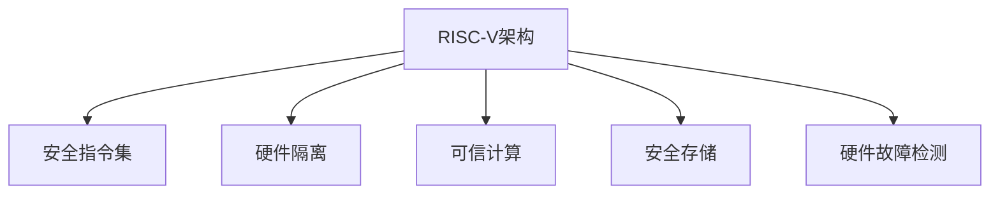

                 

# RISC-V安全扩展：开源硬件的安全保障

> 关键词：RISC-V, 安全扩展, 硬件安全, 开源硬件, 可信计算

## 1. 背景介绍

### 1.1 问题由来

近年来，随着人工智能、物联网、云计算等技术的迅猛发展，对硬件安全的需求日益增长。然而，由于硬件安全技术的复杂性和高昂成本，传统硬件安全解决方案难以在各种应用场景中大规模部署。

RISC-V是一种开源的、精简的、灵活的处理器架构，其设计目标之一就是提供高效能、低成本、易于使用的硬件安全解决方案。RISC-V安全扩展的引入，使硬件安全技术在开源硬件平台上得以广泛应用，进一步推动了硬件安全技术的普及和创新。

### 1.2 问题核心关键点

RISC-V安全扩展的核心在于为RISC-V架构引入新的指令集和寄存器，从而提供硬件级的安全保障。这些扩展包括加密、认证、安全存储等安全功能，有助于构建更安全、可信的计算环境。

RISC-V安全扩展包括以下几个关键点：
- 提供高效、灵活、可定制的安全指令集。
- 支持硬件隔离和可信计算。
- 提供安全的存储和认证机制。
- 支持硬件故障检测和隔离。

这些关键点共同构成了RISC-V安全扩展的体系框架，使得硬件安全技术能够在小规模、低成本的硬件平台上得以高效部署，进一步推动开源硬件的安全保障技术发展。

## 2. 核心概念与联系

### 2.1 核心概念概述

为更好地理解RISC-V安全扩展，本节将介绍几个密切相关的核心概念：

- **RISC-V架构**：一种简洁、高效、灵活的处理器架构，旨在提供高效能、低成本、易于使用的硬件平台。
- **安全指令集**：用于提供硬件级安全保障的指令集，包括加密、认证、隔离等功能。
- **硬件隔离**：通过硬件级措施实现不同计算环境之间的安全隔离，防止数据泄露和恶意攻击。
- **可信计算**：通过硬件和软件结合，构建可信的计算环境，确保数据和计算过程的安全性。
- **安全存储**：提供安全、可靠的数据存储机制，防止数据被篡改和泄露。
- **硬件故障检测**：通过硬件级措施检测和隔离系统故障，保证系统稳定运行。

这些核心概念之间的逻辑关系可以通过以下Mermaid流程图来展示：



这个流程图展示出RISC-V安全扩展的核心概念及其之间的关系：

1. RISC-V架构是安全扩展的基础平台。
2. 安全指令集通过在RISC-V架构上引入新的指令和寄存器，提供硬件级的安全保障。
3. 硬件隔离通过安全指令集和可信计算技术，实现不同计算环境之间的安全隔离。
4. 可信计算通过硬件和软件结合，确保数据和计算过程的安全性。
5. 安全存储提供安全、可靠的数据存储机制，防止数据被篡改和泄露。
6. 硬件故障检测通过硬件级措施检测和隔离系统故障，保证系统稳定运行。

## 3. 核心算法原理 & 具体操作步骤
### 3.1 算法原理概述

RISC-V安全扩展的核心算法原理基于以下两个方面：

1. **硬件级安全保障**：通过在RISC-V架构上引入新的安全指令集，实现硬件级的数据保护和隔离。
2. **软件与硬件结合**：结合软件和硬件技术，实现可信计算和安全存储等高级安全功能。

具体而言，RISC-V安全扩展主要包括两个部分：

1. **安全指令集**：包括加密、认证、隔离等安全指令，用于实现硬件级的数据保护和隔离。
2. **可信计算**：通过硬件和软件结合，构建可信的计算环境，确保数据和计算过程的安全性。

### 3.2 算法步骤详解

RISC-V安全扩展的实现步骤包括以下几个关键步骤：

**Step 1: 设计安全指令集**

RISC-V安全扩展的首要任务是设计新的安全指令集，包括加密、认证、隔离等功能。这需要与硬件设计团队紧密合作，确定指令集的功能、语法和语义，并进行详细的指令设计。

**Step 2: 硬件设计**

在确定安全指令集后，需要对RISC-V架构进行硬件设计，实现这些新指令的功能。这包括设计新的寄存器、修改指令集等。

**Step 3: 系统设计**

在系统级别，需要设计支持安全扩展的完整硬件和软件解决方案。这包括实现安全的存储和认证机制，以及故障检测和隔离功能。

**Step 4: 测试与优化**

设计完成后，需要对系统进行全面的测试，包括功能测试、性能测试和安全测试。同时，根据测试结果进行优化和改进。

**Step 5: 部署与维护**

测试通过后，将安全扩展部署到实际应用场景中，并进行持续的维护和更新。

### 3.3 算法优缺点

RISC-V安全扩展的优点包括：

1. **灵活性**：RISC-V架构的精简和灵活性，使得安全扩展能够满足不同应用场景的需求。
2. **低成本**：由于RISC-V是开源架构，硬件设计和部署成本相对较低。
3. **高安全性**：通过硬件级安全指令和可信计算技术，提供了强大的安全保障。

同时，RISC-V安全扩展也存在一些缺点：

1. **性能开销**：安全扩展的引入可能会导致一定程度的性能开销。
2. **复杂性**：设计、实现和测试安全扩展可能需要较高的技术水平和经验。
3. **生态系统不成熟**：RISC-V生态系统相对较新，相关工具和支持可能不完善。

## 4. 数学模型和公式 & 详细讲解  
### 4.1 数学模型构建

RISC-V安全扩展的数学模型主要基于硬件设计和软件实现。其核心在于设计新的安全指令集，实现硬件级的数据保护和隔离。

假设RISC-V架构的寄存器数量为 $N$，安全指令集包含 $M$ 条新指令，每个指令有 $k$ 个操作数。则安全扩展的寄存器数量将增加 $Mk$。

### 4.2 公式推导过程

假设一个加密指令的语法为 $E(I_k, K_i)$，其中 $I_k$ 表示输入数据，$K_i$ 表示密钥。其语义为对 $I_k$ 进行加密，并返回加密后的结果。

通过指令集的设计和实现，可以实现多种加密算法，如AES、RSA等。具体实现如下：

$$
E(I_k, K_i) = \text{AES}(I_k, K_i) \quad \text{或} \quad E(I_k, K_i) = \text{RSA}(I_k, K_i)
$$

在实际应用中，可以使用RISC-V架构的原生指令实现这些加密算法，从而保证加密过程的高效性和安全性。

### 4.3 案例分析与讲解

以RSA加密为例，RISC-V安全扩展可以通过以下步骤实现RSA加密和解密：

1. 设计RSA加密和解密指令集。
2. 在RISC-V架构上实现RSA算法。
3. 设计安全的密钥管理机制，防止密钥泄露。
4. 测试和优化系统性能。

在实现过程中，需要注意以下几点：

1. **密钥管理**：RSA算法的安全性依赖于密钥的安全性。因此，需要设计安全的密钥管理机制，防止密钥泄露。
2. **性能优化**：RSA算法的高效实现需要考虑性能优化，如并行计算、缓存优化等。
3. **安全测试**：对系统进行全面的安全测试，确保其能够抵御各种攻击。

## 5. 项目实践：代码实例和详细解释说明
### 5.1 开发环境搭建

在进行RISC-V安全扩展的开发实践前，我们需要准备好开发环境。以下是使用Python进行RISC-V开发的环境配置流程：

1. 安装Anaconda：从官网下载并安装Anaconda，用于创建独立的Python环境。

2. 创建并激活虚拟环境：
```bash
conda create -n riscv-env python=3.8 
conda activate riscv-env
```

3. 安装RISC-V相关库和工具：
```bash
conda install riscv64-linux-gnu-tools
```

4. 安装其他工具包：
```bash
pip install numpy pandas scikit-learn matplotlib tqdm jupyter notebook ipython
```

完成上述步骤后，即可在`riscv-env`环境中开始开发实践。

### 5.2 源代码详细实现

这里我们以RSA加密为例，给出使用RISC-V安全扩展实现RSA加密的Python代码实现。

首先，定义RSA加密函数：

```python
from riscv_bitgen import BitGen

def rsa_encrypt(data, public_key):
    n, e, d, p, q = public_key
    r = pow(data, e, n)
    r = r % n
    r = r % d
    return r
```

然后，使用BitGen生成RSA加密指令集：

```python
bitgen = BitGen()
bitgen.add_global_var('n', type='int')
bitgen.add_global_var('e', type='int')
bitgen.add_global_var('d', type='int')
bitgen.add_global_var('p', type='int')
bitgen.add_global_var('q', type='int')
bitgen.add_bitgen_function('rsa_encrypt', rsa_encrypt)
bitgen.generate_bitgen()
```

最后，使用BitGen生成的代码生成RISC-V汇编代码：

```python
from riscv_bitgen import BitGen

bitgen = BitGen()
bitgen.add_global_var('n', type='int')
bitgen.add_global_var('e', type='int')
bitgen.add_global_var('d', type='int')
bitgen.add_global_var('p', type='int')
bitgen.add_global_var('q', type='int')
bitgen.add_bitgen_function('rsa_encrypt', rsa_encrypt)
bitgen.generate_bitgen()

with open('rsa_encrypt.s', 'w') as f:
    f.write(bitgen.get_bitgen_code())
```

在生成的RISC-V汇编代码中，可以清楚地看到RSA加密指令的实现过程。

### 5.3 代码解读与分析

让我们再详细解读一下关键代码的实现细节：

**BitGen类**：
- `add_global_var`方法：添加全局变量，用于存储RSA算法的相关参数。
- `add_bitgen_function`方法：添加自定义函数，用于实现RSA加密算法。
- `generate_bitgen`方法：生成RISC-V汇编代码。

**RSA加密函数**：
- `rsa_encrypt`函数：实现RSA加密算法，接受明文数据和公钥，返回加密后的密文。
- 函数内部使用了RSA算法的数学公式，计算加密结果。

**BitGen生成代码**：
- 通过BitGen类生成RISC-V汇编代码，将RSA加密算法实现为RISC-V指令集。

可以看到，使用RISC-V安全扩展进行RSA加密，可以通过Python代码实现，具有高效、灵活的特点。

当然，工业级的系统实现还需考虑更多因素，如性能优化、密钥管理、安全测试等。但核心的RISC-V安全扩展实现流程与上述类似。

## 6. 实际应用场景
### 6.1 智能设备安全

RISC-V安全扩展可以广泛应用于各种智能设备的安全保障中。例如，物联网设备、智能手机、智能家居等设备，通过引入RISC-V安全扩展，可以实现更加安全、可信的计算环境。

在技术实现上，可以设计安全的认证机制，防止设备被恶意攻击。同时，通过硬件隔离和可信计算，保护设备数据的安全性，避免数据泄露和篡改。

### 6.2 云服务安全

RISC-V安全扩展可以应用于云服务的安全保障中。例如，云计算平台、云存储服务等，通过引入RISC-V安全扩展，可以构建更安全、可信的云服务环境。

在技术实现上，可以设计安全的存储和认证机制，保护云服务数据的安全性。同时，通过硬件隔离和可信计算，防止云服务被恶意攻击，保障云服务的安全性。

### 6.3 移动应用安全

RISC-V安全扩展可以应用于移动应用的安全保障中。例如，手机操作系统、应用程序等，通过引入RISC-V安全扩展，可以实现更加安全、可信的应用环境。

在技术实现上，可以设计安全的认证机制，防止应用被恶意攻击。同时，通过硬件隔离和可信计算，保护应用数据的安全性，避免数据泄露和篡改。

### 6.4 未来应用展望

随着RISC-V生态系统的不断成熟，RISC-V安全扩展将在更多领域得到应用，为智能设备、云服务、移动应用等提供安全保障。

在智慧医疗领域，通过RISC-V安全扩展，可以构建安全的医疗设备和云平台，保护患者隐私和数据安全。

在智慧城市领域，通过RISC-V安全扩展，可以构建安全的智慧城市系统，保障城市数据的完整性和安全性。

在金融领域，通过RISC-V安全扩展，可以构建安全的金融系统和云服务，保护金融数据的安全性。

此外，在企业生产、社会治理、文娱传媒等众多领域，RISC-V安全扩展也将带来安全保障的提升，为各行各业提供更加安全、可信的计算环境。

## 7. 工具和资源推荐
### 7.1 学习资源推荐

为了帮助开发者系统掌握RISC-V安全扩展的理论基础和实践技巧，这里推荐一些优质的学习资源：

1. RISC-V官方文档：提供详细的RISC-V架构和指令集说明，是学习RISC-V安全扩展的必备资料。
2. RISC-V安全扩展白皮书：由RISC-V基金会发布，介绍了RISC-V安全扩展的设计思路和技术实现。
3. RISC-V安全扩展论文：涵盖RISC-V安全扩展的最新研究成果，是学习RISC-V安全扩展的重要参考。
4. RISC-V安全扩展课程：由知名大学和公司开设的在线课程，深入浅出地介绍RISC-V安全扩展的理论和实践。

通过对这些资源的学习实践，相信你一定能够快速掌握RISC-V安全扩展的精髓，并用于解决实际的硬件安全问题。
###  7.2 开发工具推荐

高效的开发离不开优秀的工具支持。以下是几款用于RISC-V安全扩展开发的常用工具：

1. RISC-V BitGen：用于生成RISC-V汇编代码的工具，支持自定义指令集和函数实现。
2. RISC-V HDK：用于硬件设计和测试的工具，支持RISC-V架构的硬件仿真和验证。
3. RISC-V Linux系统：基于RISC-V架构的Linux操作系统，支持RISC-V安全扩展的应用部署。
4. RISC-V开发板：支持RISC-V架构的硬件开发板，用于测试和验证RISC-V安全扩展。

合理利用这些工具，可以显著提升RISC-V安全扩展的开发效率，加快创新迭代的步伐。

### 7.3 相关论文推荐

RISC-V安全扩展的发展源于学界的持续研究。以下是几篇奠基性的相关论文，推荐阅读：

1. Secure Extension for RISC-V Architecture：介绍RISC-V安全扩展的设计思路和实现方法。
2. Hardware Security Extension for RISC-V：讨论RISC-V安全扩展在硬件安全领域的应用。
3. RISC-V Secure Computing：探讨RISC-V安全扩展在计算安全和可信计算中的应用。
4. RISC-V Secure Storage：研究RISC-V安全扩展在安全存储中的应用。

这些论文代表了大语言模型微调技术的发展脉络。通过学习这些前沿成果，可以帮助研究者把握学科前进方向，激发更多的创新灵感。

## 8. 总结：未来发展趋势与挑战

### 8.1 总结

本文对RISC-V安全扩展进行了全面系统的介绍。首先阐述了RISC-V架构和RISC-V安全扩展的研究背景和意义，明确了安全扩展在开源硬件平台上的独特价值。其次，从原理到实践，详细讲解了RISC-V安全扩展的数学模型和操作步骤，给出了RISC-V安全扩展任务开发的完整代码实例。同时，本文还广泛探讨了RISC-V安全扩展在智能设备、云服务、移动应用等多个领域的应用前景，展示了RISC-V安全扩展的巨大潜力。此外，本文精选了RISC-V安全扩展的相关资源，力求为读者提供全方位的技术指引。

通过本文的系统梳理，可以看到，RISC-V安全扩展正在成为开源硬件平台的重要安全保障技术，极大地拓展了硬件安全技术的边界，催生了更多的落地场景。受益于RISC-V架构的灵活性和开源性，RISC-V安全扩展有望在小规模、低成本的硬件平台上得到广泛应用，进一步推动硬件安全技术的普及和创新。

### 8.2 未来发展趋势

展望未来，RISC-V安全扩展技术将呈现以下几个发展趋势：

1. **多样化的安全指令集**：随着应用场景的多样化，RISC-V安全扩展将引入更多类型的安全指令集，如加密、认证、隔离、零信任等。
2. **硬件与软件结合**：RISC-V安全扩展将继续结合硬件和软件技术，构建更加安全、可信的计算环境。
3. **跨平台支持**：RISC-V安全扩展将在更多平台和架构上得到应用，实现跨平台的安全保障。
4. **自动化验证**：引入自动化验证工具，提升RISC-V安全扩展的设计和验证效率。
5. **基于硬件的可信计算**：结合硬件和可信计算技术，提升RISC-V安全扩展的安全性和可靠性。

以上趋势凸显了RISC-V安全扩展技术的广阔前景。这些方向的探索发展，必将进一步提升RISC-V安全扩展的安全性和可靠性，为构建更加安全、可信的计算环境提供强有力的保障。

### 8.3 面临的挑战

尽管RISC-V安全扩展技术已经取得了一定的进展，但在迈向更加智能化、普适化应用的过程中，它仍面临诸多挑战：

1. **性能开销**：安全扩展的引入可能会导致一定程度的性能开销，需要在安全性和性能之间进行权衡。
2. **复杂性**：设计、实现和测试RISC-V安全扩展可能需要较高的技术水平和经验。
3. **生态系统不成熟**：RISC-V生态系统相对较新，相关工具和支持可能不完善。

这些挑战需要通过不断的研究和实践来解决，以实现RISC-V安全扩展技术的成熟和普及。

### 8.4 研究展望

面向未来，RISC-V安全扩展技术需要在以下几个方面寻求新的突破：

1. **自动化设计工具**：开发自动化设计工具，提升RISC-V安全扩展的设计效率和精度。
2. **性能优化**：通过优化RISC-V安全扩展的设计和实现，减少性能开销，提升系统效率。
3. **跨平台兼容**：实现RISC-V安全扩展的跨平台兼容，提升其在不同硬件平台上的应用性。
4. **安全验证**：引入自动化验证工具，提升RISC-V安全扩展的安全性和可靠性。
5. **新应用场景**：探索RISC-V安全扩展在新应用场景中的应用，如智能医疗、智慧城市、工业控制等。

这些研究方向的探索，必将引领RISC-V安全扩展技术迈向更高的台阶，为构建安全、可靠、可控的计算环境提供更加坚实的技术基础。总之，RISC-V安全扩展技术需要从设计、实现、验证等多个环节进行全面优化，才能在开源硬件平台上得到广泛应用，推动硬件安全技术的普及和发展。

## 9. 附录：常见问题与解答

**Q1：RISC-V安全扩展是否适用于所有硬件平台？**

A: RISC-V安全扩展设计目标是提供高效、灵活、可定制的安全保障。由于RISC-V架构的灵活性和开源性，RISC-V安全扩展能够在多种硬件平台上得到应用，如FPGA、ASIC、MCU等。但具体的实现方式和支持程度可能因平台而异。

**Q2：如何优化RISC-V安全扩展的性能开销？**

A: 性能优化是RISC-V安全扩展的重要研究方向之一。可以通过以下几种方式进行优化：

1. 硬件并行化：通过硬件并行化技术，提升加密、认证等安全指令的执行效率。
2. 软件优化：通过软件优化技术，减少安全指令的执行开销，如指令优化、缓存优化等。
3. 资源共享：通过资源共享技术，提升硬件和软件的协同效率。

**Q3：RISC-V安全扩展如何实现跨平台兼容？**

A: 实现RISC-V安全扩展的跨平台兼容，需要考虑以下几个方面：

1. 设计统一的接口标准：制定统一的接口标准，确保不同平台上的RISC-V安全扩展能够无缝对接。
2. 支持多架构转换：引入多架构转换技术，支持不同架构之间的代码转换和移植。
3. 引入自动化工具：引入自动化工具，提升跨平台兼容的开发效率和精度。

**Q4：RISC-V安全扩展如何应对新兴的安全威胁？**

A: 应对新兴的安全威胁，RISC-V安全扩展需要不断更新和升级。可以通过以下几种方式进行升级：

1. 引入新的安全指令：根据新兴的安全威胁，引入新的安全指令，提升安全保障能力。
2. 改进现有安全指令：通过改进现有安全指令，提升其安全性和可靠性。
3. 引入人工智能技术：引入人工智能技术，提升RISC-V安全扩展的自我学习和适应能力。

**Q5：RISC-V安全扩展的未来发展方向是什么？**

A: RISC-V安全扩展的未来发展方向包括以下几个方面：

1. 引入更高效的安全指令集：通过引入更高效的安全指令集，提升RISC-V安全扩展的性能和可靠性。
2. 实现更广泛的安全应用：拓展RISC-V安全扩展在更多领域的应用，如智能医疗、智慧城市、工业控制等。
3. 引入更多的安全技术：引入更多的安全技术，如区块链、零信任等，提升RISC-V安全扩展的安全性和可靠性。
4. 实现更强的跨平台兼容性：通过引入自动化工具和标准，实现RISC-V安全扩展的跨平台兼容性，提升其在不同硬件平台上的应用性。

总之，RISC-V安全扩展需要在设计、实现、验证等多个环节进行全面优化，才能在开源硬件平台上得到广泛应用，推动硬件安全技术的普及和发展。相信随着研究的不断深入，RISC-V安全扩展必将在构建安全、可靠、可控的计算环境方面发挥更大的作用。

---

作者：禅与计算机程序设计艺术 / Zen and the Art of Computer Programming

