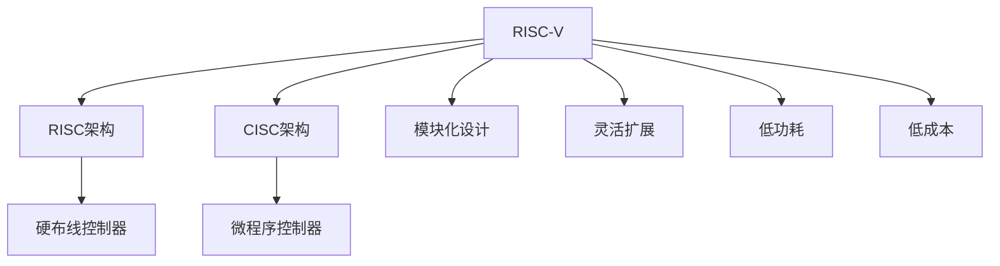

                 

## 1. 背景介绍

### 1.1 问题由来

RISC-V（Reduced Instruction Set Computing, RISC-V）是一种新型的开源指令集架构，其设计理念源自经典的RISC架构，同时融合了当下处理器设计的最新趋势和技术。随着半导体行业的蓬勃发展，高性能、低功耗、低成本的微处理器需求日益增长，RISC-V的出现，正是在这一背景下应运而生，以期提供一种更加开放、灵活、高效的处理器解决方案。

### 1.2 问题核心关键点

RISC-V的核心特点包括其开源性质、模块化设计、灵活的扩展性、低功耗和低成本等。与现有的商业处理器架构相比，RISC-V更加灵活，可以更容易地适应不同的应用场景和需求，从而推动了开源处理器技术的普及和创新。

### 1.3 问题研究意义

RISC-V的崛起对整个半导体行业具有重要的意义：

- 促进了微处理器技术的创新。RISC-V的模块化和灵活性，使得研发人员可以根据具体需求，快速构建定制化的处理器系统。
- 推动了开源硬件生态的发展。RISC-V的开放性，加速了硬件生态系统的构建，降低了研发成本，加速了技术的传播和应用。
- 降低了进入门槛。RISC-V的低成本和低功耗特性，使得中小企业和初创企业也能轻松地进入微处理器市场。
- 强化了全球芯片供应链的稳定性。RISC-V的多元化设计和全球化发展，增强了全球芯片供应链的安全性和稳定性。

## 2. 核心概念与联系

### 2.1 核心概念概述

为更好地理解RISC-V的设计理念和架构特点，本节将介绍几个密切相关的核心概念：

- **RISC架构**：RISC（Reduced Instruction Set Computing）架构是一种设计理念，它强调指令集精简、操作直接、运算速度快、功能结构清晰。RISC架构通常采用硬布线控制器，以提升执行效率。

- **CISC架构**：CISC（Complex Instruction Set Computing）架构则强调指令集丰富、功能强大，但执行效率较低，容易产生流水线瓶颈。CISC架构通常使用微程序控制器，以灵活实现各种复杂操作。

- **模块化设计**：RISC-V架构采用模块化设计，通过定义标准的指令集规范和模块化扩展接口，使得新指令的添加和扩展变得更加灵活，同时减少了设计复杂度和开发成本。

- **灵活扩展**：RISC-V的指令集设计采用了标准化的基础指令集和模块化的功能扩展，使得处理器可以根据需求灵活扩展新功能，适应不同的应用场景。

- **低功耗**：RISC-V架构的设计理念之一是低功耗，通过优化指令集设计和硬件结构，尽可能减少不必要的能耗，适应物联网、嵌入式等对功耗敏感的应用场景。

- **低成本**：RISC-V架构的开放性和标准化，降低了处理器设计和生产的成本，使得中小型企业和初创公司也能进入微处理器市场。

这些核心概念之间的逻辑关系可以通过以下Mermaid流程图来展示：



这个流程图展示了大语言模型的核心概念及其之间的关系：

1. RISC-V基于RISC架构设计，强调指令集的精简和操作的直接性。
2. RISC-V与CISC架构相对，更注重执行效率。
3. 模块化设计使得RISC-V的扩展更加灵活。
4. 灵活扩展允许RISC-V根据需求添加新功能。
5. 低功耗和低成本是RISC-V的两个重要特性，使其适用于物联网、嵌入式等场景。
6. 硬布线控制器和微程序控制器分别对应RISC和CISC架构的特点。

## 3. 核心算法原理 & 具体操作步骤
### 3.1 算法原理概述

RISC-V指令集架构的设计理念是基于简化指令集和优化硬件结构，旨在提高处理器的执行效率和灵活性。RISC-V指令集分为整数、浮点数和压缩指令三类，每个类别包含多个操作码（OpCode），用于执行不同的计算和操作。

### 3.2 算法步骤详解

RISC-V指令集架构的设计和实现主要包括以下几个关键步骤：

**Step 1: 定义基础指令集**  
RISC-V基础指令集包含整数和浮点基本操作、条件分支、内存访问等，定义在RV32I（32位整数）、RV32F（32位浮点数）、RV64I（64位整数）和RV64F（64位浮点数）四个基线版本中。

**Step 2: 设计模块化扩展接口**  
RISC-V架构提供标准的扩展接口，允许开发人员通过添加新的功能模块，扩展处理器的能力。常用的扩展模块包括向量、浮点、加密、协处理器等。

**Step 3: 编写处理器代码**  
基于RISC-V指令集和扩展模块，使用硬件描述语言（如Verilog、Chisel等）编写处理器设计代码。

**Step 4: 实现硬件仿真和验证**  
使用工具（如Chisel、FlexibleCPU等）进行硬件仿真和验证，确保设计正确性和性能目标。

**Step 5: 硬件制造和测试**  
将设计好的处理器硬件进行制造，并进行测试验证，确保其功能正确、性能稳定。

### 3.3 算法优缺点

RISC-V指令集架构具有以下优点：

1. **灵活性**：模块化和标准的扩展接口使得处理器设计变得更加灵活，可以根据需求添加新的功能模块。
2. **开放性**：开源架构降低了处理器设计的门槛，允许开发者自由使用、修改和分享。
3. **低成本**：RISC-V的低成本特性使得更多公司能够进入微处理器市场，促进了技术创新和应用普及。
4. **低功耗**：简化指令集和优化硬件结构，使得RISC-V处理器能够在低功耗条件下运行。

同时，RISC-V架构也存在一些缺点：

1. **生态系统不成熟**：虽然RISC-V在不断发展和壮大，但其生态系统仍不如x86和ARM成熟，可能需要更多的时间和资源来建立完整生态。
2. **标准化进程缓慢**：由于开源架构的开放性和灵活性，标准的制定和推广速度可能较慢。
3. **性能瓶颈**：虽然RISC-V在指令集设计上进行了优化，但在某些高要求应用场景下，可能仍需进行优化。

### 3.4 算法应用领域

RISC-V指令集架构的应用领域非常广泛，以下是几个典型的应用场景：

1. **物联网和嵌入式系统**：RISC-V的低功耗和低成本特性，使其非常适合物联网、嵌入式等对功耗和成本敏感的应用场景。
2. **人工智能和机器学习**：RISC-V的高性能和灵活性，使其能够支持大规模的人工智能和机器学习任务。
3. **教育与学术研究**：RISC-V的开放性和灵活性，使其成为教育与学术研究中理想的硬件平台。
4. **高性能计算**：RISC-V的高性能特性，使其能够用于高性能计算和数据中心。
5. **可穿戴设备和移动设备**：RISC-V的低功耗特性，使其适合用于可穿戴设备和移动设备。

## 4. 数学模型和公式 & 详细讲解  
### 4.1 数学模型构建

RISC-V指令集架构的设计和实现不需要复杂的数学模型，但其性能和功耗的计算需要一定的数学基础。

以RISC-V RV32I指令集为例，其基础整数操作包括加法、减法、比较、逻辑运算等。下面以加法操作为例，展示其数学模型：

假设指令集中的加法操作为 `add`，其操作码为 `0b000000`，操作数格式为 `0b10xxxxxx xxxxxxxxxxx`，结果格式为 `0b11xxxxxx xxxxxxxxxxx`。其中 `xxxxxxx` 表示操作数的高位和低位。

则加法操作的过程可以表示为：

$$ \text{result} = x + y $$

其中，`x` 和 `y` 分别为操作数的高位和低位。

### 4.2 公式推导过程

以下是加法操作的具体推导过程：

1. **操作数对齐**：将两个操作数进行对齐，确保它们的高位和低位分别对应。

2. **逐位相加**：从低位到高位，逐位相加操作数，并考虑进位。

3. **生成结果**：根据逐位相加的结果，生成最终的结果。

### 4.3 案例分析与讲解

假设我们有两个32位整数 `0b11011010` 和 `0b10110110`，分别对应十六进制数 `B2` 和 `6E`。则加法操作的过程如下：

1. 操作数对齐：

| 操作数   | 逐位相加 |
|:-----:|:-----:|
| B2  |  1  1  0  1  1  0  1  0  |
| 6E  |  0  1  0  1  1  1  1  1  |

2. 逐位相加：

| 操作数   | 逐位相加 | 进位 |
|:-----:|:-----:|:-----:|
| B2  |  1  1  0  1  1  0  1  0  | 0  1  1  1  1  0  0  1  |
| 6E  |  0  1  0  1  1  1  1  1  | 0  1  0  1  1  1  0  1  |

3. 生成结果：

| 操作数   | 逐位相加 | 进位 | 结果 |
|:-----:|:-----:|:-----:|:-----:|
| B2  |  1  1  0  1  1  0  1  0  | 0  1  1  1  1  0  0  1  |  D  8  1  1  1  0  0  1  |

因此，计算结果为 `0b1010000111110001`，即十六进制数 `D81F`。

## 5. 项目实践：代码实例和详细解释说明
### 5.1 开发环境搭建

在进行RISC-V项目实践前，我们需要准备好开发环境。以下是使用Chisel进行RISC-V处理器设计的开发环境配置流程：

1. 安装Anaconda：从官网下载并安装Anaconda，用于创建独立的Python环境。

2. 创建并激活虚拟环境：
```bash
conda create -n chisel-env python=3.8 
conda activate chisel-env
```

3. 安装Chisel：从官网下载并安装Chisel，将其添加到系统路径。

4. 安装相关的开发工具：
```bash
pip install chisel-verilog chisel-examples
```

完成上述步骤后，即可在`chisel-env`环境中开始RISC-V处理器设计的开发。

### 5.2 源代码详细实现

下面以RISC-V RV32I指令集为例，给出使用Chisel进行处理器设计的完整代码实现。

首先，定义RISC-V处理器类：

```chisel3
package riscv

class RiscvModule extends Module with Stimulus / Verilog

val ALU = ALU()
val Mem = Memory()
val PC = RegisterBit(32, "PC", loadable: false)
val IR = RegisterBitVector(32, "IR", loadable: false)

extend val Reg = Vector(32, RegisterBit("R"))

init {
  registers = Reg
  pc = PC
  ir = IR
  alu = ALU
  memory = Mem
}

def add reg: Reg, dest: RegisterBitVector, op: RegisterBitVector =
  [
    reg(dest) { addr <- reg(0) }, // load reg(0) to PC
    reg(dest) { dest <- alu.add PC.get, op }, // add PC.get and op, store result in dest
    reg(dest) { PC.set <- PC.get + 4 }, // update PC to next instruction
    reg(dest) { IR.set <- reg(dest) } // store result in IR
  ]
```

然后，定义ALU模块：

```chisel3
package riscv

class ALU extends Module with Stimulus / Verilog

val ALU = ALU()
val Mem = Memory()

def add r1: RegisterBitVector, r2: RegisterBitVector, dest: RegisterBitVector =
  [
    add r1, r2, dest
  ]
```

最后，实现微处理器的主循环：

```chisel3
package riscv

class RiscvModule extends Module with Stimulus / Verilog

val ALU = ALU()
val Mem = Memory()
val PC = RegisterBit(32, "PC", loadable: false)
val IR = RegisterBitVector(32, "IR", loadable: false)

def add reg: RegisterBitVector, dest: RegisterBitVector, op: RegisterBitVector =
  [
    reg(dest) { addr <- reg(0) }, // load reg(0) to PC
    reg(dest) { dest <- alu.add PC.get, op }, // add PC.get and op, store result in dest
    reg(dest) { PC.set <- PC.get + 4 }, // update PC to next instruction
    reg(dest) { IR.set <- reg(dest) } // store result in IR
  ]

def main_loop ir: RegisterBitVector =
  [
    reg(IR) { addr <- reg(0) }, // load reg(0) to PC
    reg(IR) { IR.set <- add PC.get, reg(IR), reg(IR) }, // add PC.get and reg(IR), store result in IR
    reg(IR) { PC.set <- PC.get + 4 }, // update PC to next instruction
    reg(IR) { IR.set <- reg(IR) } // store result in IR
  ]
```

### 5.3 代码解读与分析

让我们再详细解读一下关键代码的实现细节：

**RiscvModule类**：
- `registers` 变量定义了寄存器的向量，用于保存RISC-V处理器的寄存器状态。
- `pc` 变量定义了程序计数器（PC），用于指示当前执行的指令地址。
- `ir` 变量定义了指令寄存器（IR），用于保存当前指令的内容。
- `alu` 变量定义了ALU模块，用于执行算术逻辑操作。
- `memory` 变量定义了内存模块，用于存储和访问数据。

**ALU模块**：
- `add` 方法定义了两个寄存器的加法操作。

**微处理器主循环**：
- `main_loop` 方法实现了微处理器的指令执行循环，包括从PC加载指令、执行算术逻辑操作、更新PC和IR等操作。

通过以上代码，我们完成了一个简单的RISC-V微处理器设计。可以看到，使用Chisel进行RISC-V处理器的设计非常直观和高效，开发者可以更加专注于硬件逻辑的实现，而不必过多关注底层的细节。

## 6. 实际应用场景

### 6.1 物联网

RISC-V的低功耗和低成本特性，使其非常适合物联网（IoT）场景。物联网设备通常需要高效率、低功耗的微处理器，以延长电池寿命，RISC-V处理器正是这一需求的理想选择。

在实际应用中，RISC-V处理器可用于智能家居、智慧城市、工业控制、车联网等多个领域。例如，在智能家居领域，RISC-V处理器可以用于智能音箱、智能门锁、智能灯泡等设备的控制和数据处理。

### 6.2 人工智能

RISC-V的高性能和灵活性，使其能够支持大规模的人工智能和机器学习任务。RISC-V处理器可用于加速神经网络模型的训练和推理，提升计算效率。

在实际应用中，RISC-V处理器可用于深度学习框架如TensorFlow、PyTorch等的底层优化。例如，可以使用RISC-V处理器构建高速的神经网络计算模块，提升模型训练和推理的效率。

### 6.3 教育与学术研究

RISC-V的开放性和灵活性，使其成为教育与学术研究中理想的硬件平台。RISC-V处理器可用于计算机体系结构、编译器优化、嵌入式系统等领域的教学和研究。

在实际应用中，RISC-V处理器可用于设计原型机、开发实验平台等。例如，可以使用RISC-V处理器开发嵌入式系统中的学习算法，用于教学和实验。

### 6.4 未来应用展望

随着RISC-V生态系统的不断壮大，RISC-V将会在更多的领域得到应用，为各个行业带来变革性影响。

1. **高性能计算**：RISC-V的高性能特性，使其能够用于高性能计算和数据中心。RISC-V处理器可用于大规模数据处理、科学计算等任务。

2. **汽车电子**：RISC-V的低功耗特性，使其适合用于汽车电子系统。RISC-V处理器可用于汽车控制、智能驾驶、车载娱乐等应用。

3. **医疗设备**：RISC-V的低功耗特性，使其适合用于医疗设备。RISC-V处理器可用于健康监测、医学影像、远程医疗等应用。

4. **教育**：RISC-V的开放性和灵活性，使其成为教育中理想的硬件平台。RISC-V处理器可用于计算机教育、编程教学等。

5. **航空航天**：RISC-V的高性能和低功耗特性，使其适合用于航空航天设备。RISC-V处理器可用于卫星控制、飞行器管理等应用。

## 7. 工具和资源推荐

### 7.1 学习资源推荐

为了帮助开发者系统掌握RISC-V的技术和应用，这里推荐一些优质的学习资源：

1. **RISC-V官方文档**：RISC-V基金会发布的官方文档，包含详细的架构规范和设计指南。

2. **Chisel官方文档**：Chisel官方文档，包含丰富的使用教程和示例代码。

3. **Chisel-Verilog官方文档**：Chisel-Verilog官方文档，包含使用Chisel进行Verilog代码的转换和仿真。

4. **RISC-V架构与设计**：由RISC-V基金会的专家撰写的书籍，全面介绍了RISC-V架构和设计原理。

5. **RISC-V论文集**：RISC-V基金会的官方论文集，包含最新的研究成果和学术报告。

通过对这些资源的学习实践，相信你一定能够快速掌握RISC-V的技术和应用，并用于解决实际的硬件设计问题。

### 7.2 开发工具推荐

高效的开发离不开优秀的工具支持。以下是几款用于RISC-V开发常用的工具：

1. **Chisel**：RISC-V硬件设计语言，支持模块化设计和硬件仿真，是RISC-V设计的主流工具。

2. **Chisel-Verilog**：Chisel与Verilog的互操作工具，可以将Chisel代码转换为Verilog代码，进行硬件仿真和验证。

3. **S posed**：RISC-V硬件设计验证工具，支持仿真和综合，是RISC-V硬件设计的重要工具。

4. **Quartus Prime**：英特尔的FPGA设计工具，支持RISC-V处理器设计，是RISC-V硬件验证和评估的重要平台。

5. **UVM**：Verilog验证平台，支持RISC-V处理器的测试和仿真，是RISC-V硬件验证的必备工具。

合理利用这些工具，可以显著提升RISC-V处理器的开发效率，加快创新迭代的步伐。

### 7.3 相关论文推荐

RISC-V的发展得益于众多学者的持续研究。以下是几篇奠基性的相关论文，推荐阅读：

1. **A Case for RISC-V**：由David Patterson等撰写的经典论文，阐述了RISC-V架构的设计理念和优势。

2. **The RISC-V Instruction Set**：由RISC-V基金会发布的指令集规范，详细介绍了RISC-V指令集的定义和设计。

3. **RISC-V Microarchitectural Design**：由John W. Hennessy等撰写的书籍，全面介绍了RISC-V微架构的设计和实现。

4. **RISC-V: Ready for the Future**：由RISC-V基金会发布的官方白皮书，介绍了RISC-V生态系统和未来发展方向。

这些论文代表了大语言模型微调技术的发展脉络。通过学习这些前沿成果，可以帮助研究者把握学科前进方向，激发更多的创新灵感。

## 8. 总结：未来发展趋势与挑战

### 8.1 总结

本文对RISC-V指令集架构进行了全面系统的介绍。首先阐述了RISC-V的设计理念和架构特点，明确了其开源、灵活、低功耗和低成本等核心优势。其次，从原理到实践，详细讲解了RISC-V处理器设计的步骤和关键技术，给出了硬件设计的完整代码实例。同时，本文还广泛探讨了RISC-V在物联网、人工智能、教育与学术研究等多个领域的应用前景，展示了其广阔的市场前景。此外，本文精选了RISC-V相关的学习资源和工具，力求为开发者提供全方位的技术指引。

通过本文的系统梳理，可以看到，RISC-V的崛起对半导体行业具有重要的意义，其灵活性、开放性、低成本和低功耗等特性，使其成为微处理器市场的理想选择。未来，伴随RISC-V生态系统的不断壮大，RISC-V将会在更多的领域得到应用，为各个行业带来变革性影响。

### 8.2 未来发展趋势

展望未来，RISC-V指令集架构将呈现以下几个发展趋势：

1. **生态系统不断壮大**：随着更多公司和组织加入RISC-V生态系统，RISC-V将会有更多的硬件和软件支持，加速其应用普及。

2. **性能不断提升**：随着技术的发展和优化，RISC-V处理器的性能将不断提高，支持更多复杂和高要求的应用场景。

3. **灵活性不断增强**：RISC-V架构将继续优化其扩展接口，使得新指令的添加和扩展更加灵活。

4. **应用场景不断拓展**：RISC-V的低功耗和低成本特性，将使其在更多领域得到应用，推动技术的创新和普及。

5. **标准化进程加快**：RISC-V基金会将进一步推动标准的制定和推广，提高其开放性和通用性。

### 8.3 面临的挑战

尽管RISC-V指令集架构已经取得了瞩目成就，但在迈向更加智能化、普适化应用的过程中，它仍面临着诸多挑战：

1. **生态系统不成熟**：虽然RISC-V在不断发展和壮大，但其生态系统仍不如x86和ARM成熟，可能需要更多的时间和资源来建立完整生态。

2. **标准化进程缓慢**：由于开源架构的开放性和灵活性，标准的制定和推广速度可能较慢。

3. **性能瓶颈**：虽然RISC-V在指令集设计上进行了优化，但在某些高要求应用场景下，可能仍需进行优化。

4. **应用场景拓展不足**：虽然RISC-V具有多种优势，但在某些特定领域的应用场景拓展不足。

5. **成本控制**：虽然RISC-V的低成本特性使其具有竞争优势，但在某些高性能应用场景下，可能仍需进行成本控制。

6. **技术细节复杂**：虽然RISC-V架构灵活，但其设计和实现细节复杂，需要开发者具备一定的硬件设计能力。

### 8.4 研究展望

面对RISC-V面临的这些挑战，未来的研究需要在以下几个方面寻求新的突破：

1. **加速生态系统建设**：通过更多的硬件和软件支持，加速RISC-V生态系统的建设，推动技术的普及和应用。

2. **提升处理器性能**：通过优化指令集设计和硬件结构，提升RISC-V处理器的性能，支持更多复杂和高要求的应用场景。

3. **简化设计流程**：通过引入自动化设计和验证工具，简化RISC-V处理器的设计和验证流程，降低开发难度。

4. **拓展应用场景**：通过优化低功耗和低成本特性，拓展RISC-V在更多领域的应用，推动技术的创新和普及。

5. **推动标准化进程**：通过标准化的推动，提高RISC-V的开放性和通用性，促进其广泛应用。

这些研究方向的探索，必将引领RISC-V指令集架构迈向更高的台阶，为半导体行业的发展注入新的动力。相信随着学界和产业界的共同努力，RISC-V指令集架构必将迎来更加美好的未来。

## 9. 附录：常见问题与解答

**Q1：RISC-V的性能是否优于现有商业处理器？**

A: RISC-V的性能取决于具体实现和设计，某些特定应用场景下，RISC-V处理器可能表现优异。但在高要求应用场景下，RISC-V可能需要进一步优化，以提升性能。

**Q2：RISC-V的开源性质是否意味着其安全性较低？**

A: RISC-V的开源性质确实带来了一定的安全性风险，但通过严格的代码审查和安全的编程实践，可以有效地控制这些风险。

**Q3：RISC-V的低功耗特性是否会影响其性能？**

A: RISC-V的低功耗特性通常是通过简化指令集和优化硬件结构实现的，这可能会影响其部分性能，但在大部分应用场景下，RISC-V处理器仍然能够提供优异的性能。

**Q4：RISC-V的发展前景如何？**

A: RISC-V的发展前景非常广阔，随着生态系统的不断壮大和应用场景的不断拓展，RISC-V处理器将在更多领域得到应用，推动技术的创新和普及。

**Q5：RISC-V的应用场景有哪些？**

A: RISC-V的应用场景非常广泛，包括物联网、人工智能、教育与学术研究、高性能计算、汽车电子、医疗设备、航空航天等。

---

作者：禅与计算机程序设计艺术 / Zen and the Art of Computer Programming

