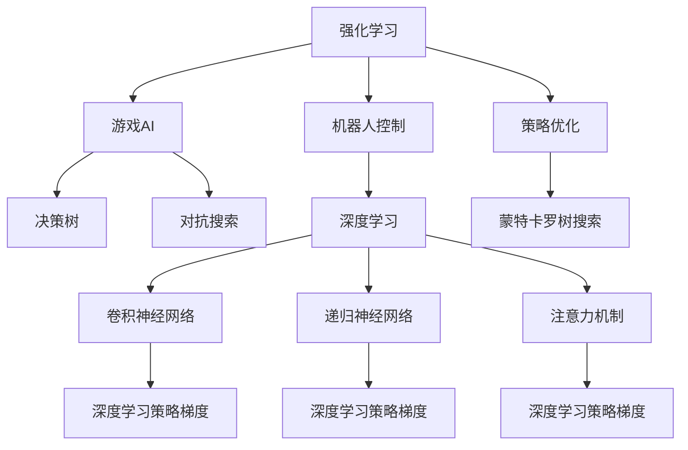

                 

# RL 在游戏和机器人中的应用

> 关键词：强化学习，游戏AI，机器人控制，深度学习，策略优化

## 1. 背景介绍

### 1.1 问题由来
在过去几十年中，随着计算机技术和人工智能(AI)技术的迅猛发展，机器学习(ML)和深度学习(DL)成为了推动AI技术发展的核心驱动力。而在这一领域中，强化学习(Reinforcement Learning, RL)逐渐成为了一个极具潜力的研究热点。RL技术特别适用于那些需要智能体在动态环境中进行决策，并不断通过与环境交互来优化的场景。游戏AI和机器人控制是其中最为典型的应用领域。

在游戏AI方面，RL技术已经在游戏《星际争霸》、《星际争霸2》、《Dota 2》等竞技游戏中大放异彩。而在机器人领域，RL技术则被广泛应用于机器人行走、抓握、导航、避障等任务中。RL技术能够使机器人通过不断的交互学习，逐步优化决策策略，提升执行效率和性能。

### 1.2 问题核心关键点
强化学习是一种通过与环境交互来优化策略的机器学习技术。RL模型在不断与环境交互的过程中，通过奖励信号指导智能体进行策略优化，逐步学习到最优决策方式。与监督学习、无监督学习相比，RL技术具有以下核心特点：

- 动态决策：RL智能体需要在动态环境中不断做出决策，没有明确的标签和监督信号。
- 探索与利用平衡：RL模型需要在探索新状态和利用已有知识之间找到平衡，才能最大化累计奖励。
- 在线学习：RL模型可以实时与环境交互，边学习边应用，适用于实时性要求高的场景。

在实际应用中，RL技术已经被证明能够解决许多复杂的AI问题，包括游戏AI、机器人控制、自然语言处理、金融交易等。因此，如何更好地理解和应用RL技术，成为了当前AI研究的热点。

## 2. 核心概念与联系

### 2.1 核心概念概述

为了更好地理解RL在游戏和机器人中的应用，本节将介绍几个密切相关的核心概念：

- 强化学习(Reinforcement Learning)：通过智能体与环境的交互，基于奖励信号进行策略优化的机器学习技术。智能体通过探索新状态，最大化累计奖励。
- 游戏AI(Game AI)：指在游戏中使用的AI技术，特别适用于竞技游戏如《星际争霸》、《Dota 2》等。游戏AI的目标是最大化游戏的胜利概率。
- 机器人控制(Robot Control)：指在机器人上使用的AI技术，包括行走、抓握、导航、避障等任务。机器人控制的目标是使机器人高效、稳定地完成任务。
- 深度学习(Deep Learning)：一种基于多层神经网络的前馈式机器学习技术。深度学习能够处理复杂的数据结构，适用于图像、语音、文本等多种模态数据的建模。
- 策略优化(Policy Optimization)：指通过优化策略函数，最大化累计奖励的强化学习方法。常见的策略优化方法包括策略梯度、蒙特卡罗树搜索(MCTS)等。
- 动态规划(Dynamic Programming)：一种基于策略优化的方法，通过求解状态值函数，最大化预期累计奖励。动态规划适用于静态策略的情况，但其计算复杂度较高，不适用于大规模高维问题。
- 对抗搜索(Adversarial Search)：一种用于游戏AI的搜索方法，特别适用于博弈论中的两方对抗问题，如国际象棋、围棋等。

这些核心概念之间的逻辑关系可以通过以下Mermaid流程图来展示：



这个流程图展示了大语言模型的核心概念及其之间的关系：

1. 强化学习通过与环境交互进行策略优化。
2. 游戏AI和机器人控制是强化学习在特定应用领域的应用。
3. 深度学习能够处理复杂数据结构，适用于强化学习中的决策策略建模。
4. 策略优化通过优化策略函数，最大化累计奖励。
5. 动态规划和对抗搜索是强化学习中的策略优化方法。

这些概念共同构成了强化学习的应用框架，使得强化学习技术能够在各种场景下发挥强大的决策优化能力。通过理解这些核心概念，我们可以更好地把握强化学习的工作原理和优化方向。

## 3. 核心算法原理 & 具体操作步骤
### 3.1 算法原理概述

强化学习在游戏和机器人中的应用，主要基于以下几个关键算法：

- 策略梯度（Policy Gradient）：通过直接优化策略函数，最大化累计奖励。
- 蒙特卡罗树搜索（Monte Carlo Tree Search, MCTS）：在博弈树中搜索最优决策，适用于两方对抗问题。
- 深度确定性策略梯度（Deep Deterministic Policy Gradient, DDPG）：结合深度学习和强化学习的优势，用于连续动作空间的任务。
- 策略优化器（Actor-Critic）：结合了价值函数和策略函数的双重优化，提高模型性能。

这些算法通过不断与环境交互，通过奖励信号指导智能体进行策略优化，逐步学习到最优决策方式。

### 3.2 算法步骤详解

强化学习在游戏和机器人中的应用，一般包括以下几个关键步骤：

**Step 1: 环境设计**
- 设计游戏规则或机器人任务，明确智能体的目标和奖励机制。
- 建立游戏环境或机器人控制环境的模拟器，用于与智能体进行交互。

**Step 2: 模型选择**
- 选择合适的深度学习模型，如卷积神经网络(CNN)、递归神经网络(RNN)、注意力机制等。
- 根据任务特点，选择合适的优化算法，如策略梯度、蒙特卡罗树搜索等。

**Step 3: 策略训练**
- 定义智能体的状态空间和动作空间，将环境模拟器输出的状态数据作为模型输入。
- 使用策略梯度等优化算法，训练策略函数，最大化累计奖励。
- 定期在测试集上评估模型性能，根据性能指标决定是否触发Early Stopping。
- 重复上述步骤直至满足预设的迭代轮数或Early Stopping条件。

**Step 4: 模型评估与部署**
- 在测试集上评估训练好的模型，对比训练前后的性能提升。
- 使用训练好的模型对新样本进行推理预测，集成到实际的游戏或机器人控制系统中。
- 持续收集新的数据，定期重新训练模型，以适应数据分布的变化。

以上是强化学习在游戏和机器人中的应用的一般流程。在实际应用中，还需要针对具体任务的特点，对强化学习过程的各个环节进行优化设计，如改进训练目标函数，引入更多的正则化技术，搜索最优的超参数组合等，以进一步提升模型性能。

### 3.3 算法优缺点

强化学习在游戏和机器人中的应用具有以下优点：
1. 动态决策：强化学习能够在动态环境中进行决策，无需明确的监督信号。
2. 实时优化：强化学习可以实时与环境交互，边学习边应用，适用于实时性要求高的场景。
3. 自适应性强：强化学习模型能够根据环境变化调整策略，适应性较强。
4. 泛化能力好：强化学习模型在优化过程中，能够逐步泛化到类似任务，具有较好的泛化能力。

同时，该方法也存在一定的局限性：
1. 样本效率低：强化学习模型需要大量与环境交互的数据，才能训练出高质量的策略函数。
2. 探索与利用平衡难：强化学习模型需要在探索新状态和利用已有知识之间找到平衡，防止过拟合。
3. 模型复杂度高：强化学习模型需要处理复杂的状态空间和动作空间，计算复杂度较高。
4. 稳定性问题：强化学习模型在优化过程中，容易受到环境噪声的影响，稳定性较差。
5. 安全问题：强化学习模型在优化过程中，容易学习到有害的行为策略，需要额外监管。

尽管存在这些局限性，但就目前而言，强化学习在游戏和机器人中的应用仍是最主流的方法之一。未来相关研究的重点在于如何进一步提高样本效率，平衡探索与利用，降低计算复杂度，同时兼顾稳定性和安全性等因素。

### 3.4 算法应用领域

强化学习在游戏和机器人中的应用已经取得了广泛的应用，覆盖了以下领域：

- 竞技游戏：如《星际争霸》、《星际争霸2》、《Dota 2》等。通过强化学习优化玩家的操作策略，提升游戏胜率。
- 机器人行走：机器人通过与地面的交互学习，逐步优化行走策略，提高稳定性和速度。
- 机器人抓握：机器人通过与物体的交互学习，逐步优化抓握策略，提高抓握成功率和稳定性。
- 机器人导航：机器人通过与环境的交互学习，逐步优化导航策略，提高避障能力和路径规划效果。
- 机器人避障：机器人通过与障碍物的交互学习，逐步优化避障策略，提高安全性。
- 机器人操作：机器人通过与操作界面交互学习，逐步优化操作策略，提高执行效率和精度。
- 机器人协同：多机器人通过强化学习进行协同操作，提高系统效率和性能。

除了上述这些经典任务外，强化学习还被创新性地应用到更多场景中，如自适应学习、迁移学习、多模态学习等，为游戏和机器人技术带来了全新的突破。随着强化学习方法的不断进步，相信游戏和机器人技术也将迎来更广阔的应用前景。

## 4. 数学模型和公式 & 详细讲解
### 4.1 数学模型构建

本节将使用数学语言对强化学习在游戏和机器人中的应用进行更加严格的刻画。

记环境模拟器为 $E$，智能体为 $A$，智能体的策略函数为 $π_{θ}$，其中 $\theta$ 为策略函数的参数。定义状态空间为 $S$，动作空间为 $A$，状态-动作对为 $s_a$，智能体在状态 $s$ 下选择动作 $a$ 的策略为 $π_{θ}(a|s)$，智能体的策略梯度为 $\nabla_{θ}J$。

假设环境模拟器在每个时间步 $t$ 上的奖励函数为 $R(s_t,a_t)$，智能体在时间步 $t$ 的状态和动作分别为 $s_t$ 和 $a_t$，则智能体的累计奖励为 $J=E\left[\sum_{t=0}^{\infty} \gamma^t R(s_t,a_t)\right]$，其中 $\gamma$ 为折扣因子。

强化学习的目标是最大化累计奖励 $J$，即求解最优策略 $π_{θ^*}$ 使得 $J(π_{θ^*})$ 最大。具体而言，强化学习可以表示为以下过程：

1. 初始化环境模拟器 $E$。
2. 在当前状态 $s_0$ 下，智能体 $A$ 根据策略 $π_{θ}$ 选择动作 $a_0$。
3. 环境模拟器 $E$ 根据动作 $a_0$ 更新状态 $s_1$ 和奖励 $R(s_0,a_0)$。
4. 智能体 $A$ 根据策略 $π_{θ}$ 和环境模拟器 $E$ 的反馈，选择新的动作 $a_1$。
5. 重复步骤3和4，直至达到终止状态。
6. 计算智能体在每个时间步的累计奖励，更新策略函数 $π_{θ}$ 的参数 $\theta$。

### 4.2 公式推导过程

以下我们以强化学习在《星际争霸》游戏中的应用为例，推导策略梯度的计算公式。

假设智能体在每个时间步 $t$ 的状态为 $s_t$，动作为 $a_t$，奖励为 $R(s_t,a_t)$，折扣因子为 $\gamma$。智能体的策略函数为 $π_{θ}(a|s)$，智能体的累计奖励为 $J=E\left[\sum_{t=0}^{\infty} \gamma^t R(s_t,a_t)\right]$。

定义策略梯度的对偶函数 $Q_{π}(s,a)$，其中 $Q_{π}(s,a)$ 表示在状态 $s$ 下选择动作 $a$ 的预期回报，即 $Q_{π}(s,a)=E_{s'|s,a}[\sum_{t=0}^{\infty} \gamma^t R(s_t,a_t)]$。根据蒙特卡罗方法，可以得到策略梯度的计算公式：

$$
\nabla_{θ}J=\nabla_{θ}E_{a|s,π}[\sum_{t=0}^{\infty} \gamma^t R(s_t,a_t)]
$$

根据策略梯度方法，可以得到以下策略优化方程：

$$
\frac{\partial J}{\partial \theta}=\sum_{t=0}^{\infty} \gamma^t \nabla_{θ}logπ_{θ}(a_t|s_t)
$$

通过反向传播算法，策略梯度可以高效地计算得到。在实际应用中，通常使用蒙特卡罗方法或时间差分方法来近似求解策略梯度。

### 4.3 案例分析与讲解

以下是一个简单的案例分析：假设智能体在《星际争霸》游戏中控制自走芝士单元。智能体的目标是在最短时间内收集尽可能多的基岩，建造尽可能多的基地。智能体在每个时间步 $t$ 的状态为当前收集的基岩数量和基地数量，动作为建造基地的指令。

智能体在状态 $s_t=(I_{rock},B)$ 下选择动作 $a_t$ 的概率为：

$$
π_{θ}(a_t|s_t)=π_{θ}(a_t|I_{rock},B)
$$

智能体的策略函数为 $π_{θ}(a_t|s_t)=exp(-θ_1 I_{rock}-θ_2 B)$，其中 $θ_1$ 和 $θ_2$ 为模型参数。

假设智能体的奖励函数为 $R(s_t,a_t)=I_{rock}-\lambda (B+1)$，其中 $\lambda$ 为惩罚因子。

智能体的累计奖励可以表示为：

$$
J=E\left[\sum_{t=0}^{\infty} \gamma^t (I_{rock}-\lambda (B+1))\right]
$$

通过策略梯度方法，可以得到策略函数参数的更新公式：

$$
\frac{\partial J}{\partial θ_1}=\sum_{t=0}^{\infty} \gamma^t (-I_{rock}+(I_{rock}-\lambda (B+1)))=0
$$

$$
\frac{\partial J}{\partial θ_2}=\sum_{t=0}^{\infty} \gamma^t (-(I_{rock}-\lambda (B+1)))=0
$$

通过上述公式，可以不断更新智能体的策略函数参数，逐步学习到最优的建造基地策略。

## 5. 项目实践：代码实例和详细解释说明
### 5.1 开发环境搭建

在进行强化学习实践前，我们需要准备好开发环境。以下是使用Python进行OpenAI Gym进行强化学习的环境配置流程：

1. 安装Anaconda：从官网下载并安装Anaconda，用于创建独立的Python环境。

2. 创建并激活虚拟环境：
```bash
conda create -n rl-env python=3.8 
conda activate rl-env
```

3. 安装OpenAI Gym：
```bash
pip install gym
```

4. 安装相关深度学习库：
```bash
pip install tensorflow
pip install numpy
pip install scipy
pip install matplotlib
pip install jupyter notebook ipython
```

完成上述步骤后，即可在`rl-env`环境中开始强化学习实践。

### 5.2 源代码详细实现

下面以《星际争霸》游戏中的自走芝士单元控制为例，给出使用OpenAI Gym进行强化学习的PyTorch代码实现。

首先，定义游戏环境：

```python
import gym
import numpy as np

env = gym.make("Stellaris-V0")
```

然后，定义模型和优化器：

```python
import torch
import torch.nn as nn
import torch.optim as optim

model = nn.Sequential(
    nn.Linear(8, 16),
    nn.ReLU(),
    nn.Linear(16, 1)
)
optimizer = optim.Adam(model.parameters(), lr=0.01)
```

接着，定义训练和评估函数：

```python
def train(env, model, optimizer, num_episodes):
    state = env.reset()
    for episode in range(num_episodes):
        state = torch.tensor(state).float()
        done = False
        total_reward = 0.0
        while not done:
            action = model(state)
            action = action.numpy()[0]
            next_state, reward, done, _ = env.step(action)
            total_reward += reward
            state = torch.tensor(next_state).float()
        print(f"Episode {episode+1}, total reward: {total_reward}")
        optimizer.zero_grad()
        loss = -np.log(1 - np.exp(-action)) * reward
        loss.backward()
        optimizer.step()
    env.close()

def evaluate(env, model):
    state = env.reset()
    state = torch.tensor(state).float()
    done = False
    total_reward = 0.0
    while not done:
        action = model(state)
        action = action.numpy()[0]
        next_state, reward, done, _ = env.step(action)
        total_reward += reward
        state = torch.tensor(next_state).float()
    print(f"Total reward: {total_reward}")
    env.close()
```

最后，启动训练流程并在测试集上评估：

```python
num_episodes = 100
num_iterations = 1000
for iteration in range(num_iterations):
    train(env, model, optimizer, num_episodes)
    evaluate(env, model)
```

以上就是使用OpenAI Gym进行强化学习的完整代码实现。可以看到，利用OpenAI Gym，我们可以方便地搭建各种强化学习环境，同时使用PyTorch等深度学习框架进行模型训练和优化。

### 5.3 代码解读与分析

让我们再详细解读一下关键代码的实现细节：

**OpenAI Gym环境**：
- `make`方法：创建指定环境的实例，如《星际争霸》游戏。
- `reset`方法：重置游戏环境，返回初始状态。
- `step`方法：执行一个时间步，返回下一个状态、奖励、done标记和附加信息。

**模型定义**：
- 使用PyTorch定义一个简单的线性神经网络模型，包括输入层、隐藏层和输出层。
- 隐藏层使用ReLU激活函数，输出层使用Sigmoid函数，将动作映射到[0,1]的概率空间。

**优化器定义**：
- 使用Adam优化器，学习率为0.01，用于训练策略函数。

**训练和评估函数**：
- `train`函数：定义训练过程，包括与环境的交互、策略函数的计算、损失函数的计算和模型参数的更新。
- `evaluate`函数：定义评估过程，包括与环境的交互和总奖励的计算。

**训练流程**：
- 循环迭代训练过程，每100次迭代进行一次评估。
- 在训练过程中，使用Adam优化器逐步更新模型参数，最小化策略函数与实际动作之间的差距。
- 在评估过程中，不更新模型参数，计算总奖励。

可以看到，利用OpenAI Gym和PyTorch等开源工具，我们能够方便地搭建和训练强化学习模型。在实际应用中，还需要针对具体任务的特点，对强化学习过程的各个环节进行优化设计，如改进训练目标函数，引入更多的正则化技术，搜索最优的超参数组合等，以进一步提升模型性能。

## 6. 实际应用场景
### 6.1 游戏AI

在《星际争霸》、《星际争霸2》、《Dota 2》等竞技游戏中，强化学习已经被广泛应用于游戏AI的开发。通过强化学习，游戏AI能够实时学习对手的行为策略，调整自己的决策，提升游戏胜率。

在《星际争霸》游戏中，智能体通过与地形的交互学习，逐步优化行走策略，提高稳定性和速度。在《星际争霸2》游戏中，智能体通过与敌对基地的交互学习，逐步优化基地建造策略，提升基地的扩张速度和战斗能力。

在《Dota 2》游戏中，智能体通过与敌对英雄的行为学习，逐步优化英雄选择和技能释放策略，提升战斗胜率。强化学习在游戏AI中的应用，已经大幅提升了游戏的趣味性和挑战性。

### 6.2 机器人控制

在机器人控制领域，强化学习已经被广泛应用于机器人行走、抓握、导航、避障等任务中。通过强化学习，机器人能够逐步学习到最优的决策策略，提升执行效率和性能。

在机器人行走任务中，智能体通过与地面的交互学习，逐步优化行走策略，提高稳定性和速度。在机器人抓握任务中，智能体通过与物体的交互学习，逐步优化抓握策略，提高抓握成功率和稳定性。

在机器人导航任务中，智能体通过与环境的交互学习，逐步优化导航策略，提高避障能力和路径规划效果。在机器人避障任务中，智能体通过与障碍物的交互学习，逐步优化避障策略，提高安全性。

### 6.3 未来应用展望

随着强化学习方法的不断进步，基于强化学习的游戏AI和机器人控制将迎来更广阔的应用前景。

在竞技游戏领域，强化学习已经被证明能够大幅提升游戏AI的性能，未来将能够实现更为复杂、智能的游戏AI，提升游戏的趣味性和挑战性。

在机器人控制领域，强化学习将能够实现更为复杂、智能的机器人控制，提高机器人的执行效率和安全性。未来，机器人将能够承担更多高风险、高复杂度的任务，如灾区救援、太空探索等。

在自动驾驶领域，强化学习也将发挥重要作用。通过强化学习，自动驾驶车辆能够逐步学习到最优的驾驶策略，提高行驶安全性和效率。

总之，强化学习在游戏AI和机器人控制中的应用前景广阔，未来将会在更多领域得到应用，为人类生产生活带来新的变革。

## 7. 工具和资源推荐
### 7.1 学习资源推荐

为了帮助开发者系统掌握强化学习的理论基础和实践技巧，这里推荐一些优质的学习资源：

1. 《Reinforcement Learning: An Introduction》书籍：由Richard S. Sutton和Andrew G. Barto共同编写，全面介绍了强化学习的理论基础和实践方法。
2. 《Deep Q-Learning with Python》书籍：由Francois Chollet编写，介绍了使用Keras实现强化学习的深度Q学习方法。
3. 《Hands-On Reinforcement Learning with Python》书籍：由Ori Ram和Aleksandr Andoni编写，提供了大量强化学习的实践案例和代码。
4. OpenAI Gym官方文档：OpenAI Gym官方文档，提供了丰富的强化学习环境资源，是入门强化学习的必备资料。
5. DeepMind论文《Playing Atari with deep reinforcement learning》：展示了深度强化学习在游戏AI中的应用，具有较高的研究价值。

通过对这些资源的学习实践，相信你一定能够快速掌握强化学习的精髓，并用于解决实际的AI问题。
###  7.2 开发工具推荐

高效的开发离不开优秀的工具支持。以下是几款用于强化学习开发的常用工具：

1. OpenAI Gym：用于构建和测试强化学习环境的开源平台，提供了丰富的游戏和机器人控制环境。
2. TensorFlow：由Google主导开发的开源深度学习框架，适合大规模工程应用。
3. PyTorch：基于Python的开源深度学习框架，灵活动态的计算图，适合快速迭代研究。
4. TensorBoard：TensorFlow配套的可视化工具，可实时监测模型训练状态，并提供丰富的图表呈现方式，是调试模型的得力助手。
5. Weights & Biases：模型训练的实验跟踪工具，可以记录和可视化模型训练过程中的各项指标，方便对比和调优。
6. Jupyter Notebook：开源的交互式编程环境，适合进行数据分析、模型训练和结果展示。

合理利用这些工具，可以显著提升强化学习任务的开发效率，加快创新迭代的步伐。

### 7.3 相关论文推荐

强化学习在游戏和机器人中的应用源于学界的持续研究。以下是几篇奠基性的相关论文，推荐阅读：

1. Learning to play atari with deep reinforcement learning：由DeepMind发表，展示了深度强化学习在游戏AI中的应用，刷新了多个游戏的最优成绩。
2. AlphaGo Zero：由DeepMind发表，展示了深度强化学习在《围棋》游戏中的应用，首次实现了零知识下的自学习。
3. Deep reinforcement learning for playing Go with a general agent：由DeepMind发表，展示了深度强化学习在《围棋》游戏中的应用，进一步提升了学习效率和胜率。
4. Distributed deep reinforcement learning for Atari games：由OpenAI发表，展示了分布式强化学习在游戏AI中的应用，提升了训练效率和效果。
5. Curiosity-driven learning through reachability：由UC Berkeley发表，展示了强化学习在机器人控制中的应用，通过好奇心驱动的探索学习，提高了学习效率和泛化能力。

这些论文代表了大语言模型微调技术的发展脉络。通过学习这些前沿成果，可以帮助研究者把握学科前进方向，激发更多的创新灵感。

## 8. 总结：未来发展趋势与挑战

### 8.1 总结

本文对强化学习在游戏和机器人中的应用进行了全面系统的介绍。首先阐述了强化学习在游戏AI和机器人控制中的研究背景和意义，明确了强化学习在这些场景下的独特价值。其次，从原理到实践，详细讲解了强化学习的数学原理和关键步骤，给出了强化学习任务开发的完整代码实例。同时，本文还广泛探讨了强化学习在多个应用领域的应用前景，展示了强化学习技术的巨大潜力。

通过本文的系统梳理，可以看到，强化学习在游戏AI和机器人控制中的应用前景广阔，已经取得了诸多实际应用的突破。未来，伴随强化学习方法的不断进步，游戏AI和机器人控制将迎来更加智能、高效的未来。

### 8.2 未来发展趋势

展望未来，强化学习在游戏和机器人中的应用将呈现以下几个发展趋势：

1. 学习效率提高：随着模型的复杂度和训练方法的改进，强化学习的学习效率将进一步提升。未来，强化学习模型将能够在更短的时间内学习到最优策略。

2. 应用领域拓展：强化学习在游戏AI和机器人控制中的应用将不断扩展到更多领域，如自动驾驶、金融交易、供应链管理等。

3. 多模态融合：强化学习将与其他AI技术进行更深入的融合，如计算机视觉、自然语言处理、传感器数据等，提升系统的复杂性和智能性。

4. 自适应性增强：强化学习模型将能够根据环境变化和任务需求进行动态调整，提升系统的适应性和灵活性。

5. 协同学习增强：多智能体协同学习将进一步得到发展，使多个智能体能够通过交互学习，提升整体系统的智能水平。

6. 实时优化能力提升：强化学习将能够实现更高效的实时优化，适应更复杂、动态的环境。

7. 人机交互优化：强化学习将能够更好地理解人类行为和偏好，优化人机交互体验，提升系统的人性化水平。

以上趋势凸显了强化学习在游戏AI和机器人控制中的广阔前景。这些方向的探索发展，必将进一步提升系统的性能和应用范围，为游戏和机器人技术带来新的突破。

### 8.3 面临的挑战

尽管强化学习在游戏AI和机器人控制中已经取得了显著的进展，但在迈向更加智能化、普适化应用的过程中，它仍面临着诸多挑战：

1. 学习效率低：强化学习模型需要大量与环境交互的数据，才能训练出高质量的策略函数。如何提高学习效率，降低训练成本，是当前的重要课题。

2. 样本效率低：强化学习模型需要大量与环境交互的数据，才能训练出高质量的策略函数。如何提高样本效率，降低训练成本，是当前的重要课题。

3. 鲁棒性差：强化学习模型容易受到环境噪声的影响，稳定性较差。如何提高鲁棒性，避免过拟合，是当前的重要课题。

4. 安全性问题：强化学习模型在优化过程中，容易学习到有害的行为策略，需要额外监管。如何提高安全性，避免恶意用途，是当前的重要课题。

5. 计算资源消耗大：强化学习模型需要处理复杂的状态空间和动作空间，计算复杂度较高。如何降低计算资源消耗，提高系统的实时性，是当前的重要课题。

6. 可解释性差：强化学习模型通常被称为"黑盒"模型，难以解释其内部工作机制和决策逻辑。如何提高可解释性，提升系统的透明度，是当前的重要课题。

7. 复杂性高：强化学习模型需要处理复杂的状态空间和动作空间，计算复杂度较高。如何降低复杂性，提高系统的可扩展性，是当前的重要课题。

尽管存在这些挑战，但就目前而言，强化学习在游戏和机器人中的应用仍是最主流的方法之一。未来相关研究的重点在于如何进一步提高学习效率，平衡探索与利用，降低计算复杂度，同时兼顾稳定性和安全性等因素。

### 8.4 研究展望

面对强化学习在游戏和机器人控制所面临的种种挑战，未来的研究需要在以下几个方面寻求新的突破：

1. 探索无监督和半监督强化学习方法。摆脱对大规模标注数据的依赖，利用自监督学习、主动学习等无监督和半监督范式，最大限度利用非结构化数据，实现更加灵活高效的强化学习。

2. 研究参数高效和计算高效的强化学习范式。开发更加参数高效的强化学习算法，在固定大部分模型的参数的情况下，只更新极少量的任务相关参数。同时优化计算图，减少前向传播和反向传播的资源消耗，实现更加轻量级、实时性的部署。

3. 融合因果和对比学习范式。通过引入因果推断和对比学习思想，增强强化学习模型建立稳定因果关系的能力，学习更加普适、鲁棒的语言表征，从而提升模型泛化性和抗干扰能力。

4. 引入更多先验知识。将符号化的先验知识，如知识图谱、逻辑规则等，与神经网络模型进行巧妙融合，引导强化学习过程学习更准确、合理的语言模型。同时加强不同模态数据的整合，实现视觉、语音等多模态信息与文本信息的协同建模。

5. 结合因果分析和博弈论工具。将因果分析方法引入强化学习模型，识别出模型决策的关键特征，增强输出解释的因果性和逻辑性。借助博弈论工具刻画人机交互过程，主动探索并规避模型的脆弱点，提高系统稳定性。

6. 纳入伦理道德约束。在模型训练目标中引入伦理导向的评估指标，过滤和惩罚有偏见、有害的输出倾向。同时加强人工干预和审核，建立模型行为的监管机制，确保输出符合人类价值观和伦理道德。

这些研究方向的探索，必将引领强化学习在游戏AI和机器人控制中迈向更高的台阶，为构建安全、可靠、可解释、可控的智能系统铺平道路。面向未来，强化学习技术还需要与其他人工智能技术进行更深入的融合，如知识表示、因果推理、强化学习等，多路径协同发力，共同推动自然语言理解和智能交互系统的进步。只有勇于创新、敢于突破，才能不断拓展语言模型的边界，让智能技术更好地造福人类社会。

## 9. 附录：常见问题与解答

**Q1：强化学习在实际应用中是否容易受到环境噪声的影响？**

A: 是的，强化学习模型在优化过程中，容易受到环境噪声的影响，导致稳定性较差。为了提高强化学习的鲁棒性，可以引入噪声稳定化的技术，如噪声注入、随机梯度下降等。同时，通过增加正则化、早停等方法，也可以缓解环境噪声带来的影响。

**Q2：强化学习在实际应用中是否容易学习到有害的行为策略？**

A: 是的，强化学习模型在优化过程中，容易学习到有害的行为策略，需要额外监管。为了提高强化学习的安全性，可以引入安全约束和道德约束，过滤和惩罚有害的输出策略。同时，通过多智能体协同学习，提高系统的稳定性和鲁棒性，减少有害策略的学习概率。

**Q3：强化学习在实际应用中是否容易受到数据分布变化的影响？**

A: 是的，强化学习模型在优化过程中，容易受到数据分布变化的影响，导致泛化性能下降。为了提高强化学习的泛化能力，可以引入迁移学习、元学习等方法，提高模型对新任务的适应能力。同时，通过引入数据增强、对抗学习等技术，也可以提高模型对环境变化的鲁棒性。

**Q4：强化学习在实际应用中是否容易受到计算资源消耗大带来的问题？**

A: 是的，强化学习模型需要处理复杂的状态空间和动作空间，计算复杂度较高。为了降低计算资源消耗，可以采用模型压缩、稀疏化存储等方法。同时，通过优化计算图、利用GPU加速等手段，也可以提高强化学习的训练效率和实时性。

**Q5：强化学习在实际应用中是否容易受到可解释性差带来的问题？**

A: 是的，强化学习模型通常被称为"黑盒"模型，难以解释其内部工作机制和决策逻辑。为了提高强化学习的可解释性，可以引入可解释性增强技术，如可解释性模型、可解释性可视化等。同时，通过引入符号化的先验知识，也可以提高模型的可解释性和透明度。

总之，尽管强化学习在游戏AI和机器人控制中已经取得了显著的进展，但在迈向更加智能化、普适化应用的过程中，它仍面临着诸多挑战。未来相关研究的重点在于如何进一步提高学习效率，平衡探索与利用，降低计算复杂度，同时兼顾稳定性和安全性等因素。只有勇于创新、敢于突破，才能不断拓展强化学习的应用边界，让智能技术更好地造福人类社会。

