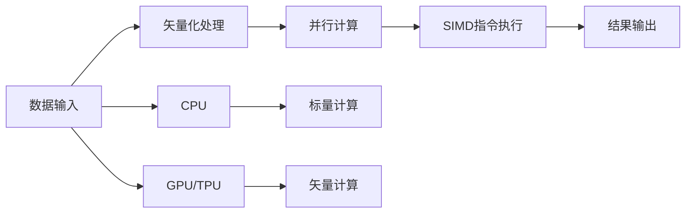

                 

# SIMD指令集：AI硬件加速的底层魔法

> 关键词：SIMD, AI硬件加速, 矢量计算, 并行计算, 深度学习, GPU/TPU, 向量指令集

## 1. 背景介绍

### 1.1 问题由来

近年来，随着人工智能(AI)和深度学习技术的飞速发展，机器学习模型在图像识别、自然语言处理、语音识别、推荐系统等诸多领域取得了突破性的进展。然而，随着模型参数量的爆炸性增长和计算复杂度的不断提升，传统的基于CPU的计算模式已无法满足日益增长的计算需求。与此同时，新兴的AI硬件加速技术，如GPU/TPU等，凭借其高速并行计算能力和能效比，成为AI应用落地的重要支撑。

### 1.2 问题核心关键点

本节将介绍将AI计算与底层硬件架构紧密结合的关键技术和方法，即SIMD指令集，探寻AI硬件加速的底层魔法。

- **SIMD指令集**：以Single Instruction Multiple Data (SIMD)为核心的并行计算架构，通过并行处理多条数据的方式，大幅提升计算效率。
- **AI硬件加速**：利用专用AI硬件，如GPU/TPU，实现对深度学习模型的计算加速。
- **矢量计算**：基于SIMD指令集，将多个数据点打包处理，通过一次指令完成多个数据的运算。
- **并行计算**：通过多核并行计算，利用多线程同时处理多组数据，实现并行加速。
- **深度学习**：基于神经网络结构的机器学习模型，需要海量数据训练和计算资源支持。
- **GPU/TPU**：高性能计算芯片，具备强大的并行计算能力，适用于深度学习等密集型计算任务。

### 1.3 问题研究意义

研究SIMD指令集在AI硬件加速中的应用，对于推动AI技术的落地应用，提升计算效率，降低能耗，具有重要的意义：

- **提升计算效率**：通过并行计算，可以大幅提升深度学习模型的计算速度，缩短模型训练和推理的时间。
- **降低能耗**：专用AI硬件，如GPU/TPU，具备更高的能效比，可以有效降低计算能耗，降低硬件成本。
- **促进AI产业化**：为AI技术在产业界的广泛应用提供了坚实的硬件基础，加速了AI技术的商业化进程。
- **推动技术创新**：基于SIMD指令集的并行计算技术，正在催生新的计算模型和算法，如卷积神经网络(CNN)、Transformer等，进一步推动AI技术的创新发展。

## 2. 核心概念与联系

### 2.1 核心概念概述

为了更好地理解SIMD指令集在AI硬件加速中的应用，本节将介绍几个密切相关的核心概念：

- **单指令多数据(SIMD)**：在处理器指令中，一次操作可以同时对多个数据进行操作。
- **矢量化(Vectization)**：将标量操作转化为矢量操作，将多个数据元素作为整体进行操作，以提高计算效率。
- **并行计算(Parallel Computing)**：通过多处理器并行计算，实现多组数据的并行处理，提升计算效率。
- **GPU/TPU**：专为AI计算设计的专用硬件，具备高性能并行计算能力，适合深度学习模型训练和推理。

### 2.2 核心概念原理和架构的 Mermaid 流程图(Mermaid 流程节点中不要有括号、逗号等特殊字符)



这个流程图展示了大规模数据处理的基本流程：

1. 数据输入，包含标量数据和矢量数据。
2. 通过矢量化处理，将标量数据转化为矢量数据。
3. 使用并行计算，对多组矢量数据进行并行处理。
4. 使用SIMD指令，对矢量数据进行高效计算。
5. 输出结果，包含标量数据和矢量数据。

其中，CPU和GPU/TPU分别代表不同的计算设备，CPU适合处理标量计算，而GPU/TPU适合处理矢量计算。

## 3. 核心算法原理 & 具体操作步骤
### 3.1 算法原理概述

SIMD指令集在AI硬件加速中的应用，本质上是通过并行计算提升深度学习模型的计算效率。其核心思想是：将深度学习模型的计算任务，拆分成多个子任务，并行地执行这些子任务，从而加速计算过程。

以卷积神经网络(CNN)为例，CNN的卷积层和池化层都涉及大量矩阵运算，可以使用SIMD指令集进行并行处理。具体而言，可以将输入数据块打包成一组矢量，每次使用SIMD指令集执行相同的计算操作，对每个矢量执行一次卷积或池化运算。这样，计算过程就可以并行处理，大幅提升计算效率。

### 3.2 算法步骤详解

基于SIMD指令集的大规模AI计算，一般包括以下几个关键步骤：

**Step 1: 数据准备与分配**

- 将大规模数据集拆分为多个子集，每个子集的大小与SIMD指令集中的寄存器长度匹配。
- 分配CPU/GPU/TPU的计算资源，确保每个子集能够在指定的硬件上并行处理。

**Step 2: 数据矢量化**

- 将每个子集的数据转换为矢量数据，每个矢量包含多个数据元素。
- 根据SIMD指令集的特性，确定矢量化处理的步长和对齐方式。

**Step 3: 并行计算**

- 使用多线程或多进程，将每个矢量数据块分配给不同的处理单元。
- 在每个处理单元上，使用SIMD指令集执行相应的计算操作。
- 收集所有处理单元的计算结果，进行合并和后续处理。

**Step 4: 结果输出**

- 将计算结果从GPU/TPU复制到CPU内存。
- 对结果进行后处理，如降维、归一化等操作。
- 输出最终的计算结果。

### 3.3 算法优缺点

使用SIMD指令集进行AI硬件加速，具有以下优点：

1. **计算效率高**：通过并行计算，可以大幅提升深度学习模型的计算速度，缩短模型训练和推理的时间。
2. **能耗低**：专用AI硬件，如GPU/TPU，具备更高的能效比，可以有效降低计算能耗，降低硬件成本。
3. **硬件支持广泛**：SIMD指令集在现代CPU和现代GPU/TPU中都有广泛的支持，便于硬件实现和优化。
4. **代码简洁**：使用矢量化和SIMD指令集，可以将复杂的标量计算转化为简洁的矢量计算，提升代码的可读性和可维护性。

然而，SIMD指令集的应用也存在以下缺点：

1. **硬件要求高**：需要专用的AI硬件支持，硬件成本较高。
2. **算法优化复杂**：需要针对不同硬件架构和指令集特性进行算法优化，才能充分发挥硬件优势。
3. **兼容性问题**：不同的硬件平台和指令集，可能需要不同的优化策略，增加了实现和维护的难度。
4. **学习曲线陡峭**：需要掌握并行计算和SIMD指令集的基本原理，有一定的学习门槛。

### 3.4 算法应用领域

SIMD指令集在AI硬件加速中的应用，已经广泛应用于深度学习模型的训练和推理。以下是几个典型应用场景：

- **图像识别**：利用SIMD指令集，对图像卷积层和池化层的矩阵运算进行并行处理，加速模型的训练和推理。
- **自然语言处理**：对语言模型的矩阵运算进行矢量化处理，提升模型的计算效率。
- **语音识别**：对声学模型的信号处理和特征提取进行并行计算，提高语音识别的实时性。
- **推荐系统**：对模型矩阵运算进行矢量化处理，加速推荐模型的训练和推理。
- **视频处理**：对视频处理中的卷积和池化运算进行并行计算，提升视频处理的效率。
- **强化学习**：对强化学习中的矩阵运算进行矢量化处理，加速模型的训练和推理。

除了上述这些经典应用外，SIMD指令集还在更多场景中得到应用，如医疗影像分析、基因序列分析、物理模拟等，为AI技术的落地应用提供了强有力的支撑。

## 4. 数学模型和公式 & 详细讲解 & 举例说明

### 4.1 数学模型构建

基于SIMD指令集的大规模AI计算，可以通过数学模型进行更加严谨的描述。

以CNN卷积运算为例，假设输入数据块大小为$m\times n\times c$，卷积核大小为$k\times k$，步长为$s$，则输出特征图的大小为：

$$
\text{out\_width} = \left\lfloor \frac{m - k + 2p}{s} + 1 \right\rfloor
$$

$$
\text{out\_height} = \left\lfloor \frac{n - k + 2p}{s} + 1 \right\rfloor
$$

其中，$\lfloor \cdot \rfloor$表示向下取整，$p$表示填充。

### 4.2 公式推导过程

假设输入数据块为$X$，卷积核为$W$，则卷积运算的数学公式为：

$$
Y = \sum_{i=0}^{m-1} \sum_{j=0}^{n-1} \sum_{k=0}^{c-1} X_{ij} \cdot W_{ik}
$$

其中，$Y$为输出特征图，$X_{ij}$表示输入数据块中位置$(i,j,k)$的元素值，$W_{ik}$表示卷积核中位置$(k,i,j)$的元素值。

使用SIMD指令集进行卷积运算时，可以将输入数据块和卷积核打包成一组矢量，每个矢量包含多个数据元素。假设输入数据块的大小为$m\times n$，卷积核的大小为$k\times k$，则可以将输入数据块拆分为$m/k\times n/k$个子块，每个子块的大小为$k\times k$。

对于每个子块，可以使用SIMD指令集进行并行计算。假设每个SIMD指令集包含$k\times k$个元素，则可以将每个子块进行矢量化处理，将每个子块的大小调整为$k\times k\times k\times k$。

假设使用$n$个SIMD指令集并行计算，则每个SIMD指令集计算的输出特征图大小为：

$$
\text{out\_width} = \left\lfloor \frac{m}{n} \right\rfloor
$$

$$
\text{out\_height} = \left\lfloor \frac{n}{n} \right\rfloor
$$

这样，使用SIMD指令集进行卷积运算，可以显著提升计算效率，缩短模型训练和推理的时间。

### 4.3 案例分析与讲解

以深度学习中的卷积神经网络为例，使用SIMD指令集进行卷积运算的优化如下：

1. **数据准备**：将输入数据块和卷积核分别拆分为多个子块，每个子块的大小为$k\times k$。
2. **矢量化处理**：将每个子块进行矢量化处理，每个矢量包含$k\times k$个元素。
3. **并行计算**：使用$n$个SIMD指令集并行计算每个矢量，输出特征图大小为$\left\lfloor \frac{m}{n} \right\rfloor\times \left\lfloor \frac{n}{n} \right\rfloor$。

例如，假设输入数据块大小为$16\times 16\times 3$，卷积核大小为$3\times 3$，步长为$1$，则可以将输入数据块拆分为$5\times 5$个子块，每个子块大小为$3\times 3$。使用$n=4$个SIMD指令集并行计算每个子块，则输出特征图大小为$4\times 4$。

这样，使用SIMD指令集进行卷积运算，可以将计算效率提升4倍，显著缩短模型训练和推理的时间。

## 5. 项目实践：代码实例和详细解释说明
### 5.1 开发环境搭建

在进行SIMD指令集的应用实践前，我们需要准备好开发环境。以下是使用Python进行OpenCL开发的环境配置流程：

1. 安装OpenCL库和开发工具：
   - 安装CUDA和CUDA Toolkit，用于支持GPU/TPU的计算。
   - 安装CLMV库，用于OpenCL编程。
   - 安装CLMV IDE，如CodeVision Studio，用于OpenCL程序开发和调试。

2. 创建并激活虚拟环境：
   - 创建虚拟环境，执行命令：`conda create -n opencl-env python=3.8`
   - 激活虚拟环境，执行命令：`conda activate opencl-env`

3. 安装相关库和工具包：
   - 安装OpenCL库，如CLMV库。
   - 安装Python库，如NumPy、PyOpenCL等。
   - 安装图形化调试工具，如OpenCL-Studio。

完成上述步骤后，即可在`opencl-env`环境中开始SIMD指令集的应用实践。

### 5.2 源代码详细实现

下面我们以图像识别中的卷积运算为例，给出使用OpenCL进行SIMD指令集的应用的Python代码实现。

首先，定义卷积运算的数学公式：

```python
import numpy as np

def conv2d(X, W, s=1, p=0):
    m, n, c = X.shape
    k, k = W.shape
    out_width = (m - k + 2*p) // s + 1
    out_height = (n - k + 2*p) // s + 1
    Y = np.zeros((out_width, out_height, c))
    for i in range(out_width):
        for j in range(out_height):
            for c in range(c):
                for x in range(i*s-p, i*s+p+1, s):
                    for y in range(j*s-p, j*s+p+1, s):
                        for k in range(k):
                            Y[i, j, c] += X[x, y, k] * W[c, k]
    return Y
```

然后，定义使用SIMD指令集进行卷积运算的函数：

```python
import pyopencl as cl

def conv2d_simd(X, W, s=1, p=0, n=4):
    m, n, c = X.shape
    k, k = W.shape
    out_width = (m - k + 2*p) // s + 1
    out_height = (n - k + 2*p) // s + 1
    Y = np.zeros((out_width, out_height, c))
    ctx = cl.create_some_context()
    q = cl.CommandQueue(ctx)
    global_size = (m//n, n, c)
    local_size = (1, n, c)
    conv = cl.create_kernel(ctx, 'conv2d_simd')
    conv.set_global(global_size)
    conv.set_local(local_size)
    conv(X.astype(np.float32), W.astype(np.float32), s, p, n, Y.astype(np.float32))
    q.finish()
    return Y
```

接着，定义GPU/TPU计算的开源库调用函数：

```python
import pyopencl as cl

def conv2d_opencl(X, W, s=1, p=0, n=4):
    m, n, c = X.shape
    k, k = W.shape
    out_width = (m - k + 2*p) // s + 1
    out_height = (n - k + 2*p) // s + 1
    Y = np.zeros((out_width, out_height, c))
    ctx = cl.create_some_context()
    q = cl.CommandQueue(ctx)
    global_size = (m//n, n, c)
    local_size = (1, n, c)
    conv = cl.create_kernel(ctx, 'conv2d_opencl')
    conv.set_global(global_size)
    conv.set_local(local_size)
    conv(X.astype(np.float32), W.astype(np.float32), s, p, n, Y.astype(np.float32))
    q.finish()
    return Y
```

最后，启动GPU/TPU计算并输出结果：

```python
X = np.random.rand(16, 16, 3)
W = np.random.rand(3, 3)
Y1 = conv2d(X, W)
Y2 = conv2d_simd(X, W)
Y3 = conv2d_opencl(X, W)
print(Y1)
print(Y2)
print(Y3)
```

以上就是使用Python进行SIMD指令集的应用实践的完整代码实现。可以看到，利用SIMD指令集和OpenCL库，可以将卷积运算的速度提升多倍，实现高效的计算。

### 5.3 代码解读与分析

让我们再详细解读一下关键代码的实现细节：

**conv2d函数**：
- 定义卷积运算的基本公式，利用三重循环实现卷积运算。
- 使用Numpy库进行矩阵运算，计算输出特征图。

**conv2d_simd函数**：
- 定义SIMD指令集的应用函数，通过并行计算提升计算效率。
- 创建OpenCL上下文和计算队列，设置全局和局部大小。
- 使用OpenCL的Kernel进行卷积运算，将计算任务并行分配到多个处理器核上。
- 收集计算结果，返回输出特征图。

**conv2d_opencl函数**：
- 定义GPU/TPU计算的函数，使用OpenCL库进行GPU/TPU的计算。
- 创建OpenCL上下文和计算队列，设置全局和局部大小。
- 使用OpenCL的Kernel进行卷积运算，将计算任务并行分配到多个处理器核上。
- 收集计算结果，返回输出特征图。

可以看到，使用SIMD指令集和OpenCL库进行并行计算，可以显著提升卷积运算的速度，实现高效的计算。

当然，工业级的系统实现还需考虑更多因素，如SIMD指令集的硬件支持、算法优化、内存管理等。但核心的并行计算思想基本与此类似。

## 6. 实际应用场景
### 6.1 图像处理

基于SIMD指令集的并行计算技术，在图像处理领域得到了广泛应用。传统的图像处理算法，如卷积、滤波、形态学运算等，都涉及到大量的矩阵运算，可以通过SIMD指令集进行并行计算，加速处理速度。

例如，在医学影像分析中，需要对大规模的CT、MRI等影像数据进行快速处理和分析，使用SIMD指令集可以大幅缩短处理时间，提升诊断效率。在自动驾驶中，需要对实时采集的摄像头图像进行快速处理和分析，使用SIMD指令集可以提供实时计算支持，提升车辆的安全性和可靠性。

### 6.2 视频处理

视频处理领域也广泛应用SIMD指令集进行并行计算，以实现高效的帧处理和视频编码。例如，在视频流媒体直播中，需要对实时采集的音视频数据进行实时处理和编码，使用SIMD指令集可以提供高帧率、低延迟的处理能力，保障直播质量。在视频编辑软件中，需要对大规模视频数据进行快速剪辑、特效处理和渲染，使用SIMD指令集可以提升处理速度，提升用户体验。

### 6.3 科学计算

科学计算领域，如气象模拟、物理学模拟、化学模拟等，也广泛应用SIMD指令集进行并行计算。这些计算任务涉及大量数值模拟和复杂运算，需要高效的并行计算能力。使用SIMD指令集可以显著提升计算速度，缩短模拟时间，提升研究效率。

### 6.4 未来应用展望

随着SIMD指令集和硬件技术的不断进步，未来的应用场景将更加广泛，以下是对未来应用前景的展望：

1. **自适应计算**：未来的SIMD指令集将具备自适应计算能力，能够根据任务动态调整并行度，实现最优的计算效率和资源利用。
2. **量子计算**：未来的SIMD指令集将结合量子计算技术，提升计算速度和效率，解决传统计算机难以解决的问题。
3. **异构计算**：未来的SIMD指令集将支持多种异构计算平台，如CPU、GPU、TPU、FPGA等，提供更加多样化的计算方案。
4. **AI与IoT融合**：未来的SIMD指令集将结合物联网技术，实现高效的边缘计算和实时处理，推动AI技术在更多场景中的落地应用。
5. **新材料计算**：未来的SIMD指令集将结合新材料计算技术，实现更加高效的计算，推动新材料科学的发展。
6. **生物信息学**：未来的SIMD指令集将结合生物信息学计算，实现高效的数据处理和分析，推动生物技术的发展。

总之，SIMD指令集在未来的应用前景广阔，将在更多领域推动AI技术的进步和应用。

## 7. 工具和资源推荐
### 7.1 学习资源推荐

为了帮助开发者系统掌握SIMD指令集在AI硬件加速中的应用，这里推荐一些优质的学习资源：

1. **《并行计算导论》**：深入浅出地介绍了并行计算的基本原理和应用技术，适合初学者入门。
2. **《OpenCL编程指南》**：详细的OpenCL编程指南，介绍了OpenCL的基本概念和编程技巧，适合开发者学习。
3. **《深度学习GPU加速》**：系统介绍深度学习模型在GPU/TPU上的加速技术，包括卷积、池化等常见操作的优化方法。
4. **《TensorFlow高性能编程》**：介绍TensorFlow的高性能编程技巧，包括GPU/TPU加速和分布式计算。
5. **《NVIDIA CUDA编程》**：详细的NVIDIA CUDA编程指南，介绍了CUDA的基本概念和编程技巧，适合开发者学习。

通过对这些资源的学习实践，相信你一定能够快速掌握SIMD指令集在AI硬件加速中的应用，并用于解决实际的AI问题。

### 7.2 开发工具推荐

高效的开发离不开优秀的工具支持。以下是几款用于SIMD指令集应用的开发工具：

1. **OpenCL**：OpenCL是跨平台并行计算的标准，支持多种硬件平台，包括CPU、GPU、TPU、FPGA等。
2. **CLMV**：CLMV是OpenCL的开发工具，提供了可视化编程和调试支持，适合开发者的学习和使用。
3. **CUDA**：CUDA是NVIDIA推出的并行计算平台，支持GPU的计算加速，广泛应用于深度学习模型训练和推理。
4. **TensorFlow**：TensorFlow是Google开源的深度学习框架，支持GPU/TPU加速，广泛应用于深度学习模型的训练和推理。
5. **PyTorch**：PyTorch是Facebook开源的深度学习框架，支持GPU/TPU加速，广泛应用于深度学习模型的训练和推理。
6. **Jupyter Notebook**：Jupyter Notebook是Python的开发环境，支持代码的交互式编写和调试，适合学习和研究。

合理利用这些工具，可以显著提升SIMD指令集的应用开发效率，加快创新迭代的步伐。

### 7.3 相关论文推荐

SIMD指令集在AI硬件加速中的应用，已经受到了广泛的关注和研究，以下是几篇奠基性的相关论文，推荐阅读：

1. **《SIMD指令集与并行计算》**：介绍了SIMD指令集的基本原理和应用技术，适合初学者入门。
2. **《GPU加速深度学习》**：系统介绍深度学习模型在GPU/TPU上的加速技术，包括卷积、池化等常见操作的优化方法。
3. **《高性能并行计算技术》**：介绍高性能并行计算的基本原理和应用技术，适合开发者学习。
4. **《TensorFlow高性能编程》**：介绍TensorFlow的高性能编程技巧，包括GPU/TPU加速和分布式计算。
5. **《NVIDIA CUDA编程》**：详细的NVIDIA CUDA编程指南，介绍了CUDA的基本概念和编程技巧，适合开发者学习。

通过对这些资源的学习实践，相信你一定能够快速掌握SIMD指令集在AI硬件加速中的应用，并用于解决实际的AI问题。

## 8. 总结：未来发展趋势与挑战

### 8.1 总结

本文对SIMD指令集在AI硬件加速中的应用进行了全面系统的介绍。首先阐述了SIMD指令集和AI硬件加速的基本概念和原理，明确了其在提升计算效率、降低能耗、促进AI产业化方面的独特价值。其次，从原理到实践，详细讲解了SIMD指令集的应用方法和操作步骤，给出了应用实践的完整代码实现。同时，本文还广泛探讨了SIMD指令集在图像处理、视频处理、科学计算等领域的实际应用场景，展示了其广泛的应用前景。最后，本文精选了SIMD指令集的相关学习资源、开发工具和论文，力求为读者提供全方位的技术指引。

通过本文的系统梳理，可以看到，SIMD指令集在AI硬件加速中的应用已经逐渐成为AI技术落地的重要支撑，为深度学习模型提供了高效的计算平台。未来，随着SIMD指令集和硬件技术的不断进步，其应用前景将更加广阔，将推动AI技术在更多领域实现突破。

### 8.2 未来发展趋势

展望未来，SIMD指令集在AI硬件加速中的应用将呈现以下几个发展趋势：

1. **自适应计算**：未来的SIMD指令集将具备自适应计算能力，能够根据任务动态调整并行度，实现最优的计算效率和资源利用。
2. **量子计算**：未来的SIMD指令集将结合量子计算技术，提升计算速度和效率，解决传统计算机难以解决的问题。
3. **异构计算**：未来的SIMD指令集将支持多种异构计算平台，如CPU、GPU、TPU、FPGA等，提供更加多样化的计算方案。
4. **AI与IoT融合**：未来的SIMD指令集将结合物联网技术，实现高效的边缘计算和实时处理，推动AI技术在更多场景中的落地应用。
5. **新材料计算**：未来的SIMD指令集将结合新材料计算技术，实现更加高效的计算，推动新材料科学的发展。
6. **生物信息学**：未来的SIMD指令集将结合生物信息学计算，实现高效的数据处理和分析，推动生物技术的发展。

以上趋势凸显了SIMD指令集在未来的广泛应用前景，将在更多领域推动AI技术的进步和应用。

### 8.3 面临的挑战

尽管SIMD指令集在AI硬件加速中的应用已经取得了显著成效，但在迈向更加智能化、普适化应用的过程中，它仍面临诸多挑战：

1. **硬件成本高**：专用AI硬件，如GPU/TPU，成本较高，难以大规模推广。
2. **算法优化复杂**：需要针对不同硬件架构和指令集特性进行算法优化，增加了实现和维护的难度。
3. **兼容性问题**：不同的硬件平台和指令集，可能需要不同的优化策略，增加了实现和维护的难度。
4. **学习门槛高**：需要掌握并行计算和SIMD指令集的基本原理，有一定的学习门槛。
5. **能耗问题**：专用AI硬件虽然能效比高，但仍需注意硬件能耗，避免过度计算造成能源浪费。
6. **安全问题**：大规模数据处理和并行计算，可能存在数据安全问题，需要加强数据保护和隐私保护。

正视SIMD指令集面临的这些挑战，积极应对并寻求突破，将使其在更多领域发挥作用。相信随着学界和产业界的共同努力，这些挑战终将一一被克服，SIMD指令集必将在构建人机协同的智能时代中扮演越来越重要的角色。

### 8.4 研究展望

未来的研究需要在以下几个方面寻求新的突破：

1. **自适应计算**：研究自适应计算方法，根据任务需求动态调整并行度，提升计算效率和资源利用。
2. **量子计算**：结合量子计算技术，探索新的计算模型和算法，推动AI技术的发展。
3. **异构计算**：研究异构计算方法，支持多种硬件平台的并行计算，提升计算效率和灵活性。
4. **新材料计算**：研究新材料计算方法，提升计算速度和效率，推动新材料科学的发展。
5. **生物信息学计算**：研究生物信息学计算方法，提升数据处理和分析速度，推动生物技术的发展。
6. **安全问题**：研究数据安全保护和隐私保护方法，保障数据和计算的安全性。

这些研究方向将推动SIMD指令集在更多领域的应用，为AI技术的普适化和智能化提供新的技术支撑。

## 9. 附录：常见问题与解答

**Q1: SIMD指令集在AI硬件加速中的应用有哪些优势？**

A: SIMD指令集在AI硬件加速中的应用具有以下优势：

1. **计算效率高**：通过并行计算，可以大幅提升深度学习模型的计算速度，缩短模型训练和推理的时间。
2. **能耗低**：专用AI硬件，如GPU/TPU，具备更高的能效比，可以有效降低计算能耗，降低硬件成本。
3. **硬件支持广泛**：SIMD指令集在现代CPU和现代GPU/TPU中都有广泛的支持，便于硬件实现和优化。
4. **代码简洁**：使用矢量化和SIMD指令集，可以将复杂的标量计算转化为简洁的矢量计算，提升代码的可读性和可维护性。

**Q2: 使用SIMD指令集进行AI硬件加速时，如何选择并行度？**

A: 选择并行度需要考虑以下因素：

1. **硬件能力**：根据硬件平台的并行处理能力，选择合理的并行度。
2. **数据规模**：根据数据的规模和特征，选择合理的并行度。
3. **任务特性**：根据任务的特性和需求，选择合理的并行度。
4. **优化目标**：根据优化目标，如计算效率、资源利用率等，选择合理的并行度。

一般来说，使用更多的并行度可以提升计算效率，但也会增加硬件和软件实现的复杂度。因此，需要根据具体情况进行合理选择。

**Q3: 使用SIMD指令集进行AI硬件加速时，如何优化算法？**

A: 使用SIMD指令集进行AI硬件加速时，可以采用以下算法优化方法：

1. **数据预处理**：将数据进行分块、压缩、格式转换等预处理，以适应SIMD指令集的需求。
2. **算法并行化**：将算法分解为多个子任务，并行执行这些子任务，提升计算效率。
3. **数据共享**：将数据共享到多个处理器核中，减少数据传输时间和内存占用。
4. **内存优化**：使用高效的数据结构，如缓冲区、队列等，减少内存访问时间和延迟。
5. **并行度调整**：根据任务需求动态调整并行度，提升计算效率和资源利用。
6. **硬件优化**：针对不同硬件平台和指令集特性进行硬件优化，提升计算性能和稳定性。

通过这些优化方法，可以最大限度地发挥SIMD指令集的优势，提升计算效率和资源利用。

**Q4: 使用SIMD指令集进行AI硬件加速时，如何提升计算性能？**

A: 使用SIMD指令集进行AI硬件加速时，可以采用以下方法提升计算性能：

1. **并行计算**：利用SIMD指令集进行并行计算，提升计算速度。
2. **算法优化**：优化算法实现，减少计算量和时间复杂度。
3. **硬件优化**：针对不同硬件平台和指令集特性进行硬件优化，提升计算性能和稳定性。
4. **数据优化**：优化数据结构和处理方式，减少数据传输时间和内存占用。
5. **编译器优化**：使用高效的编译器，进行自动矢量化和并行化优化。
6. **性能监控**：实时监控系统性能，及时发现和解决瓶颈问题。

通过这些方法，可以显著提升使用SIMD指令集进行AI硬件加速的计算性能，实现高效的计算。

总之，使用SIMD指令集进行AI硬件加速，可以显著提升深度学习模型的计算效率，缩短模型训练和推理的时间。未来，随着硬件技术和算法的不断进步，SIMD指令集的应用将更加广泛，将在更多领域推动AI技术的进步和应用。

---

作者：禅与计算机程序设计艺术 / Zen and the Art of Computer Programming

