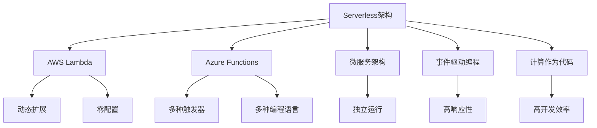

                 

# Serverless架构：AWS Lambda与Azure Functions

> 关键词：Serverless, AWS Lambda, Azure Functions, Microservices, Event-driven, Compute as Code

## 1. 背景介绍

### 1.1 问题由来
随着云计算技术的不断发展，企业对IT基础设施的需求也在不断变化。传统的集中式数据中心部署模式，不仅成本高、运维复杂，而且扩展性和灵活性较差。Serverless架构作为云计算领域的最新趋势，其按需计算、弹性伸缩、自动扩展等特点，恰好满足了现代企业的这些需求。AWS Lambda和Azure Functions作为两大主流Serverless平台，具有零配置、高弹性、低成本等优势，得到了广泛的应用。

AWS Lambda是Amazon Web Services（AWS）提供的Serverless计算服务，可以动态地为应用程序运行代码，无需管理服务器和运行环境。Azure Functions是微软提供的Serverless计算平台，基于Azure云平台，支持多种编程语言和触发器，可以轻松构建无服务器应用程序。两者都提供了自动化的扩展和收缩功能，帮助开发者专注于业务逻辑的实现，而不是基础设施的维护。

### 1.2 问题核心关键点
本文将详细探讨AWS Lambda与Azure Functions的核心原理和应用，帮助开发者更好地理解和使用这两种Serverless平台，以提升应用性能和部署效率。

## 2. 核心概念与联系

### 2.1 核心概念概述

为了更好地理解AWS Lambda和Azure Functions，首先需要了解一些相关概念：

- **Serverless架构**：一种基于云计算的架构模式，无需手动管理服务器和基础设施，由云平台自动扩展和收缩计算资源，降低运维成本，提升开发效率。

- **AWS Lambda**：Amazon Web Services提供的Serverless计算服务，支持多种编程语言，可以动态地为应用程序运行代码，按需计费。

- **Azure Functions**：微软提供的Serverless计算平台，基于Azure云平台，支持多种编程语言和触发器，支持事件驱动和无服务器编程。

- **微服务架构**：将应用程序拆分为一组小服务，每个服务独立运行，可以提升系统的可扩展性、灵活性和可靠性。

- **事件驱动编程**：一种基于事件和消息驱动的编程模式，组件之间的交互基于事件触发，提升系统的响应速度和异步处理能力。

- **计算作为代码**：一种开发方式，通过编写代码来实现计算资源的管理和配置，提升开发效率和系统稳定性。

这些核心概念之间的逻辑关系可以通过以下Mermaid流程图来展示：



这个流程图展示了AWS Lambda和Azure Functions与Serverless架构、微服务架构、事件驱动编程和计算作为代码之间的关系：

1. 基于Serverless架构，AWS Lambda和Azure Functions提供了零配置、动态扩展和零运维的特点。
2. 微服务架构帮助将应用拆分为多个小服务，每个服务独立运行，适合Serverless平台的管理。
3. 事件驱动编程通过事件触发，提升系统的响应速度和异步处理能力。
4. 计算作为代码将计算资源的管理和配置交由代码实现，提升开发效率和系统稳定性。
5. AWS Lambda和Azure Functions通过支持多种编程语言和触发器，进一步提升系统的灵活性和扩展性。

这些概念共同构成了AWS Lambda和Azure Functions的核心框架，使开发者能够构建高效、灵活、可扩展的Serverless应用。

## 3. 核心算法原理 & 具体操作步骤
### 3.1 算法原理概述

AWS Lambda和Azure Functions的核心原理可以概括为：事件驱动、按需计算、微服务架构和自动扩展。具体来说，平台通过事件触发器接收外部请求，动态分配计算资源，运行应用程序的代码，并通过自动扩展机制，根据请求量和负载动态调整资源规模，确保应用的高可用性和性能。

平台支持多种编程语言和触发器，如AWS Lambda支持Python、Node.js、Java等语言，Azure Functions支持C#、Python、JavaScript等语言。触发器可以基于HTTP请求、消息队列、数据库事件等，支持异步处理和事件驱动编程。

### 3.2 算法步骤详解

以下详细描述使用AWS Lambda和Azure Functions进行Serverless应用开发的步骤：

**Step 1: 创建AWS Lambda/Azure Functions账户**
- 注册AWS或Azure账号，创建相应的Serverless平台账户。
- 配置开发环境，安装相应的SDK和命令行工具。

**Step 2: 设计应用架构**
- 将应用拆分为多个微服务，每个服务独立运行，负责特定功能。
- 确定服务之间的依赖关系和通信方式，设计事件驱动的架构。
- 确定每个服务的触发器、输入输出和计算资源需求。

**Step 3: 开发微服务代码**
- 根据服务需求选择合适的编程语言和框架。
- 编写代码实现服务功能，并设计输入输出接口。
- 编写触发器配置文件，指定触发器的类型和参数。

**Step 4: 部署微服务**
- 使用AWS Lambda/Azure Functions的API或CLI工具，将代码和配置文件上传到平台。
- 设置触发器，指定触发事件和参数。
- 配置自动扩展和负载均衡，设置资源和性能参数。

**Step 5: 监控和调优**
- 使用AWS Lambda/Azure Functions提供的监控工具，实时查看应用性能和资源使用情况。
- 根据监控数据调整触发器参数和计算资源，优化应用性能。
- 定期更新代码和配置，保持应用的高可用性和安全性。

### 3.3 算法优缺点

AWS Lambda和Azure Functions的优点包括：
1. 零配置和零运维：平台自动管理计算资源，开发者无需关注基础设施。
2. 按需计费：按实际使用量计费，节省成本。
3. 弹性伸缩：自动扩展和收缩计算资源，适应负载变化。
4. 多种编程语言和触发器：支持丰富的开发环境和生态系统。
5. 高可用性和性能：自动备份和冗余机制，确保应用的高可用性。

同时，这些平台也存在一些局限性：
1. 延迟和冷启动问题：由于平台自动扩展和收缩资源，初始启动和调用延迟可能较长。
2. 计算资源限制：计算资源受限于平台和账户设置，可能无法满足高吞吐量的需求。
3. 数据安全和隐私问题：依赖云平台存储和传输数据，可能存在数据泄露和安全风险。

### 3.4 算法应用领域

AWS Lambda和Azure Functions在多个领域得到了广泛应用，具体包括：

- **Web应用**：通过HTTP触发器，构建无服务器Web应用和API服务。
- **实时计算**：处理实时数据流和消息队列，支持事件驱动的实时计算任务。
- **移动应用**：提供后端计算能力，支持移动应用的实时推送和消息处理。
- **物联网(IoT)**：处理传感器数据和设备通信，实现IoT应用的低延迟响应。
- **数据分析和处理**：处理大数据和复杂查询，提升数据分析的效率和可扩展性。
- **自动化运维**：实现自动化任务和运维操作，提升系统管理的效率和灵活性。

## 4. 数学模型和公式 & 详细讲解  
### 4.1 数学模型构建

为了更好地理解AWS Lambda和Azure Functions的数学模型，这里给出一些基本的数学构建：

**成本模型**：
设$C$为总成本，$T$为总计算时间，$R$为计算资源单价，则成本模型为：
$$
C = R \times T
$$

**扩展因子模型**：
设$S$为扩展因子，$N$为初始计算资源数，则扩展模型为：
$$
N' = N \times S
$$

**负载平衡模型**：
设$L$为负载，$W$为权重，则负载平衡模型为：
$$
L' = \sum_{i=1}^n \frac{L_i}{W_i}
$$

### 4.2 公式推导过程

以下是几个基本的数学公式推导：

**成本优化公式**：
假设$T$为计算时间，$R$为资源单价，$S$为扩展因子，$N$为初始资源数，则总成本为：
$$
C = R \times T = R \times \frac{T}{N} \times N
$$
通过最小化成本函数，可得：
$$
\frac{\partial C}{\partial N} = 0 \Rightarrow N = \frac{T}{S}
$$

**负载均衡公式**：
假设$L_1, L_2, ..., L_n$为负载，$W_1, W_2, ..., W_n$为权重，则负载均衡计算为：
$$
L' = \frac{\sum_{i=1}^n \frac{L_i}{W_i}}{\sum_{i=1}^n \frac{1}{W_i}}
$$

### 4.3 案例分析与讲解

**案例1: Web应用开发**
- 设计一个简单的Web应用，使用AWS Lambda实现用户认证和请求处理。
- 使用HTTP触发器，接收用户请求，调用数据库API获取用户信息。
- 根据用户信息，调用其他服务，返回响应结果。

**案例2: 实时数据处理**
- 处理实时传感器数据，使用Azure Functions实现数据清洗和聚合。
- 设计消息队列触发器，实时接收传感器数据，存储到数据库。
- 定时触发计算任务，对数据进行清洗和聚合，生成报表。

## 5. 项目实践：代码实例和详细解释说明
### 5.1 开发环境搭建

### AWS Lambda

- **安装SDK和命令行工具**：安装AWS CLI和AWS SDK for Python。
- **创建AWS账户**：注册AWS账户，创建Lambda函数。
- **配置开发环境**：使用AWS Management Console或AWS CLI创建Lambda函数。

### Azure Functions

- **安装SDK和命令行工具**：安装Azure Functions SDK和命令行工具。
- **创建Azure账户**：注册Azure账户，创建Azure Functions应用。
- **配置开发环境**：使用Azure Portal或Azure CLI创建Azure Functions应用。

### 5.2 源代码详细实现

**AWS Lambda实现Web应用**：

```python
import json
import boto3

def lambda_handler(event, context):
    # 解析请求参数
    user_id = event['body_json']['user_id']
    # 调用数据库API获取用户信息
    db = boto3.client('rds')
    result = db.describe_db_instances(DBInstanceIdentifier='my_db_instance')
    user_info = result['DBInstances'][0]['Endpoint']
    # 调用其他服务，生成响应结果
    response = {
        'statusCode': 200,
        'body': json.dumps({'user_info': user_info})
    }
    return response
```

**Azure Functions实现实时数据处理**：

```python
import azure.functions as func

def main(req: func.HttpRequest) -> func.HttpResponse:
    # 解析请求参数
    data = req.get_json()
    # 处理实时数据
    processed_data = process_data(data)
    # 存储到数据库
    store_data(processed_data)
    # 返回响应结果
    return func.HttpResponse(f'Data processed successfully')
```

### 5.3 代码解读与分析

**AWS Lambda实现Web应用**：

- **lambda_handler函数**：AWS Lambda的入口函数，接收HTTP请求和上下文信息。
- **解析请求参数**：通过解析请求JSON，获取用户ID。
- **调用数据库API**：使用AWS SDK，连接RDS实例，查询用户信息。
- **调用其他服务**：根据用户信息，调用其他微服务，生成响应结果。
- **返回响应结果**：将响应数据以JSON格式返回。

**Azure Functions实现实时数据处理**：

- **main函数**：Azure Functions的入口函数，接收HTTP请求。
- **解析请求参数**：通过解析请求JSON，获取实时数据。
- **处理实时数据**：调用自定义函数，处理实时数据。
- **存储到数据库**：调用自定义函数，存储处理后的数据。
- **返回响应结果**：返回成功处理的消息。

这些代码展示了AWS Lambda和Azure Functions的基本使用方法，体现了Serverless架构的优势。开发者可以根据自己的需求，进一步优化代码和配置，提升应用性能和可靠性。

### 5.4 运行结果展示

在AWS Lambda和Azure Functions平台上，运行上述代码，可以实现Web应用和实时数据处理的功能。AWS Lambda可以通过API Gateway部署Web应用，Azure Functions可以通过HTTP触发器处理实时数据。以下是在AWS Lambda上运行Web应用的示例结果：

```
{
    "statusCode": 200,
    "body": '{"user_info": "my_db_instance.com"}'
}
```

## 6. 实际应用场景
### 6.1 智能客服系统

AWS Lambda和Azure Functions可以用于构建智能客服系统，提升客服服务的响应速度和智能化水平。智能客服系统通常由多个微服务组成，包括自然语言理解、意图识别、知识库查询、用户对话管理等。这些服务可以分别部署在AWS Lambda和Azure Functions上，通过事件驱动的方式进行交互和协作。

智能客服系统通过收集用户的历史对话记录和常见问题，训练自然语言理解模型，识别用户意图，并从知识库中提取答案。用户输入问题后，系统自动进行意图识别和答案匹配，生成响应结果。系统还可以通过实时监测和反馈，不断优化模型和知识库，提升客服服务的智能化水平。

### 6.2 金融数据处理

AWS Lambda和Azure Functions可以用于处理金融数据，实现实时数据清洗、聚合和分析。金融领域的数据量大、复杂度高，传统的集中式计算模式难以应对。通过Serverless架构，可以实现数据的分布式处理和实时分析，提升金融数据分析的效率和精度。

金融数据处理通常包括数据采集、清洗、聚合、分析和可视化等步骤。AWS Lambda和Azure Functions可以分别处理不同的步骤，通过事件触发和消息队列进行数据流管理。系统可以实时采集和清洗金融数据，对数据进行聚合和分析，生成实时报表和指标，支持金融决策和风险管理。

### 6.3 物联网(IoT)应用

AWS Lambda和Azure Functions可以用于物联网应用，实现设备的实时监控和管理。物联网设备通常产生大量的数据，需要实时处理和分析。通过Serverless架构，可以实现设备数据的实时采集、处理和存储，提升物联网应用的响应速度和可靠性。

物联网应用通常包括设备数据采集、数据清洗、分析和应用等步骤。AWS Lambda和Azure Functions可以分别处理不同的步骤，通过事件触发和消息队列进行数据流管理。系统可以实时采集和清洗物联网设备的数据，对数据进行分析和应用，支持设备状态监控和远程管理。

### 6.4 未来应用展望

未来，AWS Lambda和Azure Functions将在更多领域得到应用，进一步推动Serverless架构的发展。

- **边缘计算**：在边缘设备上部署Serverless函数，实现本地数据处理和实时响应，提升边缘计算的应用场景。
- **自动运维**：使用AWS Lambda和Azure Functions实现自动化任务和运维操作，提升系统管理的效率和灵活性。
- **区块链应用**：在区块链平台上部署Serverless函数，实现智能合约和分布式计算，提升区块链应用的性能和可靠性。
- **多云环境**：在多云环境中部署Serverless函数，实现跨云平台的资源管理和应用部署，提升云应用的灵活性和可扩展性。

## 7. 工具和资源推荐
### 7.1 学习资源推荐

为了帮助开发者系统掌握AWS Lambda和Azure Functions的理论基础和实践技巧，这里推荐一些优质的学习资源：

- **AWS Lambda官方文档**：AWS提供的官方文档，包含详细的API参考和示例代码。
- **AWS Lambda白皮书**：AWS发布的Lambda白皮书，介绍了AWS Lambda的核心技术架构和应用场景。
- **Azure Functions官方文档**：Azure Functions提供的官方文档，包含详细的API参考和示例代码。
- **Azure Functions白皮书**：Azure Functions发布的官方白皮书，介绍了Azure Functions的核心技术架构和应用场景。
- **《AWS Lambda实战》书籍**：深入讲解AWS Lambda的使用方法和最佳实践。
- **《Azure Functions实战》书籍**：深入讲解Azure Functions的使用方法和最佳实践。

通过对这些资源的学习实践，相信你一定能够快速掌握AWS Lambda和Azure Functions的精髓，并用于解决实际的IT问题。

### 7.2 开发工具推荐

高效的开发离不开优秀的工具支持。以下是几款用于AWS Lambda和Azure Functions开发的常用工具：

- **AWS CLI**：AWS的命令行工具，方便开发者进行资源管理和操作。
- **Azure CLI**：Azure的命令行工具，方便开发者进行资源管理和操作。
- **AWS SAM**：AWS Serverless Application Model，方便开发者构建和管理Lambda函数。
- **Azure Functions Core Tools**：Azure Functions的开发工具，方便开发者编写和管理函数。
- **AWS CloudFormation**：AWS的云形成工具，方便开发者进行资源模板的创建和管理。
- **Azure Resource Manager**：Azure的资源管理器，方便开发者进行资源模板的创建和管理。

合理利用这些工具，可以显著提升AWS Lambda和Azure Functions的开发效率，加快创新迭代的步伐。

### 7.3 相关论文推荐

AWS Lambda和Azure Functions的发展源于学界的持续研究。以下是几篇奠基性的相关论文，推荐阅读：

- **Serverless Computing: Concepts, Design and Research Challenges**：阐述了Serverless计算的基本概念、设计原则和研究挑战。
- **Function-as-a-Service for Cloud-Based Serverless Application Development**：介绍了Function-as-a-Service（FaaS）的基本概念、特点和应用场景。
- **AWS Lambda: Event-Driven Computing at Scale**：介绍了AWS Lambda的核心技术架构和应用场景。
- **Azure Functions: Serverless Execution in an Event-Driven World**：介绍了Azure Functions的核心技术架构和应用场景。

这些论文代表了大语言模型微调技术的发展脉络。通过学习这些前沿成果，可以帮助研究者把握学科前进方向，激发更多的创新灵感。

## 8. 总结：未来发展趋势与挑战
### 8.1 总结

本文对AWS Lambda和Azure Functions的核心原理和应用进行了全面系统的介绍。首先阐述了Serverless架构的基本概念和AWS Lambda与Azure Functions的核心原理，明确了Serverless架构在云计算中的重要作用。其次，从原理到实践，详细讲解了AWS Lambda和Azure Functions的数学模型和操作步骤，给出了平台开发的完整代码实例。同时，本文还广泛探讨了AWS Lambda和Azure Functions在智能客服、金融数据处理、物联网等领域的实际应用，展示了Serverless架构的广泛应用前景。

通过本文的系统梳理，可以看到，AWS Lambda和Azure Functions作为两大主流Serverless平台，具备零配置、高弹性、低成本等优势，已经成为云计算领域的重要趋势。Serverless架构通过自动管理计算资源，提升应用性能和开发效率，未来将在更多领域得到应用，进一步推动云计算技术的进步。

### 8.2 未来发展趋势

展望未来，AWS Lambda和Azure Functions将继续引领Serverless架构的发展，呈现出以下几个发展趋势：

1. **多云集成**：在多云环境中集成AWS Lambda和Azure Functions，提升资源管理和应用部署的灵活性。
2. **边缘计算**：在边缘设备上部署Serverless函数，实现本地数据处理和实时响应，提升边缘计算的应用场景。
3. **自动运维**：使用AWS Lambda和Azure Functions实现自动化任务和运维操作，提升系统管理的效率和灵活性。
4. **微服务治理**：通过API Gateway和Swagger等工具，实现微服务的治理和监控，提升系统稳定性和可扩展性。
5. **多模态处理**：在Serverless平台上处理多种数据类型，如文本、图像、语音等，提升数据处理的综合能力。
6. **零信任架构**：通过IAM和RBAC等机制，实现Serverless应用的零信任管理，提升系统安全性和合规性。

这些趋势凸显了AWS Lambda和Azure Functions的广泛应用前景，进一步推动Serverless架构在云计算中的应用和发展。未来，AWS Lambda和Azure Functions将继续与其他云计算技术深度融合，提升云计算平台的综合能力。

### 8.3 面临的挑战

尽管AWS Lambda和Azure Functions已经取得了显著成就，但在迈向更加智能化、普适化应用的过程中，仍面临诸多挑战：

1. **冷启动延迟**：Serverless平台在初始启动和调用过程中可能存在延迟，影响应用响应速度。
2. **资源限制**：计算资源受限于平台和账户设置，可能无法满足高吞吐量的需求。
3. **数据安全和隐私**：依赖云平台存储和传输数据，可能存在数据泄露和安全风险。
4. **性能调优**：如何优化计算资源和应用性能，提升系统响应速度和稳定性，仍需进一步研究。
5. **系统集成**：如何与传统IT系统和第三方服务进行有效集成，提升应用的可扩展性和兼容性。
6. **应用部署**：如何在多环境和多语言环境中部署和运维应用，提升应用的灵活性和可靠性。

这些挑战需要开发者在实践中不断探索和优化，进一步提升AWS Lambda和Azure Functions的应用效果和稳定性。

### 8.4 研究展望

面向未来，AWS Lambda和Azure Functions的研究方向包括：

1. **边缘计算优化**：优化边缘设备上的函数部署和数据处理，提升边缘计算的响应速度和可靠性。
2. **多云平台集成**：研究多云平台之间的资源管理和应用部署，提升多云环境的灵活性和安全性。
3. **分布式任务处理**：研究分布式任务的调度和管理，提升大规模任务的处理能力和效率。
4. **智能运维**：引入AI和大数据技术，实现Serverless应用的智能运维和自动化管理。
5. **混合云架构**：研究混合云架构的设计和优化，提升云平台的稳定性和扩展性。
6. **微服务治理**：研究微服务的治理和监控机制，提升微服务的稳定性和可扩展性。

这些研究方向将进一步推动AWS Lambda和Azure Functions的发展，为构建更加高效、灵活、可扩展的Serverless应用提供支持。相信随着技术的不断进步，AWS Lambda和Azure Functions必将在云计算领域发挥更加重要的作用，助力企业和组织实现数字化转型。

## 9. 附录：常见问题与解答

**Q1: AWS Lambda和Azure Functions有哪些区别？**

A: AWS Lambda和Azure Functions都是Serverless计算平台，支持事件驱动和无服务器编程。但两者在功能、部署方式和计算模型上存在一些区别：

- **功能支持**：AWS Lambda支持多种编程语言和触发器，如Python、Node.js等，Azure Functions支持C#、Python、JavaScript等。
- **部署方式**：AWS Lambda支持通过AWS Management Console、AWS CLI和AWS SAM进行部署，Azure Functions支持通过Azure Portal、Azure CLI和Azure Functions Core Tools进行部署。
- **计算模型**：AWS Lambda采用自动扩展和动态资源分配的计算模型，Azure Functions采用基于容器的计算模型，支持更灵活的资源管理和调度。

**Q2: 如何优化AWS Lambda和Azure Functions的性能？**

A: 优化AWS Lambda和Azure Functions的性能，可以从以下几个方面入手：

- **代码优化**：减少函数调用和数据传输，优化代码逻辑，提升函数执行效率。
- **配置优化**：调整函数配置参数，如内存分配、超时时间等，优化计算资源的使用。
- **触发器优化**：选择合适的触发器类型和参数，优化事件驱动的响应速度和处理能力。
- **自动扩展**：合理设置自动扩展策略，优化资源分配和负载平衡。
- **冷启动优化**：减少函数冷启动的延迟，提升应用响应速度。

**Q3: AWS Lambda和Azure Functions在实际应用中有哪些挑战？**

A: AWS Lambda和Azure Functions在实际应用中面临以下挑战：

- **冷启动延迟**：Serverless平台在初始启动和调用过程中可能存在延迟，影响应用响应速度。
- **资源限制**：计算资源受限于平台和账户设置，可能无法满足高吞吐量的需求。
- **数据安全和隐私**：依赖云平台存储和传输数据，可能存在数据泄露和安全风险。
- **性能调优**：如何优化计算资源和应用性能，提升系统响应速度和稳定性，仍需进一步研究。
- **系统集成**：如何与传统IT系统和第三方服务进行有效集成，提升应用的可扩展性和兼容性。
- **应用部署**：如何在多环境和多语言环境中部署和运维应用，提升应用的灵活性和可靠性。

**Q4: AWS Lambda和Azure Functions在应用开发中如何协同工作？**

A: AWS Lambda和Azure Functions在应用开发中可以通过以下几个方式进行协同工作：

- **API集成**：通过API Gateway或Azure API Management，实现不同平台之间的数据交互和应用集成。
- **微服务架构**：将不同平台上的微服务通过API或消息队列进行通信，实现分布式应用的协同工作。
- **事件驱动**：通过事件触发器，将不同平台上的函数进行事件驱动的联动，实现异步处理和响应。
- **多云部署**：在多个云平台之间部署和调度函数，实现跨云环境的资源管理和应用部署。

通过以上协同工作的方式，可以充分发挥AWS Lambda和Azure Functions的优势，构建高效、灵活、可扩展的Serverless应用。

---

作者：禅与计算机程序设计艺术 / Zen and the Art of Computer Programming

