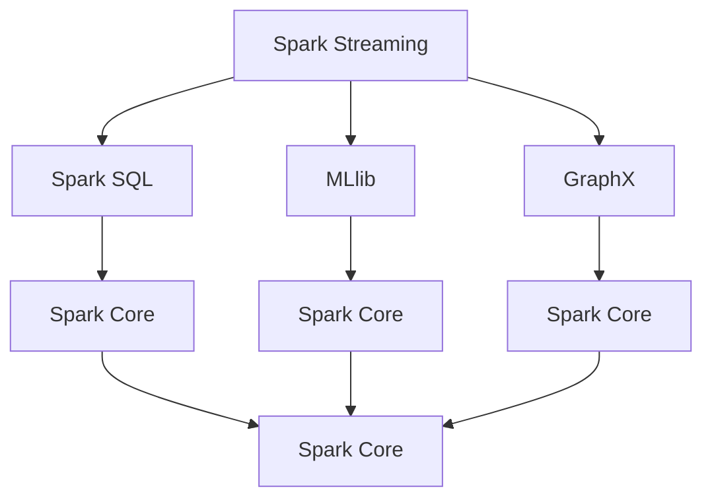

                 

# Spark大数据实时计算框架

> 关键词：Spark,大数据,实时计算,流处理,分布式系统,图计算,MLlib

## 1. 背景介绍

### 1.1 问题由来
随着数据量的爆炸性增长，大数据处理技术已成为信息技术领域的关键技术之一。传统的数据仓库和批处理系统难以满足大规模数据实时处理的需求。Spark作为一种快速崛起的分布式计算框架，凭借其卓越的计算性能、易用性和广泛的生态支持，成为大数据实时处理的首选方案。

Spark由Apache基金会于2010年发起，是一个基于内存的分布式计算框架，能够高效处理海量数据。Spark的核心组件包括Spark Core、Spark SQL、Spark Streaming、MLlib和GraphX等。其中，Spark Streaming和MLlib是处理实时数据和机器学习任务的主要组件。

Spark Streaming提供了一套强大的API和运算符，用于处理实时数据流，包括微批处理和事件处理。Spark MLlib则提供了丰富的机器学习算法和工具，支持分布式训练、模型评估和预测。

## 2. 核心概念与联系

### 2.1 核心概念概述

为了更好地理解Spark实时计算框架，本节将介绍几个密切相关的核心概念：

- Spark Streaming：Spark的流处理组件，提供了一套API和运算符，用于处理实时数据流。
- Spark SQL：Spark的SQL查询组件，支持交互式SQL查询和数据仓库功能。
- MLlib：Spark的机器学习组件，提供丰富的算法和工具，用于分布式训练和模型评估。
- GraphX：Spark的图处理组件，提供高效的图处理算法和接口。

这些核心概念之间通过分布式计算框架Spark Core进行连接，形成一个完整的大数据处理生态。Spark Core负责任务调度、内存管理、容错处理等基本功能，通过与各组件的集成，提供灵活、高效的大数据处理能力。

### 2.2 核心概念原理和架构的 Mermaid 流程图



该流程图展示了Spark各组件之间的联系：

1. Spark Streaming和Spark SQL通过Spark Core进行连接，共同实现大数据的实时处理和分析。
2. MLlib和GraphX通过Spark Core提供的数据模型和算法支持，拓展了Spark的数据处理能力。
3. Spark Core作为底层基础，负责调度和管理各组件的资源。

## 3. 核心算法原理 & 具体操作步骤

### 3.1 算法原理概述

Spark实时计算框架的核心算法包括分布式并行计算、弹性调度、内存管理、容错处理等。Spark的分布式并行计算基于RDD（弹性分布式数据集）和DataFrame两种数据模型，支持流处理和批处理。Spark的弹性调度通过YARN、Mesos等资源管理器，实现任务的动态分配和调整。Spark的内存管理通过将数据缓存在内存中，减少磁盘I/O，提高计算效率。Spark的容错处理通过检查点和线级容错机制，保证任务的可靠性和一致性。

### 3.2 算法步骤详解

Spark实时计算框架的核心步骤如下：

**Step 1: 数据预处理**
- 收集原始数据，并根据需求进行预处理，包括去重、清洗、采样等操作。
- 将数据划分为小批量进行处理，生成RDD或DataFrame对象。

**Step 2: 任务调度与执行**
- 使用Spark Core提供的API，定义处理任务和数据流图。
- 通过资源管理器提交任务，Spark Core根据任务的资源需求和资源情况进行调度。

**Step 3: 分布式计算与容错处理**
- 将任务并行分配到各个计算节点上，节点间通过Spark的弹性分布式数据集(RDD)进行数据共享和计算。
- 在计算过程中，Spark实时监控任务的执行情况，通过检查点和线级容错机制保证任务的一致性。

**Step 4: 结果输出与优化**
- 将计算结果输出到HDFS、S3等存储系统，或进行可视化展示。
- 使用Spark的性能优化工具，如Tungsten、Spark UI等，监控和调整计算性能。

### 3.3 算法优缺点

Spark实时计算框架具有以下优点：

1. 高性能：基于内存计算，Spark能够高效处理大规模数据。
2. 易用性：提供SQL查询和机器学习API，支持多种编程语言和数据格式。
3. 弹性调度：通过分布式计算和资源调度，可以动态扩展计算资源。
4. 容错处理：通过检查点和容错机制，保证任务的一致性和可靠性。
5. 广泛生态：Spark生态系统包括Spark Streaming、Spark SQL、MLlib和GraphX等多个组件，满足不同需求。

同时，Spark实时计算框架也存在以下局限性：

1. 内存限制：Spark需要大量的内存支持，对于小规模数据集可能存在资源浪费。
2. 延迟问题：Spark流处理的延迟较高，不适合对实时性要求极高的应用。
3. 复杂性：Spark的分布式特性需要一定的学习成本，上手难度较大。
4. 兼容性：Spark与其他大数据框架（如Hadoop）的兼容性有待提升。

尽管存在这些局限性，但Spark仍是目前处理大规模实时数据的首选方案之一，尤其在大数据和机器学习领域表现卓越。

### 3.4 算法应用领域

Spark实时计算框架在多个领域得到了广泛应用，包括：

1. 实时数据处理：Spark Streaming支持微批处理和事件处理，能够高效处理海量实时数据，广泛应用于实时监控、实时计算、实时分析等场景。
2. 机器学习：Spark MLlib提供了丰富的算法和工具，支持分布式训练和模型评估，广泛应用于推荐系统、欺诈检测、图像识别等场景。
3. 图处理：Spark GraphX提供了高效的图处理算法和接口，应用于社交网络分析、路径规划、推荐系统等场景。
4. 数据仓库：Spark SQL支持交互式SQL查询和数据仓库功能，能够高效处理大规模数据，广泛应用于企业数据湖和数据仓库构建。
5. 实时数据流：Spark Streaming支持事件处理和微批处理，广泛应用于实时数据流处理、实时计算、实时分析等场景。
6. 分布式系统：Spark的分布式计算和资源调度特性，广泛应用于高性能计算、大数据分析、分布式存储等场景。

## 4. 数学模型和公式 & 详细讲解 & 举例说明

### 4.1 数学模型构建

Spark实时计算框架的核心数学模型包括RDD、DataFrame和分布式计算等。

RDD是Spark的基本数据结构，由一组分散在集群节点上的数据块组成，支持分布式并行计算。

DataFrame是Spark的高级数据结构，由一组分布式数据块组成，支持结构化数据处理和SQL查询。

分布式计算模型基于MapReduce和DAG（有向无环图）计算，Spark通过优化DAG图，减少计算的开销，提高计算效率。

### 4.2 公式推导过程

以Spark Streaming的微批处理为例，推导其核心计算公式。

假设原始数据流由一系列连续的元组流组成，每个元组包含一组数据项。Spark Streaming将数据流分为大小为$k$的小批量，每个小批量包含$k$个元组。

令$S$为小批量的大小，$T$为批处理的时间间隔。令$n$为批处理的批数。则微批处理的计算公式为：

$$
\frac{k}{T} \times \frac{n}{k} = \frac{n}{T}
$$

其中$\frac{n}{T}$表示批处理的批数，$\frac{k}{T}$表示每个批处理的大小。

### 4.3 案例分析与讲解

以Spark Streaming为例，分析其微批处理和事件处理的计算过程。

假设原始数据流每秒产生100个元组，每个元组包含10个数据项，Spark Streaming将数据流分为大小为10000个元组的小批量，批处理的时间间隔为1秒。则每个批处理包含100个元组，每个元组的计算开销为$\frac{1}{100}T$秒。

令$N$为总元组数，则微批处理的计算开销为：

$$
\frac{N}{100} \times \frac{1}{100}T
$$

在实际应用中，Spark Streaming还支持事件处理，即根据特定事件触发计算。例如，根据用户行为数据触发推荐系统计算，可根据用户行为数据产生的事件流，计算推荐结果。

## 5. 项目实践：代码实例和详细解释说明

### 5.1 开发环境搭建

要进行Spark项目开发，首先需要搭建好Spark开发环境。以下是搭建Spark开发环境的流程：

1. 安装Java：Spark依赖Java运行环境，需要在系统上安装JDK。
2. 安装Scala：Spark基于Scala开发，需要安装Scala编译器和运行时环境。
3. 安装Hadoop：Spark依赖Hadoop作为分布式存储，需要在系统上安装Hadoop分布式文件系统。
4. 安装Spark：从Apache官网下载安装包，解压后进入bin目录启动Spark集群。
5. 安装PySpark：安装Python版本的Spark，可以在Jupyter Notebook中进行Python开发。

完成上述步骤后，即可在本地搭建Spark开发环境，开始项目开发。

### 5.2 源代码详细实现

以下是Spark Streaming微批处理代码的详细实现：

```python
from pyspark import SparkConf, SparkContext, StreamingContext

# 创建SparkConf对象，设置Spark配置信息
conf = SparkConf().setMaster('local').setAppName('Spark Streaming Demo')

# 创建SparkContext对象
sc = SparkContext(conf=conf)

# 创建StreamingContext对象，设置批处理间隔为1秒
ssc = StreamingContext(sc, 1)

# 定义处理函数
def processStream(stream):
    # 对每个元组进行处理，输出结果
    print(stream)

# 获取原始数据流
dataStream = sc.socketTextStream('127.0.0.1', 9999)

# 使用StreamingContext创建流处理任务
stream = ssc.socketStream('127.0.0.1', 9999)

# 对数据流进行微批处理，批处理大小为100个元组
stream.foreachRDD(lambda rdd: rdd.foreach(processStream))

# 启动流处理任务
ssc.start()

# 等待流处理任务结束
ssc.awaitTermination()
```

### 5.3 代码解读与分析

上述代码实现了一个简单的Spark Streaming微批处理任务，其核心逻辑如下：

1. 创建SparkConf和SparkContext对象，设置Spark配置信息。
2. 创建StreamingContext对象，设置批处理间隔为1秒。
3. 定义处理函数processStream，对每个元组进行处理并输出结果。
4. 获取原始数据流，使用StreamingContext创建流处理任务。
5. 对数据流进行微批处理，批处理大小为100个元组。
6. 启动流处理任务，等待任务结束。

代码中使用了SocketTextStream获取原始数据流，并使用foreachRDD方法对数据流进行微批处理。微批处理时，使用lambda表达式指定处理函数，对每个批处理的结果进行输出。

## 6. 实际应用场景

### 6.1 实时数据流处理

Spark Streaming广泛应用于实时数据流处理场景，如实时监控、实时分析、实时计算等。以实时监控为例，Spark Streaming可以处理大规模传感器数据，实时分析设备状态，及时发现异常并采取措施。

### 6.2 实时推荐系统

Spark MLlib提供丰富的机器学习算法和工具，支持实时推荐系统构建。以电商推荐系统为例，Spark Streaming可以实时处理用户行为数据，计算推荐结果，实时推送到用户端。

### 6.3 社交网络分析

Spark GraphX提供高效的图处理算法和接口，支持社交网络分析等场景。以社交网络分析为例，Spark GraphX可以实时处理社交媒体数据，分析用户之间的关系和影响力，应用于社交广告、网络安全等领域。

### 6.4 未来应用展望

Spark实时计算框架在多个领域得到了广泛应用，未来将在以下方向进一步拓展：

1. 实时流处理：Spark Streaming将进一步优化微批处理和事件处理，提高实时处理的延迟和吞吐量。
2. 机器学习：Spark MLlib将引入更多先进的机器学习算法和工具，支持实时训练和预测。
3. 图处理：Spark GraphX将拓展图处理能力，支持更大规模的图计算。
4. 分布式系统：Spark将与其他大数据框架（如Hadoop、Kafka）深度融合，提供更完善的分布式计算和存储解决方案。
5. 数据仓库：Spark SQL将拓展数据仓库功能，支持更复杂的数据处理和分析。
6. 智能算法：Spark将引入更多智能算法和工具，如自然语言处理、图像处理等，拓展数据处理领域。

## 7. 工具和资源推荐

### 7.1 学习资源推荐

为了帮助开发者掌握Spark实时计算框架，这里推荐一些优质的学习资源：

1. Spark官方文档：Spark官方提供的详细文档，包含Spark的核心概念、API和使用示例。
2. Stanford CS246课程：斯坦福大学开设的Spark课程，讲解Spark的原理和应用。
3. Apache Spark官方网站：Apache基金会提供的Spark文档和资源。
4. Spark教程网站：提供Spark的实战教程和案例分析。
5. Coursera课程：提供Spark相关的课程和实战项目。

通过对这些资源的学习实践，相信你一定能够快速掌握Spark实时计算框架，并用于解决实际的业务问题。

### 7.2 开发工具推荐

Spark实时计算框架的开发需要使用多种工具，以下是几款常用的开发工具：

1. Jupyter Notebook：支持Python和Scala的开发环境，提供交互式编程和代码运行。
2. PySpark：Python版本的Spark，支持分布式计算和流处理。
3. Spark UI：提供Spark的可视化监控界面，方便监控和管理Spark任务。
4. PyCharm：Python IDE，提供强大的代码编辑和调试功能。
5. Eclipse：支持Scala和Java的IDE，提供Spark开发环境。

合理利用这些工具，可以显著提升Spark实时计算框架的开发效率，加快创新迭代的步伐。

### 7.3 相关论文推荐

Spark实时计算框架的研究已取得许多重要成果，以下是几篇奠基性的相关论文，推荐阅读：

1. Resilient Distributed Datasets: A Fault-Tolerant Abstraction for In-Memory Cluster Computing（Spark论文）：提出RDD分布式数据结构，奠定了Spark分布式计算的基础。
2. Spark: Cluster Computing with Fault Tolerance（Spark论文）：提出Spark集群计算框架，支持分布式计算和内存计算。
3. Spark Streaming: Leveraging Resilient Distributed Datasets for Real-Time Stream Processing（Spark Streaming论文）：提出Spark Streaming流处理组件，支持实时数据流处理。
4. Spark MLlib: Machine Learning in Spark（Spark MLlib论文）：提出Spark MLlib机器学习组件，支持分布式训练和预测。
5. GraphX: Graph Processing in Spark（Spark GraphX论文）：提出Spark GraphX图处理组件，支持大规模图计算。

这些论文代表了Spark实时计算框架的发展脉络。通过学习这些前沿成果，可以帮助研究者把握学科前进方向，激发更多的创新灵感。

## 8. 总结：未来发展趋势与挑战

### 8.1 总结

本文对Spark实时计算框架进行了全面系统的介绍。首先阐述了Spark实时计算框架的研究背景和意义，明确了Spark在处理大规模实时数据中的独特价值。其次，从原理到实践，详细讲解了Spark实时计算框架的核心算法和具体操作步骤，给出了Spark实时计算框架的代码实例。同时，本文还广泛探讨了Spark实时计算框架在多个领域的应用前景，展示了Spark实时计算框架的广阔前景。最后，本文精选了Spark实时计算框架的学习资源和开发工具，力求为读者提供全方位的技术指引。

通过本文的系统梳理，可以看到，Spark实时计算框架已经成为处理大规模实时数据的首选方案，极大地拓展了大数据处理的能力，提升了大数据处理的速度和精度。未来，伴随Spark实时计算框架的不断演进，相信Spark将能够处理更加复杂和多样化的数据处理需求，为各行各业带来更多的创新和机遇。

### 8.2 未来发展趋势

展望未来，Spark实时计算框架将呈现以下几个发展趋势：

1. 微批处理优化：Spark Streaming将进一步优化微批处理算法，提高实时处理的延迟和吞吐量。
2. 机器学习优化：Spark MLlib将引入更多先进的机器学习算法和工具，支持实时训练和预测。
3. 图处理优化：Spark GraphX将拓展图处理能力，支持更大规模的图计算。
4. 分布式系统优化：Spark将与其他大数据框架（如Hadoop、Kafka）深度融合，提供更完善的分布式计算和存储解决方案。
5. 数据仓库优化：Spark SQL将拓展数据仓库功能，支持更复杂的数据处理和分析。
6. 智能算法优化：Spark将引入更多智能算法和工具，如自然语言处理、图像处理等，拓展数据处理领域。

以上趋势凸显了Spark实时计算框架的广阔前景。这些方向的探索发展，必将进一步提升Spark实时计算框架的性能和应用范围，为各行各业带来更多的创新和机遇。

### 8.3 面临的挑战

尽管Spark实时计算框架已经取得了瞩目成就，但在迈向更加智能化、普适化应用的过程中，它仍面临诸多挑战：

1. 资源瓶颈：Spark实时计算框架需要大量的内存和计算资源，对于小规模数据集可能存在资源浪费。
2. 延迟问题：Spark流处理的延迟较高，不适合对实时性要求极高的应用。
3. 学习成本：Spark实时计算框架的分布式特性需要一定的学习成本，上手难度较大。
4. 兼容性问题：Spark与其他大数据框架（如Hadoop）的兼容性有待提升。
5. 安全性问题：Spark实时计算框架需要考虑数据隐私和安全问题，确保数据的可靠性和安全性。

尽管存在这些挑战，但随着Spark实时计算框架的持续优化和改进，相信这些挑战终将逐一克服，Spark实时计算框架必将在构建高性能、大容量、智能化的计算系统中发挥更大的作用。

### 8.4 研究展望

面对Spark实时计算框架所面临的种种挑战，未来的研究需要在以下几个方面寻求新的突破：

1. 优化微批处理算法：引入更高效的微批处理算法，提高实时处理的延迟和吞吐量。
2. 引入更多先进算法：引入更多先进的机器学习算法和工具，支持实时训练和预测。
3. 拓展图处理能力：拓展图处理能力，支持更大规模的图计算。
4. 优化分布式系统：与其他大数据框架深度融合，提供更完善的分布式计算和存储解决方案。
5. 拓展数据仓库功能：拓展数据仓库功能，支持更复杂的数据处理和分析。
6. 引入更多智能算法：引入更多智能算法和工具，如自然语言处理、图像处理等，拓展数据处理领域。

这些研究方向将引领Spark实时计算框架的持续演进，推动大数据和人工智能技术的发展。相信随着研究的不断深入，Spark实时计算框架必将取得更多突破，为各行各业带来更多的创新和机遇。

## 9. 附录：常见问题与解答

**Q1: 如何优化Spark实时计算框架的性能？**

A: 优化Spark实时计算框架的性能可以从以下几个方面入手：

1. 调整批处理大小：通过调整批处理大小，可以在延迟和吞吐量之间找到平衡点。一般建议根据实际数据量进行调整。
2. 优化数据分布：通过数据分布优化，减少数据倾斜和热点问题，提高计算效率。
3. 使用Tungsten优化器：Tungsten优化器可以显著提高Spark的计算效率，建议引入Tungsten进行优化。
4. 使用Spark UI进行监控：通过Spark UI进行实时监控，及时发现性能瓶颈并进行优化。
5. 使用HDFS作为存储：HDFS可以提供更好的数据访问和存储性能，建议使用HDFS进行存储。

**Q2: Spark实时计算框架是否适用于所有数据处理场景？**

A: Spark实时计算框架适用于大多数数据处理场景，但在某些场景下可能存在限制。例如，对于实时性要求极高的场景，Spark流处理的延迟可能较高，需要考虑其他实时处理框架。对于小规模数据集，Spark需要大量的内存支持，可能存在资源浪费问题。

**Q3: 如何在Spark实时计算框架中进行分布式计算？**

A: 在Spark实时计算框架中进行分布式计算，需要定义计算任务和数据流图。具体步骤如下：

1. 创建SparkConf和SparkContext对象，设置Spark配置信息。
2. 创建StreamingContext对象，设置批处理间隔。
3. 定义处理函数，对数据流进行处理。
4. 使用StreamingContext创建流处理任务，并指定数据源。
5. 使用foreachRDD或foreachBatch方法对数据流进行并行计算。

**Q4: 如何使用Spark实时计算框架进行实时推荐系统？**

A: 使用Spark实时计算框架进行实时推荐系统，需要完成以下几个步骤：

1. 收集用户行为数据，并将其存储在Hadoop分布式文件系统中。
2. 使用Spark Streaming获取用户行为数据流，并进行预处理。
3. 使用Spark MLlib中的推荐算法，对用户行为数据进行建模和训练。
4. 使用Spark Streaming实时推送推荐结果到用户端。

通过以上步骤，可以实现基于Spark实时计算框架的实时推荐系统构建。

**Q5: 如何在Spark实时计算框架中进行图处理？**

A: 在Spark实时计算框架中进行图处理，需要完成以下几个步骤：

1. 创建SparkConf和SparkContext对象，设置Spark配置信息。
2. 创建GraphX对象，并定义图结构。
3. 使用GraphX的API对图进行计算和分析。
4. 使用Spark Streaming实时处理图数据，并计算图分析结果。

通过以上步骤，可以实现基于Spark实时计算框架的图处理任务。

---

作者：禅与计算机程序设计艺术 / Zen and the Art of Computer Programming

