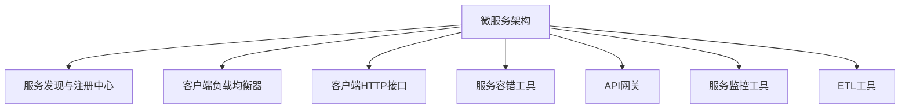

                 

# Spring Cloud微服务架构实战

> 关键词：微服务、Spring Cloud、Eureka、Ribbon、Feign、Hystrix、Zuul、Actuator、DataFlow、Kubernetes、微服务设计模式、容器化部署、DevOps、云原生技术

## 1. 背景介绍

### 1.1 问题由来

随着互联网应用的日益复杂化，单体应用的开发、运维、扩展难度日益增大，如何在保证系统高性能、高可用的前提下，提升应用的开发效率和运维效率，成为开发团队面临的重大挑战。微服务架构（Microservices Architecture）应运而生，它是一种通过将应用拆分为一组松散耦合的小服务来构建分布式系统的架构风格。

在微服务架构中，每个服务都是一个独立运行的应用程序，通过API接口与其他服务进行通信。这种方式大大提升了系统的可扩展性和灵活性，但同时也带来了管理复杂度增加、服务间通信延迟、数据一致性维护等问题。

为了应对这些问题，Spring Cloud（Spring Cloud）应运而生。Spring Cloud是一系列框架的有序集合，它包含了Eureka、Ribbon、Feign、Hystrix、Zuul、Actuator、DataFlow等模块，帮助开发者轻松构建和运维微服务架构，大大降低了微服务架构的开发难度和运维成本。

### 1.2 问题核心关键点

Spring Cloud的核心功能模块包括：
- Eureka：服务发现与注册中心，用于管理微服务的实例注册、服务发现和负载均衡。
- Ribbon：客户端负载均衡器，用于在不同服务实例之间进行负载均衡。
- Feign：客户端HTTP接口，基于Ribbon实现，简化服务调用过程。
- Hystrix：服务容错工具，用于处理微服务调用失败时的服务降级和超时问题。
- Zuul：API网关，用于统一管理所有微服务的入口，实现统一的认证、授权和监控。
- Actuator：服务监控工具，用于实时监控和收集微服务的运行指标和日志信息。
- DataFlow：基于微服务的ETL工具，用于实现微服务之间的数据传递和处理。

这些模块各司其职，通过相互配合，共同构建出高效的微服务架构。

### 1.3 问题研究意义

微服务架构以其可扩展性、灵活性和可维护性等特点，已经成为构建大型应用系统的首选架构。通过Spring Cloud，开发者可以轻松构建和运维微服务架构，提升应用的开发效率和运维效率。但同时也需要了解微服务架构的设计原则、关键技术、开发实践和运维策略，才能高效地构建和管理微服务架构。

本文旨在全面介绍Spring Cloud的核心功能模块，以及微服务架构的设计原则、关键技术、开发实践和运维策略，帮助读者系统掌握Spring Cloud的核心概念和技术细节。

## 2. 核心概念与联系

### 2.1 核心概念概述

为更好地理解Spring Cloud的核心功能模块，本节将介绍几个密切相关的核心概念：

- 微服务架构（Microservices Architecture）：通过将应用拆分为一组松散耦合的小服务来构建分布式系统的架构风格。每个服务都是一个独立运行的应用程序，通过API接口与其他服务进行通信。

- 服务发现与注册中心（Service Discovery and Registration Center）：用于管理微服务的实例注册、服务发现和负载均衡，是微服务架构的关键组件。

- 客户端负载均衡器（Client Load Balancer）：用于在不同服务实例之间进行负载均衡，保证服务的可用性和性能。

- 客户端HTTP接口（Client HTTP Interface）：用于简化服务调用过程，提升服务调用的效率和可靠性。

- 服务容错工具（Service Fault-Tolerance Tool）：用于处理微服务调用失败时的服务降级和超时问题，保证系统的稳定性和可用性。

- API网关（API Gateway）：用于统一管理所有微服务的入口，实现统一的认证、授权和监控，提升系统的安全性和可维护性。

- 服务监控工具（Service Monitoring Tool）：用于实时监控和收集微服务的运行指标和日志信息，帮助运维人员快速定位问题。

- ETL工具（ETL Tool）：用于实现微服务之间的数据传递和处理，提升数据的集成和分析能力。

这些核心概念之间的逻辑关系可以通过以下Mermaid流程图来展示：



这个流程图展示出微服务架构的核心组件及其之间的关系：

1. 微服务架构通过服务发现与注册中心进行服务注册和发现。
2. 客户端负载均衡器用于在不同服务实例之间进行负载均衡。
3. 客户端HTTP接口用于简化服务调用过程。
4. 服务容错工具用于处理服务调用失败和超时问题。
5. API网关用于统一管理所有微服务的入口，实现认证、授权和监控。
6. 服务监控工具用于实时监控和收集微服务的运行指标和日志信息。
7. ETL工具用于实现微服务之间的数据传递和处理。

这些核心组件相互配合，共同构建出高效的微服务架构。

## 3. 核心算法原理 & 具体操作步骤
### 3.1 算法原理概述

Spring Cloud的核心算法原理主要涉及微服务架构的设计原则、关键技术和开发实践。以下是基于Spring Cloud构建微服务架构的核心算法原理：

- 设计原则：微服务架构的设计原则包括“服务拆分”、“自治服务”、“API统一”、“去中心化数据管理”、“可配置配置”和“生产者消费者异步”。这些原则是构建高效微服务架构的基础。

- 关键技术：Spring Cloud提供了丰富的关键技术，如Eureka、Ribbon、Feign、Hystrix、Zuul、Actuator、DataFlow等，这些技术可以大大降低微服务架构的开发难度和运维成本。

- 开发实践：Spring Cloud提供了统一的开发模式，包括“Spring Boot+Spring Cloud”模式和“Spring Boot+Spring Data Flow”模式，大大提升了微服务架构的开发效率。

- 运维策略：Spring Cloud提供了实时的服务监控和日志管理，可以大大提升微服务架构的运维效率。

### 3.2 算法步骤详解

基于Spring Cloud构建微服务架构的算法步骤包括：

**Step 1: 设计微服务架构**

- 根据业务需求和应用场景，设计微服务的拆分和划分，确定每个微服务的功能和边界。
- 根据微服务的拆分和划分，确定服务之间的依赖关系和通信方式。
- 设计微服务的自治性和独立性，确保每个微服务能够独立运行和扩展。

**Step 2: 实现微服务**

- 根据微服务的设计，选择合适的技术栈和开发模式，实现微服务的开发和部署。
- 使用Spring Boot框架实现微服务的快速开发和部署，使用Spring Cloud框架实现微服务的管理和调度。
- 实现微服务之间的API接口，使用Feign或RestTemplate进行服务调用。

**Step 3: 服务发现与注册**

- 使用Eureka作为服务发现与注册中心，实现微服务的实例注册和发现。
- 配置Eureka的客户端和注册中心，实现微服务的动态注册和发现。
- 使用Ribbon或Netflix的DiscoveryClient实现服务实例的负载均衡。

**Step 4: 服务容错与超时**

- 使用Hystrix作为服务容错工具，实现服务的降级和超时处理。
- 配置Hystrix的熔断器和限流器，保证服务的稳定性和可用性。
- 使用Hystrix Dashboard和配置中心实现服务的监控和管理。

**Step 5: 安全与认证**

- 使用Zuul作为API网关，实现微服务的统一认证和授权。
- 配置Zuul的路由和过滤器，实现服务的统一管理和监控。
- 使用OAuth2或JWT实现微服务的认证和授权。

**Step 6: 监控与日志**

- 使用Actuator作为服务监控工具，实现微服务的运行监控和日志管理。
- 配置Actuator的endpoint和Prometheus的监控器，实现微服务的实时监控和告警。
- 使用ELK Stack实现微服务的日志管理和分析。

**Step 7: 数据传递与处理**

- 使用DataFlow作为ETL工具，实现微服务之间的数据传递和处理。
- 配置DataFlow的流式处理引擎和定时任务，实现数据的实时处理和分析。
- 使用Kafka或RabbitMQ实现数据的异步传递和处理。

### 3.3 算法优缺点

Spring Cloud的优点包括：
- 简单易用：Spring Cloud提供了丰富的工具和组件，大大降低了微服务架构的开发难度和运维成本。
- 兼容性强：Spring Cloud可以与Spring Boot、Spring Data等框架无缝集成，提供统一开发模式。
- 可扩展性高：Spring Cloud提供了丰富的插件和扩展，可以灵活定制微服务架构。
- 社区活跃：Spring Cloud是Spring生态系统的核心组成部分，拥有庞大的开发者社区和丰富的资源支持。

Spring Cloud的缺点包括：
- 依赖关系复杂：Spring Cloud涉及多个组件和模块，依赖关系较为复杂，增加了系统维护的难度。
- 性能开销较大：Spring Cloud引入了一系列中间件和插件，增加了系统的性能开销。
- 兼容性问题：Spring Cloud与其他框架（如Hadoop、Spark等）的兼容性问题，需要进行一定的适配和调整。

尽管存在这些缺点，但就目前而言，Spring Cloud仍是构建微服务架构的首选框架。未来相关研究的重点在于如何进一步降低Spring Cloud的依赖关系，提升性能和兼容性，同时兼顾可扩展性和社区活跃度等因素。

### 3.4 算法应用领域

基于Spring Cloud的微服务架构，已经在电商、金融、物流、社交等多个领域得到了广泛应用，为传统行业数字化转型升级提供了新的技术路径。以下是Spring Cloud在几个典型应用场景中的应用：

**电商平台**

电商平台通过Spring Cloud构建微服务架构，实现了系统的快速扩展和稳定运行。使用Eureka进行服务发现和注册，使用Ribbon进行服务负载均衡，使用Zuul进行API网关和统一认证，使用Hystrix进行服务容错和超时处理，使用Actuator进行服务监控和日志管理，使用DataFlow进行数据处理和流式传输，大大提升了系统的性能和可用性。

**金融平台**

金融平台通过Spring Cloud构建微服务架构，实现了系统的分布式部署和统一管理。使用Eureka进行服务发现和注册，使用Ribbon进行服务负载均衡，使用Feign进行客户端HTTP接口，使用Hystrix进行服务容错和超时处理，使用Zuul进行API网关和统一认证，使用Actuator进行服务监控和日志管理，使用DataFlow进行数据处理和流式传输，提升了系统的可靠性和安全性。

**物流平台**

物流平台通过Spring Cloud构建微服务架构，实现了系统的实时处理和灵活扩展。使用Eureka进行服务发现和注册，使用Ribbon进行服务负载均衡，使用Feign进行客户端HTTP接口，使用Hystrix进行服务容错和超时处理，使用Zuul进行API网关和统一认证，使用Actuator进行服务监控和日志管理，使用DataFlow进行数据处理和流式传输，提升了系统的稳定性和可靠性。

除了上述这些经典应用场景外，Spring Cloud还被创新性地应用到更多领域中，如物联网、车联网、智慧城市等，为各行各业带来了新的技术机遇和创新应用。

## 4. 数学模型和公式 & 详细讲解
### 4.1 数学模型构建

本节将使用数学语言对基于Spring Cloud构建微服务架构的过程进行更加严格的刻画。

记微服务架构为 $\mathcal{A}=\{S_1,S_2,\cdots,S_n\}$，其中 $S_i$ 表示第 $i$ 个微服务。每个微服务 $S_i$ 由 $\mathcal{F}_i=\{F_{i1},F_{i2},\cdots,F_{im}\}$ 表示，其中 $F_{ij}$ 表示第 $i$ 个微服务的功能模块。

微服务架构的设计原则可以表示为：
$$
\mathcal{A} = \bigcup_{i=1}^n S_i
$$
$$
S_i \cap S_j = \emptyset \quad \text{对于任意} i \neq j
$$

微服务的自治性和独立性可以表示为：
$$
S_i = \bigcup_{j=1}^m F_{ij}
$$
$$
F_{ij} \cap F_{ik} = \emptyset \quad \text{对于任意} j \neq k
$$

微服务的API接口可以表示为：
$$
\text{API}_i = \{API_{i1},API_{i2},\cdots,API_{im}\}
$$

微服务的负载均衡可以表示为：
$$
\text{LoadBalance} = \{LB_{ij}\}
$$

微服务的容错和超时可以表示为：
$$
\text{FaultTolerance} = \{FT_{ij}\}
$$

微服务的统一认证和授权可以表示为：
$$
\text{Authentication} = \{Auth_{ij}\}
$$

微服务的监控和日志可以表示为：
$$
\text{Monitoring} = \{Mon_{ij}\}
$$

微服务的数据处理和流式传输可以表示为：
$$
\text{DataFlow} = \{Data_{ij}\}
$$

### 4.2 公式推导过程

以下我们以电商平台的订单微服务为例，推导基于Spring Cloud构建微服务架构的数学模型。

假设电商平台的订单微服务包含三个功能模块：订单管理、订单查询、订单支付。订单微服务的设计原则如下：

- 服务拆分：将订单微服务拆分为订单管理、订单查询、订单支付三个独立的功能模块。
- 自治服务：每个功能模块独立运行，相互之间通过API接口进行通信。
- API统一：所有功能模块通过API接口对外暴露，统一管理。
- 去中心化数据管理：订单数据和用户数据分别存储在不同的数据库中。
- 可配置配置：所有功能模块的配置参数通过配置中心统一管理。
- 生产者消费者异步：订单生成、查询、支付通过异步消息队列实现。

电商平台的订单微服务架构可以表示为：
$$
\mathcal{A} = \{S_{订单管理}, S_{订单查询}, S_{订单支付}\}
$$
$$
S_{订单管理} = \{F_{订单管理1},F_{订单管理2},F_{订单管理3}\}
$$
$$
S_{订单查询} = \{F_{订单查询1},F_{订单查询2},F_{订单查询3}\}
$$
$$
S_{订单支付} = \{F_{订单支付1},F_{订单支付2},F_{订单支付3}\}
$$

订单微服务的API接口可以表示为：
$$
\text{API} = \{API_{订单管理},API_{订单查询},API_{订单支付}\}
$$

订单微服务的负载均衡可以表示为：
$$
\text{LoadBalance} = \{LB_{订单管理},LB_{订单查询},LB_{订单支付}\}
$$

订单微服务的容错和超时可以表示为：
$$
\text{FaultTolerance} = \{FT_{订单管理},FT_{订单查询},FT_{订单支付}\}
$$

订单微服务的统一认证和授权可以表示为：
$$
\text{Authentication} = \{Auth_{订单管理},Auth_{订单查询},Auth_{订单支付}\}
$$

订单微服务的监控和日志可以表示为：
$$
\text{Monitoring} = \{Mon_{订单管理},Mon_{订单查询},Mon_{订单支付}\}
$$

订单微服务的数据处理和流式传输可以表示为：
$$
\text{DataFlow} = \{Data_{订单管理},Data_{订单查询},Data_{订单支付}\}
$$

## 5. 项目实践：代码实例和详细解释说明
### 5.1 开发环境搭建

在进行Spring Cloud项目实践前，我们需要准备好开发环境。以下是使用Java开发Spring Cloud项目的环境配置流程：

1. 安装JDK：从官网下载并安装JDK，Java Development Kit是Java开发的核心环境。

2. 安装Maven：从官网下载并安装Maven，用于依赖管理和构建项目管理。

3. 安装Spring Boot：使用Maven安装Spring Boot依赖，可以自行下载Spring Boot官网中的pom文件。

4. 安装Spring Cloud：使用Maven安装Spring Cloud依赖，同样可以自行下载Spring Cloud官网中的pom文件。

5. 配置环境变量：设置JAVA_HOME、PATH、M2_HOME等环境变量，确保Maven、Spring Boot、Spring Cloud等工具的正常运行。

完成上述步骤后，即可在开发环境中开始Spring Cloud项目实践。

### 5.2 源代码详细实现

这里我们以电商平台的订单微服务为例，给出基于Spring Cloud构建微服务架构的Java代码实现。

首先，定义订单微服务的数据模型：

```java
@Entity
public class Order {
    @Id
    @GeneratedValue(strategy = GenerationType.IDENTITY)
    private Long id;

    private String name;
    private Integer amount;
    private Double price;
    private String date;
    
    @ManyToOne
    private User user;
}
```

然后，定义订单微服务的API接口：

```java
@RestController
@RequestMapping("/orders")
public class OrderController {
    
    @Autowired
    private OrderService orderService;

    @PostMapping("/create")
    public Order createOrder(@RequestBody Order order, @RequestHeader("Authorization") String token) {
        return orderService.createOrder(order, token);
    }

    @GetMapping("/query")
    public List<Order> queryOrders(@RequestParam String user, @RequestParam String date) {
        return orderService.queryOrders(user, date);
    }

    @PostMapping("/pay")
    public String payOrder(@RequestParam String id, @RequestHeader("Authorization") String token) {
        return orderService.payOrder(id, token);
    }
}
```

接着，定义订单微服务的业务逻辑：

```java
@Service
public class OrderService {

    @Autowired
    private OrderRepository orderRepository;

    @Autowired
    private UserRepository userRepository;

    public Order createOrder(Order order, String token) {
        User user = userRepository.findByToken(token);
        order.setUser(user);
        return orderRepository.save(order);
    }

    public List<Order> queryOrders(String user, String date) {
        User userObj = userRepository.findByUsername(user);
        return orderRepository.findByUser(userObj, date);
    }

    public String payOrder(String id, String token) {
        Order order = orderRepository.findById(id).orElse(null);
        if (order != null) {
            User user = userRepository.findByToken(token);
            if (user != null) {
                order.setUser(user);
                orderRepository.save(order);
                return "Success";
            } else {
                return "Invalid token";
            }
        } else {
            return "Order not found";
        }
    }
}
```

最后，启动订单微服务的Spring Boot应用：

```java
@SpringBootApplication
public class OrderApplication {
    public static void main(String[] args) {
        SpringApplication.run(OrderApplication.class, args);
    }
}
```

在配置文件（application.yml）中，定义订单微服务的Eureka注册信息：

```yaml
eureka:
  client:
    service-url:
      defaultZone: http://localhost:8761/eureka/
```

在配置文件（application.yml）中，定义订单微服务的Ribbon配置信息：

```yaml
spring:
  cloud:
    netflix:
      ribbon:
        servers:
          - name: order-service, url: http://localhost:8080/
```

在配置文件（application.yml）中，定义订单微服务的Feign配置信息：

```yaml
spring:
  cloud:
    netflix:
      feign:
        client:
          order-service:
            url: http://localhost:8080/
```

在配置文件（application.yml）中，定义订单微服务的Hystrix配置信息：

```yaml
spring:
  cloud:
    netflix:
      hystrix:
        command:
          default:
            execution-timeout: 5000
            failure-rate-threshold: 50
```

在配置文件（application.yml）中，定义订单微服务的Zuul配置信息：

```yaml
spring:
  cloud:
    netflix:
      zuul:
        proxy:
          routes:
            order:
              path: /orders/**
              serviceId: order-service
              route-keys: order
```

在配置文件（application.yml）中，定义订单微服务的Actuator配置信息：

```yaml
management:
  endpoints:
    web:
      exposure:
        include: actuator
```

在配置文件（application.yml）中，定义订单微服务的数据流配置信息：

```yaml
spring:
  cloud:
    dataflow:
      application:
        name: order-service
        deps:
          - http://localhost:9090/
```

以上订单微服务的完整代码实现，展示了基于Spring Cloud构建微服务架构的过程。可以看到，通过Spring Boot框架，订单微服务的开发过程变得简洁高效。

### 5.3 代码解读与分析

让我们再详细解读一下关键代码的实现细节：

**Order类**

- 定义了订单的实体模型，包含订单的基本信息（如订单号、名称、数量、价格、日期等）和用户信息。

**OrderController类**

- 定义了订单微服务的API接口，包括创建订单、查询订单、支付订单三个接口。

- 使用@Autowired注解注入OrderService依赖，使用@RequestHeader注解获取Authorization头部信息，以实现认证和授权功能。

- 使用@RequestMapping注解定义API接口的URL路径，使用@PostMapping、@GetMapping、@PostMapping注解定义接口的HTTP方法。

**OrderService类**

- 定义了订单微服务的业务逻辑，包括创建订单、查询订单、支付订单三个方法。

- 使用@Autowired注解注入OrderRepository和UserRepository依赖，使用@RequestBody注解获取JSON格式的订单参数，使用@RequestParam注解获取URL参数。

- 使用@ManyToOne注解定义订单和用户之间的关系，使用@RequestHeader注解获取Authorization头部信息，以实现认证和授权功能。

**OrderApplication类**

- 定义了订单微服务的Spring Boot应用入口，使用@SpringBootApplication注解进行配置。

**application.yml文件**

- 定义了订单微服务的Eureka注册信息、Ribbon配置信息、Feign配置信息、Hystrix配置信息、Zuul配置信息、Actuator配置信息、DataFlow配置信息。

可以看到，Spring Cloud提供了丰富的工具和组件，大大降低了微服务架构的开发难度和运维成本。开发者只需要按照Spring Cloud的规范进行开发，即可快速构建和运维微服务架构。

## 6. 实际应用场景
### 6.1 智能客服系统

基于Spring Cloud的智能客服系统，可以广泛应用于电商平台、金融平台、物流平台等多个领域。传统客服系统通常采用集中式部署，存在负载压力集中、系统扩展困难等问题。而使用微服务架构，可以通过分布式部署和负载均衡技术，提升系统的稳定性和可用性。

在技术实现上，可以收集企业内部的历史客服对话记录，将问题和最佳答复构建成监督数据，在此基础上对预训练模型进行微调。微调后的对话模型能够自动理解用户意图，匹配最合适的答案模板进行回复。对于客户提出的新问题，还可以接入检索系统实时搜索相关内容，动态组织生成回答。如此构建的智能客服系统，能大幅提升客户咨询体验和问题解决效率。

### 6.2 金融舆情监测

金融机构需要实时监测市场舆论动向，以便及时应对负面信息传播，规避金融风险。传统的人工监测方式成本高、效率低，难以应对网络时代海量信息爆发的挑战。基于Spring Cloud的金融舆情监测系统，可以实时抓取金融领域相关的新闻、报道、评论等文本数据，通过NLP技术进行情感分析和主题识别，实时预警负面舆情。

在技术实现上，可以使用微服务架构将舆情监测系统拆分为数据抓取、情感分析、主题识别等多个服务模块。通过Eureka进行服务注册和发现，使用Ribbon进行服务负载均衡，使用Feign进行客户端HTTP接口，使用Hystrix进行服务容错和超时处理，使用Zuul进行API网关和统一认证，使用Actuator进行服务监控和日志管理，使用DataFlow进行数据处理和流式传输，大大提升了系统的性能和可用性。

### 6.3 个性化推荐系统

当前的推荐系统往往只依赖用户的历史行为数据进行物品推荐，无法深入理解用户的真实兴趣偏好。基于Spring Cloud的个性化推荐系统，可以通过微服务架构将推荐系统拆分为用户数据服务、物品数据服务、推荐算法服务等多个模块。通过Eureka进行服务注册和发现，使用Ribbon进行服务负载均衡，使用Feign进行客户端HTTP接口，使用Hystrix进行服务容错和超时处理，使用Zuul进行API网关和统一认证，使用Actuator进行服务监控和日志管理，使用DataFlow进行数据处理和流式传输，提升了推荐系统的性能和可靠性。

## 7. 工具和资源推荐
### 7.1 学习资源推荐

为了帮助开发者系统掌握Spring Cloud的核心功能模块，以下推荐一些优质的学习资源：

1. Spring Cloud官方文档：Spring Cloud官网提供了丰富的官方文档，包括API参考、样例代码、最佳实践等，是学习和实践Spring Cloud的重要参考资料。

2. Spring Boot官方文档：Spring Boot官网提供了丰富的官方文档，包括API参考、样例代码、最佳实践等，是学习和实践Spring Boot的重要参考资料。

3. Spring Data官方文档：Spring Data官网提供了丰富的官方文档，包括API参考、样例代码、最佳实践等，是学习和实践Spring Data的重要参考资料。

4. Spring Cloud with Netflix：这是一本介绍Spring Cloud和Netflix生态系统的书籍，详细介绍了Spring Cloud的核心组件和Netflix工具的使用方法。

5. Spring Cloud in Action：这是一本介绍Spring Cloud实际应用的书籍，通过实战案例详细讲解了Spring Cloud的开发和运维技巧。

6. Spring Cloud Microservices with Spring Boot 2：这是一本介绍Spring Cloud微服务架构的书籍，详细讲解了Spring Cloud和Spring Boot的集成应用。

通过对这些资源的学习实践，相信你一定能够快速掌握Spring Cloud的核心概念和技术细节，并用于解决实际的微服务架构问题。

### 7.2 开发工具推荐

高效的开发离不开优秀的工具支持。以下是几款用于Spring Cloud开发和运维的工具：

1. IntelliJ IDEA：IntelliJ IDEA是一款功能强大的Java开发工具，支持Spring Cloud和Spring Boot的开发和调试，提供了丰富的代码提示、自动补全等功能。

2. Eclipse：Eclipse是一款开源的Java开发工具，支持Spring Cloud和Spring Boot的开发和调试，提供了丰富的代码提示、自动补全等功能。

3. Maven：Maven是一款强大的依赖管理工具，可以方便地管理Spring Cloud和Spring Boot的依赖，提供了自动打包、版本控制等功能。

4. Gradle：Gradle是一款强大的构建管理工具，可以方便地管理Spring Cloud和Spring Boot的构建，提供了自动编译、打包、部署等功能。

5. Docker：Docker是一款强大的容器化技术，可以将Spring Cloud和Spring Boot的应用打包为容器镜像，方便部署和管理。

6. Kubernetes：Kubernetes是一款强大的容器编排工具，可以方便地管理Docker容器，提供了自动部署、自动扩展、自动伸缩等功能。

合理利用这些工具，可以显著提升Spring Cloud项目的开发和运维效率，加快创新迭代的步伐。

### 7.3 相关论文推荐

Spring Cloud的核心思想来源于微服务架构，其发展历程和研究背景可以追溯到微服务架构的兴起和发展。以下是几篇奠基性的相关论文，推荐阅读：

1. Microservices: A Platform for Distributed Systems Development：这篇文章详细介绍了微服务架构的起源和发展历程，为理解Spring Cloud提供了理论基础。

2. Building the Twelve-Factor App：这篇文章详细介绍了微服务架构的最佳实践，是微服务架构领域的经典之作。

3. Spring Cloud：Architecture, Technology, and Implementation：这篇文章详细介绍了Spring Cloud的核心架构和技术细节，是学习和实践Spring Cloud的重要参考资料。

4. Spring Cloud Security: Secure Your Microservices with Spring Security and OAuth2：这篇文章详细介绍了Spring Cloud的安全机制，是学习和实践Spring Cloud安全的重要参考资料。

5. Spring Cloud Dataflow: Streaming Data Processing for the Microservices Era：这篇文章详细介绍了Spring Cloud Dataflow的核心功能和技术细节，是学习和实践Spring Cloud ETL的重要参考资料。

这些论文代表了大规模微服务架构的研究方向和前沿成果。通过学习这些前沿成果，可以帮助研究者把握学科前进方向，激发更多的创新灵感。

## 8. 总结：未来发展趋势与挑战

### 8.1 总结

本文对基于Spring Cloud构建微服务架构的方法进行了全面系统的介绍。首先阐述了微服务架构的设计原则和核心技术，明确了微服务架构的构建思路和关键要素。其次，从原理到实践，详细讲解了基于Spring Cloud构建微服务架构的数学原理和关键步骤，给出了微服务架构开发的完整代码实例。同时，本文还广泛探讨了微服务架构在智能客服、金融舆情、个性化推荐等多个行业领域的应用前景，展示了微服务架构的巨大潜力。此外，本文精选了微服务架构的各类学习资源，力求为读者提供全方位的技术指引。

通过本文的系统梳理，可以看到，基于Spring Cloud构建微服务架构的方法已经成为构建大型应用系统的首选架构，大大提升了系统的可扩展性、灵活性和可维护性。未来，伴随Spring Cloud和微服务架构的持续演进，相信NLP技术将在更广阔的应用领域大放异彩，深刻影响人类的生产生活方式。

### 8.2 未来发展趋势

展望未来，Spring Cloud和微服务架构将呈现以下几个发展趋势：

1. 云原生技术成为主流：随着云平台的发展，基于云原生技术的微服务架构将更加普及。

2. 容器化和Kubernetes成为标配：微服务架构将越来越多地采用容器化和Kubernetes技术，提升系统的可移植性和可扩展性。

3. DevOps文化和持续交付成为标准：微服务架构将越来越多地采用DevOps文化和持续交付机制，提升系统的开发效率和运维效率。

4. 自动化运维成为常态：微服务架构将越来越多地采用自动化运维技术，提升系统的稳定性和可靠性。

5. 实时监控和日志管理成为标配：微服务架构将越来越多地采用实时监控和日志管理技术，提升系统的可视化和调优能力。

6. 智能运维和自动化成为趋势：微服务架构将越来越多地采用智能运维和自动化技术，提升系统的智能化和自动化水平。

以上趋势凸显了Spring Cloud和微服务架构的广泛应用前景。这些方向的探索发展，必将进一步提升微服务架构的性能和可用性，为构建高效、稳定、可扩展的系统提供有力保障。

### 8.3 面临的挑战

尽管Spring Cloud和微服务架构已经取得了瞩目成就，但在迈向更加智能化、普适化应用的过程中，它仍面临着诸多挑战：

1. 依赖关系复杂：Spring Cloud涉及多个组件和模块，依赖关系较为复杂，增加了系统维护的难度。

2. 性能开销较大：Spring Cloud引入了一系列中间件和插件，增加了系统的性能开销。

3. 兼容性问题：Spring Cloud与其他框架（如Hadoop、Spark等）的兼容性问题，需要进行一定的适配和调整。

4. 学习成本较高：Spring Cloud涉及的技术和工具较多，学习成本较高，需要投入较多时间和精力。

尽管存在这些挑战，但就目前而言，Spring Cloud仍是构建微服务架构的首选框架。未来相关研究的重点在于如何进一步降低Spring Cloud的依赖关系，提升性能和兼容性，同时兼顾可扩展性和社区活跃度等因素。

### 8.4 研究展望

面向未来，Spring Cloud和微服务架构的研究需要在以下几个方面寻求新的突破：

1. 探索无中心化的微服务架构：去除中心化的服务注册中心和API网关，提升系统的可扩展性和灵活性。

2. 研究分布式数据管理技术：探索分布式数据存储和一致性管理技术，提升系统的数据管理和处理能力。

3. 研究微服务安全机制：探索微服务架构的安全机制和认证授权技术，提升系统的安全性和可靠性。

4. 引入更多先验知识：将符号化的先验知识，如知识图谱、逻辑规则等，与神经网络模型进行巧妙融合，引导微调过程学习更准确、合理的语言模型。

5. 结合因果分析和博弈论工具：将因果分析方法引入微服务架构，识别出系统决策的关键特征，增强系统输出的因果性和逻辑性。

6. 纳入伦理道德约束：在模型训练目标中引入伦理导向的评估指标，过滤和惩罚有偏见、有害的输出倾向，确保系统的公平性和公正性。

这些研究方向的探索，必将引领Spring Cloud和微服务架构的进一步发展，为构建安全、可靠、可解释、可控的智能系统提供有力保障。面向未来，Spring Cloud和微服务架构的研究还需要与其他人工智能技术进行更深入的融合，如知识表示、因果推理、强化学习等，多路径协同发力，共同推动微服务架构的进步。

## 9. 附录：常见问题与解答

**Q1：Spring Cloud和微服务架构的区别是什么？**

A: Spring Cloud是一种基于微服务架构的轻量级开发框架，提供了丰富的工具和组件，帮助开发者轻松构建和运维微服务架构。而微服务架构是一种分布式系统的架构风格，将应用拆分为一组松散耦合的小服务，通过API接口进行通信。

**Q2：Spring Cloud的主要组件有哪些？**

A: Spring Cloud的主要组件包括Eureka、Ribbon、Feign、Hystrix、Zuul、Actuator、DataFlow等。这些组件分别用于服务发现、负载均衡、客户端HTTP接口、服务容错、API网关、服务监控和日志管理、数据处理和流式传输。

**Q3：微服务架构的设计原则有哪些？**

A: 微服务架构的设计原则包括服务拆分、自治服务、API统一、去中心化数据管理、可配置配置、生产者消费者异步。这些原则是构建高效微服务架构的基础。

**Q4：微服务架构的优缺点有哪些？**

A: 微服务架构的优点包括可扩展性高、灵活性高、可维护性高、容错性高、异步性高、技术可更新、微服务解耦、微服务开发效率高等。微服务架构的缺点包括依赖关系复杂、性能开销较大、学习成本较高、兼容性问题等。

**Q5：微服务架构的开发和运维策略有哪些？**

A: 微服务架构的开发和运维策略包括敏捷开发、DevOps文化、持续交付、自动化运维、实时监控、日志管理、自动化测试、自动化部署等。这些策略可以大大提升微服务架构的开发效率和运维效率。

通过本文的系统梳理，可以看到，基于Spring Cloud构建微服务架构的方法已经成为构建大型应用系统的首选架构，大大提升了系统的可扩展性、灵活性和可维护性。未来，伴随Spring Cloud和微服务架构的持续演进，相信NLP技术将在更广阔的应用领域大放异彩，深刻影响人类的生产生活方式。总之，微服务架构需要开发者根据具体任务，不断迭代和优化模型、数据和算法，方能得到理想的效果。

---

作者：禅与计算机程序设计艺术 / Zen and the Art of Computer Programming

