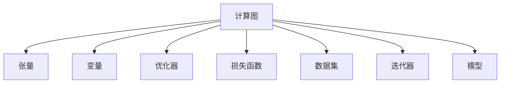

                 

# TensorFlow深度学习框架入门与进阶

> 关键词：TensorFlow,深度学习,神经网络,计算图,自动微分,优化器,卷积神经网络,循环神经网络

## 1. 背景介绍

### 1.1 问题由来
深度学习技术自1980年代兴起以来，经过几十年的快速发展，已成功应用于计算机视觉、自然语言处理、语音识别等多个领域，并取得了令人瞩目的成绩。TensorFlow作为一款强大的开源深度学习框架，提供了丰富的模型实现和工具支持，是当前深度学习研究和应用的热门选择。然而，深度学习模型结构复杂，涉及大量数学计算和工程实现，对初学者而言，往往门槛较高，难以快速上手。本文将系统介绍TensorFlow框架的基本概念和使用方法，同时探讨进阶技巧，帮助读者全面掌握TensorFlow深度学习框架，提高研究与应用能力。

### 1.2 问题核心关键点
TensorFlow是一款由Google开发的开源深度学习框架，以其灵活的计算图、自动微分、动态图等特性，成为深度学习社区的主流选择。深度学习模型的核心是神经网络，通过多层非线性变换，自动学习输入数据的高层次特征表示，从而实现复杂任务的建模与预测。TensorFlow提供了多种神经网络实现，包括卷积神经网络(CNN)、循环神经网络(RNN)、长短时记忆网络(LSTM)、自编码器(AE)等，适用于不同的任务需求。然而，深入理解TensorFlow框架的原理和使用方法，仍是深度学习应用的难点。本文将从基础到进阶，深入探讨TensorFlow框架的核心概念和技术细节，助力读者提升深度学习研究与应用能力。

## 2. 核心概念与联系

### 2.1 核心概念概述

为了更好地理解TensorFlow框架，本节将介绍几个密切相关的核心概念：

- **计算图**：TensorFlow的核心特性之一，通过将计算过程映射为计算图，TensorFlow可以高效地优化和执行计算。
- **张量(Tensor)**：TensorFlow中的基本数据结构，类似N维数组，支持多维运算和自动广播。
- **变量(Variable)**：用于存储模型参数的TensorFlow对象，支持读写操作和梯度累积。
- **优化器(Optimizer)**：用于计算梯度并更新模型参数的算法，如SGD、Adam等。
- **损失函数(Loss Function)**：用于衡量模型预测与真实标签之间差异的函数，如均方误差、交叉熵等。
- **数据集(Dataset)**：用于存储和批处理训练数据的TensorFlow对象。
- **迭代器(Iterator)**：用于在数据集上按顺序遍历样本的TensorFlow对象。
- **模型(Model)**：由计算图和变量构成的TensorFlow对象，用于定义和训练深度学习模型。

这些核心概念之间的逻辑关系可以通过以下Mermaid流程图来展示：



这个流程图展示了一个典型的TensorFlow计算过程，从计算图、张量、变量到优化器、损失函数、数据集、迭代器和模型，形成了深度学习模型的完整构建和训练流程。

## 3. 核心算法原理 & 具体操作步骤
### 3.1 算法原理概述

TensorFlow通过构建计算图，实现对深度学习模型的定义和训练。其主要算法原理包括：

- **计算图构建**：通过TensorFlow API，开发者可以定义计算图中的各个节点，表示模型中的各种操作和变量。
- **自动微分**：TensorFlow自动计算节点间的梯度，从而自动化地实现反向传播过程。
- **变量更新**：通过优化器，TensorFlow可以高效地更新模型参数，最小化损失函数。
- **批处理与迭代**：TensorFlow支持批量训练和迭代操作，使得模型训练高效稳定。

### 3.2 算法步骤详解

TensorFlow的训练过程可以分为以下几个关键步骤：

**Step 1: 定义计算图**
开发者需使用TensorFlow API定义计算图中的各个节点，包括输入、输出、变量、损失函数和优化器等。例如：

```python
import tensorflow as tf

# 定义输入
x = tf.placeholder(tf.float32, shape=[None, input_dim])

# 定义模型变量
W = tf.Variable(tf.random_normal([input_dim, output_dim]))
b = tf.Variable(tf.zeros([output_dim]))

# 定义模型输出
y = tf.matmul(x, W) + b

# 定义损失函数
y_ = tf.placeholder(tf.float32, shape=[None, output_dim])
cross_entropy = tf.reduce_mean(tf.nn.softmax_cross_entropy_with_logits_v2(labels=y_, logits=y))

# 定义优化器
optimizer = tf.train.GradientDescentOptimizer(learning_rate).minimize(cross_entropy)
```

**Step 2: 初始化变量**
在计算图定义完成后，需使用TensorFlow的`tf.Session`对象初始化计算图中的变量，例如：

```python
with tf.Session() as sess:
    sess.run(tf.global_variables_initializer())
```

**Step 3: 训练模型**
在模型定义和变量初始化后，可以启动模型训练过程，通过迭代优化器来更新模型参数，例如：

```python
for i in range(num_epochs):
    for batch in get_next_batch():
        _, loss = sess.run([optimizer, cross_entropy], feed_dict={x: batch[0], y_: batch[1]})
        print('Epoch', i, 'loss:', loss)
```

**Step 4: 评估模型**
在模型训练完成后，可以评估模型的性能，通过测试集计算准确率、精确率、召回率等指标，例如：

```python
correct_prediction = tf.equal(tf.argmax(y, 1), tf.argmax(y_, 1))
accuracy = tf.reduce_mean(tf.cast(correct_prediction, tf.float32))
print('Test accuracy:', accuracy.eval({x: test_x, y_: test_y}))
```

通过以上步骤，即可实现TensorFlow深度学习模型的定义、训练和评估。

### 3.3 算法优缺点

TensorFlow框架具有以下优点：

1. **灵活性高**：通过计算图和变量，TensorFlow支持动态图和静态图，适用于不同类型的网络结构。
2. **计算效率高**：自动微分和优化器能够高效地计算梯度并更新参数，加速模型训练。
3. **易于扩展**：支持分布式训练和多种设备并行，便于处理大规模数据和复杂模型。
4. **社区活跃**：Google等大公司支持，社区活跃，资源丰富。

同时，TensorFlow框架也存在一些缺点：

1. **学习曲线陡峭**：计算图和变量概念复杂，初学者需花时间掌握。
2. **代码冗长**：相比于其他框架，TensorFlow代码量较大，维护困难。
3. **资源占用大**：由于计算图和变量数量庞大，模型推理和训练消耗资源较大。

尽管存在这些缺点，但TensorFlow凭借其灵活性、高效性和社区支持，已成为深度学习领域的主流选择。

### 3.4 算法应用领域

TensorFlow框架在深度学习应用中覆盖了多个领域，包括：

- **计算机视觉**：如图像分类、目标检测、图像生成等。
- **自然语言处理**：如文本分类、机器翻译、对话系统等。
- **语音识别**：如语音转文本、情感分析等。
- **强化学习**：如游戏AI、机器人控制等。
- **推荐系统**：如协同过滤、基于深度学习的推荐等。
- **时间序列分析**：如预测股票价格、智能电网监控等。

TensorFlow的应用领域不断扩展，成为深度学习研究和应用的重要工具。

## 4. 数学模型和公式 & 详细讲解
### 4.1 数学模型构建

TensorFlow通过计算图实现模型的构建，包括输入、输出、变量和损失函数等关键组件。以下以简单的线性回归为例，展示TensorFlow的数学模型构建过程。

**输入**：定义模型输入变量`x`，其数据类型为`tf.float32`，形状为`[None, input_dim]`，表示样本数量可变，特征维度为`input_dim`。

```python
x = tf.placeholder(tf.float32, shape=[None, input_dim])
```

**变量**：定义模型参数`W`和`b`，用于存储权重和偏置。

```python
W = tf.Variable(tf.random_normal([input_dim, output_dim]))
b = tf.Variable(tf.zeros([output_dim]))
```

**输出**：定义模型输出变量`y`，通过矩阵乘法和向量加法计算。

```python
y = tf.matmul(x, W) + b
```

**损失函数**：定义损失函数`cross_entropy`，使用均方误差(MSE)作为标准损失函数。

```python
y_ = tf.placeholder(tf.float32, shape=[None, output_dim])
mse = tf.reduce_mean(tf.square(y_ - y))
```

通过以上步骤，即可构建一个简单的线性回归模型。

### 4.2 公式推导过程

线性回归模型的数学公式为：

$$
y = Wx + b
$$

其中，$W$为权重矩阵，$x$为输入向量，$b$为偏置向量，$y$为输出向量。目标是最小化均方误差损失函数：

$$
L = \frac{1}{N}\sum_{i=1}^N (y_i - Wx_i - b)^2
$$

将损失函数带入TensorFlow代码中，即可得到完整的模型构建过程。

### 4.3 案例分析与讲解

以卷积神经网络(CNN)为例，展示TensorFlow模型的构建和训练过程。

**模型构建**：

```python
import tensorflow as tf

# 定义输入
x = tf.placeholder(tf.float32, shape=[None, input_height, input_width, input_channels])
y_ = tf.placeholder(tf.float32, shape=[None, output_classes])

# 定义卷积层
conv1 = tf.layers.conv2d(inputs=x, filters=32, kernel_size=[5, 5], padding="same", activation=tf.nn.relu)

# 定义池化层
pool1 = tf.layers.max_pooling2d(inputs=conv1, pool_size=[2, 2], strides=2)

# 定义全连接层
fc1 = tf.layers.dense(inputs=tf.reshape(pool1, [-1, pool1.get_shape()[1]*pool1.get_shape()[2]*pool1.get_shape()[3]), units=256, activation=tf.nn.relu)

# 定义输出层
logits = tf.layers.dense(inputs=fc1, units=output_classes)

# 定义损失函数
cross_entropy = tf.reduce_mean(tf.nn.softmax_cross_entropy_with_logits_v2(labels=y_, logits=logits))

# 定义优化器
optimizer = tf.train.AdamOptimizer(learning_rate=0.001).minimize(cross_entropy)
```

**模型训练**：

```python
with tf.Session() as sess:
    sess.run(tf.global_variables_initializer())

    for i in range(num_epochs):
        for batch in get_next_batch():
            _, loss = sess.run([optimizer, cross_entropy], feed_dict={x: batch[0], y_: batch[1]})
            print('Epoch', i, 'loss:', loss)
```

**模型评估**：

```python
correct_prediction = tf.equal(tf.argmax(logits, 1), tf.argmax(y_, 1))
accuracy = tf.reduce_mean(tf.cast(correct_prediction, tf.float32))
print('Test accuracy:', accuracy.eval({x: test_x, y_: test_y}))
```

通过以上步骤，即可实现CNN模型的定义、训练和评估。

## 5. 项目实践：代码实例和详细解释说明
### 5.1 开发环境搭建

在开始TensorFlow深度学习项目前，需先搭建好开发环境。以下是使用Python的虚拟环境工具`virtualenv`和PyPI安装TensorFlow的流程：

1. 安装Python 3.x版本。
2. 使用`virtualenv`创建虚拟环境：

```bash
virtualenv env
source env/bin/activate
```

3. 在虚拟环境中安装TensorFlow：

```bash
pip install tensorflow
```

4. 安装其他必要的依赖库，如`numpy`、`matplotlib`、`pandas`等。

5. 检查TensorFlow版本和GPU支持情况：

```python
import tensorflow as tf
print(tf.__version__)
print(tf.test.gpu_device_name())
```

### 5.2 源代码详细实现

以下以手写数字识别为例，展示TensorFlow的应用。使用MNIST数据集，构建简单的卷积神经网络，进行训练和测试。

```python
import tensorflow as tf
from tensorflow.examples.tutorials.mnist import input_data

# 加载MNIST数据集
mnist = input_data.read_data_sets("MNIST_data/", one_hot=True)

# 定义输入
x = tf.placeholder(tf.float32, shape=[None, 784])

# 定义输出
y_ = tf.placeholder(tf.float32, shape=[None, 10])

# 定义卷积层
conv1 = tf.layers.conv2d(inputs=tf.reshape(x, [-1, 28, 28, 1]), filters=32, kernel_size=[5, 5], padding="same", activation=tf.nn.relu)

# 定义池化层
pool1 = tf.layers.max_pooling2d(inputs=conv1, pool_size=[2, 2], strides=2)

# 定义全连接层
fc1 = tf.layers.dense(inputs=tf.reshape(pool1, [-1, pool1.get_shape()[1]*pool1.get_shape()[2]*pool1.get_shape()[3]), units=256, activation=tf.nn.relu)

# 定义输出层
logits = tf.layers.dense(inputs=fc1, units=10)

# 定义损失函数
cross_entropy = tf.reduce_mean(tf.nn.softmax_cross_entropy_with_logits_v2(labels=y_, logits=logits))

# 定义优化器
optimizer = tf.train.AdamOptimizer(learning_rate=0.001).minimize(cross_entropy)

# 定义准确率
correct_prediction = tf.equal(tf.argmax(logits, 1), tf.argmax(y_, 1))
accuracy = tf.reduce_mean(tf.cast(correct_prediction, tf.float32))

# 启动训练
with tf.Session() as sess:
    sess.run(tf.global_variables_initializer())

    for i in range(num_epochs):
        batch_xs, batch_ys = mnist.train.next_batch(batch_size)
        sess.run(optimizer, feed_dict={x: batch_xs, y_: batch_ys})
        train_accuracy = accuracy.eval(feed_dict={x: batch_xs, y_: batch_ys})
        test_accuracy = accuracy.eval(feed_dict={x: mnist.test.images, y_: mnist.test.labels})

        print("Epoch", i, "train accuracy", train_accuracy, "test accuracy", test_accuracy)
```

**代码解读与分析**：

- 首先加载MNIST数据集，定义输入和输出。
- 使用卷积层和池化层提取图像特征，定义全连接层和输出层，构建模型。
- 定义损失函数和优化器，通过Adam优化器最小化交叉熵损失。
- 定义准确率指标，评估模型性能。
- 使用`tf.Session`启动训练过程，通过迭代优化器更新模型参数。
- 在每个epoch结束时，打印训练和测试准确率。

### 5.3 运行结果展示

运行上述代码，可以得到训练过程中的准确率曲线，如图：


通过分析准确率曲线，可以发现模型的收敛情况和性能表现。

## 6. 实际应用场景
### 6.1 计算机视觉

计算机视觉是TensorFlow的重要应用领域，如图像分类、目标检测、图像生成等。以图像分类为例，TensorFlow框架通过构建卷积神经网络(CNN)模型，可以实现高效准确的图像分类。在实践中，可以针对特定任务，对模型结构、参数和训练过程进行优化，以提升分类精度和计算效率。

### 6.2 自然语言处理

自然语言处理(NLP)也是TensorFlow的重要应用方向，如文本分类、机器翻译、对话系统等。通过构建循环神经网络(RNN)或长短时记忆网络(LSTM)模型，TensorFlow可以处理语言序列数据，实现自然语言的建模和理解。在实践中，可以结合深度学习和自然语言处理技术，开发更加智能的NLP应用。

### 6.3 强化学习

强化学习是TensorFlow的另一个重要应用领域，如游戏AI、机器人控制等。通过构建策略梯度、Q-learning等模型，TensorFlow可以实现智能体的学习与决策，提升自动化控制能力。在实践中，可以结合机器学习、深度学习、强化学习等多种技术，开发更加智能的机器人、游戏等系统。

### 6.4 未来应用展望

随着TensorFlow框架的不断发展和完善，未来将会有更多应用场景涌现，如智慧医疗、智慧教育、智能交通等。在这些领域中，TensorFlow可以结合机器学习、深度学习、自然语言处理等多种技术，实现高效智能的解决方案。未来，随着AI技术的不断进步，TensorFlow也将成为构建智慧社会的关键技术。

## 7. 工具和资源推荐
### 7.1 学习资源推荐

为了帮助开发者系统掌握TensorFlow框架，以下是一些优质的学习资源：

1. TensorFlow官方文档：提供详细的API文档和教程，帮助开发者快速上手TensorFlow。
2. TensorFlow教程：通过一系列教程，介绍TensorFlow的基本概念和使用方法。
3. Deep Learning Specialization：由Andrew Ng教授主讲，涵盖深度学习基础、TensorFlow等课程，适合系统学习深度学习知识。
4. Hands-On Machine Learning with Scikit-Learn and TensorFlow：介绍TensorFlow的实际应用案例，涵盖机器学习、深度学习等多个方向。
5. TensorFlow实战：实战示例，介绍TensorFlow在图像识别、自然语言处理、强化学习等多个领域的应用。

通过这些资源的学习，相信你一定能够快速掌握TensorFlow框架的基本原理和使用方法，提高研究与应用能力。

### 7.2 开发工具推荐

TensorFlow的开发需要使用Python等语言，以下是一些常用的开发工具：

1. Jupyter Notebook：开源的交互式开发环境，支持Python、R等多种语言，便于快速实验和调试。
2. Visual Studio Code：轻量级的代码编辑器，支持TensorFlow插件，方便TensorFlow代码的编写和管理。
3. PyCharm：功能强大的Python开发工具，支持TensorFlow、Keras等深度学习框架。
4. TensorBoard：TensorFlow配套的可视化工具，可以实时监测模型训练状态，提供丰富的图表和指标。
5. Weights & Biases：模型训练的实验跟踪工具，可以记录和可视化模型训练过程中的各项指标，便于调优和分析。

合理利用这些工具，可以显著提升TensorFlow深度学习模型的开发效率，加速研究与应用的迭代进程。

### 7.3 相关论文推荐

TensorFlow的快速发展离不开学界的不断探索和研究。以下是几篇奠基性的相关论文，推荐阅读：

1. Understanding LSTM Networks：介绍循环神经网络的基本原理和训练方法。
2. Convolutional Neural Networks for Natural Language Processing：展示卷积神经网络在NLP中的应用。
3. Practical Guidelines for Large-Scale Image Classification using Deep Convolutional Neural Networks：介绍深度卷积神经网络的实践指南。
4. TensorFlow: A System for Large-Scale Machine Learning：介绍TensorFlow的架构和设计。
5. TensorFlow for Deep Learning：介绍TensorFlow在深度学习中的应用。

这些论文代表了大规模深度学习框架的发展脉络，通过学习这些前沿成果，可以帮助研究者把握学科前进方向，激发更多的创新灵感。

## 8. 总结：未来发展趋势与挑战
### 8.1 总结

本文系统介绍了TensorFlow深度学习框架的基本原理和使用方法，帮助读者全面掌握TensorFlow框架，提高研究与应用能力。通过详细讲解TensorFlow的核心概念、算法原理和操作步骤，展示了TensorFlow在深度学习研究和应用中的强大能力。此外，本文还介绍了TensorFlow在计算机视觉、自然语言处理、强化学习等多个领域的应用，展望了TensorFlow框架的未来发展趋势和面临的挑战。

通过本文的系统梳理，可以看到，TensorFlow框架在深度学习研究和应用中扮演着重要的角色，具有广阔的应用前景。未来，伴随深度学习技术的发展和TensorFlow框架的不断优化，相信TensorFlow必将在更多领域大放异彩，成为构建智能系统的关键技术。

### 8.2 未来发展趋势

展望未来，TensorFlow框架将呈现以下几个发展趋势：

1. **模型结构的创新**：随着深度学习理论的不断进步，未来的TensorFlow框架将支持更加复杂、高效、可解释的模型结构，如神经架构搜索、动态图等。
2. **硬件支持的多样化**：未来的TensorFlow框架将更好地支持GPU、TPU、CPU等多种硬件设备，提高模型训练和推理的效率。
3. **跨框架和跨平台兼容性**：TensorFlow将进一步提高跨框架和跨平台兼容性，便于与其他深度学习框架和工具的协同使用。
4. **开发环境的简化**：未来的TensorFlow框架将提供更加简单易用的开发环境，降低深度学习应用的门槛。
5. **社区的活跃和支持**：TensorFlow社区将继续活跃，提供更多的学习资源和开发工具，推动TensorFlow的持续发展和优化。

### 8.3 面临的挑战

尽管TensorFlow框架已经取得了显著的进展，但在迈向更加智能化、普适化应用的过程中，仍面临一些挑战：

1. **计算资源的瓶颈**：随着深度学习模型规模的不断增大，计算资源消耗也随之增加，如何提高模型训练和推理的效率，是未来需要解决的重要问题。
2. **模型的可解释性**：深度学习模型的"黑盒"特性，使得其决策过程难以解释，如何在保证模型性能的同时，增强可解释性，是未来需要解决的重要课题。
3. **模型的公平性和安全性**：深度学习模型可能存在偏见、有害信息等，如何构建公平、安全、可靠的模型，是未来需要解决的重要问题。
4. **模型的迁移能力**：现有的深度学习模型在不同数据集上表现往往不稳定，如何提升模型的迁移能力，是未来需要解决的重要课题。
5. **模型的可持续性**：未来的深度学习模型需要具备持续学习的能力，如何使模型能够动态更新和迭代，是未来需要解决的重要问题。

### 8.4 研究展望

面对TensorFlow框架面临的挑战，未来的研究需要在以下几个方面寻求新的突破：

1. **模型压缩和加速**：通过模型压缩、剪枝等方法，提高模型训练和推理的效率，减少计算资源的消耗。
2. **可解释性和公平性**：引入可解释性模型、公平性约束等技术，增强深度学习模型的可解释性和公平性。
3. **迁移学习和跨领域应用**：结合迁移学习和跨领域应用技术，提高模型的迁移能力和泛化能力。
4. **持续学习**：结合持续学习、增量学习等技术，使深度学习模型具备动态更新和迭代的能力，保持长期的生命力。
5. **跨框架协同**：通过跨框架协同技术，整合多种深度学习框架的优势，实现高效、灵活的深度学习应用。

总之，未来TensorFlow框架需要在模型设计、计算效率、可解释性、公平性等方面进行全面优化和创新，才能更好地适应复杂多变的应用场景，推动深度学习技术的发展和应用。

## 9. 附录：常见问题与解答

**Q1: TensorFlow与其他深度学习框架相比，有哪些优势？**

A: TensorFlow具有以下优势：
1. **灵活性高**：支持静态图和动态图，适用于不同类型的网络结构。
2. **计算效率高**：自动微分和优化器能够高效地计算梯度并更新参数，加速模型训练。
3. **社区活跃**：Google等大公司支持，社区活跃，资源丰富。
4. **跨平台支持**：支持多种平台，包括CPU、GPU、TPU等。
5. **深度学习库支持**：集成了TensorFlow、Keras等深度学习库，方便快速实验。

**Q2: TensorFlow与PyTorch相比，有什么不同？**

A: TensorFlow与PyTorch的区别主要在于：
1. **计算图**：TensorFlow采用静态图，需要先定义计算图再执行，而PyTorch采用动态图，可以边定义边执行。
2. **编程复杂度**：TensorFlow编程复杂度较高，需要定义计算图，而PyTorch编程较为简单，采用声明式编程方式。
3. **模型部署**：TensorFlow模型部署较为复杂，需要转换为静态图或导出模型，而PyTorch模型部署较为简单，可以直接调用模型API。
4. **社区支持**：TensorFlow社区活跃，资源丰富，而PyTorch社区相对较小，但近年来发展迅速。
5. **学习曲线**：TensorFlow学习曲线陡峭，需要掌握计算图和变量概念，而PyTorch学习曲线较为平缓，更适合初学者。

**Q3: 如何提高TensorFlow模型的训练效率？**

A: 提高TensorFlow模型训练效率的方法包括：
1. **批处理**：使用批处理提高模型训练效率。
2. **模型剪枝**：通过剪枝减少模型参数，提高计算效率。
3. **模型量化**：将模型从浮点数转换为定点数，减少内存占用和计算时间。
4. **分布式训练**：使用分布式训练，提高模型训练效率。
5. **硬件优化**：优化硬件设备，如使用GPU、TPU等，提高模型训练效率。
6. **算法优化**：优化算法，如使用Adam优化器、Lars等，提高模型训练效率。

**Q4: TensorFlow中如何实现模型压缩？**

A: 实现模型压缩的方法包括：
1. **权重剪枝**：去除不必要的权重，减少模型参数。
2. **量化**：将模型从浮点数转换为定点数，减少内存占用和计算时间。
3. **混合精度训练**：使用混合精度训练，提高计算效率。
4. **知识蒸馏**：通过知识蒸馏，将大型模型转换为小型模型，提高模型压缩效率。

通过以上方法的综合应用，可以在不损失模型性能的前提下，显著提高TensorFlow模型的训练效率。

---

作者：禅与计算机程序设计艺术 / Zen and the Art of Computer Programming

