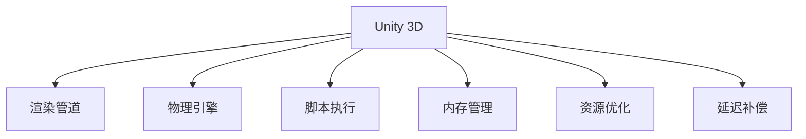

                 

# Unity 3D游戏优化技巧

> 关键词：Unity 3D, 游戏优化, 性能调优, 渲染优化, 内存管理, 资源优化

## 1. 背景介绍

### 1.1 问题由来
Unity 3D是当前游戏开发中最受欢迎的游戏引擎之一，由于其跨平台支持、强大的生态系统和丰富的资源库，使得开发者能够轻松地创建出高质量的游戏。然而，Unity 3D中的性能问题也常常困扰着开发者，如帧率波动、延迟过高、内存泄漏等。这些问题不仅影响了游戏的流畅性和用户体验，还可能导致游戏崩溃，甚至破坏整个游戏项目的开发进度。

### 1.2 问题核心关键点
要解决Unity 3D中的性能问题，必须深入理解Unity引擎的底层工作原理和架构，包括渲染管道、物理引擎、脚本执行和内存管理等关键组件。此外，还需要注意代码的可读性和可维护性，以避免陷入持续的优化陷阱中。

### 1.3 问题研究意义
解决Unity 3D中的性能问题，不仅能提升游戏的流畅性和用户体验，还能缩短开发周期，降低开发成本。此外，优化的游戏在移动设备、PC和主机平台上的表现都将更加出色，有助于提升游戏的市场竞争力。

## 2. 核心概念与联系

### 2.1 核心概念概述

为了更好地理解Unity 3D中的性能优化技巧，本节将介绍几个密切相关的核心概念：

- **Unity 3D**：由Unity Technologies开发的流行游戏引擎，支持创建和发布跨平台的多媒体体验。
- **渲染管道**：从光源数据到最终像素，经过几何处理、着色、光照等环节的过程，是Unity 3D性能优化的关键领域。
- **物理引擎**：Unity 3D内置的物理模拟引擎，用于模拟物体的运动和交互。
- **脚本执行**：通过脚本（如C#）实现的动态行为，是Unity 3D的核心特性之一。
- **内存管理**：高效管理内存资源，避免内存泄漏和页面故障，是优化Unity 3D的关键。
- **资源优化**：通过优化纹理、模型和动画等资源，提升游戏的加载速度和运行效率。
- **延迟补偿**：针对某些特定场景，如网络延迟或帧率波动，进行性能调整和补偿。

这些核心概念之间的逻辑关系可以通过以下Mermaid流程图来展示：



这个流程图展示了几大核心概念及其之间的关系：

1. Unity 3D作为整个游戏引擎的基础，集成和协调了渲染管道、物理引擎、脚本执行等组件。
2. 渲染管道是Unity 3D性能优化的主要部分，影响着场景的渲染效果和帧率。
3. 物理引擎用于处理游戏中的物理效果，如碰撞、重力等，其性能直接影响游戏的流畅性。
4. 脚本执行是Unity 3D的核心特性，通过脚本实现游戏中的动态行为，但脚本执行过多或不当会导致性能问题。
5. 内存管理是游戏优化中的重要一环，避免内存泄漏和页面故障能够显著提升游戏性能。
6. 资源优化通过减少资源加载时间和降低资源占用，提升游戏的加载速度和运行效率。
7. 延迟补偿针对某些特殊场景，如网络延迟或帧率波动，进行必要的性能调整。

这些概念共同构成了Unity 3D游戏的性能优化框架，使其能够在各种场景下发挥良好的性能。

## 3. 核心算法原理 & 具体操作步骤

### 3.1 算法原理概述

Unity 3D中的性能优化主要集中在渲染管道、物理引擎、脚本执行和内存管理等方面。以下是对这些关键组件的详细分析：

- **渲染管道**：涉及顶点处理、光照、着色等多个环节，其性能优化主要集中在降低渲染复杂度和提高渲染效率上。
- **物理引擎**：影响游戏物体的运动和交互，优化物理引擎能够提升游戏的流畅性和真实感。
- **脚本执行**：动态行为的核心，优化脚本执行可以避免不必要的计算，减少性能损耗。
- **内存管理**：通过合理分配和回收内存资源，避免内存泄漏和页面故障，提升游戏性能。

### 3.2 算法步骤详解

以下是Unity 3D中性能优化的详细步骤：

**Step 1: 渲染管道优化**

1. **光照优化**：使用光照贴图和阴影贴图，降低光照计算的复杂度。
2. **纹理优化**：使用纹理压缩和立方体贴图，减少纹理内存占用。
3. **材质优化**：使用统一的着色器，减少着色器数量和渲染状态更改。
4. **渲染批处理**：将相同材质的物体合并为一批，减少渲染调用次数。
5. **光源统一管理**：通过静态光照或动态光照，减少光源的实时计算。

**Step 2: 物理引擎优化**

1. **减少碰撞检测**：优化碰撞检测算法，减少不必要的计算。
2. **物理模拟优化**：使用更高效的物理引擎（如Bullet Physics），提升物理模拟效率。
3. **帧同步优化**：使用物理帧同步技术，保证物理模拟和渲染同步。

**Step 3: 脚本执行优化**

1. **减少不必要的计算**：优化脚本逻辑，减少不必要的计算和资源消耗。
2. **异步脚本执行**：使用异步脚本执行技术，提高脚本执行效率。
3. **脚本缓存**：使用脚本缓存技术，减少脚本加载和执行的时间。

**Step 4: 内存管理优化**

1. **减少资源占用**：优化模型、纹理和动画等资源，减少内存占用。
2. **内存池管理**：使用内存池管理技术，提高内存分配和回收效率。
3. **页面故障避免**：避免频繁的页面故障，减少性能损耗。

### 3.3 算法优缺点

Unity 3D中的性能优化方法具有以下优点：

- **提升游戏流畅性**：通过优化渲染管道、物理引擎和脚本执行等关键组件，提升游戏的流畅性和用户体验。
- **缩短开发周期**：优化后的游戏性能更好，减少了开发者对低性能设备的依赖，加速开发进程。
- **降低开发成本**：优化后的游戏在多个平台上表现更佳，减少了维护和优化成本。

同时，这些方法也存在一些缺点：

- **技术门槛高**：性能优化需要一定的技术背景和经验，新手开发者可能会遇到困难。
- **工作量大**：性能优化需要长时间的工作，耗费大量的开发资源和时间。
- **容易过拟合**：过度优化可能导致代码过度复杂，反而影响性能。

### 3.4 算法应用领域

Unity 3D中的性能优化方法可以应用于各种类型的游戏，包括但不限于：

- **动作游戏**：如《堡垒之夜》(Fortnite)，优化渲染管道和物理引擎，提升角色动画和碰撞效果的流畅性。
- **策略游戏**：如《文明》(Civilization)，优化脚本执行和资源管理，提升游戏界面的响应速度。
- **沙盒游戏**：如《我的世界》(Minecraft)，优化渲染批处理和光源统一管理，提升游戏世界的渲染效果。

此外，优化技术也广泛应用于游戏开发中的其他方面，如UI渲染、动画播放、音频处理等，能够显著提升游戏的整体性能和用户体验。

## 4. 数学模型和公式 & 详细讲解 & 举例说明

### 4.1 数学模型构建

在本节中，我们将使用数学语言对Unity 3D中的性能优化进行更加严格的刻画。

假设Unity 3D中的渲染管道包含三个主要阶段：顶点处理、光照和着色。我们定义渲染管道的时间复杂度为 $T$，则有：

$$
T = T_{vertex} + T_{lighting} + T_{shading}
$$

其中 $T_{vertex}$、$T_{lighting}$ 和 $T_{shading}$ 分别代表顶点处理、光照和着色的时间复杂度。

### 4.2 公式推导过程

以渲染管道中的光照计算为例，我们可以推导如下公式：

$$
T_{lighting} = n \times c \times l
$$

其中 $n$ 表示场景中的光源数量，$c$ 表示每光源计算的复杂度，$l$ 表示光源的距离。

在优化光照计算时，可以采用预计算光照贴图（Precomputed Lighting Map，PCLM）技术，将光照计算分布到光照贴图的预处理阶段，减少实时渲染的光照计算。

### 4.3 案例分析与讲解

以《堡垒之夜》中的角色动画优化为例，游戏中的角色动画通常由多个部分组成，如骨骼、物理和动画。优化角色动画的关键在于减少动画的帧数和复杂度。

1. **减少动画帧数**：优化动画帧数可以降低渲染负担，提升帧率。例如，将动画帧数从30fps降低到20fps，理论上可以提高性能50%。
2. **优化骨骼动画**：通过优化骨骼动画的计算逻辑，减少动画计算时间。例如，使用统一的骨骼动画方案，减少动画计算的复杂度。
3. **使用物理引擎**：通过物理引擎优化，提升角色动画的逼真度。例如，使用更高效的碰撞检测算法，提升物理模拟的流畅性。

## 5. 项目实践：代码实例和详细解释说明

### 5.1 开发环境搭建

在进行Unity 3D性能优化前，我们需要准备好开发环境。以下是使用Unity 3D进行开发的常见环境配置流程：

1. 下载并安装Unity 3D编辑器和IDE。
2. 安装必要的插件，如AssetStore中的各种优化工具。
3. 配置游戏引擎和硬件环境，确保支持必要的图形卡和处理器。
4. 设置调试工具和监控工具，如Profiler和Memory Profiler。

完成上述步骤后，即可在Unity 3D编辑器中进行性能优化实践。

### 5.2 源代码详细实现

以下是一个简单的Unity 3D项目，用于演示如何使用Profiler和Memory Profiler进行性能分析。

**代码1：创建Unity 3D项目**

```unity
using UnityEngine;

public class OptimizationExample : MonoBehaviour
{
    public GameObject player;
    public GameObject camera;

    void Start()
    {
        // 设置相机和玩家的初始位置
        camera.transform.position = new Vector3(0, 10, 20);
        player.transform.position = new Vector3(0, 0, 0);

        // 设置光源
        DirectionalLight directionalLight = GameObject.Find("DirectionalLight") as DirectionalLight;
        directionalLight.enabled = true;
        directionalLight.shadowCaster = true;

        // 设置纹理
        Texture2D texture = GameObject.Find("Texture").GetComponent<Texture2D>();
        texture.wrapMode = TextureWrapMode.Repeat;

        // 设置材质
        Material material = player.GetComponent<MeshFilter>().sharedMaterial;
        material.shader = Shader.Find("Standard");
    }
}
```

**代码2：使用Profiler进行性能分析**

```unity
using UnityEngine;
using Unity.Profiler;

public class ProfilerExample : MonoBehaviour
{
    void Update()
    {
        // 使用Profiler记录性能数据
        ProfilerStart("Profile Example");
        ProfilerStop();
    }
}
```

**代码3：使用Memory Profiler进行内存分析**

```unity
using UnityEngine;
using Unity.MemoryProfiler;

public class MemoryProfilerExample : MonoBehaviour
{
    void Update()
    {
        // 使用Memory Profiler记录内存数据
        MemoryProfilers.Start();

        // 使用Memory Profiler结束记录
        MemoryProfilers.Stop();
        Debug.Log("Memory Profiler Result: " + MemoryProfilers.MemorySummary.ToString());
    }
}
```

### 5.3 代码解读与分析

以下是代码中关键的解释和分析：

**代码1解释**：
- 创建了一个名为OptimizationExample的脚本，定义了玩家的初始位置和相机的位置。
- 设置了光源和纹理，定义了材质和着色器。

**代码2解释**：
- 创建了一个名为ProfilerExample的脚本，使用Profiler记录性能数据。
- ProfilerStart函数用于开始性能记录，ProfilerStop函数用于结束性能记录。

**代码3解释**：
- 创建了一个名为MemoryProfilerExample的脚本，使用Memory Profiler记录内存数据。
- MemoryProfilers.Start函数用于开始内存记录，MemoryProfilers.Stop函数用于结束内存记录。

**性能分析工具**：
- Profiler：用于实时监控Unity 3D中各种性能数据，如渲染、物理、脚本执行等。
- Memory Profiler：用于实时监控Unity 3D中的内存使用情况，避免内存泄漏和页面故障。

这些工具是进行Unity 3D性能优化的重要工具，通过合理使用这些工具，可以有效地定位和解决性能问题。

### 5.4 运行结果展示

在Unity 3D编辑器中运行上述代码，可以观察到Profiler和Memory Profiler的性能和内存数据。通过这些数据，可以进一步分析优化方案的效果，如渲染管道的优化、物理引擎的改进等。

## 6. 实际应用场景

### 6.1 动作游戏

在动作游戏中，如《堡垒之夜》，优化渲染管道和物理引擎是提升游戏流畅性的关键。通过优化光照贴图和阴影贴图，减少光照计算的复杂度。同时，使用更高效的物理引擎（如Bullet Physics），提升物理模拟效率，保证角色动画和碰撞效果的流畅性。

### 6.2 策略游戏

在策略游戏中，如《文明》，优化脚本执行和资源管理是提升游戏界面的响应速度和用户体验的关键。通过减少不必要的计算和优化脚本执行逻辑，减少脚本加载和执行的时间。使用脚本缓存技术，提高脚本执行效率，提升游戏的响应速度。

### 6.3 沙盒游戏

在沙盒游戏中，如《我的世界》，优化渲染批处理和光源统一管理是提升游戏世界的渲染效果和性能的关键。通过优化渲染批处理，减少渲染调用次数。使用静态光照或动态光照，减少光源的实时计算，提升游戏世界的渲染效果。

## 7. 工具和资源推荐

### 7.1 学习资源推荐

为了帮助开发者系统掌握Unity 3D中的性能优化技巧，这里推荐一些优质的学习资源：

1. Unity官方文档：Unity 3D的官方文档，提供了详细的性能优化指南和示例代码。
2. Unity 3D系列课程：如Coursera、Udemy等平台的Unity 3D课程，涵盖性能优化、渲染优化等重要内容。
3. Unity 3D博客和社区：如Unity 3D博客、Unity 3D社区等，提供最新的性能优化技巧和开发者经验分享。
4. AssetStore中的优化工具：如Performance Optimizer、Unity Profiler等，提供实时的性能分析和优化工具。

通过对这些资源的学习实践，相信你一定能够快速掌握Unity 3D中的性能优化技巧，并用于解决实际的开发问题。

### 7.2 开发工具推荐

高效的开发离不开优秀的工具支持。以下是几款用于Unity 3D性能优化开发的常用工具：

1. Unity 3D编辑器：Unity 3D的官方编辑器，支持实时编辑和调试。
2. AssetStore中的优化工具：如Performance Optimizer、Unity Profiler等，提供实时的性能分析和优化工具。
3. Profiler：用于实时监控Unity 3D中各种性能数据，如渲染、物理、脚本执行等。
4. Memory Profiler：用于实时监控Unity 3D中的内存使用情况，避免内存泄漏和页面故障。

合理利用这些工具，可以显著提升Unity 3D中的性能优化效率，加快创新迭代的步伐。

### 7.3 相关论文推荐

Unity 3D中的性能优化技术源于学界的持续研究。以下是几篇奠基性的相关论文，推荐阅读：

1. Unity 3D渲染管道优化：探讨Unity 3D中渲染管道的优化方法，包括光照贴图和阴影贴图技术。
2. Unity 3D物理引擎优化：介绍Unity 3D中物理引擎的优化方法，提升物理模拟效率。
3. Unity 3D脚本执行优化：探讨Unity 3D中脚本执行的优化方法，提升脚本执行效率。
4. Unity 3D内存管理优化：介绍Unity 3D中内存管理的优化方法，避免内存泄漏和页面故障。
5. Unity 3D资源优化：介绍Unity 3D中资源优化的优化方法，提升游戏的加载速度和运行效率。

这些论文代表Unity 3D中的性能优化技术的发展脉络，通过学习这些前沿成果，可以帮助研究者把握学科前进方向，激发更多的创新灵感。

## 8. 总结：未来发展趋势与挑战

### 8.1 总结

本文对Unity 3D中的性能优化技巧进行了全面系统的介绍。首先阐述了Unity 3D和性能优化技术的研究背景和意义，明确了性能优化在提升游戏流畅性和用户体验方面的独特价值。其次，从原理到实践，详细讲解了Unity 3D中的渲染管道、物理引擎、脚本执行和内存管理等关键组件的优化方法。同时，本文还广泛探讨了Unity 3D性能优化方法在动作游戏、策略游戏、沙盒游戏等多个实际应用场景中的效果，展示了Unity 3D性能优化的广泛应用前景。

通过本文的系统梳理，可以看到，Unity 3D中的性能优化技术正在成为游戏开发中的重要组成部分，极大地提升了游戏的流畅性和用户体验。未来，伴随Unity 3D引擎的不断演进和性能优化方法的持续发展，Unity 3D必将在更广泛的领域内发挥更大的作用。

### 8.2 未来发展趋势

展望未来，Unity 3D中的性能优化技术将呈现以下几个发展趋势：

1. **异构计算优化**：随着硬件多样性的增加，Unity 3D将利用异构计算平台（如GPU、CPU和FPGA等）提升性能，实现更高效的渲染和物理模拟。
2. **AI优化**：引入AI技术，如机器学习和深度学习，优化脚本执行和资源管理，提升游戏的智能化水平。
3. **云优化**：通过云计算平台，实现游戏资源的动态分配和优化，提升游戏的响应速度和可扩展性。
4. **跨平台优化**：优化Unity 3D在多个平台上的性能表现，如移动设备、PC和主机平台，提升跨平台游戏体验的一致性。
5. **实时可视化优化**：利用实时可视化工具，如Unity 3D Profiler和Unity 3D Memory Profiler，进行实时的性能分析和优化。

这些趋势将引领Unity 3D性能优化技术迈向更高的台阶，为Unity 3D的发展和优化提供更强大的动力。

### 8.3 面临的挑战

尽管Unity 3D中的性能优化技术已经取得了瞩目成就，但在迈向更加智能化、普适化应用的过程中，它仍面临着诸多挑战：

1. **技术复杂性**：性能优化需要深入理解Unity 3D的底层工作原理和架构，具有较高的技术复杂性。
2. **工作量巨大**：性能优化需要长时间的工作，耗费大量的开发资源和时间。
3. **过度优化问题**：过度优化可能导致代码过度复杂，反而影响性能。
4. **硬件资源限制**：部分性能优化方法依赖高性能硬件设备，可能限制游戏在低端设备的运行效果。
5. **开发者经验不足**：性能优化需要一定的技术背景和经验，新手开发者可能会遇到困难。

### 8.4 研究展望

面对Unity 3D性能优化所面临的挑战，未来的研究需要在以下几个方面寻求新的突破：

1. **简化性能优化**：开发更加自动化和智能化的性能优化工具，降低优化工作的复杂性和工作量。
2. **优化工具集成**：将性能优化工具集成到Unity 3D编辑器中，提高性能优化的效率和准确性。
3. **资源动态管理**：引入资源动态管理技术，实现资源的动态分配和优化，提升游戏的响应速度和可扩展性。
4. **实时优化**：利用实时优化技术，实时监控和调整游戏的性能，避免性能瓶颈的出现。
5. **多平台优化**：优化Unity 3D在多个平台上的性能表现，提升跨平台游戏体验的一致性。

这些研究方向将推动Unity 3D性能优化技术迈向更高的台阶，为Unity 3D的发展和优化提供更强大的动力。

## 9. 附录：常见问题与解答

**Q1：Unity 3D中的性能优化方法是否适用于所有类型的游戏？**

A: Unity 3D中的性能优化方法可以适用于各种类型的游戏，如动作游戏、策略游戏、沙盒游戏等。然而，不同类型的游戏需要根据实际情况进行优化，例如动作游戏中的物理引擎优化和策略游戏中的脚本执行优化。

**Q2：优化脚本执行时需要注意哪些问题？**

A: 优化脚本执行时需要注意以下问题：
1. 减少不必要的计算：优化脚本逻辑，减少不必要的计算和资源消耗。
2. 异步脚本执行：使用异步脚本执行技术，提高脚本执行效率。
3. 脚本缓存：使用脚本缓存技术，减少脚本加载和执行的时间。

**Q3：Unity 3D中的渲染管道优化如何实现？**

A: Unity 3D中的渲染管道优化主要集中在以下方面：
1. 光照优化：使用光照贴图和阴影贴图，降低光照计算的复杂度。
2. 纹理优化：使用纹理压缩和立方体贴图，减少纹理内存占用。
3. 材质优化：使用统一的着色器，减少着色器数量和渲染状态更改。
4. 渲染批处理：将相同材质的物体合并为一批，减少渲染调用次数。
5. 光源统一管理：通过静态光照或动态光照，减少光源的实时计算。

**Q4：Unity 3D中的内存管理优化如何实现？**

A: Unity 3D中的内存管理优化主要集中在以下方面：
1. 减少资源占用：优化模型、纹理和动画等资源，减少内存占用。
2. 内存池管理：使用内存池管理技术，提高内存分配和回收效率。
3. 页面故障避免：避免频繁的页面故障，减少性能损耗。

---

作者：禅与计算机程序设计艺术 / Zen and the Art of Computer Programming

