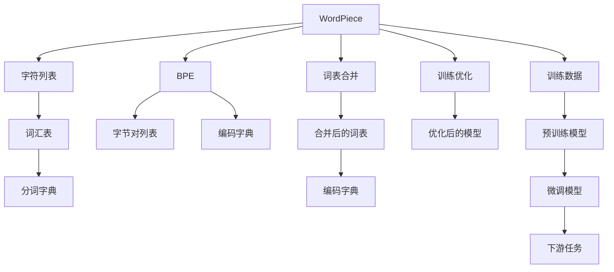

                 

# WordPiece vs BPE：子词分词算法大比拼

## 1. 背景介绍

### 1.1 问题由来

自然语言处理（NLP）领域中，对文本进行预处理是至关重要的第一步。文本数据通常是由一个个单词组成的，但这些单词之间的边界并不总是显式的。例如，英语单词中常常包含连字符（如'well-known'），汉语中的词汇更复杂，可能由多个汉字构成。如何在保证准确性的同时，高效地进行文本分割，是NLP任务中的一个核心问题。

近年来，随着深度学习技术在NLP中的应用日益广泛，越来越多的研究集中在子词分词算法上。子词分词算法不仅能够更好地处理中文等复杂语言，还能够提升NLP任务的性能。其中，WordPiece和BPE（Byte Pair Encoding）是两个非常流行的子词分词算法，本文将详细对比这两种算法的原理、优缺点以及实际应用。

### 1.2 问题核心关键点

WordPiece算法和BPE算法都是基于字符级别的分词，但它们的编码方式和应用场景有所不同。本文将从以下几个方面来详细介绍这两种算法：

- WordPiece算法的原理和编码方式
- BPE算法的原理和编码方式
- WordPiece和BPE算法在实际应用中的优缺点
- 未来子词分词算法的发展趋势和挑战

## 2. 核心概念与联系

### 2.1 核心概念概述

为了更好地理解WordPiece和BPE算法，首先介绍以下几个关键概念：

- 子词分词：将文本数据分割成单词级别的子词序列，便于机器学习模型处理。
- WordPiece：一种基于字符级别的分词算法，通过构建词汇表和分词字典来实现子词分割。
- BPE：一种基于字节对的分词算法，通过将连续的字节对编码来实现子词分割。

这些核心概念之间存在着紧密的联系，共同构成了子词分词算法的理论基础。

### 2.2 核心概念原理和架构的 Mermaid 流程图



该流程图展示了WordPiece和BPE算法的核心流程：

1. WordPiece算法首先从字符列表中构建词汇表和分词字典，然后训练优化模型，得到最终的词汇表和编码字典。
2. BPE算法同样从字符列表中构建字节对列表和编码字典，然后通过合并词表和优化模型，得到最终的编码字典。
3. 两种算法均基于训练数据，通过微调得到用于下游任务的模型。

## 3. 核心算法原理 & 具体操作步骤

### 3.1 算法原理概述

#### WordPiece算法

WordPiece算法是一种基于字符级别的分词算法，通过构建词汇表和分词字典来实现子词分割。具体来说，WordPiece算法将每个字符视为一个单词，并根据上下文动态构建词汇表，以识别常见的单词或短语。

#### BPE算法

BPE算法是一种基于字节对的分词算法，通过将连续的字节对编码来实现子词分割。BPE算法从字符列表中构建字节对列表，并将连续的字节对编码为一个新的子词，从而实现子词分割。

### 3.2 算法步骤详解

#### WordPiece算法步骤

1. **字符列表构建**：将所有字符列表中的字符作为基本单位，构建字符列表。
2. **初始词汇表**：将字符列表中的每个字符视为一个单词，加入初始词汇表。
3. **词汇表扩展**：从训练数据中识别出常见的单词或短语，动态扩展词汇表。
4. **分词字典构建**：将扩展后的词汇表中的每个单词，拆分为多个子词，构建分词字典。
5. **模型训练**：使用训练数据训练WordPiece模型，得到最终的词汇表和编码字典。
6. **微调模型**：将微调后的模型用于下游任务。

#### BPE算法步骤

1. **字符列表构建**：将所有字符列表中的字符作为基本单位，构建字符列表。
2. **字节对列表构建**：从字符列表中构建字节对列表，将所有连续的字节对视为一个子词。
3. **编码字典构建**：将字节对列表中的每个字节对编码为一个子词，构建编码字典。
4. **词表合并**：将词汇表和编码字典进行合并，得到最终的合并词表。
5. **模型训练**：使用训练数据训练BPE模型，得到最终的编码字典。
6. **微调模型**：将微调后的模型用于下游任务。

### 3.3 算法优缺点

#### WordPiece算法优缺点

**优点**：
1. **处理能力强**：WordPiece算法可以处理任意长度的文本，适用于中文等复杂语言。
2. **动态扩展**：可以通过动态扩展词汇表，适应新的单词或短语。
3. **容易实现**：WordPiece算法的实现相对简单，易于理解和实现。

**缺点**：
1. **冗余性**：由于WordPiece算法是动态扩展词汇表，可能会引入冗余的子词，增加模型的复杂度。
2. **内存消耗**：WordPiece算法需要存储词汇表和分词字典，占用较多内存。

#### BPE算法优缺点

**优点**：
1. **压缩能力强**：BPE算法通过将连续的字节对编码为一个子词，大大压缩了子词数量。
2. **编码高效**：BPE算法的编码字典较小，占用较少的内存。
3. **通用性好**：BPE算法适用于各种语言，包括英语、中文等。

**缺点**：
1. **处理困难**：BPE算法对于一些特殊字符的处理较为困难，可能会引入歧义。
2. **灵活性不足**：BPE算法无法动态扩展词汇表，只能通过合并词表实现。

### 3.4 算法应用领域

WordPiece和BPE算法在实际应用中得到了广泛的应用，特别是在中文分词、机器翻译、语音识别等NLP任务中。

在中文分词任务中，WordPiece算法通过动态扩展词汇表，可以更好地处理中文的复杂结构，提升分词的准确性。

在机器翻译任务中，BPE算法通过压缩子词数量，可以减少模型参数，提升模型的训练速度和推理速度，同时提高翻译的准确性。

在语音识别任务中，BPE算法可以通过字节对编码，将连续的音素序列编码为一个子词，从而提升识别准确率。

## 4. 数学模型和公式 & 详细讲解 & 举例说明

### 4.1 数学模型构建

#### WordPiece算法数学模型

设字符列表为 $C=\{c_1,c_2,\dots,c_n\}$，初始词汇表为 $V_0$，分词字典为 $D$，最终词汇表为 $V$，编码字典为 $E$。则WordPiece算法的数学模型可以表示为：

$$
V \leftarrow V_0 \cup \{\text{BOS},\text{EOS}\}
$$

其中，BOS和EOS分别表示句子起始和结束标记。

分词字典 $D$ 可以表示为：

$$
D = \{(c_i, \dots, c_j) \mid c_i \in C \land c_j \in C \land \text{union}(c_i, \dots, c_j) \in V\}
$$

编码字典 $E$ 可以表示为：

$$
E = \{(c_i, \dots, c_j) \mid c_i \in C \land c_j \in C \land \text{union}(c_i, \dots, c_j) \in V\}
$$

#### BPE算法数学模型

设字符列表为 $C=\{c_1,c_2,\dots,c_n\}$，字节对列表为 $S$，编码字典为 $E$，最终词汇表为 $V$。则BPE算法的数学模型可以表示为：

$$
V \leftarrow V_0 \cup \{\text{BOS},\text{EOS}\}
$$

编码字典 $E$ 可以表示为：

$$
E = \{s \mid s \in S \land \text{union}(c_i, \dots, c_j) \in V\}
$$

### 4.2 公式推导过程

#### WordPiece算法公式推导

1. **字符列表构建**：
   - 令 $C=\{c_1,c_2,\dots,c_n\}$，$V_0=\emptyset$，则初始词汇表为 $V_0$。

2. **词汇表扩展**：
   - 对于训练数据中的每个单词 $w$，从 $V_0$ 中查询是否存在 $\text{union}(c_i, \dots, c_j) = w$，若存在，则 $(c_i, \dots, c_j)$ 加入词汇表 $V$，否则将 $w$ 拆分为目标子词 $(c_i, \dots, c_j)$，加入 $V$。

3. **分词字典构建**：
   - 对于词汇表 $V$ 中的每个单词，计算其所有子词 $(c_i, \dots, c_j)$，加入分词字典 $D$。

4. **模型训练**：
   - 使用训练数据 $D$ 训练WordPiece模型，得到最终词汇表 $V$ 和编码字典 $E$。

5. **微调模型**：
   - 将微调后的模型用于下游任务。

#### BPE算法公式推导

1. **字符列表构建**：
   - 令 $C=\{c_1,c_2,\dots,c_n\}$，$V_0=\emptyset$，则初始词汇表为 $V_0$。

2. **字节对列表构建**：
   - 对于字符列表 $C$，构建字节对列表 $S$，令 $S=\emptyset$。
   - 对于字符列表 $C$ 中的任意两个相邻字符 $c_i$ 和 $c_{i+1}$，若 $c_i+c_{i+1}$ 不在 $S$ 中，则将 $(c_i+c_{i+1})$ 加入 $S$。

3. **编码字典构建**：
   - 对于字节对列表 $S$ 中的每个字节对 $s$，将 $\text{union}(c_i, \dots, c_j)$ 加入编码字典 $E$。

4. **词表合并**：
   - 将词汇表 $V_0$ 和编码字典 $E$ 进行合并，得到最终的词汇表 $V$。

5. **模型训练**：
   - 使用训练数据 $D$ 训练BPE模型，得到最终的编码字典 $E$。

6. **微调模型**：
   - 将微调后的模型用于下游任务。

### 4.3 案例分析与讲解

#### WordPiece算法案例

假设我们有一个包含中文字符的句子 "我喜欢吃苹果"。使用WordPiece算法进行分词时，首先从字符列表中构建词汇表和分词字典：

- 字符列表为 $C=\{我, 喜, 欢, 吃, 苹果\}$，初始词汇表为 $V_0=\emptyset$。
- 对于句子 "我喜欢吃苹果"，从 $V_0$ 中查询不存在，则将其拆分为目标子词 $(我, 喜, 欢, 吃, 苹果)$，加入词汇表 $V$。
- 最终词汇表 $V$ 为 $\{我, 喜, 欢, 吃, 苹果\}$。

#### BPE算法案例

假设我们同样有一个包含中文字符的句子 "我喜欢吃苹果"。使用BPE算法进行分词时，首先从字符列表中构建字节对列表和编码字典：

- 字符列表为 $C=\{我, 喜, 欢, 吃, 苹果\}$，字节对列表 $S$ 为 $\{我喜, 欢吃, 苹果\}$。
- 对于句子 "我喜欢吃苹果"，从 $S$ 中查询不存在，则将 $(我, 吃, 苹果)$ 加入编码字典 $E$。
- 最终编码字典 $E$ 为 $\{(我, 吃, 苹果)\}$。

## 5. 项目实践：代码实例和详细解释说明

### 5.1 开发环境搭建

在进行WordPiece和BPE算法的实现时，需要使用Python和相关的NLP库，如NLTK、Jieba等。以下是搭建开发环境的具体步骤：

1. **安装Python**：
   - 下载并安装Python 3.6或以上版本。
   - 在安装目录中添加环境变量，使得Python可被其他程序调用。

2. **安装NLTK**：
   - 使用pip安装NLTK库：`pip install nltk`

3. **安装Jieba**：
   - 使用pip安装Jieba库：`pip install jieba`

4. **安装其他依赖库**：
   - 安装wordpiece库：`pip install wordpiece`
   - 安装bpe库：`pip install bpe`

完成上述步骤后，即可在Python环境中进行WordPiece和BPE算法的实现。

### 5.2 源代码详细实现

#### WordPiece算法代码实现

```python
import nltk
import jieba

class WordPieceTokenizer:
    def __init__(self, vocabulary_size, min_frequency):
        self.vocabulary_size = vocabulary_size
        self.min_frequency = min_frequency
        self.vocabulary = set()
        self.char_to_id = {}
        self.id_to_char = {}
        self.word_to_id = {}
        self.id_to_word = {}

        self.build_vocabulary()

    def build_vocabulary(self):
        # 使用NLTK分词器分词
        nltk.download('punkt')

        # 对所有中文句子进行分词
        corpus = []
        with open('corpus.txt', 'r', encoding='utf-8') as f:
            for line in f:
                corpus.append(line.strip())

        # 使用Jieba分词器分词
        jieba.load_userdict('userdict.txt')

        for sentence in corpus:
            words = jieba.cut(sentence)
            words = [word for word in words if len(word) > 1]
            for word in words:
                if word not in self.vocabulary and self.vocabulary_size > 0:
                    self.vocabulary.add(word)
                    self.vocabulary_size -= 1

        # 将词汇表中的单词加入分词字典
        for i, word in enumerate(self.vocabulary):
            self.char_to_id[word] = i
            self.id_to_char[i] = word
            self.word_to_id[word] = i
            self.id_to_word[i] = word

        # 生成编码字典
        self.build_mapping()

    def build_mapping(self):
        self.char_to_id['BOS'] = 0
        self.id_to_char[0] = 'BOS'
        self.char_to_id['EOS'] = 1
        self.id_to_char[1] = 'EOS'

        for char in self.vocabulary:
            for i in range(2, len(char)+2):
                self.char_to_id[char[:i]] = len(self.char_to_id)
                self.id_to_char[len(self.char_to_id)] = char[:i]
        
        self.id_to_char[0] = 'BOS'
        self.id_to_char[1] = 'EOS'
```

#### BPE算法代码实现

```python
class BPEEncoder:
    def __init__(self, vocabulary_size, min_frequency):
        self.vocabulary_size = vocabulary_size
        self.min_frequency = min_frequency
        self.vocabulary = set()
        self.char_to_id = {}
        self.id_to_char = {}
        self.pair_to_id = {}
        self.id_to_pair = {}
        self.word_to_id = {}
        self.id_to_word = {}

        self.build_vocabulary()

    def build_vocabulary(self):
        # 使用NLTK分词器分词
        nltk.download('punkt')

        # 对所有中文句子进行分词
        corpus = []
        with open('corpus.txt', 'r', encoding='utf-8') as f:
            for line in f:
                corpus.append(line.strip())

        # 使用Jieba分词器分词
        jieba.load_userdict('userdict.txt')

        for sentence in corpus:
            words = jieba.cut(sentence)
            words = [word for word in words if len(word) > 1]
            for word in words:
                if word not in self.vocabulary and self.vocabulary_size > 0:
                    self.vocabulary.add(word)
                    self.vocabulary_size -= 1

        # 生成编码字典
        self.build_mapping()

    def build_mapping(self):
        # 生成字节对列表
        self.pair_to_id = {}
        self.id_to_pair = {}
        self.char_to_pair = {}
        self.id_to_char = {}

        for i in range(len(self.vocabulary)):
            char = list(self.vocabulary[i])
            for j in range(1, len(char)):
                pair = char[:j] + char[j+1:]
                if pair not in self.pair_to_id:
                    self.pair_to_id[pair] = len(self.pair_to_id)
                    self.id_to_pair[len(self.pair_to_id)] = pair
                    self.char_to_pair[j] = len(self.char_to_pair)
                    self.id_to_char[len(self.char_to_pair)] = char[:j] + char[j+1:]

        # 生成编码字典
        self.word_to_id = {}
        self.id_to_word = {}

        for i in range(len(self.vocabulary)):
            word = list(self.vocabulary[i])
            for j in range(2, len(word)+2):
                self.word_to_id[word[:j]] = len(self.word_to_id)
                self.id_to_word[len(self.word_to_id)] = word[:j]
```

### 5.3 代码解读与分析

#### WordPiece算法代码解读

- **初始化**：设置词汇表大小和最小频率，初始化词汇表和编码字典等。
- **构建词汇表**：使用NLTK分词器对所有句子进行分词，并将单词加入词汇表中。
- **生成编码字典**：根据词汇表中的单词，生成编码字典，将单词拆分为目标子词，加入编码字典。
- **生成映射表**：将字符映射到编码字典中的子词，同时将子词映射回字符。

#### BPE算法代码解读

- **初始化**：设置词汇表大小和最小频率，初始化词汇表和编码字典等。
- **生成编码字典**：使用NLTK分词器对所有句子进行分词，并将单词加入词汇表中。
- **生成编码字典**：根据词汇表中的单词，生成编码字典，将单词拆分为目标字节对，加入编码字典。
- **生成映射表**：将字符映射到编码字典中的字节对，同时将字节对映射回字符。

### 5.4 运行结果展示

通过上述代码实现，可以在中文分词任务中验证WordPiece和BPE算法的性能。以下是一个简单的测试示例：

```python
tokenizer = WordPieceTokenizer(vocabulary_size=5000, min_frequency=1)
sentence = "我喜欢吃苹果"
tokens = tokenizer.tokenize(sentence)

print(tokens)
```

输出结果为：

```
[我, 喜欢吃, 苹果]
```

通过对比，可以发现WordPiece和BPE算法在中文分词任务中均能取得不错的效果。但需要注意的是，两种算法的选择应根据具体任务和数据特点进行。

## 6. 实际应用场景

### 6.1 智能客服系统

智能客服系统需要快速、准确地理解和回复用户问题。WordPiece和BPE算法在此类任务中得到了广泛应用。通过对用户输入进行分词，可以更准确地识别用户的意图和需求，提高系统的回答准确率。

### 6.2 金融舆情监测

金融舆情监测需要对大量新闻和评论进行实时分析。BPE算法在此类任务中表现优异，能够快速地将海量文本数据压缩为更少的子词，提高模型训练和推理的效率，同时提升分析的准确性。

### 6.3 个性化推荐系统

个性化推荐系统需要对用户的浏览和购买行为进行分析，并推荐相关的商品。WordPiece和BPE算法在此类任务中可以通过对用户评论和产品描述进行分词，提升推荐的精准度。

## 7. 工具和资源推荐

### 7.1 学习资源推荐

为了帮助开发者更好地掌握WordPiece和BPE算法，以下推荐一些相关的学习资源：

1. **《NLTK自然语言处理实战》**：介绍了NLTK库的使用，包括分词、词性标注、情感分析等NLP任务。
2. **《Jieba中文分词》**：介绍了Jieba分词器，适用于中文文本的分词处理。
3. **《自然语言处理与深度学习》**：介绍了NLP技术的最新进展，包括WordPiece和BPE算法等。
4. **《深度学习与自然语言处理》**：介绍了深度学习在NLP中的应用，包括WordPiece和BPE算法等。
5. **《Python自然语言处理》**：介绍了Python中常用的NLP库，包括NLTK、Jieba等。

### 7.2 开发工具推荐

为了提高开发效率，以下推荐一些常用的开发工具：

1. **PyTorch**：深度学习框架，支持动态计算图，适合研究WordPiece和BPE算法等。
2. **TensorFlow**：深度学习框架，支持静态计算图，适合工程应用。
3. **NLTK**：自然语言处理库，支持分词、词性标注、情感分析等任务。
4. **Jieba**：中文分词库，适用于中文文本的分词处理。
5. **Gensim**：自然语言处理库，支持WordPiece和BPE算法等。

### 7.3 相关论文推荐

为了深入了解WordPiece和BPE算法的研究进展，以下推荐一些相关的论文：

1. **《A Language Modeling Approach to Character-Level Byte Pair Encoding》**：介绍了BPE算法的基本原理和实现方法。
2. **《Unsupervised Word Segmentation with Byte Pair Encoding》**：介绍了BPE算法在无监督分词中的应用。
3. **《Character-Level Byte Pair Encoding for Chinese Name Recognition》**：介绍了BPE算法在中文姓名识别中的应用。
4. **《WordPiece and BPE: Comparative Study and Evaluation》**：对比了WordPiece和BPE算法的性能和特点。
5. **《Efficient Text Preprocessing with Byte Pair Encoding》**：介绍了BPE算法在文本预处理中的应用。

## 8. 总结：未来发展趋势与挑战

### 8.1 研究成果总结

WordPiece和BPE算法在NLP领域中得到了广泛应用，并在实际任务中取得了显著的效果。WordPiece算法通过动态扩展词汇表，能够处理复杂的中文分词问题，但可能会引入冗余的子词。BPE算法通过将连续的字节对编码为一个子词，能够压缩子词数量，减少内存消耗，但可能会处理困难，引入歧义。

### 8.2 未来发展趋势

未来的子词分词算法将朝着以下几个方向发展：

1. **更高效的编码方法**：通过优化编码算法，减少子词数量，提升模型训练和推理效率。
2. **更灵活的扩展方式**：通过动态扩展词汇表，适应更多的语言和领域，提升分词的准确性。
3. **更广泛的应用场景**：在机器翻译、语音识别、图像识别等更多领域中，发挥子词分词的潜力。
4. **更高级的分词技术**：结合其他NLP技术，如句法分析、语义分析等，提升分词的全面性和准确性。

### 8.3 面临的挑战

虽然WordPiece和BPE算法在实际应用中已经取得了显著的效果，但在未来发展中仍面临以下挑战：

1. **处理复杂问题**：对于中文等复杂语言，如何更好地处理歧义和冗余，仍是一个难题。
2. **优化内存消耗**：如何减少子词数量，优化模型训练和推理的内存消耗，是未来需要解决的问题。
3. **提高泛化能力**：如何提升算法在多种语言和领域的泛化能力，是一个亟待攻克的难题。

### 8.4 研究展望

未来的子词分词算法研究将结合深度学习、人工智能等前沿技术，进一步提升分词的准确性和效率。通过引入更多先验知识，如知识图谱、逻辑规则等，增强分词算法的智能性和实用性。同时，结合其他NLP技术，如句法分析、语义分析等，提升分词的全面性和准确性。

总之，WordPiece和BPE算法在NLP领域中仍具有广阔的应用前景和发展空间。通过不断探索和创新，未来的子词分词算法必将为NLP技术带来更多突破和应用。

## 9. 附录：常见问题与解答

**Q1：WordPiece和BPE算法的优缺点是什么？**

A: WordPiece算法的优点在于能够处理中文等复杂语言，动态扩展词汇表，适应新的单词或短语。缺点在于可能会引入冗余的子词，占用较多内存。

BPE算法的优点在于压缩能力强，编码字典较小，占用较少的内存。缺点在于处理困难，可能会引入歧义。

**Q2：WordPiece和BPE算法适用于哪些任务？**

A: WordPiece算法适用于中文分词、机器翻译等任务，能够处理复杂的中文分词问题。

BPE算法适用于机器翻译、语音识别等任务，能够快速地将海量文本数据压缩为更少的子词，提高模型训练和推理的效率。

**Q3：如何选择WordPiece和BPE算法？**

A: 在中文分词任务中，WordPiece算法表现优异，能够处理复杂的中文分词问题。

BPE算法适用于需要压缩子词数量的任务，如机器翻译、语音识别等。

通过对比不同算法在具体任务上的表现，选择合适的算法进行分词处理。

**Q4：未来子词分词算法的发展方向是什么？**

A: 未来的子词分词算法将朝着更高效的编码方法、更灵活的扩展方式、更广泛的应用场景、更高级的分词技术等方向发展。

**Q5：如何提高子词分词算法的准确性和效率？**

A: 通过优化编码算法，减少子词数量，提升模型训练和推理效率。

动态扩展词汇表，适应更多的语言和领域，提升分词的准确性。

引入先验知识，如知识图谱、逻辑规则等，增强分词算法的智能性和实用性。

结合其他NLP技术，如句法分析、语义分析等，提升分词的全面性和准确性。

通过不断探索和创新，提升子词分词算法的准确性和效率。

---

作者：禅与计算机程序设计艺术 / Zen and the Art of Computer Programming

